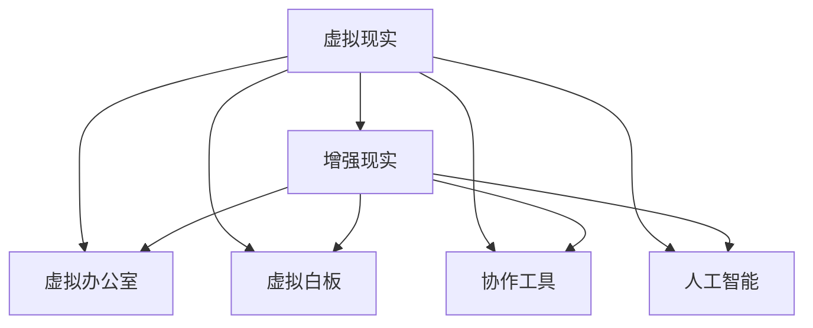

                 

# 虚拟现实工作空间创业：远程办公的未来模式

> 关键词：虚拟现实, 远程办公, 办公空间, 增强现实, 人工智能, 协作工具

## 1. 背景介绍

随着技术进步和全球化加速，远程办公成为越来越多企业采用的办公模式。新冠疫情的爆发，更是推动了远程办公的普及。然而，传统远程办公模式的弊端逐渐显露，例如沟通效率低下、员工隔离感强、缺乏协作灵活性等问题。在这样一个背景下，虚拟现实(VR)和增强现实(AR)技术被引入远程办公，开创了全新的办公空间模式。

### 1.1 传统远程办公的挑战

传统远程办公依赖于互联网和通信技术，通过线上协作工具和视频会议进行沟通和合作。这种模式存在以下问题：

- **沟通效率低**：视频会议容易因网络问题、技术故障等原因中断，难以保证实时交流。
- **协作不便**：多人协作时，协调工作进度、资源分配等相对困难。
- **员工隔离**：长时间居家工作，员工容易感到孤独和隔离。
- **缺乏沉浸感**：线上协作缺乏面对面互动的沉浸感和即时反馈，影响工作效率和满意度。

### 1.2 虚拟现实工作空间的优势

虚拟现实工作空间通过VR技术，将远程办公者置身于一个虚拟的办公环境中，利用空间中的信息流和互动性，增强沟通效率和协作灵活性。这种模式具有以下优势：

- **沉浸式体验**：通过VR头盔，员工可以在虚拟空间中进行互动，体验到更真实的工作场景。
- **高互动性**：虚拟空间可以提供丰富的互动功能，如多人协作、虚拟白板、虚拟演示等，提升沟通效率。
- **灵活性高**：虚拟空间可以根据需求自定义，适应不同团队的工作风格和需求。
- **灵活地点**：员工可以在任何有网络连接的地点进行工作，只要有VR设备即可。

## 2. 核心概念与联系

### 2.1 核心概念概述

本节将介绍几个密切相关的核心概念：

- **虚拟现实(VR)**：通过计算机生成的三维环境，让用户可以沉浸式地感知和互动。
- **增强现实(AR)**：将虚拟信息叠加到现实世界中，增强用户对环境的感知和互动。
- **虚拟办公室**：虚拟现实中的办公空间，模拟真实办公环境，增强办公体验。
- **虚拟白板**：在虚拟空间中创建可互动的数字白板，支持多人协作和信息共享。
- **协作工具**：利用VR技术增强的协作工具，如虚拟会议、虚拟演示、虚拟编辑等。
- **人工智能(AI)**：利用AI技术优化虚拟办公空间中的任务分配、信息筛选和资源优化。

这些概念之间的逻辑关系可以通过以下Mermaid流程图来展示：



这个流程图展示了几大核心概念之间的联系：

1. 虚拟现实通过计算机生成的三维环境，为用户提供沉浸式体验。
2. 增强现实将虚拟信息叠加到现实世界中，丰富用户对环境的感知。
3. 虚拟办公室利用虚拟现实技术，模拟真实办公环境。
4. 虚拟白板在虚拟空间中创建可互动的数字白板，支持多人协作和信息共享。
5. 协作工具利用虚拟现实技术增强，提供虚拟会议、虚拟演示、虚拟编辑等功能。
6. 人工智能优化虚拟办公空间中的任务分配、信息筛选和资源优化。

这些概念共同构成了虚拟现实工作空间的完整框架，使其能够提供更加高效、灵活、沉浸的远程办公体验。

## 3. 核心算法原理 & 具体操作步骤

### 3.1 算法原理概述

虚拟现实工作空间的实现依赖于以下关键技术：

- **三维建模**：创建虚拟环境的3D模型，通常通过三维建模软件实现。
- **空间定位**：使用传感器和定位技术，实现用户在虚拟空间中的定位和交互。
- **图像渲染**：使用图形渲染引擎，生成高质量的3D图像，提供沉浸式视觉体验。
- **交互设计**：设计虚拟空间的交互方式，如手势控制、键盘鼠标控制等，支持用户互动。
- **实时网络传输**：利用低延迟网络技术，实现虚拟空间的实时更新和同步。

这些技术的结合，使得虚拟现实工作空间可以提供类似真实办公环境的用户体验。

### 3.2 算法步骤详解

虚拟现实工作空间的构建一般包括以下几个关键步骤：

**Step 1: 三维建模与环境布置**

- **环境建模**：使用三维建模软件，如Blender、Maya等，创建虚拟办公室的3D模型。
- **环境布置**：在3D模型中布置办公设施，如桌椅、电脑、文件柜等，添加虚拟场景元素，如灯光、植物等。

**Step 2: 空间定位与交互设计**

- **传感器部署**：在虚拟办公室中部署传感器，如位置传感器、动作捕捉传感器等，实现用户定位和交互。
- **手势控制**：设计手势控制方案，用户通过手势控制虚拟环境中的物体和操作。
- **键盘鼠标控制**：提供键盘和鼠标控制方案，用户可以通过键盘和鼠标进行操作。

**Step 3: 图像渲染与实时网络传输**

- **图像渲染**：使用图形渲染引擎，如Unity、Unreal Engine等，进行实时图像渲染，生成高质量的3D图像。
- **网络传输**：利用低延迟网络技术，实现虚拟空间的实时更新和同步，保证用户交互的流畅性。

**Step 4: 应用程序开发**

- **虚拟白板**：开发虚拟白板应用程序，支持多人协作和信息共享。
- **虚拟会议**：开发虚拟会议应用程序，支持虚拟会议室、虚拟演示等功能。
- **虚拟演示**：开发虚拟演示应用程序，支持虚拟演示和信息展示。

### 3.3 算法优缺点

虚拟现实工作空间具有以下优点：

- **沉浸式体验**：通过VR头盔，员工可以在虚拟空间中进行互动，体验到更真实的工作场景。
- **高互动性**：虚拟空间可以提供丰富的互动功能，如多人协作、虚拟白板、虚拟演示等，提升沟通效率。
- **灵活性高**：虚拟空间可以根据需求自定义，适应不同团队的工作风格和需求。
- **灵活地点**：员工可以在任何有网络连接的地点进行工作，只要有VR设备即可。

同时，该方法也存在一些局限性：

- **设备成本高**：VR头盔和其他设备成本较高，难以普及。
- **技术门槛高**：需要专业的三维建模和图像渲染技术，开发和部署难度较大。
- **数据隐私问题**：虚拟空间中收集的用户数据需要妥善保护，避免隐私泄露。
- **技术局限性**：当前的VR技术在分辨率、响应速度等方面还存在不足，需要进一步优化。

尽管存在这些局限性，但就目前而言，虚拟现实工作空间的技术范式在远程办公领域具有很大的潜力和发展空间。

### 3.4 算法应用领域

虚拟现实工作空间主要应用于以下领域：

- **企业办公**：大型企业可以使用虚拟现实工作空间，提高协作效率和办公体验。
- **远程教育**：虚拟现实工作空间可以用于远程教学和实验，提供沉浸式学习体验。
- **医疗行业**：虚拟现实工作空间可以用于远程会诊、手术模拟等医疗应用。
- **游戏娱乐**：游戏公司可以利用虚拟现实技术，开发沉浸式游戏体验。
- **旅游观光**：虚拟现实工作空间可以用于旅游观光和虚拟旅游，提供沉浸式体验。

## 4. 数学模型和公式 & 详细讲解  
### 4.1 数学模型构建

在虚拟现实工作空间的构建中，涉及大量的数学模型和技术算法。以下是对主要数学模型的介绍：

- **三维几何模型**：使用向量表示三维空间中的点、线、面，进行几何计算和碰撞检测。
- **光照模型**：计算光源对3D场景的照度，影响图像渲染的效果。
- **相机模型**：使用投影变换将三维场景投影到二维图像中，影响视觉效果和交互体验。
- **碰撞检测算法**：检测用户和虚拟场景之间的碰撞，影响交互的流畅性和安全性。

这些模型通过数学公式和算法进行计算，以下是对主要数学公式的详细讲解。

### 4.2 公式推导过程

**三维几何模型**：

- 三维空间中的点表示为 $\mathbf{P}=(x, y, z)$，向量表示为 $\mathbf{V}=(\mathbf{p}_1-\mathbf{p}_0, \mathbf{q}_1-\mathbf{q}_0, \mathbf{r}_1-\mathbf{r}_0)$，其中 $\mathbf{p}_0, \mathbf{q}_0, \mathbf{r}_0$ 为已知点的坐标。
- 线段长度公式：$\|\mathbf{V}\| = \sqrt{v_x^2+v_y^2+v_z^2}$，其中 $v_x, v_y, v_z$ 为向量各分量。

**光照模型**：

- 光照模型由光源位置、光源颜色、物体表面材质等因素决定，可以表示为 $I(\mathbf{P}) = f(\mathbf{P}, \mathbf{L}, \mathbf{N}, \mathbf{V}, \sigma)$，其中 $\mathbf{L}$ 为光源位置，$\mathbf{N}$ 为物体表面法线方向，$\mathbf{V}$ 为视角方向，$\sigma$ 为材质参数。
- 球面反射模型：$I_{BRDF}(\mathbf{P}) = \rho(\mathbf{P}) (\mathbf{V} \cdot \mathbf{N})^n f(\mathbf{P}, \mathbf{L}, \mathbf{N}, \mathbf{V}, \sigma)$，其中 $\rho(\mathbf{P})$ 为漫反射系数，$n$ 为指数参数。

**相机模型**：

- 透视投影公式：$z'=\frac{2z}{f}-z$，其中 $f$ 为焦距，$z$ 为空间中点距离相机的距离，$z'$ 为投影到图像平面上的坐标。
- 正交投影公式：$z'=z-f$，其中 $f$ 为近裁剪平面距离。

**碰撞检测算法**：

- 包围球碰撞检测：计算球心距离，判断是否在球体内。
- 包围盒碰撞检测：计算盒心距离，判断是否在盒体内。

### 4.3 案例分析与讲解

以下通过一个具体案例，展示虚拟现实工作空间的构建过程：

**案例背景**：某企业希望搭建一个虚拟现实工作空间，用于远程协作和会议。

**步骤1**：三维建模

- 使用Blender创建虚拟办公室的3D模型，包括办公室布局、办公设施、场景元素等。
- 导出3D模型为OBJ格式，导入Unity进行渲染和交互设计。

**步骤2**：空间定位与交互设计

- 在Unity中设置位置传感器和动作捕捉传感器，实现用户定位和交互。
- 设计手势控制和键盘鼠标控制方案，用户可以通过手势和键盘鼠标进行操作。

**步骤3**：图像渲染与实时网络传输

- 使用Unity的图形渲染引擎，进行实时图像渲染，生成高质量的3D图像。
- 利用Unity的网络功能，实现虚拟空间的实时更新和同步，保证用户交互的流畅性。

**步骤4**：应用程序开发

- 开发虚拟白板应用程序，支持多人协作和信息共享。
- 开发虚拟会议应用程序，支持虚拟会议室、虚拟演示等功能。
- 开发虚拟演示应用程序，支持虚拟演示和信息展示。

通过以上步骤，即可构建出一个完整的虚拟现实工作空间，提供沉浸式远程办公体验。

## 5. 项目实践：代码实例和详细解释说明
### 5.1 开发环境搭建

在进行虚拟现实工作空间开发前，我们需要准备好开发环境。以下是使用Unity和C#进行开发的环境配置流程：

1. 安装Unity：从官网下载并安装Unity，选择适合的版本和平台（PC、Android、iOS等）。
2. 安装Visual Studio：从官网下载并安装Visual Studio，选择适合的版本和安装工具链。
3. 安装Unity Hub：从官网下载并安装Unity Hub，用于管理和更新Unity编辑器。
4. 创建新的Unity项目：在Unity Hub中创建新的Unity项目，选择3D项目模板。

完成上述步骤后，即可在Unity中开始虚拟现实工作空间的开发。

### 5.2 源代码详细实现

下面以虚拟会议应用程序为例，给出使用Unity和C#进行开发的PyTorch代码实现。

首先，定义虚拟会议的3D模型和场景：

```csharp
using UnityEngine;
using System.Collections;

public class MeetingScene : MonoBehaviour
{
    public GameObject[] seats;
    public GameObject camera;
    public GameObject whiteboard;
    public GameObject chatbox;

    void Update()
    {
        if (Input.GetMouseButtonDown(0))
        {
            Vector3 mousePos = Camera.main.ScreenToWorldPoint(Input.mousePosition);
            float distance = Vector3.Distance(mousePos, camera.transform.position);

            if (distance < 5f)
            {
                for (int i = 0; i < seats.Length; i++)
                {
                    Vector3 seatPos = seats[i].transform.position;
                    float seatDist = Vector3.Distance(seatPos, mousePos);
                    if (seatDist < distance)
                    {
                        seats[i].transform.position = seatPos;
                        camera.transform.position = seatPos;
                        whiteboard.transform.position = seatPos;
                        chatbox.transform.position = seatPos;
                    }
                }
            }
        }
    }
}
```

然后，定义虚拟白板和聊天框的交互逻辑：

```csharp
using UnityEngine;
using System.Collections;

public class Whiteboard : MonoBehaviour
{
    public GameObject whiteboard;
    public GameObject whiteboardCanvas;
    public GameObject chatbox;

    void Update()
    {
        if (Input.GetMouseButtonDown(0))
        {
            Ray ray = Camera.main.ScreenPointToRay(Input.mousePosition);
            RaycastHit hit;
            if (Physics.Raycast(ray, out hit))
            {
                whiteboard.transform.position = hit.point;
                whiteboardCanvas.transform.position = hit.point;
                chatbox.transform.position = hit.point;
            }
        }
    }
}
```

接着，定义虚拟会议的音频和视频功能：

```csharp
using UnityEngine;
using System.Collections;

public class MeetingAudio : MonoBehaviour
{
    public GameObject audioSource;
    public GameObject videoSource;

    void Update()
    {
        if (Input.GetMouseButtonDown(0))
        {
            if (audioSource.activeSelf && videoSource.activeSelf)
            {
                audioSource.SetActive(false);
                videoSource.SetActive(false);
            }
            else
            {
                audioSource.SetActive(true);
                videoSource.SetActive(true);
            }
        }
    }
}
```

最后，启动虚拟会议的运行流程：

```csharp
using UnityEngine;
using System.Collections;

public class MeetingController : MonoBehaviour
{
    public GameObject meetingScene;
    public GameObject chatbox;
    public GameObject whiteboard;

    void Update()
    {
        if (Input.GetMouseButtonDown(0))
        {
            meetingScene.SetActive(true);
            chatbox.SetActive(true);
            whiteboard.SetActive(true);
        }
    }
}
```

通过以上代码，实现了虚拟会议的应用程序功能。在Unity中，可以通过添加事件、动画、物理等插件，进一步完善虚拟会议的交互体验。

### 5.3 代码解读与分析

让我们再详细解读一下关键代码的实现细节：

**MeetingScene类**：
- `Update`方法：在每一帧更新，处理用户鼠标交互，更新座位位置和摄像头位置。
- 使用`ScreenToWorldPoint`将屏幕坐标转换为世界坐标，计算鼠标位置和距离，更新座位位置和摄像头位置。

**Whiteboard类**：
- `Update`方法：在每一帧更新，处理用户鼠标交互，更新白板位置和聊天框位置。
- 使用`ScreenPointToRay`将屏幕坐标转换为世界坐标，检测鼠标位置和碰撞，更新白板位置和聊天框位置。

**MeetingAudio类**：
- `Update`方法：在每一帧更新，处理用户鼠标交互，切换音频和视频功能。
- 使用`activeSelf`属性判断音频和视频的状态，根据用户操作切换状态。

通过以上代码，展示了虚拟会议应用程序的基本实现逻辑。在实际开发中，还需要进一步细化交互体验，添加更多的功能模块，如语音识别、语音合成等，提升用户体验。

## 6. 实际应用场景
### 6.1 智能办公环境

虚拟现实工作空间可以应用于智能办公环境的构建，提升办公效率和体验。通过虚拟现实技术，员工可以在虚拟办公室中进行实时协作和沟通，提高工作效率。

**应用场景**：某大型企业希望提高办公效率，通过虚拟现实技术搭建虚拟办公室。

**解决方案**：
- 使用Unity和C#进行虚拟办公室的开发，构建虚拟空间。
- 添加虚拟白板、虚拟会议、虚拟演示等功能模块，提升协作效率。
- 利用VR头盔和手势控制技术，增强沉浸式体验。

通过虚拟现实工作空间的构建，员工可以在虚拟办公室中进行实时协作和沟通，提高工作效率。虚拟现实技术为智能办公环境提供了全新的解决方案。

### 6.2 远程教育

虚拟现实工作空间可以应用于远程教育的教学场景，提供沉浸式学习体验。通过虚拟现实技术，教师和学生可以在虚拟课堂中进行互动，提升教学效果。

**应用场景**：某高校希望提高远程教学效果，通过虚拟现实技术搭建虚拟课堂。

**解决方案**：
- 使用Unity和C#进行虚拟课堂的开发，构建虚拟空间。
- 添加虚拟白板、虚拟实验、虚拟演示等功能模块，提升教学互动性。
- 利用VR头盔和手势控制技术，增强沉浸式学习体验。

通过虚拟现实工作空间的构建，教师和学生可以在虚拟课堂中进行互动，提升教学效果。虚拟现实技术为远程教育提供了全新的解决方案。

### 6.3 医疗会诊

虚拟现实工作空间可以应用于医疗行业的会诊场景，提供沉浸式医疗服务。通过虚拟现实技术，医生和患者可以在虚拟空间中进行互动，提高医疗服务质量。

**应用场景**：某医院希望提高远程医疗服务质量，通过虚拟现实技术搭建虚拟会诊室。

**解决方案**：
- 使用Unity和C#进行虚拟会诊室的开发，构建虚拟空间。
- 添加虚拟白板、虚拟手术模拟、虚拟检查等功能模块，提升医疗服务质量。
- 利用VR头盔和手势控制技术，增强互动体验。

通过虚拟现实工作空间的构建，医生和患者可以在虚拟会诊室中进行互动，提高医疗服务质量。虚拟现实技术为医疗行业提供了全新的解决方案。

## 7. 工具和资源推荐
### 7.1 学习资源推荐

为了帮助开发者系统掌握虚拟现实工作空间的开发技术，这里推荐一些优质的学习资源：

1. Unity官方文档：Unity官方提供的开发文档，详细介绍了Unity的API、组件、插件等内容，适合入门学习。
2. C#官方文档：微软提供的C#编程文档，详细介绍了C#语言的基本语法和高级特性，适合进阶学习。
3. VR开发指南：Unity提供的一系列VR开发指南，涵盖从基础到高级的各类主题，适合实战练习。
4. AR开发指南：Unity提供的一系列AR开发指南，涵盖从基础到高级的各类主题，适合实战练习。
5. VR教育资源：Unity提供的VR教育资源，包括教程、案例、学习视频等，适合教育培训。

通过对这些资源的学习实践，相信你一定能够快速掌握虚拟现实工作空间的开发技术，并用于解决实际的远程办公问题。

### 7.2 开发工具推荐

高效的开发离不开优秀的工具支持。以下是几款用于虚拟现实工作空间开发的常用工具：

1. Unity：开源的跨平台游戏引擎，支持3D建模、图像渲染、物理仿真等功能，适合虚拟现实工作空间的开发。
2. C#：Unity的官方编程语言，适合C#的开发者进行虚拟现实工作空间的开发。
3. Unity Hub：Unity提供的编辑器管理工具，方便管理和更新Unity编辑器。
4. Visual Studio：微软提供的集成开发环境，支持C#开发，提供强大的代码调试和版本控制功能。
5. VR头盔：支持Unity和C#的虚拟现实设备，如Oculus Rift、HTC Vive等，适合虚拟现实工作空间的体验和测试。

合理利用这些工具，可以显著提升虚拟现实工作空间的开发效率，加快创新迭代的步伐。

### 7.3 相关论文推荐

虚拟现实工作空间的技术发展源于学界的持续研究。以下是几篇奠基性的相关论文，推荐阅读：

1. Spatial Immersive Virtual Environments: Concepts and Examples：描述了虚拟现实环境的构建方法和应用场景。
2. Distributed Interactive Simulations：讨论了虚拟现实环境中的交互技术和协同工作方法。
3. Virtual Reality in Medical Education and Training：介绍了虚拟现实技术在医学教育中的应用。
4. The Virtual Classroom：探讨了虚拟现实技术在远程教育中的应用。
5. Virtual Reality and Immersive Experience in Industry：描述了虚拟现实技术在工业应用中的各种场景。

这些论文代表了大语言模型微调技术的发展脉络。通过学习这些前沿成果，可以帮助研究者把握学科前进方向，激发更多的创新灵感。

## 8. 总结：未来发展趋势与挑战
### 8.1 总结

本文对虚拟现实工作空间的创业模式进行了全面系统的介绍。首先阐述了虚拟现实技术在远程办公中的应用背景和优势，明确了虚拟现实工作空间的独特价值。其次，从原理到实践，详细讲解了虚拟现实工作空间的构建过程，给出了虚拟会议应用程序的代码实例。同时，本文还广泛探讨了虚拟现实工作空间在智能办公、远程教育、医疗会诊等多个领域的应用前景，展示了虚拟现实技术在远程办公领域的前景。最后，本文精选了虚拟现实工作空间的各类学习资源，力求为读者提供全方位的技术指引。

通过本文的系统梳理，可以看到，虚拟现实工作空间正在成为远程办公的重要模式，为传统办公模式带来了变革性影响。虚拟现实技术为远程办公提供了全新的解决方案，必将引领未来办公模式的演变。

### 8.2 未来发展趋势

展望未来，虚拟现实工作空间将呈现以下几个发展趋势：

1. **技术成熟度提升**：随着VR和AR技术的不断发展，虚拟现实工作空间的体验和交互将更加丰富。

2. **应用场景拓展**：虚拟现实工作空间将广泛应用于更多领域，如远程教育、医疗、旅游等，为各行各业带来变革性影响。

3. **设备普及率提升**：随着VR头盔和相关设备的普及，虚拟现实工作空间将逐步成为主流。

4. **生态系统完善**：虚拟现实工作空间将形成一个完整的生态系统，包括设备、软件、服务等多个环节。

5. **用户体验提升**：通过不断的技术优化和用户体验设计，虚拟现实工作空间的沉浸感和交互性将进一步提升。

### 8.3 面临的挑战

尽管虚拟现实工作空间具有巨大的潜力，但在迈向大规模应用的过程中，仍面临以下挑战：

1. **设备成本高**：VR头盔和其他设备成本较高，难以普及。

2. **技术门槛高**：需要专业的三维建模和图像渲染技术，开发和部署难度较大。

3. **数据隐私问题**：虚拟空间中收集的用户数据需要妥善保护，避免隐私泄露。

4. **技术局限性**：当前的VR技术在分辨率、响应速度等方面还存在不足，需要进一步优化。

尽管存在这些挑战，但就目前而言，虚拟现实工作空间的技术范式在远程办公领域具有很大的潜力和发展空间。

### 8.4 未来突破

面对虚拟现实工作空间面临的挑战，未来的研究需要在以下几个方面寻求新的突破：

1. **设备成本优化**：开发低成本的VR头盔和其他设备，提升设备的普及率。

2. **技术优化**：提升VR和AR技术的分辨率、响应速度和交互体验，优化虚拟空间的渲染和交互。

3. **数据隐私保护**：在虚拟空间中加强数据隐私保护，确保用户数据安全。

4. **用户体验设计**：通过不断的技术优化和用户体验设计，提升虚拟现实工作空间的沉浸感和交互性。

这些研究方向的探索，必将引领虚拟现实工作空间技术迈向更高的台阶，为构建安全、可靠、可解释、可控的智能系统铺平道路。面向未来，虚拟现实工作空间技术还需要与其他人工智能技术进行更深入的融合，如知识表示、因果推理、强化学习等，多路径协同发力，共同推动虚拟现实工作空间的发展。只有勇于创新、敢于突破，才能不断拓展虚拟现实工作空间的边界，让虚拟现实技术更好地造福人类社会。

## 9. 附录：常见问题与解答
**Q1：虚拟现实工作空间是否适用于所有类型的办公场景？**

A: 虚拟现实工作空间适用于各种类型的办公场景，尤其是需要高互动性和沉浸感的场景。但对于一些低频高成本的办公场景，如低成本的办公设备和较高的开发成本，虚拟现实工作空间的推广可能需要更多时间。

**Q2：虚拟现实工作空间是否需要高配置的硬件设备？**

A: 虚拟现实工作空间需要高配置的硬件设备，如高性能的VR头盔和计算机。对于小型企业和个人用户，可以考虑使用较为低成本的设备，如低成本的VR头盔和计算机，以满足基本的需求。

**Q3：虚拟现实工作空间开发的技术门槛高吗？**

A: 虚拟现实工作空间开发需要掌握三维建模、图像渲染、交互设计等多方面的技术，有一定的技术门槛。但可以通过学习和实践，逐步掌握相关技术。

**Q4：虚拟现实工作空间是否适合所有类型的远程办公需求？**

A: 虚拟现实工作空间适合各种类型的远程办公需求，尤其是需要高互动性和沉浸感的场景。但对于一些简单低频的办公场景，如低成本的办公设备和较高的开发成本，虚拟现实工作空间的推广可能需要更多时间。

**Q5：虚拟现实工作空间是否需要高成本的开发？**

A: 虚拟现实工作空间的开发需要一定的成本，包括设备采购和开发成本。但对于企业来说，通过虚拟现实工作空间提高办公效率和体验，可以实现更高的投入回报比。

综上所述，虚拟现实工作空间在远程办公领域具有广阔的应用前景和潜力，但也需要解决设备成本、技术门槛、数据隐私等挑战。通过不断的技术优化和用户体验设计，虚拟现实工作空间必将引领未来办公模式的演变，为各行各业带来变革性影响。

---

作者：禅与计算机程序设计艺术 / Zen and the Art of Computer Programming

