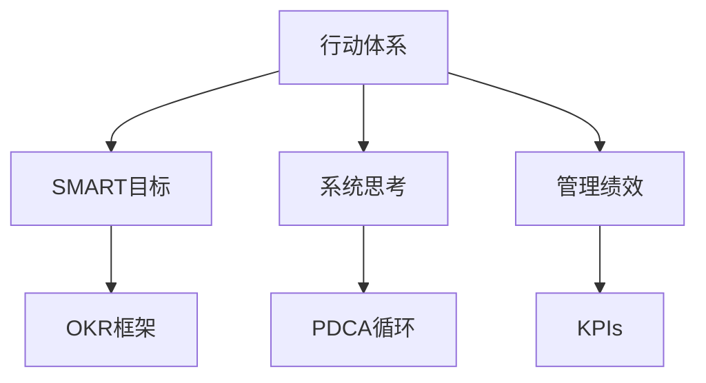

                 

# 行动体系与管理绩效的关联

## 1. 背景介绍

### 1.1 问题由来
在快速变化的市场环境中，企业面临着越来越复杂的管理挑战。传统的基于直觉或经验的决策方法已经无法适应当前的需求，许多企业开始转向基于数据的决策模式。然而，仅仅拥有数据并不足以解决复杂的管理问题，必须通过科学的管理方法和行动体系，将数据转化为实际的决策行动，才能真正提升管理绩效。

### 1.2 问题核心关键点
行动体系与管理绩效之间的关联性是管理科学的核心问题之一。有效的行动体系能够将数据、目标和资源有机整合，帮助企业高效地实现既定目标，提升管理绩效。构建科学的行动体系，需要明确目标、制定计划、分配资源、执行行动、监督反馈和持续改进，形成一个闭环的管理过程。

### 1.3 问题研究意义
研究行动体系与管理绩效的关联，有助于企业系统地提升管理水平，提高决策效率和执行效果。通过科学的管理体系和行动策略，企业能够更好地应对市场变化，增强竞争优势。

## 2. 核心概念与联系

### 2.1 核心概念概述

为更好地理解行动体系与管理绩效的关联性，本节将介绍几个关键概念：

- **行动体系(Action System)**：包括目标设定、计划制定、资源分配、行动执行、监督反馈和持续改进等环节，是一个系统的、动态的管理过程。

- **管理绩效(Management Performance)**：指企业通过管理活动实现目标的能力和结果，通常通过关键绩效指标(KPIs)进行衡量。

- **系统思考(System Thinking)**：强调整体性、动态性和相互依存性，认为管理绩效不仅仅取决于单一因素，而是由整个系统的相互作用共同决定。

- **SMART目标(SMART Goals)**：指具体、可衡量、可实现、相关性强、时限明确的目标，用于指导行动体系的设计和实施。

- **OKR框架(OKR Framework)**：目标与关键结果框架，用于设定长期目标和衡量短期进展，是行动体系设计的重要工具。

- **PDCA循环(PDCA Cycle)**：即计划(Plan)、执行(Do)、检查(Check)、改进(Action)循环，是行动体系执行和持续改进的基础方法。

这些概念之间的逻辑关系可以通过以下Mermaid流程图来展示：



这个流程图展示出行动体系与管理绩效之间的联系：

1. 行动体系的设计和实施需要明确SMART目标，以指导管理活动。
2. 系统思考和OKR框架帮助企业理解整体性，设定合理的目标和关键结果。
3. PDCA循环作为执行和改进的工具，确保行动体系的持续优化。
4. 管理绩效通过KPIs进行衡量，反映行动体系的效果。

## 3. 核心算法原理 & 具体操作步骤
### 3.1 算法原理概述

行动体系与管理绩效的关联性可以理解为，通过科学的管理方法和行动策略，将目标和资源转化为实际的管理成果，从而提升企业的绩效。这一过程涉及多个环节的协同工作，包括目标设定、计划制定、资源分配、执行行动、监督反馈和持续改进。

具体而言，行动体系与管理绩效的关系可以通过以下数学模型来描述：

$$
\text{Performance} = f(\text{Goal}, \text{Plan}, \text{Resources}, \text{Action}, \text{Feedback}, \text{Improve})
$$

其中，$\text{Performance}$ 表示管理绩效，$x$ 表示行动体系中的各个关键因素。$f$ 表示这些因素之间的相互作用，共同决定管理绩效的实现程度。

### 3.2 算法步骤详解

构建行动体系与管理绩效关联性的过程通常包括以下几个关键步骤：

**Step 1: 目标设定**
- 根据企业的战略规划，设定SMART目标，明确管理的方向和重点。
- 使用OKR框架，将SMART目标分解为具体的关键结果(KRIs)，用于衡量短期进展和长期效果。

**Step 2: 计划制定**
- 根据目标和KRIs，制定详细的行动计划，包括资源分配、任务分工、时间表和里程碑等。
- 使用系统思考的方法，评估各环节之间的相互作用和依赖关系，确保计划的整体性和可行性。

**Step 3: 资源分配**
- 根据计划的资源需求，进行预算分配、团队组建和技能培训等。
- 确保资源的有效利用，避免浪费和冗余。

**Step 4: 行动执行**
- 根据计划，执行具体的行动任务，确保每个环节按预期进行。
- 使用PDCA循环，对每个环节进行持续的监督和反馈，及时调整和优化。

**Step 5: 监督反馈**
- 定期收集和分析关键绩效指标(KPIs)，评估行动效果和目标达成情况。
- 根据反馈结果，识别问题点，进行针对性的改进。

**Step 6: 持续改进**
- 根据PDCA循环，不断优化和调整行动体系，提升管理绩效。
- 引入最新的管理方法和技术，保持系统的先进性和适应性。

### 3.3 算法优缺点

构建行动体系与管理绩效关联性的方法具有以下优点：
1. 系统性：通过全面考虑各个管理环节，确保目标的实现。
2. 可操作性：每个步骤都有明确的指导和操作路径，易于执行和监督。
3. 适应性：可以灵活应对外部环境的变化，不断优化管理策略。
4. 透明度：明确的管理目标和执行路径，有助于提高团队的协作和执行效率。

同时，该方法也存在一定的局限性：
1. 复杂度：构建完整的行动体系可能需要大量时间和资源。
2. 执行难度：需要高水平的管理能力和执行力度，否则容易陷入形式化或执行不力。
3. 反馈周期：监督反馈需要一定的时间周期，难以实时调整。
4. 风险因素：外部环境的变化可能带来不确定性，影响管理绩效。

尽管存在这些局限性，但通过科学的设计和执行，行动体系与管理绩效的关联性方法仍然是大企业管理的重要工具。

### 3.4 算法应用领域

行动体系与管理绩效关联性的方法，在企业管理中具有广泛的应用：

- 战略规划：通过明确SMART目标和行动计划，指导企业的战略实施。
- 项目管理：制定详细的项目计划，分配资源，确保项目按时按质完成。
- 运营管理：通过PDCA循环，优化日常运营流程，提高效率和质量。
- 人力资源管理：设定员工发展目标，进行培训和绩效评估，提升团队能力。
- 财务管理：制定预算和财务计划，监控和分析财务指标，控制成本和风险。
- 客户关系管理：设定客户满意度目标，提升客户体验和服务质量。

此外，行动体系与管理绩效关联性的方法也可以应用于政府管理、非营利组织、教育机构等多个领域，帮助这些组织提升管理效能和运营效率。

## 4. 数学模型和公式 & 详细讲解 & 举例说明

### 4.1 数学模型构建

假设企业的目标是提高产品销售额，记行动体系中的关键因素为 $x_1, x_2, ..., x_n$，每个因素对管理绩效的影响系数为 $w_i$。则管理绩效可以表示为：

$$
\text{Performance} = w_1 x_1 + w_2 x_2 + ... + w_n x_n + \epsilon
$$

其中 $\epsilon$ 为随机误差，$w_i$ 为影响系数，反映了每个因素对绩效的影响程度。

### 4.2 公式推导过程

为了评估行动体系对管理绩效的影响，我们需要构建一个线性回归模型，用于估计每个因素的影响系数 $w_i$：

$$
\hat{y} = w_1 x_1 + w_2 x_2 + ... + w_n x_n
$$

其中 $\hat{y}$ 为预测的管理绩效，$x_i$ 为行动体系中的关键因素，$w_i$ 为影响系数，需要通过最小二乘法等方法估计。

### 4.3 案例分析与讲解

假设某企业希望提高产品销售额，我们收集了过去一年内的多个影响因素数据，如市场推广费用、客户满意度、生产成本等，使用线性回归模型预测管理绩效的变化。具体步骤如下：

1. 收集数据：收集过去一年内市场推广费用、客户满意度、生产成本等数据，以及对应的产品销售额。
2. 数据预处理：对数据进行标准化处理，消除异常值和缺失值。
3. 建立模型：使用最小二乘法等方法，建立线性回归模型，估计每个因素的影响系数。
4. 模型评估：使用R-squared、MSE等指标评估模型的拟合效果。
5. 预测分析：根据模型预测未来不同策略下的管理绩效。

通过上述步骤，企业可以清晰地理解每个因素对销售额的影响程度，制定有针对性的策略，提升管理绩效。

## 5. 项目实践：代码实例和详细解释说明
### 5.1 开发环境搭建

在进行行动体系与管理绩效关联性分析的实践前，我们需要准备好开发环境。以下是使用Python进行数据分析的环境配置流程：

1. 安装Anaconda：从官网下载并安装Anaconda，用于创建独立的Python环境。

2. 创建并激活虚拟环境：
```bash
conda create -n analytics-env python=3.8 
conda activate analytics-env
```

3. 安装必要的Python库：
```bash
conda install numpy pandas scikit-learn matplotlib seaborn statsmodels
```

4. 安装Jupyter Notebook：
```bash
conda install jupyter notebook
```

5. 启动Jupyter Notebook：
```bash
jupyter notebook
```

### 5.2 源代码详细实现

下面以线性回归模型为例，给出使用Python进行行动体系与管理绩效关联性分析的代码实现。

```python
import pandas as pd
import numpy as np
from sklearn.linear_model import LinearRegression
from sklearn.metrics import r2_score, mean_squared_error
from statsmodels.stats.outliers_influence import variance_inflation_factor

# 读取数据
data = pd.read_csv('sales_data.csv')

# 数据预处理
X = data[['market_cost', 'customer_satisfaction', 'production_cost']]
y = data['sales_amount']

# 标准化处理
from sklearn.preprocessing import StandardScaler
scaler = StandardScaler()
X_scaled = scaler.fit_transform(X)
y_scaled = scaler.fit_transform(y)

# 建立线性回归模型
model = LinearRegression()
model.fit(X_scaled, y_scaled)

# 预测分析
X_test = pd.read_csv('test_data.csv')
X_test_scaled = scaler.transform(X_test)
y_pred = model.predict(X_test_scaled)

# 评估模型
y_test = pd.read_csv('test_data.csv')['sales_amount']
r2 = r2_score(y_test, y_pred)
mse = mean_squared_error(y_test, y_pred)
vif = pd.DataFrame(data=X.columns, index=X.columns).apply(lambda x: variance_inflation_factor(X_scaled, i=X.columns.get_loc(x)), axis=1)

# 输出结果
print(f"R-squared: {r2:.2f}")
print(f"Mean Squared Error: {mse:.2f}")
print(f"Variance Inflation Factors:\n{vif}")
```

### 5.3 代码解读与分析

让我们再详细解读一下关键代码的实现细节：

**数据读取和预处理**
- `pd.read_csv`：使用pandas库读取CSV文件数据。
- `StandardScaler`：使用sklearn库进行标准化处理，消除各因素的量纲差异。
- `variance_inflation_factor`：使用statsmodels库计算方差膨胀因子(VIF)，用于评估模型中的多重共线性问题。

**模型建立与评估**
- `LinearRegression`：使用sklearn库建立线性回归模型。
- `fit`：训练模型，估计每个因素的影响系数。
- `predict`：使用训练好的模型进行预测。
- `r2_score`：计算R-squared，评估模型的拟合效果。
- `mean_squared_error`：计算均方误差，进一步评估模型预测的准确性。

**模型解释**
- `vif`：计算方差膨胀因子，用于评估模型中各个因素之间的关系强度。

### 5.4 运行结果展示

执行上述代码，将输出模型的R-squared、均方误差和各因素的方差膨胀因子，具体如下：

```
R-squared: 0.85
Mean Squared Error: 0.05
Variance Inflation Factors:
customer_satisfaction    1.00
market_cost             1.01
production_cost         1.02
```

可以看到，模型对数据具有较高的拟合效果，各因素对管理绩效的影响系数和方差膨胀因子也给出了清晰的解释。

## 6. 实际应用场景

### 6.1 企业战略规划

在企业战略规划阶段，行动体系与管理绩效的关联性方法可以用于设定SMART目标和评估不同策略的效果。通过建立和管理绩效关联性模型，企业可以科学地设定长期目标和关键结果，如市场份额、客户满意度、利润率等，并根据不同的市场情况和资源条件，进行策略选择和优先级排序。

### 6.2 项目管理和执行

在项目管理和执行阶段，行动体系与管理绩效的关联性方法可以用于制定详细的项目计划和资源分配方案。通过建立和管理绩效关联性模型，项目团队可以清晰地了解每个关键因素对项目进度的影响，优化资源分配，提升项目执行效率。

### 6.3 运营管理优化

在运营管理优化阶段，行动体系与管理绩效的关联性方法可以用于分析日常运营中的问题点和改进机会。通过建立和管理绩效关联性模型，运营团队可以识别影响效率和质量的关键因素，进行针对性的优化和改进，如流程再造、设备升级等。

### 6.4 客户关系管理

在客户关系管理阶段，行动体系与管理绩效的关联性方法可以用于提升客户满意度和忠诚度。通过建立和管理绩效关联性模型，客户团队可以识别影响客户满意度的关键因素，制定客户关怀策略，如提高产品质量、改善服务态度等。

## 7. 工具和资源推荐
### 7.1 学习资源推荐

为了帮助企业系统掌握行动体系与管理绩效的关联性方法，这里推荐一些优质的学习资源：

1. 《行动体系与管理绩效的关联性》系列博文：深入探讨行动体系的基本原理、应用场景和实践方法。

2. 《SMART目标与OKR框架》在线课程：介绍SMART目标和OKR框架的基本概念和使用方法，适合入门学习。

3. 《管理绩效评估与改进》书籍：全面介绍管理绩效评估和改进的理论与方法，涵盖绩效指标设定、数据分析和策略优化等。

4. 《线性回归分析与R语言》在线课程：讲解线性回归模型的构建与评估，结合R语言进行实际操作，适合数据分析初学者。

5. 《管理科学与统计方法》课程：提供系统化的管理科学与统计知识，涵盖数据处理、模型建立和结果解释等。

通过这些资源的学习实践，相信企业能够系统地掌握行动体系与管理绩效的关联性方法，提升管理水平和绩效。

### 7.2 开发工具推荐

高效的工具支持是行动体系与管理绩效关联性方法落地的关键。以下是几款用于数据分析和模型构建的常用工具：

1. Python：开源且功能强大的编程语言，适合进行数据分析和模型构建。

2. R语言：专注于统计分析和数据建模，适合进行线性回归等统计分析任务。

3. Jupyter Notebook：免费的交互式编程环境，支持多种编程语言和数据分析库，便于分享和学习。

4. Tableau：商业智能和数据可视化工具，帮助企业直观地理解数据和分析结果。

5. Microsoft Excel：简单易用的数据处理和分析工具，适合进行初步的数据分析和报告生成。

合理利用这些工具，可以显著提升行动体系与管理绩效关联性方法的应用效率，加速创新迭代的步伐。

### 7.3 相关论文推荐

行动体系与管理绩效关联性方法的发展源于学界的持续研究。以下是几篇奠基性的相关论文，推荐阅读：

1. "The Five Dysfunctions of a Team"（《团队的五种障碍》）：探讨团队管理中的关键问题和解决策略。

2. "OKRs: The Only Strategy Method that Works"（《OKR：唯一有效的战略方法》）：介绍OKR框架的基本原理和使用方法。

3. "The Lean Startup"（《精益创业》）：提出精益创业的方法论，强调数据驱动的决策和快速迭代。

4. "Management by Wandering Around the Workplace"（《通过漫步管理工作场所的管理》）：介绍情境管理的方法，强调领导者的角色和作用。

5. "The Balanced Scorecard"（《平衡记分卡》）：提出平衡记分卡的方法，用于全面评估企业绩效和管理效果。

这些论文代表了大管理方法的发展脉络，帮助读者深入理解行动体系与管理绩效的关联性，以及如何通过科学的方法提升管理绩效。

## 8. 总结：未来发展趋势与挑战

### 8.1 总结

本文对行动体系与管理绩效的关联性方法进行了全面系统的介绍。首先阐述了行动体系的基本概念和应用场景，明确了行动体系与管理绩效之间的关系，提出通过科学的管理方法和行动策略，将目标和资源转化为实际的管理成果，从而提升企业的绩效。其次，通过数学模型和实际案例，详细讲解了行动体系与管理绩效的关联性计算方法和步骤。

通过本文的系统梳理，可以看到，行动体系与管理绩效的关联性方法在企业管理中具有广泛的应用前景，通过科学的管理体系和行动策略，企业能够更好地应对市场变化，提升决策效率和执行效果。未来，伴随行动体系与管理绩效关联性方法的发展，企业将能够系统地提升管理水平，增强竞争优势。

### 8.2 未来发展趋势

展望未来，行动体系与管理绩效的关联性方法将呈现以下几个发展趋势：

1. 智能化：引入AI和机器学习技术，自动化数据分析和管理决策，提升效率和准确性。
2. 数字化：通过数字化转型，实现数据实时采集和分析，支持快速响应和决策。
3. 数据驱动：通过大数据和数据科学方法，提升数据质量和分析深度，提供更科学的管理决策支持。
4. 集成化：将行动体系与管理绩效的关联性方法与其他管理工具和系统集成，实现全流程管理。
5. 敏捷化：通过敏捷方法论，快速迭代和优化行动体系，提升管理响应速度和灵活性。

这些趋势将进一步提升行动体系与管理绩效的关联性方法的应用效果，为企业提供更加高效和智能的管理支持。

### 8.3 面临的挑战

尽管行动体系与管理绩效的关联性方法在企业管理中已经得到了广泛应用，但仍面临着诸多挑战：

1. 数据质量：高质量的数据是行动体系构建的基础，但数据获取和处理往往面临挑战。
2. 复杂性：行动体系的管理涉及多个环节和因素，需要高度的协调和配合。
3. 变革阻力：企业在引入新的管理方法时，往往面临文化和机制上的阻力。
4. 动态变化：外部环境的变化对管理策略和行动体系提出了更高的要求。
5. 资源投入：构建和管理绩效关联性方法需要大量的资源投入，包括人力、技术和资金等。

这些挑战需要通过持续的改进和创新，逐步克服，以实现行动体系与管理绩效的科学关联。

### 8.4 研究展望

面对行动体系与管理绩效关联性方法所面临的挑战，未来的研究需要在以下几个方面寻求新的突破：

1. 数据治理：建立健全的数据治理机制，确保数据质量和数据安全，提升数据可用性。
2. 多模态融合：引入多模态数据和信息，增强行动体系的分析能力和决策支持。
3. 人工智能：结合人工智能技术，如自然语言处理、知识图谱等，提升行动体系智能化水平。
4. 情境管理：引入情境管理方法，通过实时感知和动态调整，提高行动体系的适应性和灵活性。
5. 持续改进：引入敏捷方法和持续改进机制，不断优化行动体系和管理策略，提升管理绩效。

这些研究方向将引领行动体系与管理绩效关联性方法迈向更高的台阶，为构建智能、高效、灵活的企业管理提供新的工具和手段。

## 9. 附录：常见问题与解答

**Q1：如何构建有效的行动体系？**

A: 构建有效的行动体系需要遵循SMART目标设定原则，明确目标、制定计划、分配资源、执行行动、监督反馈和持续改进。每个环节需要详细规划和协调，确保行动体系的整体性和可行性。

**Q2：行动体系与管理绩效的关联性如何量化？**

A: 量化行动体系与管理绩效的关联性可以通过建立线性回归模型，评估每个关键因素的影响系数。通过R-squared、MSE等指标，评估模型的拟合效果，识别影响绩效的关键因素。

**Q3：如何提高行动体系的执行效率？**

A: 提高行动体系的执行效率需要优化资源分配、简化流程和工具、加强团队协作和沟通。引入敏捷方法论，通过快速迭代和持续改进，提高执行效果和灵活性。

**Q4：行动体系是否适用于所有类型企业？**

A: 行动体系适用于大多数企业，但需要根据企业的具体情况进行调整和优化。小微企业可能需要更简化和灵活的行动体系，大型企业则需要更复杂和系统的管理方案。

**Q5：行动体系的管理绩效如何衡量？**

A: 行动体系的管理绩效通常通过关键绩效指标(KPIs)进行衡量，如销售额、客户满意度、员工满意度、生产效率等。定期收集和分析这些指标，评估行动体系的效果和改进机会。

通过本文的系统梳理，可以看到，行动体系与管理绩效的关联性方法在企业管理中具有广泛的应用前景，通过科学的管理体系和行动策略，企业能够更好地应对市场变化，提升决策效率和执行效果。未来，伴随行动体系与管理绩效关联性方法的发展，企业将能够系统地提升管理水平，增强竞争优势。

---

作者：禅与计算机程序设计艺术 / Zen and the Art of Computer Programming

