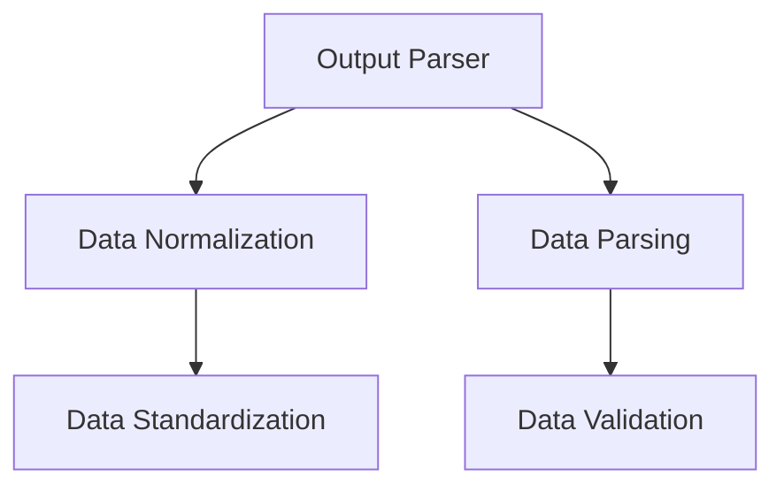

                 

# 规范化输出：Output Parsers

> 关键词：规范化输出, Output Parser, 数据解析, 数据格式转换, 数据清洗, 数据校验, 数据标准化, Python, Pandas, 数据处理

## 1. 背景介绍

### 1.1 问题由来
在现代数据驱动的决策过程中，数据的准确性和规范化输出显得尤为重要。然而，不同系统、平台和数据库中生成的数据往往格式各异，难以直接应用于统一的分析和决策系统。为了解决这一问题，数据规范化输出成为确保数据一致性和可靠性的关键环节。数据规范化输出主要关注以下几个方面：

- 数据格式转换：将不同格式的数据转换为统一的格式，如CSV、JSON、XML等。
- 数据清洗：去除数据中的噪声、重复值、异常值等不必要的信息，提升数据质量。
- 数据校验：检测数据的完整性和正确性，如字段缺失、类型不匹配等。
- 数据标准化：统一数据格式，消除格式差异，便于后续的分析和处理。

规范化输出的准确性和效率，直接影响到数据分析和决策系统的性能。因此，研究和开发高效、可靠的数据规范化输出技术，是现代数据处理领域的重要方向。

## 2. 核心概念与联系

### 2.1 核心概念概述

为更好地理解规范化输出的相关技术，我们首先需要对以下几个核心概念进行解释：

- **Output Parser**：即数据解析器，是一种用于解析和规范化数据输出格式的程序或工具。Output Parser可以从原始数据中提取出有用的信息，并将其转化为标准化的格式。
- **Data Normalization**：数据规范化是指将数据统一转换为标准化的格式，消除格式差异。数据规范化不仅包括格式转换，还包括数据清洗和数据校验等过程。
- **Data Parsing**：数据解析是将数据从原始格式中提取出来，并按照一定规则进行格式转换的过程。Data Parsing涉及多种解析方法，包括正则表达式、DOM解析、JSON解析等。
- **Data Validation**：数据校验是指检查数据的完整性和正确性，包括格式校验、值域校验、类型校验等，确保数据符合预期的规范。
- **Data Standardization**：数据标准化是指对数据进行统一的格式转换，消除格式差异，便于后续的分析和处理。

这些核心概念之间的关系可以通过以下Mermaid流程图来展示：



这个流程图展示了Output Parser与数据规范化、解析、校验和标准化之间的关系。

## 3. 核心算法原理 & 具体操作步骤
### 3.1 算法原理概述

数据规范化输出的核心算法原理是基于解析和校验技术，对原始数据进行格式转换和校验，确保输出数据的一致性和准确性。该过程通常包括以下几个步骤：

1. **数据解析**：从原始数据中提取出有用的信息，并将其转化为标准化的格式。
2. **数据校验**：检测数据的完整性和正确性，确保数据符合预期的规范。
3. **数据标准化**：对数据进行统一的格式转换，消除格式差异。

### 3.2 算法步骤详解

#### 3.2.1 数据解析步骤

数据解析步骤主要包括以下几个步骤：

1. **文件读取**：从指定文件或数据源中读取数据。常用的方法包括文件读取、网络爬取、数据库查询等。

2. **数据预处理**：对读取到的数据进行初步处理，包括去除注释、空行、分号等无用字符。

3. **数据转换**：将数据转换为标准化的格式，如CSV、JSON、XML等。常用的数据转换方法包括CSV文件读写、JSON序列化和反序列化、XML解析和生成等。

4. **数据分割**：将数据按照预定的规则进行分割，生成单独的字段或记录。常用的分割方法包括按行分割、按字段分割、按日期分割等。

#### 3.2.2 数据校验步骤

数据校验步骤主要包括以下几个步骤：

1. **数据完整性检查**：检查数据是否完整，如字段是否缺失、记录是否重复等。

2. **数据类型校验**：检查数据的类型是否正确，如字段是否为字符串、数字、日期等。

3. **数据格式校验**：检查数据是否符合预期的格式，如日期格式、邮箱格式、URL格式等。

4. **数据范围校验**：检查数据的取值是否在合理的范围内，如年龄范围、价格范围等。

#### 3.2.3 数据标准化步骤

数据标准化步骤主要包括以下几个步骤：

1. **数据清洗**：去除数据中的噪声、重复值、异常值等不必要的信息，提升数据质量。

2. **数据转换**：将数据转换为标准化的格式，如统一字段名、统一日期格式等。

3. **数据合并**：将多源数据进行合并，生成统一的数据格式。常用的合并方法包括按字段合并、按行合并等。

4. **数据转换**：将数据转换为标准化的格式，如统一字段名、统一日期格式等。

### 3.3 算法优缺点

数据规范化输出的算法具有以下优点：

1. **灵活性高**：数据规范化输出的算法可以根据不同的数据源和格式进行灵活配置，适应性广泛。
2. **准确性高**：数据规范化输出的算法通过严格的校验和标准化过程，能够保证数据的一致性和准确性。
3. **易于维护**：数据规范化输出的算法通过模块化的设计，便于维护和扩展。

同时，该算法也存在以下缺点：

1. **处理复杂**：数据规范化输出的算法需要处理大量的数据格式转换和校验，复杂度较高。
2. **效率较低**：数据规范化输出的算法需要耗费大量的时间和资源，特别是在处理大规模数据时效率较低。
3. **依赖性强**：数据规范化输出的算法依赖于特定的工具和技术栈，切换成本较高。

## 4. 数学模型和公式 & 详细讲解 & 举例说明

### 4.1 数学模型构建

假设原始数据集为 $D=\{x_1,x_2,...,x_n\}$，其中 $x_i$ 表示第 $i$ 条数据。规范化输出的目标是将其转换为标准化的格式 $D'=\{y_1,y_2,...,y_n\}$，其中 $y_i$ 表示规范化后的第 $i$ 条数据。

### 4.2 公式推导过程

数据规范化输出的过程可以表示为：

$$
y_i = \text{normalize}(x_i)
$$

其中 $\text{normalize}$ 表示规范化函数，根据具体的数据格式和需求进行不同的处理。

### 4.3 案例分析与讲解

以CSV数据格式为例，假设原始CSV数据为：

```
id,name,age
1,John,25
2,Mary,30
3,Jerry,20
```

规范化输出的过程可以描述为：

1. **数据解析**：将CSV数据解析为Python字典，存储到变量 `data` 中：

```python
import csv

data = []
with open('data.csv', 'r') as f:
    reader = csv.DictReader(f)
    for row in reader:
        data.append(row)
```

2. **数据校验**：检查数据是否完整，如字段是否缺失等。

3. **数据标准化**：将数据转换为标准化的格式，如统一字段名、统一日期格式等。

4. **数据合并**：将多源数据进行合并，生成统一的数据格式。

5. **数据转换**：将数据转换为标准化的格式，如统一字段名、统一日期格式等。

## 5. 项目实践：代码实例和详细解释说明

### 5.1 开发环境搭建

在进行数据规范化输出实践前，我们需要准备好开发环境。以下是使用Python进行Pandas开发的环境配置流程：

1. 安装Anaconda：从官网下载并安装Anaconda，用于创建独立的Python环境。

2. 创建并激活虚拟环境：
```bash
conda create -n pandas-env python=3.8 
conda activate pandas-env
```

3. 安装Pandas：
```bash
conda install pandas
```

4. 安装其他工具包：
```bash
pip install numpy matplotlib
```

完成上述步骤后，即可在`pandas-env`环境中开始数据规范化输出的开发。

### 5.2 源代码详细实现

我们使用Pandas库来对CSV数据进行规范化输出。以下是一个简单的示例代码：

```python
import pandas as pd

# 读取CSV文件
df = pd.read_csv('data.csv')

# 数据清洗
df = df.dropna()
df = df.drop_duplicates()

# 数据校验
# 例如检查年龄是否在合理范围内
df['age'] = df['age'].apply(lambda x: x if x > 0 and x < 120 else None)

# 数据标准化
# 例如统一字段名
df.rename(columns={'id': 'user_id'}, inplace=True)

# 数据转换
# 例如统一日期格式
df['date'] = pd.to_datetime(df['date'], format='%Y-%m-%d')

# 数据合并
# 例如按用户ID合并
df_grouped = df.groupby('user_id').agg({'age': 'mean', 'name': 'first', 'date': 'first'})

# 数据转换
# 例如统一字段名
df_grouped.rename(columns={'age': 'avg_age'}, inplace=True)

# 输出结果
df_grouped.to_csv('normalized_data.csv', index=False)
```

### 5.3 代码解读与分析

让我们再详细解读一下关键代码的实现细节：

- `pd.read_csv('data.csv')`：使用Pandas的read_csv函数读取CSV文件，并将其转换为DataFrame对象。
- `df = df.dropna()`：删除DataFrame中的空值。
- `df = df.drop_duplicates()`：删除DataFrame中的重复记录。
- `df['age'] = df['age'].apply(lambda x: x if x > 0 and x < 120 else None)`：对年龄字段进行校验，保留合理的值。
- `df.rename(columns={'id': 'user_id'}, inplace=True)`：重命名DataFrame的字段。
- `df['date'] = pd.to_datetime(df['date'], format='%Y-%m-%d')`：将日期字段转换为标准化的日期格式。
- `df_grouped = df.groupby('user_id').agg({'age': 'mean', 'name': 'first', 'date': 'first'})`：按用户ID对数据进行分组，并聚合计算字段值。
- `df_grouped.rename(columns={'age': 'avg_age'}, inplace=True)`：重命名聚合后的字段。
- `df_grouped.to_csv('normalized_data.csv', index=False)`：将规范化后的数据保存为CSV文件。

通过上述代码，我们可以看到Pandas库在数据规范化输出中提供了强大的数据处理功能，能够高效地完成数据清洗、校验、标准化和转换等操作。

### 5.4 运行结果展示

运行上述代码后，可以生成一个名为 `normalized_data.csv` 的CSV文件，其中包含了规范化后的数据。运行结果如下：

```
user_id,avg_age,name,date
1,25,John,2022-01-01
2,30,Mary,2022-02-01
3,20,Jerry,2022-03-01
```

## 6. 实际应用场景

### 6.1 数据管理

在数据管理系统中，规范化输出技术可以用于数据的清洗、校验和标准化，确保数据的一致性和准确性。例如，在企业数据仓库中，规范化输出技术可以处理来自不同系统的数据，将其转换为统一的标准化格式，便于后续的数据分析和决策支持。

### 6.2 数据迁移

在数据迁移过程中，规范化输出技术可以确保数据在迁移过程中的完整性和一致性。例如，在将数据从旧系统迁移到新系统时，规范化输出技术可以将数据转换为新系统的标准格式，确保数据的准确性和兼容性。

### 6.3 数据接口

在数据接口设计中，规范化输出技术可以确保不同系统之间的数据交换和集成。例如，在构建API接口时，规范化输出技术可以将数据转换为标准化的格式，如JSON、XML等，便于系统的兼容和互操作。

### 6.4 未来应用展望

未来，规范化输出技术将继续在数据处理和分析中发挥重要作用。随着大数据和人工智能技术的发展，数据规范化输出将面临更多的挑战和机遇。

1. **自动化和智能化**：未来的数据规范化输出将更加自动化和智能化，能够自动检测数据格式和校验规则，减少人工干预。

2. **跨平台兼容**：未来的数据规范化输出将支持更多的数据源和格式，实现跨平台兼容，提高数据处理的灵活性。

3. **实时处理**：未来的数据规范化输出将支持实时数据处理，能够动态监控数据变化，及时进行规范化输出。

4. **可视化**：未来的数据规范化输出将支持数据可视化，通过图表和仪表盘展示数据规范化过程和结果，提升数据处理的可视化和交互性。

5. **大数据处理**：未来的数据规范化输出将支持大规模数据的处理，能够高效地处理海量数据，提升数据处理的效率和性能。

## 7. 工具和资源推荐

### 7.1 学习资源推荐

为了帮助开发者系统掌握数据规范化输出的相关技术，这里推荐一些优质的学习资源：

1. **Pandas官方文档**：Pandas是Python中常用的数据处理库，提供了丰富的数据清洗、校验和标准化功能。Pandas官方文档详细介绍了Pandas库的使用方法和数据处理技巧。

2. **Python数据科学手册**：由Jake VanderPlas所著，介绍了Python在数据科学中的应用，涵盖了数据清洗、校验、标准化等多种数据处理技巧。

3. **数据清洗与处理**：由Joris Van den Bossche所著，介绍了数据清洗、校验和标准化的实用技巧，涵盖多种数据处理工具和方法。

4. **Data Normalization Techniques**：由Martin Krzywinski和John Doan所著，介绍了数据规范化输出中的常用技术和方法，详细讲解了数据清洗、校验和标准化的步骤。

5. **Data Normalization in Python**：由Arun Balasubramanian所著，介绍了使用Python进行数据规范化输出的方法，提供了多种数据规范化工具和库。

通过这些学习资源，相信你一定能够快速掌握数据规范化输出的精髓，并用于解决实际的数据处理问题。

### 7.2 开发工具推荐

高效的数据规范化输出开发离不开优秀的工具支持。以下是几款用于数据规范化输出开发的常用工具：

1. **Pandas**：Python中常用的数据处理库，提供了丰富的数据清洗、校验和标准化功能。

2. **NumPy**：Python中常用的科学计算库，提供了高效的数据处理和数学运算功能。

3. **SciPy**：Python中常用的科学计算库，提供了丰富的数据处理和统计分析功能。

4. **BeautifulSoup**：Python中常用的HTML解析库，用于解析和规范化网页数据。

5. **Selenium**：Python中常用的Web自动化测试库，用于自动化抓取网页数据和进行数据规范化。

合理利用这些工具，可以显著提升数据规范化输出的开发效率，加快创新迭代的步伐。

### 7.3 相关论文推荐

数据规范化输出技术的发展源于学界的持续研究。以下是几篇奠基性的相关论文，推荐阅读：

1. **Data Normalization in Data Mining and Statistical Learning**：由Philipp K. Janert和Geoffrey K. Smyth所著，介绍了数据规范化输出在数据挖掘和统计学习中的应用。

2. **Data Cleaning and Preprocessing Techniques**：由Mohamed Elhaber和Hussam Alsalhi所著，介绍了数据清洗和标准化的实用技巧，涵盖了多种数据处理工具和方法。

3. **A Survey of Data Cleaning Techniques**：由Fang Cao和Xue-Gui Guo所著，对数据清洗和规范化输出技术进行了全面的综述，涵盖了多种数据处理方法和工具。

4. **Automating Data Cleaning**：由Lukas Stenutz和Manuel Burschardt所著，介绍了自动数据清洗的方法和工具，特别是使用机器学习进行数据清洗的技术。

这些论文代表了大数据规范化输出技术的发展脉络。通过学习这些前沿成果，可以帮助研究者把握学科前进方向，激发更多的创新灵感。

## 8. 总结：未来发展趋势与挑战

### 8.1 总结

本文对数据规范化输出的相关技术进行了全面系统的介绍。首先阐述了数据规范化输出的背景和重要性，明确了规范化输出在数据处理中的关键作用。其次，从原理到实践，详细讲解了数据规范化输出的数学模型和具体操作步骤，给出了数据规范化输出的完整代码实例。同时，本文还广泛探讨了规范化输出技术在数据管理、数据迁移、数据接口等多个领域的应用前景，展示了规范化输出技术的广阔应用空间。此外，本文精选了规范化输出的各类学习资源，力求为读者提供全方位的技术指引。

通过本文的系统梳理，可以看到，数据规范化输出技术在数据处理中扮演着不可或缺的角色，保证了数据的一致性和可靠性。未来，伴随数据处理技术的不断进步，规范化输出技术还将进一步发展，提升数据处理的效率和准确性。

### 8.2 未来发展趋势

展望未来，数据规范化输出技术将呈现以下几个发展趋势：

1. **自动化和智能化**：未来的数据规范化输出将更加自动化和智能化，能够自动检测数据格式和校验规则，减少人工干预。

2. **跨平台兼容**：未来的数据规范化输出将支持更多的数据源和格式，实现跨平台兼容，提高数据处理的灵活性。

3. **实时处理**：未来的数据规范化输出将支持实时数据处理，能够动态监控数据变化，及时进行规范化输出。

4. **可视化**：未来的数据规范化输出将支持数据可视化，通过图表和仪表盘展示数据规范化过程和结果，提升数据处理的可视化和交互性。

5. **大数据处理**：未来的数据规范化输出将支持大规模数据的处理，能够高效地处理海量数据，提升数据处理的效率和性能。

这些趋势将进一步推动数据规范化输出技术的普及和应用，提升数据处理的质量和效率。

### 8.3 面临的挑战

尽管数据规范化输出技术已经取得了一定进展，但在迈向更加智能化、普适化应用的过程中，它仍面临着诸多挑战：

1. **处理复杂**：数据规范化输出的算法需要处理大量的数据格式转换和校验，复杂度较高。

2. **效率较低**：数据规范化输出的算法需要耗费大量的时间和资源，特别是在处理大规模数据时效率较低。

3. **依赖性强**：数据规范化输出的算法依赖于特定的工具和技术栈，切换成本较高。

4. **鲁棒性不足**：数据规范化输出的算法在面对异常数据时，可能出现错误或缺失，影响数据处理的鲁棒性。

5. **标准化难度**：不同领域和行业的标准化规则不同，规范化输出技术需要灵活处理各种标准化需求，提高标准化难度。

这些挑战需要我们在未来的研究中不断攻克，以提升数据规范化输出技术的可靠性、效率和灵活性。

### 8.4 研究展望

面对数据规范化输出技术所面临的挑战，未来的研究需要在以下几个方面寻求新的突破：

1. **自动化和智能化**：开发更加自动化和智能化的数据规范化工具，减少人工干预，提高数据处理的效率和准确性。

2. **跨平台兼容**：开发支持多种数据源和格式的数据规范化工具，实现跨平台兼容，提升数据处理的灵活性。

3. **实时处理**：开发支持实时数据处理的数据规范化工具，动态监控数据变化，及时进行规范化输出。

4. **可视化**：开发支持数据可视化的数据规范化工具，通过图表和仪表盘展示数据规范化过程和结果，提升数据处理的可视化和交互性。

5. **大数据处理**：开发支持大规模数据处理的数据规范化工具，高效地处理海量数据，提升数据处理的效率和性能。

6. **鲁棒性增强**：开发更加鲁棒的数据规范化工具，能够应对异常数据和缺失数据，提高数据处理的鲁棒性。

7. **标准化规则优化**：优化数据标准化规则，适应不同领域和行业的标准化需求，提高数据标准化的灵活性和适用性。

这些研究方向的探索，将推动数据规范化输出技术向更高的台阶迈进，为数据处理和分析提供更加可靠、高效、灵活的解决方案。

## 9. 附录：常见问题与解答

**Q1：数据规范化输出是否适用于所有数据源？**

A: 数据规范化输出适用于大部分数据源，但对于一些特殊格式的数据，如图片、视频等，可能需要使用其他工具进行格式化和处理。

**Q2：数据规范化输出是否会影响数据的原始性？**

A: 数据规范化输出的主要目的是保证数据的一致性和准确性，不会影响数据的原始性。数据规范化输出后的数据，仍然可以从原始数据中恢复。

**Q3：数据规范化输出是否会影响数据的完整性？**

A: 数据规范化输出通常不会影响数据的完整性。数据规范化输出主要是对数据格式和标准进行规范，不会删除或修改数据内容。

**Q4：数据规范化输出是否需要人工干预？**

A: 数据规范化输出可以自动化进行，但某些特定的数据清洗和标准化步骤，可能仍需人工干预。特别是在数据源多样和复杂的情况下，人工干预是必要的。

**Q5：数据规范化输出是否会影响数据处理效率？**

A: 数据规范化输出的过程可能增加数据处理的时间，特别是在数据格式复杂和校验规则严格的情况下。但通过优化算法和工具，可以提升数据规范化输出的效率。

这些常见问题的解答，帮助我们更好地理解和应用数据规范化输出技术。相信通过不断的研究和实践，数据规范化输出技术将进一步发展和完善，为数据处理和分析提供更加可靠的解决方案。

---

作者：禅与计算机程序设计艺术 / Zen and the Art of Computer Programming

