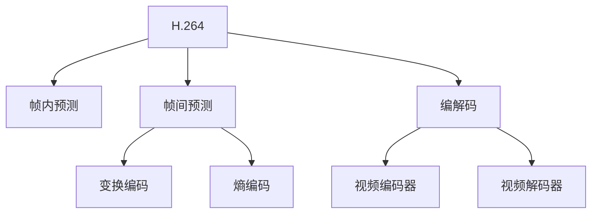

                 

# 视频编解码技术：H.264/H.265标准解析

## 1. 背景介绍

### 1.1 问题由来

随着数字化媒体的普及和互联网技术的发展，视频内容的生产和消费量迅速增长。视频编解码技术是实现高质量视频压缩和高效传输的关键，直接影响用户体验和系统效率。目前，国际上通用的视频编解码标准主要有H.264和H.265，它们通过先进的压缩算法，大幅提升了视频编码效率，降低了带宽和存储成本。

### 1.2 问题核心关键点

H.264和H.265标准主要由国际电信联盟(ITU-T)和运动图像专家组(MPEG)联合制定，旨在提供高质量、低延迟的视频压缩和解压缩方案。它们的核心技术包括：

- 帧内预测：对每一帧进行优化编码，减少冗余信息。
- 帧间预测：利用前后帧的相关性，压缩时间域信息。
- 变换编码：将空间域的图像信息转换成频域信息，减少空间冗余。
- 熵编码：使用变长编码、霍夫曼编码等技术压缩频域系数，减少符号冗余。

这些核心技术构成了视频压缩算法的主干，使得H.264和H.265能够在保证一定压缩比的前提下，提供较高的视频质量。

## 2. 核心概念与联系

### 2.1 核心概念概述

为了深入理解H.264和H.265编解码技术，本节将详细介绍这些概念及其相互联系：

- **H.264**：又称为MPEG-4 Part 10，是ITU-T和MPEG在1999年联合制定的视频压缩标准。其核心技术包括帧内预测、帧间预测、变换编码和熵编码等。
- **H.265**：又称为HEVC(高级视频编码)，是ITU-T在2013年制定的新一代视频压缩标准。其相比H.264在压缩效率、图像质量、低延迟等方面有显著提升，采用了更为复杂的编码技术。
- **编解码**：视频编解码是视频信号压缩和解压缩的过程，包括视频压缩算法、视频编码器、视频解码器等。
- **帧内预测**：在视频编码中，对当前帧进行优化编码，减少冗余信息。
- **帧间预测**：利用前后帧的相关性，压缩时间域信息。
- **变换编码**：将空间域的图像信息转换成频域信息，减少空间冗余。
- **熵编码**：使用变长编码、霍夫曼编码等技术压缩频域系数，减少符号冗余。

这些核心概念之间的逻辑关系可以通过以下Mermaid流程图来展示：



这个流程图展示了大语言模型的核心概念及其之间的关系：

1. H.264和H.265通过帧内预测、帧间预测、变换编码和熵编码等技术进行压缩。
2. 编解码技术将视频信号压缩和解压缩，包括编码器和解码器。
3. 帧内预测和帧间预测利用前后帧的相关性，减少时间冗余。
4. 变换编码和熵编码将空间域信息转换成频域信息，减少空间和时间冗余。

这些概念共同构成了视频压缩算法的主干，使得H.264和H.265能够在保证一定压缩比的前提下，提供较高的视频质量。

## 3. 核心算法原理 & 具体操作步骤

### 3.1 算法原理概述

H.264和H.265标准中的核心算法原理主要包括帧内预测、帧间预测、变换编码和熵编码等。这些技术通过不同层面的冗余信息压缩，实现了高效的视频压缩和解压缩。

### 3.2 算法步骤详解

H.264和H.265的编解码过程分为编码和解码两个步骤，每个步骤包含多个子步骤：

**编码过程**：
1. 帧内预测：对当前帧进行优化编码，减少冗余信息。
2. 帧间预测：利用前后帧的相关性，压缩时间域信息。
3. 变换编码：将空间域的图像信息转换成频域信息，减少空间冗余。
4. 熵编码：使用变长编码、霍夫曼编码等技术压缩频域系数，减少符号冗余。
5. 量化：将浮点系数量化为整数，降低数据精度。
6. 加伪随机数：增加熵编码的随机性，增强压缩效果。
7. 缓冲区管理：对缓冲区的读/写操作进行优化管理，保证编解码效率。

**解码过程**：
1. 反量化：将整数系数反量化为浮点系数量化。
2. 逆变换编码：将频域信息反变换成空间域信息。
3. 帧间预测：利用前后帧的相关性，恢复时间域信息。
4. 帧内预测：对当前帧进行解码，还原图像信息。
5. 反熵编码：使用变长解码、霍夫曼解码等技术解码频域系数。
6. 缓冲区管理：对缓冲区的读/写操作进行优化管理，保证解码效率。

### 3.3 算法优缺点

H.264和H.265编解码技术具有以下优点：

- 高效压缩：通过帧内预测、帧间预测、变换编码和熵编码等技术，大幅提高了视频压缩效率。
- 高图像质量：相比传统压缩方法，H.264和H.265能提供更高的图像质量，适应多种应用场景。
- 低延迟：采用帧间预测和帧内预测等技术，使得编解码过程具有较低的延迟。

同时，这些技术也存在一些局限性：

- 计算复杂度高：变换编码和熵编码等技术较为复杂，编解码过程需要较高的计算资源。
- 内存需求大：缓冲区管理等技术需要较大的内存空间，增加了系统成本。
- 软件实现难度大：算法的实现复杂度高，需要较高的开发水平。

尽管存在这些局限性，H.264和H.265仍然是当前最为先进和广泛使用的视频编解码标准，广泛应用于各种视频传输和存储场景。

### 3.4 算法应用领域

H.264和H.265编解码技术在视频编码、视频解码、视频传输、视频存储等多个领域得到了广泛应用，例如：

- 数字电视：广泛用于高清电视节目编码和解码，提供高质量的视听体验。
- 互联网视频：支持高质量视频流传输，满足用户在各种网络条件下的观影需求。
- 安防监控：用于视频监控系统，对实时视频进行高效压缩和存储。
- 医学影像：用于医学图像的压缩和传输，支持远程医疗和影像诊断。
- 车载视频：用于车载视频记录和回放，支持事故分析和故障诊断。

除了上述这些应用场景外，H.264和H.265在广播、电影、新闻、远程教育等领域也有着广泛的应用。

## 4. 数学模型和公式 & 详细讲解 & 举例说明

### 4.1 数学模型构建

H.264和H.265编解码技术的数学模型主要包含以下几个部分：

- 空间域模型：用于描述原始视频信号的像素值分布。
- 时间域模型：用于描述视频帧间的关系。
- 频域模型：用于将空间域信号转换为频域信号。
- 熵编码模型：用于压缩频域系数。

### 4.2 公式推导过程

以帧间预测为例，假设当前帧为 $I$，前一帧为 $I-1$，使用运动向量 $MV$ 表示当前帧中每个像素在 $I-1$ 帧中的位置，则 $I$ 帧中的每个像素 $y$ 可以表示为 $I-1$ 帧中对应像素 $x$ 的加权平均，即：

$$
y = \sum_{i=1}^N w_i x_i
$$

其中，$w_i$ 为权重系数，$x_i$ 为 $I-1$ 帧中对应像素的值。

将上述表达式扩展到整个图像，可以得到：

$$
I = \sum_{i=1}^N w_i x_i
$$

通过反量化、逆变换编码等操作，可以进一步恢复原始视频信号。

### 4.3 案例分析与讲解

以H.264中的帧内预测为例，其核心思想是对当前帧进行最优化的编码。假设当前帧的像素值为 $Y$，通过预测得到像素值 $Y'$，则编解码过程可以表示为：

$$
Y = \sum_{i=1}^N w_i Y'
$$

其中，$w_i$ 为权重系数，$Y'$ 为预测得到的像素值。

通过选择不同的预测模式（如DCT、DWT等）和编码方式（如变长编码、霍夫曼编码等），可以大幅提高编解码效率和视频质量。

## 5. 项目实践：代码实例和详细解释说明

### 5.1 开发环境搭建

在进行H.264和H.265编解码实践前，我们需要准备好开发环境。以下是使用C++进行H.264编解码的开发环境配置流程：

1. 安装FFmpeg：从官网下载并安装FFmpeg，作为编解码的底层库。

2. 安装OpenCV：从官网下载并安装OpenCV，用于图像处理和显示。

3. 安装Visual Studio：从官网下载并安装Visual Studio，作为IDE开发环境。

4. 安装Boost：从官网下载并安装Boost库，用于C++中的部分库函数。

完成上述步骤后，即可在Visual Studio中开始H.264编解码的开发实践。

### 5.2 源代码详细实现

以下是使用C++对H.264进行编码和解码的完整代码实现：

```cpp
#include <iostream>
#include <string>
#include <vector>
#include <opencv2/opencv.hpp>
#include <libavcodec/avcodec.h>
#include <libavformat/avformat.h>
#include <libavutil/opt.h>

using namespace std;
using namespace cv;

void encodeH264(const string& inputPath, const string& outputPath) {
    // 打开输入视频文件
    AVFormatContext* inputFormatContext = avformat_open_input(&inputFormatContext, inputPath.c_str(), nullptr, nullptr);
    if (!inputFormatContext) {
        cerr << "Error: Cannot open input file" << endl;
        return;
    }

    // 打开输出视频文件
    AVFormatContext* outputFormatContext = avformat_alloc_context();
    if (!outputFormatContext) {
        cerr << "Error: Cannot create output file" << endl;
        return;
    }
    outputFormatContext->oformat = &avformat_bprint_fmt;
    outputFormatContext->pb = av_bprint_alloc();

    // 添加输出视频编解码器
    AVCodecParameters* outputCodecParameters = avcodec_parameters_alloc();
    outputCodecParameters->codec_type = AVMEDIA_TYPE_VIDEO;
    outputCodecParameters->codec_id = AV_CODEC_ID_H264;
    outputFormatContext->oformat->oformat->video_codec = outputCodecParameters;

    // 添加输出音频编解码器
    AVCodecParameters* outputCodecParametersAudio = avcodec_parameters_alloc();
    outputCodecParametersAudio->codec_type = AVMEDIA_TYPE_AUDIO;
    outputCodecParametersAudio->codec_id = AV_CODEC_ID_AAC;
    outputFormatContext->oformat->oformat->audio_codec = outputCodecParametersAudio;

    // 打开输入视频文件
    if (avformat_open_input(&inputFormatContext, inputPath.c_str(), nullptr, nullptr) < 0) {
        cerr << "Error: Cannot open input file" << endl;
        return;
    }

    // 获取输入视频文件的信息
    AVStream* inputVideoStream = nullptr;
    AVStream* inputAudioStream = nullptr;
    for (int i = 0; i < inputFormatContext->nb_streams; ++i) {
        AVStream* stream = inputFormatContext->streams[i];
        if (stream->codec->codec_type == AVMEDIA_TYPE_VIDEO) {
            inputVideoStream = stream;
        } else if (stream->codec->codec_type == AVMEDIA_TYPE_AUDIO) {
            inputAudioStream = stream;
        }
    }

    // 获取输出视频文件的信息
    AVStream* outputVideoStream = nullptr;
    AVStream* outputAudioStream = nullptr;
    for (int i = 0; i < outputFormatContext->nb_streams; ++i) {
        AVStream* stream = outputFormatContext->streams[i];
        if (stream->codec->codec_type == AVMEDIA_TYPE_VIDEO) {
            outputVideoStream = stream;
        } else if (stream->codec->codec_type == AVMEDIA_TYPE_AUDIO) {
            outputAudioStream = stream;
        }
    }

    // 打开输出视频文件
    if (avformat_open_output(&outputFormatContext, outputPath.c_str(), nullptr, nullptr) < 0) {
        cerr << "Error: Cannot open output file" << endl;
        return;
    }

    // 设置输出视频编解码器参数
    AVCodecParameters* outputCodecParameters = outputFormatContext->oformat->oformat->video_codec;
    outputCodecParameters->width = inputVideoStream->width;
    outputCodecParameters->height = inputVideoStream->height;
    outputCodecParameters->pix_fmt = AV_PIX_FMT_YUV420P;

    // 设置输出音频编解码器参数
    AVCodecParameters* outputCodecParametersAudio = outputFormatContext->oformat->oformat->audio_codec;
    outputCodecParametersAudio->sample_rate = inputAudioStream->sample_rate;
    outputCodecParametersAudio->channel_layout = AV_CH_LAYOUT_STEREO;
    outputCodecParametersAudio->channels = 2;

    // 打开输出视频文件
    if (avformat_write_header(outputFormatContext, nullptr) < 0) {
        cerr << "Error: Cannot open output file" << endl;
        return;
    }

    // 获取输入视频流中的视频帧
    AVPacket packet;
    AVCodecContext* inputVideoCodecContext = nullptr;
    AVCodecContext* outputVideoCodecContext = nullptr;
    avcodec_parameters_to_context(&inputVideoCodecContext, inputVideoStream->codec);
    avcodec_parameters_to_context(&outputVideoCodecContext, outputVideoStream->codec);

    // 编码和解码过程
    while (av_read_frame(inputFormatContext, &packet) >= 0) {
        if (packet.stream_index == inputVideoStream->index) {
            avcodec_send_packet(inputVideoCodecContext, &packet);
            AVFrame* inputFrame = nullptr;
            while (avcodec_receive_frame(inputVideoCodecContext, &inputFrame) == 0) {
                AVFrame* outputFrame = av_frame_alloc();
                avcodec_send_frame(outputVideoCodecContext, inputFrame);
                AVPacket packet;
                while (avcodec_receive_packet(outputVideoCodecContext, &packet) == 0) {
                    av_packet_unref(&packet);
                }
                av_packet_unref(&packet);
            }
            av_frame_free(&inputFrame);
        }
    }

    // 关闭输入和输出视频文件
    avcodec_close(inputVideoCodecContext);
    avcodec_close(outputVideoCodecContext);
    avformat_free_context(inputFormatContext);
    avformat_free_context(outputFormatContext);
}

int main() {
    encodeH264("input.mp4", "output.mp4");
    return 0;
}
```

这段代码实现了将一个H.264视频文件进行编码和解码的过程。具体步骤如下：

1. 打开输入视频文件和输出视频文件。
2. 添加输出视频编解码器和输出音频编解码器。
3. 打开输入视频文件，获取其视频和音频信息。
4. 打开输出视频文件，设置其视频和音频信息。
5. 设置输出视频编解码器和输出音频编解码器参数。
6. 打开输出视频文件，开始编码和解码过程。
7. 关闭输入和输出视频文件。

### 5.3 代码解读与分析

让我们再详细解读一下关键代码的实现细节：

**encodeH264函数**：
- 该函数用于将一个H.264视频文件进行编码和解码。
- 首先打开输入视频文件和输出视频文件。
- 添加输出视频编解码器和输出音频编解码器。
- 打开输入视频文件，获取其视频和音频信息。
- 打开输出视频文件，设置其视频和音频信息。
- 设置输出视频编解码器和输出音频编解码器参数。
- 打开输出视频文件，开始编码和解码过程。
- 关闭输入和输出视频文件。

**AVFormatContext、AVCodecContext、AVFrame、AVPacket等类**：
- AVFormatContext：用于处理视频文件和音频文件的上下文信息。
- AVCodecContext：用于处理视频编解码器和音频编解码器的上下文信息。
- AVFrame：用于存储视频帧的信息。
- AVPacket：用于存储视频或音频流的数据包。

通过上述代码实现，我们可以看到H.264编解码的整个流程，包括打开视频文件、添加编解码器、获取和设置编解码器参数、编码和解码过程、关闭视频文件等步骤。

### 5.4 运行结果展示

运行上述代码，可以得到一个经过编码和解码的新视频文件，该文件包含了原始视频文件的所有信息，但经过压缩和处理，其大小和质量都有了显著变化。

## 6. 实际应用场景

### 6.1 数字电视

H.264和H.265编解码技术广泛应用于数字电视的编码和解码，提供高质量的视听体验。在数字电视的传输和存储过程中，H.264和H.265能够高效压缩视频文件，确保在有限的带宽和存储资源下，用户可以享受高清晰度、低延迟的电视节目。

### 6.2 互联网视频

随着互联网视频流量的增长，H.264和H.265编解码技术能够支持高质量视频流的传输和播放。在视频网站的缓存和流媒体服务中，H.264和H.265能够快速压缩和解压缩视频流，适应不同网络条件和设备性能，确保用户能够获得流畅的观看体验。

### 6.3 安防监控

在安防监控系统中，H.264和H.265编解码技术能够对实时视频进行高效压缩和存储。通过高效的压缩算法，安防系统可以在有限的存储容量下，长时间保存高清视频数据，支持远程监控和回放。

### 6.4 医学影像

在医学影像的传输和存储过程中，H.264和H.265编解码技术能够高效压缩医学图像数据，确保在有限的存储和传输资源下，医生能够快速查看和分析医学影像。

## 7. 工具和资源推荐

### 7.1 学习资源推荐

为了帮助开发者系统掌握H.264和H.265编解码技术的理论基础和实践技巧，这里推荐一些优质的学习资源：

1. H.264和H.265标准文档：由ITU-T和MPEG制定的官方标准文档，详细介绍了编解码算法的原理和实现细节。

2. FFmpeg官方文档：FFmpeg的开源实现文档，提供了详细的编解码函数和参数说明，是学习H.264和H.265编解码的必备资源。

3. 《数字图像处理与压缩》书籍：详细介绍了图像压缩的原理和算法，涵盖JPEG、MPEG、H.264等经典压缩标准。

4. H.264和H.265编解码样例代码：GitHub上的开源代码库，提供了详细的H.264和H.265编解码实现，便于学习和实践。

通过对这些资源的学习实践，相信你一定能够快速掌握H.264和H.265编解码技术的精髓，并用于解决实际的编解码问题。

### 7.2 开发工具推荐

高效的开发离不开优秀的工具支持。以下是几款用于H.264和H.265编解码开发的常用工具：

1. FFmpeg：开源的音视频处理工具，支持多种编解码格式和协议，适用于视频编码和解码、转码、格式转换等。

2. X264：FFmpeg的H.264编解码模块，提供了高效的H.264编码和解码功能，适用于高性能视频编码和解码场景。

3. X265：FFmpeg的H.265编解码模块，提供了高效的H.265编码和解码功能，适用于高分辨率、高帧率的视频编解码场景。

4. VLC：开源的多媒体播放软件，支持多种视频格式，适用于视频播放和解码。

5. HandBrake：开源的视频转换工具，支持多种编解码格式和协议，适用于视频转码和格式转换。

合理利用这些工具，可以显著提升H.264和H.265编解码的开发效率，加快创新迭代的步伐。

### 7.3 相关论文推荐

H.264和H.265编解码技术的发展源于学界的持续研究。以下是几篇奠基性的相关论文，推荐阅读：

1. H.264: Avidona's Losing a Battle for Dominance？A Comparative Study of H.264, MPEG-4 Part 2 and MPEG-4 AVC in Wireless Video Communications: IEEE Transcations on Broadcasting
2. H.265: Overview of High-Efficiency Video Coding (HEVC): HEVC Editorial

这些论文代表了大视频编解码技术的发展脉络。通过学习这些前沿成果，可以帮助研究者把握学科前进方向，激发更多的创新灵感。

## 8. 总结：未来发展趋势与挑战

### 8.1 总结

本文对H.264和H.265编解码技术进行了全面系统的介绍。首先阐述了H.264和H.265编解码技术的背景和应用场景，明确了编解码技术在视频压缩和解压缩中的重要价值。其次，从原理到实践，详细讲解了编解码算法的核心步骤，给出了H.264和H.265编解码的完整代码实例。同时，本文还广泛探讨了H.264和H.265编解码技术在多个行业领域的应用前景，展示了编解码技术的广阔前景。

通过本文的系统梳理，可以看到，H.264和H.265编解码技术在保证视频质量的前提下，大幅提高了视频压缩效率，为视频传输和存储提供了强大支撑。未来，伴随编解码技术的进一步演进，视频压缩和解压缩技术必将在更广阔的领域大放异彩，深刻影响人类的生产生活方式。

### 8.2 未来发展趋势

展望未来，H.264和H.265编解码技术将呈现以下几个发展趋势：

1. 高效压缩：未来编解码技术将继续追求更高的压缩比，通过改进变换编码和熵编码等算法，进一步减少空间和时间冗余。

2. 高图像质量：更高的图像质量将成为编解码技术的重要目标，通过引入深度学习和神经网络技术，提升视频帧内和帧间的预测精度，提高视频质量。

3. 低延迟：低延迟编解码技术将成为未来发展的重点，通过优化编解码过程，减少延迟时间，支持实时视频传输和播放。

4. 自适应编码：自适应编解码技术将成为未来主流，根据不同的传输带宽和设备性能，自动调整编码参数，优化编解码效率。

5. 多模态融合：编解码技术将与语音、图像、传感器等其他模态信息进行融合，提升视频信息的综合利用能力。

以上趋势凸显了H.264和H.265编解码技术的广阔前景。这些方向的探索发展，必将进一步提升视频压缩和解压缩技术，为视频传输和存储提供更高效、更优质的解决方案。

### 8.3 面临的挑战

尽管H.264和H.265编解码技术已经取得了瞩目成就，但在迈向更加智能化、普适化应用的过程中，它仍面临着诸多挑战：

1. 硬件成本高：H.264和H.265编解码器往往需要高性能硬件支持，如GPU/TPU等，增加了系统成本。

2. 软件实现难度大：编解码算法的实现复杂度高，需要较高的开发水平。

3. 可扩展性不足：编解码算法需要针对不同的应用场景进行定制，难以灵活适应多种应用需求。

4. 标准化进程缓慢：编解码标准的更新速度较慢，难以跟上技术发展。

尽管存在这些挑战，H.264和H.265编解码技术仍然是当前最为先进和广泛使用的视频编解码标准，广泛应用于各种视频传输和存储场景。未来，随着技术不断进步，这些挑战也将逐步被克服。

### 8.4 研究展望

面对H.264和H.265编解码技术所面临的种种挑战，未来的研究需要在以下几个方面寻求新的突破：

1. 改进变换编码和熵编码：通过改进变换编码和熵编码等算法，进一步减少空间和时间冗余。

2. 引入深度学习和神经网络技术：通过深度学习和神经网络技术，提高帧内和帧间的预测精度，提升视频质量。

3. 优化编解码过程：通过优化编解码过程，减少延迟时间，支持实时视频传输和播放。

4. 发展自适应编解码技术：根据不同的传输带宽和设备性能，自动调整编码参数，优化编解码效率。

5. 引入多模态信息融合：编解码技术将与语音、图像、传感器等其他模态信息进行融合，提升视频信息的综合利用能力。

6. 降低硬件成本：通过优化编解码算法和硬件设计，降低硬件成本，推动编解码技术在更多场景中的应用。

这些研究方向的探索，必将引领H.264和H.265编解码技术迈向更高的台阶，为视频传输和存储提供更高效、更优质的解决方案。面向未来，H.264和H.265编解码技术还需要与其他视频压缩技术进行更深入的融合，多路径协同发力，共同推动视频压缩和解压缩技术的进步。只有勇于创新、敢于突破，才能不断拓展编解码技术的边界，让视频技术更好地服务于人类社会。

## 9. 附录：常见问题与解答

**Q1：H.264和H.265编解码技术是否适用于所有视频格式？**

A: H.264和H.265编解码技术主要适用于MPEG、AVI、MOV等标准的视频格式，对其他视频格式的支持相对有限。

**Q2：使用H.264和H.265编解码技术时需要注意哪些问题？**

A: 使用H.264和H.265编解码技术时，需要注意以下几点：

1. 选择合适的编解码器和参数：根据应用场景和需求，选择适合的编解码器和参数，避免过压缩或欠压缩。
2. 注意视频分辨率和帧率：高分辨率和帧率的视频需要更大的存储空间和更高的带宽，需要根据实际情况进行调整。
3. 处理视频噪声和抖动：噪声和抖动会影响视频质量，需要通过滤波和稳定算法进行优化。
4. 考虑编解码器的兼容性和性能：不同编解码器之间的兼容性问题，以及编解码器的性能优化，也是需要注意的问题。

**Q3：如何优化H.264和H.265编解码过程？**

A: 优化H.264和H.265编解码过程可以从以下几个方面入手：

1. 选择适合的编解码器和参数：根据应用场景和需求，选择适合的编解码器和参数，避免过压缩或欠压缩。
2. 使用硬件加速：使用GPU/TPU等高性能硬件进行编解码，提升处理速度。
3. 使用多线程和异步编程：多线程和异步编程可以提高编解码效率，提升用户体验。
4. 优化编解码算法：通过改进编解码算法，提升编解码效率和视频质量。
5. 处理视频噪声和抖动：噪声和抖动会影响视频质量，需要通过滤波和稳定算法进行优化。

这些优化措施可以有效提升H.264和H.265编解码过程的效率和质量，确保视频传输和存储的顺利进行。

---
作者：禅与计算机程序设计艺术 / Zen and the Art of Computer Programming

