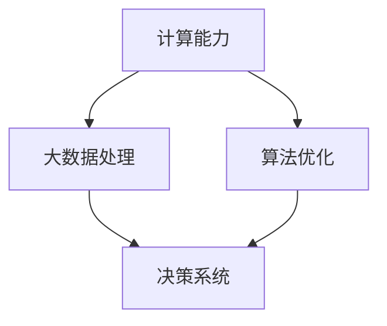

                 

# 计算变化带来的自动化新机遇

在快速发展的数字化时代，计算能力正以前所未有的速度提升，深刻地改变着我们社会的方方面面。从个人日常到企业运营，从科学研究到社会治理，自动化技术正在大放异彩。本文旨在探讨计算变化带来的自动化新机遇，通过深入分析关键技术原理，提出具体的实践策略，并提供前瞻性应用展望，为读者展现计算技术如何塑造未来。

## 1. 背景介绍

### 1.1 计算能力的飞速提升
计算能力的提升始于硬件的进步，特别是集成电路和微处理器的发展。摩尔定律预言，晶体管数目每两年翻一番，尽管近年面临一定瓶颈，但性能提升依然显著。此外，云计算和分布式计算技术的崛起，使得计算资源变得更为广泛可及，形成了以云为中心的计算范式。在软件层面，编译器、编程语言和算法优化的改进，使得程序执行效率大大提升。

### 1.2 自动化技术的广泛应用
自动化的概念由来已久，但随着计算能力的提升，自动化技术的应用范围和深度有了质的飞跃。机器人、智能系统、智能制造、智慧城市等领域，自动化已从简单的自动化控制向智能化、自主化迈进。自动化技术不仅提升了工作效率，减少了人力成本，还带来了更高质量的服务和产品。

### 1.3 自动化技术演进的历史脉络
早期的自动化主要依赖预先编程的规则和逻辑，通过传感器和执行器控制机械或电子系统。随着计算能力的提升，算法和人工智能技术被引入，实现了更加灵活的决策和自适应。通过大数据、机器学习和深度学习的加持，自动化系统能够处理更复杂的问题，提供更精确的预测和决策。

## 2. 核心概念与联系

### 2.1 核心概念概述
在自动化进程中，计算能力、算法和决策系统是三个关键环节。计算能力提供了数据处理的基础，算法负责模型构建和优化，决策系统则实现自动化的核心功能。这三个环节紧密联系，共同推动自动化的演进。

### 2.2 核心概念原理和架构的 Mermaid 流程图


这个流程图展示了计算、算法和决策系统之间的联系：

- 计算能力（A）是自动化系统的核心基础设施，提供了数据存储、处理和传输的支撑。
- 大数据处理（B）通过算法（C）的优化，能够高效地提取和利用数据，为决策提供支持。
- 决策系统（D）根据算法处理的结果，自动执行任务，实现自动化的核心功能。

## 3. 核心算法原理 & 具体操作步骤

### 3.1 算法原理概述

自动化技术的核心是算法，它们通过逻辑、统计、机器学习等手段，实现从数据到决策的自动化。算法的好坏直接影响到自动化的效果和效率。常用的自动化算法包括：

- **决策树**：基于树形结构对数据进行分类和预测，适用于处理结构化数据。
- **支持向量机**：通过最大化间隔对数据进行分类，适用于高维数据和非线性分类。
- **神经网络**：通过多层非线性映射实现复杂的决策任务，适用于大规模、非结构化数据的分类和预测。
- **强化学习**：通过模拟环境中的试错学习，实现最优决策，适用于动态环境下的自动化控制。

### 3.2 算法步骤详解
以**神经网络算法**为例，其基本步骤包括：

1. **数据准备**：收集、清洗和预处理数据，确保数据质量。
2. **模型选择**：根据任务需求选择合适的神经网络架构，如CNN、RNN、LSTM等。
3. **模型训练**：使用训练集对模型进行迭代训练，调整参数优化模型性能。
4. **模型评估**：使用测试集对模型进行性能评估，判断是否满足要求。
5. **模型部署**：将模型集成到自动化系统中，实现自动决策。

### 3.3 算法优缺点
**神经网络算法的优点**包括：
- **自适应能力**：能够处理非结构化数据，适应不同领域的自动化需求。
- **灵活性**：可以根据任务需求调整网络结构，实现不同的决策功能。

**神经网络算法的缺点**包括：
- **计算资源消耗大**：需要大量计算资源进行训练和推理。
- **模型复杂性高**：过度复杂的网络可能出现梯度消失或爆炸问题，影响训练和推理效率。

### 3.4 算法应用领域

自动化算法在各个领域都有广泛应用，以下是几个主要领域：

1. **智能制造**：通过机器视觉和深度学习技术，实现产品质量检测、设备维护和生产调度。
2. **智能客服**：利用自然语言处理和强化学习技术，实现自动回答客户咨询和问题解决。
3. **智慧城市**：通过物联网和大数据分析技术，实现交通管理、环境保护和社会治理。
4. **医疗健康**：应用图像识别和推荐系统技术，提升疾病诊断和治疗方案推荐的效果。
5. **金融服务**：利用机器学习和数据挖掘技术，实现风险控制、欺诈检测和投资建议。

## 4. 数学模型和公式 & 详细讲解 & 举例说明

### 4.1 数学模型构建
以**线性回归模型**为例，其数学模型为：
$$ y = \beta_0 + \beta_1 x_1 + \beta_2 x_2 + \cdots + \beta_n x_n + \epsilon $$
其中，$y$ 为输出变量，$\beta_i$ 为权重参数，$x_i$ 为输入变量，$\epsilon$ 为误差项。

### 4.2 公式推导过程
线性回归模型的目标是找到最优的参数$\beta_i$，使得预测值与实际值之间的误差最小。通过最小二乘法，可以推导出参数的最优解：
$$ \beta_i = \frac{\sum (x_i y_i) - \frac{\sum x_i \sum y_i}{N} \sum x_i}{\sum x_i^2 - \frac{(\sum x_i)^2}{N}} $$

### 4.3 案例分析与讲解
考虑一个简单的房价预测问题。收集历史房价数据，包括面积、位置、年代等特征，使用线性回归模型进行房价预测。通过训练集和测试集的对比，可以评估模型的预测效果。

## 5. 项目实践：代码实例和详细解释说明

### 5.1 开发环境搭建
开发自动化项目，首先需要搭建好开发环境。以Python为例，推荐使用Anaconda创建虚拟环境，安装必要的库如NumPy、Pandas、scikit-learn等，确保数据处理和算法开发的便利。

### 5.2 源代码详细实现
以下是一个使用scikit-learn库实现线性回归模型的Python代码示例：
```python
from sklearn.linear_model import LinearRegression
from sklearn.metrics import mean_squared_error

# 数据准备
X = [[1], [2], [3], [4], [5]]
y = [2, 4, 6, 8, 10]

# 模型训练
model = LinearRegression()
model.fit(X, y)

# 模型评估
y_pred = model.predict([[6], [7]])
print(f"预测值: {y_pred}")
print(f"均方误差: {mean_squared_error(y, y_pred)}")
```

### 5.3 代码解读与分析
上述代码展示了线性回归模型的基本流程：
- 数据准备：将特征和标签封装成X和y数组。
- 模型训练：创建LinearRegression对象，并使用fit方法拟合模型。
- 模型评估：使用predict方法进行预测，并使用mean_squared_error计算均方误差。

### 5.4 运行结果展示
运行上述代码，输出预测值和均方误差，可以评估模型的准确性和泛化能力。

## 6. 实际应用场景

### 6.1 智能制造

智能制造领域，自动化技术的应用主要包括：
- **设备监控**：通过传感器和物联网技术，实时监控设备状态，预测故障和维护需求。
- **生产调度**：利用机器学习和优化算法，优化生产计划和资源分配，提高生产效率。
- **质量检测**：应用计算机视觉和深度学习技术，自动检测产品质量，减少人工检查成本。

### 6.2 智慧城市

智慧城市通过自动化技术，实现：
- **智能交通**：利用大数据和物联网技术，优化交通流量，减少拥堵。
- **环保监测**：通过传感器和数据分析，实时监控环境变化，提升环境保护水平。
- **社会治理**：应用机器学习和强化学习技术，实现公共安全、犯罪预防等智能治理功能。

### 6.3 医疗健康

在医疗健康领域，自动化技术的应用包括：
- **疾病诊断**：利用图像识别和深度学习技术，自动分析医学影像，辅助医生诊断。
- **治疗方案推荐**：应用推荐系统算法，根据病历和症状推荐最适合的治疗方案。
- **健康管理**：通过物联网设备收集健康数据，进行长期健康监测和预警。

### 6.4 未来应用展望

未来的自动化技术将更加智能化、自主化，以下是几个可能的趋势：

1. **自动化决策系统**：利用机器学习和强化学习，构建更加智能的决策系统，实现自动化的高级决策功能。
2. **多模态融合**：结合视觉、听觉、触觉等多种模态数据，提升自动化系统的感知和决策能力。
3. **自适应学习**：通过模型自适应机制，使自动化系统能够不断学习和改进，适应环境变化。
4. **人机协同**：实现自动化系统与人类协作，提升决策的准确性和可靠性。
5. **边缘计算**：将计算任务分布到边缘设备，降低网络延迟，提高自动化系统的响应速度。

## 7. 工具和资源推荐

### 7.1 学习资源推荐

1. **《机器学习》书籍**：由周志华所著，系统讲解了机器学习的基本概念和算法，是学习自动化技术的入门必读。
2. **Coursera课程**：提供多门机器学习和深度学习课程，涵盖从基础到高级的内容，适合不同层次的学习者。
3. **Kaggle竞赛**：通过参与实际项目，实践机器学习和数据挖掘技术，提升实战能力。

### 7.2 开发工具推荐

1. **Python编程语言**：作为自动化开发的主流语言，Python以其易学易用和丰富的库资源，成为自动化开发的首选。
2. **Jupyter Notebook**：用于编写和分享代码，支持代码块的实时运行和结果展示。
3. **TensorFlow和PyTorch**：两大深度学习框架，提供强大的计算图和模型训练功能，支持各种自动化算法的开发。

### 7.3 相关论文推荐

1. **《深度学习》书籍**：由Ian Goodfellow等编著，全面介绍了深度学习的基本原理和应用，是自动化领域的重要参考。
2. **ICML会议论文**：机器学习领域的顶级会议，每年发布大量前沿论文，涵盖自动化技术的研究进展。
3. **NIPS会议论文**：神经信息处理系统的顶级会议，介绍了深度学习和机器学习在自动化领域的应用。

## 8. 总结：未来发展趋势与挑战

### 8.1 研究成果总结

自动化技术的发展离不开计算能力的提升和算法的优化。过去几十年来，从简单的规则控制到复杂的算法决策，自动化技术实现了从简单到复杂的飞跃。机器学习、深度学习等技术的应用，使得自动化系统能够处理更加复杂和动态的问题。

### 8.2 未来发展趋势

未来的自动化技术将更加智能化、自主化，主要趋势包括：
- **深度学习的应用**：深度学习技术将广泛应用于自动化系统，提升决策的准确性和鲁棒性。
- **多模态融合**：结合视觉、听觉、触觉等多种模态数据，提升自动化系统的感知和决策能力。
- **边缘计算**：将计算任务分布到边缘设备，降低网络延迟，提高自动化系统的响应速度。
- **自适应学习**：通过模型自适应机制，使自动化系统能够不断学习和改进，适应环境变化。

### 8.3 面临的挑战

自动化技术的发展也面临诸多挑战，主要包括：
- **数据隐私和安全**：自动化系统依赖大量数据，数据隐私和安全问题亟待解决。
- **计算资源消耗**：深度学习等算法的计算需求大，需要高性能计算资源支持。
- **算法公平性和透明性**：自动化系统依赖算法决策，如何保证算法的公平性和透明性，是一个重要的研究方向。
- **人机协同**：在复杂任务中，如何实现人机协同，提升自动化系统的可解释性和可信度。

### 8.4 研究展望

未来的研究将聚焦于以下几个方向：
- **隐私保护技术**：研究数据加密、匿名化等隐私保护技术，确保数据安全和隐私。
- **高效计算技术**：研究分布式计算、边缘计算等技术，降低计算资源消耗。
- **公平算法**：研究公平性算法，提升自动化系统的公平性和透明性。
- **可解释性研究**：研究可解释性算法和模型，提升自动化系统的可解释性和可信度。

## 9. 附录：常见问题与解答

**Q1: 什么是自动化技术？**

A: 自动化技术是指利用计算机和智能系统，代替或辅助人类完成特定任务的技术。它包括传感器、执行器、控制器和决策器等关键组件，通过逻辑、算法和数据处理实现任务自动化。

**Q2: 自动化技术的应用场景有哪些？**

A: 自动化技术广泛应用于智能制造、智慧城市、医疗健康、金融服务等领域。例如，智能制造中的设备监控和生产调度，智慧城市中的智能交通和环保监测，医疗健康中的疾病诊断和治疗方案推荐。

**Q3: 如何构建自动化系统？**

A: 构建自动化系统需要遵循以下步骤：
1. 确定自动化目标和需求。
2. 收集和处理数据，准备训练集和测试集。
3. 选择合适的算法，进行模型训练和优化。
4. 部署模型，实现自动决策。

**Q4: 自动化技术面临哪些挑战？**

A: 自动化技术面临的挑战包括数据隐私和安全、计算资源消耗、算法公平性和透明性等问题。需要通过技术创新和政策法规来解决这些问题，确保自动化技术的安全、可靠和可解释性。

**Q5: 未来的自动化技术发展趋势是什么？**

A: 未来的自动化技术将更加智能化、自主化，主要趋势包括深度学习的应用、多模态融合、边缘计算、自适应学习等。同时，也需要关注数据隐私、计算资源、算法公平性和透明性等挑战，确保自动化技术的健康发展。

