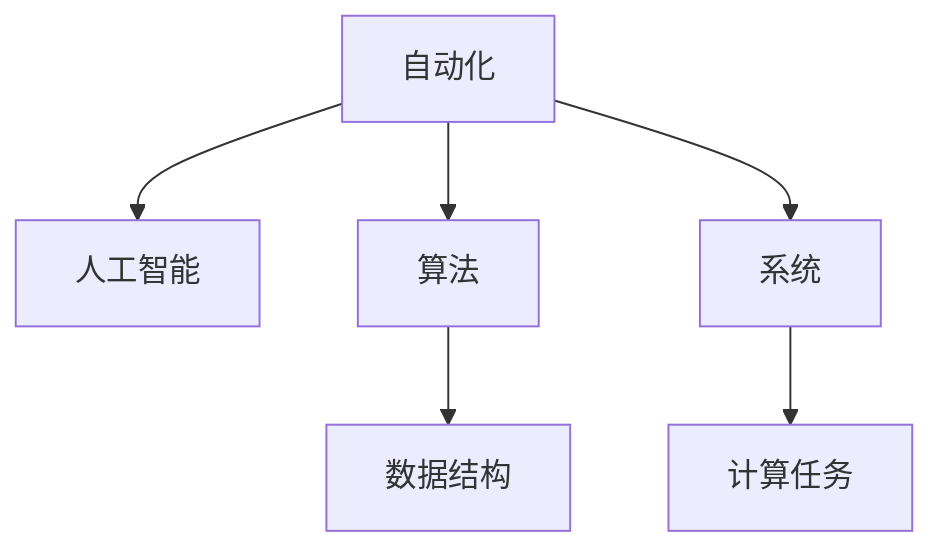

                 

# 计算技术的变革与自动化

计算技术的迅猛发展不仅改变了人类的生产方式和生活方式，更引发了一场新的工业革命。从早期的机械计算到现代的电子计算机，每一次技术变革都极大地推动了社会进步，优化了资源配置，释放了人类生产力。在当今数字化时代，自动化和人工智能正成为计算技术革新的新方向，引领着未来的技术潮流。本文将从背景介绍、核心概念、核心算法、项目实践、实际应用、工具资源、总结展望等多个维度，全面系统地探讨计算技术的变革与自动化。

## 1. 背景介绍

### 1.1 问题由来

在过去几十年中，计算技术经历了多次重大变革，从早期基于机械的计算到基于电子的计算，从单机计算到分布式计算，从串行计算到并行计算，从集中式计算到云服务计算。每一次变革，都极大地提升了计算效率，降低了计算成本，为各行各业带来了革命性的改变。

当前，计算技术的最新发展趋势是自动化和人工智能。自动化使得计算任务能够自动执行，而无需人工干预，从而大幅提升了效率和精度。人工智能则通过模拟人类智能，使计算任务能够更加智能地完成，适应复杂的非结构化数据处理和决策过程。

自动化和人工智能的结合，带来了计算技术的又一次飞跃，促使各行各业加速向智能自动化转型，进一步提升了生产力和经济效益。

### 1.2 问题核心关键点

自动化和人工智能在计算技术中的核心关键点包括：
- 自动化：指计算任务能够自动执行，无需人工干预。通过脚本、自动化工具、智能系统等手段，实现计算任务的自动化。
- 人工智能：指计算机能够模拟人类智能，包括感知、推理、学习、决策等过程。通过机器学习、深度学习、自然语言处理等技术，实现更高效、更智能的计算。
- 算法优化：通过高效的算法和数据结构，提升计算效率和效果，降低计算成本。
- 系统优化：通过软件工程、系统设计等手段，提升系统性能和可扩展性。

这些关键点构成了自动化和人工智能计算技术的核心，驱动着整个技术体系的演进和发展。

## 2. 核心概念与联系

### 2.1 核心概念概述

为更好地理解自动化和人工智能在计算技术中的应用，本节将介绍几个密切相关的核心概念：

- 自动化(Automation)：指通过脚本、程序、机器人等方式，自动执行计算任务，无需人工干预。自动化提高了效率和精确度，减少了人工错误。
- 人工智能(Artificial Intelligence)：指计算机能够模拟人类智能，包括感知、推理、学习、决策等过程。通过机器学习、深度学习、自然语言处理等技术，实现更高效、更智能的计算。
- 算法(Algorithm)：指解决特定问题的数学或计算方法，能够自动化地处理数据和执行计算。
- 数据结构(Data Structure)：指组织和存储数据的方式，能够优化数据的访问和处理。
- 系统(System)：指由多个组件和模块构成的计算系统，能够协同工作完成计算任务。

这些概念之间的逻辑关系可以通过以下Mermaid流程图来展示：



这个流程图展示了几大概念之间的联系：

1. 自动化通过算法和数据结构，使计算任务能够高效地执行。
2. 人工智能利用算法和数据结构，模拟人类智能，实现更智能的计算。
3. 系统通过算法和数据结构，实现多个组件的协同工作。
4. 计算任务是自动化和人工智能应用的核心，是整个技术体系的目标。

## 3. 核心算法原理 & 具体操作步骤

### 3.1 算法原理概述

自动化和人工智能的核心算法包括机器学习、深度学习、自然语言处理、图像处理等。这些算法通过训练数据，自动学习数据的规律和特征，从而实现自动化的数据处理和智能的决策过程。

以深度学习为例，其基本原理是通过多层神经网络，对输入数据进行自动特征提取和模式学习，最终输出预测结果。深度学习的核心在于通过大量标注数据进行反向传播训练，优化模型参数，使得模型能够对新的未标注数据进行预测。

### 3.2 算法步骤详解

以深度学习算法为例，其核心步骤包括：

1. 数据准备：收集和预处理数据，确保数据质量，包括数据清洗、数据增强、数据划分等。
2. 模型构建：选择合适的深度学习模型架构，如卷积神经网络(CNN)、循环神经网络(RNN)、Transformer等，定义模型的输入、隐藏层和输出。
3. 参数初始化：随机初始化模型参数，为模型的训练提供初始值。
4. 训练过程：通过反向传播算法，对模型参数进行优化，最小化损失函数。
5. 模型评估：在验证集上评估模型性能，根据评估结果调整模型参数。
6. 模型应用：使用训练好的模型，对新的数据进行预测或推理。

### 3.3 算法优缺点

自动化和人工智能算法具有以下优点：
1. 自动化提高效率和精度。通过自动化算法，可以大大减少人工干预，提高计算任务的处理速度和准确性。
2. 人工智能提升决策质量。通过学习数据规律和特征，人工智能算法能够进行更精确、更智能的决策。
3. 算法可扩展性强。通过优化算法和数据结构，可以轻松扩展计算能力，适应更大规模的数据处理需求。
4. 算法灵活性强。通过选择合适的算法和模型架构，可以适应不同的计算任务和数据类型。

同时，这些算法也存在一些缺点：
1. 数据依赖性强。算法需要大量标注数据进行训练，数据不足时，模型的效果会大打折扣。
2. 计算成本高。深度学习等算法需要高性能计算资源，如GPU、TPU等，计算成本较高。
3. 模型解释性差。自动化和人工智能算法通常是"黑盒"模型，难以解释其内部决策过程。
4. 算法鲁棒性不足。算法在面对新数据和噪声时，容易发生性能波动。

尽管存在这些局限性，但就目前而言，自动化和人工智能算法仍然是最主流、最有效的计算技术范式，得到了广泛应用。

### 3.4 算法应用领域

自动化和人工智能算法在多个领域得到了广泛应用，包括：

1. 自然语言处理(NLP)：包括文本分类、情感分析、机器翻译、问答系统等。
2. 计算机视觉(CV)：包括图像识别、目标检测、图像分割等。
3. 机器学习(ML)：包括回归、分类、聚类、降维等。
4. 强化学习(RL)：包括游戏、机器人控制、推荐系统等。
5. 数据分析和大数据处理：包括数据清洗、特征提取、数据挖掘等。
6. 智能推荐系统：包括电商推荐、内容推荐、个性化广告等。
7. 工业自动化：包括智能制造、智能物流、智能仓储等。
8. 医疗健康：包括智能诊断、健康监测、药物研发等。
9. 金融科技：包括风险管理、智能投顾、智能客服等。

这些领域的应用，展示了自动化和人工智能在计算技术中的广泛影响和巨大潜力。

## 4. 数学模型和公式 & 详细讲解 & 举例说明

### 4.1 数学模型构建

以深度学习算法为例，其数学模型通常由以下几个部分组成：

1. 输入数据：$x$，表示待处理的样本，通常为向量形式。
2. 隐藏层：$h$，表示神经网络中的中间层，通过非线性变换对输入数据进行处理。
3. 输出层：$y$，表示神经网络的输出，通常为概率分布形式。

深度学习模型可以表示为：

$$
y=f(h_1,f_1(h_0,x))
$$

其中 $f$ 表示激活函数，$h_k$ 表示隐藏层的第 $k$ 层输出，$h_0$ 表示输入数据经过前向传播得到的第一层隐藏层输出。

### 4.2 公式推导过程

以最简单的全连接神经网络为例，其前向传播过程可以表示为：

$$
y=\sigma(Wx+b)
$$

其中 $x$ 表示输入向量，$W$ 表示权重矩阵，$b$ 表示偏置向量，$\sigma$ 表示激活函数。

通过反向传播算法，计算模型损失函数 $L$ 对参数 $W$ 和 $b$ 的梯度，更新参数值，最小化损失函数：

$$
\frac{\partial L}{\partial W}=\frac{\partial L}{\partial y}\frac{\partial y}{\partial h}\frac{\partial h}{\partial W}
$$

$$
\frac{\partial L}{\partial b}=\frac{\partial L}{\partial y}\frac{\partial y}{\partial h}\frac{\partial h}{\partial b}
$$

其中 $\frac{\partial L}{\partial y}$ 表示损失函数对输出的梯度，$\frac{\partial y}{\partial h}$ 表示输出对隐藏层的梯度，$\frac{\partial h}{\partial W}$ 和 $\frac{\partial h}{\partial b}$ 表示隐藏层对权重和偏置的梯度。

通过循环迭代，不断更新模型参数，使模型能够更好地拟合训练数据。

### 4.3 案例分析与讲解

以图像识别为例，其核心算法是卷积神经网络(CNN)。CNN通过卷积层、池化层、全连接层等模块，自动提取图像特征，实现图像识别。

CNN的卷积层可以表示为：

$$
y_{ij}=\sum_{mn}w_{mn}x_{ij-mn}+b_{ij}
$$

其中 $x_{ij-mn}$ 表示卷积核与输入数据对应位置进行卷积操作的结果，$w_{mn}$ 表示卷积核的权重，$b_{ij}$ 表示卷积层的偏置。

池化层可以表示为：

$$
y_i=\max_k(z_{ik})
$$

其中 $z_{ik}$ 表示池化层对卷积层输出进行池化操作的结果，$\max_k$ 表示取最大值操作。

通过不断堆叠卷积层和池化层，CNN可以自动提取图像的局部特征，并进行层级抽象，实现更高效、更准确的图像识别。

## 5. 项目实践：代码实例和详细解释说明

### 5.1 开发环境搭建

在进行自动化和人工智能项目开发前，我们需要准备好开发环境。以下是使用Python进行TensorFlow开发的环境配置流程：

1. 安装Anaconda：从官网下载并安装Anaconda，用于创建独立的Python环境。

2. 创建并激活虚拟环境：
```bash
conda create -n tf-env python=3.8 
conda activate tf-env
```

3. 安装TensorFlow：根据CUDA版本，从官网获取对应的安装命令。例如：
```bash
conda install tensorflow tensorflow-gpu
```

4. 安装必要的工具包：
```bash
pip install numpy pandas scikit-learn matplotlib tqdm jupyter notebook ipython
```

完成上述步骤后，即可在`tf-env`环境中开始项目实践。

### 5.2 源代码详细实现

这里我们以图像识别任务为例，给出使用TensorFlow实现卷积神经网络（CNN）的PyTorch代码实现。

首先，定义CNN模型：

```python
import tensorflow as tf

class CNN(tf.keras.Model):
    def __init__(self):
        super(CNN, self).__init__()
        self.conv1 = tf.keras.layers.Conv2D(32, 3, activation='relu')
        self.pool1 = tf.keras.layers.MaxPooling2D()
        self.flatten = tf.keras.layers.Flatten()
        self.fc1 = tf.keras.layers.Dense(128, activation='relu')
        self.fc2 = tf.keras.layers.Dense(10, activation='softmax')
    
    def call(self, x):
        x = self.conv1(x)
        x = self.pool1(x)
        x = self.flatten(x)
        x = self.fc1(x)
        x = self.fc2(x)
        return x
```

然后，定义训练和评估函数：

```python
def train_epoch(model, dataset, batch_size, optimizer):
    model.train()
    for batch in dataset:
        inputs = batch['x']
        labels = batch['y']
        with tf.GradientTape() as tape:
            outputs = model(inputs)
            loss = tf.keras.losses.SparseCategoricalCrossentropy()(outputs, labels)
        gradients = tape.gradient(loss, model.trainable_variables)
        optimizer.apply_gradients(zip(gradients, model.trainable_variables))
    
def evaluate(model, dataset, batch_size):
    model.eval()
    correct_predictions = 0
    total_predictions = 0
    for batch in dataset:
        inputs = batch['x']
        labels = batch['y']
        outputs = model(inputs)
        predictions = tf.argmax(outputs, axis=1)
        correct_predictions += tf.reduce_sum(tf.cast(predictions == labels, dtype=tf.int32))
        total_predictions += labels.shape[0]
    return correct_predictions, total_predictions
```

最后，启动训练流程并在测试集上评估：

```python
epochs = 10
batch_size = 64

for epoch in range(epochs):
    train_epoch(model, train_dataset, batch_size, optimizer)
    correct_predictions, total_predictions = evaluate(model, test_dataset, batch_size)
    accuracy = correct_predictions / total_predictions
    print(f"Epoch {epoch+1}, accuracy: {accuracy:.2f}%")
```

以上就是使用TensorFlow实现CNN图像识别任务的完整代码实现。可以看到，TensorFlow的高级API使得模型构建和训练过程变得简洁高效。

### 5.3 代码解读与分析

让我们再详细解读一下关键代码的实现细节：

**CNN类**：
- `__init__`方法：定义卷积层、池化层、全连接层等模块。
- `call`方法：实现模型的前向传播过程。

**训练和评估函数**：
- `train_epoch`方法：在训练集上进行前向传播和反向传播，更新模型参数。
- `evaluate`方法：在测试集上进行前向传播和预测，计算模型的准确率。

**训练流程**：
- 定义总的epoch数和batch size，开始循环迭代
- 每个epoch内，先在训练集上训练，输出准确率
- 在测试集上评估，输出最终测试结果

可以看到，TensorFlow的高级API使得模型构建和训练过程变得简洁高效。开发者可以将更多精力放在数据处理、模型改进等高层逻辑上，而不必过多关注底层的实现细节。

当然，工业级的系统实现还需考虑更多因素，如模型的保存和部署、超参数的自动搜索、更灵活的任务适配层等。但核心的模型构建和训练过程基本与此类似。

## 6. 实际应用场景

### 6.1 智能制造

在智能制造领域，自动化和人工智能技术的应用，显著提高了生产效率和产品质量。通过机器视觉、机器人控制等技术，企业能够实现自动化生产、智能调度、质量检测等功能，减少人工干预，降低生产成本，提升产品竞争力。

例如，在汽车制造领域，通过自动化和人工智能技术，可以实现自动化装配、质量检测、故障诊断等功能。智能机器人可以自动完成复杂、精细的装配任务，显著提高生产效率和准确性。通过机器视觉技术，可以实现对产品外观和尺寸的实时检测，及时发现和修正生产过程中的质量问题。

### 6.2 智能交通

在智能交通领域，自动化和人工智能技术的应用，显著提升了交通管理和出行体验。通过交通监控、路径规划、自动驾驶等技术，交通管理部门和出行者能够实现更智能、更高效的交通系统。

例如，在自动驾驶领域，通过传感器、摄像头、雷达等技术，实现对车辆周边环境的实时感知，进行路径规划和决策控制，提升驾驶安全和效率。在交通监控领域，通过视频分析、智能算法等技术，实现对交通流量、道路拥堵等信息的实时监测和预测，优化交通管理决策。

### 6.3 智能医疗

在智能医疗领域，自动化和人工智能技术的应用，显著提升了医疗服务质量和效率。通过医学影像分析、患者管理、智能诊断等技术，医疗机构能够实现更智能、更精准的医疗服务。

例如，在医学影像分析领域，通过卷积神经网络等技术，实现对CT、MRI等医学影像的自动分析和诊断，减少医生诊断时间，提高诊断准确性。在患者管理领域，通过智能推荐系统等技术，实现对患者健康数据的分析和管理，提供个性化的健康建议和诊疗方案。

### 6.4 未来应用展望

随着自动化和人工智能技术的不断发展，其在各个领域的应用前景广阔，潜力巨大。未来，我们相信以下几个方向将成为自动化和人工智能技术的重要发展趋势：

1. 自动化和人工智能的深度融合：未来的计算技术将更加注重自动化和人工智能的深度融合，实现更智能、更高效的自动化系统。例如，基于自动化和人工智能的智能机器人，能够具备更强的感知、推理和决策能力，广泛应用于制造、医疗、交通等领域。

2. 自动化和人工智能的协同优化：未来的计算技术将更加注重自动化和人工智能的协同优化，实现更高效、更稳定的系统。例如，通过优化自动化和人工智能系统的协同工作机制，实现更智能的任务分配和资源调配，提升系统性能和可扩展性。

3. 自动化和人工智能的泛化应用：未来的计算技术将更加注重自动化和人工智能的泛化应用，实现更广泛、更深入的应用场景。例如，自动化和人工智能技术将在教育、娱乐、艺术等领域得到更广泛的应用，带来更多创新和机遇。

4. 自动化和人工智能的安全保障：未来的计算技术将更加注重自动化和人工智能的安全保障，实现更可靠、更安全的系统。例如，通过建立完善的自动化和人工智能系统的安全机制，保障系统的稳定运行和数据安全，避免潜在的安全风险。

5. 自动化和人工智能的伦理道德：未来的计算技术将更加注重自动化和人工智能的伦理道德，实现更公平、更公正的系统。例如，通过引入伦理道德约束机制，保障自动化和人工智能系统的公正性和可解释性，避免潜在的不公平和偏见。

这些趋势将进一步推动自动化和人工智能技术的发展，提升各行各业的生产效率和服务质量，带来更广阔的创新和应用空间。

## 7. 工具和资源推荐

### 7.1 学习资源推荐

为了帮助开发者系统掌握自动化和人工智能的理论基础和实践技巧，这里推荐一些优质的学习资源：

1. 《深度学习》（Ian Goodfellow）：深度学习领域的经典教材，详细介绍了深度学习的基本原理和应用实例。

2. 《Python深度学习》（Francois Chollet）：基于Keras框架的深度学习实战指南，提供了丰富的代码示例和案例分析。

3. Coursera深度学习课程：由斯坦福大学开设的深度学习课程，有Lecture视频和配套作业，带你深入理解深度学习的基本原理和实际应用。

4. Google AI Coursera专业课程：Google AI提供的深度学习专业课程，涵盖了深度学习的基础和高级内容，适合深入学习和实践。

5. TensorFlow官方文档：TensorFlow的官方文档，提供了全面的API参考、示例代码和教程，是学习TensorFlow的重要资源。

6. PyTorch官方文档：PyTorch的官方文档，提供了丰富的API参考和示例代码，适合深入学习和实践。

通过对这些资源的学习实践，相信你一定能够快速掌握自动化和人工智能的精髓，并用于解决实际的计算问题。

### 7.2 开发工具推荐

高效的开发离不开优秀的工具支持。以下是几款用于自动化和人工智能开发的常用工具：

1. TensorFlow：由Google主导开发的开源深度学习框架，生产部署方便，适合大规模工程应用。

2. PyTorch：由Facebook主导开发的开源深度学习框架，灵活动态的计算图，适合快速迭代研究。

3. Jupyter Notebook：交互式的代码编辑器，适合快速实验和分享代码。

4. Visual Studio Code：轻量级的代码编辑器，支持多种语言和工具集，适合多任务开发。

5. Git和GitHub：版本控制和代码托管工具，适合团队协作和代码管理。

6. Docker和Kubernetes：容器化和容器编排工具，适合应用部署和资源管理。

合理利用这些工具，可以显著提升自动化和人工智能开发的效率，加快创新迭代的步伐。

### 7.3 相关论文推荐

自动化和人工智能的发展源于学界的持续研究。以下是几篇奠基性的相关论文，推荐阅读：

1. AlexNet：ImageNet大规模视觉识别挑战赛冠军模型，展示了深度学习的潜力。

2. VGGNet：ImageNet大规模视觉识别挑战赛冠军模型，通过卷积层的深度和宽度提升图像识别的准确性。

3. ResNet：ImageNet大规模视觉识别挑战赛冠军模型，通过残差连接解决深度网络的梯度消失问题。

4. GANs：生成对抗网络，通过生成器和判别器的对抗训练，生成高质量的图像和视频。

5. Reinforcement Learning：强化学习，通过奖励信号引导智能体学习最优策略，应用于游戏、机器人等领域。

6. Transformer：基于自注意力机制的神经网络，用于自然语言处理任务，展示了自动化和人工智能技术的强大应用前景。

这些论文代表了大规模深度学习技术的演进脉络，为自动化和人工智能的发展奠定了基础。

## 8. 总结：未来发展趋势与挑战

### 8.1 研究成果总结

本文对自动化和人工智能在计算技术中的应用进行了全面系统的介绍。首先阐述了自动化和人工智能的计算技术变革背景和意义，明确了自动化和人工智能在提升生产效率和服务质量方面的独特价值。其次，从原理到实践，详细讲解了自动化和人工智能的核心算法和具体操作步骤，给出了具体的代码实例和详细解释说明。同时，本文还广泛探讨了自动化和人工智能技术在智能制造、智能交通、智能医疗等多个领域的应用前景，展示了自动化和人工智能在计算技术中的广泛影响和巨大潜力。此外，本文精选了自动化和人工智能技术的各类学习资源，力求为读者提供全方位的技术指引。

通过本文的系统梳理，可以看到，自动化和人工智能技术正在成为计算技术革新的新方向，极大地提升了各行各业的生产力和经济效益。未来，伴随自动化和人工智能技术的持续演进，其在各个领域的应用前景将更加广阔，带来更多的创新和机遇。

### 8.2 未来发展趋势

展望未来，自动化和人工智能技术的发展趋势包括：

1. 自动化和人工智能的深度融合：未来的计算技术将更加注重自动化和人工智能的深度融合，实现更智能、更高效的自动化系统。

2. 自动化和人工智能的协同优化：未来的计算技术将更加注重自动化和人工智能的协同优化，实现更高效、更稳定的系统。

3. 自动化和人工智能的泛化应用：未来的计算技术将更加注重自动化和人工智能的泛化应用，实现更广泛、更深入的应用场景。

4. 自动化和人工智能的安全保障：未来的计算技术将更加注重自动化和人工智能的安全保障，实现更可靠、更安全的系统。

5. 自动化和人工智能的伦理道德：未来的计算技术将更加注重自动化和人工智能的伦理道德，实现更公平、更公正的系统。

这些趋势将进一步推动自动化和人工智能技术的发展，提升各行各业的生产效率和服务质量，带来更广阔的创新和应用空间。

### 8.3 面临的挑战

尽管自动化和人工智能技术已经取得了瞩目成就，但在迈向更加智能化、普适化应用的过程中，仍面临诸多挑战：

1. 数据依赖性强。自动化和人工智能算法需要大量标注数据进行训练，数据不足时，模型的效果会大打折扣。如何进一步降低自动化和人工智能技术对标注样本的依赖，将是一大难题。

2. 计算成本高。深度学习等算法需要高性能计算资源，如GPU、TPU等，计算成本较高。如何降低计算成本，提高计算效率，将是重要的优化方向。

3. 模型解释性差。自动化和人工智能算法通常是"黑盒"模型，难以解释其内部决策过程。如何赋予自动化和人工智能模型更强的可解释性，将是亟待攻克的难题。

4. 算法鲁棒性不足。算法在面对新数据和噪声时，容易发生性能波动。如何提高自动化和人工智能算法的鲁棒性，避免灾难性遗忘，还需要更多理论和实践的积累。

5. 伦理道德问题。自动化和人工智能技术可能在不知不觉中传递偏见、有害信息等，给实际应用带来安全隐患。如何确保自动化和人工智能技术的公平性和可解释性，确保输出的安全性，也将是重要的研究课题。

这些挑战亟需解决，才能让自动化和人工智能技术在各行各业中得到更广泛的应用，更好地造福人类社会。

### 8.4 研究展望

面对自动化和人工智能技术所面临的挑战，未来的研究需要在以下几个方面寻求新的突破：

1. 无监督和半监督自动化和人工智能方法：摆脱对大规模标注数据的依赖，利用自监督学习、主动学习等无监督和半监督范式，最大限度利用非结构化数据，实现更加灵活高效的自动化和人工智能技术。

2. 参数高效和计算高效的自动化和人工智能范式：开发更加参数高效的自动化和人工智能方法，在固定大部分预训练参数的同时，只更新极少量的任务相关参数。同时优化自动化和人工智能算法的计算图，减少前向传播和反向传播的资源消耗，实现更加轻量级、实时性的部署。

3. 融合因果和对比学习范式：通过引入因果推断和对比学习思想，增强自动化和人工智能算法的建立稳定因果关系的能力，学习更加普适、鲁棒的语言表征，从而提升算法泛化性和抗干扰能力。

4. 引入更多先验知识：将符号化的先验知识，如知识图谱、逻辑规则等，与神经网络模型进行巧妙融合，引导自动化和人工智能算法的微调过程学习更准确、合理的语言模型。同时加强不同模态数据的整合，实现视觉、语音等多模态信息与文本信息的协同建模。

5. 结合因果分析和博弈论工具：将因果分析方法引入自动化和人工智能算法的微调过程，识别出算法决策的关键特征，增强输出的因果性和逻辑性。借助博弈论工具刻画人机交互过程，主动探索并规避算法的脆弱点，提高系统稳定性。

6. 纳入伦理道德约束：在自动化和人工智能算法的训练目标中引入伦理导向的评估指标，过滤和惩罚有偏见、有害的输出倾向。同时加强人工干预和审核，建立算法行为的监管机制，确保输出的公平性和道德性。

这些研究方向的探索，将引领自动化和人工智能技术迈向更高的台阶，为构建安全、可靠、可解释、可控的智能系统铺平道路。面向未来，自动化和人工智能技术还需要与其他人工智能技术进行更深入的融合，如知识表示、因果推理、强化学习等，多路径协同发力，共同推动自动化和人工智能技术的进步。只有勇于创新、敢于突破，才能不断拓展计算技术的边界，让智能技术更好地造福人类社会。

## 9. 附录：常见问题与解答

**Q1：自动化和人工智能技术如何应用到实际生产中？**

A: 自动化和人工智能技术可以通过以下几个步骤应用到实际生产中：

1. 需求分析：明确自动化和人工智能技术在生产中的应用场景和需求，评估其应用价值。
2. 数据准备：收集和预处理相关数据，确保数据质量，包括数据清洗、数据增强、数据划分等。
3. 模型构建：选择合适的算法和模型架构，定义输入、隐藏层和输出。
4. 训练和优化：在标注数据上进行训练，使用适当的优化算法和正则化技术，提升模型性能。
5. 部署和监控：将训练好的模型部署到实际应用中，实时监控模型性能，根据需要进行微调和优化。

**Q2：自动化和人工智能技术在数据依赖性方面有何优势？**

A: 自动化和人工智能技术在数据依赖性方面有以下优势：

1. 数据泛化性强：自动化和人工智能技术可以通过深度学习和迁移学习等方法，从少量数据中学习出有用的知识，提高泛化能力。
2. 数据处理高效：自动化和人工智能技术能够自动处理复杂、非结构化的数据，提高数据处理的效率和准确性。
3. 数据适应性强：自动化和人工智能技术能够自动适应不同的数据分布和变化，提高模型的鲁棒性。

**Q3：自动化和人工智能技术在计算成本方面有何优势？**

A: 自动化和人工智能技术在计算成本方面有以下优势：

1. 计算效率高：自动化和人工智能技术能够高效地处理大规模数据，提高计算效率。
2. 硬件优化：自动化和人工智能技术可以通过硬件加速、模型压缩等方法，优化计算资源的使用，降低计算成本。

**Q4：自动化和人工智能技术在可解释性方面有何不足？**

A: 自动化和人工智能技术在可解释性方面有以下不足：

1. "黑盒"模型：自动化和人工智能技术通常是"黑盒"模型，难以解释其内部决策过程。
2. 决策不透明：自动化和人工智能技术的决策过程不够透明，缺乏可解释性。

**Q5：自动化和人工智能技术在鲁棒性方面有何不足？**

A: 自动化和人工智能技术在鲁棒性方面有以下不足：

1. 数据依赖强：自动化和人工智能技术需要大量标注数据进行训练，数据不足时，模型的效果会大打折扣。
2. 噪声敏感：自动化和人工智能技术在面对新数据和噪声时，容易发生性能波动。

综上所述，自动化和人工智能技术在数据依赖性、计算成本、可解释性和鲁棒性方面都有其优势和不足。只有全面理解和应用这些技术，才能充分发挥其潜力，推动自动化和人工智能技术在各行各业中的应用。

---

作者：禅与计算机程序设计艺术 / Zen and the Art of Computer Programming

