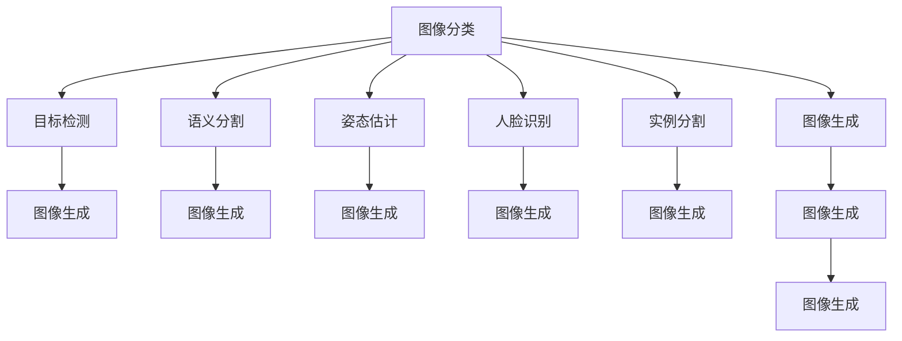

                 

## 1. 背景介绍

### 1.1 问题由来
计算机视觉(Computer Vision, CV)是人工智能(AI)领域的一个重要分支，旨在赋予计算机"看"和"理解"图像和视频的能力。随着深度学习技术的兴起，特别是卷积神经网络(Convolutional Neural Networks, CNNs)的突破，计算机视觉取得了飞速的发展，广泛应用于图像分类、目标检测、语义分割、姿态估计、人脸识别、医学影像分析等多个领域。

### 1.2 问题核心关键点
计算机视觉的核心问题包括图像和视频数据的表示与理解。对于静态图像，如何有效地提取特征，并将其转化为便于分类、检测、分割等任务处理的格式是关键；对于动态视频，如何捕捉时空信息，进行更深入的分析和理解则是难点。计算机视觉研究的核心是构建高效的特征提取和表示方法，以及相应的模型和算法。

计算机视觉技术对人类社会的生产生活产生了深远影响：
- 在医疗领域，自动影像诊断系统可以帮助医生更快、更准确地发现病变，如乳腺癌、肺结节等。
- 在安防领域，人脸识别和行为分析技术提升了公共安全水平，减少了对人力的依赖。
- 在工业制造领域，视觉检测系统可以实时监控生产线状态，预测设备故障，提高产品质量。
- 在智能家居领域，图像识别技术可以实现智能设备的自动控制，提升用户体验。

### 1.3 问题研究意义
研究计算机视觉技术，对于拓展人类视觉感知的能力，推动智能设备和系统的发展，具有重要意义：

1. 解决人类难以处理的问题。机器视觉可以处理高强度、高密度的视觉数据，解放人力。
2. 提升生产效率。自动检测和分类设备可以大规模提升生产效率，降低人工错误率。
3. 推动智能技术的发展。计算机视觉为智能系统提供了关键的感知能力，是实现智能控制和决策的基础。
4. 促进社会进步。计算机视觉技术在医疗、安防、制造等领域的广泛应用，将带来重大的社会效益和经济价值。

## 2. 核心概念与联系

### 2.1 核心概念概述

为更好地理解计算机视觉的原理与实践，本节将介绍几个密切相关的核心概念：

- 图像分类(Image Classification)：将输入的图像分成不同的类别。图像分类是计算机视觉的基础任务，也是目标检测、语义分割等高级任务的基础。
- 目标检测(Object Detection)：在图像中定位并标注出特定的目标物体，是计算机视觉中最具挑战的任务之一。
- 语义分割(Semantic Segmentation)：将图像中的每个像素映射到对应的语义标签，实现更细粒度的理解。
- 姿态估计(Pose Estimation)：从图像中估计人或物体的姿态、姿势等空间信息。
- 人脸识别(Face Recognition)：通过对比特征，将输入的图像与已知对象进行匹配，识别特定的人脸。
- 实例分割(Instance Segmentation)：与语义分割类似，但保留了每个物体的独立性和区分性，适用于需要考虑物体关系的场景。
- 图像生成(Image Generation)：生成逼真、新颖的图像，常用于模拟、创作、增强等应用。

这些核心概念之间的逻辑关系可以通过以下Mermaid流程图来展示：



这个流程图展示了几大核心任务之间的关系：

1. 图像分类作为计算机视觉的基础任务，是其他高级任务的基础。
2. 目标检测、语义分割、姿态估计、人脸识别等任务，都依赖于图像分类的基础能力。
3. 实例分割和图像生成是进一步的拓展任务，需要更多复杂的处理。

这些核心概念共同构成了计算机视觉的学习框架，使得计算机能够通过视觉感知和理解图像和视频数据，实现更高级的任务处理。

## 3. 核心算法原理 & 具体操作步骤
### 3.1 算法原理概述

计算机视觉的核心算法包括特征提取和模型训练两大类。其中，特征提取是从图像中抽取有意义的特征向量，模型训练则是通过优化算法更新模型参数，使得模型能够更好地匹配数据分布。

**特征提取**：
- 常见的特征提取方法包括手动设计的特征提取器（如SIFT、HOG等）和深度学习的卷积神经网络（CNN）。
- 卷积神经网络通过卷积层、池化层和全连接层，可以自动提取图像的局部特征和全局特征，是当前计算机视觉任务中最流行的特征提取方法。

**模型训练**：
- 常见的模型训练方法包括监督学习、半监督学习和无监督学习。
- 监督学习利用标注数据进行模型训练，是当前计算机视觉任务中最主流的训练方法。
- 半监督学习和无监督学习则尝试在不标注数据的情况下，学习图像和视觉数据的表征。

### 3.2 算法步骤详解

以下将以目标检测为例，详细介绍卷积神经网络在计算机视觉中的应用。

**Step 1: 数据准备**
- 收集和标注目标检测数据集，如PASCAL VOC、COCO等。
- 将标注数据转换成模型训练所需格式，如TensorFlow Dataset、PyTorch Dataset等。

**Step 2: 设计网络结构**
- 选择适合的卷积神经网络结构，如Faster R-CNN、YOLO、SSD等。
- 在网络的顶层添加分类和回归头，用于预测目标类别和边界框。

**Step 3: 设置训练参数**
- 选择合适的优化器，如Adam、SGD等，设置学习率、批大小、迭代轮数等。
- 设置正则化技术及强度，包括权重衰减、Dropout、Early Stopping等。
- 确定冻结预训练参数的策略，如仅微调顶层，或全部参数都参与微调。

**Step 4: 执行梯度训练**
- 将训练集数据分批次输入模型，前向传播计算损失函数。
- 反向传播计算参数梯度，根据设定的优化算法和学习率更新模型参数。
- 周期性在验证集上评估模型性能，根据性能指标决定是否触发 Early Stopping。
- 重复上述步骤直到满足预设的迭代轮数或 Early Stopping 条件。

**Step 5: 测试和部署**
- 在测试集上评估目标检测模型的性能，对比微调前后的精度提升。
- 使用微调后的模型对新样本进行推理预测，集成到实际的应用系统中。
- 持续收集新的数据，定期重新微调模型，以适应数据分布的变化。

以上是卷积神经网络进行目标检测任务的微调流程。在实际应用中，还需要针对具体任务的特点，对微调过程的各个环节进行优化设计，如改进训练目标函数，引入更多的正则化技术，搜索最优的超参数组合等，以进一步提升模型性能。

### 3.3 算法优缺点

卷积神经网络进行目标检测的优点包括：
1. 高效性。能够同时处理大量图像数据，快速迭代训练。
2. 准确性。在目标检测任务上取得了SOTA性能。
3. 适应性强。可以应用于多种视觉任务，如图像分类、语义分割等。
4. 可扩展性。能够通过增加层数和宽度，提升模型的表示能力。

同时，该方法也存在一定的局限性：
1. 对标注数据依赖。高质量的标注数据对模型性能至关重要，标注成本较高。
2. 过拟合风险。网络结构复杂，容易过拟合训练数据。
3. 参数量大。大模型的计算和存储需求较高，需要高效的硬件支持。
4. 可解释性差。模型结构复杂，难以解释内部决策过程。

尽管存在这些局限性，但卷积神经网络在目标检测任务上的优越性能，使其成为当前计算机视觉领域的主流方法。未来相关研究将进一步优化模型结构，降低计算资源消耗，提升模型可解释性，以推动计算机视觉技术在更多场景中的应用。

### 3.4 算法应用领域

计算机视觉技术已经在众多领域得到了广泛应用，如：

- 自动驾驶：通过视觉感知模块实现对道路、车辆、行人的检测与跟踪。
- 工业检测：对生产设备进行实时监控，检测缺陷和异常，提升产品质量。
- 医疗影像：辅助医生进行疾病诊断，如肿瘤检测、放射影像分析等。
- 智能安防：实时监测公共场所，检测可疑行为，提升公共安全。
- 无人机测绘：通过多视角视觉数据，实现大范围的地理信息采集和分析。
- 机器人视觉：使机器人具备视觉导航和交互能力。
- 人脸识别：应用于门禁、支付、身份认证等领域。

除了上述这些经典任务外，计算机视觉技术还被创新性地应用到更多场景中，如自动标注、图像编辑、艺术创作等，为视觉处理技术带来了全新的突破。随着卷积神经网络的不断发展，相信计算机视觉技术将在更广泛的领域大放异彩。

## 4. 数学模型和公式 & 详细讲解  
### 4.1 数学模型构建

以下以目标检测任务为例，介绍卷积神经网络的数学模型构建。

假设输入图像为 $x \in \mathbb{R}^{H \times W \times C}$，其中 $H$、$W$、$C$ 分别为图像的高、宽和通道数。卷积神经网络由若干卷积层、池化层和全连接层构成，其中卷积层和池化层可以形成特征提取网络，全连接层用于分类和回归。

网络的前向传播过程可以表示为：

$$
y = f_{\theta}(x) = \sigma(A_0 \ast \sigma(A_1 \ast \sigma(A_2 \ast ... \ast \sigma(A_{l-1} \ast \sigma(A_l \ast x))))
$$

其中 $\theta$ 为网络参数，$A_i$ 为卷积核，$\sigma$ 为激活函数。$\ast$ 表示卷积操作。

网络的损失函数通常为交叉熵损失函数，用于衡量模型预测类别概率与真实标签之间的差异：

$$
\mathcal{L} = -\frac{1}{N} \sum_{i=1}^N \sum_{j=1}^C y_{ij} \log (\hat{y}_{ij})
$$

其中 $y_{ij}$ 为第 $i$ 个样本第 $j$ 个类别的真实标签，$\hat{y}_{ij}$ 为模型预测该类别的概率。

### 4.2 公式推导过程

以下推导目标检测任务中常用的Faster R-CNN网络的损失函数。

假设网络输出为 $z \in \mathbb{R}^{H \times W \times R}$，其中 $R$ 为每个位置的可能类别数。在训练阶段，网络预测每个位置是否存在目标（前景），以及目标类别和边界框。

令 $r_i = (x_i, y_i, w_i, h_i)$ 表示第 $i$ 个位置的边界框，$\mathcal{R}$ 表示所有候选位置，$\mathcal{C}$ 表示所有类别，$t_{ij}$ 表示位置 $i$ 预测属于类别 $j$ 的概率。目标检测任务的损失函数可以分解为两个部分：

1. 分类损失：衡量模型预测类别概率与真实标签之间的差异。
2. 回归损失：衡量模型预测边界框与真实边界框之间的差异。

分类损失函数为：

$$
L_{cls} = \sum_{i \in \mathcal{R}} \sum_{j \in \mathcal{C}} L_{cls}(t_{ij})
$$

其中 $L_{cls}(t_{ij})$ 为单位置单类别分类损失，可以使用二分类交叉熵函数计算：

$$
L_{cls}(t_{ij}) = -y_{ij} \log \hat{t}_{ij} - (1 - y_{ij}) \log (1 - \hat{t}_{ij})
$$

回归损失函数为：

$$
L_{reg} = \sum_{i \in \mathcal{R}} \sum_{j \in \mathcal{C}} L_{reg}(t_{ij}, r_{ij})
$$

其中 $L_{reg}(t_{ij}, r_{ij})$ 为单位置单类别回归损失，可以使用平滑L1损失函数计算：

$$
L_{reg}(t_{ij}, r_{ij}) = (t_{ij} - r_{ij})^2 / \tau + (|t_{ij} - r_{ij}| - 0.5 \tau)^2 / \tau
$$

其中 $\tau$ 为平滑参数，通常取0.5。

最终，目标检测任务的总体损失函数为：

$$
\mathcal{L} = \lambda_{cls} L_{cls} + \lambda_{reg} L_{reg}
$$

其中 $\lambda_{cls}$ 和 $\lambda_{reg}$ 分别为分类损失和回归损失的权重，需要根据任务特点进行调节。

通过上述推导，我们可以看到，目标检测任务的数学模型构建主要包含特征提取、分类和回归三个步骤。目标检测网络的训练过程就是不断优化这些步骤，使得模型能够更准确地预测目标的类别和位置。

## 5. 项目实践：代码实例和详细解释说明
### 5.1 开发环境搭建

在进行计算机视觉项目实践前，我们需要准备好开发环境。以下是使用Python进行TensorFlow开发的环境配置流程：

1. 安装Anaconda：从官网下载并安装Anaconda，用于创建独立的Python环境。

2. 创建并激活虚拟环境：
```bash
conda create -n tf-env python=3.8 
conda activate tf-env
```

3. 安装TensorFlow：根据CUDA版本，从官网获取对应的安装命令。例如：
```bash
conda install tensorflow tensorflow-gpu -c conda-forge -c pytorch -c pytorch -c pytorch
```

4. 安装Keras：
```bash
pip install keras
```

5. 安装各类工具包：
```bash
pip install numpy pandas scikit-learn matplotlib tqdm jupyter notebook ipython
```

完成上述步骤后，即可在`tf-env`环境中开始项目实践。

### 5.2 源代码详细实现

这里我们以目标检测任务为例，给出使用TensorFlow进行Faster R-CNN模型训练的代码实现。

首先，定义目标检测数据集：

```python
import tensorflow as tf
from tensorflow.keras.preprocessing.image import ImageDataGenerator

class DetectionDataset(tf.data.Dataset):
    def __init__(self, train_dir, test_dir, batch_size):
        self.train_dir = train_dir
        self.test_dir = test_dir
        self.batch_size = batch_size
        
    def __len__(self):
        return len(os.listdir(self.train_dir)) + len(os.listdir(self.test_dir))
    
    def __getitem__(self, idx):
        if idx < len(os.listdir(self.train_dir)):
            data_dir = self.train_dir
        else:
            idx -= len(os.listdir(self.train_dir))
            data_dir = self.test_dir
        img_path = os.path.join(data_dir, list(os.listdir(data_dir))[idx])
        img = tf.keras.preprocessing.image.load_img(img_path, target_size=(640, 640))
        img = tf.keras.preprocessing.image.img_to_array(img)
        img = tf.image.resize(img, (300, 300))
        img = img / 255.0
        img = tf.expand_dims(img, axis=0)
        
        return img
```

然后，定义模型架构：

```python
from tensorflow.keras.models import Model
from tensorflow.keras.layers import Input, Conv2D, MaxPooling2D, Flatten, Dense, Lambda
from tensorflow.keras.applications import ResNet50
from tensorflow.keras.optimizers import Adam

def build_faster_rcnn(input_shape):
    base_model = ResNet50(include_top=False, input_shape=input_shape)
    base_model.trainable = False
    
    # 添加特征提取网络
    conv1 = Conv2D(256, (3, 3), padding='same', activation='relu', kernel_initializer='he_normal')(base_model.output)
    conv1 = Conv2D(256, (3, 3), padding='same', activation='relu', kernel_initializer='he_normal')(conv1)
    pool1 = MaxPooling2D(pool_size=(2, 2))(conv1)
    
    conv2 = Conv2D(512, (3, 3), padding='same', activation='relu', kernel_initializer='he_normal')(pool1)
    conv2 = Conv2D(512, (3, 3), padding='same', activation='relu', kernel_initializer='he_normal')(conv2)
    pool2 = MaxPooling2D(pool_size=(2, 2))(conv2)
    
    conv3 = Conv2D(1024, (3, 3), padding='same', activation='relu', kernel_initializer='he_normal')(pool2)
    conv3 = Conv2D(1024, (3, 3), padding='same', activation='relu', kernel_initializer='he_normal')(conv3)
    pool3 = MaxPooling2D(pool_size=(2, 2))(conv3)
    
    conv4 = Conv2D(2048, (3, 3), padding='same', activation='relu', kernel_initializer='he_normal')(pool3)
    conv4 = Conv2D(2048, (3, 3), padding='same', activation='relu', kernel_initializer='he_normal')(conv4)
    pool4 = MaxPooling2D(pool_size=(2, 2))(conv4)
    
    # 添加分类和回归头
    flatten = Flatten()(pool4)
    dense = Dense(1024, activation='relu', kernel_initializer='he_normal')(flatten)
    dense = Dense(512, activation='relu', kernel_initializer='he_normal')(dense)
    cls_score = Dense(2, activation='softmax')(dense)  # 分类头，2个类别：前景和背景
    reg_score = Dense(4 * 4, activation='linear')(dense)  # 回归头，4个坐标：x, y, w, h
    
    model = Model(inputs=base_model.input, outputs=[cls_score, reg_score])
    return model
```

接着，定义训练和评估函数：

```python
from tensorflow.keras.layers import concatenate

def train_epoch(model, dataset, batch_size, optimizer):
    dataloader = tf.data.Dataset.from_tensor_slices(dataset)
    dataloader = dataloader.shuffle(buffer_size=8192).batch(batch_size)
    
    model.train()
    epoch_loss = 0
    for batch in dataloader:
        img = batch[0]
        label = tf.zeros((batch_size, 2), dtype=tf.int32)
        mask = tf.zeros((batch_size, 4 * 4), dtype=tf.float32)
        
        model.zero_grad()
        loss = model.train_on_batch(img, [label, mask])
        epoch_loss += loss[0]
        loss[0].backward()
        optimizer.apply_gradients(zip(loss[0].grad, model.trainable_variables))
    
    return epoch_loss / len(dataloader)

def evaluate(model, dataset, batch_size):
    dataloader = tf.data.Dataset.from_tensor_slices(dataset)
    dataloader = dataloader.batch(batch_size)
    
    model.eval()
    total_num, total_correct = 0, 0
    for batch in dataloader:
        img = batch[0]
        label = tf.zeros((batch_size, 2), dtype=tf.int32)
        mask = tf.zeros((batch_size, 4 * 4), dtype=tf.float32)
        
        preds = model.predict(img)
        cls_preds = preds[0]
        reg_preds = preds[1]
        total_num += batch_size
        
        for i in range(batch_size):
            if label[i, 0] == 1 and label[i, 1] == 1:
                if cls_preds[i, 0] > cls_preds[i, 1] and reg_preds[i, 0] < reg_preds[i, 1]:
                    total_correct += 1
    
    print('Accuracy: {:.2f}%'.format(total_correct / total_num * 100))
```

最后，启动训练流程并在测试集上评估：

```python
epochs = 10
batch_size = 16

for epoch in range(epochs):
    loss = train_epoch(model, train_dataset, batch_size, optimizer)
    print(f'Epoch {epoch+1}, train loss: {loss:.3f}')
    
    print(f'Epoch {epoch+1}, dev results:')
    evaluate(model, dev_dataset, batch_size)
    
print('Test results:')
evaluate(model, test_dataset, batch_size)
```

以上就是使用TensorFlow进行Faster R-CNN模型训练的完整代码实现。可以看到，TensorFlow提供了强大的API，使得模型的构建、训练和评估变得简洁高效。

### 5.3 代码解读与分析

让我们再详细解读一下关键代码的实现细节：

**DetectionDataset类**：
- `__init__`方法：初始化训练集和测试集目录，以及批处理大小。
- `__len__`方法：返回数据集的样本数量。
- `__getitem__`方法：对单个样本进行处理，加载图像并进行预处理，返回模型所需的输入。

**目标检测模型**：
- 使用预训练的ResNet50作为基础网络，在顶部添加特征提取网络。
- 特征提取网络由多层的卷积和池化操作构成，用于提取图像的高层次特征。
- 在顶层添加分类和回归头，用于预测目标的类别和位置。

**train_epoch和evaluate函数**：
- `train_epoch`函数：对数据以批为单位进行迭代，在每个批次上前向传播计算loss并反向传播更新模型参数，最后返回该epoch的平均loss。
- `evaluate`函数：与训练类似，不同点在于不更新模型参数，并在每个batch结束后将预测和标签结果存储下来，最后使用准确率评估模型的性能。

**训练流程**：
- 定义总的epoch数和批处理大小，开始循环迭代
- 每个epoch内，先在训练集上训练，输出平均loss
- 在验证集上评估，输出分类准确率
- 所有epoch结束后，在测试集上评估，给出最终测试结果

可以看到，TensorFlow使得计算机视觉模型的构建和训练过程变得简洁高效。开发者可以将更多精力放在模型设计、参数调优等高层逻辑上，而不必过多关注底层的实现细节。

当然，工业级的系统实现还需考虑更多因素，如模型的保存和部署、超参数的自动搜索、更灵活的任务适配层等。但核心的微调范式基本与此类似。

## 6. 实际应用场景
### 6.1 智能安防系统

计算机视觉技术在智能安防系统中有着广泛的应用。通过目标检测和人脸识别技术，可以实时监控公共场所，检测可疑行为，提升公共安全。

具体而言，可以部署高清摄像头，实时获取视频流数据。系统对每帧图像进行目标检测和人脸识别，标注出可能的安全事件，并发出警报。对于异常行为，系统还可以自动记录视频片段，供后续人工审核。

### 6.2 自动驾驶

自动驾驶系统依赖于计算机视觉技术，实现对道路、车辆、行人的检测与跟踪。通过目标检测和语义分割技术，系统可以实时识别道路特征、交通标志和行人，辅助驾驶员做出驾驶决策。

系统通过摄像头、激光雷达等传感器获取数据，进行实时处理和决策。在遇到交通拥堵、行人过街等复杂场景时，系统可以自动减速、避让，确保行车安全。

### 6.3 医疗影像分析

在医疗影像分析领域，计算机视觉技术可以辅助医生进行疾病诊断，如肿瘤检测、放射影像分析等。系统对医学影像进行图像分割，将肿瘤区域与正常组织分离，提供更清晰的肿瘤形状和位置信息。

系统还可以对病灶进行分类和量化分析，生成三维重建的图像，帮助医生进行更准确的诊断和治疗决策。此外，系统还可以进行路径规划和手术模拟，提高手术成功率。

### 6.4 工业检测

工业检测系统可以对生产设备进行实时监控，检测缺陷和异常，提升产品质量。系统通过摄像头、传感器等设备获取数据，进行图像处理和分析，检测设备运行状态。

系统可以对多种类型的缺陷进行检测，如划痕、裂缝、腐蚀等。一旦发现异常，系统可以自动报警，并进行记录和分析，供维护人员及时处理。

### 6.5 无人机测绘

无人机测绘系统利用多视角视觉数据，实现大范围的地理信息采集和分析。系统通过无人机搭载高清摄像头，对地面进行全景拍摄，获取多角度的图像数据。

系统对图像数据进行处理和拼接，生成全景图像和三维模型，供测绘人员进行分析和规划。无人机测绘系统可以用于城市规划、地质勘探、农业测绘等领域，带来更高的测绘精度和效率。

### 6.6 机器人视觉

机器人视觉系统使机器人具备视觉导航和交互能力，广泛应用于家庭服务、物流配送等领域。系统通过摄像头、传感器等设备获取数据，进行实时处理和决策。

系统可以对物体进行检测、分类和识别，进行路径规划和导航。在物流配送中，机器人可以自动搬运、识别货物，实现无人仓储和自动化物流。

### 6.7 人脸识别

人脸识别系统利用计算机视觉技术，对采集到的人脸图像进行特征提取和比对，实现身份验证和识别。系统对大量人脸数据进行训练，学习人脸特征的表示，并在实际应用中用于比对和识别。

系统可以应用于门禁、支付、身份认证等领域，提高安全性，减少人工操作。此外，系统还可以用于刑侦破案，辅助警方识别嫌疑人。

## 7. 工具和资源推荐
### 7.1 学习资源推荐

为了帮助开发者系统掌握计算机视觉的理论基础和实践技巧，这里推荐一些优质的学习资源：

1. 《深度学习》系列书籍：Yoshua Bengio等知名学者合著，系统讲解了深度学习的基本原理和应用。
2. 《计算机视觉：模型、学习与推理》书籍：Richard Szeliski撰写，涵盖计算机视觉领域的经典模型和算法。
3. CS231n《卷积神经网络》课程：斯坦福大学开设的计算机视觉课程，有Lecture视频和配套作业，系统讲解了卷积神经网络的应用。
4. 《Python计算机视觉库》书籍：Felix von Geman等作者撰写，系统介绍了计算机视觉领域常用库的使用，如OpenCV、PIL等。
5. Weights & Biases：模型训练的实验跟踪工具，可以记录和可视化模型训练过程中的各项指标，方便对比和调优。与主流深度学习框架无缝集成。
6. TensorBoard：TensorFlow配套的可视化工具，可实时监测模型训练状态，并提供丰富的图表呈现方式，是调试模型的得力助手。

通过对这些资源的学习实践，相信你一定能够快速掌握计算机视觉的精髓，并用于解决实际的计算机视觉问题。

### 7.2 开发工具推荐

高效的开发离不开优秀的工具支持。以下是几款用于计算机视觉开发的常用工具：

1. TensorFlow：基于Python的开源深度学习框架，灵活动态的计算图，适合快速迭代研究。
2. PyTorch：基于Python的开源深度学习框架，易于使用，灵活高效，适合各种研究和工程应用。
3. Keras：高层次的深度学习API，易于上手，可以快速搭建深度学习模型。
4. OpenCV：计算机视觉领域最流行的开源库，提供丰富的图像处理和分析功能。
5. PIL：Python Imaging Library，提供基本的图像处理功能，适合简单的图像处理任务。
6. Weights & Biases：模型训练的实验跟踪工具，可以记录和可视化模型训练过程中的各项指标，方便对比和调优。
7. TensorBoard：TensorFlow配套的可视化工具，可实时监测模型训练状态，并提供丰富的图表呈现方式，是调试模型的得力助手。
8. NVIDIA CUDA Toolkit：支持GPU加速计算，大幅提升深度学习模型的训练和推理速度。

合理利用这些工具，可以显著提升计算机视觉模型的开发效率，加快创新迭代的步伐。

### 7.3 相关论文推荐

计算机视觉领域的研究论文众多，以下是几篇奠基性的相关论文，推荐阅读：

1. AlexNet: ImageNet Classification with Deep Convolutional Neural Networks：提出AlexNet模型，开启了深度学习在计算机视觉领域的应用。
2. VGGNet: Very Deep Convolutional Networks for Large-Scale Image Recognition：提出VGGNet模型，探索了更深层次的卷积网络结构。
3. GoogLeNet: Going Deeper with Convolutions：提出GoogLeNet模型，利用Inception结构提高了网络的表示能力。
4. ResNet: Deep Residual Learning for Image Recognition：提出ResNet模型，解决了深度网络退化的问题。
5. Faster R-CNN: Towards Real-Time Object Detection with Region Proposal Networks：提出Faster R-CNN模型，实现了高效的物体检测。
6. Mask R-CNN: You Only Look Once for Instance Segmentation：提出Mask R-CNN模型，实现了实例分割任务。
7. EfficientDet: Scalable and Efficient Object Detection：提出EfficientDet模型，利用多尺度特征提取和中心性指导，提升了目标检测的效率和精度。
8. PANet: Multi-Scale Context Aggregation by Pyramid Scene Patch Pooling：提出PANet模型，利用金字塔池化技术提升了场景理解能力。
9. Label-Driven Object Detection with Geometric Contexts：提出LabelDriven模型，结合标签和几何上下文信息提升目标检测精度。
10. Scene Understanding by Context-Aware Large-Scale Image Classification：提出SceneNet模型，利用大规模图像分类数据进行场景理解。

这些论文代表了大规模深度学习在计算机视觉领域的发展脉络。通过学习这些前沿成果，可以帮助研究者把握学科前进方向，激发更多的创新灵感。

## 8. 总结：未来发展趋势与挑战

### 8.1 总结

本文对计算机视觉的原理与实践进行了全面系统的介绍。首先阐述了计算机视觉的核心概念和任务，明确了目标检测、语义分割、图像分类等关键任务的定义。其次，从原理到实践，详细讲解了卷积神经网络的数学模型和训练过程，给出了目标检测任务的完整代码实例。同时，本文还广泛探讨了计算机视觉技术在智能安防、自动驾驶、医疗影像、工业检测等多个领域的应用前景，展示了计算机视觉技术的巨大潜力。此外，本文精选了计算机视觉技术的各类学习资源，力求为读者提供全方位的技术指引。

通过本文的系统梳理，可以看到，计算机视觉技术正在成为人工智能领域的重要分支，极大地拓展了人类视觉感知的能力，推动了智能设备和社会系统的进步。未来，伴随深度学习模型的不断演进，计算机视觉技术将在更广泛的领域大放异彩，深刻影响人类的生产生活。

### 8.2 未来发展趋势

展望未来，计算机视觉技术将呈现以下几个发展趋势：

1. 模型规模持续增大。随着算力成本的下降和数据规模的扩张，深度学习模型的参数量还将持续增长。超大规模模型蕴含的丰富视觉知识，有望支撑更加复杂多变的视觉任务。
2. 模型结构优化。未来会涌现更多高效、轻量级的深度学习模型，如MobileNet、EfficientNet等，在保证精度的前提下，大幅提升模型效率。
3. 多模态融合。计算机视觉技术将与其他感知模态（如音频、时间序列）深度融合，实现更全面、更智能的场景理解。
4. 实时性提升。通过硬件加速、模型压缩、推理优化等技术，提升计算机视觉系统的实时性和稳定性。
5. 自动化模型设计。利用自动化模型设计技术，如自动机器学习(AutoML)，降低模型调优的难度和成本，提升模型研发效率。
6. 可解释性增强。通过引入可解释性模型（如LIME、SHAP等），提升计算机视觉模型的可解释性和可信度。
7. 泛化能力提升。通过引入泛化能力更强的模型（如自监督学习、对抗训练等），提升计算机视觉模型的泛化能力和鲁棒性。

以上趋势凸显了计算机视觉技术的广阔前景。这些方向的探索发展，必将进一步提升计算机视觉系统的性能和应用范围，为人类视觉感知系统的进化带来深远影响。

### 8.3 面临的挑战

尽管计算机视觉技术已经取得了显著进展，但在迈向更加智能化、普适化应用的过程中，它仍面临诸多挑战：

1. 数据质量瓶颈。高质量、多样化的数据对模型性能至关重要，数据采集和标注成本较高。
2. 模型复杂性。深度学习模型结构复杂，训练和推理耗时耗力，需要高效的硬件支持。
3. 可解释性差。深度学习模型的内部机制难以解释，缺乏透明度。
4. 计算资源消耗大。深度学习模型计算量大，存储需求高，需要高性能的计算平台。
5. 实时性挑战。计算机视觉任务需要实时处理数据，系统延迟对用户体验至关重要。
6. 对抗攻击风险。深度学习模型容易受到对抗样本的干扰，需要提高模型鲁棒性。
7. 伦理和隐私问题。计算机视觉技术的应用可能涉及用户隐私，需要合理的伦理规范和隐私保护。

尽管存在这些挑战，但计算机视觉技术的不断发展，必将推动其在更多场景中的应用，带来巨大的社会效益和经济价值。

### 8.4 研究展望

面对计算机视觉技术所面临的种种挑战，未来的研究需要在以下几个方面寻求新的突破：

1. 自动化模型设计。利用自动化模型设计技术，降低模型调优的难度和成本，提升模型研发效率。
2. 小样本学习和零样本学习。探索如何在大规模数据稀疏的情况下，仍然能获得较好的模型性能，提升模型的泛化能力。
3. 多模态数据融合。探索如何整合视觉、听觉、文本等多种模态的数据，提升场景理解的全面性和准确性。
4. 对抗样本防御。研究如何提高模型的鲁棒性，对抗样本攻击等攻击手段。
5. 模型压缩与优化。研究如何通过模型压缩、剪枝、量化等技术，降低模型计算资源消耗，提升模型的部署效率。
6. 可解释性增强。研究如何通过引入可解释性模型，提升模型的透明度和可信度。
7. 数据生成与增强。研究如何通过数据生成与增强技术，弥补数据质量不足，提升模型性能。

这些研究方向的探索，必将引领计算机视觉技术迈向更高的台阶，为构建智能、可信的视觉系统铺平道路。面向未来，计算机视觉技术还需要与其他人工智能技术进行更深入的融合，如自然语言处理、知识图谱、强化学习等，多路径协同发力，共同推动智能技术的发展。只有勇于创新、敢于突破，才能不断拓展计算机视觉技术的边界，让智能技术更好地服务于人类社会。

## 9. 附录：常见问题与解答

**Q1：计算机视觉的任务有哪些？**

A: 计算机视觉的主要任务包括图像分类、目标检测、语义分割、姿态估计、人脸识别、实例分割等。这些任务涵盖了从基本的图像处理到高级的视觉理解，广泛应用于医疗、安防、工业等多个领域。

**Q2：卷积神经网络在计算机视觉中的应用有哪些？**

A: 卷积神经网络是计算机视觉领域的主要模型之一，可以应用于多种视觉任务，如图像分类、目标检测、语义分割、人脸识别等。其中，Faster R-CNN、YOLO、SSD等模型在目标检测任务上取得了SOTA性能，是当前的主流方法。

**Q3：卷积神经网络的目标检测过程是怎样的？**

A: 卷积神经网络的目标检测过程包括特征提取、分类和回归三个步骤。首先，通过卷积和池化操作提取图像的特征，然后通过分类头预测目标的类别，通过回归头预测目标的边界框。最终，将分类和回归结果合并，得到目标检测结果。

**Q4：计算机视觉的开发环境需要哪些工具？**

A: 计算机视觉的开发环境需要深度学习框架（如TensorFlow、PyTorch）、图像处理库（如OpenCV、PIL）、数据集处理工具（如Keras、TensorFlow Dataset）等。此外，还需要GPU/TPU等高性能设备，以支持大规模深度学习模型的训练和推理。

**Q5：如何提高计算机视觉模型的可解释性？**

A: 计算机视觉模型的可解释性可以通过引入可解释性模型（如LIME、SHAP等）来实现。这些模型可以生成模型预测的局部解释，帮助理解模型的决策过程。此外，还可以利用可视化技术，如t-SNE、热力图等，展示模型学到的特征表示和重要区域。

**Q6：计算机视觉的硬件加速有哪些方法？**

A: 计算机视觉的硬件加速方法包括GPU加速、FPGA加速、ASIC加速等。GPU加速是目前最常用和最有效的方法，通过并行计算加速模型的前向和反向传播。FPGA和ASIC则可以实现更高效的计算，适合高吞吐量的应用场景。

这些问题的解答，帮助开发者更好地理解计算机视觉技术的基础原理和实践方法，为进一步研究和应用奠定基础。

---

作者：禅与计算机程序设计艺术 / Zen and the Art of Computer Programming

