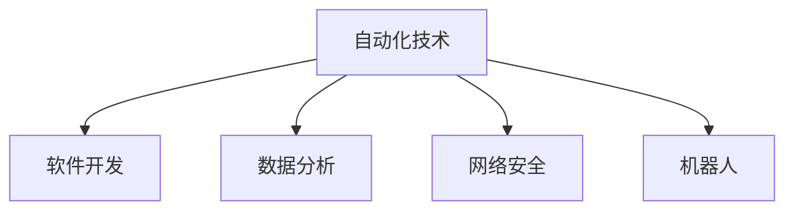

                 

## 1. 背景介绍

在现代计算领域，自动化(Automation)已经成为了推动技术发展和应用落地的核心动力。从简单的批处理、脚本脚本自动化到高级的机器学习模型、深度学习网络，自动化的足迹无处不在。自动化技术不仅提升了生产力和效率，还开辟了新的应用场景和市场机会。然而，自动化也带来了诸多挑战，如何平衡自动化带来的效率提升与复杂性增长，成为技术应用的重要考量。本文将从背景介绍自动化技术的兴起，核心概念与联系，核心算法原理与具体操作步骤，数学模型和公式推导，项目实践，实际应用场景，工具和资源推荐，总结以及未来发展趋势与挑战等多个方面进行系统探讨，旨在为读者提供对计算领域自动化趋势与挑战的全面理解。

## 2. 核心概念与联系

### 2.1 核心概念概述

自动化是指通过预设的规则或算法，使得系统能够在无需人工干预的情况下，自动完成特定任务的技术。自动化技术广泛应用在软件开发、数据分析、网络安全、机器人等领域，极大地提升了工作效率和业务响应速度。

### 2.2 核心概念原理和架构的 Mermaid 流程图



自动化技术的核心是自动执行任务，其基本架构包括三个关键组成部分：

1. **数据获取与处理**：自动从指定源获取数据，并进行清洗、转换和存储。
2. **任务执行引擎**：根据预设规则或算法，自动执行预定义的任务。
3. **结果反馈与优化**：自动监控任务执行结果，根据反馈进行优化，保证任务稳定高效执行。

### 2.3 核心概念间的联系

自动化技术通过高效、自动化的方式，解放了人力资源，使得人类可以专注于更有创造性的工作。同时，自动化技术的普及也推动了人工智能、大数据等前沿技术的快速发展，为各行业带来了数字化转型的新机遇。

## 3. 核心算法原理 & 具体操作步骤

### 3.1 算法原理概述

自动化技术的核心是算法，即用于自动执行特定任务的软件程序或规则集。这些算法通常基于数学模型、机器学习等方法，能够处理大量数据，并根据输入数据自动输出结果。自动化算法的关键在于选择合适的模型和算法，以确保在特定场景下高效、准确地完成任务。

### 3.2 算法步骤详解

自动化算法的一般流程包括以下几个步骤：

1. **数据收集与预处理**：自动从不同来源收集数据，并进行清洗、转换和格式化，确保数据质量。
2. **算法设计**：根据任务需求，选择合适的算法模型和参数，设计自动执行的规则和流程。
3. **执行与监控**：自动执行算法，根据任务目标生成结果，并通过监控反馈机制进行优化。
4. **结果评估与调整**：对自动执行的结果进行评估，根据评估结果调整算法参数，提升执行效率和准确性。

### 3.3 算法优缺点

自动化算法的优点包括：

- **效率高**：能够自动化处理大量数据，减少人为干预，提高工作效率。
- **准确性高**：基于数学模型和算法，能够进行精确计算和分析，提高结果的准确性。
- **可扩展性强**：能够灵活应对不同任务和场景，适应性强。

同时，自动化算法也存在以下缺点：

- **复杂度高**：算法设计和调优过程复杂，需要专业知识。
- **数据依赖性强**：依赖于数据的质量和完整性，数据偏差可能导致算法结果失真。
- **难以解释**：黑盒算法的决策过程难以解释，缺乏透明性。

### 3.4 算法应用领域

自动化技术在多个领域得到了广泛应用，包括但不限于：

- **软件开发**：自动化测试、代码生成、部署和维护。
- **数据分析**：数据清洗、处理、分析和可视化。
- **网络安全**：自动化威胁检测、漏洞扫描、入侵防御。
- **机器人**：自动导航、物体识别、路径规划。
- **智能运维**：自动化监控、故障诊断、资源调度。

## 4. 数学模型和公式 & 详细讲解 & 举例说明

### 4.1 数学模型构建

自动化算法通常基于数学模型构建，常见的数学模型包括线性回归、决策树、神经网络等。以线性回归模型为例，其数学模型构建如下：

$$
y = \beta_0 + \beta_1 x_1 + \beta_2 x_2 + \ldots + \beta_n x_n
$$

其中，$y$ 为输出变量，$\beta$ 为模型参数，$x$ 为输入变量。

### 4.2 公式推导过程

线性回归模型的最小二乘法求解公式如下：

$$
\hat{\beta} = (X^TX)^{-1}X^Ty
$$

其中，$\hat{\beta}$ 为模型参数的估计值，$X$ 为输入变量的矩阵，$y$ 为输出变量的向量。

### 4.3 案例分析与讲解

以预测房价为例，我们可以收集大量的房屋特征（如面积、地理位置、年龄等）和对应房价数据，使用线性回归模型来预测新房源的房价。模型通过自动化的训练和评估，可以高效地生成预测结果，并根据反馈不断优化。

## 5. 项目实践：代码实例和详细解释说明

### 5.1 开发环境搭建

为进行自动化算法的项目实践，首先需要搭建开发环境。以下是Python环境中搭建环境的示例：

1. 安装Python：从官网下载Python 3.x版本并安装。
2. 安装依赖库：安装NumPy、SciPy、Pandas、Matplotlib等常用库，以及TensorFlow或PyTorch等深度学习框架。

### 5.2 源代码详细实现

以线性回归模型为例，实现一个自动化的房价预测系统：

```python
import numpy as np
from sklearn.linear_model import LinearRegression
from sklearn.model_selection import train_test_split
from sklearn.metrics import mean_squared_error

# 数据准备
X = np.array([[1000, 10, 3], [1200, 15, 4], [1300, 20, 5], [1400, 25, 6], [1500, 30, 7]])
y = np.array([450000, 480000, 510000, 550000, 600000])

# 数据划分
X_train, X_test, y_train, y_test = train_test_split(X, y, test_size=0.2, random_state=0)

# 模型训练
model = LinearRegression()
model.fit(X_train, y_train)

# 预测与评估
y_pred = model.predict(X_test)
mse = mean_squared_error(y_test, y_pred)
print(f"MSE: {mse}")
```

### 5.3 代码解读与分析

代码实现中，首先准备了房价预测的数据集。使用`train_test_split`函数将数据划分为训练集和测试集。然后使用`LinearRegression`类训练线性回归模型，并使用测试集进行预测。最后计算预测结果与实际结果的均方误差。

## 6. 实际应用场景

### 6.1 软件开发自动化

在软件开发领域，自动化技术被广泛应用于代码生成、测试、部署和维护。例如，使用自动化测试工具如JUnit、TestNG，可以快速执行代码测试，确保代码质量。使用自动化部署工具如Jenkins、Ansible，可以快速部署和更新应用，提升发布效率。使用自动化监控工具如Prometheus、Grafana，可以实时监控系统状态，快速响应问题。

### 6.2 数据分析自动化

在数据分析领域，自动化技术被广泛应用于数据清洗、处理、分析和可视化。例如，使用自动化数据清洗工具如OpenRefine、Trifacta，可以快速处理数据，减少人工干预。使用自动化数据分析工具如Pandas、NumPy，可以高效地进行数据分析和统计，生成可视化图表。使用自动化报告生成工具如Tableau、Power BI，可以自动化生成分析报告，提升数据分析效率。

### 6.3 网络安全自动化

在网络安全领域，自动化技术被广泛应用于威胁检测、漏洞扫描和入侵防御。例如，使用自动化威胁检测工具如Snort、Suricata，可以实时监控网络流量，检测威胁行为。使用自动化漏洞扫描工具如Nessus、OpenVAS，可以快速扫描系统漏洞，提高安全防护水平。使用自动化入侵防御工具如Fail2Ban、OSSEC，可以自动防御入侵行为，保护系统安全。

### 6.4 机器人自动化

在机器人领域，自动化技术被广泛应用于路径规划、物体识别和自动导航。例如，使用自动化路径规划算法如A*、Dijkstra，可以快速计算最优路径，提高机器人移动效率。使用自动化物体识别算法如YOLO、Faster R-CNN，可以实时检测物体位置和状态，提升机器人感知能力。使用自动化导航算法如SLAM、EKF，可以实现自主导航，提高机器人自主能力。

### 6.5 智能运维自动化

在智能运维领域，自动化技术被广泛应用于监控、故障诊断和资源调度。例如，使用自动化监控工具如Nagios、Zabbix，可以实时监控系统状态，及时发现问题。使用自动化故障诊断工具如Ansible、Chef，可以自动化诊断和修复问题，提升系统稳定性。使用自动化资源调度工具如Kubernetes、Docker Swarm，可以灵活调度资源，提升系统资源利用率。

## 7. 工具和资源推荐

### 7.1 学习资源推荐

为了帮助开发者系统掌握自动化技术的理论基础和实践技巧，以下是一些优质的学习资源：

1. 《Python编程：从入门到实践》：一本全面介绍Python编程的书籍，适合初学者入门。
2. 《机器学习实战》：一本系统介绍机器学习算法的书籍，涵盖多种常用的自动化算法。
3. 《TensorFlow官方文档》：TensorFlow的官方文档，详细介绍了TensorFlow的使用和优化方法。
4. 《Kubernetes：入门实战》：一本介绍Kubernetes容器编排的书籍，适合了解自动化运维技术。

### 7.2 开发工具推荐

高效的开发离不开优秀的工具支持。以下是几款用于自动化开发常用的工具：

1. Git：版本控制系统，用于代码版本管理和协作开发。
2. Docker：容器化技术，用于应用部署和环境管理。
3. Jenkins：自动化持续集成工具，用于构建、测试和部署应用。
4. Ansible：自动化配置管理工具，用于快速部署和管理系统。
5. OpenRefine：数据清洗和转换工具，用于处理复杂数据。
6. Tableau：数据可视化和报告生成工具，用于生成分析报告。

### 7.3 相关论文推荐

自动化技术的快速发展也推动了相关研究的不断进步。以下是几篇奠基性的相关论文，推荐阅读：

1. "A Survey on Automated Software Testing"：一篇综述自动化测试技术的论文，系统总结了自动化测试的研究进展。
2. "Machine Learning: A Probabilistic Perspective"：一本介绍机器学习算法的书籍，详细讲解了多种自动化算法的原理和应用。
3. "Network Security Fundamentals"：一本介绍网络安全的书籍，涵盖了自动化网络安全技术的应用。
4. "Robotics: Science and Systems"：一本介绍机器人技术的书籍，涵盖了自动化机器人技术的应用。
5. "Software Engineering: Principles and Practice"：一本介绍软件工程的书籍，涵盖了自动化软件开发技术的应用。

## 8. 总结：未来发展趋势与挑战

### 8.1 研究成果总结

自动化技术的快速发展，推动了各个领域的技术进步和应用落地。自动化技术在提高效率、提升质量、降低成本等方面发挥了重要作用，成为了推动技术发展的核心动力。

### 8.2 未来发展趋势

展望未来，自动化技术将呈现以下几个发展趋势：

1. **智能化水平提升**：自动化技术将更多地融合人工智能和机器学习技术，提升智能化水平，实现更高效的自动化处理。
2. **跨领域融合**：自动化技术将跨领域融合，应用于更多行业和领域，推动行业数字化转型。
3. **云原生架构**：自动化技术将更多地采用云原生架构，实现灵活、弹性的自动化处理。
4. **自动化安全防护**：自动化技术将更多地应用于安全防护领域，提升系统安全性。
5. **自动化运维管理**：自动化技术将更多地应用于运维管理领域，实现自动化监控、故障诊断和资源调度。

### 8.3 面临的挑战

自动化技术在快速发展的同时，也面临着诸多挑战：

1. **复杂性增长**：自动化技术的复杂性随着应用场景的扩展而不断增加，系统设计和维护难度加大。
2. **数据依赖性强**：自动化技术高度依赖于数据质量，数据偏差可能导致自动化结果失真。
3. **技术更新快**：自动化技术的发展速度快，新技术和工具不断涌现，需要不断学习和更新。
4. **缺乏标准化**：自动化技术缺乏统一的标准和规范，不同系统和工具之间兼容性差。
5. **伦理和安全性问题**：自动化技术在提高效率的同时，也带来了伦理和安全性问题，需要更多监管和规范。

### 8.4 研究展望

未来，自动化技术的研究方向将聚焦于以下几个方面：

1. **智能自动化**：结合人工智能和机器学习技术，提升自动化系统的智能化水平。
2. **跨领域融合**：将自动化技术应用于更多行业和领域，推动行业数字化转型。
3. **云原生架构**：采用云原生架构，实现灵活、弹性的自动化处理。
4. **自动化安全防护**：提升自动化系统的安全性，防范潜在的威胁和攻击。
5. **自动化运维管理**：实现自动化监控、故障诊断和资源调度，提升系统运维效率。

## 9. 附录：常见问题与解答

**Q1：自动化技术在软件开发中的具体应用有哪些？**

A: 自动化技术在软件开发中广泛应用于代码生成、测试、部署和维护。例如，使用自动化测试工具如JUnit、TestNG，可以快速执行代码测试，确保代码质量。使用自动化部署工具如Jenkins、Ansible，可以快速部署和更新应用，提升发布效率。使用自动化监控工具如Prometheus、Grafana，可以实时监控系统状态，快速响应问题。

**Q2：自动化技术在数据分析中的具体应用有哪些？**

A: 自动化技术在数据分析中广泛应用于数据清洗、处理、分析和可视化。例如，使用自动化数据清洗工具如OpenRefine、Trifacta，可以快速处理数据，减少人工干预。使用自动化数据分析工具如Pandas、NumPy，可以高效地进行数据分析和统计，生成可视化图表。使用自动化报告生成工具如Tableau、Power BI，可以自动化生成分析报告，提升数据分析效率。

**Q3：自动化技术在网络安全中的具体应用有哪些？**

A: 自动化技术在网络安全中广泛应用于威胁检测、漏洞扫描和入侵防御。例如，使用自动化威胁检测工具如Snort、Suricata，可以实时监控网络流量，检测威胁行为。使用自动化漏洞扫描工具如Nessus、OpenVAS，可以快速扫描系统漏洞，提高安全防护水平。使用自动化入侵防御工具如Fail2Ban、OSSEC，可以自动防御入侵行为，保护系统安全。

**Q4：自动化技术在机器人中的具体应用有哪些？**

A: 自动化技术在机器人中广泛应用于路径规划、物体识别和自动导航。例如，使用自动化路径规划算法如A*、Dijkstra，可以快速计算最优路径，提高机器人移动效率。使用自动化物体识别算法如YOLO、Faster R-CNN，可以实时检测物体位置和状态，提升机器人感知能力。使用自动化导航算法如SLAM、EKF，可以实现自主导航，提高机器人自主能力。

**Q5：自动化技术在智能运维中的具体应用有哪些？**

A: 自动化技术在智能运维中广泛应用于监控、故障诊断和资源调度。例如，使用自动化监控工具如Nagios、Zabbix，可以实时监控系统状态，及时发现问题。使用自动化故障诊断工具如Ansible、Chef，可以自动化诊断和修复问题，提升系统稳定性。使用自动化资源调度工具如Kubernetes、Docker Swarm，可以灵活调度资源，提升系统资源利用率。

