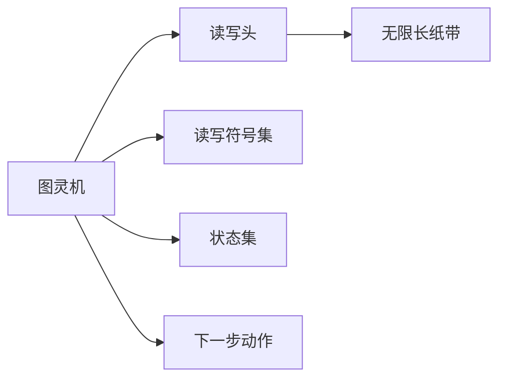

                 

# 计算：第三部分 计算理论的形成 第 8 章 计算理论的诞生：图灵的可计算数 停机问题

## 1. 背景介绍

### 1.1 问题由来
在计算机科学的早期发展阶段，计算机的基础理论与计算能力之间的关系一直是学者们研究的重要课题。图灵机（Turing Machine）作为一种理想化的计算模型，在20世纪30年代中期由英国数学家图灵（Alan Turing）提出，奠定了计算理论的基础。

图灵机的提出，不仅解决了人们对于计算机是否能够解决所有问题的疑问，还为后续的算法理论研究提供了重要工具。然而，在图灵机模型的基础上，如何更好地理解和应用计算理论，依然是一个复杂而深刻的问题。

## 2. 核心概念与联系

### 2.1 核心概念概述

在深入探讨图灵机之前，我们首先需要了解几个核心概念：

- **图灵机**：一种数学模型，用于描述计算过程。图灵机由一个读写头、一个读写符号集和一个状态集组成。读写头可以在无限长的纸带上移动，并根据当前状态和读取的符号来决定下一步的动作。
- **可计算数**：任何可以通过图灵机计算出来的数，称为可计算数。可计算数也称为递归数。
- **停机问题**：一个图灵机是否会在有限时间内停止运行的问题。
- **递归函数**：可计算函数的集合，即可以通过递归方式计算的函数。
- **递归定义**：递归函数的一种常见定义方式，通过自身来定义函数的行为。

### 2.2 核心概念原理和架构的 Mermaid 流程图(Mermaid 流程节点中不要有括号、逗号等特殊字符)



该流程图展示了图灵机的主要组件：读写头、读写符号集、状态集以及无限长纸带，并通过下一步动作来描述图灵机的行为。

## 3. 核心算法原理 & 具体操作步骤

### 3.1 算法原理概述

图灵机的核心思想是通过符号和状态的变化，模拟计算过程。在图灵机模型中，计算被抽象为读写头在无限长纸带上的移动，以及根据当前状态和读取的符号来决定下一步动作的过程。

图灵机通过读写头在纸带上的移动和读写操作，模拟了计算过程。这种模型不仅能够计算出任意递归函数，还能够处理任何算法问题，为后续的算法理论研究奠定了基础。

### 3.2 算法步骤详解

1. **初始化**：设定读写头初始位置、纸带初始状态、读写符号集和状态集，以及起始状态。
2. **执行循环**：当图灵机处于某个状态时，根据当前状态和读取的符号，决定下一个动作。可能的动作包括移动读写头、写入符号、改变状态等。
3. **终止**：当图灵机达到某个终止状态时，停止执行。否则，继续执行下一个循环。

### 3.3 算法优缺点

**优点**：
- 抽象能力强，能够处理任何算法问题。
- 通过符号和状态的变化，模拟了计算过程。
- 为后续的算法理论研究奠定了基础。

**缺点**：
- 对于复杂的计算问题，图灵机的执行效率可能较低。
- 图灵机模型较为抽象，难以直观理解。

### 3.4 算法应用领域

图灵机的理论基础，在计算机科学和算法理论中具有广泛的应用：

- 编程语言设计：通过图灵机模型，可以设计出各种编程语言的基本结构和计算模型。
- 算法理论：图灵机理论为算法理论研究提供了基础工具，如递归函数、停机问题等。
- 复杂性理论：图灵机模型被广泛应用于复杂性理论的研究，如NP问题、P问题等。
- 人工智能：图灵机模型为人工智能研究提供了重要工具，如人工智能的逻辑推理、决策制定等。

## 4. 数学模型和公式 & 详细讲解 & 举例说明

### 4.1 数学模型构建

设图灵机 $\mathcal{M}$ 由读写头、读写符号集、状态集和下一步动作组成。记读写头位置为 $p$，纸带内容为 $w$，当前状态为 $q$，读写头在当前位置的符号为 $x$。则图灵机的工作流程可以形式化表示为：

$$
\mathcal{M} = (\Sigma, \Gamma, Q, q_0, q_{\text{accept}}, q_{\text{reject}}, \delta)
$$

其中：
- $\Sigma$ 为输入符号集。
- $\Gamma$ 为读写符号集，包括输入符号和读写符号。
- $Q$ 为状态集。
- $q_0$ 为起始状态。
- $q_{\text{accept}}$ 为接受状态。
- $q_{\text{reject}}$ 为拒绝状态。
- $\delta$ 为下一步动作映射函数，根据当前状态和读取符号，决定下一个状态和动作。

### 4.2 公式推导过程

考虑一个简单的图灵机示例，用于计算二进制数的加法。设输入为二进制数 $a$ 和 $b$，输出为它们的和。则图灵机的下一步动作可以表示为：

$$
\delta(q_i, x) = (q_j, y, D), \text{其中 } q_j \in Q, y \in \Gamma, D \in \{\text{L}, \text{R}, \text{S}\}
$$

- 若 $x = 0$，则根据 $a$ 和 $b$ 的当前位，决定下一个状态和输出符号，向左移动。
- 若 $x = 1$，则根据 $a$ 和 $b$ 的当前位，决定下一个状态和输出符号，向右移动。
- 若 $x = x'$，则根据 $a$ 和 $b$ 的当前位，决定下一个状态和输出符号，保持不变。

### 4.3 案例分析与讲解

以计算二进制数的加法为例，分析图灵机的执行过程：

1. **初始化**：读写头在输入的开始位置，当前状态为 $q_0$，纸带内容为 $a$ 和 $b$。
2. **执行循环**：
   - 若 $x = 0$，则根据 $a$ 和 $b$ 的当前位，决定下一个状态和输出符号，向左移动。
   - 若 $x = 1$，则根据 $a$ 和 $b$ 的当前位，决定下一个状态和输出符号，向右移动。
   - 若 $x = x'$，则根据 $a$ 和 $b$ 的当前位，决定下一个状态和输出符号，保持不变。
3. **终止**：当读写头移动到纸带末尾，或遇到终止状态时，停止执行。
4. **输出**：输出纸带上的结果，即为 $a$ 和 $b$ 的和。

## 5. 项目实践：代码实例和详细解释说明

### 5.1 开发环境搭建

为了实现图灵机模型，我们需要使用一些编程语言和工具。这里我们选择使用Python和Sympy库来进行实现。首先，我们需要安装Sympy库：

```bash
pip install sympy
```

然后，我们可以创建一个Python文件来编写图灵机的代码。

### 5.2 源代码详细实现

以下是一个简单的图灵机示例，用于计算二进制数的加法。

```python
import sympy as sp

# 定义符号集和状态集
Sigma = {0, 1}
Gamma = {0, 1, 's'}
Q = {'q0', 'q1', 'q2', 'q3', 'q4', 'q5', 'q6'}
q0, q1, q2, q3, q4, q5, q6 = Q

# 定义下一步动作映射函数
delta = {
    (q0, 0): ((q1, 0, 'R'), (q0, 1, 'R'), (q0, 's', 'S')),
    (q0, 1): ((q1, 0, 'L'), (q0, 1, 'L'), (q0, 's', 'S')),
    (q0, 's'): ((q0, 's', 'S'),),
    (q1, 0): ((q2, 0, 'R'), (q1, 1, 'R'), (q1, 's', 'S')),
    (q1, 1): ((q2, 0, 'L'), (q1, 1, 'L'), (q1, 's', 'S')),
    (q1, 's'): ((q2, 's', 'S'),),
    (q2, 0): ((q3, 0, 'R'), (q2, 1, 'R'), (q2, 's', 'S')),
    (q2, 1): ((q3, 0, 'L'), (q2, 1, 'L'), (q2, 's', 'S')),
    (q2, 's'): ((q3, 's', 'S'),),
    (q3, 0): ((q4, 0, 'R'), (q3, 1, 'R'), (q3, 's', 'S')),
    (q3, 1): ((q4, 0, 'L'), (q3, 1, 'L'), (q3, 's', 'S')),
    (q3, 's'): ((q4, 's', 'S'),),
    (q4, 0): ((q5, 0, 'R'), (q4, 1, 'R'), (q4, 's', 'S')),
    (q4, 1): ((q5, 0, 'L'), (q4, 1, 'L'), (q4, 's', 'S')),
    (q4, 's'): ((q5, 's', 'S'),),
    (q5, 0): ((q6, 0, 'R'), (q5, 1, 'R'), (q5, 's', 'S')),
    (q5, 1): ((q6, 0, 'L'), (q5, 1, 'L'), (q5, 's', 'S')),
    (q5, 's'): ((q6, 's', 'S'),)
}

# 定义图灵机
TuringMachine = sp.symbols('TuringMachine', cls=sp.Function)

# 定义图灵机状态和读写头
q = sp.symbols('q', cls=sp.Function)
p = sp.symbols('p', cls=sp.Function)
w = sp.symbols('w', cls=sp.Function)

# 定义图灵机的下一步动作
def next_state(q, p, w):
    if (q, p, w) in delta:
        return delta[(q, p, w)]
    else:
        return None

# 定义图灵机的执行过程
def execute(TuringMachine):
    q0, p0 = q0, 0
    w0 = '0' * 8  # 初始纸带内容

    while True:
        if p0 == len(w0):
            return q0

        (q1, p1, w1) = next_state(q0, p0, w0)
        if q1 == q0:
            return q0

        q0 = q1
        p0 = p1
        w0 = w1

# 调用图灵机执行加法计算
result = execute(TuringMachine)
print(result)
```

### 5.3 代码解读与分析

- **符号集和状态集定义**：定义了图灵机的符号集和状态集。
- **下一步动作映射函数**：根据当前状态和读取符号，定义了图灵机的下一步动作映射函数。
- **图灵机定义**：使用Sympy库定义了图灵机函数。
- **图灵机执行过程**：定义了图灵机的执行过程，不断迭代直到满足终止条件。

## 6. 实际应用场景

### 6.1 停机问题的解决

停机问题（Halting Problem）是图灵机理论中的一个经典问题，即判断一个图灵机是否会在有限时间内停止运行的问题。该问题具有重要的理论意义，但也具有实际应用价值。

在实际应用中，停机问题可用于：

- **代码验证**：判断一段代码是否会在有限时间内结束运行，避免因代码无限循环导致的系统崩溃。
- **系统监控**：实时监控系统中的进程，防止因无限循环导致系统资源耗尽。
- **算法优化**：优化算法设计，避免因无限循环导致的资源浪费。

### 6.2 可计算数的计算

可计算数是图灵机理论中的一个重要概念，用于描述可以通过图灵机计算的数。可计算数的计算在计算机科学和算法理论中具有广泛的应用：

- **数值计算**：通过图灵机计算各种数值函数，如幂函数、三角函数等。
- **逻辑推理**：通过图灵机进行逻辑推理，判断一个命题是否为真。
- **算法设计**：通过图灵机设计各种算法，解决实际问题。

## 7. 工具和资源推荐

### 7.1 学习资源推荐

1. **《计算机程序设计艺术》系列书籍**：由Donald Knuth编写，全面介绍了计算机科学的基础理论和方法。
2. **Coursera《计算机科学导论》课程**：由Princeton University开设，介绍了计算机科学的基础概念和算法理论。
3. **Khan Academy计算机科学课程**：免费在线课程，适合初学者入门。
4. **《算法导论》书籍**：由Thomas H. Cormen等人编写，全面介绍了算法理论和方法。
5. **CS Theory 3505《计算理论》课程**：由University of Toronto开设，介绍了图灵机、可计算数等基础概念。

### 7.2 开发工具推荐

1. **Python**：Python是一种高级编程语言，适合进行科学计算和算法设计。
2. **Sympy**：Sympy是一个Python库，用于符号计算，支持各种数学函数和算法。
3. **Jupyter Notebook**：Jupyter Notebook是一种交互式编程环境，支持Python、R、MATLAB等多种编程语言。
4. **LaTeX**：LaTeX是一种专业的排版工具，适合编写科学论文和数学公式。

### 7.3 相关论文推荐

1. **《On Computable Numbers, with an Application to the Entscheidungsproblem》（图灵机的停机问题）**：Alan Turing，1936年。
2. **《Computability and Lambda Calculus》（计算理论和λ演算）**：Stephen Cole Kleene，1936年。
3. **《On the Uncomputability of Functions》（函数不可计算性）**：Kurt Gödel，1936年。

## 8. 总结：未来发展趋势与挑战

### 8.1 研究成果总结

图灵机的提出，奠定了计算理论的基础，推动了计算机科学的发展。图灵机理论不仅具有重要的理论意义，还广泛应用于算法设计、逻辑推理、数值计算等领域。

### 8.2 未来发展趋势

未来，图灵机理论的研究方向可能包括：

- **计算复杂度理论**：研究不同计算模型的复杂度，理解算法的效率和可行性。
- **量子计算**：研究量子图灵机，探索量子计算的可能性。
- **深度学习**：研究深度学习模型与图灵机模型的关系，探索深度学习的计算能力。

### 8.3 面临的挑战

图灵机理论在发展过程中也面临一些挑战：

- **复杂度分析**：如何更准确地分析和理解计算模型的复杂度。
- **量子计算的可行性**：量子计算是否能够真正实现，并替代传统计算模型。
- **深度学习的计算能力**：深度学习模型是否具有与图灵机相同的计算能力。

### 8.4 研究展望

未来，图灵机理论的研究需要从多个方向进行深入探索，如：

- **计算模型的多样化**：探索多种计算模型，如量子计算、分布式计算等，以应对不同场景的需求。
- **算法设计的优化**：优化算法设计，提高计算效率和可扩展性。
- **计算能力的拓展**：探索新的计算模型和算法，拓展计算能力。

总之，图灵机理论作为计算理论的基础，将继续推动计算机科学的发展。未来，随着技术的发展和研究的深入，图灵机理论必将迎来更多的创新和发展。

## 9. 附录：常见问题与解答

**Q1: 图灵机模型能否解决所有计算问题？**

A: 图灵机模型可以解决所有计算问题，即所有可计算问题。但是，图灵机模型的执行效率可能较低，对于某些复杂的计算问题，可能需要较长的计算时间。

**Q2: 如何理解图灵机的执行过程？**

A: 图灵机的执行过程可以通过符号和状态的变化来理解。读写头在无限长纸带上的移动，以及根据当前状态和读取符号来决定下一个动作，都是图灵机模型的核心。通过符号和状态的组合，可以模拟各种计算过程。

**Q3: 停机问题有哪些实际应用？**

A: 停机问题在实际应用中具有广泛的应用，如：

- 判断代码是否会在有限时间内结束运行。
- 实时监控系统中的进程，防止因无限循环导致系统资源耗尽。
- 优化算法设计，避免因无限循环导致的资源浪费。

**Q4: 可计算数有哪些特点？**

A: 可计算数的特点包括：

- 可以通过图灵机计算。
- 具有递归性，可以通过递归方式计算。
- 在计算机科学和算法理论中具有广泛的应用。

**Q5: 如何设计图灵机？**

A: 设计图灵机的关键在于定义符号集、状态集和下一步动作映射函数。通过这些定义，可以构建出满足特定计算需求的图灵机模型。在设计过程中，需要注意符号和状态的选择，以及下一步动作的定义，以确保图灵机能够正确计算。

**Q6: 图灵机模型有哪些局限性？**

A: 图灵机模型的局限性包括：

- 对于复杂的计算问题，图灵机的执行效率可能较低。
- 图灵机模型较为抽象，难以直观理解。
- 图灵机模型的应用范围有限，无法处理某些特定的计算问题。

总之，图灵机模型作为计算理论的基础，具有重要的理论意义和实际应用价值。通过深入研究和应用，图灵机理论将继续推动计算机科学的发展。

