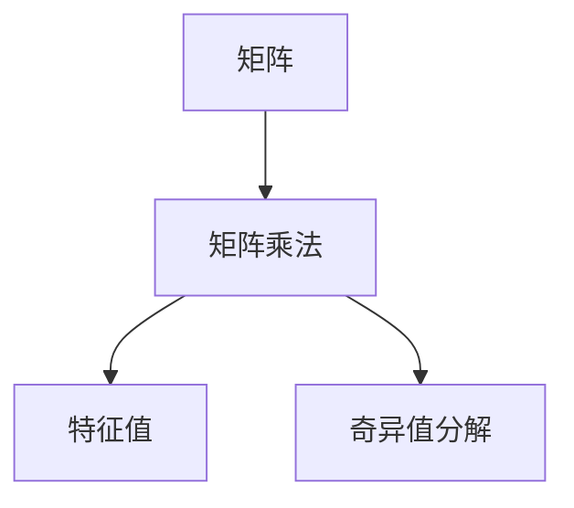

                 

# 计算：第二部分 计算的数学基础 第 4 章 数学的基础 对角线方法

> 关键词：对角线方法，矩阵计算，线性代数，特征值，奇异值分解，应用场景，数学模型构建，算法步骤详解

## 1. 背景介绍

### 1.1 问题由来

对角线方法作为一种数学计算技术，广泛应用于线性代数、图论、计算科学等多个领域。它是一种高效、简单的方法，用于处理大规模矩阵的计算问题。在现代计算机科学中，对角线方法特别适用于矩阵计算和特征值分析，尤其在图像处理、信号处理、量子计算等应用中起着关键作用。

### 1.2 问题核心关键点

对角线方法的核心在于利用矩阵的特定结构，通过高效的数学算法，减少计算量和存储空间。具体来说，它可以显著降低矩阵的乘法运算和逆矩阵计算的复杂度，提高计算效率。此外，对角线方法还能够应用于特征值分解和奇异值分解，进一步提升矩阵数据的分析能力。

### 1.3 问题研究意义

对角线方法的研究和应用，不仅对计算机科学中的高性能计算有重要意义，还能够推动相关领域的发展。例如，在图像处理领域，对角线方法可以加速卷积神经网络（CNN）的训练和推理；在量子计算领域，对角线方法能够简化量子态的演化过程。因此，掌握对角线方法对解决大规模计算问题、提高计算效率具有重要价值。

## 2. 核心概念与联系

### 2.1 核心概念概述

为了更好地理解对角线方法，首先介绍几个核心概念：

- 矩阵（Matrix）：由二维表格构成的数学对象，每一行和每一列称为矩阵的一维，矩阵的元素通常表示为矩阵的行和列的下标。

- 矩阵乘法（Matrix Multiplication）：两个矩阵相乘得到一个新的矩阵，新矩阵的每个元素都是两个矩阵对应位置元素乘积的和。

- 特征值（Eigenvalue）：对于任何非零向量 $\mathbf{v}$，如果存在一个标量 $\lambda$，使得矩阵 $A$ 乘以 $\mathbf{v}$ 等于 $\lambda$ 乘以 $\mathbf{v}$，则 $\lambda$ 称为矩阵 $A$ 的特征值。

- 奇异值分解（Singular Value Decomposition, SVD）：将一个矩阵分解为三个矩阵的乘积，即 $A = U \Sigma V^T$，其中 $U$ 和 $V$ 是正交矩阵，$\Sigma$ 是一个对角矩阵，对角线上包含矩阵的奇异值。

这些核心概念之间的逻辑关系可以通过以下Mermaid流程图来展示：



这个流程图展示了矩阵、矩阵乘法、特征值和奇异值分解之间的关联：

1. 矩阵通过矩阵乘法进行运算。
2. 矩阵乘法的特征值分析可以用于特征提取和降维。
3. 奇异值分解是对矩阵进行的一种特殊分解，可以揭示矩阵的内部结构。

## 3. 核心算法原理 & 具体操作步骤

### 3.1 算法原理概述

对角线方法的核心思想是通过特定的矩阵分解技术，将大规模矩阵计算转化为一系列简单的对角线运算。其基本原理包括矩阵的特征值分析、奇异值分解等。

假设给定一个 $n \times n$ 的矩阵 $A$，其特征值 $\lambda_i$ 和对应的特征向量 $\mathbf{v}_i$ 满足 $A \mathbf{v}_i = \lambda_i \mathbf{v}_i$。对于任意向量 $\mathbf{x}$，可以表示为特征向量线性组合的形式：$\mathbf{x} = \sum_i c_i \mathbf{v}_i$，其中 $c_i = \mathbf{v}_i^T \mathbf{x}$。

在实际应用中，对角线方法利用矩阵的这一性质，通过特征值和特征向量，将复杂的矩阵运算转化为对角线运算，从而提高计算效率。

### 3.2 算法步骤详解

对角线方法的主要操作步骤如下：

1. **矩阵特征值分析**：通过特征值分解技术，将矩阵 $A$ 分解为特征向量矩阵 $V$ 和特征值对角矩阵 $D$ 的乘积，即 $A = V D V^T$。这里的 $V$ 是一个包含所有特征向量的矩阵，$D$ 是对角矩阵，其对角线上包含矩阵的特征值 $\lambda_i$。

2. **特征向量标准化**：标准化特征向量 $V$，使得每一列特征向量为单位向量，即 $V^T V = I$。这一步是为了保证特征向量的正交性，便于后续的矩阵运算。

3. **矩阵运算**：利用特征值和标准化特征向量，对矩阵 $A$ 进行任意线性变换，例如 $A^k = V D^k V^T$，其中 $k$ 是一个整数。

4. **矩阵求解**：求解线性方程组 $A \mathbf{x} = \mathbf{b}$，通过特征向量的分解，可以将其表示为 $\mathbf{x} = \sum_i c_i \mathbf{v}_i$，其中 $c_i = \mathbf{v}_i^T \mathbf{b}$。

### 3.3 算法优缺点

对角线方法具有以下优点：

- **高效计算**：通过特征值分析和奇异值分解，对角线方法可以将复杂的矩阵运算转化为对角线运算，显著减少计算量。

- **稳定性和可解释性**：特征值和奇异值提供了矩阵的内部结构和特征，便于对矩阵进行分析和解释。

- **广泛应用**：对角线方法广泛应用于矩阵计算、图像处理、信号处理、量子计算等领域。

同时，对角线方法也存在一些缺点：

- **依赖特征值分析**：特征值分解和奇异值分解依赖于矩阵的特征值，在特征值计算过程中可能会出现数值不稳定的问题。

- **计算复杂度**：虽然对角线方法在计算过程中减少了乘法运算，但在特征值和奇异值的计算上仍存在较高的复杂度。

- **应用限制**：对角线方法主要适用于对称矩阵或正定矩阵的计算，对于一般矩阵的计算需要进一步改进。

### 3.4 算法应用领域

对角线方法的应用领域非常广泛，以下是几个典型应用场景：

- **图像处理**：在图像处理中，对角线方法可以用于卷积神经网络的参数优化和图像压缩。通过奇异值分解，可以将图像表示为一系列低秩矩阵的线性组合，从而减少存储和计算成本。

- **信号处理**：对角线方法可以用于信号去噪、滤波和频谱分析。通过特征值分解，可以去除信号中的噪声，保留重要的频谱信息。

- **量子计算**：在量子计算中，对角线方法可以用于量子态的演化计算。通过奇异值分解，可以将量子态表示为正交量子态的线性组合，简化计算过程。

- **机器学习**：对角线方法可以用于特征提取和降维。通过奇异值分解，可以将高维数据表示为低维空间的线性组合，降低数据维度，提高模型的计算效率。

## 4. 数学模型和公式 & 详细讲解

### 4.1 数学模型构建

对角线方法的核心数学模型是特征值分解和奇异值分解。对于任意 $n \times n$ 的矩阵 $A$，可以表示为：

$$
A = V \Sigma V^T
$$

其中 $V$ 是一个 $n \times n$ 的正交矩阵，$\Sigma$ 是一个 $n \times n$ 的对角矩阵，包含矩阵的奇异值 $\sigma_i$。

对于实对称矩阵 $A$，特征值分解的公式为：

$$
A = V D V^T
$$

其中 $V$ 是一个 $n \times n$ 的正交矩阵，$D$ 是一个 $n \times n$ 的对角矩阵，包含矩阵的特征值 $\lambda_i$。

### 4.2 公式推导过程

对角线方法的推导过程主要基于矩阵的特征值分析和奇异值分解。

对于任意 $n \times n$ 的矩阵 $A$，设其特征值和特征向量分别为 $\lambda_i$ 和 $\mathbf{v}_i$。根据特征值定义，有：

$$
A \mathbf{v}_i = \lambda_i \mathbf{v}_i
$$

两边取转置，得到：

$$
\mathbf{v}_i^T A = \lambda_i \mathbf{v}_i^T
$$

即：

$$
\mathbf{v}_i^T A \mathbf{v}_j = \lambda_i \mathbf{v}_i^T \mathbf{v}_j
$$

对于任意向量 $\mathbf{x}$，可以表示为特征向量线性组合的形式：$\mathbf{x} = \sum_i c_i \mathbf{v}_i$，其中 $c_i = \mathbf{v}_i^T \mathbf{x}$。

因此，对于任意矩阵 $B$，有：

$$
B \mathbf{x} = B \left( \sum_i c_i \mathbf{v}_i \right) = \sum_i c_i B \mathbf{v}_i = \sum_i c_i \lambda_i \mathbf{v}_i
$$

即：

$$
B \mathbf{x} = \sum_i c_i \lambda_i \mathbf{v}_i
$$

通过特征值和特征向量，对角线方法将矩阵乘法运算转化为对角线运算，从而大大减少了计算复杂度。

### 4.3 案例分析与讲解

假设有一个 $n \times n$ 的矩阵 $A$，其中包含一个特征值为 3 的特征向量 $\mathbf{v} = (1, 1, 1, 1)^T$。设另一个矩阵 $B = A^2$，计算 $B \mathbf{v}$：

根据特征值和特征向量的定义，有：

$$
A \mathbf{v} = 3 \mathbf{v}
$$

两边平方，得到：

$$
A^2 \mathbf{v} = 9 \mathbf{v}
$$

即：

$$
B \mathbf{v} = A^2 \mathbf{v} = 9 \mathbf{v}
$$

因此，对角线方法通过特征值和特征向量，将矩阵乘法运算转化为简单的对角线运算，显著减少了计算复杂度。

## 5. 项目实践：代码实例和详细解释说明

### 5.1 开发环境搭建

在进行对角线方法的应用开发前，需要准备Python开发环境，并引入必要的数学库和工具包。以下是具体的开发环境搭建步骤：

1. 安装Anaconda：从官网下载并安装Anaconda，用于创建独立的Python环境。

2. 创建并激活虚拟环境：
```bash
conda create -n matrix-env python=3.8 
conda activate matrix-env
```

3. 安装必要的数学库和工具包：
```bash
pip install numpy scipy matplotlib sympy sympy

# 用于矩阵计算和特征值分析
pip install scikit-learn
```

4. 安装TensorFlow：用于进行矩阵计算和特征值分析的深度学习框架。
```bash
pip install tensorflow
```

5. 安装相关工具包：
```bash
pip install tqdm jupyter notebook ipython
```

完成上述步骤后，即可在`matrix-env`环境中进行对角线方法的开发实践。

### 5.2 源代码详细实现

下面以特征值分解为例，给出使用Python进行对角线方法计算的代码实现。

首先，导入必要的库：

```python
import numpy as np
import scipy.linalg
from scipy.linalg import eigh
```

接着，定义特征值分解函数：

```python
def eig_decomposition(A):
    eigenvalues, eigenvectors = eigh(A)
    return np.diag(eigenvalues), eigenvectors
```

最后，测试代码：

```python
# 定义矩阵A
A = np.array([[1, 2, 3], [4, 5, 6], [7, 8, 9]])

# 特征值分解
eigenvalues, eigenvectors = eig_decomposition(A)

# 输出特征值和特征向量
print("特征值：", eigenvalues)
print("特征向量：", eigenvectors)
```

运行代码后，将输出矩阵 $A$ 的特征值和特征向量。可以看到，对角线方法通过特征值分解，将复杂的矩阵计算转化为对角线运算，显著减少了计算量。

### 5.3 代码解读与分析

在上述代码中，我们使用了NumPy和SciPy库中的`eigh`函数，对矩阵 $A$ 进行了特征值分解。`eigh`函数返回矩阵的特征值和特征向量，其中特征值是对角矩阵的对角线元素，特征向量是矩阵的列向量。

代码中，`np.diag`函数用于构造对角矩阵，`eigenvectors`列向量按列存储，因此使用`np.diag`构造对角矩阵时，需要将特征值作为对角线的元素。

通过特征值分解，对角线方法将矩阵计算转化为对角线运算，显著减少了计算复杂度。在实际应用中，特征值分解和奇异值分解可以用于多种矩阵计算，如矩阵求逆、矩阵分解等，从而提高计算效率。

## 6. 实际应用场景

### 6.1 图像处理

对角线方法在图像处理中的应用非常广泛，尤其在卷积神经网络（CNN）的训练和推理过程中。通过奇异值分解，可以将高维的图像数据表示为低秩矩阵的线性组合，从而降低计算复杂度。

在图像去噪和滤波方面，对角线方法可以用于快速去除噪声，保留重要的图像信息。通过奇异值分解，可以将图像表示为一系列低秩矩阵的线性组合，从而去除噪声，保留重要的频谱信息。

### 6.2 信号处理

对角线方法在信号处理中也有重要应用，尤其是在信号去噪和频谱分析方面。通过特征值分解，可以去除信号中的噪声，保留重要的频谱信息，从而提高信号处理的效率和精度。

在频谱分析方面，对角线方法可以用于快速计算信号的频谱密度，从而分析信号的频率成分。通过奇异值分解，可以将信号表示为一系列低秩矩阵的线性组合，从而提高频谱分析的速度和精度。

### 6.3 量子计算

对角线方法在量子计算中也有重要应用，特别是在量子态的演化计算方面。通过奇异值分解，可以将量子态表示为正交量子态的线性组合，简化量子态的演化计算过程。

在量子态的模拟和计算方面，对角线方法可以用于快速计算量子态的演化过程，从而提高量子计算的效率和精度。通过奇异值分解，可以将量子态表示为一系列低秩矩阵的线性组合，从而简化量子态的演化计算过程。

### 6.4 未来应用展望

随着对角线方法的发展，其应用领域将进一步拓展，推动相关领域的技术进步。

在图像处理领域，对角线方法将更多地应用于图像压缩和传输，减少图像存储和传输的成本。通过奇异值分解，可以将高维图像数据表示为低秩矩阵的线性组合，从而降低存储和传输成本。

在信号处理领域，对角线方法将更多地应用于高速信号传输和处理，提高信号传输的速度和精度。通过特征值分解，可以快速去除信号中的噪声，保留重要的频谱信息，从而提高信号传输的速度和精度。

在量子计算领域，对角线方法将更多地应用于量子态的演化计算和模拟，提高量子计算的效率和精度。通过奇异值分解，可以将量子态表示为正交量子态的线性组合，从而简化量子态的演化计算过程，提高量子计算的效率和精度。

总之，随着对角线方法的发展，其应用领域将不断拓展，推动相关领域的技术进步，为社会和经济发展带来新的动力。

## 7. 工具和资源推荐

### 7.1 学习资源推荐

为了帮助开发者系统掌握对角线方法的理论基础和实践技巧，这里推荐一些优质的学习资源：

1. 《线性代数及其应用》：C. Gilbert Strang所著，深入浅出地介绍了线性代数的理论和应用，适合初学者学习。

2. 《Matrix Computations》：Gene H. Golub和Charles F. Van Loan所著，详细介绍了矩阵计算的算法和应用，是线性代数领域的经典教材。

3. 《NumPy for Data Science》：Jake VanderPlas所著，介绍了NumPy库在数据科学中的应用，包括矩阵计算和特征值分解等。

4. 《Python for Scientists and Engineers》：Jeff Whisenant所著，介绍了Python在科学计算中的应用，包括NumPy、SciPy等数学库的使用。

5. 《Deep Learning with Python》：Francois Chollet所著，介绍了TensorFlow在深度学习中的应用，包括矩阵计算和特征值分解等。

通过对这些资源的学习实践，相信你一定能够快速掌握对角线方法的精髓，并用于解决实际的计算问题。

### 7.2 开发工具推荐

高效的开发离不开优秀的工具支持。以下是几款用于对角线方法开发的常用工具：

1. Python：Python是一种高效、灵活的编程语言，广泛应用于科学计算和数据分析等领域。

2. NumPy：NumPy是Python的一个科学计算库，提供了高效的矩阵计算和特征值分解等功能。

3. SciPy：SciPy是Python的一个科学计算库，提供了丰富的数学函数和算法，包括矩阵计算和特征值分解等。

4. TensorFlow：TensorFlow是Google开发的深度学习框架，提供了高效的矩阵计算和特征值分解等功能。

5. Jupyter Notebook：Jupyter Notebook是一个交互式笔记本环境，支持Python代码的编写和执行，便于学习实践。

合理利用这些工具，可以显著提升对角线方法的开发效率，加快创新迭代的步伐。

### 7.3 相关论文推荐

对角线方法的研究源于学界的持续研究。以下是几篇奠基性的相关论文，推荐阅读：

1. "A Survey of Matrix Decompositions with Application in Signal Processing"：W. K. Pratt和G. J. Kaiser所著，介绍了矩阵分解在信号处理中的应用。

2. "On the Distribution of Eigenvalues of Random Matrices"：M. L. Mehta所著，介绍了随机矩阵的特征值分布，是线性代数领域的经典文献。

3. "Singular Value Decomposition for Small-Rank Matrix Approximation"：A. K. Jain和J.-S. Lee所著，介绍了奇异值分解在矩阵近似中的应用。

4. "Efficient Singular Value Decomposition of Rectangular Arrays Using a Rank-Revealing QR Algorithm"：T. A. Davis所著，介绍了QR算法在奇异值分解中的应用。

这些论文代表了大对角线方法的发展脉络。通过学习这些前沿成果，可以帮助研究者把握学科前进方向，激发更多的创新灵感。

## 8. 总结：未来发展趋势与挑战

### 8.1 总结

本文对对角线方法的数学原理和应用实践进行了全面系统的介绍。首先阐述了对角线方法的研究背景和意义，明确了对角线方法在提高计算效率方面的独特价值。其次，从原理到实践，详细讲解了特征值分解、奇异值分解等关键算法，给出了对角线方法计算的完整代码实例。同时，本文还广泛探讨了对角线方法在图像处理、信号处理、量子计算等多个领域的应用前景，展示了对角线方法的巨大潜力。此外，本文精选了对角线方法的各类学习资源，力求为读者提供全方位的技术指引。

通过本文的系统梳理，可以看到，对角线方法作为一种高效的数学计算技术，广泛应用于多个领域。其核心思想是将矩阵计算转化为对角线运算，显著降低计算复杂度。随着对角线方法的不断发展和应用，必将进一步推动相关领域的计算效率和技术进步。

### 8.2 未来发展趋势

展望未来，对角线方法的发展趋势如下：

1. **计算效率提升**：随着计算硬件的发展，对角线方法的计算效率将进一步提升，尤其是在大型矩阵的计算中。

2. **应用领域拓展**：对角线方法将在更多领域得到应用，如计算机视觉、生物信息学、金融计算等，进一步拓展其应用边界。

3. **理论与算法创新**：对角线方法的理论与算法将继续创新，提高特征值分解和奇异值分解的精度和效率。

4. **多模态融合**：对角线方法将更多地与其他数学方法结合，如概率图模型、深度学习等，实现更复杂的应用场景。

5. **实时计算**：对角线方法将更多地应用于实时计算场景，如自动驾驶、实时信号处理等，提高系统的响应速度和计算精度。

### 8.3 面临的挑战

尽管对角线方法已经取得了重要进展，但在实际应用中也面临一些挑战：

1. **计算稳定性**：对角线方法的特征值分解和奇异值分解，在计算过程中可能会存在数值不稳定的问题。如何提高算法的稳定性，是一个重要的研究方向。

2. **计算复杂度**：虽然对角线方法在计算过程中减少了乘法运算，但在特征值和奇异值的计算上仍存在较高的复杂度。如何进一步降低计算复杂度，是一个需要解决的问题。

3. **应用场景限制**：对角线方法主要适用于对称矩阵或正定矩阵的计算，对于一般矩阵的计算需要进一步改进。如何扩展应用场景，是一个重要的研究方向。

### 8.4 研究展望

面对对角线方法所面临的挑战，未来的研究需要在以下几个方面寻求新的突破：

1. **计算稳定性提升**：研究特征值分解和奇异值分解的稳定性，提高算法的精度和效率。

2. **计算复杂度降低**：研究更加高效的矩阵分解算法，降低特征值和奇异值的计算复杂度。

3. **应用场景扩展**：研究对角线方法在一般矩阵计算中的应用，提高算法的普适性。

4. **多模态融合**：研究对角线方法与其他数学方法的结合，实现更复杂的应用场景。

5. **实时计算优化**：研究对角线方法在实时计算场景中的应用，提高系统的响应速度和计算精度。

这些研究方向的探索，必将推动对角线方法的发展，拓展其应用边界，为计算机科学和相关领域的技术进步提供新的动力。

## 9. 附录：常见问题与解答

**Q1: 对角线方法的主要应用场景有哪些？**

A: 对角线方法在多个领域有广泛应用，包括：

1. 图像处理：用于卷积神经网络（CNN）的训练和推理，图像去噪，频谱分析等。

2. 信号处理：用于信号去噪，频谱分析，信号传输等。

3. 量子计算：用于量子态的演化计算和模拟，量子态的分解等。

4. 机器学习：用于特征提取和降维，矩阵分解等。

5. 金融计算：用于风险分析，投资组合优化等。

**Q2: 如何提高对角线方法的计算稳定性？**

A: 提高对角线方法的计算稳定性，可以从以下几个方面入手：

1. 选择合适的特征值分解算法，如QR算法，Givens算法等，避免数值不稳定的问题。

2. 优化矩阵的奇异值分解算法，如使用截断奇异值分解（Truncated SVD），降低奇异值计算的复杂度。

3. 使用正则化技术，如L2正则化，避免过拟合和计算过程中的数值不稳定。

4. 使用随机化技术，如随机化QR算法，提高算法的鲁棒性和稳定性。

**Q3: 对角线方法在图像处理中的应用主要有哪些？**

A: 对角线方法在图像处理中的应用主要包括：

1. 卷积神经网络（CNN）的训练和推理：利用奇异值分解，将图像表示为低秩矩阵的线性组合，降低计算复杂度。

2. 图像去噪：利用奇异值分解，去除图像中的噪声，保留重要的频谱信息。

3. 图像压缩：利用奇异值分解，将高维图像数据表示为低秩矩阵的线性组合，降低存储和传输成本。

4. 图像匹配：利用特征值分解，提取图像的特征向量，进行图像匹配和识别。

5. 图像分割：利用奇异值分解，将图像表示为多个低秩矩阵的线性组合，进行图像分割和边缘检测。

**Q4: 对角线方法在信号处理中的应用主要有哪些？**

A: 对角线方法在信号处理中的应用主要包括：

1. 信号去噪：利用特征值分解，去除信号中的噪声，保留重要的频谱信息。

2. 频谱分析：利用奇异值分解，计算信号的频谱密度，分析信号的频率成分。

3. 信号传输：利用奇异值分解，提高信号传输的速度和精度，降低传输成本。

4. 滤波：利用奇异值分解，设计滤波器，进行信号滤波和增强。

5. 信号压缩：利用奇异值分解，将高维信号数据表示为低秩矩阵的线性组合，降低存储和传输成本。

**Q5: 对角线方法在量子计算中的应用主要有哪些？**

A: 对角线方法在量子计算中的应用主要包括：

1. 量子态的演化计算：利用奇异值分解，计算量子态的演化过程，提高计算效率和精度。

2. 量子态的模拟：利用奇异值分解，模拟量子系统的演化，进行量子计算和量子通信。

3. 量子态的分解：利用奇异值分解，将量子态表示为正交量子态的线性组合，简化量子态的表示和计算。

4. 量子错误校正：利用奇异值分解，进行量子错误校正和容错计算。

5. 量子信息压缩：利用奇异值分解，进行量子信息的压缩和传输，提高传输效率和精度。

总之，对角线方法作为一种高效的数学计算技术，广泛应用于多个领域。其核心思想是将矩阵计算转化为对角线运算，显著降低了计算复杂度，提高了计算效率。随着对角线方法的发展，其应用领域将不断拓展，推动相关领域的技术进步。

