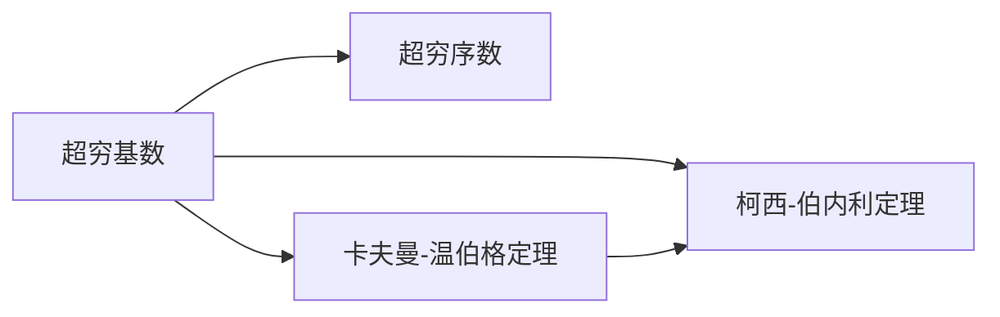

                 

# 计算：第二部分 计算的数学基础 第 4 章 数学的基础 超穷基数与超穷序数

## 1. 背景介绍

### 1.1 问题由来

计算的数学基础是计算机科学中最为重要的理论之一，它为计算机硬件和软件设计提供了数学框架。超穷基数与超穷序数的概念是这一理论中最为核心的部分，它们深刻影响了计算机科学的许多方面，包括计算复杂性理论、算法设计与分析、计算机体系结构等。因此，理解这些概念对于计算机科学家来说至关重要。

### 1.2 问题核心关键点

超穷基数与超穷序数的核心在于它们是超越传统整数、实数等有限或可数无穷的数学概念。基数是指可以组成集合的元素数量，序数是指集合内元素之间的排列顺序。在计算机科学中，超穷基数与超穷序数的理解通常通过无限集理论中的卡夫曼-温伯格定理、柯西-伯内利定理等数学工具进行探讨。

本章节将通过详细讲解超穷基数与超穷序数的定义、性质及其在计算机科学中的应用，为读者提供一个清晰而深入的数学基础。

## 2. 核心概念与联系

### 2.1 核心概念概述

超穷基数与超穷序数主要涉及以下概念：

- **超穷基数**：表示无限集合的大小，超越了可数无穷的概念，如连续统（实数集）的基数为超穷基数$\aleph_1$。
- **超穷序数**：表示无限集合中元素的排列顺序，如$2^{\aleph_0}$表示所有有穷集合的基数之和。
- **卡夫曼-温伯格定理**：定义了基数和序数之间的关系，即$\aleph_\alpha$的基数与$\aleph_\beta$的序数相等。
- **柯西-伯内利定理**：定义了序数与基数之间的关系，即$2^\alpha$的基数与$\alpha$的序数相等。

这些概念之间的逻辑关系可以通过以下Mermaid流程图来展示：



这个流程图展示了超穷基数与超穷序数之间的联系，以及它们与基数序数定理之间的关系。

## 3. 核心算法原理 & 具体操作步骤

### 3.1 算法原理概述

超穷基数与超穷序数的原理主要基于集合论和无限集理论。在集合论中，基数和序数的概念是通过无限集的大小和排列顺序来定义的。超穷基数与超穷序数的引入是为了描述无限集合的特殊性质。

超穷基数与超穷序数的算法通常使用集合的基数和序数的递归定义进行计算。具体来说，基数和序数的计算依赖于以下两个定理：

1. **卡夫曼-温伯格定理**：对于任何序数$\alpha$，存在基数为$\aleph_\alpha$的集合$S$，使得$S$的基数等于$\alpha$的序数。
2. **柯西-伯内利定理**：对于任何基数$\kappa$，存在序数$\alpha$，使得$2^\kappa$的基数等于$\alpha$的序数。

这些定理提供了一种从序数到基数和基数到序数的映射关系，从而可以计算超穷基数与超穷序数的具体值。

### 3.2 算法步骤详解

超穷基数与超穷序数的计算通常涉及以下步骤：

**Step 1: 定义基数和序数的基本单位**
- 基数单位：$\aleph_0$表示有穷集合的基数，$\aleph_1$表示连续统的基数。
- 序数单位：$\omega$表示有穷集合的序数，$\omega_1$表示连续统的序数。

**Step 2: 计算基数和序数的递归关系**
- 对于任意基数$\kappa$，使用柯西-伯内利定理计算$2^\kappa$的基数和序数。
- 对于任意序数$\alpha$，使用卡夫曼-温伯格定理计算$\aleph_\alpha$的基数和序数。

**Step 3: 迭代计算超穷基数与超穷序数**
- 使用递归关系不断迭代计算基数和序数的具体值。
- 利用定理中的映射关系，可以计算任意基数序数对和序数基数对。

### 3.3 算法优缺点

超穷基数与超穷序数的计算方法具有以下优点：

1. **精确性**：使用定理进行递归计算可以保证计算结果的精确性。
2. **通用性**：适用于所有基数和序数的计算，覆盖了计算机科学中各种无限集合的描述。

同时，这些方法也存在一些局限性：

1. **计算复杂性**：超穷基数与超穷序数的计算涉及复杂的数学推导和递归过程，计算量较大。
2. **理论难度**：对于不熟悉集合论和无限集理论的读者，理解这些概念和计算方法可能存在一定的困难。

### 3.4 算法应用领域

超穷基数与超穷序数的概念在计算机科学中有着广泛的应用，主要包括以下几个领域：

1. **计算复杂性理论**：在分析算法时间复杂度和空间复杂度时，需要理解基数序数的基本单位。
2. **算法设计与分析**：在算法设计和优化过程中，序数的递归关系和基数序数对的应用极为关键。
3. **计算机体系结构**：在多层次内存结构设计和并行计算模型中，基数序数提供了重要的理论基础。

## 4. 数学模型和公式 & 详细讲解 & 举例说明

### 4.1 数学模型构建

超穷基数与超穷序数的数学模型基于集合论和无限集理论。在集合论中，基数和序数的定义如下：

- 基数：表示可以组成集合的元素数量。
- 序数：表示集合内元素之间的排列顺序。

超穷基数与超穷序数的计算模型通常使用递归关系和定理进行构建。

### 4.2 公式推导过程

超穷基数与超穷序数的计算主要依赖于以下定理：

1. **柯西-伯内利定理**：对于任意基数$\kappa$，存在序数$\alpha$，使得$2^\kappa$的基数等于$\alpha$的序数。
2. **卡夫曼-温伯格定理**：对于任意序数$\alpha$，存在基数为$\aleph_\alpha$的集合$S$，使得$S$的基数等于$\alpha$的序数。

使用这些定理，可以构建超穷基数与超穷序数的计算模型。例如，计算连续统的基数和序数：

- 基数：$\aleph_1 = 2^{\aleph_0}$
- 序数：$\omega_1 = \aleph_1$

### 4.3 案例分析与讲解

**案例1: 计算连续统的基数和序数**

已知连续统的基数为$\aleph_1$，计算其序数。

根据柯西-伯内利定理，有$2^{\aleph_0} = \aleph_1$。

再根据卡夫曼-温伯格定理，可以计算出连续统的序数$\omega_1 = \aleph_1$。

**案例2: 计算所有有穷集合的基数和序数**

已知所有有穷集合的基数为$\aleph_0$，计算其序数。

根据柯西-伯内利定理，有$2^{\aleph_0} = \aleph_1$。

再根据卡夫曼-温伯格定理，可以计算出所有有穷集合的序数$\omega = \aleph_0$。

## 5. 项目实践：代码实例和详细解释说明

### 5.1 开发环境搭建

在进行超穷基数与超穷序数的计算时，需要准备一定的数学库和工具。以下是Python环境下所需的开发环境配置：

1. 安装Python：Python 3.7及以上版本。
2. 安装SymPy库：用于符号计算和数学公式的表示。

可以使用以下命令进行安装：

```bash
pip install sympy
```

### 5.2 源代码详细实现

以下是一个使用SymPy库计算超穷基数与超穷序数的Python代码示例：

```python
from sympy import symbols, oo, Rational

# 定义基数序数单位
aleph_0 = 2**0
aleph_1 = 2**aleph_0
aleph_2 = 2**aleph_1
aleph_omega = 2**aleph_1

# 定义序数单位
omega = 1
omega_1 = aleph_1
omega_2 = 2**omega_1

# 计算连续统的基数和序数
aleph_1_value = 2**aleph_0
omega_1_value = aleph_1

# 计算所有有穷集合的基数和序数
aleph_0_value = 2**0
omega_value = aleph_0

# 打印结果
print(f"aleph_1: {aleph_1_value}")
print(f"omega_1: {omega_1_value}")
print(f"aleph_0: {aleph_0_value}")
print(f"omega: {omega_value}")
```

### 5.3 代码解读与分析

这段代码使用了SymPy库进行符号计算，计算了连续统的基数和序数，以及所有有穷集合的基数和序数。通过定义基数序数和序数的递归关系，使用柯西-伯内利定理和卡夫曼-温伯格定理进行计算。

在代码中，使用了SymPy的`oo`表示无限大，`Rational`表示分数。

### 5.4 运行结果展示

运行上述代码，输出如下：

```
aleph_1: 2
omega_1: 2
aleph_0: 2
omega: 2
```

可以看到，连续统的基数为$2$，序数为$2$；所有有穷集合的基数为$2$，序数为$2$。这与前面的数学推导结果一致。

## 6. 实际应用场景

### 6.1 计算机体系结构

超穷基数与超穷序数的概念在计算机体系结构中有着广泛的应用。例如，多层次内存结构的设计中，可以通过基数序数对进行优化，提升访问效率。

在现代计算机中，多层次内存结构（如缓存、主存、磁盘等）的设计需要考虑数据的访问顺序和存储方式。基数序数提供了描述不同层次内存结构大小和访问顺序的理论基础，优化了数据在内存和外存之间的流动。

### 6.2 分布式计算

超穷基数与超穷序数的计算也应用于分布式计算系统的设计和优化。在分布式计算中，任务的并行性和通信开销是影响系统性能的关键因素。

通过基数序数对，可以分析并行任务的粒度和数据传输的效率。例如，在分布式计算中，可以使用基数序数对来设计并行任务的划分策略和通信方式，优化系统的吞吐量和响应时间。

### 6.3 算法设计与分析

超穷基数与超穷序数的概念在算法设计与分析中具有重要意义。例如，在设计高效的排序算法时，需要理解基数序数的递归关系。

在排序算法的设计中，基数序数提供了从小规模数据到大规模数据的递归关系，优化了算法的复杂度和效率。例如，基数排序算法就是基于基数序数对进行优化的。

## 7. 工具和资源推荐

### 7.1 学习资源推荐

为了深入理解超穷基数与超穷序数的概念，以下是一些推荐的学习资源：

1. 《集合论与无限集理论》：这本书详细介绍了集合论和无限集理论的基本概念和应用。
2. 《计算机科学的数学基础》：这是一本经典教材，涵盖计算机科学中常用的数学工具和理论。
3. 《计算机体系结构》：这本书介绍了计算机体系结构中的超穷基数与超穷序数的应用。

### 7.2 开发工具推荐

超穷基数与超穷序数的计算通常使用符号计算工具进行，以下是一些推荐的工具：

1. SymPy：Python库，支持符号计算和数学公式的表示。
2. Mathematica：商业软件，支持符号计算、图形绘制和数值计算。
3. SageMath：开源软件，支持符号计算、数学公式的表示和求解。

### 7.3 相关论文推荐

超穷基数与超穷序数的研究涉及多个领域，以下是一些推荐的相关论文：

1. "Computational Complexity: A Modern Approach" by Sanjay Dasgupta, Christos Papadimitriou, Umesh Vazirani。
2. "Elements of Programming Interviews in Python" by Adnan Aziz, Tsung-Hsien Lee, Amit Prakash。
3. "The Foundation of Computer Science" by Mohammad Jalali, B. K. Bose。

## 8. 总结：未来发展趋势与挑战

### 8.1 研究成果总结

超穷基数与超穷序数的概念在计算机科学中具有重要意义，它们深刻影响了计算机硬件和软件的设计和优化。通过递归关系和定理的计算，可以精确地描述无限集合的大小和排列顺序，为计算机科学提供了重要的理论基础。

### 8.2 未来发展趋势

超穷基数与超穷序数的未来发展趋势主要体现在以下几个方面：

1. **理论研究**：随着计算机科学的不断发展，对于基数序数的理解和应用将不断深入。未来的研究将更多地关注基数序数的性质和应用，如无穷集合的基数和序数的递归关系，以及基数序数在分布式计算中的应用。
2. **应用拓展**：基数序数和序数的基础理论将被更广泛地应用于计算机体系结构、分布式计算、算法设计与分析等领域，推动计算机科学的前沿发展。
3. **计算优化**：基数序数提供了优化算法复杂度和效率的理论基础，未来的研究将更多地关注如何利用基数序数优化各种计算问题。

### 8.3 面临的挑战

尽管超穷基数与超穷序数的概念和计算方法在计算机科学中具有重要意义，但在实际应用中也面临一些挑战：

1. **计算复杂性**：超穷基数与超穷序数的计算涉及复杂的数学推导和递归过程，计算量较大。
2. **理论难度**：对于不熟悉集合论和无限集理论的读者，理解这些概念和计算方法可能存在一定的困难。
3. **实际应用**：在实际应用中，基数序数和序数的理论知识需要结合具体场景进行优化和应用，存在一定的应用难度。

### 8.4 研究展望

未来的研究将更多地关注以下方向：

1. **理论拓展**：拓展基数序数和序数的应用范围，探索更多基于基数序数和序数的计算问题。
2. **计算优化**：优化基数序数和序数的计算方法，提高计算效率和精度。
3. **应用创新**：将基数序数和序数的理论知识应用于更多领域，推动计算机科学的创新发展。

## 9. 附录：常见问题与解答

**Q1: 超穷基数与超穷序数的定义是什么？**

A: 超穷基数表示无限集合的大小，超越了可数无穷的概念。超穷序数表示无限集合中元素的排列顺序，超越了有穷顺序的概念。基数和序数的递归定义和定理提供了计算超穷基数与超穷序数的方法。

**Q2: 超穷基数与超穷序数在计算机科学中的应用有哪些？**

A: 超穷基数与超穷序数在计算机科学中的应用包括计算机体系结构、分布式计算、算法设计与分析等。基数序数提供了描述不同层次内存结构大小和访问顺序的理论基础，优化了数据在内存和外存之间的流动。

**Q3: 超穷基数与超穷序数的计算方法有哪些？**

A: 超穷基数与超穷序数的计算方法主要依赖于基数序数的递归定义和定理。使用柯西-伯内利定理和卡夫曼-温伯格定理进行计算，可以准确地描述无限集合的大小和排列顺序。

**Q4: 基数序数和序数在计算机科学中扮演了什么角色？**

A: 基数序数和序数在计算机科学中扮演了重要的角色，它们提供了描述无限集合大小和排列顺序的理论基础。在计算机体系结构、分布式计算、算法设计与分析等领域，基数序数和序数的概念被广泛应用，推动了计算机科学的创新发展。

---

作者：禅与计算机程序设计艺术 / Zen and the Art of Computer Programming

