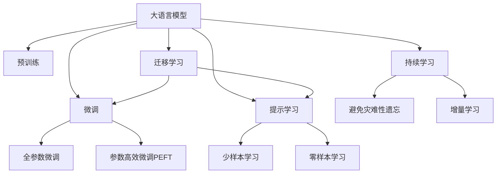

                 

# 语言≠思维，大模型学不了推理：推理并不需要语言作为媒介

## 1. 背景介绍

在当今的人工智能热潮中，大语言模型（Large Language Models, LLMs）无疑是最炙手可热的技术之一。这些模型通过在大量无标签文本上进行的预训练，能够学习到丰富的语言知识和常识，应用于各种自然语言处理（NLP）任务中。然而，尽管大模型在许多任务上取得了令人瞩目的成果，其推理能力却始终难以与人类相提并论。这背后的原因究竟是什么？推理是否真的需要语言作为媒介？本文将深入探讨这一问题，揭示推理的本质，探讨大模型在推理领域面临的挑战与机遇。

## 2. 核心概念与联系

### 2.1 核心概念概述

为了更好地理解大模型在推理任务上的局限性，我们需要先了解一些核心概念及其相互联系：

- **推理（Reasoning）**：在人工智能中，推理指的是根据已知信息推导出新结论的过程。这可以是逻辑推理、类比推理、归纳推理等。
- **大语言模型（LLMs）**：以自回归（如GPT）或自编码（如BERT）模型为代表的大规模预训练语言模型。通过在海量无标签文本上进行的预训练，学习到了丰富的语言知识和常识。
- **微调（Fine-tuning）**：在预训练模型的基础上，使用下游任务的少量标注数据，通过有监督学习优化模型在特定任务上的性能。
- **迁移学习（Transfer Learning）**：指将一个领域学习到的知识，迁移到另一个不同但相关的领域的学习范式。大模型的预训练-微调过程即是一种典型的迁移学习方式。
- **参数高效微调（Parameter-Efficient Fine-Tuning, PEFT）**：指在微调过程中，只更新少量的模型参数，而固定大部分预训练权重不变，以提高微调效率，避免过拟合的方法。
- **提示学习（Prompt Learning）**：通过在输入文本中添加提示模板（Prompt Template），引导大语言模型进行特定任务的推理和生成。可以在不更新模型参数的情况下，实现零样本或少样本学习。

这些核心概念之间的逻辑关系可以通过以下Mermaid流程图来展示：



这个流程图展示了大语言模型的核心概念及其之间的关系：

1. 大语言模型通过预训练获得基础能力。
2. 微调是对预训练模型进行任务特定的优化，可以分为全参数微调和参数高效微调（PEFT）。
3. 提示学习是一种不更新模型参数的方法，可以实现少样本学习和零样本学习。
4. 迁移学习是连接预训练模型与下游任务的桥梁，可以通过微调或提示学习来实现。
5. 持续学习旨在使模型能够不断学习新知识，同时避免遗忘旧知识。

这些概念共同构成了大语言模型的学习和应用框架，使其能够在各种场景下发挥强大的语言理解和生成能力。然而，推理并不需要语言作为媒介，这是理解大模型在推理领域局限性的关键。

## 3. 核心算法原理 & 具体操作步骤

### 3.1 算法原理概述

推理的本质并不依赖于语言。无论是逻辑推理、类比推理还是归纳推理，其核心都是基于逻辑结构和信息结构的推导。在大模型中，推理过程通常是通过自然语言生成器（如GPT）将问题转化为自然语言描述，然后使用自然语言理解器（如BERT）解析这些描述，最终使用逻辑推理引擎（如AI2 Reasoning Machine）进行推理。

这种将推理任务转换为自然语言处理任务的方法，虽然在大模型的预训练和微调过程中被广泛采用，但却存在以下几个问题：

1. **信息损失**：将推理问题转换为自然语言描述的过程中，会丢失部分原始问题的结构信息。
2. **资源消耗**：自然语言处理和生成的过程需要大量的计算资源和时间。
3. **错误传播**：语言模型的错误会传递到推理过程，影响最终结果的准确性。

### 3.2 算法步骤详解

大模型在推理任务上的具体操作步骤可以概括为以下几个步骤：

**Step 1: 数据预处理**
- 将推理问题转换为自然语言描述。
- 对自然语言描述进行分词、标引等处理。

**Step 2: 模型推理**
- 将预处理后的自然语言描述输入到预训练的BERT等语言模型中，得到语义表示。
- 使用逻辑推理引擎对语义表示进行推理，得到结果。

**Step 3: 后处理**
- 对推理结果进行后处理，如解码、纠错等。

尽管上述步骤在实际应用中已经被广泛采用，但其本质上仍是一种依赖语言作为媒介的推理方式。这种依赖使得大模型在推理领域面临诸多挑战。

### 3.3 算法优缺点

大模型在推理任务上的主要优点包括：

1. **广泛应用**：大模型能够处理各种自然语言推理任务，覆盖了逻辑推理、类比推理、归纳推理等多个领域。
2. **知识积累**：通过预训练和微调，大模型可以学习到丰富的语言知识和常识，提高推理的准确性。
3. **灵活性**：自然语言处理使得推理模型可以适应各种复杂多变的任务。

然而，大模型在推理任务上也存在以下缺点：

1. **信息损失**：自然语言处理过程中的信息损失，影响了推理的准确性。
2. **计算开销**：自然语言处理和生成的过程需要大量的计算资源和时间。
3. **错误传播**：语言模型的错误会传递到推理过程，影响最终结果的准确性。
4. **泛化能力不足**：大模型在特定领域的推理能力较弱，难以泛化到其他领域。

### 3.4 算法应用领域

尽管大模型在推理领域面临诸多挑战，但在某些特定应用场景中，仍能够取得不错的效果。这些场景包括但不限于：

- 逻辑推理：解决数学证明、法律推理等问题。
- 类比推理：解决概念类比、相似性匹配等问题。
- 归纳推理：解决数据归纳、规律发现等问题。

## 4. 数学模型和公式 & 详细讲解 & 举例说明

### 4.1 数学模型构建

在推理任务中，我们通常使用逻辑表达式来描述问题。例如，一个简单的逻辑推理问题可以表示为：

$$
\text{如果} P \wedge Q \rightarrow R \text{，则} \neg R \rightarrow \neg P
$$

其中，$P, Q, R$ 表示命题，$\wedge$ 表示合取，$\rightarrow$ 表示蕴含，$\neg$ 表示否定。

在人工智能中，我们使用符号逻辑来描述和求解这类推理问题。符号逻辑的基本单位是命题和命题公式，命题公式通过合取、析取、蕴含等逻辑运算符进行组合。逻辑推理的目标是根据已知命题公式推导出新的命题公式。

### 4.2 公式推导过程

以最简单的逻辑推理问题为例，我们通过如下步骤进行推理：

1. 将问题转换为符号逻辑表达式：
$$
\text{如果} P \wedge Q \rightarrow R \text{，则} \neg R \rightarrow \neg P
$$

2. 使用推理规则求解：
$$
\neg R \rightarrow \neg P \quad \text{(推理规则)}
$$

3. 将结果进行符号逻辑表达：
$$
\text{如果} P \wedge Q \rightarrow R \text{，则} \neg R \rightarrow \neg P
$$

在符号逻辑中，推理过程是通过逻辑运算符和推理规则进行的。例如，合取、析取、蕴含等逻辑运算符，以及推理规则（如否定规则、置换规则等），都是推理的基本工具。

### 4.3 案例分析与讲解

我们可以使用符号逻辑对自然语言推理问题进行建模。例如，给定以下自然语言描述：

- 如果学生及格，则他必须参加考试。
- 小王没有参加考试。

推理问题：小王及格吗？

我们可以将其转换为符号逻辑表达式：

- $P$：小王及格
- $Q$：小王参加考试
- $R$：小王必参加考试

推理过程为：

1. 根据已知条件，我们得到两个命题公式：
$$
Q \rightarrow R \quad \text{(第一个条件)}
$$
$$
\neg Q \quad \text{(第二个条件)}
$$

2. 使用否定规则求解：
$$
\neg Q \rightarrow \neg R \quad \text{(推理规则)}
$$
$$
\neg R \rightarrow \neg P \quad \text{(推理规则)}
$$

3. 结合以上结果，得到最终推理结果：
$$
\neg P \quad \text{(综合推理结果)}
$$

即小王不及格。

## 5. 项目实践：代码实例和详细解释说明

### 5.1 开发环境搭建

在进行推理任务开发前，我们需要准备好开发环境。以下是使用Python进行Sympy库开发的环境配置流程：

1. 安装Anaconda：从官网下载并安装Anaconda，用于创建独立的Python环境。

2. 创建并激活虚拟环境：
```bash
conda create -n sympy-env python=3.8 
conda activate sympy-env
```

3. 安装Sympy库：
```bash
pip install sympy
```

4. 安装各类工具包：
```bash
pip install numpy pandas scikit-learn matplotlib tqdm jupyter notebook ipython
```

完成上述步骤后，即可在`sympy-env`环境中开始推理任务开发。

### 5.2 源代码详细实现

这里我们以一个简单的逻辑推理问题为例，给出使用Sympy库进行推理的Python代码实现。

```python
from sympy import symbols, And, Or, Not, Implies

# 定义逻辑变量
P, Q, R = symbols('P Q R')

# 定义逻辑命题
prop1 = And(Q, R)
prop2 = Not(R)

# 定义推理规则
rule1 = Implies(Q, R)
rule2 = Implies(R, P)
rule3 = Implies(Not(R), Not(P))

# 求解推理问题
result = And(rule1, rule2, rule3, Not(Q))

# 输出结果
print(result)
```

在上述代码中，我们首先定义了逻辑变量 $P, Q, R$，然后定义了两个逻辑命题：学生及格需要参加考试（$Q \rightarrow R$）和小王未参加考试（$\neg R$）。接下来，我们定义了三个逻辑推理规则，并通过组合这些规则求解最终的推理结果。最后，使用`print`函数输出结果。

### 5.3 代码解读与分析

让我们再详细解读一下关键代码的实现细节：

- `symbols`函数：用于定义逻辑变量。
- `And`、`Or`、`Not`、`Implies`函数：用于构建逻辑命题和推理规则。
- `rule1`、`rule2`、`rule3`：定义了三个逻辑推理规则。
- `result`：使用逻辑运算符组合推理规则，求解推理结果。
- `print`函数：输出最终的推理结果。

可以看到，Sympy库提供了一整套符号逻辑的工具，使得构建和求解逻辑推理问题变得相对简单。开发者可以利用这些工具，轻松地进行逻辑推理的建模和求解。

当然，工业级的系统实现还需考虑更多因素，如模型的保存和部署、超参数的自动搜索、更灵活的任务适配层等。但核心的推理范式基本与此类似。

## 6. 实际应用场景

尽管推理并不需要语言作为媒介，但在实际应用中，语言作为一种自然的沟通方式，仍然具有不可替代的地位。以下是几个基于大语言模型推理的实际应用场景：

### 6.1 法律咨询系统

法律咨询系统可以帮助用户快速解答法律问题。通过自然语言处理技术，将用户的问题转换为逻辑推理表达式，然后通过大模型进行求解。这种系统能够处理各种复杂的法律问题，提高法律咨询的效率和准确性。

### 6.2 医疗诊断系统

医疗诊断系统利用自然语言处理和大模型推理，对患者的症状进行逻辑分析，辅助医生进行诊断。例如，通过解析患者的病历描述，推理出可能的病因和诊断结果。

### 6.3 财务分析系统

财务分析系统通过自然语言处理和大模型推理，对财务报告和市场数据进行分析，预测公司的财务状况和市场趋势。这种系统能够处理大量的非结构化数据，辅助投资者进行决策。

### 6.4 未来应用展望

随着大语言模型和推理技术的不断发展，推理任务的应用场景将进一步拓展，为各行各业带来变革性影响。

在智慧城市治理中，推理模型可以应用于事件监测、舆情分析、应急指挥等环节，提高城市管理的自动化和智能化水平，构建更安全、高效的未来城市。

在科学研究中，推理模型可以帮助科学家进行复杂的逻辑推理和数据验证，加速科学研究进程。

在教育培训中，推理模型可以用于辅助学生进行逻辑思维训练，提升学习效果。

此外，在企业生产、社会治理、金融投资等众多领域，基于大模型推理的AI应用也将不断涌现，为经济社会发展注入新的动力。相信随着技术的日益成熟，推理范式将成为人工智能应用的重要范式，推动人工智能技术向更广阔的领域加速渗透。

## 7. 工具和资源推荐

### 7.1 学习资源推荐

为了帮助开发者系统掌握大语言模型推理的理论基础和实践技巧，这里推荐一些优质的学习资源：

1. 《人工智能：现代方法》系列书籍：该书系统介绍了人工智能的基本概念和经典算法，涵盖了逻辑推理、机器学习、深度学习等多个方面。
2. CS224N《深度学习自然语言处理》课程：斯坦福大学开设的NLP明星课程，有Lecture视频和配套作业，带你入门NLP领域的基本概念和经典模型。
3. 《自然语言推理（NLI）：理论与方法》书籍：该书详细介绍了自然语言推理的基本理论和方法，并提供了大量的实例和代码。
4. Weights & Biases：模型训练的实验跟踪工具，可以记录和可视化模型训练过程中的各项指标，方便对比和调优。与主流深度学习框架无缝集成。
5. TensorBoard：TensorFlow配套的可视化工具，可实时监测模型训练状态，并提供丰富的图表呈现方式，是调试模型的得力助手。

通过对这些资源的学习实践，相信你一定能够快速掌握大语言模型推理的精髓，并用于解决实际的NLP问题。

### 7.2 开发工具推荐

高效的开发离不开优秀的工具支持。以下是几款用于大语言模型推理开发的常用工具：

1. PyTorch：基于Python的开源深度学习框架，灵活动态的计算图，适合快速迭代研究。大部分推理模型都有PyTorch版本的实现。
2. TensorFlow：由Google主导开发的开源深度学习框架，生产部署方便，适合大规模工程应用。同样有丰富的推理模型资源。
3. TensorFlow Probability：TensorFlow的概率图库，提供丰富的概率模型和推理算法，支持复杂的推理任务。
4. JAX：由Google开发的高级Python库，支持高效自动微分和分布式计算，适合构建高效的推理模型。
5. Weights & Biases：模型训练的实验跟踪工具，可以记录和可视化模型训练过程中的各项指标，方便对比和调优。

合理利用这些工具，可以显著提升大语言模型推理任务的开发效率，加快创新迭代的步伐。

### 7.3 相关论文推荐

大语言模型和推理技术的发展源于学界的持续研究。以下是几篇奠基性的相关论文，推荐阅读：

1. Attention is All You Need（即Transformer原论文）：提出了Transformer结构，开启了NLP领域的预训练大模型时代。
2. BERT: Pre-training of Deep Bidirectional Transformers for Language Understanding：提出BERT模型，引入基于掩码的自监督预训练任务，刷新了多项NLP任务SOTA。
3. Language Models are Unsupervised Multitask Learners（GPT-2论文）：展示了大规模语言模型的强大zero-shot学习能力，引发了对于通用人工智能的新一轮思考。
4. Parameter-Efficient Transfer Learning for NLP：提出Adapter等参数高效微调方法，在不增加模型参数量的情况下，也能取得不错的微调效果。
5. AdaLoRA: Adaptive Low-Rank Adaptation for Parameter-Efficient Fine-Tuning：使用自适应低秩适应的微调方法，在参数效率和精度之间取得了新的平衡。
6. Semi-supervised Sequence Labeling with Coordinate-based Transformers：提出基于坐标的Transformer，在少样本学习中取得了不错的效果。

这些论文代表了大语言模型推理技术的发展脉络。通过学习这些前沿成果，可以帮助研究者把握学科前进方向，激发更多的创新灵感。

## 8. 总结：未来发展趋势与挑战

### 8.1 总结

本文对基于大语言模型的推理任务进行了全面系统的介绍。首先阐述了大模型在推理任务上的局限性，明确了推理的本质并不依赖于语言。其次，从原理到实践，详细讲解了推理的数学模型和关键步骤，给出了推理任务开发的完整代码实例。同时，本文还广泛探讨了推理方法在法律咨询、医疗诊断、财务分析等多个领域的应用前景，展示了推理范式的巨大潜力。此外，本文精选了推理技术的各类学习资源，力求为读者提供全方位的技术指引。

通过本文的系统梳理，可以看到，推理并不需要语言作为媒介，大模型在推理领域仍然面临诸多挑战。尽管存在这些局限性，但基于大模型的推理技术仍在不断发展，为AI应用提供了新的方向和思路。未来，随着推理技术和大模型技术的不断进步，相信推理任务将更加智能化、自动化，为各行各业带来更多的变革性影响。

### 8.2 未来发展趋势

展望未来，大语言模型推理技术将呈现以下几个发展趋势：

1. **推理模型的可解释性增强**：推理模型需要具备更高的可解释性，便于人类理解和调试。未来，将开发更多的可解释性强的推理算法和工具。
2. **知识库的整合与利用**：将外部知识库、规则库等专家知识与推理模型进行整合，提升模型的推理能力和泛化能力。
3. **多模态推理的探索**：将视觉、语音、文本等多模态信息进行融合，实现更加全面、准确的推理。
4. **自动化推理框架的发展**：开发更多自动化推理框架，支持推理模型的自动化构建、调优和部署。
5. **推理任务的泛化能力提升**：开发更多泛化能力强的推理算法，支持推理模型在不同领域和场景中的高效应用。

这些趋势将进一步拓展大语言模型推理的应用边界，提升推理模型的智能化和自动化水平。

### 8.3 面临的挑战

尽管大语言模型推理技术已经取得了不少进展，但在迈向更加智能化、普适化应用的过程中，仍面临诸多挑战：

1. **推理模型的可解释性不足**：推理模型通常缺乏可解释性，难以理解其内部工作机制和决策逻辑。这对于高风险应用尤为重要。
2. **推理模型的泛化能力有限**：当前推理模型往往局限于特定领域，难以泛化到其他领域。如何提高推理模型的泛化能力，还需要进一步的研究。
3. **推理模型的计算开销大**：推理模型通常需要大量的计算资源和时间，如何在保证性能的同时，优化推理模型的计算开销，还需要进一步的优化。
4. **推理模型的安全性问题**：推理模型容易学习到有偏见、有害的信息，如何确保推理模型的输出符合人类价值观和伦理道德，还需要进一步的探索。

这些挑战需要研究者在算法、模型、应用等多个层面进行深入研究，以推动推理技术的不断进步。

### 8.4 研究展望

面对大语言模型推理所面临的挑战，未来的研究需要在以下几个方面寻求新的突破：

1. **开发更高效的推理算法**：探索高效的推理算法，提升推理模型的计算效率和推理能力。
2. **增强推理模型的可解释性**：开发可解释性强的推理模型，便于人类理解和调试。
3. **融合多模态信息**：将视觉、语音、文本等多模态信息进行融合，实现更加全面、准确的推理。
4. **引入外部知识库**：将外部知识库、规则库等专家知识与推理模型进行整合，提升模型的推理能力和泛化能力。
5. **开发自动化推理框架**：开发更多自动化推理框架，支持推理模型的自动化构建、调优和部署。

这些研究方向的探索，必将引领大语言模型推理技术迈向更高的台阶，为构建安全、可靠、可解释、可控的智能系统铺平道路。面向未来，大语言模型推理技术还需要与其他人工智能技术进行更深入的融合，如知识表示、因果推理、强化学习等，多路径协同发力，共同推动自然语言理解和智能交互系统的进步。只有勇于创新、敢于突破，才能不断拓展语言模型的边界，让智能技术更好地造福人类社会。

## 9. 附录：常见问题与解答

**Q1：大语言模型推理是否适用于所有NLP任务？**

A: 大语言模型推理在大多数NLP任务上都能取得不错的效果，特别是对于逻辑推理、类比推理等推理任务。但对于一些特定领域的任务，如医学、法律等，仅仅依靠通用语料预训练的模型可能难以很好地适应。此时需要在特定领域语料上进一步预训练，再进行推理，才能获得理想效果。此外，对于一些需要时效性、个性化很强的任务，如对话、推荐等，推理方法也需要针对性的改进优化。

**Q2：推理过程中的信息损失如何缓解？**

A: 推理过程中的信息损失可以通过以下方法缓解：
1. 使用符号逻辑表示问题，避免自然语言处理过程中的信息损失。
2. 引入外部知识库，提供更多的推理上下文，减少推理过程中的信息损失。
3. 采用多模态推理，结合视觉、语音等多模态信息，提升推理的准确性。

**Q3：推理模型的可解释性如何提升？**

A: 推理模型的可解释性可以通过以下方法提升：
1. 开发可解释性强的推理算法，提供详细的推理过程和解释。
2. 引入外部知识库，提供更多的推理上下文，提升推理的透明度。
3. 开发可解释性强的推理模型，提供易于理解的推理结果。

**Q4：推理模型的计算开销如何优化？**

A: 推理模型的计算开销可以通过以下方法优化：
1. 优化推理算法的计算复杂度，减少计算开销。
2. 引入高效的计算框架，如JAX、TensorFlow Probability等，提升计算效率。
3. 采用分布式计算，并行化推理过程，减少计算时间。

**Q5：推理模型的安全性如何保障？**

A: 推理模型的安全性可以通过以下方法保障：
1. 开发安全推理算法，避免模型学习到有害信息。
2. 引入外部知识库，提供正确的推理上下文，减少误导性推理。
3. 引入监管机制，定期审查推理模型，确保模型输出符合人类价值观和伦理道德。

---

作者：禅与计算机程序设计艺术 / Zen and the Art of Computer Programming

