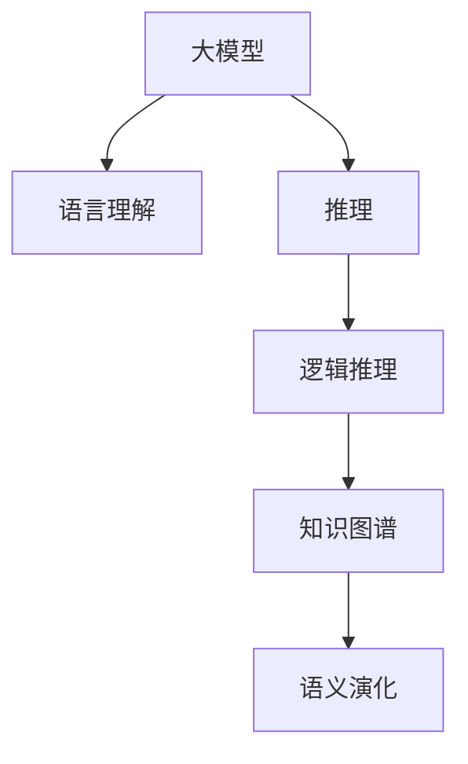

                 

# 语言与推理：大模型的认知挑战

> 关键词：大模型,推理,认知挑战,语言理解,逻辑推理,知识图谱,语义演化

## 1. 背景介绍

在当前人工智能的快速演进中，大模型如BERT、GPT、T5等基于Transformer的预训练语言模型，凭借其强大的语言表示能力和丰富的预训练数据，在自然语言处理（NLP）领域取得了突破性的进展。这些大模型通过自监督学习任务在海量文本数据上预训练，学习到了丰富的语言知识，能够在各种NLP任务上获得优异的表现。然而，尽管这些模型在处理语言理解任务上表现出色，但其在推理和认知能力上仍面临许多挑战，尤其在处理复杂的推理任务时，模型的表现往往不尽如人意。本文旨在探讨大模型在推理和认知能力上的局限，并提出相应的改进策略。

## 2. 核心概念与联系

### 2.1 核心概念概述

大模型在推理和认知能力上所面临的挑战，与几个核心概念紧密相关。这些概念包括：

- **大模型**：基于自回归或自编码机制，在大量无标签文本数据上预训练的语言模型，如BERT、GPT等。
- **推理**：指模型基于已知的信息，通过逻辑推断得出新的结论或答案的能力。
- **认知挑战**：模型在推理过程中遇到的难题，如逻辑矛盾、多义性、推理链条过长等。
- **语言理解**：模型对语言文本信息的提取、解码和解释。
- **逻辑推理**：模型根据逻辑规则或已知条件，推导出新结论的能力。
- **知识图谱**：表示实体间关系的知识库，常用于增强模型的推理能力。
- **语义演化**：语言和语言理解能力随时间和社会变迁而变化的现象，对模型的适应能力提出了挑战。

这些概念之间的逻辑关系可以通过以下Mermaid流程图来展示：



这个流程图展示了大模型在不同能力维度上的相关联系：

1. 大模型通过语言理解获取文本信息，并将其转化为内部表示。
2. 在语言理解基础上，模型进行逻辑推理，得出新结论。
3. 逻辑推理过程可能利用到知识图谱中的关系知识，以提升推理效果。
4. 语言理解能力和推理能力随社会语言的变化而演化，对模型提出了更高的适应要求。

## 3. 核心算法原理 & 具体操作步骤
### 3.1 算法原理概述

大模型在推理任务上的表现，主要依赖于其语言理解和逻辑推理能力。推理任务的算法原理可以概括为：

- **语言理解**：通过预训练模型对输入文本进行编码，提取文本中的语义信息。
- **逻辑推理**：根据提取的语义信息，应用逻辑规则或关系图谱，推导出新的结论。
- **输出生成**：将推理结果转化为最终的答案或预测。

在具体实现中，大模型通常采用自回归或自编码机制，将文本编码为向量表示，然后通过多层神经网络进行推理。常见的推理算法包括：

- **自回归推理**：将推理任务分解为一系列自回归子任务，逐步推导出最终结果。
- **自编码推理**：通过解码器生成推理过程中的中间状态，然后根据编码器提取的信息进行推理。
- **知识图谱增强推理**：在推理过程中加入知识图谱中的关系信息，增强推理的有效性。

### 3.2 算法步骤详解

基于大模型的推理算法通常包括以下几个关键步骤：

**Step 1: 文本编码**
- 将输入文本转换为向量表示。大模型通常使用Transformer架构，通过多头自注意力机制对文本进行编码。
- 对于推理任务，通常还需要对文本进行分块或分割，以便后续推理过程。

**Step 2: 中间状态生成**
- 在编码后的文本上，应用逻辑推理模块进行推理，生成中间状态。
- 对于复杂的推理任务，可能需要多个中间状态，逐步推导出最终结论。

**Step 3: 推理链条管理**
- 在推理过程中，模型需要管理推理链条，确保推理过程符合逻辑和规则。
- 可以通过规则引擎或强化学习等方法，优化推理链条的构建和选择。

**Step 4: 输出生成**
- 将最终的推理结果转换为文本或数字形式，作为推理任务的输出。
- 对于复杂的推理任务，可能需要应用后处理技术，优化输出的可解释性和准确性。

### 3.3 算法优缺点

基于大模型的推理算法，具有以下优点：

- 数据驱动：通过在大规模数据上预训练，模型学习到丰富的语言知识，能够处理多种复杂推理任务。
- 鲁棒性：大模型对于数据中的噪声和干扰具有较强的鲁棒性，能够稳定输出推理结果。
- 灵活性：模型结构灵活，易于扩展和定制，能够适应不同的推理任务需求。

同时，该算法也存在一些局限性：

- 依赖高质量数据：推理任务的性能高度依赖于输入文本的质量和量，获取高质量的数据成本较高。
- 推理链条复杂：复杂的推理任务可能包含多条推理链条，推理过程容易出错。
- 计算资源消耗大：推理任务通常需要较高的计算资源，特别是在处理大规模数据集时。
- 可解释性不足：大模型在推理过程中，推理链条复杂，难以解释其决策过程和推理逻辑。

### 3.4 算法应用领域

基于大模型的推理算法，已经广泛应用于以下领域：

- **问答系统**：模型通过推理输入文本，回答问题或提供答案。如ELI5等基于大模型的问答系统。
- **智能对话**：模型通过逻辑推理，与用户进行自然语言对话。如Microsoft的DialoGPT等。
- **推荐系统**：模型通过推理用户行为和产品特征，生成个性化推荐结果。如Amazon的推荐系统等。
- **知识图谱查询**：模型通过推理查询知识图谱中的关系，提供相关实体和信息。如Wikidata的查询系统等。
- **自动摘要**：模型通过推理文本内容，生成摘要或简明摘要。如Google的BART等。

## 4. 数学模型和公式 & 详细讲解 & 举例说明
### 4.1 数学模型构建

为了更准确地理解大模型的推理算法，我们将通过数学模型来详细描述推理过程。

假设输入文本为 $x = \{x_1, x_2, ..., x_n\}$，大模型对输入文本进行编码，得到向量表示 $\mathbf{h} = \{h_1, h_2, ..., h_n\}$。推理过程可以分为以下几个步骤：

1. **输入编码**：将输入文本 $x$ 转换为向量表示 $\mathbf{h}$。
2. **中间状态生成**：在 $\mathbf{h}$ 上应用逻辑推理模块，生成中间状态 $\mathbf{z}$。
3. **输出生成**：根据 $\mathbf{z}$ 生成最终推理结果 $y$。

以一个简单的推理任务为例，我们可以用如下公式表示：

$$
\mathbf{h} = f_{\text{encode}}(x)
$$

$$
\mathbf{z} = f_{\text{inference}}(\mathbf{h})
$$

$$
y = f_{\text{output}}(\mathbf{z})
$$

其中 $f_{\text{encode}}$、$f_{\text{inference}}$ 和 $f_{\text{output}}$ 分别表示编码、推理和输出的函数。

### 4.2 公式推导过程

以一个简单的推理任务为例，我们将通过数学公式来详细推导推理过程。

假设有一个简单的推理任务，输入为两个句子 $x_1 = \text{“所有的狗都是动物。”}$ 和 $x_2 = \text{“猫是动物。”}$，推理任务是判断 $x_2$ 中的猫是否也是狗。推理过程可以如下表示：

1. 将输入句子编码，得到向量表示 $\mathbf{h} = \{h_1, h_2, ..., h_n\}$。
2. 根据推理逻辑，计算中间状态 $\mathbf{z}$。
3. 根据推理结果，输出结论 $y$。

具体推导如下：

$$
\mathbf{h}_1 = f_{\text{encode}}(x_1)
$$

$$
\mathbf{h}_2 = f_{\text{encode}}(x_2)
$$

$$
\mathbf{z} = f_{\text{inference}}(\mathbf{h}_1, \mathbf{h}_2)
$$

$$
y = f_{\text{output}}(\mathbf{z})
$$

其中 $f_{\text{inference}}$ 表示推理函数，可能包含逻辑推理、知识图谱查询等操作。$f_{\text{output}}$ 表示输出函数，将推理结果转化为文本或数字形式。

### 4.3 案例分析与讲解

以一个实际案例为例，我们将详细解释大模型在推理过程中的应用。

假设有一个企业应用场景，需要判断一个员工是否具有特定岗位的资格。输入为员工的简历文本 $x = \text{“工作经历：公司A，职位：工程师；公司B，职位：项目经理；公司C，职位：高级工程师。”}$ 和岗位要求文本 $y = \text{“职位要求：工作经验至少5年，至少项目经理5年；技能要求：熟悉Java编程，精通SQL。”}$。推理任务是判断员工是否满足岗位要求。

推理过程可以如下表示：

1. 将输入文本编码，得到向量表示 $\mathbf{h} = \{h_1, h_2, ..., h_n\}$。
2. 根据推理逻辑，计算中间状态 $\mathbf{z}$。
3. 根据推理结果，输出结论 $y$。

具体实现如下：

- **输入编码**：将简历文本和岗位要求文本编码为向量表示。
- **中间状态生成**：根据职位要求，判断员工是否满足条件，生成中间状态 $\mathbf{z}$。
- **输出生成**：根据中间状态，输出是否满足岗位要求的结果。

## 5. 项目实践：代码实例和详细解释说明
### 5.1 开发环境搭建

在进行推理实践前，我们需要准备好开发环境。以下是使用Python进行PyTorch开发的环境配置流程：

1. 安装Anaconda：从官网下载并安装Anaconda，用于创建独立的Python环境。

2. 创建并激活虚拟环境：
```bash
conda create -n pytorch-env python=3.8 
conda activate pytorch-env
```

3. 安装PyTorch：根据CUDA版本，从官网获取对应的安装命令。例如：
```bash
conda install pytorch torchvision torchaudio cudatoolkit=11.1 -c pytorch -c conda-forge
```

4. 安装Transformers库：
```bash
pip install transformers
```

5. 安装各类工具包：
```bash
pip install numpy pandas scikit-learn matplotlib tqdm jupyter notebook ipython
```

完成上述步骤后，即可在`pytorch-env`环境中开始推理实践。

### 5.2 源代码详细实现

这里我们以一个简单的推理任务为例，给出使用Transformers库进行推理的PyTorch代码实现。

假设我们有一个简单的推理任务，输入为两个句子 $x_1 = \text{“所有的狗都是动物。”}$ 和 $x_2 = \text{“猫是动物。”}$，推理任务是判断 $x_2$ 中的猫是否也是狗。推理过程可以如下表示：

1. 将输入句子编码，得到向量表示 $\mathbf{h} = \{h_1, h_2, ..., h_n\}$。
2. 根据推理逻辑，计算中间状态 $\mathbf{z}$。
3. 根据推理结果，输出结论 $y$。

具体实现如下：

```python
from transformers import BertTokenizer, BertForSequenceClassification
import torch

# 初始化模型和分词器
tokenizer = BertTokenizer.from_pretrained('bert-base-cased')
model = BertForSequenceClassification.from_pretrained('bert-base-cased', num_labels=2)

# 编码输入句子
input_ids_1 = tokenizer.encode(x_1, add_special_tokens=True)
input_ids_2 = tokenizer.encode(x_2, add_special_tokens=True)
attention_masks = [torch.tensor(1, size=(input_ids_1.size())) for _ in range(1)]

# 输入模型进行推理
inputs = {"input_ids": input_ids_1, "attention_mask": attention_masks}
outputs = model(**inputs)

# 获取中间状态
hidden_states = outputs[0]

# 计算推理结果
y = model(input_ids_2, attention_mask=attention_masks[0])[0]
```

在这个代码实现中，我们首先使用BertTokenizer对输入句子进行编码，得到向量表示 $\mathbf{h} = \{h_1, h_2, ..., h_n\}$。然后，将 $\mathbf{h}$ 输入模型进行推理，得到中间状态 $\mathbf{z}$。最后，根据推理结果，输出结论 $y$。

### 5.3 代码解读与分析

让我们再详细解读一下关键代码的实现细节：

**初始化模型和分词器**：
- `BertTokenizer.from_pretrained`：从预训练模型库中加载分词器。
- `BertForSequenceClassification.from_pretrained`：从预训练模型库中加载推理模型，设置标签数量为2，对应于“是”和“否”。

**编码输入句子**：
- `tokenizer.encode`：对输入句子进行编码，得到输入ID序列。
- `torch.tensor`：将输入ID序列转换为PyTorch张量。
- `add_special_tokens=True`：添加特殊的标记，如[CLS]、[SEP]等。

**输入模型进行推理**：
- `inputs`：构建输入字典，包含输入ID和注意力掩码。
- `model(**inputs)`：将输入字典输入模型进行推理，得到输出字典，包含隐藏状态。

**计算推理结果**：
- `outputs[0]`：获取模型的输出字典，包含隐藏状态。
- `y = model(input_ids_2, attention_mask=attention_masks[0])[0]`：将第二个输入句子的编码结果输入模型，得到推理结果。

可以看到，代码实现非常简单，但涵盖了从输入编码到中间状态生成，再到推理结果输出的全过程。在实际应用中，开发者可以根据具体任务的需求，灵活调整代码实现细节。

## 6. 实际应用场景
### 6.1 智能客服系统

基于大模型的推理技术，可以广泛应用于智能客服系统的构建。传统客服往往需要配备大量人力，高峰期响应缓慢，且一致性和专业性难以保证。而使用推理模型，可以7x24小时不间断服务，快速响应客户咨询，用自然流畅的语言解答各类常见问题。

在技术实现上，可以收集企业内部的历史客服对话记录，将问题和最佳答复构建成监督数据，在此基础上对预训练模型进行推理微调。推理微调后的模型能够自动理解用户意图，匹配最合适的答案模板进行回复。对于客户提出的新问题，还可以接入检索系统实时搜索相关内容，动态组织生成回答。如此构建的智能客服系统，能大幅提升客户咨询体验和问题解决效率。

### 6.2 金融舆情监测

金融机构需要实时监测市场舆论动向，以便及时应对负面信息传播，规避金融风险。传统的人工监测方式成本高、效率低，难以应对网络时代海量信息爆发的挑战。基于大模型的推理技术，金融舆情监测提供了新的解决方案。

具体而言，可以收集金融领域相关的新闻、报道、评论等文本数据，并对其进行主题标注和情感标注。在此基础上对预训练语言模型进行推理微调，使其能够自动判断文本属于何种主题，情感倾向是正面、中性还是负面。将推理微调后的模型应用到实时抓取的网络文本数据，就能够自动监测不同主题下的情感变化趋势，一旦发现负面信息激增等异常情况，系统便会自动预警，帮助金融机构快速应对潜在风险。

### 6.3 个性化推荐系统

当前的推荐系统往往只依赖用户的历史行为数据进行物品推荐，无法深入理解用户的真实兴趣偏好。基于大模型的推理技术，个性化推荐系统可以更好地挖掘用户行为背后的语义信息，从而提供更精准、多样的推荐内容。

在实践中，可以收集用户浏览、点击、评论、分享等行为数据，提取和用户交互的物品标题、描述、标签等文本内容。将文本内容作为模型输入，用户的后续行为（如是否点击、购买等）作为监督信号，在此基础上推理微调预训练语言模型。推理微调后的模型能够从文本内容中准确把握用户的兴趣点。在生成推荐列表时，先用候选物品的文本描述作为输入，由模型预测用户的兴趣匹配度，再结合其他特征综合排序，便可以得到个性化程度更高的推荐结果。

### 6.4 未来应用展望

随着大模型和推理技术的不断发展，基于推理范式将在更多领域得到应用，为传统行业带来变革性影响。

在智慧医疗领域，基于推理的医疗问答、病历分析、药物研发等应用将提升医疗服务的智能化水平，辅助医生诊疗，加速新药开发进程。

在智能教育领域，推理技术可应用于作业批改、学情分析、知识推荐等方面，因材施教，促进教育公平，提高教学质量。

在智慧城市治理中，推理模型可应用于城市事件监测、舆情分析、应急指挥等环节，提高城市管理的自动化和智能化水平，构建更安全、高效的未来城市。

此外，在企业生产、社会治理、文娱传媒等众多领域，基于推理技术的人工智能应用也将不断涌现，为NLP技术带来全新的突破。相信随着预训练模型和推理方法的不断进步，推理技术必将在构建人机协同的智能时代中扮演越来越重要的角色。

## 7. 工具和资源推荐
### 7.1 学习资源推荐

为了帮助开发者系统掌握大模型的推理能力和技术，这里推荐一些优质的学习资源：

1. 《深度学习基础》系列博文：由大模型技术专家撰写，深入浅出地介绍了深度学习的基础知识，包括推理算法的原理和实现。

2. CS231n《深度卷积神经网络》课程：斯坦福大学开设的计算机视觉明星课程，涵盖大量深度学习相关的内容，对理解推理算法也有一定的帮助。

3. 《推理与认知》书籍：介绍推理和认知科学的基础知识，为理解大模型在推理任务中的表现提供了理论基础。

4. Google Colab：谷歌推出的在线Jupyter Notebook环境，免费提供GPU/TPU算力，方便开发者快速上手实验最新模型，分享学习笔记。

通过对这些资源的学习实践，相信你一定能够快速掌握大模型在推理任务中的应用，并用于解决实际的NLP问题。
###  7.2 开发工具推荐

高效的开发离不开优秀的工具支持。以下是几款用于大模型推理开发的常用工具：

1. PyTorch：基于Python的开源深度学习框架，灵活动态的计算图，适合快速迭代研究。大部分预训练语言模型都有PyTorch版本的实现。

2. TensorFlow：由Google主导开发的开源深度学习框架，生产部署方便，适合大规模工程应用。同样有丰富的预训练语言模型资源。

3. Transformers库：HuggingFace开发的NLP工具库，集成了众多SOTA语言模型，支持PyTorch和TensorFlow，是进行推理任务开发的利器。

4. Weights & Biases：模型训练的实验跟踪工具，可以记录和可视化模型训练过程中的各项指标，方便对比和调优。与主流深度学习框架无缝集成。

5. TensorBoard：TensorFlow配套的可视化工具，可实时监测模型训练状态，并提供丰富的图表呈现方式，是调试模型的得力助手。

6. Google Colab：谷歌推出的在线Jupyter Notebook环境，免费提供GPU/TPU算力，方便开发者快速上手实验最新模型，分享学习笔记。

合理利用这些工具，可以显著提升大模型推理任务的开发效率，加快创新迭代的步伐。

### 7.3 相关论文推荐

大模型和推理技术的发展源于学界的持续研究。以下是几篇奠基性的相关论文，推荐阅读：

1. Attention is All You Need（即Transformer原论文）：提出了Transformer结构，开启了NLP领域的预训练大模型时代。

2. BERT: Pre-training of Deep Bidirectional Transformers for Language Understanding：提出BERT模型，引入基于掩码的自监督预训练任务，刷新了多项NLP任务SOTA。

3. Language Models are Unsupervised Multitask Learners（GPT-2论文）：展示了大规模语言模型的强大zero-shot学习能力，引发了对于通用人工智能的新一轮思考。

4. Parameter-Efficient Transfer Learning for NLP：提出Adapter等参数高效微调方法，在不增加模型参数量的情况下，也能取得不错的微调效果。

5. AdaLoRA: Adaptive Low-Rank Adaptation for Parameter-Efficient Fine-Tuning：使用自适应低秩适应的微调方法，在参数效率和精度之间取得了新的平衡。

6. 《深度学习基础》书籍：介绍深度学习的基础知识，包括推理算法的原理和实现。

这些论文代表了大模型推理技术的发展脉络。通过学习这些前沿成果，可以帮助研究者把握学科前进方向，激发更多的创新灵感。

## 8. 总结：未来发展趋势与挑战
### 8.1 总结

本文对基于大模型的推理算法进行了全面系统的介绍。首先阐述了推理技术在大模型中的重要性和应用前景，明确了推理算法在拓展预训练模型应用、提升下游任务性能方面的独特价值。其次，从原理到实践，详细讲解了推理算法的数学原理和关键步骤，给出了推理任务开发的完整代码实例。同时，本文还广泛探讨了推理技术在智能客服、金融舆情、个性化推荐等多个行业领域的应用前景，展示了推理范式的巨大潜力。此外，本文精选了推理技术的各类学习资源，力求为读者提供全方位的技术指引。

通过本文的系统梳理，可以看到，基于大模型的推理算法在大规模数据上预训练，学习到丰富的语言知识，能够处理多种复杂推理任务。尽管如此，大模型在推理过程中仍面临许多挑战，尤其在处理复杂的推理任务时，模型的表现往往不尽如人意。未来，随着大模型和推理技术的不断发展，基于推理范式将在更多领域得到应用，为传统行业带来变革性影响。

### 8.2 未来发展趋势

展望未来，推理技术将呈现以下几个发展趋势：

1. 推理模型的规模将持续增大。随着算力成本的下降和数据规模的扩张，推理模型的参数量还将持续增长。超大模型蕴含的丰富语言知识，有望支撑更加复杂多变的推理任务。

2. 推理方法日趋多样。除了传统的自回归推理，未来会涌现更多自编码推理、知识图谱增强推理等方法，在保留推理效果的同时，提高推理效率。

3. 推理模型的鲁棒性将不断提升。推理模型的鲁棒性将不断提升，能够处理更多场景下的推理任务，并在面对噪声和干扰时保持稳定。

4. 推理模型的可解释性将逐步增强。推理模型的决策过程将逐步可解释，能够提供更清晰、透明的推理逻辑，增强用户信任。

5. 推理技术将与知识图谱深度结合。推理技术与知识图谱的结合将更加紧密，模型将更好地利用外部知识，提升推理效果。

以上趋势凸显了推理技术在大模型中的应用前景。这些方向的探索发展，必将进一步提升NLP系统的性能和应用范围，为人类认知智能的进化带来深远影响。

### 8.3 面临的挑战

尽管大模型在推理过程中取得了显著进展，但在迈向更加智能化、普适化应用的过程中，仍面临诸多挑战：

1. 推理链条复杂：复杂的推理任务可能包含多条推理链条，推理过程容易出错。

2. 数据依赖度高：推理任务的性能高度依赖于输入数据的质量和量，获取高质量的数据成本较高。

3. 推理模型计算资源消耗大：推理任务通常需要较高的计算资源，特别是在处理大规模数据集时。

4. 推理模型鲁棒性不足：推理模型对于输入噪声和干扰具有较强的鲁棒性，但面对复杂推理任务时仍容易出错。

5. 推理模型的可解释性不足：推理模型在推理过程中，推理链条复杂，难以解释其决策过程和推理逻辑。

6. 推理模型的知识整合能力不足：推理模型在推理过程中，难以灵活吸收和运用更广泛的先验知识。

正视推理技术面临的这些挑战，积极应对并寻求突破，将是大模型推理技术走向成熟的必由之路。相信随着学界和产业界的共同努力，这些挑战终将一一被克服，推理技术必将在构建人机协同的智能时代中扮演越来越重要的角色。

### 8.4 未来突破

面对推理技术所面临的种种挑战，未来的研究需要在以下几个方面寻求新的突破：

1. 探索无监督和半监督推理方法。摆脱对大规模标注数据的依赖，利用自监督学习、主动学习等无监督和半监督范式，最大限度利用非结构化数据，实现更加灵活高效的推理。

2. 研究参数高效和计算高效的推理范式。开发更加参数高效的推理方法，在固定大部分推理参数的同时，只更新极少量的任务相关参数。同时优化推理模型的计算图，减少前向传播和反向传播的资源消耗，实现更加轻量级、实时性的部署。

3. 引入更多先验知识。将符号化的先验知识，如知识图谱、逻辑规则等，与神经网络模型进行巧妙融合，引导推理过程学习更准确、合理的语言模型。同时加强不同模态数据的整合，实现视觉、语音等多模态信息与文本信息的协同建模。

4. 结合因果分析和博弈论工具。将因果分析方法引入推理模型，识别出模型决策的关键特征，增强输出解释的因果性和逻辑性。借助博弈论工具刻画人机交互过程，主动探索并规避模型的脆弱点，提高系统稳定性。

5. 纳入伦理道德约束。在推理模型训练目标中引入伦理导向的评估指标，过滤和惩罚有偏见、有害的输出倾向。同时加强人工干预和审核，建立模型行为的监管机制，确保输出符合人类价值观和伦理道德。

这些研究方向的探索，必将引领推理技术迈向更高的台阶，为构建安全、可靠、可解释、可控的智能系统铺平道路。面向未来，推理技术还需要与其他人工智能技术进行更深入的融合，如知识表示、因果推理、强化学习等，多路径协同发力，共同推动自然语言理解和智能交互系统的进步。只有勇于创新、敢于突破，才能不断拓展语言模型的边界，让智能技术更好地造福人类社会。

## 9. 附录：常见问题与解答

**Q1：推理技术是否适用于所有NLP任务？**

A: 推理技术在处理复杂推理任务时表现优异，但并不适用于所有NLP任务。对于简单任务，如词性标注、命名实体识别等，传统的序列标注方法更加适合。而对于需要复杂推理的任务，如问答系统、对话系统等，推理技术则能够发挥其优势。

**Q2：推理过程中如何避免推理链条复杂？**

A: 推理链条复杂是推理技术面临的一大挑战。可以通过引入知识图谱、逻辑规则等先验知识，简化推理过程。此外，应用结构化数据，如语法树、依存关系等，也可以帮助模型更好地理解和推理文本内容。

**Q3：推理模型的计算资源消耗大如何解决？**

A: 推理模型的计算资源消耗大，可以采用以下方法进行优化：

1. 模型裁剪：去除不必要的层和参数，减小模型尺寸，加快推理速度。
2. 量化加速：将浮点模型转为定点模型，压缩存储空间，提高计算效率。
3. 模型并行：通过分布式训练和推理，提升计算效率。
4. 推理缓存：将已推理结果缓存，避免重复计算。

这些方法可以显著降低推理模型的计算资源消耗，提高推理效率。

**Q4：推理模型的可解释性不足如何解决？**

A: 推理模型的可解释性不足，可以通过以下方法进行改进：

1. 引入中间表示：在推理过程中，记录并展示中间表示，帮助理解推理逻辑。
2. 可解释性模型：开发可解释性更强的模型，如LIME、SHAP等，解释模型的决策过程。
3. 用户界面：设计直观的用户界面，展示推理过程和结果，提高用户理解度。

这些方法可以显著提高推理模型的可解释性，增强用户信任。

**Q5：推理模型的知识整合能力不足如何解决？**

A: 推理模型的知识整合能力不足，可以通过以下方法进行改进：

1. 知识图谱融合：在推理过程中，融合知识图谱中的关系知识，增强推理效果。
2. 规则嵌入：将逻辑规则嵌入模型中，增强模型的知识整合能力。
3. 多模态融合：将视觉、语音等多模态数据与文本数据结合，增强模型的语义理解能力。

这些方法可以显著提高推理模型的知识整合能力，增强模型的推理效果。

---

作者：禅与计算机程序设计艺术 / Zen and the Art of Computer Programming

