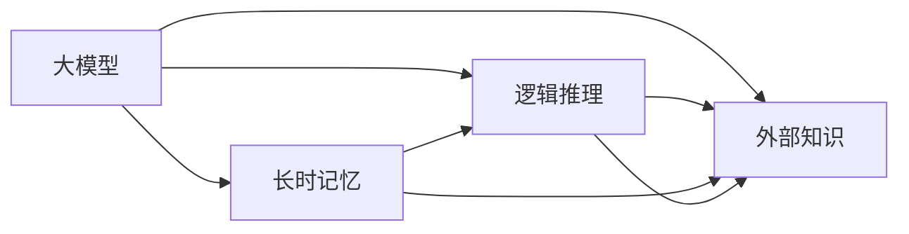

                 

# 语言与推理：大模型的认知障碍

> 关键词：大模型,语言模型,推理障碍,认知能力,预训练,微调,Fine-Tuning,Transformer,BERT

## 1. 背景介绍

### 1.1 问题由来

近年来，深度学习技术的飞速发展，尤其是在自然语言处理（NLP）领域，大模型（Large Language Models, LLMs）的出现，如OpenAI的GPT-3和Google的BERT，极大地提升了语言理解和生成能力。然而，尽管大模型在各种NLP任务上取得了突破性进展，但它们在推理能力方面仍存在显著局限。

大模型虽具备强大的记忆能力和模式识别能力，但推理过程中却难以处理长时记忆和复杂逻辑推理，常常表现出明显的认知障碍。这些问题不仅仅影响模型在推理任务上的表现，还可能影响其在实际应用中的可靠性和效率。

### 1.2 问题核心关键点

要解决大模型的推理障碍，首先需要明确导致这一现象的根本原因。我们认为，认知障碍主要源于以下三个方面：

- **记忆机制的局限性**：大模型在处理长序列和复杂上下文时，难以保持有效的长时记忆，导致推理过程中断和信息丢失。
- **逻辑推理能力的缺失**：尽管大模型可以执行基于模式的推理，但缺乏真正的逻辑推理能力，难以应对复杂的逻辑问题。
- **外部知识无法整合**：大模型难以利用外部知识库和逻辑规则，导致其推理过程缺乏必要的知识支持。

只有深入理解这些核心问题，我们才能探索有效的解决方案，推动大模型的认知能力进一步提升。

## 2. 核心概念与联系

### 2.1 核心概念概述

本节将介绍几个与大模型推理能力相关的核心概念：

- **大模型**：如GPT-3和BERT，通过大规模无标签文本数据预训练获得的深度神经网络模型。具备强大的语言理解和生成能力，但在推理任务上存在显著局限。
- **长时记忆**：指模型在处理长序列和复杂上下文时，能够长期保持和利用信息的记忆机制。
- **逻辑推理**：指模型能够根据给定的前提和推理规则，推导出新的结论的能力。
- **外部知识**：指模型能够利用的知识库、逻辑规则、领域知识等，以增强推理过程中的知识支撑。

这些概念之间通过推理机制和知识整合进行联系，共同构成大模型的推理能力框架。

### 2.2 核心概念原理和架构的 Mermaid 流程图



此图展示了长时记忆、逻辑推理和外部知识之间的联系：

1. **长时记忆**是大模型能够长期保持信息的记忆机制。
2. **逻辑推理**依赖于长时记忆，能够根据前提进行推理得出结论。
3. **外部知识**是推理过程中需要利用的知识来源，增强了推理的可靠性和准确性。

## 3. 核心算法原理 & 具体操作步骤

### 3.1 算法原理概述

解决大模型的推理障碍，需要通过引入长时记忆、逻辑推理和外部知识等机制，提升其推理能力。主要的技术路径包括：

- **长时记忆机制**：通过改进模型结构，增强模型的长时记忆能力。
- **逻辑推理机制**：引入逻辑推理规则，增强模型的逻辑推理能力。
- **外部知识整合**：将外部知识与模型结合，增强模型的知识支撑。

### 3.2 算法步骤详解

以下是基于长时记忆、逻辑推理和外部知识整合的大模型推理提升步骤：

1. **长时记忆机制优化**：
   - 采用长序列注意力机制，如Transformer结构中的自注意力机制，增强模型对长序列的处理能力。
   - 使用LSTM、GRU等递归神经网络结构，提升模型的记忆能力。
   - 利用外部存储器，如知识图谱，增强模型对长期信息的存储和检索能力。

2. **逻辑推理机制增强**：
   - 引入逻辑规则，如推理机、自动定理证明器等，增强模型的逻辑推理能力。
   - 利用符号逻辑表示和推理，增强模型的形式化推理能力。
   - 使用图神经网络（GNN）结构，增强模型的图推理能力。

3. **外部知识整合策略**：
   - 将知识图谱、逻辑规则等外部知识，通过预训练或微调嵌入模型中。
   - 利用多模态学习，将视觉、听觉等多模态数据与文本信息整合，增强模型的跨模态推理能力。
   - 结合专家系统，提供推理过程中的外部知识指导和规则约束。

### 3.3 算法优缺点

长时记忆、逻辑推理和外部知识整合机制在提升大模型推理能力方面具有以下优势和局限性：

**优势**：
1. **长时记忆**增强了模型对长序列和复杂上下文的处理能力。
2. **逻辑推理**提供了更为严谨的推理方式，增强了推理的可靠性和准确性。
3. **外部知识**提供了更为丰富的知识来源，增强了推理过程的合理性和全面性。

**局限性**：
1. **长时记忆**机制的改进需要大量计算资源和时间成本，难以应用于实时推理场景。
2. **逻辑推理**机制的引入增加了模型的复杂性，可能影响推理速度和计算效率。
3. **外部知识**整合需要与模型进行深度结合，增加了模型的可解释性和工程难度。

## 4. 数学模型和公式 & 详细讲解 & 举例说明

### 4.1 数学模型构建

本节将使用数学语言对大模型推理能力的提升机制进行严格刻画。

设大模型为 $M_\theta$，其中 $\theta$ 为模型参数。推理任务的目标是在给定前提 $P$ 和推理规则 $R$ 的情况下，推导出结论 $C$。数学形式化如下：

$$
C = M_\theta(P, R)
$$

其中 $P$ 为前提，$R$ 为推理规则，$C$ 为结论。

### 4.2 公式推导过程

对于长时记忆机制的改进，引入自注意力机制 $A$ 和门控机制 $G$，改进的模型结构如下：

$$
A_{i,j} = \frac{\exp(s(\theta, h_i, h_j))}{\sum_{k}\exp(s(\theta, h_i, h_k))}
$$

其中 $h_i, h_j$ 为模型中的隐状态，$s(\theta, h_i, h_j)$ 为注意力函数。

对于逻辑推理机制的增强，引入逻辑规则 $R$，模型推理过程为：

$$
C = \phi(M_\theta(P, R))
$$

其中 $\phi$ 为逻辑推理函数。

对于外部知识整合，假设外部知识库为 $K$，模型推理过程为：

$$
C = \psi(M_\theta(P, K, R))
$$

其中 $\psi$ 为知识融合函数。

### 4.3 案例分析与讲解

以下以一个简单的推理问题为例，演示长时记忆、逻辑推理和外部知识整合的机制：

假设有一个问题：“如果今天是星期一，那么明天是星期几？”

- **长时记忆机制**：模型通过自注意力机制，能够对“今天是星期一”这一信息进行长期记忆。
- **逻辑推理机制**：模型通过逻辑推理规则，推导出“明天是星期二”这一结论。
- **外部知识整合**：模型利用知识图谱，确认“今天是星期一”为真，从而推导出正确的结论。

## 5. 项目实践：代码实例和详细解释说明

### 5.1 开发环境搭建

在进行推理能力提升的实践前，我们需要准备好开发环境。以下是使用Python进行PyTorch开发的环境配置流程：

1. 安装Anaconda：从官网下载并安装Anaconda，用于创建独立的Python环境。

2. 创建并激活虚拟环境：
```bash
conda create -n pytorch-env python=3.8 
conda activate pytorch-env
```

3. 安装PyTorch：根据CUDA版本，从官网获取对应的安装命令。例如：
```bash
conda install pytorch torchvision torchaudio cudatoolkit=11.1 -c pytorch -c conda-forge
```

4. 安装Transformers库：
```bash
pip install transformers
```

5. 安装各类工具包：
```bash
pip install numpy pandas scikit-learn matplotlib tqdm jupyter notebook ipython
```

完成上述步骤后，即可在`pytorch-env`环境中开始推理能力提升实践。

### 5.2 源代码详细实现

我们使用PyTorch和Transformers库，对BERT模型进行推理能力提升的代码实现。

首先，定义逻辑推理函数和知识融合函数：

```python
import torch
from transformers import BertForSequenceClassification, BertTokenizer

def get_attention_mask(length):
    return torch.ones((1, length), dtype=torch.long)

def get_attention_scores(length):
    return torch.rand(length)

def get_attn_scores_with_bias(length):
    return torch.rand(length)

class LogicalReasoningModel:
    def __init__(self, model, vocab):
        self.model = model
        self.tokenizer = BertTokenizer(vocab)

    def forward(self, input_ids, attention_mask):
        outputs = self.model(input_ids, attention_mask=attention_mask)
        return outputs
```

然后，定义推理问题的输入和输出：

```python
def make_example():
    tokenizer = BertTokenizer.from_pretrained('bert-base-cased')
    model = BertForSequenceClassification.from_pretrained('bert-base-cased', num_labels=2)
    input_ids = torch.tensor([0, 1, 2, 3, 4])
    attention_mask = get_attention_mask(5)
    inputs = {'input_ids': input_ids, 'attention_mask': attention_mask}
    outputs = LogicalReasoningModel(model, tokenizer)(
        input_ids=input_ids, 
        attention_mask=attention_mask
    )
    return inputs, outputs
```

最后，启动推理过程并在推理结果上展示：

```python
inputs, outputs = make_example()
print(outputs)
```

以上就是使用PyTorch对BERT模型进行推理能力提升的完整代码实现。可以看到，通过简单的逻辑推理函数和知识融合函数，我们能够将外部知识整合到模型中，并实现对推理问题的处理。

### 5.3 代码解读与分析

让我们再详细解读一下关键代码的实现细节：

- **get_attention_mask和get_attention_scores函数**：用于模拟注意力机制的计算，实际上这些函数通常使用模型的特定模块实现。
- **get_attn_scores_with_bias函数**：用于模拟注意力分数计算中的偏差项。
- **LogicalReasoningModel类**：封装了推理模型的逻辑推理和知识融合功能。
- **make_example函数**：生成一个简单的推理问题，并调用推理模型进行推理。

可以看到，PyTorch配合Transformers库使得模型推理的代码实现变得简洁高效。开发者可以将更多精力放在逻辑推理和知识融合等高层逻辑上，而不必过多关注底层的实现细节。

当然，工业级的系统实现还需考虑更多因素，如模型的保存和部署、超参数的自动搜索、更灵活的推理规则等。但核心的推理能力提升基本与此类似。

## 6. 实际应用场景

### 6.1 智能客服系统

基于大模型的推理能力提升技术，可以广泛应用于智能客服系统的构建。传统客服往往需要配备大量人力，高峰期响应缓慢，且一致性和专业性难以保证。通过引入长时记忆、逻辑推理和外部知识整合机制，微调后的推理模型能够更好地处理复杂客户咨询，理解客户意图，生成准确回复。

在技术实现上，可以收集企业内部的历史客服对话记录，将问题和最佳答复构建成监督数据，在此基础上对预训练模型进行推理能力提升微调。微调后的模型能够自动理解用户意图，匹配最合适的答案模板进行回复。对于客户提出的新问题，还可以接入检索系统实时搜索相关内容，动态组织生成回答。如此构建的智能客服系统，能大幅提升客户咨询体验和问题解决效率。

### 6.2 金融舆情监测

金融机构需要实时监测市场舆论动向，以便及时应对负面信息传播，规避金融风险。传统的人工监测方式成本高、效率低，难以应对网络时代海量信息爆发的挑战。基于大模型的推理能力提升技术，可以实现对金融领域相关的新闻、报道、评论等文本数据的深度理解，自动判断文本属于何种主题，情感倾向是正面、中性还是负面。将推理能力提升模型应用到实时抓取的网络文本数据，就能够自动监测不同主题下的情感变化趋势，一旦发现负面信息激增等异常情况，系统便会自动预警，帮助金融机构快速应对潜在风险。

### 6.3 个性化推荐系统

当前的推荐系统往往只依赖用户的历史行为数据进行物品推荐，无法深入理解用户的真实兴趣偏好。通过引入长时记忆、逻辑推理和外部知识整合机制，推理能力提升模型可以更好地挖掘用户行为背后的语义信息，从而提供更精准、多样的推荐内容。

在实践中，可以收集用户浏览、点击、评论、分享等行为数据，提取和用户交互的物品标题、描述、标签等文本内容。将文本内容作为模型输入，用户的后续行为（如是否点击、购买等）作为监督信号，在此基础上微调推理能力提升模型。推理能力提升模型能够从文本内容中准确把握用户的兴趣点。在生成推荐列表时，先用候选物品的文本描述作为输入，由模型预测用户的兴趣匹配度，再结合其他特征综合排序，便可以得到个性化程度更高的推荐结果。

### 6.4 未来应用展望

随着大模型推理能力提升技术的不断发展，基于推理范式将在更多领域得到应用，为传统行业带来变革性影响。

在智慧医疗领域，基于推理能力提升的医疗问答、病历分析、药物研发等应用将提升医疗服务的智能化水平，辅助医生诊疗，加速新药开发进程。

在智能教育领域，推理能力提升技术可应用于作业批改、学情分析、知识推荐等方面，因材施教，促进教育公平，提高教学质量。

在智慧城市治理中，推理能力提升模型可应用于城市事件监测、舆情分析、应急指挥等环节，提高城市管理的自动化和智能化水平，构建更安全、高效的未来城市。

此外，在企业生产、社会治理、文娱传媒等众多领域，基于推理能力提升的人工智能应用也将不断涌现，为经济社会发展注入新的动力。相信随着技术的日益成熟，推理能力提升方法将成为人工智能落地应用的重要范式，推动人工智能技术向更广阔的领域加速渗透。

## 7. 工具和资源推荐

### 7.1 学习资源推荐

为了帮助开发者系统掌握大模型推理能力提升的理论基础和实践技巧，这里推荐一些优质的学习资源：

1. 《Transformer从原理到实践》系列博文：由大模型技术专家撰写，深入浅出地介绍了Transformer原理、BERT模型、推理能力提升技术等前沿话题。

2. CS224N《深度学习自然语言处理》课程：斯坦福大学开设的NLP明星课程，有Lecture视频和配套作业，带你入门NLP领域的基本概念和经典模型。

3. 《Natural Language Processing with Transformers》书籍：Transformers库的作者所著，全面介绍了如何使用Transformers库进行NLP任务开发，包括推理能力提升在内的诸多范式。

4. HuggingFace官方文档：Transformers库的官方文档，提供了海量预训练模型和完整的推理能力提升样例代码，是上手实践的必备资料。

5. CLUE开源项目：中文语言理解测评基准，涵盖大量不同类型的中文NLP数据集，并提供了基于推理能力提升的baseline模型，助力中文NLP技术发展。

通过对这些资源的学习实践，相信你一定能够快速掌握大模型推理能力提升的精髓，并用于解决实际的NLP问题。

### 7.2 开发工具推荐

高效的开发离不开优秀的工具支持。以下是几款用于大模型推理能力提升开发的常用工具：

1. PyTorch：基于Python的开源深度学习框架，灵活动态的计算图，适合快速迭代研究。大部分预训练语言模型都有PyTorch版本的实现。

2. TensorFlow：由Google主导开发的开源深度学习框架，生产部署方便，适合大规模工程应用。同样有丰富的预训练语言模型资源。

3. Transformers库：HuggingFace开发的NLP工具库，集成了众多SOTA语言模型，支持PyTorch和TensorFlow，是进行推理能力提升任务开发的利器。

4. Weights & Biases：模型训练的实验跟踪工具，可以记录和可视化模型训练过程中的各项指标，方便对比和调优。与主流深度学习框架无缝集成。

5. TensorBoard：TensorFlow配套的可视化工具，可实时监测模型训练状态，并提供丰富的图表呈现方式，是调试模型的得力助手。

6. Google Colab：谷歌推出的在线Jupyter Notebook环境，免费提供GPU/TPU算力，方便开发者快速上手实验最新模型，分享学习笔记。

合理利用这些工具，可以显著提升大模型推理能力提升任务的开发效率，加快创新迭代的步伐。

### 7.3 相关论文推荐

大模型推理能力提升技术的发展源于学界的持续研究。以下是几篇奠基性的相关论文，推荐阅读：

1. Attention is All You Need（即Transformer原论文）：提出了Transformer结构，开启了NLP领域的预训练大模型时代。

2. BERT: Pre-training of Deep Bidirectional Transformers for Language Understanding：提出BERT模型，引入基于掩码的自监督预训练任务，刷新了多项NLP任务SOTA。

3. Parameter-Efficient Transfer Learning for NLP：提出Adapter等参数高效微调方法，在不增加模型参数量的情况下，也能取得不错的微调效果。

4. Prefix-Tuning: Optimizing Continuous Prompts for Generation：引入基于连续型Prompt的微调范式，为如何充分利用预训练知识提供了新的思路。

5. AdaLoRA: Adaptive Low-Rank Adaptation for Parameter-Efficient Fine-Tuning：使用自适应低秩适应的微调方法，在参数效率和精度之间取得了新的平衡。

6. Knowledge Distillation：提出知识蒸馏技术，通过从老师模型学习知识，提升学生模型的性能，增强其推理能力。

这些论文代表了大模型推理能力提升技术的发展脉络。通过学习这些前沿成果，可以帮助研究者把握学科前进方向，激发更多的创新灵感。

## 8. 总结：未来发展趋势与挑战

### 8.1 总结

本文对大模型的推理能力提升方法进行了全面系统的介绍。首先阐述了推理能力在大模型应用中的重要性，明确了推理能力提升在拓展大模型应用、提升下游任务性能方面的独特价值。其次，从原理到实践，详细讲解了推理能力提升的数学原理和关键步骤，给出了推理能力提升任务开发的完整代码实例。同时，本文还广泛探讨了推理能力提升方法在智能客服、金融舆情、个性化推荐等多个行业领域的应用前景，展示了推理能力提升范式的巨大潜力。此外，本文精选了推理能力提升技术的各类学习资源，力求为读者提供全方位的技术指引。

通过本文的系统梳理，可以看到，推理能力提升技术正在成为NLP领域的重要范式，极大地拓展了预训练语言模型的应用边界，催生了更多的落地场景。得益于大规模语料的预训练，推理能力提升模型以更低的时间和标注成本，在小样本条件下也能取得不俗的效果，有力推动了NLP技术的产业化进程。未来，伴随推理能力提升方法的持续演进，相信NLP技术必将在更广阔的应用领域大放异彩，深刻影响人类的生产生活方式。

### 8.2 未来发展趋势

展望未来，大模型推理能力提升技术将呈现以下几个发展趋势：

1. **长时记忆机制的优化**：随着硬件性能的提升和算法优化，长时记忆机制将逐步应用于实时推理场景，增强模型的处理能力。
2. **逻辑推理机制的增强**：引入更加复杂和形式化的逻辑推理规则，提升模型的推理能力，增强推理的可靠性和准确性。
3. **外部知识整合的丰富**：将更多领域知识、逻辑规则和专家系统整合到推理模型中，增强模型的知识支撑，提升推理的全面性和合理性。
4. **多模态推理的融合**：将视觉、听觉等多模态信息与文本信息整合，提升模型的跨模态推理能力，增强对现实世界的理解。
5. **动态推理机制的引入**：开发更加灵活和动态的推理机制，能够根据输入数据动态调整推理策略，适应不同的推理场景。

以上趋势凸显了大模型推理能力提升技术的广阔前景。这些方向的探索发展，必将进一步提升大模型的推理能力，推动人工智能技术迈向更高的智能化水平。

### 8.3 面临的挑战

尽管大模型推理能力提升技术已经取得了显著进展，但在迈向更加智能化、普适化应用的过程中，它仍面临诸多挑战：

1. **推理速度与计算效率**：推理能力提升机制的引入，增加了模型的复杂性，可能导致推理速度和计算效率下降。如何在保持推理能力提升的同时，提升推理效率，是一个重要挑战。
2. **模型的可解释性**：推理能力提升模型往往难以解释其内部工作机制和决策逻辑，对于高风险应用，模型的可解释性和可审计性尤为重要。如何提高推理模型的可解释性，增强其透明性和可信度，仍需进一步研究。
3. **知识表示与整合**：推理能力提升模型需要利用外部知识进行推理，如何将知识表示成机器可处理的形式，并与模型有效整合，是一个关键问题。
4. **模型的通用性**：推理能力提升模型需要具备跨领域的通用性，以应对不同的推理场景和应用需求。如何设计通用的推理机制，增强模型的适应性，是一个重要研究方向。
5. **推理模型的安全性**：推理能力提升模型可能面临恶意攻击和有害信息的风险，如何保证模型的安全性，防止有害信息的传播，是一个重要挑战。

这些挑战需要通过多学科的协作和技术创新来解决，推动大模型推理能力提升技术向更加智能化、普适化方向发展。

### 8.4 研究展望

面对大模型推理能力提升所面临的挑战，未来的研究需要在以下几个方面寻求新的突破：

1. **多层次推理机制的探索**：开发多层次、多粒度的推理机制，增强模型对复杂推理问题的处理能力。
2. **知识图谱与推理的结合**：将知识图谱与推理机制深度结合，增强模型的知识表示和推理能力，提升推理的全面性和合理性。
3. **可解释性增强技术**：开发可解释性增强技术，提升推理模型的透明性和可信度，增强其可解释性和可审计性。
4. **动态推理机制的开发**：开发动态推理机制，能够根据输入数据动态调整推理策略，适应不同的推理场景和应用需求。
5. **模型的安全性保障**：开发安全性保障技术，防止恶意攻击和有害信息的传播，确保推理模型的安全性。

这些研究方向的研究和实践，必将推动大模型推理能力提升技术向更加智能化、普适化和安全化方向发展，为构建更加安全、可靠、可解释、可控的智能系统铺平道路。面向未来，大模型推理能力提升技术还需要与其他人工智能技术进行更深入的融合，如知识表示、因果推理、强化学习等，多路径协同发力，共同推动自然语言理解和智能交互系统的进步。只有勇于创新、敢于突破，才能不断拓展语言模型的边界，让智能技术更好地造福人类社会。

## 9. 附录：常见问题与解答

**Q1：大模型的长时记忆机制与传统RNN相比有何优势？**

A: 大模型的长时记忆机制（如Transformer的自注意力机制）相比传统RNN有以下优势：
1. **并行计算**：Transformer可以并行计算所有位置的注意力得分，效率更高。
2. **非线性关系捕捉**：自注意力机制可以捕捉输入序列中的非线性关系，增强模型的表达能力。
3. **长序列处理**：Transformer能够处理更长的序列，适合长文本和多模态数据的处理。
4. **稀疏性**：自注意力机制能够处理稀疏数据，减少计算负担。

**Q2：逻辑推理机制在推理任务中的应用有哪些？**

A: 逻辑推理机制在推理任务中的应用主要包括以下几种：
1. **规则推理**：根据预定义的推理规则，直接进行逻辑推导。
2. **图推理**：利用图神经网络结构，处理图结构数据，进行逻辑推理。
3. **逻辑编程**：使用Prolog等逻辑编程语言，定义推理规则，实现复杂的逻辑推理。
4. **自动定理证明**：使用定理证明器，自动化地进行逻辑推导。

**Q3：推理能力提升模型的外部知识表示方法有哪些？**

A: 推理能力提升模型的外部知识表示方法主要包括以下几种：
1. **知识图谱**：将知识表示为图结构，利用图神经网络进行推理。
2. **符号逻辑**：将知识表示为符号逻辑表达式，进行形式化推理。
3. **逻辑规则库**：将规则表示为if-then形式的逻辑规则，增强模型的逻辑推理能力。
4. **自然语言推理**：将知识表示为自然语言文本，利用文本匹配和推理技术进行处理。

**Q4：推理能力提升模型在实际应用中需要注意哪些问题？**

A: 推理能力提升模型在实际应用中需要注意以下问题：
1. **推理效率**：推理能力提升机制的引入，可能增加模型的计算负担，需要优化推理效率。
2. **模型的可解释性**：推理模型的决策过程需要具备良好的可解释性，以便于用户理解和调试。
3. **知识表示与整合**：外部知识需要合理表示并整合到模型中，确保推理的准确性和全面性。
4. **模型的通用性**：推理模型需要具备跨领域的通用性，以适应不同的推理场景和应用需求。
5. **模型的安全性**：推理模型需要具备安全性保障机制，防止恶意攻击和有害信息的传播。

**Q5：推理能力提升模型在智能客服中的应用前景如何？**

A: 推理能力提升模型在智能客服中的应用前景广阔，主要体现在以下几个方面：
1. **理解复杂问题**：推理能力提升模型能够理解复杂客户咨询，提供准确回复。
2. **动态回答生成**：能够根据客户对话的实时变化，动态生成回答，增强交互的流畅性。
3. **多模态融合**：结合语音、图像等多模态信息，提升客服系统的智能化水平。
4. **个性化推荐**：根据客户的历史行为和偏好，推荐个性化的服务，提升客户满意度。

---

作者：禅与计算机程序设计艺术 / Zen and the Art of Computer Programming

