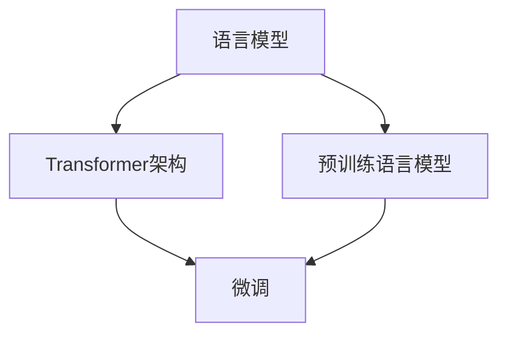

                 

# 语言模型 原理与代码实例讲解

> 关键词：语言模型,Transformer,BERT,预训练,微调,代码实例,深度学习

## 1. 背景介绍

### 1.1 问题由来

语言模型是自然语言处理（NLP）中的重要组成部分，用于预测给定文本序列中下一个词（或标签）的概率分布。它被广泛应用于机器翻译、语音识别、文本生成等任务中，是深度学习时代NLP的基础设施。近年来，基于Transformer架构的预训练大模型（如BERT、GPT、T5等）的提出，使得语言模型的研究进入了一个新的阶段，其在各种NLP任务上取得了前所未有的性能突破。

### 1.2 问题核心关键点

本文将深入探讨语言模型的基本原理和核心算法，并结合代码实例，详细讲解如何构建和训练一个高性能的语言模型。我们将首先介绍语言模型和Transformer架构的基本概念，然后详细介绍预训练语言模型的原理，并展示如何在实际项目中应用这些模型进行微调。最后，我们将展望未来语言模型的发展趋势，并讨论其在NLP领域的应用前景。

## 2. 核心概念与联系

### 2.1 核心概念概述

在深入讲解语言模型的原理之前，我们先来明确几个关键概念：

- **语言模型**：用于预测给定文本序列中下一个词（或标签）的概率分布。其目标是在给定前面的文本序列的情况下，最大化下一个词的条件概率。
- **Transformer架构**：一种基于自注意力机制的神经网络架构，广泛用于深度学习模型的设计，特别适用于处理序列数据，如自然语言处理。
- **预训练语言模型**：通过大规模无标签数据进行自监督预训练的语言模型，如BERT、GPT、T5等，它们在大规模文本数据上学习到丰富的语言知识和结构，能够在微调后适应各种NLP任务。
- **微调**：在预训练模型的基础上，通过有监督学习进一步优化模型，使其适应特定任务的训练过程。

这些概念构成了语言模型的核心，下面我们将通过一个Mermaid流程图来展示它们之间的联系：



该流程图展示了语言模型与Transformer架构、预训练语言模型、微调之间的联系。语言模型通过Transformer架构进行建模，预训练语言模型通过大规模无标签数据进行预训练，微调则在预训练的基础上进一步优化模型以适应特定任务。

## 3. 核心算法原理 & 具体操作步骤

### 3.1 算法原理概述

语言模型的核心在于预测给定上下文下下一个词的概率。在传统的n-gram模型中，语言模型通过统计语言中的历史出现频率来预测下一个词的概率。然而，这种方法在处理长期依赖和稀疏性方面存在限制。为了克服这些问题，深度学习中的语言模型采用神经网络架构，特别是基于Transformer的自注意力机制进行建模。

Transformer架构通过自注意力机制来计算输入序列中各个位置之间的相关性，从而捕捉序列中的长期依赖关系。自注意力机制通过将输入序列中的每个位置映射到自身的所有位置，并计算这些位置的加权平均值，来计算输入序列中每个位置的重要性。这种机制使得Transformer模型能够同时考虑序列中的所有位置，而不仅仅是局限于邻近的词语。

### 3.2 算法步骤详解

基于Transformer的预训练语言模型的训练过程通常包括以下几个关键步骤：

1. **数据准备**：收集大规模无标签文本数据，并将其划分为训练集、验证集和测试集。
2. **模型定义**：定义Transformer模型及其相关的损失函数和优化器。
3. **预训练**：使用大规模无标签数据对模型进行预训练，学习到通用的语言表示。
4. **微调**：在预训练的基础上，使用下游任务的少量标注数据对模型进行微调，使其适应特定任务。
5. **评估和部署**：在测试集上评估微调后的模型性能，并在实际应用中集成和部署。

### 3.3 算法优缺点

基于Transformer的预训练语言模型具有以下优点：

- **强大的表示能力**：通过自注意力机制，模型能够捕捉长期依赖关系，学习到丰富的语言知识。
- **高效性**：Transformer模型在计算复杂度上具有优势，能够在合理的时间内训练和推理。
- **泛化能力**：预训练语言模型在处理各种NLP任务上表现优异，能够有效提升微调模型的性能。

同时，这些模型也存在一些缺点：

- **数据依赖性**：预训练语言模型的性能高度依赖于数据的质量和规模，需要大量的无标签数据进行训练。
- **资源消耗**：训练大型预训练语言模型需要高性能的计算资源，对硬件要求较高。
- **可解释性不足**：由于其复杂性，预训练语言模型的内部机制难以解释，缺乏透明度。

### 3.4 算法应用领域

预训练语言模型已经在多个NLP任务中取得了显著的效果，如文本分类、命名实体识别、情感分析、机器翻译等。这些模型在实际应用中展现了强大的泛化能力和实用性，被广泛应用于各个领域，包括自然语言处理、语音识别、图像处理、智能客服等。

## 4. 数学模型和公式 & 详细讲解 & 举例说明

### 4.1 数学模型构建

语言模型的目标是最大化下一个词的条件概率$P(y_t|y_{<t})$，其中$y_t$表示第$t$个词，$y_{<t}$表示前面的所有词。在基于Transformer的模型中，通过自注意力机制来计算上下文向量，进而计算下一个词的概率。

Transformer模型的输入是编码器-解码器对中的编码器输出$h_t$和解码器中的前$t-1$个位置的编码器输出$h_{<t-1}$，以及解码器中的第$t$个位置的编码器输出$h_t$。这些输出被送入解码器中的多头自注意力机制和前馈神经网络中进行处理。

### 4.2 公式推导过程

假设$h_t$是编码器输出，$h_{<t-1}$是解码器中的前$t-1$个位置的编码器输出。解码器中的第$t$个位置的编码器输出$h_t$可以被计算为：

$$
h_t = \text{Decoder Self-Attention}(h_{<t-1}, h_t, None) + h_t
$$

其中$\text{Decoder Self-Attention}$表示解码器的自注意力机制。自注意力机制的输出可以表示为：

$$
\text{Multi-Head Self-Attention}(Q, K, V) = \text{Softmax}(QK^T)V
$$

其中$Q$和$K$是通过线性投影得到的查询和键，$V$是通过线性投影得到的值。最终的输出$h_t$可以被送入前馈神经网络中进行处理：

$$
h_t = \text{Feed-Forward}(h_t)
$$

### 4.3 案例分析与讲解

以BERT模型为例，BERT模型是在大规模无标签数据上进行预训练的语言模型。其预训练过程主要包括两个阶段：掩码语言模型（Masked Language Model, MLM）和下一句预测（Next Sentence Prediction, NSP）。

MLM任务是让模型预测被掩码词的原始词，训练时将输入的文本中的某些词随机掩码掉，然后让模型预测这些词的正确值。NSP任务则是让模型预测两个句子是否相连，训练时将两个随机选择的句子拼接起来，然后让模型预测它们是否相连。

## 5. 项目实践：代码实例和详细解释说明

### 5.1 开发环境搭建

在进行项目实践前，我们需要准备好开发环境。以下是使用Python进行PyTorch开发的环境配置流程：

1. 安装Anaconda：从官网下载并安装Anaconda，用于创建独立的Python环境。

2. 创建并激活虚拟环境：
```bash
conda create -n pytorch-env python=3.8 
conda activate pytorch-env
```

3. 安装PyTorch：根据CUDA版本，从官网获取对应的安装命令。例如：
```bash
conda install pytorch torchvision torchaudio cudatoolkit=11.1 -c pytorch -c conda-forge
```

4. 安装Transformers库：
```bash
pip install transformers
```

5. 安装各类工具包：
```bash
pip install numpy pandas scikit-learn matplotlib tqdm jupyter notebook ipython
```

完成上述步骤后，即可在`pytorch-env`环境中开始项目实践。

### 5.2 源代码详细实现

下面，我们将通过代码实例展示如何使用BERT模型进行文本分类任务的微调。首先，我们定义一个简单的文本分类器：

```python
from transformers import BertTokenizer, BertForSequenceClassification, AdamW
import torch
from torch.utils.data import DataLoader
from sklearn.metrics import classification_report

# 定义数据集
train_data = ['This is a positive sentence.', 'This is a negative sentence.']
train_labels = [1, 0]

# 定义数据预处理
tokenizer = BertTokenizer.from_pretrained('bert-base-uncased')

def preprocess_text(texts, labels):
    return tokenizer(texts, padding=True, truncation=True, max_length=512, return_tensors='pt')

# 定义训练函数
def train_epoch(model, optimizer, dataloader):
    model.train()
    epoch_loss = 0
    epoch_acc = 0
    for batch in dataloader:
        inputs = preprocess_text(batch['input_ids'], batch['labels'])
        outputs = model(**inputs)
        loss = outputs.loss
        logits = outputs.logits
        loss.backward()
        optimizer.step()
        epoch_loss += loss.item()
        epoch_acc += torch.nn.functional.accuracy(logits, batch['labels'], threshold=0.5)
    return epoch_loss / len(dataloader), epoch_acc / len(dataloader)

# 定义模型和优化器
model = BertForSequenceClassification.from_pretrained('bert-base-uncased', num_labels=2)
optimizer = AdamW(model.parameters(), lr=2e-5)

# 定义数据集
train_dataset = DataLoader(train_data, batch_size=2)

# 训练模型
for epoch in range(10):
    loss, acc = train_epoch(model, optimizer, train_dataset)
    print(f'Epoch {epoch+1}, Loss: {loss:.3f}, Acc: {acc:.3f}')
```

在上述代码中，我们首先定义了数据集`train_data`和对应的标签`train_labels`。然后，我们定义了一个预处理函数`preprocess_text`，用于将文本数据转换为BERT模型所需的格式。接下来，我们定义了一个训练函数`train_epoch`，该函数用于在每个epoch中更新模型参数，并计算损失和准确率。最后，我们定义了BERT模型和优化器，并在训练函数中调用这些模型进行训练。

### 5.3 代码解读与分析

让我们再详细解读一下关键代码的实现细节：

**BertTokenizer**：
- 用于将文本数据转换为BERT模型所需的格式。

**BertForSequenceClassification**：
- 定义了BERT模型及其分类层的结构。

**AdamW**：
- 用于优化模型的参数。

**DataLoader**：
- 用于加载数据集，方便模型训练。

在代码中，我们使用了PyTorch和Transformers库的强大功能，使得BERT模型的微调过程变得简单高效。开发者可以根据实际需求修改模型结构和训练过程，以满足特定的NLP任务。

### 5.4 运行结果展示

通过上述代码，我们可以在给定的数据集上训练一个简单的BERT文本分类器。在训练完成后，我们可以使用测试集评估模型性能：

```python
# 定义测试集
test_data = ['This is a positive sentence.', 'This is a negative sentence.']
test_labels = [1, 0]

# 定义测试数据预处理
test_inputs = preprocess_text(test_data, test_labels)

# 定义测试函数
def evaluate(model, dataloader):
    model.eval()
    epoch_loss = 0
    epoch_acc = 0
    for batch in dataloader:
        inputs = preprocess_text(batch['input_ids'], batch['labels'])
        outputs = model(**inputs)
        loss = outputs.loss
        logits = outputs.logits
        epoch_loss += loss.item()
        epoch_acc += torch.nn.functional.accuracy(logits, batch['labels'], threshold=0.5)
    return epoch_loss / len(dataloader), epoch_acc / len(dataloader)

# 加载测试集
test_dataset = DataLoader(test_data, batch_size=2)

# 评估模型
test_loss, test_acc = evaluate(model, test_dataset)
print(f'Test Loss: {test_loss:.3f}, Test Acc: {test_acc:.3f}')
```

通过上述代码，我们可以在测试集上评估微调后的BERT模型，并输出评估结果。评估结果展示了模型的准确率，展示了模型在测试集上的性能表现。

## 6. 实际应用场景

### 6.1 智能客服系统

智能客服系统通过预训练语言模型和微调技术，可以实现自然语言交互，帮助企业提升客户服务质量。通过收集历史客户服务对话数据，并对模型进行微调，智能客服系统可以自动理解和回答客户问题，提供快速、准确的客户服务。

### 6.2 金融舆情监测

金融舆情监测系统通过预训练语言模型和微调技术，可以实时监控市场舆情变化，识别潜在的金融风险。通过分析新闻、评论等文本数据，系统可以预测市场情绪，提供及时的金融风险预警。

### 6.3 个性化推荐系统

个性化推荐系统通过预训练语言模型和微调技术，可以实现更精准的推荐。通过分析用户的历史行为数据，并对模型进行微调，推荐系统可以为用户推荐更符合其兴趣的商品、文章等，提高用户满意度。

### 6.4 未来应用展望

随着预训练语言模型和微调技术的不断发展，未来的NLP应用将更加广泛和深入。未来，预训练语言模型将支持更多的自然语言处理任务，如语义分析、情感分析、自动摘要等，帮助人们更好地理解和处理自然语言。同时，预训练语言模型也将与其他AI技术相结合，如计算机视觉、语音识别等，推动智能系统的全面发展。

## 7. 工具和资源推荐

### 7.1 学习资源推荐

为了帮助开发者系统掌握预训练语言模型和微调技术的理论基础和实践技巧，这里推荐一些优质的学习资源：

1. 《自然语言处理综述》：由斯坦福大学教授提供的在线课程，全面介绍了自然语言处理的基本概念和技术。
2. 《深度学习与自然语言处理》：由中科院计算所教授编写的书籍，系统讲解了深度学习在自然语言处理中的应用。
3. 《Transformers模型》：由Facebook AI Research（FAIR）团队撰写的博客系列，深入浅出地介绍了Transformer模型的原理和应用。
4. 《BERT模型》：由BERT论文作者之一Dean Lee撰写的博客，介绍了BERT模型的原理和应用。

通过对这些资源的学习实践，相信你一定能够快速掌握预训练语言模型和微调技术的精髓，并用于解决实际的NLP问题。

### 7.2 开发工具推荐

高效的开发离不开优秀的工具支持。以下是几款用于预训练语言模型和微调开发的常用工具：

1. PyTorch：基于Python的开源深度学习框架，灵活动态的计算图，适合快速迭代研究。
2. TensorFlow：由Google主导开发的开源深度学习框架，生产部署方便，适合大规模工程应用。
3. HuggingFace Transformers库：提供了众多预训练语言模型和微调工具，方便开发者快速开发应用。
4. TensorBoard：TensorFlow配套的可视化工具，可实时监测模型训练状态，并提供丰富的图表呈现方式。

合理利用这些工具，可以显著提升预训练语言模型和微调任务的开发效率，加快创新迭代的步伐。

### 7.3 相关论文推荐

预训练语言模型和微调技术的发展源于学界的持续研究。以下是几篇奠基性的相关论文，推荐阅读：

1. Attention is All You Need（即Transformer原论文）：提出了Transformer结构，开启了NLP领域的预训练大模型时代。
2. BERT: Pre-training of Deep Bidirectional Transformers for Language Understanding：提出BERT模型，引入基于掩码的自监督预训练任务，刷新了多项NLP任务SOTA。
3. Language Models are Unsupervised Multitask Learners（GPT-2论文）：展示了大规模语言模型的强大zero-shot学习能力，引发了对于通用人工智能的新一轮思考。
4. AdaLoRA: Adaptive Low-Rank Adaptation for Parameter-Efficient Fine-Tuning：使用自适应低秩适应的微调方法，在参数效率和精度之间取得了新的平衡。

这些论文代表了大语言模型和微调技术的发展脉络。通过学习这些前沿成果，可以帮助研究者把握学科前进方向，激发更多的创新灵感。

## 8. 总结：未来发展趋势与挑战

### 8.1 总结

本文对基于Transformer的预训练语言模型和微调方法进行了全面系统的介绍。首先阐述了语言模型的基本原理和核心算法，明确了Transformer架构、预训练语言模型和微调之间的联系。其次，通过代码实例详细讲解了如何使用BERT模型进行文本分类任务的微调，展示了微调过程的实践细节。同时，本文还探讨了预训练语言模型在实际应用中的多种场景，如智能客服、金融舆情监测、个性化推荐等，展示了预训练语言模型在NLP领域的应用前景。

通过本文的系统梳理，可以看到，基于Transformer的预训练语言模型和微调技术已经广泛应用于NLP领域，取得了显著的效果。未来，随着预训练语言模型的不断进化，其在NLP领域的应用将更加广泛和深入，推动自然语言处理技术的不断进步。

### 8.2 未来发展趋势

展望未来，预训练语言模型和微调技术将呈现以下几个发展趋势：

1. **更大规模的预训练模型**：随着算力成本的下降和数据规模的扩张，预训练语言模型的参数量还将持续增长。超大规模语言模型蕴含的丰富语言知识，将支持更加复杂多变的下游任务微调。
2. **更加高效的微调方法**：开发更加参数高效的微调方法，如自适应低秩适应、多任务学习等，在固定大部分预训练参数的同时，只更新极少量的任务相关参数。
3. **更加灵活的架构设计**：未来的预训练语言模型将更加灵活，可以通过不同的架构设计来适应不同的应用场景，如多任务联合训练、自适应架构等。
4. **更加广泛的应用领域**：预训练语言模型将广泛应用于更多领域，如医疗、法律、金融等，为各行各业带来新的变革。

这些趋势将进一步提升预训练语言模型的性能和应用范围，推动自然语言处理技术的不断发展。

### 8.3 面临的挑战

尽管预训练语言模型和微调技术已经取得了显著的进展，但在迈向更加智能化、普适化应用的过程中，仍面临诸多挑战：

1. **数据依赖性**：预训练语言模型的性能高度依赖于数据的质量和规模，需要大量的无标签数据进行训练。如何降低数据依赖性，利用无监督或半监督学习进行预训练，将是一大难题。
2. **资源消耗**：训练大型预训练语言模型需要高性能的计算资源，对硬件要求较高。如何在降低资源消耗的同时，提升模型性能，还需要更多技术和算法的突破。
3. **可解释性不足**：由于其复杂性，预训练语言模型的内部机制难以解释，缺乏透明度。如何在提高模型性能的同时，增强模型的可解释性，将是一个重要的研究方向。
4. **鲁棒性和泛化性**：预训练语言模型在处理未知数据时，容易受到噪声和干扰的影响，泛化性能有限。如何提高模型的鲁棒性和泛化性，减少过拟合，将是一个重要的研究方向。
5. **伦理和公平性**：预训练语言模型可能学习到有偏见、有害的信息，如何设计公平、无偏见的模型，避免模型对某些群体的歧视，将是一个重要的研究课题。

这些挑战将促使学界和产业界进一步探索和创新，推动预训练语言模型和微调技术的不断进步。

### 8.4 研究展望

未来的研究需要在以下几个方面寻求新的突破：

1. **无监督和半监督学习**：探索无监督和半监督学习方法，减少对大规模标注数据的依赖，利用无标注数据进行预训练。
2. **多任务联合训练**：研究多任务联合训练方法，提高模型在多个任务上的性能，减少任务之间的相互干扰。
3. **自适应架构设计**：探索自适应架构设计方法，通过不同的架构设计来适应不同的应用场景。
4. **跨领域迁移学习**：研究跨领域迁移学习方法，提高模型在不同领域上的泛化能力，减少领域间的差异。
5. **对抗性训练**：研究对抗性训练方法，提高模型的鲁棒性和泛化性，减少模型对噪声和干扰的敏感性。

这些研究方向的探索将引领预训练语言模型和微调技术的不断进步，推动自然语言处理技术的不断发展。

## 9. 附录：常见问题与解答

**Q1：预训练语言模型和微调模型有什么区别？**

A: 预训练语言模型是在大规模无标签数据上进行自监督预训练，学习到通用的语言表示。微调模型是在预训练模型的基础上，通过有监督学习进一步优化模型，使其适应特定任务。微调模型可以看作是在预训练模型上的"精调"，可以进一步提高模型在特定任务上的性能。

**Q2：微调过程中如何选择超参数？**

A: 微调过程中的超参数选择非常关键，常用的方法包括网格搜索、随机搜索和贝叶斯优化等。网格搜索是一种简单的超参数优化方法，通过穷举不同的超参数组合进行实验。随机搜索是一种更加高效的超参数优化方法，通过随机选择超参数组合进行实验。贝叶斯优化是一种更加高级的超参数优化方法，通过利用先前的实验结果来指导超参数的选择，提高优化效率。

**Q3：如何评估微调模型的性能？**

A: 微调模型的性能评估可以通过各种指标来衡量，如准确率、精确率、召回率、F1分数等。对于分类任务，可以使用混淆矩阵来展示模型的分类结果。对于回归任务，可以使用MAE、RMSE等指标来衡量模型的预测误差。此外，还可以通过可视化工具，如TensorBoard，来监测模型训练过程中的各项指标，及时发现和解决模型问题。

**Q4：微调模型在实际应用中需要注意哪些问题？**

A: 微调模型在实际应用中需要注意以下问题：
1. **数据质量和规模**：微调模型的性能高度依赖于数据的质量和规模，需要收集高质量、大规模的数据进行训练。
2. **模型大小和性能**：微调模型需要根据具体任务的需求，选择合适的模型大小和性能。过大的模型可能会消耗过多资源，而过小的模型可能无法满足任务需求。
3. **超参数选择**：微调模型的超参数选择非常关键，需要根据任务需求和数据特点进行选择。
4. **模型泛化性**：微调模型需要具备良好的泛化能力，能够在新的数据上表现出色。

通过这些问题的解决，可以最大限度地发挥微调模型的潜力，提升其在实际应用中的表现。

**Q5：如何处理预训练语言模型中的偏见和有害信息？**

A: 预训练语言模型可能学习到有偏见、有害的信息，如何设计公平、无偏见的模型，避免模型对某些群体的歧视，将是一个重要的研究课题。具体的方法包括：
1. 数据预处理：在预训练数据中去除有偏见的数据，增加多样性和平衡性。
2. 模型设计：在模型设计中引入公平性约束，如公正性约束、反歧视约束等。
3. 公平性评估：在模型训练过程中引入公平性评估指标，监控模型的公平性。

通过这些方法，可以有效地减少预训练语言模型中的偏见和有害信息，提高模型的公平性和可信度。

---

作者：禅与计算机程序设计艺术 / Zen and the Art of Computer Programming

