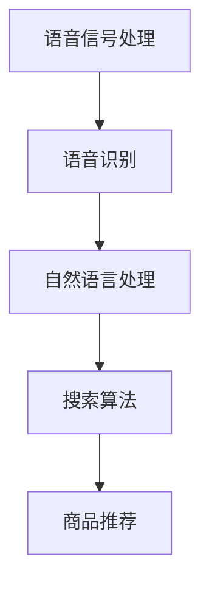

                 

# 语音搜索技术在电商领域的应用：挑战与机遇

语音搜索技术的飞速发展，正在为电商领域带来深刻变革。通过语音搜索，消费者可以更方便地获取商品信息、下订单、进行客户服务互动，电商平台也能更精准地了解用户需求、提升个性化推荐效果。然而，语音搜索的落地仍面临诸多挑战。本文将从核心概念、算法原理、项目实践、实际应用场景及未来展望等方面，全面探讨语音搜索技术在电商领域的应用现状与未来方向。

## 1. 背景介绍

### 1.1 问题由来
随着移动互联网、物联网设备的普及，语音交互逐渐成为人们日常生活的常态。相较于传统的键盘和触摸屏输入，语音搜索简化了交互方式，提升了用户体验。在电商领域，语音搜索的引入，将打破传统的搜索方式，为消费者和商家带来更便捷、更高效的服务。

### 1.2 问题核心关键点
语音搜索技术的核心在于自然语言理解和语音信号处理。它涉及音频信号的采集、特征提取、语音识别、自然语言处理等多个环节，旨在将用户的语音指令转化为文本查询，进而执行相应的搜索操作。然而，语音搜索在电商领域的应用，需要考虑多方面的因素，包括语音交互的流畅性、搜索结果的准确性、个性化推荐的适配性等。

### 1.3 问题研究意义
语音搜索技术在电商领域的应用，不仅可以提升用户体验，还能有效增加电商平台的流量和转化率。通过语音搜索，电商平台能够实时响应用户需求，提供更精准的推荐和更个性化的服务，从而提升品牌竞争力。同时，语音搜索技术的发展，也将推动人工智能、自然语言处理等领域技术的进一步成熟，为电商平台带来新的技术突破。

## 2. 核心概念与联系

### 2.1 核心概念概述

语音搜索技术涉及的核心概念包括：

- **语音信号处理**：利用数字信号处理技术，提取和处理语音信号，实现音频信号的采样、量化、编码等操作。
- **语音识别**：通过声学模型、语言模型等技术，将语音信号转化为文本，实现语音-文本的转换。
- **自然语言处理**：利用自然语言处理技术，解析用户查询语句，提取关键词、实体等信息，形成可执行的文本查询。
- **搜索算法**：在文本查询的基础上，利用搜索算法检索商品信息，返回最相关的搜索结果。

### 2.2 核心概念原理和架构的 Mermaid 流程图



语音信号处理模块负责对音频信号进行采样、量化、编码等预处理，为后续语音识别提供干净的信号。语音识别模块将处理后的语音信号转化为文本，供自然语言处理模块解析。自然语言处理模块利用语言模型、文本分词等技术，理解用户查询语句的意图，生成文本查询。搜索算法根据文本查询，检索商品数据库，返回最相关的搜索结果。最终，商品推荐模块基于搜索结果，结合用户历史行为数据，提供个性化推荐。

### 2.3 核心概念之间的联系
语音信号处理、语音识别、自然语言处理和搜索算法等模块之间，通过数据流进行衔接。语音信号处理模块提供输入，语音识别模块输出文本，自然语言处理模块解析文本，搜索算法根据文本生成查询结果，商品推荐模块结合查询结果和用户行为数据，进行个性化推荐。各模块相互依赖、协同工作，共同支撑语音搜索的完整流程。

## 3. 核心算法原理 & 具体操作步骤

### 3.1 算法原理概述

语音搜索技术的核心算法包括：

- **语音信号处理**：采用短时傅里叶变换、梅尔倒谱系数等技术，将语音信号转化为频谱信息。
- **语音识别**：基于深度神经网络模型（如CNN、RNN、Transformer等），通过声学模型和语言模型，实现语音信号到文本的转换。
- **自然语言处理**：利用BERT、GPT等预训练语言模型，结合词向量表示、文本分类等技术，解析用户查询意图。
- **搜索算法**：采用倒排索引、向量空间模型等技术，实现高效、准确的搜索结果检索。

### 3.2 算法步骤详解

语音搜索技术的应用流程主要包括以下几个步骤：

1. **音频信号采集**：通过麦克风或录音设备，采集用户的语音信号。
2. **预处理**：对采集的音频信号进行预处理，包括降噪、归一化等操作。
3. **语音识别**：利用深度学习模型，将预处理后的音频信号转化为文本。
4. **自然语言处理**：利用预训练语言模型，解析用户查询语句的意图，生成文本查询。
5. **搜索结果检索**：根据文本查询，利用倒排索引等技术，检索商品数据库，返回相关商品信息。
6. **个性化推荐**：结合搜索结果和用户历史行为数据，利用推荐算法生成个性化推荐。

### 3.3 算法优缺点

#### 优点：

1. **用户体验提升**：语音搜索简化了交互方式，提升了用户的购物体验。
2. **数据获取便捷**：语音搜索能够实时获取用户需求，提升电商平台的转化率。
3. **个性化推荐**：基于用户行为数据和搜索结果，提供精准的个性化推荐。

#### 缺点：

1. **识别准确率**：语音识别技术仍存在一定的错误率，影响搜索效果。
2. **延迟问题**：语音搜索需要处理音频信号、文本生成等多个环节，可能存在一定的延迟。
3. **数据隐私问题**：语音信号涉及用户隐私，需确保数据的安全性和隐私保护。

### 3.4 算法应用领域

语音搜索技术已在电商、智能家居、车载等多个领域得到了广泛应用。例如：

- **电商平台**：用户在电商平台上通过语音搜索商品，电商系统根据语音指令，返回商品信息和推荐。
- **智能家居**：用户通过语音搜索，控制智能设备，如智能音箱、智能灯光等。
- **车载系统**：驾驶员通过语音搜索，获取导航信息、播放音乐等。

## 4. 数学模型和公式 & 详细讲解 & 举例说明

### 4.1 数学模型构建

语音搜索技术涉及多个数学模型，包括：

- **语音信号处理**：采用短时傅里叶变换（Short-Time Fourier Transform, STFT）模型，将语音信号转化为频谱信息。
- **语音识别**：基于深度神经网络模型，构建声学模型（Acoustic Model）和语言模型（Language Model）。
- **自然语言处理**：利用BERT、GPT等预训练语言模型，构建词向量表示（Word Embedding）和文本分类模型。
- **搜索算法**：采用倒排索引（Inverted Index）模型，实现高效、准确的搜索结果检索。

### 4.2 公式推导过程

#### 语音信号处理模型

语音信号处理模型采用短时傅里叶变换，将语音信号 $x(t)$ 转化为频谱信息 $X(f)$。

$$
X(f) = \int_{-\infty}^{\infty} x(t) e^{-j2\pi ft} dt
$$

其中，$j$ 为虚数单位。

#### 语音识别模型

语音识别模型通过深度神经网络，构建声学模型和语言模型。声学模型 $P(s|x)$ 表示语音信号 $x$ 到文本序列 $s$ 的映射概率。语言模型 $P(s)$ 表示文本序列 $s$ 的概率。

$$
P(s|x) = \prod_{i=1}^{|s|} P(w_i|w_{i-1}, x)
$$

其中，$w_i$ 为文本序列的第 $i$ 个词。

#### 自然语言处理模型

自然语言处理模型利用BERT等预训练语言模型，构建词向量表示 $v(w)$ 和文本分类模型 $P(c|s)$。词向量表示 $v(w)$ 为词 $w$ 在词向量空间中的表示。文本分类模型 $P(c|s)$ 表示文本 $s$ 属于类别 $c$ 的概率。

$$
v(w) = BERT(w)
$$

$$
P(c|s) = softmax(W_c s + b_c)
$$

其中，$W_c$ 和 $b_c$ 为文本分类模型的参数。

#### 搜索算法模型

搜索算法模型采用倒排索引，构建文本-商品索引 $I$，实现高效的搜索结果检索。

$$
I = \{ <t, d_1, d_2, \dots, d_n> \}
$$

其中，$t$ 为文本，$d_1, d_2, \dots, d_n$ 为与该文本相关联的商品编号。

### 4.3 案例分析与讲解

以电商平台的语音搜索为例，展示其核心流程和应用场景。

#### 案例分析

1. **音频信号采集**：电商平台通过麦克风或录音设备，采集用户的语音信号。
2. **预处理**：对采集的音频信号进行降噪、归一化等预处理操作。
3. **语音识别**：利用深度神经网络模型，将预处理后的音频信号转化为文本。
4. **自然语言处理**：利用BERT等预训练语言模型，解析用户查询语句的意图，生成文本查询。
5. **搜索结果检索**：根据文本查询，利用倒排索引等技术，检索商品数据库，返回相关商品信息。
6. **个性化推荐**：结合搜索结果和用户历史行为数据，利用推荐算法生成个性化推荐。

#### 示例讲解

假设用户在电商平台上说：“我想买一双黑色的耐克运动鞋”。语音搜索系统的工作流程如下：

1. **音频信号采集**：电商平台采集用户的语音信号。
2. **预处理**：对语音信号进行降噪、归一化等预处理操作。
3. **语音识别**：利用深度神经网络模型，将预处理后的语音信号转化为文本“我想买一双黑色的耐克运动鞋”。
4. **自然语言处理**：利用BERT等预训练语言模型，解析文本查询，生成意图为“购买黑色耐克运动鞋”的文本查询。
5. **搜索结果检索**：根据文本查询，利用倒排索引等技术，检索商品数据库，返回所有黑色耐克运动鞋的信息。
6. **个性化推荐**：结合搜索结果和用户历史行为数据，利用推荐算法生成个性化推荐，如某款黑色耐克运动鞋的折扣信息、相关商品推荐等。

## 5. 项目实践：代码实例和详细解释说明

### 5.1 开发环境搭建

在进行语音搜索项目的开发前，需要准备以下开发环境：

1. **Python 3.8+**：安装最新版本的Python。
2. **TensorFlow 2.0+**：用于语音信号处理、语音识别等模块的开发。
3. **PyTorch 1.8+**：用于自然语言处理等模块的开发。
4. **NLTK**：自然语言处理工具包。
5. **Beam Search**：用于高效搜索算法。

完成以上安装后，即可在Python环境中进行语音搜索项目的开发。

### 5.2 源代码详细实现

以下是一个简单的语音搜索项目代码实现，包括音频信号处理、语音识别、自然语言处理和搜索结果检索等模块：

```python
import tensorflow as tf
import pytorch as pt
import nltk
import beam_search

# 音频信号处理
def process_audio(signal):
    # 对音频信号进行预处理，包括降噪、归一化等操作
    # 具体实现略
    return processed_signal

# 语音识别
def recognize_speech(signal):
    # 利用深度神经网络模型，将音频信号转化为文本
    # 具体实现略
    return text

# 自然语言处理
def parse_query(text):
    # 利用BERT等预训练语言模型，解析文本查询
    # 具体实现略
    return intent

# 搜索结果检索
def search_product(query):
    # 利用倒排索引等技术，检索商品数据库，返回相关商品信息
    # 具体实现略
    return products

# 个性化推荐
def recommend_products(query, history):
    # 结合搜索结果和用户历史行为数据，利用推荐算法生成个性化推荐
    # 具体实现略
    return recommendations

# 语音搜索主流程
def main():
    # 音频信号采集
    signal = process_audio(...)

    # 语音识别
    text = recognize_speech(signal)

    # 自然语言处理
    intent = parse_query(text)

    # 搜索结果检索
    products = search_product(intent)

    # 个性化推荐
    recommendations = recommend_products(intent, history)

    # 返回结果
    return products, recommendations
```

### 5.3 代码解读与分析

以上代码实现了语音搜索的基本流程，包括音频信号处理、语音识别、自然语言处理、搜索结果检索和个性化推荐等模块。每个模块的具体实现略去，但整体流程清晰明了。

**音频信号处理**：通过预处理操作，如降噪、归一化等，将原始音频信号转化为干净、标准的信号，供后续处理使用。

**语音识别**：利用深度神经网络模型，将音频信号转化为文本。具体实现通常涉及声学模型和语言模型的训练，以及前端语音信号的处理。

**自然语言处理**：利用BERT等预训练语言模型，解析文本查询的意图，生成可执行的文本查询。具体实现通常涉及分词、命名实体识别、意图分类等操作。

**搜索结果检索**：利用倒排索引等技术，高效检索商品数据库，返回与查询匹配的商品信息。具体实现通常涉及文本向量化、相似度计算等操作。

**个性化推荐**：结合搜索结果和用户历史行为数据，利用推荐算法生成个性化推荐。具体实现通常涉及协同过滤、基于内容的推荐、深度学习推荐等方法。

## 6. 实际应用场景

### 6.1 电商平台的语音搜索

语音搜索在电商平台中的应用，可以极大地提升用户体验和电商平台的转化率。用户通过语音搜索，可以方便快捷地找到所需商品，无需键盘输入，尤其适合老年人、儿童、残障人士等群体。

#### 应用场景

1. **商品搜索**：用户通过语音搜索，快速找到所需商品，如“黑色耐克运动鞋”。
2. **订单查询**：用户通过语音搜索，查询订单状态，如“我的订单状态”。
3. **客服互动**：用户通过语音搜索，与客服互动，如“退货流程”。

### 6.2 智能家居的语音搜索

智能家居中的语音搜索，为用户提供了更加便捷、智能化的家居管理方式。用户可以通过语音指令，控制灯光、窗帘、空调等智能设备，提升生活品质。

#### 应用场景

1. **灯光控制**：用户通过语音搜索，控制灯光亮度和颜色，如“开灯”、“调亮”。
2. **温度调节**：用户通过语音搜索，调节室内温度，如“调低空调温度”。
3. **媒体播放**：用户通过语音搜索，播放音乐、视频等，如“播放新闻”。

### 6.3 车载系统的语音搜索

车载系统的语音搜索，为驾驶员提供了更加安全的驾驶辅助方式。用户通过语音搜索，可以获取导航信息、播放音乐、设置目的地等，提升行车安全和舒适性。

#### 应用场景

1. **导航查询**：用户通过语音搜索，获取导航信息，如“去最近的加油站”。
2. **音乐播放**：用户通过语音搜索，播放音乐或电台，如“播放流行音乐”。
3. **目的地设置**：用户通过语音搜索，设置目的地，如“设定去公司的路线”。

## 7. 工具和资源推荐

### 7.1 学习资源推荐

1. **《Speech Recognition: An Introduction》**：麻省理工学院教授Jurafsky和Martin合著的经典教材，介绍了语音识别的基本原理和最新进展。
2. **Deep Learning for Natural Language Processing**：由Google研究人员撰写的在线教程，介绍了基于深度学习的自然语言处理技术，包括语音搜索等应用。
3. **NLTK**：自然语言处理工具包，提供了丰富的文本处理和语言分析功能。
4. **TensorFlow and PyTorch Tutorials**：Google和Facebook提供的官方教程，涵盖深度学习模型的实现和应用。
5. **Beam Search**：Google开源的高效搜索算法库，提供多种搜索算法和实现细节。

### 7.2 开发工具推荐

1. **TensorFlow**：Google开源的深度学习框架，适用于语音信号处理、语音识别等模块的开发。
2. **PyTorch**：Facebook开源的深度学习框架，适用于自然语言处理等模块的开发。
3. **NLTK**：自然语言处理工具包，提供了丰富的文本处理和语言分析功能。
4. **Beam Search**：Google开源的高效搜索算法库，提供多种搜索算法和实现细节。
5. **Amazon Lex**：AWS提供的语音识别服务，方便开发者快速集成语音搜索功能。

### 7.3 相关论文推荐

1. **Attention is All You Need**：Transformer论文，提出了自注意力机制，用于语音信号处理和语音识别。
2. **BERT: Pre-training of Deep Bidirectional Transformers for Language Understanding**：BERT论文，提出了基于掩码自监督预训练的语音识别技术。
3. **Deep Speech 2: End-to-End Speech Recognition in English and Mandarin**：Google开源的语音识别模型，适用于自然语言处理和语音搜索。
4. **Sequence to Sequence Learning with Neural Networks**：Sutskever等人提出的序列到序列模型，适用于自然语言处理和语音搜索。
5. **Transformers**：Attention机制的改进和发展，适用于自然语言处理和语音搜索。

## 8. 总结：未来发展趋势与挑战

### 8.1 研究成果总结

语音搜索技术在电商、智能家居、车载等多个领域得到了广泛应用，极大地提升了用户体验和电商平台的转化率。利用语音信号处理、语音识别、自然语言处理和搜索算法等核心技术，实现高效的语音搜索功能。

### 8.2 未来发展趋势

未来，语音搜索技术将继续发展，呈现以下几个趋势：

1. **语音识别准确率提升**：随着深度学习模型的不断优化，语音识别的准确率将进一步提升，语音搜索的误识别率将显著降低。
2. **多模态融合**：结合视觉、听觉、触觉等多模态信息，实现更全面的用户交互。
3. **个性化推荐**：结合用户行为数据和实时反馈，提供更加精准的个性化推荐。
4. **边缘计算**：在本地设备上处理语音数据，提升实时性和隐私性。
5. **跨语言支持**：支持多语言搜索，提升国际市场竞争力。

### 8.3 面临的挑战

虽然语音搜索技术在电商、智能家居等领域取得了一定进展，但仍面临以下挑战：

1. **语音识别准确率**：语音识别的准确率仍有提升空间，误识别率可能影响用户体验。
2. **系统延迟**：语音信号处理、语音识别等环节存在一定的延迟，影响实时性。
3. **数据隐私**：语音数据涉及用户隐私，需确保数据安全和隐私保护。
4. **硬件成本**：高质量的语音识别和搜索功能，对硬件资源有较高要求。

### 8.4 研究展望

未来的研究需要在以下几个方面寻求新的突破：

1. **语音识别技术**：开发更加高效、准确、鲁棒的语音识别模型，提升语音搜索的效果。
2. **自然语言处理技术**：结合深度学习、符号逻辑等技术，提升自然语言处理的能力，实现更精准的文本解析。
3. **搜索算法优化**：优化倒排索引、向量空间模型等搜索算法，提升搜索结果的准确性和召回率。
4. **多模态融合**：结合视觉、听觉、触觉等多模态信息，实现更全面的用户交互。
5. **个性化推荐**：结合用户行为数据和实时反馈，提供更加精准的个性化推荐。

## 9. 附录：常见问题与解答

**Q1：语音搜索技术如何提升电商平台的转化率？**

A: 语音搜索技术通过简化交互方式，快速获取用户需求，提升电商平台的转化率。用户无需键盘输入，可以更自然、更高效地完成购物操作，从而提升购物体验和满意度。

**Q2：语音搜索技术在智能家居中的应用有哪些？**

A: 语音搜索技术在智能家居中的应用包括灯光控制、温度调节、媒体播放等，通过语音指令，提升家居生活的便捷性和智能化水平。

**Q3：语音搜索技术面临的主要挑战有哪些？**

A: 语音搜索技术面临的主要挑战包括语音识别准确率、系统延迟、数据隐私、硬件成本等。

**Q4：未来语音搜索技术的发展趋势有哪些？**

A: 未来语音搜索技术的发展趋势包括语音识别准确率提升、多模态融合、个性化推荐、边缘计算、跨语言支持等。

**Q5：语音搜索技术的发展对人工智能领域有何影响？**

A: 语音搜索技术的发展推动了语音信号处理、语音识别、自然语言处理等领域的研究，为人工智能技术的应用提供了新的方向和动力。

---

作者：禅与计算机程序设计艺术 / Zen and the Art of Computer Programming

