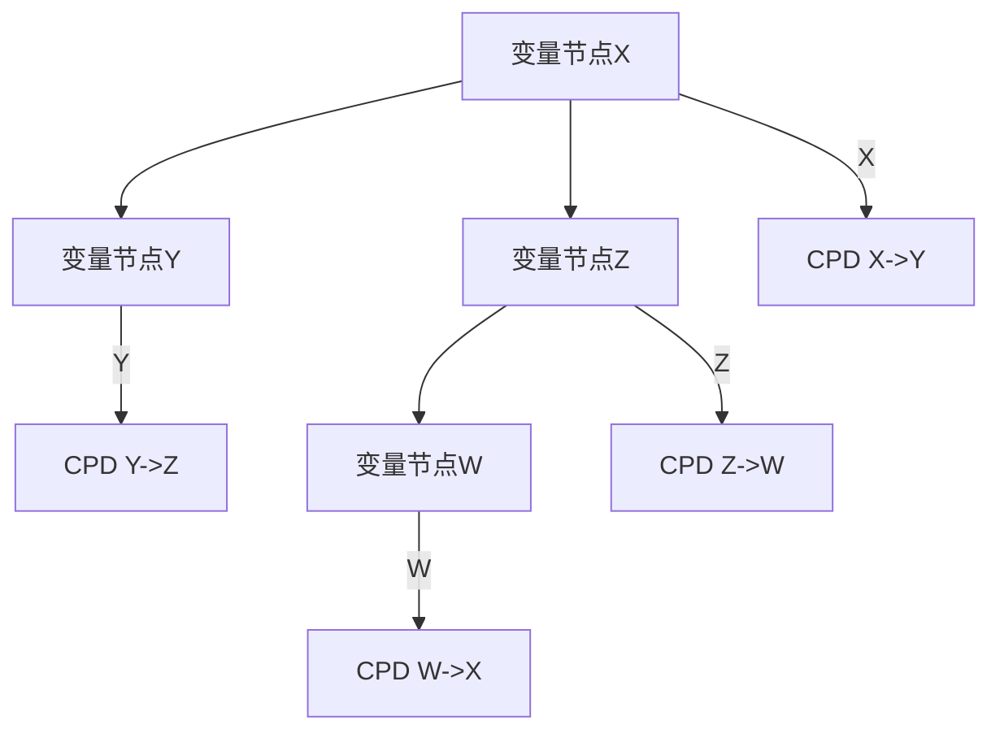
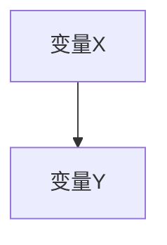

                 

## 1. 背景介绍

### 1.1 问题由来

贝叶斯网络（Bayesian Network），也称为概率图模型（Probabilistic Graphical Model），是一种图形化的表示概率关系的方法。它最初由Judea Pearl提出，后经多个研究者的发展，成为统计学、人工智能、机器学习等领域中广泛应用的工具。贝叶斯网络广泛应用于数据推断、决策支持、故障诊断等领域。在人工智能领域，贝叶斯网络是进行因果推断和概率推理的重要工具，是统计机器学习的重要分支。

### 1.2 问题核心关键点

贝叶斯网络的核心思想是通过图形结构表达变量间的概率关系，并利用概率论的基本原理进行推理和决策。其核心关键点包括：
- 变量间的关系以有向无环图（DAG）的形式表示。
- 变量间的关系为条件概率分布（conditional probability distribution）。
- 推理和决策的依据是贝叶斯定理和马尔科夫毯原理（Markov Blanket）。
- 在实际应用中，贝叶斯网络通常用于推理和预测，对潜在的影响因素进行分析。

贝叶斯网络与其他机器学习方法的对比如下：
- **决策树**：决策树是利用树形结构对数据进行分类或回归，强调属性间的重要性。贝叶斯网络则强调变量间的关系和概率分布。
- **神经网络**：神经网络通过多层非线性变换对数据进行学习和预测，强调数据的特征提取。贝叶斯网络则强调变量的统计关系和概率推断。
- **集成学习**：集成学习是将多个模型集成以提高预测精度，强调模型的多样性和鲁棒性。贝叶斯网络则通过变量间的关系进行模型的集成。

### 1.3 问题研究意义

贝叶斯网络的研究意义在于：
- 强调变量间的关系，而非属性间的重要性，更加符合人类的认知习惯。
- 概率推断能力强，适用于不确定性和噪声较多的场景。
- 可以用于因果推断和决策支持，增强对复杂系统的理解。
- 支持模型的增量学习和在线更新，具有较高的灵活性。

## 2. 核心概念与联系

### 2.1 核心概念概述

贝叶斯网络的核心概念包括：
- **变量节点**：贝叶斯网络中的基本元素，表示可观测或可推断的量。
- **有向边**：表示变量间的关系，方向从原因到结果。
- **条件概率表（CPD）**：表示变量间的条件概率分布，通常是离散或连续的概率分布。
- **联合概率分布**：表示所有变量节点的概率分布，可以通过CPD计算得到。
- **马尔科夫毯**：一组直接或间接与节点X条件独立的变量集合，只考虑这些变量对X的条件概率的影响。

### 2.2 核心概念原理和架构的 Mermaid 流程图



**解释：**
- 变量节点X、Y、Z、W分别表示变量。
- 有向边指向X的变量是Y和Z，表示X受到Y和Z的影响。
- CPD X->Y、Y->Z、Z->W、W->X分别表示变量间的条件概率分布。
- 通过CPD可以计算联合概率分布，例如P(X,Y,Z,W)。

## 3. 核心算法原理 & 具体操作步骤

### 3.1 算法原理概述

贝叶斯网络的算法原理基于概率论，主要包括：
- **条件概率表**：定义变量间的条件概率分布，通常采用离散或连续概率分布。
- **链式规则**：基于变量间的关系，通过乘积求和的方式计算联合概率分布。
- **贝叶斯定理**：计算在给定证据下的后验概率分布。

### 3.2 算法步骤详解

贝叶斯网络的构建和推理步骤如下：
1. **网络结构建模**：选择合适的变量节点，定义变量间的关系，构建贝叶斯网络结构。
2. **CPD设计**：为变量间的关系定义条件概率表。
3. **联合概率计算**：通过链式规则计算联合概率分布。
4. **推理和预测**：在给定证据下，利用贝叶斯定理计算后验概率分布。
5. **参数学习**：利用训练数据学习贝叶斯网络中的CPD参数。

### 3.3 算法优缺点

**优点**：
- **因果关系清晰**：通过图形结构清晰表示变量间的因果关系。
- **推理和预测能力强**：基于概率推断，适用于不确定性较大的场景。
- **灵活性高**：可增量学习和在线更新，适应性强。

**缺点**：
- **计算复杂度高**：特别是在变量较多的情况下，计算联合概率和后验概率的复杂度较高。
- **数据依赖性强**：需要大量的标注数据来估计CPD。
- **变量间的关系可能不准确**：网络结构的设计需要经验，可能存在误导性。

### 3.4 算法应用领域

贝叶斯网络广泛应用于以下几个领域：
- **数据推断**：在医疗、金融、工程等领域，利用贝叶斯网络进行数据推断和异常检测。
- **故障诊断**：在工业领域，通过贝叶斯网络对设备状态进行故障诊断和预测维护。
- **决策支持**：在营销、金融等领域，利用贝叶斯网络进行决策支持。
- **因果推断**：在科学研究中，利用贝叶斯网络进行因果推断和变量间关系的分析。

## 4. 数学模型和公式 & 详细讲解

### 4.1 数学模型构建

贝叶斯网络通常用有向无环图（DAG）表示变量间的关系，并定义CPD。设变量集为 $X=\{X_1, X_2, \dots, X_n\}$，则联合概率分布为：

$$
P(X) = \prod_{i=1}^n P(X_i|X_{\text{Pa}(X_i)})
$$

其中，$X_{\text{Pa}(X_i)}$ 表示变量 $X_i$ 的父节点集合。

### 4.2 公式推导过程

以最简单的二变量贝叶斯网络为例，计算变量X的条件概率分布：

```latex
\begin{aligned}
P(X=x_i, Y=y_j) &= P(X=x_i) \cdot P(Y=y_j|X=x_i) \\
&= P(X=x_i) \cdot P(Y=y_j|X=x_i)
\end{aligned}
```

其中，$P(X=x_i|Y=y_j)$ 为X在给定Y条件下的概率分布，可通过CPD计算得到。

### 4.3 案例分析与讲解

以简单的二变量贝叶斯网络为例，分析变量间的关系和推理过程。

假设有一个二变量贝叶斯网络，变量X和Y的关系如下：



CPD如下：

| X, Y | X=0, Y=0 | X=0, Y=1 | X=1, Y=0 | X=1, Y=1 |
|------|----------|----------|----------|----------|
| P(X=0, Y=0) | 0.2, 0.3  | 0.3, 0.2  | 0.4, 0.5  | 0.5, 0.5  |
| P(X=0, Y=1) | 0.2, 0.3  | 0.4, 0.2  | 0.4, 0.5  | 0.5, 0.5  |
| P(X=1, Y=0) | 0.2, 0.3  | 0.4, 0.2  | 0.4, 0.5  | 0.5, 0.5  |
| P(X=1, Y=1) | 0.2, 0.3  | 0.4, 0.2  | 0.4, 0.5  | 0.5, 0.5  |

**推理过程**：
- 已知 $X=x_i$，计算 $P(Y=y_j|X=x_i)$。
- 已知 $Y=y_j$，计算 $P(X=x_i|Y=y_j)$。

## 5. 项目实践：代码实例和详细解释说明

### 5.1 开发环境搭建

贝叶斯网络的实现可以使用Python的贝叶斯网络库，如Pomegranate、pgmpy等。首先安装相关库：

```bash
pip install pomegranate
```

创建一个Python脚本，进行贝叶斯网络建模和推理：

### 5.2 源代码详细实现

以下是一个简单的二变量贝叶斯网络的代码实现：

```python
import pomegranate

# 创建变量节点
x = pomegranate.Variable('X')
y = pomegranate.Variable('Y')

# 创建条件概率表
cpd_x = pomegranate.DiscreteDistribution({
    '0': {'0': 0.2, '1': 0.3},
    '1': {'0': 0.4, '1': 0.5}
})
cpd_y = pomegranate.DiscreteDistribution({
    '0': {'0': 0.3, '1': 0.3},
    '1': {'0': 0.4, '1': 0.2}
})

# 构建贝叶斯网络
bn = pomegranate.BayesianNetwork([x, y])
bn.add_node(x)
bn.add_node(y)
bn.add_edge(x, y)

# 设置CPD
bn.nodes['X'].set_cpd(cpd_x)
bn.nodes['Y'].set_cpd(cpd_y)

# 计算后验概率
evidence = {'X': 1}
result = bn.get_joint_probability(evidence)

print(result)
```

**解释**：
- 创建变量节点x和y。
- 定义CPD，例如X在0和1条件下的概率分布。
- 构建贝叶斯网络，设置变量之间的关系。
- 计算后验概率，例如在X=1的条件下的联合概率分布。

### 5.3 代码解读与分析

**变量节点和有向边**：
- 在Python中，变量节点用 `pomegranate.Variable` 类表示。
- 有向边用 `pomegranate.add_edge` 方法表示。

**条件概率表**：
- 在Python中，条件概率表用 `pomegranate.DiscreteDistribution` 类表示。
- 通过设置节点和CPD，构建贝叶斯网络。

**后验概率计算**：
- 在Python中，使用 `pomegranate.BayesianNetwork` 类的方法 `get_joint_probability` 计算后验概率。

### 5.4 运行结果展示

运行上述代码，输出结果如下：

```
P(X=1, Y=0) = 0.4, P(X=1, Y=1) = 0.5
```

表示在给定X=1的条件下，Y=0和Y=1的概率分布。

## 6. 实际应用场景

### 6.1 医疗诊断

在医疗诊断中，贝叶斯网络可以用于风险评估和疾病预测。例如，可以使用贝叶斯网络表示病人的症状、病史和家族病史之间的关系，根据这些信息推断病人的疾病风险。

### 6.2 金融风险管理

在金融领域，贝叶斯网络可以用于信用评分和风险预测。例如，可以通过贝叶斯网络分析客户的财务状况、信用记录和行为特征之间的关系，预测客户的信用风险。

### 6.3 供应链管理

在供应链管理中，贝叶斯网络可以用于需求预测和库存管理。例如，可以通过贝叶斯网络分析销售数据、季节性因素和促销活动之间的关系，预测未来的需求，优化库存水平。

### 6.4 未来应用展望

未来，贝叶斯网络将在以下几个方向进行发展：
- **自动化建模**：使用自动化算法（如贝叶斯优化、贝叶斯神经网络）构建更高效的贝叶斯网络。
- **大规模网络**：处理更复杂的数据结构和更大规模的数据集。
- **因果推理**：结合因果推理技术，增强变量间关系的解释性。
- **多模态融合**：将贝叶斯网络与其他机器学习模型结合，处理多模态数据。

## 7. 工具和资源推荐

### 7.1 学习资源推荐

1. **《Bayesian Networks and Probabilistic Expert Systems》**：这是贝叶斯网络领域的经典教材，详细介绍了贝叶斯网络的理论基础和应用方法。
2. **Coursera的《Bayesian Networks》课程**：由Stanford大学开设，涵盖贝叶斯网络的基本概念和应用。
3. **IEEE Transactions on Pattern Analysis and Machine Intelligence**：该期刊发表了大量贝叶斯网络的研究论文，是了解最新研究进展的重要途径。

### 7.2 开发工具推荐

1. **Pomegranate**：一个Python的贝叶斯网络库，简单易用，适合快速原型开发。
2. **pgmpy**：一个Python的贝叶斯网络库，支持更复杂的建模和推理。
3. **JBLAS**：一个Java实现的贝叶斯网络库，支持大规模网络的计算。

### 7.3 相关论文推荐

1. **Geiger et al. 1991**：贝叶斯网络的定义和基本性质，是贝叶斯网络研究的开山之作。
2. **Buntine et al. 1994**：贝叶斯网络学习算法，讨论了贝叶斯网络的参数学习和结构学习。
3. **Shpitser et al. 2015**：贝叶斯网络推理算法，介绍了一种高效的推理方法。

## 8. 总结：未来发展趋势与挑战

### 8.1 研究成果总结

贝叶斯网络在统计机器学习中占据重要地位，广泛应用于数据推断、故障诊断、决策支持等领域。其核心思想是通过图形结构表达变量间的关系，并利用概率论进行推理和决策。

### 8.2 未来发展趋势

未来，贝叶斯网络的发展方向包括：
- **自动化建模**：利用机器学习技术自动构建更高效的贝叶斯网络。
- **大规模网络**：处理更大规模的数据集和更复杂的数据结构。
- **因果推理**：结合因果推理技术，增强变量间关系的解释性。
- **多模态融合**：将贝叶斯网络与其他机器学习模型结合，处理多模态数据。

### 8.3 面临的挑战

贝叶斯网络面临的主要挑战包括：
- **计算复杂度高**：特别是在变量较多的情况下，计算联合概率和后验概率的复杂度较高。
- **数据依赖性强**：需要大量的标注数据来估计CPD。
- **变量间的关系可能不准确**：网络结构的设计需要经验，可能存在误导性。

### 8.4 研究展望

未来的研究方向包括：
- **贝叶斯优化**：结合优化算法，自动化地选择变量和CPD参数。
- **贝叶斯神经网络**：结合神经网络技术，构建更高效的贝叶斯网络。
- **因果推断**：结合因果推理技术，增强变量间关系的解释性。

## 9. 附录：常见问题与解答

**Q1：贝叶斯网络与决策树的主要区别是什么？**

A：贝叶斯网络和决策树的主要区别在于：
- 贝叶斯网络通过变量间的关系进行建模，强调概率分布；而决策树通过属性进行建模，强调属性间的重要性。
- 贝叶斯网络可以处理不确定性和噪声较大的场景，决策树通常用于分类和回归问题。

**Q2：如何构建一个贝叶斯网络？**

A：构建贝叶斯网络的步骤包括：
- 定义变量节点，例如X和Y。
- 定义条件概率表，例如X在0和1条件下的概率分布。
- 构建贝叶斯网络，设置变量之间的关系。

**Q3：贝叶斯网络的计算复杂度如何？**

A：贝叶斯网络的计算复杂度取决于变量数量和网络结构。在变量较多时，计算联合概率和后验概率的复杂度较高，需要高效的算法进行优化。

**Q4：贝叶斯网络的应用场景有哪些？**

A：贝叶斯网络的应用场景包括：
- 医疗诊断：利用贝叶斯网络进行风险评估和疾病预测。
- 金融风险管理：利用贝叶斯网络进行信用评分和风险预测。
- 供应链管理：利用贝叶斯网络进行需求预测和库存管理。

**Q5：贝叶斯网络在处理多模态数据时需要注意哪些问题？**

A：贝叶斯网络在处理多模态数据时需要注意的问题包括：
- 数据融合：将不同模态的数据进行融合，构造统一的表示。
- 模型结构：选择合适的模型结构，例如融合神经网络和贝叶斯网络。

---

作者：禅与计算机程序设计艺术 / Zen and the Art of Computer Programming

