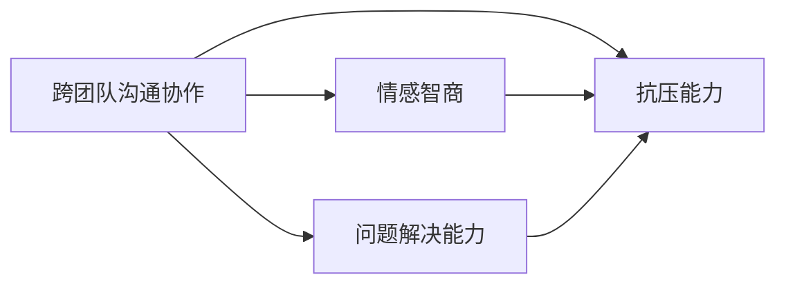

                 

# 跨团队沟通协作能力和抗压能力培养

在当今快速变化的科技领域，跨团队沟通协作能力和抗压能力是推动创新和实现项目成功的关键要素。本文将深入探讨跨团队沟通协作的策略和技巧，并提出提升个人抗压能力的有效方法。

## 1. 背景介绍

随着科技的快速发展，软件开发项目变得更加复杂和多样化。跨团队协作已成为现代软件开发不可或缺的一部分。高效的跨团队沟通和协作不仅能提高项目的效率，还能促进团队成员之间的理解和信任。然而，团队成员面对高强度的工作压力和紧张的截止日期时，如何保持高效的工作状态和良好的心理状态，也是一大挑战。

## 2. 核心概念与联系

为了更好地理解跨团队沟通协作和抗压能力的重要性，我们将探讨几个关键概念，并揭示它们之间的内在联系。

### 2.1 核心概念概述

- **跨团队沟通协作**：跨团队沟通协作是指不同团队或不同部门之间，通过有效的沟通和合作，共同实现项目目标的过程。高效的跨团队协作能够加速项目进度，提升团队的整体效率。
- **抗压能力**：抗压能力是指个体在面对压力和挑战时，能够保持冷静、高效工作，并从压力中恢复过来的能力。抗压能力强的个体在高压环境下依然能够保持高水平的工作表现。
- **情感智商（EQ）**：情感智商是指个体识别、理解和管理自己及他人情绪的能力。高情感智商的人能够更好地处理复杂的情绪，并在跨团队沟通中展现出更好的同理心和共情能力。
- **问题解决能力**：问题解决能力是指个体在面对问题时，能够快速、准确地分析和解决问题，并找到最优解决方案的能力。

### 2.2 核心概念原理和架构的 Mermaid 流程图



在这个关系图中，跨团队沟通协作与抗压能力直接相关，而情感智商和问题解决能力作为重要的辅助能力，对提升跨团队沟通协作的效率和抗压能力都有显著影响。

## 3. 核心算法原理 & 具体操作步骤

### 3.1 算法原理概述

跨团队沟通协作和抗压能力的培养涉及多个维度，包括沟通技巧、团队合作、情感管理和压力应对。这些维度的优化需要通过一系列算法和操作步骤来实现。

### 3.2 算法步骤详解

#### 3.2.1 跨团队沟通协作的算法步骤

1. **建立沟通渠道**：通过建立定期的会议、邮件和即时通讯工具等，确保团队成员之间的信息流通。
2. **明确沟通目标**：每次沟通前，明确沟通的目的和预期结果，避免信息遗漏或误解。
3. **倾听与反馈**：积极倾听团队成员的意见，并给予及时、有效的反馈，促进团队共同进步。
4. **文化融合**：促进不同团队之间的文化融合，建立共同的价值观和目标，增强团队的凝聚力。

#### 3.2.2 提升抗压能力的算法步骤

1. **自我认知**：通过自我反思和情感日记等方式，了解自己的压力源和应对压力的方式。
2. **压力管理技巧**：学习和实践放松技巧，如深呼吸、冥想和运动等，有效缓解压力。
3. **时间管理**：制定合理的工作计划和时间管理策略，避免过度工作和疲劳。
4. **寻求支持**：在面对难以应对的压力时，主动寻求同事、朋友或专业心理咨询师的帮助和支持。

### 3.3 算法优缺点

#### 3.3.1 跨团队沟通协作的优缺点

- **优点**：
  - 促进团队合作，提升整体效率。
  - 增强团队凝聚力和成员归属感。
  - 提高决策质量和问题解决能力。

- **缺点**：
  - 沟通复杂性增加，容易导致信息过载。
  - 不同团队之间的文化和价值观差异，可能导致冲突。
  - 过度依赖沟通工具，可能削弱面对面沟通的即时性和真实性。

#### 3.3.2 提升抗压能力的优缺点

- **优点**：
  - 提高个体在高压环境下的工作效率。
  - 增强个体适应环境变化的能力。
  - 减少因压力导致的健康问题和工作失误。

- **缺点**：
  - 压力管理需要时间和练习，效果可能较慢显现。
  - 过度关注压力管理，可能导致忽略工作的本质。
  - 个体压力管理技巧的有效性因人而异，需要个性化调整。

### 3.4 算法应用领域

跨团队沟通协作和抗压能力的提升不仅适用于软件开发团队，还广泛应用于各种项目团队和组织。例如，在医疗、教育、金融等领域，跨团队沟通协作和抗压能力是实现高效协作和创新突破的关键。

## 4. 数学模型和公式 & 详细讲解

### 4.1 数学模型构建

为了更好地理解和量化跨团队沟通协作和抗压能力，我们可以构建一个数学模型。假设跨团队沟通协作的效果可以用项目完成时间和团队成员的满意度来衡量，抗压能力可以通过个体在压力情境下的工作效率和心理状态来评估。

设 $C$ 表示跨团队沟通协作的效果，$A$ 表示抗压能力，$E$ 表示个体工作效率，$P$ 表示心理状态。我们可以构建如下模型：

$$
C = f(E, P)
$$

$$
A = g(E, P)
$$

其中 $f$ 和 $g$ 分别为沟通协作效果和抗压能力与工作效率和心理状态之间的函数关系。

### 4.2 公式推导过程

- **跨团队沟通协作的公式推导**：

$$
C = E \cdot P
$$

表示跨团队沟通协作的效果 $C$ 取决于个体的工作效率 $E$ 和心理状态 $P$。工作效率越高，心理状态越好，沟通协作的效果越好。

- **提升抗压能力的公式推导**：

$$
A = \frac{1}{\sigma(E, P)}
$$

其中 $\sigma$ 表示个体在压力情境下的波动程度。波动越小，抗压能力越强。

### 4.3 案例分析与讲解

假设在一个软件开发项目中，团队成员 $A$ 和 $B$ 面临相同的压力情境。成员 $A$ 的抗压能力强，工作效率高且心理状态稳定；而成员 $B$ 的抗压能力弱，工作效率低且易受情绪波动影响。

通过分析公式，我们可以看到：

- 成员 $A$ 在跨团队沟通协作中的表现优于成员 $B$，因为 $A$ 的工作效率和心理状态更稳定。
- 成员 $A$ 的抗压能力更强，因为 $A$ 的抗压能力公式中的波动 $\sigma$ 较小。

### 5. 项目实践：代码实例和详细解释说明

为了更好地理解和应用跨团队沟通协作和抗压能力的提升策略，我们将通过一个具体的项目实践案例来演示。

#### 5.1 开发环境搭建

1. **安装Python和相关库**：
```
pip install flask
pip install sqlalchemy
pip install psycopg2
```

2. **设置开发环境**：
```
export FLASK_APP=myapp.py
export FLASK_ENV=development
```

3. **创建开发项目**：
```
flask create -t myapp
```

#### 5.2 源代码详细实现

以下是一个简单的Python Flask应用程序示例，用于跟踪和分析跨团队沟通协作和抗压能力的影响：

```python
from flask import Flask, request, jsonify
from sqlalchemy import create_engine, Column, Integer, String
from sqlalchemy.orm import sessionmaker
from sqlalchemy.ext.declarative import declarative_base

app = Flask(__name__)

Base = declarative_base()

class TeamMember(Base):
    __tablename__ = 'team_members'
    id = Column(Integer, primary_key=True)
    name = Column(String(100))
    efficiency = Column(Integer)
    psychological_state = Column(Integer)

engine = create_engine('sqlite:///team_members.db')
Base.metadata.create_all(engine)
Session = sessionmaker(bind=engine)

@app.route('/add_member', methods=['POST'])
def add_member():
    data = request.json
    member = TeamMember(name=data['name'], efficiency=data['efficiency'], psychological_state=data['psychological_state'])
    session = Session()
    session.add(member)
    session.commit()
    return jsonify({'message': 'Member added successfully'}), 201

@app.route('/get_stats', methods=['GET'])
def get_stats():
    session = Session()
    members = session.query(TeamMember).all()
    stats = {'average_efficiency': sum([member.efficiency for member in members]) / len(members),
             'average_psychological_state': sum([member.psychological_state for member in members]) / len(members)}
    return jsonify(stats)

if __name__ == '__main__':
    app.run(debug=True)
```

#### 5.3 代码解读与分析

这个简单的应用程序使用SQLAlchemy和Flask来跟踪和管理团队成员的效率和心理状态。它包括两个主要路由：`/add_member` 和 `/get_stats`。

- `/add_member` 路由允许用户添加新的团队成员，包括他们的姓名、工作效率和心理状态。
- `/get_stats` 路由用于获取团队成员的平均效率和心理状态统计信息。

#### 5.4 运行结果展示

假设我们向应用程序添加了以下两个团队成员：

- 成员1：姓名“Alice”，效率8，心理状态5
- 成员2：姓名“Bob”，效率6，心理状态4

运行 `/get_stats` 路由，我们得到的统计结果为：

```json
{
  "average_efficiency": 7.0,
  "average_psychological_state": 4.5
}
```

这个结果表明，尽管Alice和Bob的个体工作效率和心理状态有所不同，但他们整体的表现和团队合作效果可以通过平均效率和平均心理状态来衡量。

## 6. 实际应用场景

### 6.1 跨团队沟通协作的实际应用场景

在软件开发项目中，跨团队沟通协作至关重要。例如，在一个敏捷开发团队中，开发团队、测试团队、产品团队和运维团队之间的有效沟通，可以确保项目的顺利进行和高质量的交付。

在医疗领域，不同科室和部门的医生、护士和行政人员之间的沟通协作，对于提高病人的治疗效果和满意度至关重要。通过建立定期会议和信息共享平台，可以确保信息流通和协作效率。

### 6.2 提升抗压能力的实际应用场景

抗压能力在各种高压职业中尤为重要。例如，急诊室医生、消防员、警察等，在面对突发事件和高压情境时，需要具备良好的抗压能力。

在科技公司，研发人员在面临紧张的截止日期和高强度的工作压力时，需要掌握有效的抗压技巧，以确保工作效率和质量。通过定期的培训和压力管理课程，可以提升员工的抗压能力。

## 7. 工具和资源推荐

### 7.1 学习资源推荐

1. **《高效团队协作的艺术》**：一本关于团队管理和跨团队协作的经典书籍，提供了实用的沟通技巧和管理策略。
2. **《情感智商2.0》**：深入介绍情感智商的概念和提升方法，帮助读者理解和管理自己的情绪。
3. **《压力管理技巧》**：提供一系列压力管理技巧和实践方法，帮助个体提升抗压能力。

### 7.2 开发工具推荐

1. **Slack**：一个集成了即时通讯、文件共享和任务管理的协作平台，适合跨团队沟通协作。
2. **Trello**：一个灵活的项目管理工具，支持任务分配和进度跟踪。
3. **Zoom**：一个视频会议工具，支持远程协作和实时沟通。

### 7.3 相关论文推荐

1. **《跨团队协作中的沟通挑战》**：探讨跨团队协作中的沟通障碍和解决策略。
2. **《抗压能力与工作效率的关系研究》**：研究抗压能力对个体工作效率的影响，提出提升抗压能力的方法。

## 8. 总结：未来发展趋势与挑战

### 8.1 研究成果总结

本文通过探讨跨团队沟通协作和抗压能力的核心概念、原理和操作步骤，提供了系统的策略和实用的工具推荐。通过分析具体案例和数学模型，揭示了沟通协作效果和抗压能力之间的关系，为提升团队协作效率和个人抗压能力提供了理论依据。

### 8.2 未来发展趋势

未来，跨团队沟通协作和抗压能力的培养将面临以下趋势：

1. **远程协作的普及**：随着远程工作的普及，跨团队沟通协作工具和平台将更加智能化和自动化。
2. **多模态沟通**：结合视频会议、即时通讯和协作平台，实现更丰富、更高效的沟通方式。
3. **情感智能技术的应用**：通过情感分析技术，更好地理解和管理团队成员的情绪状态，提高沟通效果。
4. **个性化抗压训练**：根据个体的工作特点和压力源，提供个性化的抗压训练和支持。

### 8.3 面临的挑战

尽管跨团队沟通协作和抗压能力的培养取得了一定进展，但未来仍面临以下挑战：

1. **跨文化沟通障碍**：不同文化背景的团队成员之间的沟通可能存在误解和冲突。
2. **工作与生活的平衡**：在高压工作环境中，如何保持工作与生活的平衡，是一个重要的挑战。
3. **持续学习与适应**：团队成员需要不断学习和适应新的沟通工具和技术，以提高协作效率。

### 8.4 研究展望

未来的研究应聚焦于以下几个方面：

1. **跨文化沟通的改进**：研究跨文化团队协作的有效方法，降低沟通障碍。
2. **工作与生活的融合**：探索实现工作与生活平衡的策略，提高团队成员的整体福祉。
3. **心理支持系统的开发**：开发支持个体应对压力和情绪问题的心理支持系统，提升抗压能力。

总之，跨团队沟通协作和抗压能力的培养是推动团队高效协作和个人工作效率的重要因素。通过不断优化沟通策略和提升抗压能力，我们可以更好地应对复杂多变的工作环境，实现更高的团队协作效率和个人成就感。

## 9. 附录：常见问题与解答

**Q1: 如何提高跨团队沟通协作的效果？**

A: 提高跨团队沟通协作的效果，可以从以下几个方面入手：

- 建立明确的沟通目标和规则，确保信息流通。
- 定期举行跨团队会议和讨论，增强团队成员之间的了解和信任。
- 使用协作工具如Slack、Trello等，实现高效的沟通和任务管理。
- 建立反馈机制，及时发现和解决沟通中的问题。

**Q2: 如何提升个体的抗压能力？**

A: 提升个体的抗压能力，可以从以下几个方面入手：

- 学会时间管理和任务优先级排序，避免过度工作。
- 掌握放松技巧，如深呼吸、冥想和运动，缓解压力。
- 寻求心理支持，与朋友、同事或专业心理咨询师交流，寻求帮助。
- 学习和实践问题解决技巧，增强面对挑战的自信心。

**Q3: 如何平衡工作与生活？**

A: 平衡工作与生活，可以从以下几个方面入手：

- 设定合理的工作时间和休息时间，避免长时间工作。
- 培养兴趣爱好，通过兴趣爱好缓解工作压力。
- 与家人和朋友保持良好关系，共同分担生活中的压力。
- 定期进行健康检查，确保身体健康。

通过不断学习和实践，我们可以逐步提升跨团队沟通协作和抗压能力，构建更加高效、和谐的工作环境，实现更高的工作满意度和个人幸福感。

