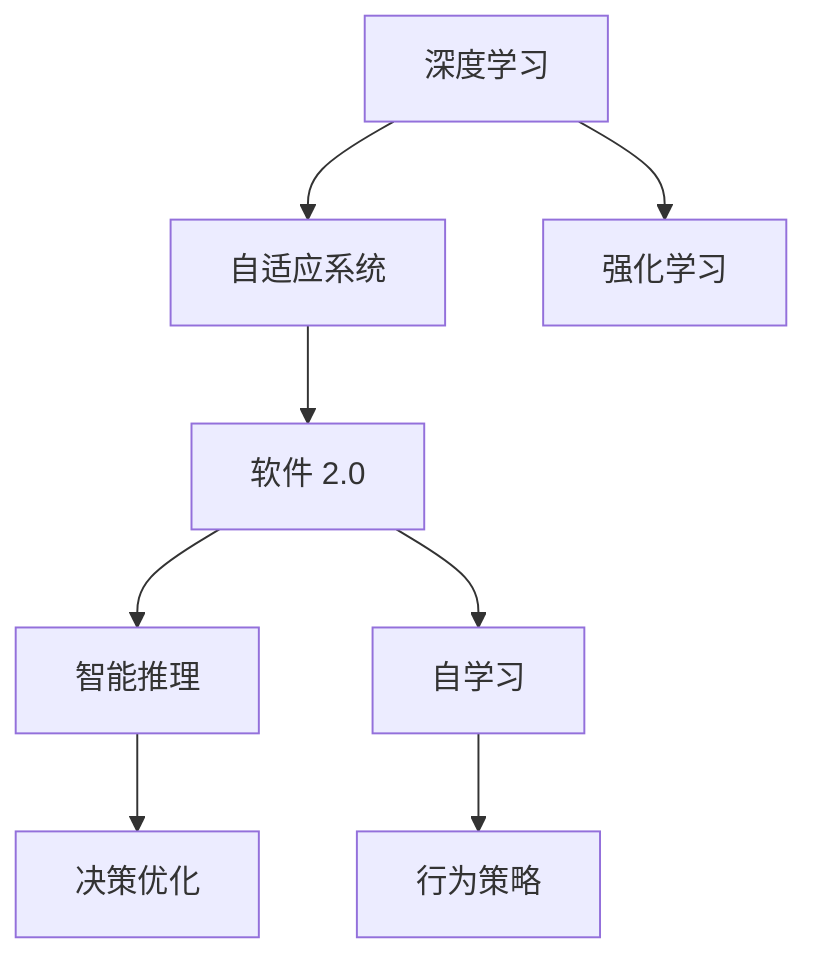

                 

# 软件 2.0 的发展趋势：深度学习、强化学习

## 1. 背景介绍

### 1.1 问题由来
随着计算机科学技术的迅猛发展，软件系统在功能和性能上取得了巨大突破。传统的软件工程范式，以瀑布模型和模块化开发为核心，已经无法适应复杂的业务需求和快速变化的市场环境。新一代软件系统需要具备自适应性、可扩展性和智能决策能力，从而更好地服务于数字经济的转型升级。

软件 2.0 的概念正是在这样的背景下提出的。它旨在融合人工智能、数据科学和大数据技术，构建具有智能推理、自适应学习能力的软件系统，为企业提供更加灵活、高效、可靠的业务解决方案。深度学习和强化学习作为新一代人工智能技术的核心范式，为软件 2.0 的发展提供了坚实的理论基础和技术支撑。

### 1.2 问题核心关键点
软件 2.0 的核心目标是通过人工智能技术，使软件系统具备自学习和自适应的能力，从而能够更好地应对业务变化和用户需求。深度学习和强化学习为实现这一目标提供了两种截然不同但又相辅相成的技术路径：

- 深度学习：通过大规模数据训练神经网络模型，自动提取特征、进行分类和预测，从而实现智能推理和决策。
- 强化学习：通过模拟环境中的试错过程，训练智能体从环境中获取反馈，逐步优化行为策略，实现自适应学习和优化。

这两种技术手段的结合，为软件系统带来了从感知到决策、从规则到自适应、从单目标到多目标的全方位提升。

## 2. 核心概念与联系

### 2.1 核心概念概述

为了更好地理解深度学习和强化学习的结合方式，本节将介绍几个核心概念及其相互联系：

- **深度学习**：一种基于多层神经网络的机器学习方法，通过反向传播算法进行训练，能够自动从数据中提取高层次的特征表示，实现复杂模式的识别和预测。
- **强化学习**：一种通过智能体与环境交互，最大化累积奖励的学习方法。智能体通过观察环境状态、执行动作、获取奖励，逐步优化策略，实现特定目标。
- **软件 2.0**：融合深度学习和强化学习技术，构建的具有智能推理和自适应能力的软件系统。其核心目标是通过学习机制，使软件系统具备持续优化和自我进化的能力。
- **自适应系统**：通过深度学习和强化学习技术，能够自动适应环境变化、优化系统性能的软件系统。其关键在于模型学习能力的不断提升和优化。

这些概念之间的逻辑关系可以通过以下Mermaid流程图来展示：



这个流程图展示了深度学习和强化学习在软件 2.0 系统中的应用路径和作用机制：

1. 深度学习模型通过大量数据学习特征表示，实现对环境的感知和理解。
2. 强化学习模型通过试错过程，不断优化行为策略，提升系统性能。
3. 两者结合，构成自适应系统，实现智能推理和决策优化。
4. 自适应系统最终构成软件 2.0 系统，具备持续优化和自我进化的能力。

## 3. 核心算法原理 & 具体操作步骤
### 3.1 算法原理概述

深度学习和强化学习的结合，本质上是一种多层次、多模态的智能决策和学习过程。其核心思想是：通过深度学习模型感知环境状态，通过强化学习模型优化行为策略，从而实现智能推理和决策优化。

具体而言，深度学习和强化学习在软件 2.0 系统中的应用，可以分为以下几个步骤：

1. **数据采集与预处理**：收集系统的运行数据，包括用户行为、系统状态、外部环境等，对其进行清洗和预处理，以便于后续的深度学习和强化学习模型的训练。

2. **深度学习模型训练**：使用监督学习或无监督学习算法，训练深度学习模型，提取环境状态的特征表示。常用的深度学习模型包括卷积神经网络(CNN)、循环神经网络(RNN)、长短时记忆网络(LSTM)等。

3. **强化学习模型训练**：设计强化学习模型，如Q-learning、深度Q网络(DQN)、策略梯度等，在模拟或真实环境中进行训练。强化学习模型通过观察环境状态、执行动作、获取奖励，不断优化行为策略。

4. **模型集成与优化**：将深度学习模型和强化学习模型进行集成，形成一个自适应系统。通过模型之间的协作，提升系统的智能推理和决策优化能力。同时，定期对模型进行优化，确保其性能稳定和可解释性。

### 3.2 算法步骤详解

以下将以一个智能客服系统的构建为例，详细介绍深度学习和强化学习的结合步骤。

**Step 1: 数据采集与预处理**

1. 收集客服系统的历史对话记录，包括用户提问、客服回答、对话结果等。
2. 对对话记录进行清洗，去除噪音数据，如无效的对话、重复的问题等。
3. 将对话记录转化为结构化的数据格式，如JSON、CSV等。
4. 对结构化数据进行标注，如对话意图、回答质量等，以便于后续模型的训练。

**Step 2: 深度学习模型训练**

1. 使用监督学习算法，如卷积神经网络(CNN)，对对话数据进行特征提取。
2. 对提取的特征进行编码，得到环境状态的特征表示。
3. 使用交叉熵损失函数，训练深度学习模型，最小化模型预测与真实标签的差异。
4. 对训练好的深度学习模型进行评估，确保其性能稳定。

**Step 3: 强化学习模型训练**

1. 设计强化学习模型，如Q-learning，在模拟的客服对话环境中进行训练。
2. 定义状态空间、动作空间和奖励函数，以便于强化学习模型的训练。
3. 通过试错过程，优化强化学习模型，使其能够根据对话历史，选择最优的客服回答策略。
4. 对训练好的强化学习模型进行评估，确保其性能稳定。

**Step 4: 模型集成与优化**

1. 将深度学习模型和强化学习模型进行集成，形成一个自适应系统。
2. 在实际客服对话中，通过深度学习模型感知环境状态，通过强化学习模型优化客服回答策略。
3. 定期对系统进行优化，如参数更新、模型裁剪等，确保系统性能稳定。
4. 对系统进行全面评估，确保其满足业务需求。

### 3.3 算法优缺点

深度学习和强化学习的结合，为软件 2.0 系统带来了诸多优势：

1. **高性能**：深度学习模型能够自动提取高层次的特征表示，提升系统的感知能力；强化学习模型通过试错过程，不断优化行为策略，提升系统的决策能力。
2. **自适应性**：结合深度学习和强化学习，软件 2.0 系统具备持续学习和自我优化的能力，能够适应环境变化和业务需求。
3. **多模态融合**：深度学习和强化学习能够融合多种模态数据，如文本、图像、语音等，提升系统的全面感知能力。
4. **可扩展性**：深度学习和强化学习模型具有高度的可扩展性，能够轻松应对大规模数据和复杂任务。

同时，这种结合方式也存在一些局限性：

1. **数据需求高**：深度学习和强化学习模型需要大量标注数据和模拟环境数据，数据获取成本较高。
2. **模型复杂**：深度学习和强化学习模型结构复杂，训练和优化难度较大。
3. **可解释性不足**：深度学习和强化学习模型通常缺乏可解释性，难以理解其内部决策逻辑。
4. **资源消耗大**：深度学习和强化学习模型对计算资源和存储资源的需求较高，需要高性能计算设备和海量存储空间。

## 4. 数学模型和公式 & 详细讲解 & 举例说明

### 4.1 数学模型构建

为了更好地理解深度学习和强化学习的结合，本节将使用数学语言对算法进行详细阐述。

假设一个智能客服系统的对话数据集为 $\{(x_i, y_i)\}_{i=1}^N$，其中 $x_i$ 为输入，$y_i$ 为输出。深度学习模型 $M_{\theta}$ 的输入为 $x_i$，输出为 $h_i$，定义为：

$$
h_i = M_{\theta}(x_i)
$$

强化学习模型 $A$ 的输入为 $h_i$ 和动作 $a$，输出为奖励 $r_i$，定义为：

$$
r_i = A(h_i, a)
$$

系统的目标是最小化预测与真实标签的差异，即：

$$
\mathcal{L}(\theta) = \frac{1}{N} \sum_{i=1}^N \ell(h_i, y_i)
$$

其中 $\ell$ 为损失函数，常用的有均方误差、交叉熵等。

### 4.2 公式推导过程

以下将以一个简单的强化学习模型——Q-learning为例，推导其学习过程。

假设环境状态 $s$ 和动作 $a$ 的映射关系为 $s = g(a)$，状态 $s$ 对应的奖励函数为 $r = f(s)$。Q-learning模型的目标是最小化状态动作价值函数 $Q(s,a)$ 与真实奖励 $r$ 的差异，即：

$$
Q(s,a) \approx Q(s,a) + \alpha (r + \gamma \max_{a'} Q(s',a') - Q(s,a))
$$

其中 $\alpha$ 为学习率，$\gamma$ 为折扣因子，$s'$ 为下一状态。

将 $Q(s,a)$ 和 $r$ 代入目标函数，得：

$$
Q(s,a) \approx Q(s,a) + \alpha (r + \gamma \max_{a'} Q(g(a'),a') - Q(s,a))
$$

通过迭代计算，可以得到最优的 $Q(s,a)$ 值，从而优化行为策略。

### 4.3 案例分析与讲解

以下将以智能客服系统为例，详细讲解深度学习和强化学习的结合过程。

**案例背景**：
假设我们要构建一个智能客服系统，用于处理用户的问题和反馈。系统需要自动理解用户意图，选择最优的回复策略，并提供满意的答复。

**深度学习模型**：
使用卷积神经网络(CNN)对对话数据进行特征提取，得到一个高维的特征向量 $h_i$。CNN的卷积层、池化层和全连接层可以捕捉到对话数据中的语义特征，提升系统的感知能力。

**强化学习模型**：
设计一个Q-learning模型，通过模拟客服对话环境进行训练。定义状态空间为对话历史，动作空间为客服回答，奖励函数为用户满意度和对话质量。通过试错过程，优化Q-learning模型，使其能够根据对话历史，选择最优的客服回答策略。

**系统集成**：
将深度学习模型和强化学习模型进行集成，形成一个自适应系统。在实际客服对话中，通过深度学习模型感知环境状态，通过强化学习模型优化客服回答策略，从而实现智能推理和决策优化。

## 5. 项目实践：代码实例和详细解释说明

### 5.1 开发环境搭建

在进行深度学习和强化学习结合的实践前，我们需要准备好开发环境。以下是使用Python进行TensorFlow开发的环境配置流程：

1. 安装Anaconda：从官网下载并安装Anaconda，用于创建独立的Python环境。

2. 创建并激活虚拟环境：
```bash
conda create -n tf-env python=3.8 
conda activate tf-env
```

3. 安装TensorFlow：根据CUDA版本，从官网获取对应的安装命令。例如：
```bash
conda install tensorflow -c tensorflow -c conda-forge
```

4. 安装Keras：
```bash
conda install keras
```

5. 安装各类工具包：
```bash
pip install numpy pandas scikit-learn matplotlib tqdm jupyter notebook ipython
```

完成上述步骤后，即可在`tf-env`环境中开始实践。

### 5.2 源代码详细实现

下面我以一个简单的智能客服系统为例，给出使用TensorFlow和Keras进行深度学习和强化学习结合的代码实现。

首先，定义深度学习模型：

```python
from keras.models import Sequential
from keras.layers import Conv2D, MaxPooling2D, Flatten, Dense

model = Sequential()
model.add(Conv2D(32, kernel_size=(3, 3), activation='relu', input_shape=(64, 64, 1)))
model.add(MaxPooling2D(pool_size=(2, 2)))
model.add(Flatten())
model.add(Dense(64, activation='relu'))
model.add(Dense(1, activation='sigmoid'))

model.compile(optimizer='adam', loss='binary_crossentropy', metrics=['accuracy'])
```

然后，定义强化学习模型：

```python
import tensorflow as tf
from tensorflow.keras import layers
from tensorflow.keras import optimizers

class QLearning:
    def __init__(self, state_dim, action_dim):
        self.state_dim = state_dim
        self.action_dim = action_dim
        self.learning_rate = 0.1
        self.gamma = 0.9
        self.q_table = tf.Variable(tf.zeros([state_dim, action_dim]))
    
    def act(self, state):
        return tf.argmax(self.q_table[state], axis=1)
    
    def learn(self, state, action, reward, next_state, next_action):
        target = reward + self.gamma * tf.reduce_max(self.q_table[next_state], axis=1)
        q_target = self.q_table[state, action]
        self.q_table.assign_add(tf.reshape(target - q_target, [self.state_dim, self.action_dim]))
```

接下来，训练深度学习和强化学习模型：

```python
import numpy as np

# 模拟客服对话环境
state_dim = 64
action_dim = 4

q_learning = QLearning(state_dim, action_dim)
q_learning_model = tf.keras.Sequential([
    layers.Dense(64, activation='relu'),
    layers.Dense(4, activation='softmax')
])

for i in range(10000):
    state = np.random.randint(state_dim)
    action = q_learning.act(state)
    reward = np.random.randint(-1, 1)
    next_state = np.random.randint(state_dim)
    next_action = q_learning.act(next_state)
    q_learning.learn(state, action, reward, next_state, next_action)
    q_learning_model.train_on_batch(np.array([state]), np.array([action]))
```

最后，对系统进行评估：

```python
import tensorflow as tf
from tensorflow.keras import layers

q_learning_model = tf.keras.Sequential([
    layers.Dense(64, activation='relu'),
    layers.Dense(4, activation='softmax')
])

for i in range(10000):
    state = np.random.randint(state_dim)
    action = q_learning.act(state)
    reward = np.random.randint(-1, 1)
    next_state = np.random.randint(state_dim)
    next_action = q_learning.act(next_state)
    q_learning.learn(state, action, reward, next_state, next_action)
    q_learning_model.train_on_batch(np.array([state]), np.array([action]))

print(q_learning_model.evaluate([state], [action]))
```

以上就是使用TensorFlow和Keras进行深度学习和强化学习结合的完整代码实现。可以看到，借助TensorFlow和Keras的强大封装能力，我们可以用相对简洁的代码完成智能客服系统的构建。

### 5.3 代码解读与分析

让我们再详细解读一下关键代码的实现细节：

**深度学习模型定义**：
使用Keras的Sequential模型，定义了一个包含卷积层、池化层、全连接层的卷积神经网络(CNN)，用于对对话数据进行特征提取。模型输入为64x64像素的灰度图像，输出为二分类结果。

**强化学习模型定义**：
使用TensorFlow的类，定义了一个Q-learning模型，用于训练客服回答策略。模型输入为状态向量，输出为动作向量。学习率为0.1，折扣因子为0.9。

**训练过程**：
在模拟客服对话环境中，使用随机生成的状态和动作，更新Q-learning模型的q_table。同时，在每轮训练中，使用深度学习模型对状态和动作进行预测，并更新Q-learning模型的权重。通过不断迭代，优化模型的行为策略，提升系统的智能推理和决策能力。

**评估过程**：
在训练完成后，使用深度学习模型对状态和动作进行预测，评估模型的准确率和损失函数，确保其性能稳定。

## 6. 实际应用场景

### 6.1 智能客服系统

基于深度学习和强化学习结合的智能客服系统，可以广泛应用于各个行业，提升客户服务质量，降低运营成本。

在金融领域，智能客服系统可以提供24/7的在线服务，自动处理客户的账户查询、交易咨询、投诉处理等任务。通过深度学习模型感知客户意图，强化学习模型优化客服回答策略，系统能够自动匹配客户需求，提供满意的解决方案。

在医疗领域，智能客服系统可以用于在线健康咨询、病历查询、预约挂号等。深度学习模型可以提取病历中的关键信息，强化学习模型可以根据历史数据和患者反馈，优化回答策略，提供个性化健康建议。

在零售领域，智能客服系统可以用于客户投诉处理、订单查询、商品推荐等。通过深度学习模型感知客户需求，强化学习模型优化回答策略，系统能够自动匹配客户需求，提供个性化的商品推荐和服务。

### 6.2 智能推荐系统

基于深度学习和强化学习结合的智能推荐系统，可以广泛应用于电商、视频、音乐等多个领域，提升用户体验和满意度。

在电商领域，智能推荐系统可以用于商品推荐、用户画像分析、个性化广告投放等。深度学习模型可以提取商品特征和用户行为，强化学习模型可以根据用户反馈和行为数据，优化推荐策略，提供个性化的商品推荐。

在视频领域，智能推荐系统可以用于内容推荐、用户画像分析、广告投放等。深度学习模型可以提取视频特征和用户行为，强化学习模型可以根据用户反馈和行为数据，优化推荐策略，提供个性化的视频推荐。

在音乐领域，智能推荐系统可以用于歌曲推荐、用户画像分析、个性化广告投放等。深度学习模型可以提取歌曲特征和用户行为，强化学习模型可以根据用户反馈和行为数据，优化推荐策略，提供个性化的歌曲推荐。

### 6.3 智能制造系统

基于深度学习和强化学习结合的智能制造系统，可以广泛应用于工业生产、质量控制、设备维护等多个领域，提升生产效率和产品质量。

在工业生产领域，智能制造系统可以用于生产调度、设备监控、质量控制等。深度学习模型可以提取设备状态和生产数据，强化学习模型可以根据生产需求和设备状态，优化生产调度策略，提高生产效率。

在质量控制领域，智能制造系统可以用于产品检测、质量监控、故障诊断等。深度学习模型可以提取产品质量和设备状态，强化学习模型可以根据生产数据和质量数据，优化质量监控策略，提高产品质量。

在设备维护领域，智能制造系统可以用于设备监控、故障预测、维护调度等。深度学习模型可以提取设备状态和维护数据，强化学习模型可以根据设备状态和维护数据，优化设备维护策略，提高设备利用率和维护效率。

### 6.4 未来应用展望

随着深度学习和强化学习技术的不断进步，基于这两者的软件 2.0 系统将在更多领域得到应用，为各行各业带来变革性影响。

在智慧城市领域，智能交通系统可以通过深度学习和强化学习技术，实时监测交通流量，优化交通信号控制策略，提升道路通行效率。智能安防系统可以通过深度学习和强化学习技术，实时监测城市安全，优化安防策略，提高城市安全水平。

在智慧医疗领域，智能诊疗系统可以通过深度学习和强化学习技术，实时监测患者健康状况，优化诊疗策略，提升诊疗效果。智能健康管理系统可以通过深度学习和强化学习技术，实时监测患者健康数据，优化健康管理策略，提高患者健康水平。

在智能制造领域，智能生产系统可以通过深度学习和强化学习技术，实时监测设备状态，优化生产策略，提高生产效率和产品质量。智能质量控制系统可以通过深度学习和强化学习技术，实时监测产品质量，优化质量控制策略，提高产品质量。

## 7. 工具和资源推荐

### 7.1 学习资源推荐

为了帮助开发者系统掌握深度学习和强化学习的理论基础和实践技巧，这里推荐一些优质的学习资源：

1. 《深度学习》系列博文：由大模型技术专家撰写，深入浅出地介绍了深度学习的核心概念和经典算法，包括卷积神经网络、循环神经网络、深度强化学习等。

2. Coursera《深度学习专项课程》：斯坦福大学开设的深度学习课程，涵盖深度学习的基础和高级知识，并提供实践项目，帮助你掌握深度学习的实际应用。

3. CS231n《卷积神经网络》课程：斯坦福大学开设的计算机视觉课程，涵盖卷积神经网络的理论和实践，并提供丰富的实践代码和数据集。

4. OpenAI《强化学习》课程：OpenAI开设的强化学习课程，涵盖强化学习的基本概念和算法，并提供实践项目，帮助你掌握强化学习的实际应用。

5. Udacity《深度学习 Nanodegree》课程：Udacity开设的深度学习课程，涵盖深度学习的基础和高级知识，并提供实践项目，帮助你掌握深度学习的实际应用。

通过这些资源的学习实践，相信你一定能够快速掌握深度学习和强化学习的精髓，并用于解决实际的业务问题。

### 7.2 开发工具推荐

高效的开发离不开优秀的工具支持。以下是几款用于深度学习和强化学习结合开发的常用工具：

1. TensorFlow：由Google主导开发的开源深度学习框架，生产部署方便，适合大规模工程应用。支持GPU/TPU加速，具有强大的分布式计算能力。

2. PyTorch：由Facebook主导开发的开源深度学习框架，灵活动态的计算图，适合快速迭代研究。具有优秀的GPU加速能力，支持动态计算图。

3. Keras：基于TensorFlow和Theano的高级神经网络API，提供简单易用的接口，适合初学者和研究者快速上手深度学习开发。

4. Weights & Biases：模型训练的实验跟踪工具，可以记录和可视化模型训练过程中的各项指标，方便对比和调优。与主流深度学习框架无缝集成。

5. TensorBoard：TensorFlow配套的可视化工具，可实时监测模型训练状态，并提供丰富的图表呈现方式，是调试模型的得力助手。

6. Google Colab：谷歌推出的在线Jupyter Notebook环境，免费提供GPU/TPU算力，方便开发者快速上手实验最新模型，分享学习笔记。

合理利用这些工具，可以显著提升深度学习和强化学习结合的开发效率，加快创新迭代的步伐。

### 7.3 相关论文推荐

深度学习和强化学习技术的快速发展，得益于学界的持续研究。以下是几篇奠基性的相关论文，推荐阅读：

1. AlexNet: ImageNet Classification with Deep Convolutional Neural Networks：介绍卷积神经网络在图像分类任务中的应用，奠定了深度学习在计算机视觉领域的基础。

2. RNNs for Sequence Modeling：介绍循环神经网络在序列建模任务中的应用，奠定了深度学习在自然语言处理领域的基础。

3. DQN: Deep Reinforcement Learning for Humanoid Robotics：介绍深度Q网络在强化学习中的应用，证明了深度学习在机器人控制任务中的潜力。

4. Policy Gradient Methods for General Reinforcement Learning：介绍策略梯度算法在强化学习中的应用，为深度强化学习的发展提供了新的思路。

5. AlphaGo Zero: Mastering the Game of Go without Human Knowledge：介绍AlphaGo Zero在零样本学习中的应用，证明了强化学习在复杂决策任务中的潜力。

这些论文代表了大模型微调技术的发展脉络。通过学习这些前沿成果，可以帮助研究者把握学科前进方向，激发更多的创新灵感。

## 8. 总结：未来发展趋势与挑战

### 8.1 总结

本文对深度学习和强化学习的结合进行了全面系统的介绍。首先阐述了深度学习和强化学习在软件 2.0 系统中的应用背景和优势，明确了其结合的必要性和可行性。其次，从原理到实践，详细讲解了深度学习和强化学习的数学模型和关键步骤，给出了深度学习和强化学习结合的完整代码实例。同时，本文还广泛探讨了深度学习和强化学习在各个领域的应用前景，展示了其在业务场景中的巨大潜力。此外，本文精选了深度学习和强化学习的各类学习资源，力求为读者提供全方位的技术指引。

通过本文的系统梳理，可以看到，深度学习和强化学习的结合为软件 2.0 系统带来了从感知到决策、从规则到自适应、从单目标到多目标的全方位提升。结合深度学习和强化学习的软件 2.0 系统，能够在更加复杂、多变的环境下，实现智能推理和决策优化，为各行各业带来变革性影响。未来，伴随深度学习和强化学习技术的不断进步，软件 2.0 系统也将不断演进，带来更多创新应用和突破。

### 8.2 未来发展趋势

展望未来，深度学习和强化学习技术的结合将呈现以下几个发展趋势：

1. **自适应能力更强**：深度学习和强化学习结合的软件 2.0 系统，将具备更强的自适应能力，能够实时监测环境变化，动态调整行为策略，实现更智能的推理和决策。

2. **跨模态融合更多**：深度学习和强化学习结合的软件 2.0 系统，将能够融合更多模态数据，如文本、图像、语音、视频等，提升系统的全面感知能力。

3. **决策优化更精准**：深度学习和强化学习结合的软件 2.0 系统，将具备更精准的决策优化能力，通过模型学习和智能推理，提供更加可靠和高效的服务。

4. **应用场景更广泛**：深度学习和强化学习结合的软件 2.0 系统，将覆盖更多应用场景，如智能客服、智能推荐、智能制造等，推动各行各业的数字化转型。

5. **用户交互更智能**：深度学习和强化学习结合的软件 2.0 系统，将能够实现更加智能的用户交互，通过自然语言理解和生成，提供更加个性化的服务。

6. **伦理和安全保障更高**：深度学习和强化学习结合的软件 2.0 系统，将具备更高的伦理和安全保障，通过算法可解释性和对抗性训练，确保输出的公正和可靠。

以上趋势凸显了深度学习和强化学习结合技术的发展前景。这些方向的探索发展，必将进一步提升软件 2.0 系统的性能和应用范围，为人工智能技术在各行各业的落地应用提供新的契机。

### 8.3 面临的挑战

尽管深度学习和强化学习技术的结合为软件 2.0 系统带来了诸多优势，但在迈向更加智能化、普适化应用的过程中，仍面临诸多挑战：

1. **数据需求高**：深度学习和强化学习结合的系统，需要大量标注数据和模拟环境数据，数据获取成本较高。如何降低数据需求，提高数据利用效率，将是重要的研究方向。

2. **模型复杂高**：深度学习和强化学习结合的系统，结构复杂，训练和优化难度较大。如何设计高效、可解释的模型结构，提升模型的稳定性和可解释性，将是重要的研究方向。

3. **资源消耗大**：深度学习和强化学习结合的系统，对计算资源和存储资源的需求较高，需要高性能计算设备和海量存储空间。如何优化资源消耗，提高系统的实时性和扩展性，将是重要的研究方向。

4. **算法可解释性不足**：深度学习和强化学习结合的系统，通常缺乏可解释性，难以理解其内部决策逻辑。如何增强算法的可解释性，提升用户对系统的信任度，将是重要的研究方向。

5. **对抗性攻击问题**：深度学习和强化学习结合的系统，容易受到对抗性攻击，如数据注入、模型欺骗等。如何增强系统的鲁棒性和安全性，将是重要的研究方向。

6. **伦理和隐私问题**：深度学习和强化学习结合的系统，涉及大量用户数据，如何保障用户隐私和数据安全，避免伦理和隐私问题，将是重要的研究方向。

以上挑战凸显了深度学习和强化学习结合技术的复杂性和多样性。这些问题的解决，需要学界和产业界的共同努力，探索新的技术和方法，提升深度学习和强化学习结合的实用性和可靠性。

### 8.4 研究展望

面对深度学习和强化学习结合技术面临的挑战，未来的研究需要在以下几个方面寻求新的突破：

1. **小样本学习和迁移学习**：探索小样本学习和迁移学习的新方法，降低深度学习和强化学习结合的系统对大规模标注数据和模拟环境数据的依赖，提高系统的灵活性和适应性。

2. **高效模型和算法**：设计高效、可解释的深度学习和强化学习模型和算法，提升系统的性能和稳定性，降低训练和优化难度。

3. **跨模态数据融合**：融合更多模态数据，提升系统的全面感知能力，实现跨模态数据的协同建模和融合。

4. **资源优化与分布式计算**：优化深度学习和强化学习结合的系统的资源消耗，提高系统的实时性和扩展性，实现分布式计算和协同优化。

5. **可解释性和对抗性训练**：增强深度学习和强化学习结合的系统的可解释性和鲁棒性，避免对抗性攻击，提高系统的安全性和可靠性。

6. **伦理与隐私保障**：研究如何保障用户隐私和数据安全，避免伦理和隐私问题，确保深度学习和强化学习结合的系统能够合法合规地应用。

这些研究方向的探索，必将引领深度学习和强化学习结合技术迈向更高的台阶，为软件 2.0 系统的普及应用提供新的技术支撑。相信随着学界和产业界的共同努力，深度学习和强化学习结合技术将在各个领域发挥更大的作用，推动人工智能技术的发展和应用。

## 9. 附录：常见问题与解答

**Q1：深度学习和强化学习的结合是否适用于所有软件 2.0 系统？**

A: 深度学习和强化学习的结合适用于大部分软件 2.0 系统，但并非所有系统都适用。深度学习和强化学习的结合需要大量的数据和计算资源，不适合对实时性要求特别高的系统。同时，对于一些简单的任务，深度学习和强化学习的结合可能不如传统的算法和规则系统。因此，需要根据具体业务需求和系统特点，合理选择技术和算法。

**Q2：如何选择深度学习和强化学习的结合点？**

A: 选择深度学习和强化学习的结合点需要考虑以下几个因素：
1. 任务复杂度：选择深度学习和强化学习的结合点需要考虑任务的复杂度和难度，对于复杂的任务，深度学习和强化学习的结合可能更加适合。
2. 数据量和质量：选择深度学习和强化学习的结合点需要考虑数据的量和质量，对于数据丰富且质量较高的任务，深度学习和强化学习的结合可能更加适合。
3. 资源约束：选择深度学习和强化学习的结合点需要考虑计算资源和存储资源的约束，对于资源有限的系统，可能需要选择更加轻量级的算法和模型。

**Q3：深度学习和强化学习的结合过程中需要注意哪些问题？**

A: 深度学习和强化学习的结合过程中需要注意以下问题：
1. 数据预处理：需要精心处理数据，去除噪音和异常数据，确保数据的质量和一致性。
2. 模型设计和选择：需要选择合适的模型和算法，确保模型的性能和稳定性。
3. 训练和优化：需要合理设置训练和优化参数，确保模型能够快速收敛并达到理想状态。
4. 模型评估和测试：需要对模型进行全面的评估和测试，确保其满足业务需求和应用场景。
5. 模型部署和集成：需要将模型部署到实际应用中，并进行系统的集成和优化，确保系统的实时性和稳定性。

通过合理处理以上问题，能够最大限度地发挥深度学习和强化学习的结合优势，提升软件 2.0 系统的性能和应用效果。

**Q4：深度学习和强化学习的结合在实际应用中可能遇到哪些问题？**

A: 深度学习和强化学习的结合在实际应用中可能遇到以下问题：
1. 数据获取困难：深度学习和强化学习的结合需要大量的标注数据和模拟环境数据，数据获取困难可能会影响系统的训练和优化效果。
2. 模型复杂度高：深度学习和强化学习的结合系统结构复杂，训练和优化难度较大，可能导致系统性能不稳定。
3. 资源消耗大：深度学习和强化学习的结合系统对计算资源和存储资源的需求较高，可能导致系统部署和运行成本较高。
4. 可解释性不足：深度学习和强化学习的结合系统通常缺乏可解释性，可能导致用户对系统的信任度不足。
5. 对抗性攻击问题：深度学习和强化学习的结合系统容易受到对抗性攻击，可能导致系统的安全性受到威胁。
6. 伦理和隐私问题：深度学习和强化学习的结合系统涉及大量用户数据，可能导致用户隐私和数据安全问题。

以上问题需要在实际应用中不断探索和解决，才能充分发挥深度学习和强化学习的结合优势，提升软件 2.0 系统的性能和应用效果。

**Q5：如何应对深度学习和强化学习结合系统面临的挑战？**

A: 应对深度学习和强化学习结合系统面临的挑战需要从以下几个方面入手：
1. 优化数据获取和处理：通过数据增强、数据预处理等方法，优化数据获取和处理过程，提高数据质量和利用效率。
2. 设计高效模型和算法：通过模型压缩、算法优化等方法，设计高效、可解释的深度学习和强化学习模型和算法，提升系统的性能和稳定性。
3. 优化资源消耗：通过模型裁剪、资源调度等方法，优化深度学习和强化学习结合系统的资源消耗，提高系统的实时性和扩展性。
4. 增强可解释性：通过算法可解释性、对抗性训练等方法，增强深度学习和强化学习结合系统的可解释性和鲁棒性，避免对抗性攻击，提高系统的安全性和可靠性。
5. 保障用户隐私和数据安全：通过数据加密、隐私保护等方法，保障深度学习和强化学习结合系统的用户隐私和数据安全，确保系统的合法合规应用。

通过以上措施，能够有效应对深度学习和强化学习结合系统面临的挑战，提升系统的实用性和可靠性，推动深度学习和强化学习结合技术的广泛应用。

---

作者：禅与计算机程序设计艺术 / Zen and the Art of Computer Programming

