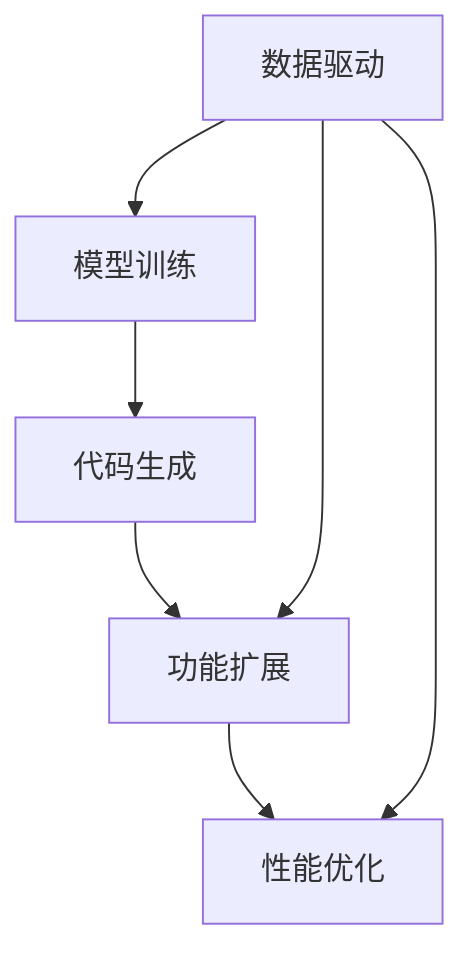

                 

## 1. 背景介绍

### 1.1 问题由来

随着人工智能技术的飞速发展，我们迎来了软件2.0时代——即由数据和算法驱动的软件自动化构建。软件2.0不再依赖传统的编码开发，而是通过模型训练、数据工程等手段，自动生成代码、构建应用程序，使得软件开发更加高效、准确、灵活。这一范式从实验室逐步走向现实，开始改变着软件行业的格局，推动了人工智能在各行各业的深入应用。

### 1.2 问题核心关键点

软件2.0的应用不仅在于算法和模型的进步，更在于其实现方式和广泛应用。其核心关键点包括：

1. 数据驱动：软件2.0系统通过大量数据进行训练，学习模式和规律，从而实现自动生成代码和功能。
2. 算法自动化：利用先进的算法和技术，自动进行模型训练、特征工程、超参数调整等复杂任务。
3. 代码生成：通过模型训练输出代码片段或完整程序，使得软件开发更加高效。
4. 功能扩展：通过微调和迁移学习，自动适应新需求和环境变化，提供动态功能扩展。
5. 性能优化：自动化的模型和算法优化手段，提升软件系统的性能和稳定性。

### 1.3 问题研究意义

研究软件2.0的应用，对于推动AI技术的商业化、提升软件开发效率、加速各行各业的数字化转型，具有重要意义：

1. 降低开发成本：软件2.0的自动生成能力减少了传统手工编码的劳动量，降低了开发成本。
2. 提升开发效率：自动化的模型和算法优化，使得软件系统能够在短时间内生成高质量的软件。
3. 加速应用落地：软件2.0的灵活性和可扩展性，为各行各业的应用场景提供了快速部署的可能。
4. 促进创新发展：软件2.0的应用，推动了新算法、新架构、新工具的创新，加速了AI技术的普及和应用。
5. 带来技术挑战：软件2.0的应用，伴随着数据质量、算法复杂度、系统稳定性等新的挑战，亟需解决。

## 2. 核心概念与联系

### 2.1 核心概念概述

软件2.0系统包括数据驱动、模型训练、代码生成、功能扩展等多个关键组件，各组件之间的逻辑关系如图示：



1. **数据驱动**：软件2.0系统的核心在于数据驱动，即通过大规模数据进行训练，学习模式和规律，从而实现代码和功能的自动生成。
2. **模型训练**：利用先进的机器学习算法和深度学习框架，对数据进行模型训练，生成预测模型或决策模型。
3. **代码生成**：通过训练好的模型，自动生成代码片段或完整程序，实现自动化开发。
4. **功能扩展**：利用微调和迁移学习等技术，自动适应新需求和环境变化，提供动态功能扩展。
5. **性能优化**：通过自动化的模型和算法优化手段，提升软件系统的性能和稳定性。

### 2.2 核心概念原理和架构的 Mermaid 流程图


### 2.3 核心概念之间的联系

数据驱动是软件2.0系统的基础，模型训练是核心，代码生成和功能扩展是目标，性能优化是保障。各组件之间相互作用，共同驱动软件2.0系统的成功应用。

## 3. 核心算法原理 & 具体操作步骤

### 3.1 算法原理概述

软件2.0系统通常基于机器学习和深度学习算法构建。其核心原理是：

1. **数据驱动**：通过大规模数据进行训练，学习数据之间的模式和规律。
2. **模型训练**：利用先进算法对数据进行模型训练，生成预测模型或决策模型。
3. **代码生成**：通过训练好的模型，自动生成代码片段或完整程序。
4. **功能扩展**：利用微调和迁移学习等技术，自动适应新需求和环境变化，提供动态功能扩展。
5. **性能优化**：通过自动化的模型和算法优化手段，提升软件系统的性能和稳定性。

### 3.2 算法步骤详解

软件2.0系统的构建过程大致如下：

1. **数据收集与预处理**：收集大规模数据，进行数据清洗、特征提取、数据增强等预处理操作。
2. **模型训练**：利用深度学习框架进行模型训练，生成预测模型或决策模型。
3. **代码生成**：将训练好的模型转化为代码片段或完整程序，自动生成软件功能。
4. **功能扩展**：通过微调和迁移学习，自动适应新需求和环境变化，提供动态功能扩展。
5. **性能优化**：利用自动化的模型和算法优化手段，提升软件系统的性能和稳定性。

### 3.3 算法优缺点

软件2.0系统具有以下优点：

1. **高效开发**：通过自动化的模型和代码生成，大幅提升了软件开发的效率。
2. **灵活性高**：通过微调和迁移学习，系统能够快速适应新需求和环境变化。
3. **质量可靠**：基于数据驱动和模型训练，生成的代码具有较高的质量和可靠性。
4. **成本低**：减少了手工编码的劳动量，降低了软件开发成本。

同时，软件2.0系统也存在以下缺点：

1. **数据依赖**：系统高度依赖于数据质量和数据量，数据质量不高或数据量不足可能导致模型失效。
2. **算法复杂**：构建和维护高级算法模型需要较高技术门槛，对数据工程师和算法工程师的需求较高。
3. **性能波动**：模型训练和代码生成的过程可能会受到算法、数据、硬件等因素的影响，导致性能波动。
4. **维护难度**：自动生成的代码和系统可能存在难以调试和维护的问题。

### 3.4 算法应用领域

软件2.0系统在众多领域得到了广泛应用，包括但不限于：

1. **自然语言处理**：自动生成文本生成模型，用于机器翻译、文本摘要、对话系统等。
2. **计算机视觉**：自动生成图像识别模型，用于图像分类、目标检测、图像生成等。
3. **推荐系统**：自动生成推荐模型，用于电商、视频、音乐等领域的内容推荐。
4. **数据分析**：自动生成数据分析模型，用于数据预处理、特征工程、模型训练等。
5. **自动化运维**：自动生成运维自动化脚本，用于监控、告警、故障处理等。
6. **智能客服**：自动生成智能客服系统，用于自动解答客户咨询，提供7x24小时服务。

## 4. 数学模型和公式 & 详细讲解 & 举例说明

### 4.1 数学模型构建

软件2.0系统通常基于深度学习模型进行构建。以自然语言处理（NLP）为例，其核心数学模型为编码器-解码器模型，结构如图示：


其中，编码器将输入文本转化为高维向量表示，解码器将向量表示转化为输出文本，如图示：


### 4.2 公式推导过程

以编码器-解码器模型为例，推导其基本公式。

设输入文本为 $x=\{w_1, w_2, \ldots, w_n\}$，其中 $w_i$ 为单词，向量表示为 $x^{\text{enc}}$。解码器输出文本为 $y=\{y_1, y_2, \ldots, y_m\}$，其中 $y_i$ 为单词，向量表示为 $y^{\text{dec}}$。

编码器的输入为 $x$，输出为 $x^{\text{enc}}$，公式为：

$$
x^{\text{enc}} = f_{\text{enc}}(x, h_0)
$$

其中 $h_0$ 为编码器初始状态，$f_{\text{enc}}$ 为编码器函数。

解码器的输入为 $x^{\text{enc}}$ 和 $y_1$，输出为 $y_2$ 及其向量表示 $y^{\text{dec}}$，公式为：

$$
y_2, y^{\text{dec}} = f_{\text{dec}}(y_1, x^{\text{enc}}, h_1)
$$

其中 $h_1$ 为解码器初始状态，$f_{\text{dec}}$ 为解码器函数。

通过不断迭代上述过程，解码器输出完整的文本序列 $y$。

### 4.3 案例分析与讲解

以文本生成为例，分析其基本原理和实现步骤。

**步骤1：数据准备**  
收集大规模语料库，如新闻、小说、博客等，进行文本预处理，去除停用词、标点符号等。

**步骤2：模型训练**  
使用深度学习框架（如PyTorch、TensorFlow等）构建编码器-解码器模型，进行模型训练。训练过程包括数据输入、前向传播、损失计算、反向传播等步骤。

**步骤3：代码生成**  
将训练好的模型转化为代码片段或完整程序，使用高级编程语言（如Python、C++等）实现。以NLP模型为例，可以生成文本生成代码，用于自动生成文本内容。

**步骤4：功能扩展**  
通过微调和迁移学习，自动适应新需求和环境变化，提供动态功能扩展。如根据用户输入生成特定主题的文本内容，或对生成的文本进行情感分析等。

## 5. 项目实践：代码实例和详细解释说明

### 5.1 开发环境搭建

1. **安装Anaconda**  
从官网下载并安装Anaconda，用于创建独立的Python环境。

```bash
conda install anaconda
```

2. **创建并激活虚拟环境**  
创建一个新的Python环境，并激活。

```bash
conda create -n py2
conda activate py2
```

3. **安装PyTorch**  
使用Anaconda安装PyTorch。

```bash
conda install pytorch torchvision torchaudio cudatoolkit=11.1 -c pytorch -c conda-forge
```

4. **安装Transformer库**  
使用Pip安装Transformer库。

```bash
pip install transformers
```

5. **安装其他工具包**  
安装必要的工具包，如Numpy、Pandas、Scikit-learn、Matplotlib、Tqdm等。

```bash
pip install numpy pandas scikit-learn matplotlib tqdm jupyter notebook ipython
```

完成上述步骤后，即可在虚拟环境中开始项目开发。

### 5.2 源代码详细实现

以下以文本生成为例，给出使用Transformer库进行NLP模型微调的PyTorch代码实现。

首先，定义模型和优化器：

```python
from transformers import AutoTokenizer, AutoModelForCausalLM

tokenizer = AutoTokenizer.from_pretrained('gpt2')
model = AutoModelForCausalLM.from_pretrained('gpt2')

optimizer = AdamW(model.parameters(), lr=2e-5)
```

然后，定义训练函数：

```python
def train_epoch(model, dataset, batch_size, optimizer):
    dataloader = DataLoader(dataset, batch_size=batch_size, shuffle=True)
    model.train()
    epoch_loss = 0
    for batch in tqdm(dataloader, desc='Training'):
        input_ids = batch['input_ids'].to(device)
        attention_mask = batch['attention_mask'].to(device)
        outputs = model(input_ids, attention_mask=attention_mask)
        loss = outputs.loss
        epoch_loss += loss.item()
        loss.backward()
        optimizer.step()
    return epoch_loss / len(dataloader)
```

接着，定义评估函数：

```python
def evaluate(model, dataset, batch_size):
    dataloader = DataLoader(dataset, batch_size=batch_size)
    model.eval()
    preds, labels = [], []
    with torch.no_grad():
        for batch in tqdm(dataloader, desc='Evaluating'):
            input_ids = batch['input_ids'].to(device)
            attention_mask = batch['attention_mask'].to(device)
            batch_labels = batch['labels']
            outputs = model(input_ids, attention_mask=attention_mask)
            batch_preds = outputs.logits.argmax(dim=2).to('cpu').tolist()
            batch_labels = batch_labels.to('cpu').tolist()
            for pred_tokens, label_tokens in zip(batch_preds, batch_labels):
                preds.append(pred_tokens[:len(label_tokens)])
                labels.append(label_tokens)
                
    print(classification_report(labels, preds))
```

最后，启动训练流程并在测试集上评估：

```python
epochs = 5
batch_size = 16

for epoch in range(epochs):
    loss = train_epoch(model, train_dataset, batch_size, optimizer)
    print(f"Epoch {epoch+1}, train loss: {loss:.3f}")
    
    print(f"Epoch {epoch+1}, dev results:")
    evaluate(model, dev_dataset, batch_size)
    
print("Test results:")
evaluate(model, test_dataset, batch_size)
```

以上就是使用PyTorch和Transformer库进行NLP模型微调的完整代码实现。通过上述代码，我们可以高效地构建、训练和评估NLP模型，实现自动文本生成功能。

### 5.3 代码解读与分析

**5.3.1 代码实现步骤**

1. **环境搭建**  
使用Anaconda创建虚拟环境，并激活。
2. **安装依赖库**  
使用Pip安装PyTorch、Transformer等依赖库。
3. **模型加载**  
加载预训练的GPT-2模型和对应的分词器。
4. **模型训练**  
定义训练函数，使用AdamW优化器对模型进行训练。
5. **模型评估**  
定义评估函数，对模型在测试集上的性能进行评估。
6. **模型测试**  
启动训练流程，并在测试集上评估模型性能。

**5.3.2 代码细节分析**

1. **分词器和模型加载**  
使用AutoTokenizer和AutoModelForCausalLM自动加载预训练模型和分词器。
2. **训练函数**  
在每个epoch内，对模型进行前向传播计算损失，反向传播更新模型参数，最后返回epoch的平均损失。
3. **评估函数**  
在测试集上评估模型性能，使用classification_report打印分类指标。
4. **训练流程**  
在指定epoch和batch size下，对模型进行训练，并在每个epoch结束时评估模型性能。

**5.3.3 代码性能优化**

1. **使用DataLoader**  
使用DataLoader实现数据批处理，提高训练效率。
2. **使用tqdm**  
使用tqdm可视化训练过程，提供更好的用户体验。
3. **使用with torch.no_grad()**  
在评估过程中使用with torch.no_grad()，减少计算量，提高评估速度。
4. **使用模型缓存**  
在评估过程中使用模型缓存，避免重复加载模型，提高评估效率。

## 6. 实际应用场景

### 6.1 智能客服系统

智能客服系统是软件2.0应用的重要场景之一。通过自动化的NLP模型，智能客服系统可以自动解答客户咨询，提供7x24小时服务。

具体而言，可以收集企业内部的历史客服对话记录，将问题和最佳答复构建成监督数据，在此基础上对预训练NLP模型进行微调。微调后的模型能够自动理解用户意图，匹配最合适的答复模板进行回复。对于客户提出的新问题，还可以接入检索系统实时搜索相关内容，动态组织生成回答。

### 6.2 金融舆情监测

金融机构需要实时监测市场舆论动向，以便及时应对负面信息传播，规避金融风险。软件2.0的文本生成模型可以应用于金融舆情监测。

具体而言，可以收集金融领域相关的新闻、报道、评论等文本数据，并对其进行主题标注和情感标注。在此基础上对预训练NLP模型进行微调，使其能够自动判断文本属于何种主题，情感倾向是正面、中性还是负面。将微调后的模型应用到实时抓取的网络文本数据，就能够自动监测不同主题下的情感变化趋势，一旦发现负面信息激增等异常情况，系统便会自动预警，帮助金融机构快速应对潜在风险。

### 6.3 个性化推荐系统

当前的推荐系统往往只依赖用户的历史行为数据进行物品推荐，无法深入理解用户的真实兴趣偏好。软件2.0的NLP模型可以应用于个性化推荐系统。

具体而言，可以收集用户浏览、点击、评论、分享等行为数据，提取和用户交互的物品标题、描述、标签等文本内容。将文本内容作为模型输入，用户的后续行为（如是否点击、购买等）作为监督信号，在此基础上微调预训练NLP模型。微调后的模型能够从文本内容中准确把握用户的兴趣点。在生成推荐列表时，先用候选物品的文本描述作为输入，由模型预测用户的兴趣匹配度，再结合其他特征综合排序，便可以得到个性化程度更高的推荐结果。

### 6.4 未来应用展望

随着软件2.0技术的不断发展，其在更多领域的应用前景将更加广阔。

在智慧医疗领域，基于软件2.0的NLP模型可以实现自动病历分析、医生辅助诊疗等功能，提升医疗服务的智能化水平。

在智能教育领域，软件2.0的NLP模型可以应用于自动作业批改、智能学习推荐等功能，因材施教，促进教育公平，提高教学质量。

在智慧城市治理中，软件2.0的NLP模型可以应用于城市事件监测、舆情分析、应急指挥等环节，提高城市管理的自动化和智能化水平，构建更安全、高效的未来城市。

此外，在企业生产、社会治理、文娱传媒等众多领域，软件2.0的应用也将不断涌现，为传统行业数字化转型升级提供新的技术路径。

## 7. 工具和资源推荐

### 7.1 学习资源推荐

为了帮助开发者系统掌握软件2.0的理论基础和实践技巧，这里推荐一些优质的学习资源：

1. 《深度学习》课程：由斯坦福大学开设的深度学习课程，全面介绍了深度学习的基本概念和经典模型。
2. 《自然语言处理综述》论文：综述了自然语言处理的基本理论和技术，适合入门和进阶学习。
3. 《TensorFlow实战Google深度学习框架》书籍：介绍如何使用TensorFlow进行深度学习开发，包括模型训练、代码生成等。
4. 《PyTorch深度学习教程》书籍：介绍如何使用PyTorch进行深度学习开发，包括模型训练、代码生成等。
5. 《自然语言处理：从零开始实现》书籍：介绍如何使用Python实现自然语言处理应用，包括文本生成、情感分析等。

通过对这些资源的学习实践，相信你一定能够快速掌握软件2.0的核心技术和应用方法。

### 7.2 开发工具推荐

高效的开发离不开优秀的工具支持。以下是几款用于软件2.0开发的常用工具：

1. PyTorch：基于Python的开源深度学习框架，灵活动态的计算图，适合快速迭代研究。大部分预训练语言模型都有PyTorch版本的实现。
2. TensorFlow：由Google主导开发的开源深度学习框架，生产部署方便，适合大规模工程应用。同样有丰富的预训练语言模型资源。
3. Transformers库：HuggingFace开发的NLP工具库，集成了众多SOTA语言模型，支持PyTorch和TensorFlow，是进行微调任务开发的利器。
4. Weights & Biases：模型训练的实验跟踪工具，可以记录和可视化模型训练过程中的各项指标，方便对比和调优。与主流深度学习框架无缝集成。
5. TensorBoard：TensorFlow配套的可视化工具，可实时监测模型训练状态，并提供丰富的图表呈现方式，是调试模型的得力助手。

合理利用这些工具，可以显著提升软件2.0开发效率，加快创新迭代的步伐。

### 7.3 相关论文推荐

软件2.0技术的发展源于学界的持续研究。以下是几篇奠基性的相关论文，推荐阅读：

1. 《Attention is All You Need》论文：提出了Transformer结构，开启了NLP领域的预训练大模型时代。
2. 《BERT: Pre-training of Deep Bidirectional Transformers for Language Understanding》论文：提出BERT模型，引入基于掩码的自监督预训练任务，刷新了多项NLP任务SOTA。
3. 《Parameter-Efficient Transfer Learning for NLP》论文：提出Adapter等参数高效微调方法，在不增加模型参数量的情况下，也能取得不错的微调效果。
4. 《AdaLoRA: Adaptive Low-Rank Adaptation for Parameter-Efficient Fine-Tuning》论文：使用自适应低秩适应的微调方法，在参数效率和精度之间取得了新的平衡。
5. 《Prompt Tuning for Conversational Autoresponse Generation》论文：引入基于连续型Prompt的微调范式，为如何充分利用预训练知识提供了新的思路。

这些论文代表了大语言模型微调技术的发展脉络。通过学习这些前沿成果，可以帮助研究者把握学科前进方向，激发更多的创新灵感。

## 8. 总结：未来发展趋势与挑战

### 8.1 总结

本文对软件2.0的应用进行了全面系统的介绍。首先阐述了软件2.0系统的研究背景和意义，明确了其在大规模数据和先进算法驱动下的高效自动化构建能力。其次，从原理到实践，详细讲解了软件2.0系统的构建过程，给出了具体的代码实现。同时，本文还广泛探讨了软件2.0系统在多个行业领域的应用前景，展示了其广阔的发展潜力。

通过本文的系统梳理，可以看到，软件2.0系统通过数据驱动和模型训练，实现了高效、灵活、可靠的自动化软件开发，为NLP技术的产业化进程带来了新的突破。未来，伴随数据科学、算法技术的不断进步，软件2.0系统将在更多领域得到应用，为各行各业的数字化转型提供新的技术路径。

### 8.2 未来发展趋势

展望未来，软件2.0技术将呈现以下几个发展趋势：

1. **自动化程度更高**：随着AI技术的不断进步，软件2.0系统将实现更高级别的自动化，自动生成、调试、优化等全过程将更加智能化。
2. **应用领域更广**：软件2.0技术将逐步渗透到更多领域，如智能制造、智慧农业、医疗健康等，推动各行各业的数字化转型升级。
3. **数据驱动更强**：软件2.0系统将更加依赖数据驱动，通过大规模数据进行训练和优化，实现更高的性能和可靠性。
4. **模型通用性增强**：未来的软件2.0模型将具备更强的通用性和可迁移性，能够适应多种任务和环境变化。
5. **人机协同更加紧密**：软件2.0系统将更加注重人机协同，通过自然语言交互、增强现实等技术，提升用户体验和系统智能。

### 8.3 面临的挑战

尽管软件2.0技术已经取得了显著成就，但在迈向更高级别自动化和智能化应用的过程中，仍面临诸多挑战：

1. **数据质量问题**：软件2.0系统高度依赖于数据质量，数据噪声、数据不平衡等问题可能导致模型失效。
2. **算法复杂性**：高级算法的复杂度较高，对数据工程师和算法工程师的需求较高，开发和维护难度较大。
3. **模型泛化能力**：自动生成的模型在面对新数据和新环境时，泛化能力可能不足，需要进一步优化和改进。
4. **系统鲁棒性**：软件2.0系统在面对复杂环境和异常情况时，鲁棒性可能不足，需要引入更多鲁棒性优化技术。
5. **可解释性问题**：自动生成的模型可能缺乏可解释性，难以理解和调试，需要引入更多可解释性技术。

### 8.4 研究展望

面对软件2.0技术所面临的挑战，未来的研究需要在以下几个方面寻求新的突破：

1. **数据质量提升**：研究高效的数据清洗和增强技术，提升数据质量，减少数据噪声和偏见。
2. **算法优化**：开发更高效的算法，降低算法复杂度，提高算法可维护性和可扩展性。
3. **模型泛化能力提升**：引入更多鲁棒性和泛化能力优化技术，提升模型在新数据和新环境下的表现。
4. **可解释性增强**：研究模型可解释性技术，提升模型的透明度和可理解性。
5. **人机协同优化**：研究人机协同技术，提升用户交互体验和系统智能。

这些研究方向的探索，将引领软件2.0技术迈向更高的台阶，为各行各业提供更高效、更智能、更可靠的数字化解决方案。

## 9. 附录：常见问题与解答

**Q1：软件2.0系统是否适用于所有软件开发场景？**

A: 软件2.0系统在大多数软件开发场景中都具有较高的适用性，特别是对于数据驱动、算法驱动的任务。但对于一些需要高度定制化开发和复杂逻辑的场景，如工业控制、实时系统等，软件2.0系统可能无法完全替代手工编码。

**Q2：软件2.0系统的自动化程度是否越高越好？**

A: 软件2.0系统的自动化程度越高，开发效率确实会提升。但在某些情况下，过度自动化可能导致模型复杂度增加，维护难度加大。因此，需要根据具体应用场景和需求，平衡自动化程度和开发成本。

**Q3：软件2.0系统的数据依赖问题如何解决？**

A: 提升数据质量是解决软件2.0系统数据依赖问题的关键。可以通过数据增强、数据清洗、数据标注等技术，提升数据质量和多样性。同时，引入更多的监督学习和无监督学习技术，提升模型的泛化能力和鲁棒性。

**Q4：软件2.0系统如何提升模型的泛化能力？**

A: 提升模型的泛化能力需要从数据、算法和系统架构等多个方面进行优化。具体措施包括：
1. 数据增强：通过数据增强技术提升数据的多样性和代表性。
2. 正则化技术：使用L2正则、Dropout等技术，防止模型过拟合。
3. 多任务学习：通过多任务学习提升模型的泛化能力。
4. 模型集成：通过模型集成技术，提升模型的鲁棒性和泛化能力。

**Q5：软件2.0系统的可解释性问题如何解决？**

A: 提升软件2.0系统的可解释性需要引入可解释性技术，如模型可视化、特征重要性分析、模型解释框架等。同时，通过人工干预和审核，确保模型输出的透明性和可靠性。

总之，软件2.0系统的自动化开发能力显著提升了软件开发效率，但其应用场景和效果仍需根据具体需求进行权衡和优化。未来，随着数据质量、算法优化和系统架构的不断提升，软件2.0系统将在更多领域得到广泛应用，推动各行各业的数字化转型升级。

---

作者：禅与计算机程序设计艺术 / Zen and the Art of Computer Programming

