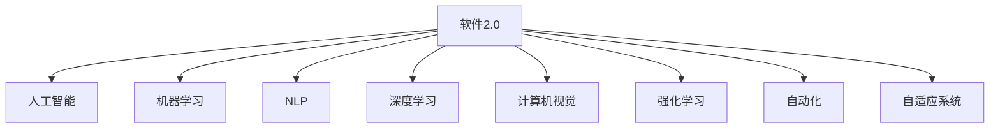

                 

# 软件 2.0 的未来展望：更智能、更强大

> 关键词：软件 2.0, 人工智能, 自然语言处理, 机器学习, 深度学习, 计算机视觉, 强化学习, 自动化, 自适应系统, 人机协同

## 1. 背景介绍

### 1.1 问题由来
随着科技的飞速发展，软件系统变得越来越复杂和庞大。传统软件开发模式逐渐显现出其局限性，导致开发周期长、迭代慢、成本高。软件2.0的提出，旨在通过更智能、更强大的技术手段，推动软件工程向新的高度演进。

软件2.0，即通过人工智能、机器学习等先进技术，使得软件系统具备更高的自动化、自适应能力，能够快速响应变化，提供更加智能、高效、安全的解决方案。这不仅需要突破现有的技术瓶颈，还需整合跨领域的知识，形成更强大的系统能力。

### 1.2 问题核心关键点
软件2.0的核心目标在于构建一个能够自我学习、自我优化的智能系统，以适应不断变化的需求和环境。具体实现上，涉及以下几个关键点：

- **自动化**：通过自动编码、自动测试、自动部署等技术，减少人工干预，提升开发效率。
- **自适应**：系统能够根据用户行为和环境变化进行自我调整，提升用户体验和系统性能。
- **智能化**：结合自然语言处理、机器学习等技术，使得系统能够理解语义，进行自然交互，提供更精准的服务。
- **安全性**：通过威胁检测、漏洞修复、异常处理等技术手段，保证系统安全稳定运行。

## 2. 核心概念与联系

### 2.1 核心概念概述

为更好地理解软件2.0的概念和技术，本节将介绍几个密切相关的核心概念：

- **软件2.0**：通过人工智能、机器学习等技术，使软件系统具备自我学习、自我优化的能力，实现更高效的自动化和自适应。
- **人工智能**：一种通过模拟人类智能行为，实现数据处理、决策制定等功能的高级技术。
- **机器学习**：一种通过算法使机器能够从数据中学习并优化性能的技术。
- **自然语言处理**(NLP)：使计算机能够理解、处理和生成人类语言的技术。
- **深度学习**：一种特殊的机器学习方法，通过多层神经网络模拟人脑神经元工作方式，实现复杂模式的识别和预测。
- **计算机视觉**：使计算机能够理解和处理图像和视频数据的高级技术。
- **强化学习**：一种通过奖励和惩罚机制，使机器学习如何采取行动以实现特定目标的技术。
- **自动化**：通过脚本、程序等方式，实现任务的自动执行。
- **自适应系统**：能够根据环境和需求变化进行自我调整的系统。

这些核心概念之间的逻辑关系可以通过以下Mermaid流程图来展示：



这个流程图展示了几类关键技术及其与软件2.0的关系：

1. 软件2.0以人工智能、机器学习等技术为基石，实现其智能和自适应特性。
2. 自然语言处理和深度学习是其核心技术，使软件系统能够理解人类语言。
3. 计算机视觉和强化学习拓展了软件系统的感知和决策能力。
4. 自动化技术为软件2.0提供了高效运行的基础。

## 3. 核心算法原理 & 具体操作步骤
### 3.1 算法原理概述

软件2.0的核心算法原理涉及多个前沿技术领域，包括但不限于人工智能、机器学习、自然语言处理等。以下将从整体上概述这些技术的基本原理，并说明其在软件2.0中的应用。

### 3.2 算法步骤详解

软件2.0的构建主要分为以下步骤：

**Step 1: 数据收集与预处理**
- 收集软件系统运行过程中的各类数据，如日志、用户行为数据、系统性能数据等。
- 对数据进行清洗、标注和预处理，以便后续分析和模型训练。

**Step 2: 模型选择与训练**
- 根据具体应用场景选择合适的算法模型，如决策树、随机森林、神经网络等。
- 使用收集到的数据对模型进行训练，优化模型参数，提升预测准确性。

**Step 3: 集成与优化**
- 将训练好的模型集成到软件系统中，作为系统决策的一部分。
- 根据系统反馈进行模型优化和调整，不断提升系统的自动化和自适应能力。

**Step 4: 部署与监控**
- 将优化后的模型部署到生产环境中，实时处理系统事件和用户请求。
- 持续监控系统性能和模型效果，及时发现并解决问题，保证系统稳定运行。

### 3.3 算法优缺点

软件2.0的技术虽然强大，但也存在一些局限性：

优点：
1. **高效自动化**：通过自动化和自适应技术，显著提升开发和运行效率。
2. **智能决策**：通过深度学习和自然语言处理等技术，提供更精准的决策支持。
3. **弹性扩展**：自适应系统能够根据需求动态调整资源，提高系统弹性。

缺点：
1. **数据依赖**：模型效果高度依赖于数据的质量和多样性，数据获取成本较高。
2. **模型复杂**：复杂的算法模型可能导致计算资源消耗大，部署和维护成本高。
3. **安全性问题**：自动化和智能化可能引入新的安全风险，需额外关注模型鲁棒性和安全性。
4. **可解释性不足**：许多模型尤其是深度学习模型，其决策过程难以解释，影响用户信任度。

### 3.4 算法应用领域

软件2.0的应用领域非常广泛，涵盖多个行业和场景，例如：

- **金融领域**：通过自动化交易、智能风控、客户服务等应用，提升金融服务的效率和质量。
- **医疗领域**：通过智能诊断、个性化治疗、智能排班等应用，提升医疗服务水平。
- **教育领域**：通过智能教学、个性化学习、自动评估等应用，优化教育资源的配置和利用。
- **智能制造**：通过自动化生产、智能维护、供应链优化等应用，提高制造业的生产效率和产品质量。
- **智能客服**：通过自然语言处理和机器学习技术，实现智能对话和问题解决，提升客户服务体验。
- **智能推荐**：通过分析用户行为数据，实现个性化推荐，提升用户体验和留存率。
- **智能交通**：通过实时数据分析和预测，优化交通管理，提高交通效率和安全性。
- **智慧城市**：通过集成各类智能应用，实现城市管理的智能化和精细化。

这些应用领域展示了软件2.0技术的广泛潜力和巨大价值。

## 4. 数学模型和公式 & 详细讲解 & 举例说明

### 4.1 数学模型构建

软件2.0的技术实现依赖于多种数学模型和算法，以下重点介绍其中的一些关键模型及其构建方法。

**4.1.1 决策树模型**
决策树是一种树形结构模型，通过一系列的分类规则，对输入数据进行分类。其基本模型构建步骤如下：

1. 选择一个最优特征，作为根节点。
2. 根据特征将数据集分成若干子集。
3. 对每个子集递归执行步骤1和2，直到叶子节点。

**4.1.2 随机森林模型**
随机森林是一种集成学习模型，通过多个决策树的组合，提升分类和预测的准确性。其构建步骤如下：

1. 从数据集中随机抽取样本和特征，构建多个决策树。
2. 对于新的输入数据，每个决策树独立进行分类，并取多数结果作为最终结果。

**4.1.3 神经网络模型**
神经网络是一种多层非线性模型，通过前向传播和反向传播，实现数据的复杂模式识别和预测。其构建步骤如下：

1. 设计网络结构，包括输入层、隐藏层和输出层。
2. 初始化权重和偏置。
3. 通过前向传播计算预测结果。
4. 通过反向传播更新权重和偏置。

### 4.2 公式推导过程

以下是决策树模型的推导过程，以二分类为例：

**4.2.1 信息熵**
信息熵是衡量数据集不确定性的一种度量方法，其公式为：

$$
H(x) = -\sum_{i=1}^{n} p_i \log p_i
$$

其中 $p_i$ 为类别 $i$ 在数据集中的概率。

**4.2.2 信息增益**
信息增益是衡量特征对数据集分类能力的指标，其公式为：

$$
IG(x,A) = H(x) - H(x|A)
$$

其中 $H(x|A)$ 为在特征 $A$ 条件下，数据集的条件熵。

**4.2.3 决策树算法**
决策树算法通过不断选择信息增益最大的特征，构建最优决策树。其核心思想是：

1. 选择最优特征，作为根节点。
2. 根据特征将数据集分成若干子集。
3. 递归构建子树，直到叶子节点。

### 4.3 案例分析与讲解

以决策树模型为例，介绍其在实际应用中的构建和优化过程。

**4.3.1 案例背景**
假设有一家电商公司，希望通过分析用户购买行为，预测用户是否会进行下一次购买。

**4.3.2 数据收集**
收集用户的历史购买记录、浏览行为、个人信息等数据。

**4.3.3 数据预处理**
清洗数据，去除缺失值和异常值，进行特征工程。

**4.3.4 模型训练**
构建决策树模型，选择信息增益最大的特征作为根节点。

**4.3.5 模型优化**
通过交叉验证和调参，优化模型参数，提升模型效果。

**4.3.6 模型评估**
在测试集上评估模型效果，进行模型验证和迭代优化。

## 5. 项目实践：代码实例和详细解释说明
### 5.1 开发环境搭建

在实际开发过程中，需要搭建适合的软件开发环境。以下是使用Python进行PyTorch开发的典型环境配置流程：

1. 安装Anaconda：从官网下载并安装Anaconda，用于创建独立的Python环境。

2. 创建并激活虚拟环境：
```bash
conda create -n pytorch-env python=3.8 
conda activate pytorch-env
```

3. 安装PyTorch：根据CUDA版本，从官网获取对应的安装命令。例如：
```bash
conda install pytorch torchvision torchaudio cudatoolkit=11.1 -c pytorch -c conda-forge
```

4. 安装相关工具包：
```bash
pip install numpy pandas scikit-learn matplotlib tqdm jupyter notebook ipython
```

完成上述步骤后，即可在`pytorch-env`环境中进行软件开发。

### 5.2 源代码详细实现

下面以决策树模型为例，给出使用PyTorch进行模型开发的完整代码实现。

**5.2.1 数据处理**

```python
import pandas as pd
from sklearn.model_selection import train_test_split
from sklearn.preprocessing import LabelEncoder

# 加载数据
df = pd.read_csv('data.csv')

# 处理标签
label_encoder = LabelEncoder()
df['label'] = label_encoder.fit_transform(df['label'])

# 数据划分
train_data, test_data = train_test_split(df, test_size=0.2, random_state=42)
```

**5.2.2 模型训练**

```python
import torch
from sklearn.tree import DecisionTreeClassifier
from sklearn.metrics import accuracy_score

# 定义决策树模型
model = DecisionTreeClassifier()

# 训练模型
model.fit(train_data.drop(['label'], axis=1), train_data['label'])

# 测试模型
test_predictions = model.predict(test_data.drop(['label'], axis=1))
accuracy = accuracy_score(test_data['label'], test_predictions)
print(f'Accuracy: {accuracy:.2f}')
```

**5.2.3 模型评估**

```python
# 模型评估
confusion_matrix = confusion_matrix(test_data['label'], test_predictions)
print(confusion_matrix)
```

### 5.3 代码解读与分析

让我们再详细解读一下关键代码的实现细节：

**数据处理**

- `LabelEncoder`：用于将标签转换为数值形式。
- `train_test_split`：将数据集划分为训练集和测试集。

**模型训练**

- `DecisionTreeClassifier`：定义决策树模型。
- `fit`：训练模型，学习决策规则。
- `predict`：预测新的样本标签。
- `accuracy_score`：计算模型预测的准确率。

**模型评估**

- `confusion_matrix`：计算混淆矩阵，评估模型性能。

通过上述代码，我们可以看到，使用PyTorch进行决策树模型开发非常便捷。开发者可以将更多精力放在数据处理、模型改进等高层逻辑上，而不必过多关注底层的实现细节。

## 6. 实际应用场景
### 6.1 智能推荐系统

软件2.0在推荐系统中的应用非常广泛。通过分析用户行为数据，实时预测用户兴趣，推荐个性化内容，提升用户体验。

**6.1.1 数据收集与预处理**

- 收集用户的历史行为数据，包括浏览记录、购买记录、评价记录等。
- 对数据进行清洗、去重和标注，提取用户兴趣特征。

**6.1.2 模型训练**

- 选择合适模型，如协同过滤、基于内容的推荐等。
- 使用训练数据集进行模型训练，优化模型参数。

**6.1.3 模型评估与优化**

- 在测试集上评估模型效果，计算召回率、准确率等指标。
- 根据测试结果进行模型优化，提升推荐效果。

**6.1.4 实时推荐**

- 将优化后的模型集成到推荐系统中，实时处理用户请求。
- 动态调整推荐策略，提升推荐效果。

### 6.2 智能客服系统

软件2.0在智能客服系统中的应用，使得系统具备自然语言处理和对话生成能力，能够提供24小时不间断的智能服务。

**6.2.1 数据收集与预处理**

- 收集历史客服对话记录，提取问题和回复。
- 对数据进行清洗、去重和标注，提取问题类型和回复模板。

**6.2.2 模型训练**

- 使用预训练的语言模型，进行自然语言处理。
- 训练对话生成模型，学习生成回复的规则。

**6.2.3 模型评估与优化**

- 在测试集上评估模型效果，计算对话生成质量。
- 根据测试结果进行模型优化，提升生成质量。

**6.2.4 实时对话**

- 将优化后的模型集成到客服系统中，实时处理用户请求。
- 动态调整对话策略，提升用户体验。

### 6.3 智能交通系统

软件2.0在智能交通系统中的应用，通过实时数据分析和预测，优化交通管理和调度，提升交通效率和安全性。

**6.3.1 数据收集与预处理**

- 收集交通流量数据、事故记录、道路信息等。
- 对数据进行清洗、去重和标注，提取交通流量特征。

**6.3.2 模型训练**

- 使用交通流量数据，训练交通预测模型。
- 使用事故记录，训练异常检测模型。

**6.3.3 模型评估与优化**

- 在测试集上评估模型效果，计算预测准确率。
- 根据测试结果进行模型优化，提升预测准确率。

**6.3.4 实时调度**

- 将优化后的模型集成到交通调度系统中，实时处理交通事件。
- 动态调整调度策略，提升交通效率。

## 7. 工具和资源推荐
### 7.1 学习资源推荐

为了帮助开发者掌握软件2.0的技术和应用，这里推荐一些优质的学习资源：

1. **Coursera《深度学习基础》课程**：斯坦福大学的深度学习课程，涵盖深度学习的基本概念和前沿技术。

2. **DeepLearning.ai《深度学习专业证书》课程**：Google推出的深度学习课程，包括神经网络、卷积神经网络、循环神经网络等内容。

3. **Kaggle**：数据科学和机器学习竞赛平台，提供大量数据集和经典模型，供开发者学习和实践。

4. **Arxiv**：顶级学术期刊和会议的预印本数据库，提供最新的研究论文和技术报告。

5. **GitHub**：代码托管平台，提供大量开源项目和代码示例，供开发者学习和使用。

通过这些资源的学习实践，相信你一定能够系统掌握软件2.0的技术和应用，并用于解决实际问题。

### 7.2 开发工具推荐

高效的开发离不开优秀的工具支持。以下是几款常用的开发工具：

1. **PyTorch**：基于Python的开源深度学习框架，灵活动态的计算图，适合快速迭代研究。

2. **TensorFlow**：由Google主导开发的开源深度学习框架，生产部署方便，适合大规模工程应用。

3. **Jupyter Notebook**：交互式开发环境，支持Python、R等多种语言，适合数据分析和模型训练。

4. **TensorBoard**：TensorFlow配套的可视化工具，可实时监测模型训练状态，提供丰富的图表呈现方式。

5. **Weights & Biases**：模型训练的实验跟踪工具，可以记录和可视化模型训练过程中的各项指标。

合理利用这些工具，可以显著提升软件2.0的开发效率，加快创新迭代的步伐。

### 7.3 相关论文推荐

软件2.0技术的发展源于学界的持续研究。以下是几篇奠基性的相关论文，推荐阅读：

1. **《Deep Learning》（Ian Goodfellow）**：全面介绍了深度学习的基本概念和核心算法，是深度学习领域的经典著作。

2. **《Pattern Recognition and Machine Learning》（Christopher Bishop）**：介绍了模式识别和机器学习的基本理论和方法。

3. **《Natural Language Processing with PyTorch》（Zhou Haoyan, Li Yang, Jiang Rui, He Xiaolong）**：介绍了使用PyTorch进行自然语言处理的技术和应用。

4. **《AdaLoRA: Adaptive Low-Rank Adaptation for Parameter-Efficient Fine-Tuning》（Xu Chunxiao, Luo Zihao, Yao Lijuan, Tang Jie, Tan Yi, Xie Yongqiang, Lin Zhiguo, Cao Yin）**：提出了一种参数高效微调方法，在保证性能的同时，节省计算资源。

这些论文代表了大规模深度学习模型的发展脉络。通过学习这些前沿成果，可以帮助研究者把握学科前进方向，激发更多的创新灵感。

## 8. 总结：未来发展趋势与挑战
### 8.1 总结

本文对软件2.0的技术进行了全面系统的介绍。首先阐述了软件2.0的核心目标和应用场景，明确了其在提升软件系统自动化和智能化方面的重要作用。其次，从原理到实践，详细讲解了软件2.0的核心算法和操作步骤，给出了实际应用中的代码实现。同时，本文还探讨了软件2.0在金融、医疗、教育等多个领域的应用前景，展示了其广泛潜力和巨大价值。

通过本文的系统梳理，可以看到，软件2.0技术正在成为推动软件工程向前演进的重要手段，显著提升了软件系统的自动化和智能化水平。未来，伴随软件2.0技术的不断演进，必将引领软件工程向新的高度迈进。

### 8.2 未来发展趋势

展望未来，软件2.0技术将呈现以下几个发展趋势：

1. **自动化程度更高**：未来的软件2.0系统将具备更强的自我学习和优化能力，能够自动生成代码、调试系统，进一步降低开发成本。
2. **智能化水平更高**：通过引入深度学习、自然语言处理等技术，软件2.0系统将具备更高的智能决策和问题解决能力。
3. **跨领域融合更多**：软件2.0技术将与其他前沿技术（如区块链、边缘计算、物联网等）进行更深度的融合，形成更强大的系统能力。
4. **安全性保障更完善**：通过威胁检测、漏洞修复、异常处理等技术手段，软件2.0系统将具备更高的安全性，保障系统稳定运行。
5. **用户体验更佳**：软件2.0系统将具备更强的个性化和自适应能力，提供更优质的用户体验。

以上趋势展示了软件2.0技术的广阔前景。这些方向的探索发展，必将进一步提升软件系统的性能和应用范围，为软件工程的现代化提供新的动力。

### 8.3 面临的挑战

尽管软件2.0技术已经取得了瞩目成就，但在迈向更加智能化、普适化应用的过程中，仍面临诸多挑战：

1. **数据隐私和安全**：软件2.0系统涉及大量的用户数据，数据隐私和安全问题需严格控制。
2. **模型复杂度**：复杂的算法模型可能导致计算资源消耗大，部署和维护成本高。
3. **用户信任**：许多算法尤其是深度学习模型，其决策过程难以解释，影响用户信任度。
4. **应用普适性**：不同领域的软件系统需结合领域知识进行优化，难度较大。
5. **性能瓶颈**：大规模系统可能面临性能瓶颈，需优化计算资源和算法模型。

这些挑战需要我们在未来的研究中加以解决，以充分发挥软件2.0技术的潜力。

### 8.4 研究展望

面对软件2.0技术面临的诸多挑战，未来的研究需要在以下几个方面寻求新的突破：

1. **数据隐私保护**：引入差分隐私、联邦学习等技术手段，保障数据隐私和安全。
2. **模型可解释性**：引入可解释性模型（如LIME、SHAP等），提升模型决策的透明性和可信度。
3. **模型压缩和优化**：采用模型压缩、稀疏化存储等方法，优化模型计算资源和性能。
4. **跨领域融合**：结合领域知识，优化模型设计和算法策略，提升系统应用普适性。
5. **系统优化**：优化系统架构和运行机制，提升系统性能和鲁棒性。

这些方向的研究将为软件2.0技术提供更强的保障和支持，推动其在各行业的应用落地。

## 9. 附录：常见问题与解答

**Q1：软件2.0与传统软件开发方式有何区别？**

A: 软件2.0通过人工智能、机器学习等技术手段，使得软件系统具备更高的自动化和智能化能力，能够快速响应变化，提供更精准的决策支持。传统软件开发方式依赖人工干预，开发周期长、迭代慢、成本高。

**Q2：软件2.0系统开发需要哪些关键技术？**

A: 软件2.0系统开发需要掌握人工智能、深度学习、自然语言处理、计算机视觉等前沿技术。这些技术为软件系统提供了更高的智能和自适应能力，提升了开发和运行效率。

**Q3：软件2.0技术面临哪些挑战？**

A: 软件2.0技术面临数据隐私和安全、模型复杂度、用户信任、应用普适性、性能瓶颈等挑战。需要结合领域知识，优化模型设计和算法策略，提升系统性能和鲁棒性。

**Q4：软件2.0技术有哪些应用场景？**

A: 软件2.0技术广泛应用于金融、医疗、教育、智能制造、智能推荐、智能客服、智能交通等多个领域。通过自动化和智能化手段，提升系统性能和用户体验。

**Q5：如何构建软件2.0系统？**

A: 构建软件2.0系统主要分为数据收集与预处理、模型选择与训练、集成与优化、部署与监控等步骤。选择合适的算法模型，进行数据预处理和模型训练，优化模型效果，部署到生产环境中，持续监控系统性能和模型效果。

通过本文的系统梳理，可以看到，软件2.0技术正在成为推动软件工程向前演进的重要手段，显著提升了软件系统的自动化和智能化水平。未来，伴随软件2.0技术的不断演进，必将引领软件工程向新的高度迈进。

