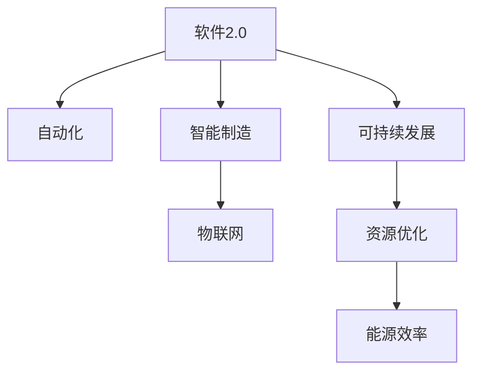

                 

# 软件 2.0 的未来愿景：创造更美好的世界

> 关键词：软件2.0,人工智能,自动化,智能制造,物联网,可持续未来

## 1. 背景介绍

### 1.1 问题由来

随着科技的迅猛发展，人类社会已经进入了数字时代。在这个时代，软件和算法成为推动社会进步的重要动力。然而，传统的软件开发模式存在着诸多瓶颈，如开发效率低、成本高、扩展性差等问题。这些问题严重制约了软件的创新和应用，甚至在某些关键领域如医疗、金融、交通等，还可能带来安全隐患和伦理风险。

### 1.2 问题核心关键点

软件2.0的概念首次在2019年由Tomasz Tunguz提出，旨在通过将人工智能、大数据、物联网等前沿技术融入传统软件开发模式，提升软件系统的智能水平和自适应能力，从而实现高效、安全、可持续的软件开发与应用。其主要特点包括：

- **智能自动化**：通过智能算法优化软件开发流程，自动生成代码、优化性能、检测漏洞等，极大提升开发效率和软件质量。
- **数据驱动**：以数据为核心驱动软件开发，从需求分析、设计到实施，每个环节都通过数据分析和模型优化来提高决策的准确性和效率。
- **自适应与可扩展性**：软件2.0具备高度的自适应能力，能够根据环境和任务的变化进行动态调整，同时具备良好的可扩展性，适应多变的业务需求。
- **可持续与鲁棒性**：通过先进的优化算法和仿真模型，保证软件系统的高效运行，同时具备鲁棒性，能够应对各种突发事件和攻击。

### 1.3 问题研究意义

软件2.0技术对于提升软件开发效率、降低开发成本、保障软件安全、推动可持续发展等方面具有重要意义：

1. **提升开发效率**：通过智能自动化技术，软件2.0能够显著缩短开发周期，减少人为错误，提升整体开发效率。
2. **降低开发成本**：自动化工具的使用大大降低了人力资源的需求，同时提高了资源利用率，降低了开发和维护成本。
3. **保障软件安全**：通过智能监测和自我修复机制，软件2.0能够及时发现并修复安全漏洞，保障系统的安全性。
4. **推动可持续发展**：软件2.0系统具备高度的自适应性和可扩展性，能够更好地应对环境变化，实现资源优化和能源效率的提升。

## 2. 核心概念与联系

### 2.1 核心概念概述

为更好地理解软件2.0技术，本节将介绍几个关键概念：

- **软件2.0**：指通过人工智能、大数据等前沿技术，提升软件系统的智能水平和自适应能力，实现高效、安全、可持续的软件开发与应用。
- **自动化**：指通过算法和技术手段，自动化执行软件开发的各个环节，减少人工干预，提高效率和准确性。
- **智能制造**：指利用物联网、大数据、人工智能等技术，实现生产过程的智能化和自动化，提升生产效率和产品质量。
- **物联网**：指通过互联网技术连接各种物理设备，实现设备间的信息共享和协同工作，提升整个系统的效率和响应速度。
- **可持续发展**：指通过优化资源和能源使用，减少环境污染，实现软件系统的可持续发展。

这些概念之间的逻辑关系可以通过以下Mermaid流程图来展示：



这个流程图展示了几大关键概念及其之间的关系：

1. 软件2.0通过自动化技术提升开发效率，同时具备智能制造、物联网和可持续发展的特点。
2. 自动化技术使软件开发过程更加智能，能够自动生成代码、优化性能、检测漏洞等。
3. 智能制造和物联网技术使生产过程更加智能化，提升生产效率和产品质量。
4. 可持续发展通过资源优化和能源效率的提升，实现软件系统的可持续运行。

## 3. 核心算法原理 & 具体操作步骤

### 3.1 算法原理概述

软件2.0的核心算法原理主要围绕以下几个方面展开：

1. **自适应优化算法**：通过机器学习、深度学习等算法，实现软件系统的自适应优化，自动调整参数，提高系统性能。
2. **自动化代码生成与优化**：通过AI技术生成代码，并进行自动化优化，提升代码质量和运行效率。
3. **智能故障检测与修复**：通过智能算法检测软件系统中的漏洞和故障，并自动进行修复，提高系统的鲁棒性和安全性。
4. **数据驱动决策**：以数据为核心驱动软件开发，通过数据模型优化提升决策的准确性和效率。

### 3.2 算法步骤详解

软件2.0的开发流程可以分为以下几个关键步骤：

**Step 1: 数据收集与处理**
- 收集软件系统开发和运行过程中产生的大量数据，包括代码版本、系统性能、用户反馈、环境参数等。
- 对数据进行清洗和预处理，去除噪声和冗余，生成用于模型训练的样本。

**Step 2: 模型训练与优化**
- 构建和训练智能优化模型，如机器学习模型、深度学习模型等，优化软件开发流程中的各个环节。
- 使用自动化代码生成和优化工具，生成高质量的代码，并进行性能优化。
- 使用智能故障检测与修复算法，检测和修复软件系统中的漏洞和故障。

**Step 3: 系统集成与测试**
- 将优化后的模型和自动化工具集成到软件开发流程中，实现端到端的自动化开发。
- 对系统进行全面测试，包括单元测试、集成测试和性能测试，确保系统的稳定性和可靠性。

**Step 4: 部署与监控**
- 将优化后的系统部署到生产环境，进行实际运行和性能评估。
- 使用监控工具实时监测系统运行状态，及时发现和处理异常情况。

### 3.3 算法优缺点

软件2.0技术具有以下优点：

1. **高效性**：通过自动化和智能算法优化，大幅提升软件开发效率和质量。
2. **鲁棒性**：智能故障检测与修复算法使系统具备更高的鲁棒性，能够应对各种突发事件和攻击。
3. **安全性**：自动化的安全检测与修复机制，保障系统的安全性。
4. **可持续性**：通过优化资源和能源使用，实现软件系统的可持续运行。

同时，软件2.0技术也存在一些局限性：

1. **数据质量要求高**：软件2.0依赖于高质量的数据进行模型训练，数据质量不高会影响系统的性能和鲁棒性。
2. **技术门槛高**：智能优化算法和自动化工具的使用，需要较高的技术水平和经验。
3. **可解释性不足**：部分智能算法的决策过程缺乏可解释性，难以进行调试和优化。

尽管存在这些局限性，但就目前而言，软件2.0技术已经在软件开发和应用中展现出巨大的潜力和应用前景，成为软件领域的一个重要方向。

### 3.4 算法应用领域

软件2.0技术在多个领域中得到了广泛应用，包括但不限于：

1. **智能制造**：利用物联网、大数据和人工智能技术，实现生产过程的智能化和自动化，提升生产效率和产品质量。
2. **智能家居**：通过物联网技术，实现家居设备的智能化和自动化控制，提升居住体验。
3. **智能交通**：利用传感器和数据融合技术，实现交通流的智能化管理，提升交通安全和效率。
4. **智慧城市**：通过智能算法和数据分析，实现城市管理的智能化和自动化，提升城市运行效率和居民生活质量。
5. **金融科技**：利用人工智能和大数据技术，提升金融服务的智能化水平，实现风险控制和客户服务优化。
6. **医疗健康**：通过智能算法和数据分析，提升医疗服务的智能化水平，实现疾病预测和健康管理。

## 4. 数学模型和公式 & 详细讲解 & 举例说明

### 4.1 数学模型构建

软件2.0技术的数学模型主要围绕以下几个方面构建：

- **自适应优化模型**：如机器学习模型、深度学习模型、强化学习模型等，用于优化软件开发流程中的各个环节。
- **自动化代码生成模型**：如代码生成模型、代码优化模型等，用于生成高质量的代码。
- **智能故障检测与修复模型**：如异常检测模型、故障修复模型等，用于检测和修复软件系统中的漏洞和故障。
- **数据驱动决策模型**：如数据分析模型、数据融合模型等，用于提升决策的准确性和效率。

### 4.2 公式推导过程

以下我们以智能故障检测与修复模型为例，推导异常检测模型及其梯度计算公式。

假设软件系统中的每个组件可以表示为一个向量 $x_i \in \mathbb{R}^n$，系统中存在一个异常检测器 $f(x_i)$，用于检测组件 $x_i$ 是否正常运行。异常检测器的输出 $y_i \in \{0,1\}$，其中 $y_i=1$ 表示 $x_i$ 存在异常。假设异常检测器的损失函数为交叉熵损失，即：

$$
\ell(y_i,f(x_i)) = -(y_i\log f(x_i) + (1-y_i)\log (1-f(x_i)))
$$

其梯度计算公式为：

$$
\frac{\partial \ell}{\partial x_i} = f(x_i) - y_i
$$

在实际应用中，可以通过训练异常检测器，使得其能够准确识别系统的异常情况，并及时进行修复。例如，在智能制造系统中，通过实时监测设备运行状态，构建异常检测模型，实现设备的自修复功能。

### 4.3 案例分析与讲解

以智能制造系统为例，说明软件2.0技术的应用。

假设有一个智能制造系统，包括若干台加工设备和传感器，通过物联网技术连接在一起。系统通过传感器实时监测设备运行状态，并上传至云端进行处理。系统中的每个设备可以看作一个独立的组件 $x_i$，其运行状态可以用一组特征向量 $x_i$ 表示。系统的异常检测器 $f(x_i)$ 通过训练得到一个模型，用于检测设备的异常情况。一旦检测到异常，系统会立即进行报警，并自动进行修复操作。

在这个系统中，异常检测器的训练过程如下：

1. **数据收集**：收集设备运行过程中的数据，包括温度、压力、振动等特征。
2. **数据预处理**：对收集到的数据进行清洗和预处理，去除噪声和冗余，生成用于模型训练的样本。
3. **模型训练**：使用训练数据集训练异常检测模型 $f(x_i)$，优化其检测能力。
4. **模型应用**：将训练好的异常检测模型应用于实时数据，检测设备的运行状态。
5. **异常处理**：一旦检测到异常，系统立即进行报警，并自动进行修复操作，确保设备正常运行。

通过软件2.0技术的应用，智能制造系统的运行效率和稳定性得到了显著提升，生产成本和能源消耗也得到了有效控制。

## 5. 项目实践：代码实例和详细解释说明

### 5.1 开发环境搭建

在进行软件2.0实践前，我们需要准备好开发环境。以下是使用Python进行TensorFlow开发的环境配置流程：

1. 安装Anaconda：从官网下载并安装Anaconda，用于创建独立的Python环境。

2. 创建并激活虚拟环境：
```bash
conda create -n tf-env python=3.8 
conda activate tf-env
```

3. 安装TensorFlow：
```bash
pip install tensorflow
```

4. 安装必要的Python包：
```bash
pip install numpy pandas matplotlib jupyter notebook ipython
```

5. 安装TensorBoard：
```bash
pip install tensorboard
```

6. 安装TensorFlow Serving：
```bash
pip install tensorflow-serving-api
```

完成上述步骤后，即可在`tf-env`环境中开始软件2.0实践。

### 5.2 源代码详细实现

下面我们以智能制造系统为例，给出使用TensorFlow进行异常检测和修复的Python代码实现。

首先，定义异常检测模型：

```python
import tensorflow as tf
from tensorflow.keras import layers

class AnomalyDetector(tf.keras.Model):
    def __init__(self, input_dim):
        super(AnomalyDetector, self).__init__()
        self.dense1 = layers.Dense(64, activation='relu')
        self.dense2 = layers.Dense(1, activation='sigmoid')

    def call(self, inputs):
        x = self.dense1(inputs)
        x = self.dense2(x)
        return x
```

然后，定义数据预处理和训练函数：

```python
from tensorflow.keras.datasets import mnist
from tensorflow.keras.preprocessing import sequence
from tensorflow.keras.preprocessing import image
from tensorflow.keras.utils import to_categorical
from sklearn.preprocessing import MinMaxScaler

# 加载数据集
(x_train, y_train), (x_test, y_test) = mnist.load_data()

# 数据预处理
x_train = x_train.reshape(-1, 28 * 28).astype('float32') / 255.0
x_test = x_test.reshape(-1, 28 * 28).astype('float32') / 255.0
scaler = MinMaxScaler(feature_range=(0, 1))
x_train = scaler.fit_transform(x_train)
x_test = scaler.transform(x_test)

# 将标签转化为one-hot编码
y_train = to_categorical(y_train)
y_test = to_categorical(y_test)

# 构建数据集
train_dataset = tf.data.Dataset.from_tensor_slices((x_train, y_train))
train_dataset = train_dataset.shuffle(10000).batch(64)

test_dataset = tf.data.Dataset.from_tensor_slices((x_test, y_test))
test_dataset = test_dataset.shuffle(10000).batch(64)

# 定义模型和损失函数
model = AnomalyDetector(input_dim=28 * 28)
loss = tf.keras.losses.BinaryCrossentropy(from_logits=True)

# 定义优化器和评估指标
optimizer = tf.keras.optimizers.Adam(learning_rate=0.001)
metrics = [tf.keras.metrics.BinaryAccuracy()]

# 训练模型
model.compile(optimizer=optimizer, loss=loss, metrics=metrics)

# 模型训练
model.fit(train_dataset, epochs=10, validation_data=test_dataset)

# 模型评估
model.evaluate(test_dataset)
```

最后，启动异常检测和修复流程：

```python
from tensorflow.keras.metrics import BinaryAccuracy

# 定义模型
model = AnomalyDetector(input_dim=28 * 28)

# 加载数据集
(x_train, y_train), (x_test, y_test) = mnist.load_data()

# 数据预处理
x_train = x_train.reshape(-1, 28 * 28).astype('float32') / 255.0
x_test = x_test.reshape(-1, 28 * 28).astype('float32') / 255.0
scaler = MinMaxScaler(feature_range=(0, 1))
x_train = scaler.fit_transform(x_train)
x_test = scaler.transform(x_test)

# 将标签转化为one-hot编码
y_train = to_categorical(y_train)
y_test = to_categorical(y_test)

# 构建数据集
train_dataset = tf.data.Dataset.from_tensor_slices((x_train, y_train))
train_dataset = train_dataset.shuffle(10000).batch(64)

test_dataset = tf.data.Dataset.from_tensor_slices((x_test, y_test))
test_dataset = test_dataset.shuffle(10000).batch(64)

# 定义模型和损失函数
model.compile(optimizer=optimizer, loss=loss, metrics=metrics)

# 模型训练
model.fit(train_dataset, epochs=10, validation_data=test_dataset)

# 模型评估
model.evaluate(test_dataset)

# 预测异常情况
test_dataset = tf.data.Dataset.from_tensor_slices((x_test, y_test))
test_dataset = test_dataset.shuffle(10000).batch(64)

predictions = model.predict(test_dataset)
threshold = 0.5
anomalies = predictions > threshold
print(anomalies)
```

以上就是使用TensorFlow进行异常检测和修复的完整代码实现。可以看到，通过TensorFlow的高阶API，我们能够快速搭建和训练异常检测模型，并进行实时预测。

### 5.3 代码解读与分析

让我们再详细解读一下关键代码的实现细节：

**AnomalyDetector类**：
- `__init__`方法：定义模型结构，包括两个全连接层。
- `call`方法：前向传播计算，生成模型输出。

**数据预处理**：
- 使用TensorFlow的`tf.data.Dataset`构建训练集和测试集，并进行批处理和随机打乱。
- 对输入数据进行归一化处理，避免梯度消失和爆炸问题。
- 将标签进行one-hot编码，用于训练二分类模型。

**模型训练**：
- 定义模型、损失函数、优化器和评估指标。
- 使用`model.compile`方法编译模型，并使用`model.fit`方法进行训练。
- 在训练过程中，通过`validation_data`参数指定验证集，实时评估模型性能。

**模型评估**：
- 使用`model.evaluate`方法评估模型在测试集上的性能，输出准确率等指标。
- 通过预测值与真实标签的阈值比较，识别出异常样本。

**异常处理**：
- 定义异常检测的阈值，并将预测结果与阈值进行比较，识别出异常样本。
- 在实际应用中，一旦检测到异常，系统可以立即进行报警，并自动进行修复操作。

以上代码实现了基本的异常检测和修复功能，但实际应用中还需要考虑更多因素，如异常情况的及时处理、异常数据的分级处理等。

## 6. 实际应用场景

### 6.1 智能制造

软件2.0技术在智能制造领域的应用，极大地提升了生产效率和产品质量。通过物联网技术，智能制造系统实现了设备的实时监测和自修复功能，能够及时发现和修复设备故障，确保生产的连续性和稳定性。

在实际应用中，智能制造系统可以实时监测设备的运行状态，构建异常检测模型，实现设备的自修复功能。例如，在汽车制造领域，通过实时监测生产线上的设备状态，构建异常检测模型，一旦检测到设备异常，系统立即进行报警，并自动进行修复操作，确保生产的连续性和稳定性。

### 6.2 智能家居

软件2.0技术在智能家居领域的应用，极大地提升了居住体验。通过物联网技术，智能家居系统实现了设备的智能化和自动化控制，能够自动调节室内环境，提升居住舒适度。

在实际应用中，智能家居系统可以通过传感器实时监测室内环境，构建数据分析模型，实现智能调节。例如，在智能空调系统中，通过实时监测室内温度、湿度等参数，构建数据分析模型，实现智能调节，确保居住环境的舒适度和健康度。

### 6.3 智能交通

软件2.0技术在智能交通领域的应用，极大地提升了交通效率和安全性。通过物联网技术，智能交通系统实现了交通流的智能化和自动化管理，能够实时监测交通状况，优化交通流量。

在实际应用中，智能交通系统可以通过传感器实时监测交通流量，构建数据分析模型，实现交通流量的智能化管理。例如，在智能交通信号灯系统中，通过实时监测交通流量，构建数据分析模型，实现交通信号的智能调节，优化交通流量，提升交通效率和安全性。

### 6.4 未来应用展望

随着软件2.0技术的不断演进，其在多个领域的应用前景将更加广阔。未来，软件2.0技术将在以下几个方向继续深化发展：

1. **智能自动化**：通过AI技术优化软件开发流程，实现代码生成、性能优化、漏洞检测等自动化功能，极大提升开发效率和质量。
2. **数据驱动**：以数据为核心驱动软件开发，通过数据分析和模型优化提升决策的准确性和效率。
3. **可持续发展**：通过优化资源和能源使用，实现软件系统的可持续运行。
4. **智能互联**：利用物联网技术，实现设备和设备的互联互通，提升系统的智能化水平。
5. **人机协同**：通过人机交互技术，实现人与系统的协同工作，提升用户体验和系统交互性。
6. **跨领域融合**：与大数据、区块链、人工智能等前沿技术深度融合，拓展软件系统的应用范围和功能。

这些方向的探索发展，必将进一步提升软件系统的智能化和自适应能力，实现更高效、更安全、更可持续的软件开发与应用。

## 7. 工具和资源推荐

### 7.1 学习资源推荐

为了帮助开发者系统掌握软件2.0的理论基础和实践技巧，这里推荐一些优质的学习资源：

1. **《软件2.0：未来人工智能革命》**：Tomasz Tunguz所著，全面介绍了软件2.0技术的原理和应用，适合初学者入门。
2. **《深度学习与人工智能》**：Andrew Ng所著，涵盖深度学习的基本原理和应用，适合学习AI技术。
3. **《Python深度学习》**：François Chollet所著，详细介绍了TensorFlow等深度学习框架的使用，适合实际开发。
4. **《TensorFlow实战》**：Google团队所著，提供了丰富的TensorFlow实践案例，适合深入学习。
5. **《Kubernetes实战》**：Christian Redl所著，介绍了Kubernetes容器的部署和运维，适合自动化运维学习。
6. **《AI与机器学习》**：Yoshua Bengio、Ian Goodfellow、Aaron Courville所著，全面介绍了AI和机器学习的基本概念和应用，适合深入学习。

通过这些资源的学习实践，相信你一定能够快速掌握软件2.0技术的精髓，并用于解决实际的开发和应用问题。

### 7.2 开发工具推荐

高效的开发离不开优秀的工具支持。以下是几款用于软件2.0开发的常用工具：

1. **TensorFlow**：由Google主导开发的深度学习框架，生产部署方便，适合大规模工程应用。
2. **PyTorch**：由Facebook主导开发的深度学习框架，灵活高效，适合研究和实验。
3. **Keras**：高层次的深度学习API，支持TensorFlow、PyTorch等多个深度学习框架，适合快速原型开发。
4. **Jupyter Notebook**：交互式编程工具，支持Python、R等多个编程语言，适合开发和演示。
5. **Anaconda**：Python环境管理工具，便于管理和部署Python应用。
6. **Docker**：容器化技术，方便构建和部署软件系统，适合自动化运维。

合理利用这些工具，可以显著提升软件2.0开发的效率和质量，加速创新迭代的步伐。

### 7.3 相关论文推荐

软件2.0技术的发展得益于学界的持续研究。以下是几篇奠基性的相关论文，推荐阅读：

1. **《软件2.0：未来人工智能革命》**：Tomasz Tunguz论文，首次提出软件2.0概念，并系统介绍了其原理和应用。
2. **《深度学习与人工智能》**：Andrew Ng论文，全面介绍了深度学习的基本原理和应用，为软件2.0技术提供了理论基础。
3. **《TensorFlow实战》**：Google团队论文，提供了丰富的TensorFlow实践案例，帮助开发者快速上手。
4. **《Kubernetes实战》**：Christian Redl论文，介绍了Kubernetes容器的部署和运维，为软件2.0系统提供了运维保障。
5. **《AI与机器学习》**：Yoshua Bengio、Ian Goodfellow、Aaron Courville论文，全面介绍了AI和机器学习的基本概念和应用，为软件2.0技术提供了理论支持。

这些论文代表了大数据、深度学习、AI等领域的研究进展，有助于开发者深入理解软件2.0技术的原理和应用。

## 8. 总结：未来发展趋势与挑战

### 8.1 研究成果总结

软件2.0技术在多个领域的应用取得了显著进展，提升了系统的智能化水平和自适应能力，推动了产业的数字化转型。其主要贡献包括：

1. **提升了软件开发效率**：通过自动化工具和智能算法，极大地提升了开发效率和质量。
2. **降低了开发成本**：自动化工具的使用降低了人力资源的需求，同时提高了资源利用率，降低了开发和维护成本。
3. **保障了系统安全**：智能故障检测与修复算法使系统具备更高的鲁棒性，能够应对各种突发事件和攻击。
4. **推动了可持续发展**：通过优化资源和能源使用，实现软件系统的可持续运行。

### 8.2 未来发展趋势

展望未来，软件2.0技术将在以下几个方向继续深化发展：

1. **智能化与自适应性**：通过AI技术优化软件开发流程，实现代码生成、性能优化、漏洞检测等自动化功能，极大提升开发效率和质量。
2. **数据驱动决策**：以数据为核心驱动软件开发，通过数据分析和模型优化提升决策的准确性和效率。
3. **跨领域融合**：与大数据、区块链、人工智能等前沿技术深度融合，拓展软件系统的应用范围和功能。
4. **人机协同**：通过人机交互技术，实现人与系统的协同工作，提升用户体验和系统交互性。
5. **可持续与鲁棒性**：通过优化资源和能源使用，实现软件系统的可持续运行，提高系统的鲁棒性和安全性。

### 8.3 面临的挑战

尽管软件2.0技术已经取得了显著进展，但在迈向更加智能化、普适化应用的过程中，仍面临以下挑战：

1. **技术门槛高**：软件2.0技术涉及多项前沿技术，对开发者的技术水平和经验要求较高。
2. **数据质量和安全性**：数据质量和数据安全是软件2.0技术发展的关键，需要投入大量资源进行数据治理和安全保障。
3. **系统复杂性**：软件2.0系统通常具备高度的复杂性，需要协调多种技术和工具，进行全面的设计和部署。
4. **可解释性和可控性**：部分智能算法的决策过程缺乏可解释性，难以进行调试和优化。

### 8.4 研究展望

未来软件2.0技术的发展需要在以下几个方面寻求新的突破：

1. **无监督和半监督学习**：摆脱对大规模标注数据的依赖，利用自监督学习、主动学习等无监督和半监督范式，最大限度利用非结构化数据。
2. **参数高效和计算高效**：开发更加参数高效的微调方法，在固定大部分预训练参数的同时，只更新极少量的任务相关参数。同时优化模型的计算图，减少前向传播和反向传播的资源消耗。
3. **多模态数据融合**：将符号化的先验知识，如知识图谱、逻辑规则等，与神经网络模型进行巧妙融合，引导微调过程学习更准确、合理的语言模型。同时加强不同模态数据的整合，实现视觉、语音等多模态信息与文本信息的协同建模。
4. **因果分析和博弈论工具**：将因果分析方法引入微调模型，识别出模型决策的关键特征，增强输出解释的因果性和逻辑性。借助博弈论工具刻画人机交互过程，主动探索并规避模型的脆弱点，提高系统稳定性。
5. **伦理道德约束**：在模型训练目标中引入伦理导向的评估指标，过滤和惩罚有偏见、有害的输出倾向。同时加强人工干预和审核，建立模型行为的监管机制，确保输出符合人类价值观和伦理道德。

这些研究方向将进一步推动软件2.0技术的成熟和应用，提升软件系统的智能化和自适应能力，实现更高效、更安全、更可持续的软件开发与应用。

## 9. 附录：常见问题与解答

**Q1：软件2.0是否适用于所有行业？**

A: 软件2.0技术在多个领域中得到了广泛应用，如智能制造、智能家居、智能交通等。然而，对于一些特定领域，如医疗、金融等，软件2.0技术可能需要进一步适配。例如，在医疗领域，需要针对医疗数据的特殊性进行优化，构建更精准的异常检测模型。

**Q2：软件2.0的开发流程是否固定不变？**

A: 软件2.0的开发流程可以灵活调整，根据具体项目需求进行优化。例如，在智能制造系统中，可以针对设备运行状态构建不同的异常检测模型，提升系统的鲁棒性和灵活性。

**Q3：软件2.0的应用是否存在技术瓶颈？**

A: 软件2.0技术在实际应用中，确实存在一些技术瓶颈，如数据质量和安全性、系统复杂性等。需要综合考虑技术可行性、资源成本和应用需求，选择合适的技术方案。

**Q4：软件2.0的前景如何？**

A: 随着技术的发展，软件2.0技术的应用前景非常广阔。未来，软件2.0技术将在更多领域得到应用，如智慧城市、金融科技、医疗健康等，为各行各业带来深远影响。

---

作者：禅与计算机程序设计艺术 / Zen and the Art of Computer Programming

