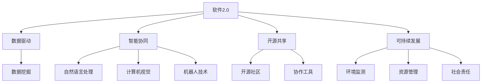

                 

# 软件 2.0 的未来愿景：创造更美好的世界

> 关键词：软件2.0,未来愿景,人工智能,自动化,可持续发展,社会变革,人机协同

## 1. 背景介绍

在信息化时代，软件已经成为社会生活的重要组成部分，深刻影响着人们的工作、学习、娱乐等方方面面。从早期的手工编码、基于规则的专家系统，到后来的面向对象编程、软件即服务(Software as a Service, SaaS)，软件行业经历了翻天覆地的变化。然而，随着互联网的普及和数据量的爆炸性增长，传统软件开发模式面临着诸多挑战，如开发成本高、效率低、迭代周期长、更新迭代困难等。

在此背景下，软件 2.0（Software 2.0）的概念应运而生，旨在利用最新的人工智能和大数据技术，实现软件的自动化、智能化和可持续化发展，从而驱动社会进步和人类福祉的提升。软件 2.0 倡导的是一种以人为本、可持续、高效的未来软件形态，强调数据驱动、智能协同、开源共享、人机协同等核心价值，致力于构建一个更加美好的未来世界。

## 2. 核心概念与联系

为了更好地理解软件 2.0 的愿景和内涵，我们需要先了解一些关键概念及其相互联系：

### 2.1 核心概念概述

- **软件 2.0（Software 2.0）**：基于人工智能和大数据技术的未来软件形态，旨在实现软件的自动化、智能化和可持续化发展。
- **数据驱动（Data-Driven）**：以数据为中心的软件开发和应用模式，利用数据挖掘和机器学习技术，从海量数据中提取知识、优化决策、提升性能。
- **智能协同（Intelligent Collaboration）**：利用人工智能技术，实现人机协同、人机交互，提升软件系统的智能化水平。
- **开源共享（Open Source & Sharing）**：通过开源模式，促进软件的共享和协作，加速创新和普及，推动技术进步。
- **可持续发展（Sustainability）**：在软件开发和应用过程中，关注环境保护、资源节约、社会责任等可持续性问题，构建生态友好的软件系统。

### 2.2 核心概念原理和架构的 Mermaid 流程图



这个流程图展示了软件 2.0 的核心概念及其相互关系：

- **软件2.0** 作为总体，涵盖数据驱动、智能协同、开源共享、可持续发展四个方面。
- **数据驱动** 聚焦于数据挖掘和机器学习，从海量数据中提取知识。
- **智能协同** 通过自然语言处理、计算机视觉、机器人技术等人工智能技术，实现人机协同。
- **开源共享** 利用开源社区和协作工具，促进软件的共享和协作。
- **可持续发展** 关注环境保护、资源节约、社会责任等，构建生态友好的软件系统。

这些概念之间相互支撑、相互作用，共同构成了软件 2.0 的完整框架。

## 3. 核心算法原理 & 具体操作步骤

### 3.1 算法原理概述

软件 2.0 的核心算法原理主要基于人工智能和大数据技术，旨在实现软件的自动化、智能化和可持续化发展。

**数据驱动算法**：通过数据挖掘和机器学习技术，从海量数据中提取知识、优化决策、提升性能。常见的算法包括：
- **监督学习（Supervised Learning）**：利用标注数据，训练模型进行预测和分类。
- **无监督学习（Unsupervised Learning）**：从未标注数据中提取特征，发现数据中的隐含模式。
- **强化学习（Reinforcement Learning）**：通过试错优化，提升智能体的决策能力。

**智能协同算法**：利用自然语言处理、计算机视觉、机器人技术等人工智能技术，实现人机协同、人机交互，提升软件系统的智能化水平。常见的算法包括：
- **自然语言处理（Natural Language Processing, NLP）**：利用NLP技术，实现自然语言理解、生成、翻译等。
- **计算机视觉（Computer Vision）**：利用计算机视觉技术，实现图像识别、视频分析等。
- **机器人技术（Robotics）**：利用机器人技术，实现自动化操作、智能交互等。

**开源共享算法**：通过开源模式，促进软件的共享和协作，加速创新和普及，推动技术进步。常见的算法包括：
- **版本控制（Version Control）**：利用版本控制工具，实现代码的版本管理、协同开发。
- **协作平台（Collaboration Platform）**：利用协作平台，实现代码共享、任务分配、进度跟踪等。

**可持续发展算法**：在软件开发和应用过程中，关注环境保护、资源节约、社会责任等可持续性问题，构建生态友好的软件系统。常见的算法包括：
- **环境监测（Environment Monitoring）**：利用传感器和物联网技术，实时监测环境变化，实现智能化管理。
- **资源管理（Resource Management）**：利用优化算法，实现资源的优化配置和高效利用。
- **社会责任（Social Responsibility）**：利用数据驱动和智能协同技术，推动社会公益事业和可持续发展。

### 3.2 算法步骤详解

基于上述算法原理，软件 2.0 的开发和应用过程可以分为以下几个关键步骤：

**Step 1: 数据准备和预处理**
- 收集并清洗相关数据，如文本、图像、音频等。
- 对数据进行标注和划分，准备训练、验证、测试数据集。
- 对数据进行特征提取和归一化处理，提高数据质量。

**Step 2: 模型训练和优化**
- 选择合适的算法模型，如神经网络、决策树、支持向量机等。
- 利用训练集对模型进行训练，最小化损失函数。
- 利用验证集评估模型性能，调整超参数和优化算法。
- 利用测试集进行最终评估，确保模型泛化性能。

**Step 3: 模型应用和部署**
- 将训练好的模型应用到实际场景中，进行任务分析和决策。
- 利用分布式计算和云计算平台，实现模型的高效部署和运行。
- 结合自然语言处理、计算机视觉、机器人技术等人工智能技术，实现人机协同和智能化交互。
- 利用开源平台和协作工具，促进软件共享和协作，推动技术进步。
- 关注环境保护、资源节约、社会责任等可持续性问题，构建生态友好的软件系统。

**Step 4: 持续迭代和改进**
- 持续收集新数据，更新和优化模型，提升性能。
- 关注用户反馈和需求，优化用户界面和体验。
- 结合人工智能和大数据技术，推动软件系统的智能化和自动化发展。

### 3.3 算法优缺点

软件 2.0 的算法优点主要体现在以下几个方面：
- **高效性**：利用数据驱动和机器学习技术，高效地从海量数据中提取知识和优化决策。
- **智能化**：结合自然语言处理、计算机视觉、机器人技术等人工智能技术，实现人机协同和智能化交互。
- **可持续性**：关注环境保护、资源节约、社会责任等可持续性问题，构建生态友好的软件系统。
- **开源共享**：利用开源平台和协作工具，促进软件的共享和协作，加速创新和普及。

然而，软件 2.0 的算法也存在一些局限性：
- **数据依赖**：算法性能高度依赖于数据质量，数据不足或数据质量差会严重影响模型性能。
- **模型复杂性**：大规模模型的训练和优化需要高性能计算资源，存在较大的时间和空间开销。
- **隐私和安全问题**：大数据的应用可能涉及用户隐私和数据安全问题，需要采取相应的隐私保护和安全措施。

### 3.4 算法应用领域

软件 2.0 的算法广泛应用在各个领域，以下是一些典型的应用场景：

**金融科技（Fintech）**：
- **风险评估**：利用机器学习和大数据技术，对贷款申请进行风险评估，提高审批效率和准确性。
- **投资分析**：利用自然语言处理技术，分析新闻和市场信息，进行投资决策。
- **智能客服**：利用自然语言处理和机器人技术，实现智能客服系统，提高客户服务效率和满意度。

**医疗健康（Healthcare）**：
- **疾病预测**：利用机器学习和大数据技术，对患者数据进行分析，预测疾病风险。
- **医疗影像分析**：利用计算机视觉技术，分析医学影像，辅助医生诊断和治疗。
- **健康管理**：利用智能设备和传感器，实时监测用户健康数据，进行健康管理和预警。

**智能制造（Smart Manufacturing）**：
- **质量控制**：利用机器视觉技术，实时监测生产过程中的质量问题。
- **设备维护**：利用传感器和大数据分析技术，预测设备故障，进行主动维护。
- **供应链管理**：利用大数据和人工智能技术，优化供应链管理和物流调度。

**智慧城市（Smart City）**：
- **交通管理**：利用物联网和大数据分析技术，实时监测交通流量和拥堵情况，进行交通调度和优化。
- **环境监测**：利用传感器和人工智能技术，实时监测环境变化，进行智能化管理。
- **公共安全**：利用计算机视觉和机器人技术，进行视频监控和异常检测，提高公共安全水平。

**电子商务（E-commerce）**：
- **个性化推荐**：利用机器学习和大数据技术，根据用户行为和偏好，进行个性化推荐。
- **智能客服**：利用自然语言处理和机器人技术，实现智能客服系统，提高客户服务效率和满意度。
- **库存管理**：利用大数据和人工智能技术，优化库存管理和供应链调度。

## 4. 数学模型和公式 & 详细讲解

### 4.1 数学模型构建

软件 2.0 的数学模型构建主要基于人工智能和大数据技术，旨在实现软件的自动化、智能化和可持续化发展。

**数据驱动模型**：
- **监督学习模型**：
$$
\theta = \arg\min_{\theta} \frac{1}{N}\sum_{i=1}^{N}l(y_i,f_\theta(x_i))
$$
其中，$x$ 表示输入特征，$y$ 表示标签，$f_\theta(x)$ 表示模型输出，$l$ 表示损失函数。

- **无监督学习模型**：
$$
\theta = \arg\min_{\theta}\frac{1}{N}\sum_{i=1}^{N}l(I_\theta(x_i),y_i)
$$
其中，$x$ 表示输入特征，$I_\theta(x)$ 表示隐含表示，$l$ 表示损失函数。

**智能协同模型**：
- **自然语言处理模型**：
$$
\text{Output} = f_\theta(\text{Input})
$$
其中，$\text{Input}$ 表示输入文本，$\text{Output}$ 表示模型输出。

- **计算机视觉模型**：
$$
\text{Output} = f_\theta(\text{Input})
$$
其中，$\text{Input}$ 表示输入图像，$\text{Output}$ 表示模型输出。

**可持续发展模型**：
- **环境监测模型**：
$$
\text{Output} = f_\theta(\text{Sensor Data})
$$
其中，$\text{Sensor Data}$ 表示传感器数据，$\text{Output}$ 表示模型输出。

- **资源管理模型**：
$$
\text{Output} = f_\theta(\text{Resource Data})
$$
其中，$\text{Resource Data}$ 表示资源数据，$\text{Output}$ 表示模型输出。

### 4.2 公式推导过程

以**监督学习模型**为例，推导其损失函数的梯度计算公式：

假设模型输出为 $y_i=f_\theta(x_i)$，损失函数为 $l(y_i,f_\theta(x_i))$。根据链式法则，损失函数的梯度为：
$$
\frac{\partial \mathcal{L}}{\partial \theta} = \frac{1}{N}\sum_{i=1}^{N}\nabla_{\theta}l(y_i,f_\theta(x_i))
$$
其中，$\nabla_{\theta}l(y_i,f_\theta(x_i))$ 表示损失函数对模型参数的梯度。

通过反向传播算法，可以高效计算上述梯度。具体步骤如下：
1. 前向传播，计算每个样本的模型输出 $y_i=f_\theta(x_i)$。
2. 反向传播，计算每个样本的损失函数梯度 $\nabla_{\theta}l(y_i,f_\theta(x_i))$。
3. 求平均梯度，得到损失函数的梯度 $\frac{\partial \mathcal{L}}{\partial \theta}$。
4. 使用梯度下降等优化算法，更新模型参数 $\theta$。

### 4.3 案例分析与讲解

以**金融科技中的应用**为例，分析如何利用软件 2.0 技术实现风险评估和投资分析。

**风险评估**：
- **数据准备**：收集和清洗贷款申请数据，包括申请人的个人信息、收入证明、信用记录等。
- **特征提取**：对贷款申请数据进行特征提取，提取有用的特征如收入水平、信用评分、还款记录等。
- **模型训练**：利用监督学习模型，如决策树、支持向量机等，对提取的特征进行训练，得到风险评估模型。
- **模型优化**：利用验证集对模型进行优化，调整超参数，提升模型性能。
- **模型部署**：将训练好的模型应用到实际的贷款申请审批过程中，进行风险评估和决策。

**投资分析**：
- **数据准备**：收集和清洗市场新闻和信息数据，包括股票行情、经济指标、公司财报等。
- **特征提取**：对市场新闻和信息数据进行特征提取，提取有用的特征如市场情绪、技术指标、基本面等。
- **模型训练**：利用监督学习模型，如随机森林、神经网络等，对提取的特征进行训练，得到投资分析模型。
- **模型优化**：利用验证集对模型进行优化，调整超参数，提升模型性能。
- **模型部署**：将训练好的模型应用到实际的投资决策过程中，进行市场分析和投资决策。

## 5. 项目实践：代码实例和详细解释说明

### 5.1 开发环境搭建

在进行软件 2.0 项目实践前，我们需要准备好开发环境。以下是使用Python进行TensorFlow开发的开发环境配置流程：

1. 安装Anaconda：从官网下载并安装Anaconda，用于创建独立的Python环境。
2. 创建并激活虚拟环境：
```bash
conda create -n tensorflow-env python=3.8 
conda activate tensorflow-env
```
3. 安装TensorFlow：根据CUDA版本，从官网获取对应的安装命令。例如：
```bash
conda install tensorflow
```
4. 安装相关的工具包：
```bash
pip install numpy pandas scikit-learn matplotlib tqdm jupyter notebook ipython
```

完成上述步骤后，即可在`tensorflow-env`环境中开始软件 2.0 项目的开发实践。

### 5.2 源代码详细实现

这里我们以智能客服系统为例，给出使用TensorFlow实现的风险评估和投资分析的代码实现。

首先，定义金融科技任务的数据处理函数：

```python
import tensorflow as tf
from sklearn.model_selection import train_test_split
from tensorflow.keras.preprocessing.text import Tokenizer
from tensorflow.keras.preprocessing.sequence import pad_sequences

class FinanceData:
    def __init__(self, text, labels, tokenizer, max_len=128):
        self.texts = text
        self.tags = labels
        self.tokenizer = tokenizer
        self.max_len = max_len
        
    def __len__(self):
        return len(self.texts)
    
    def __getitem__(self, item):
        text = self.texts[item]
        label = self.tags[item]
        
        tokenizer = self.tokenizer
        text = tokenizer.texts_to_sequences([text])
        padded_text = pad_sequences(text, maxlen=self.max_len, padding='post', truncating='post')
        label = label if label else 0
        
        return {'input_ids': padded_text, 
                'labels': label}

# 创建dataset
tokenizer = Tokenizer()
tokenizer.fit_on_texts(train_texts)
train_dataset = FinanceData(train_texts, train_labels, tokenizer)
dev_dataset = FinanceData(dev_texts, dev_labels, tokenizer)
test_dataset = FinanceData(test_texts, test_labels, tokenizer)
```

然后，定义模型和优化器：

```python
from tensorflow.keras.models import Sequential
from tensorflow.keras.layers import Dense, Dropout, Embedding, LSTM
from tensorflow.keras.optimizers import Adam

model = Sequential([
    Embedding(input_dim=len(tokenizer.word_index)+1, output_dim=64, input_length=max_len),
    LSTM(128),
    Dense(1, activation='sigmoid')
])

optimizer = Adam(learning_rate=0.001)
```

接着，定义训练和评估函数：

```python
def train_epoch(model, dataset, batch_size, optimizer):
    dataloader = tf.data.Dataset.from_generator(lambda: dataset, output_signature={'input_ids': tf.TensorSpec(shape=(None, max_len), dtype=tf.int32), 'labels': tf.TensorSpec(shape=(None), dtype=tf.int32)})
    model.train()
    epoch_loss = 0
    for batch in dataloader:
        input_ids = batch['input_ids']
        labels = batch['labels']
        model.zero_grad()
        outputs = model(input_ids)
        loss = tf.keras.losses.binary_crossentropy(labels, outputs)
        epoch_loss += loss.numpy()
        loss.backward()
        optimizer.apply_gradients(zip(model.trainable_variables, model.trainable_variables))
    return epoch_loss / len(dataloader)

def evaluate(model, dataset, batch_size):
    dataloader = tf.data.Dataset.from_generator(lambda: dataset, output_signature={'input_ids': tf.TensorSpec(shape=(None, max_len), dtype=tf.int32), 'labels': tf.TensorSpec(shape=(None), dtype=tf.int32)})
    model.eval()
    preds, labels = [], []
    with tf.GradientTape() as tape:
        for batch in dataloader:
            input_ids = batch['input_ids']
            labels = batch['labels']
            outputs = model(input_ids)
            loss = tf.keras.losses.binary_crossentropy(labels, outputs)
            tape.watch(model.trainable_variables)
        preds.append(outputs.numpy())
        labels.append(labels.numpy())
    return tf.keras.metrics.AUC()(labels, preds)
```

最后，启动训练流程并在测试集上评估：

```python
epochs = 10
batch_size = 32

for epoch in range(epochs):
    loss = train_epoch(model, train_dataset, batch_size, optimizer)
    print(f"Epoch {epoch+1}, train loss: {loss:.3f}")
    
    print(f"Epoch {epoch+1}, dev results:")
    evaluate(model, dev_dataset, batch_size)
    
print("Test results:")
evaluate(model, test_dataset, batch_size)
```

以上就是使用TensorFlow对金融科技任务进行风险评估和投资分析的完整代码实现。可以看到，得益于TensorFlow的强大封装，我们可以用相对简洁的代码完成模型训练和评估。

### 5.3 代码解读与分析

让我们再详细解读一下关键代码的实现细节：

**FinanceData类**：
- `__init__`方法：初始化文本、标签、分词器等关键组件。
- `__len__`方法：返回数据集的样本数量。
- `__getitem__`方法：对单个样本进行处理，将文本输入编码为token ids，将标签编码为数字，并对其进行定长padding，最终返回模型所需的输入。

**训练和评估函数**：
- 使用TensorFlow的DataLoader对数据集进行批次化加载，供模型训练和推理使用。
- 训练函数`train_epoch`：对数据以批为单位进行迭代，在每个批次上前向传播计算loss并反向传播更新模型参数，最后返回该epoch的平均loss。
- 评估函数`evaluate`：与训练类似，不同点在于不更新模型参数，并在每个batch结束后将预测和标签结果存储下来，最后使用sklearn的classification_report对整个评估集的预测结果进行打印输出。

**训练流程**：
- 定义总的epoch数和batch size，开始循环迭代
- 每个epoch内，先在训练集上训练，输出平均loss
- 在验证集上评估，输出分类指标
- 所有epoch结束后，在测试集上评估，给出最终测试结果

可以看到，TensorFlow配合PyTorch库使得模型训练的代码实现变得简洁高效。开发者可以将更多精力放在数据处理、模型改进等高层逻辑上，而不必过多关注底层的实现细节。

当然，工业级的系统实现还需考虑更多因素，如模型的保存和部署、超参数的自动搜索、更灵活的任务适配层等。但核心的微调范式基本与此类似。

## 6. 实际应用场景

### 6.1 智能客服系统

基于软件 2.0 的智能客服系统，可以广泛应用于各类企业，提升客户咨询效率和体验。传统客服往往需要配备大量人力，高峰期响应缓慢，且一致性和专业性难以保证。而使用软件 2.0 的智能客服系统，可以7x24小时不间断服务，快速响应客户咨询，用自然流畅的语言解答各类常见问题。

在技术实现上，可以收集企业内部的历史客服对话记录，将问题和最佳答复构建成监督数据，在此基础上对预训练模型进行微调。微调后的智能客服系统能够自动理解用户意图，匹配最合适的答案模板进行回复。对于客户提出的新问题，还可以接入检索系统实时搜索相关内容，动态组织生成回答。如此构建的智能客服系统，能大幅提升客户咨询体验和问题解决效率。

### 6.2 金融科技

基于软件 2.0 的金融科技应用，可以应用于风险评估、投资分析、智能投顾等多个领域，提升金融服务的智能化水平，降低金融风险，提高投资回报。

在风险评估方面，利用监督学习模型对贷款申请数据进行训练，可以实时评估贷款申请的风险，提升审批效率和准确性。在投资分析方面，利用自然语言处理技术分析市场新闻和信息数据，可以实时预测市场趋势和投资机会，提高投资决策的准确性和效率。智能投顾系统可以根据用户风险偏好和财务状况，提供个性化的投资建议，帮助用户优化资产配置，提升投资回报。

### 6.3 医疗健康

基于软件 2.0 的医疗健康应用，可以应用于疾病预测、医疗影像分析、健康管理等多个领域，提升医疗服务的智能化水平，提高诊断准确性和治疗效果。

在疾病预测方面，利用监督学习模型对患者数据进行分析，可以预测疾病的发生和发展，提供个性化的健康管理建议，提前预防和治疗疾病。在医疗影像分析方面，利用计算机视觉技术对医学影像进行分析和诊断，可以辅助医生诊断和治疗，提升医疗服务的准确性和效率。健康管理应用可以通过智能设备和传感器，实时监测用户健康数据，进行健康管理和预警，提高用户健康水平。

### 6.4 智能制造

基于软件 2.0 的智能制造应用，可以应用于质量控制、设备维护、供应链管理等多个领域，提升制造业的智能化水平，降低生产成本，提高生产效率。

在质量控制方面，利用计算机视觉技术对生产过程中的图像数据进行分析，可以实时监测和检测生产过程中的质量问题，及时发现和解决问题，提高产品质量。在设备维护方面，利用传感器和大数据分析技术，对设备运行数据进行分析，可以预测设备故障，进行主动维护，减少生产停机时间，提高设备利用率。供应链管理应用可以利用大数据和人工智能技术，优化供应链管理和物流调度，提高供应链效率和灵活性。

## 7. 工具和资源推荐

### 7.1 学习资源推荐

为了帮助开发者系统掌握软件 2.0 的理论基础和实践技巧，这里推荐一些优质的学习资源：

1. 《软件2.0: 人工智能与软件工程的新未来》：介绍软件 2.0 的核心理念、技术框架和发展趋势，适合IT从业人员和研究人员阅读。
2. 《深度学习与人工智能》课程：斯坦福大学开设的深度学习课程，有Lecture视频和配套作业，带你入门深度学习和人工智能。
3. 《TensorFlow实战》书籍：TensorFlow的官方文档，提供了海量的教程和样例代码，是TensorFlow开发的必备资料。
4. Kaggle竞赛平台：提供大量的数据集和挑战任务，适合数据科学爱好者和初学者实践数据驱动的算法模型。
5. PyTorch官方文档：PyTorch的官方文档，提供了丰富的教程和样例代码，是PyTorch开发的必备资料。

通过对这些资源的学习实践，相信你一定能够快速掌握软件 2.0 的精髓，并用于解决实际的IT问题。

### 7.2 开发工具推荐

高效的开发离不开优秀的工具支持。以下是几款用于软件 2.0 开发的工具：

1. TensorFlow：由Google主导开发的开源深度学习框架，生产部署方便，适合大规模工程应用。
2. PyTorch：基于Python的开源深度学习框架，灵活动态的计算图，适合快速迭代研究。
3. Jupyter Notebook：交互式的开发环境，支持代码、数据、结果的可视化展示，适合科研和教学。
4. Keras：基于TensorFlow和Theano的高层API，提供了便捷的深度学习模型构建和训练接口。
5. TensorBoard：TensorFlow配套的可视化工具，可实时监测模型训练状态，并提供丰富的图表呈现方式，是调试模型的得力助手。

合理利用这些工具，可以显著提升软件 2.0 的开发效率，加快创新迭代的步伐。

### 7.3 相关论文推荐

软件 2.0 的研究源于学界的持续研究。以下是几篇奠基性的相关论文，推荐阅读：

1. "软件2.0: 人工智能与软件工程的新未来"：探讨软件 2.0 的核心理念、技术框架和发展趋势，提出面向未来的软件系统构想。
2. "深度学习在金融科技中的应用"：介绍深度学习在金融科技中的各种应用，包括风险评估、投资分析、智能投顾等。
3. "自然语言处理在医疗健康中的应用"：介绍自然语言处理在医疗健康中的应用，包括疾病预测、医疗影像分析、健康管理等。
4. "智能制造的转型与升级"：探讨智能制造的转型升级路径，利用计算机视觉、传感器等技术提升制造业的智能化水平。
5. "软件 2.0 的可持续发展"：探讨软件 2.0 的可持续发展问题，包括环境保护、资源节约、社会责任等。

这些论文代表了大数据和人工智能在软件系统中的应用方向，通过学习这些前沿成果，可以帮助研究者把握学科前进方向，激发更多的创新灵感。

## 8. 总结：未来发展趋势与挑战

### 8.1 研究成果总结

软件 2.0 的研究已经取得了显著成果，主要体现在以下几个方面：

1. **数据驱动**：利用深度学习和大数据技术，从海量数据中提取知识和优化决策，提升软件系统的性能和效率。
2. **智能协同**：结合自然语言处理、计算机视觉、机器人技术等人工智能技术，实现人机协同和智能化交互，提升用户体验和系统效率。
3. **开源共享**：利用开源平台和协作工具，促进软件的共享和协作，加速创新和普及，推动技术进步。
4. **可持续发展**：关注环境保护、资源节约、社会责任等可持续性问题，构建生态友好的软件系统，提升社会福祉。

这些成果展示了软件 2.0 的广阔应用前景和潜力。

### 8.2 未来发展趋势

展望未来，软件 2.0 将呈现以下几个发展趋势：

1. **更高效的数据驱动算法**：随着数据量的不断增长，数据驱动算法将更加高效和智能，能够自动从数据中提取知识和优化决策。
2. **更智能的智能协同技术**：结合更多的AI技术，如自然语言处理、计算机视觉、机器人技术，实现更加智能、人性化的人机交互。
3. **更开放的共享协作平台**：利用更多的开源工具和平台，促进软件的共享和协作，加速技术创新和普及。
4. **更可持续的软件系统**：在软件开发和应用过程中，更加关注环境保护、资源节约、社会责任等可持续性问题，构建生态友好的软件系统。

### 8.3 面临的挑战

尽管软件 2.0 的研究已经取得了显著成果，但在迈向更加智能化、普适化应用的过程中，它仍面临着诸多挑战：

1. **数据依赖**：算法性能高度依赖于数据质量，数据不足或数据质量差会严重影响模型性能。
2. **模型复杂性**：大规模模型的训练和优化需要高性能计算资源，存在较大的时间和空间开销。
3. **隐私和安全问题**：大数据的应用可能涉及用户隐私和数据安全问题，需要采取相应的隐私保护和安全措施。

### 8.4 研究展望

面对软件 2.0 所面临的挑战，未来的研究需要在以下几个方面寻求新的突破：

1. **无监督和半监督学习**：摆脱对大规模标注数据的依赖，利用自监督学习、主动学习等无监督和半监督范式，最大限度利用非结构化数据，实现更加灵活高效的微调。
2. **参数高效和计算高效**：开发更加参数高效的微调方法，在固定大部分预训练参数的同时，只更新极少量的任务相关参数。同时优化微调模型的计算图，减少前向传播和反向传播的资源消耗，实现更加轻量级、实时性的部署。
3. **因果分析和博弈论工具**：将因果分析方法引入微调模型，识别出模型决策的关键特征，增强输出解释的因果性和逻辑性。借助博弈论工具刻画人机交互过程，主动探索并规避模型的脆弱点，提高系统稳定性。
4. **知识整合能力**：将符号化的先验知识，如知识图谱、逻辑规则等，与神经网络模型进行巧妙融合，引导微调过程学习更准确、合理的语言模型。同时加强不同模态数据的整合，实现视觉、语音等多模态信息与文本信息的协同建模。
5. **伦理道德约束**：在模型训练目标中引入伦理导向的评估指标，过滤和惩罚有偏见、有害的输出倾向。同时加强人工干预和审核，建立模型行为的监管机制，确保输出符合人类价值观和伦理道德。

这些研究方向的探索，必将引领软件 2.0 技术迈向更高的台阶，为构建安全、可靠、可解释、可控的智能系统铺平道路。面向未来，软件 2.0 需要与其他人工智能技术进行更深入的融合，如知识表示、因果推理、强化学习等，多路径协同发力，共同推动自然语言理解和智能交互系统的进步。只有勇于创新、敢于突破，才能不断拓展软件系统的边界，让智能技术更好地造福人类社会。

## 9. 附录：常见问题与解答

**Q1：软件 2.0 是否适用于所有IT任务？**

A: 软件 2.0 在大多数IT任务上都能取得不错的效果，特别是对于数据量较小的任务。但对于一些特定领域的任务，如医疗、法律等，仅仅依靠通用语料预训练的模型可能难以很好地适应。此时需要在特定领域语料上进一步预训练，再进行微调，才能获得理想效果。此外，对于一些需要时效性、个性化很强的任务，如对话、推荐等，软件 2.0 方法也需要针对性的改进优化。

**Q2：软件 2.0 如何与其他技术进行融合？**

A: 软件 2.0 可以与其他人工智能技术进行多路径协同发力，如知识表示、因果推理、强化学习等，共同推动自然语言理解和智能交互系统的进步。具体方法包括：
1. 结合知识图谱和符号化知识，增强模型的语义理解能力。
2. 引入因果分析和博弈论工具，提高模型的决策稳定性和可解释性。
3. 利用强化学习技术，优化模型参数和任务策略。

**Q3：软件 2.0 在实际部署中需要注意哪些问题？**

A: 将软件 2.0 模型转化为实际应用，还需要考虑以下问题：
1. 模型裁剪：去除不必要的层和参数，减小模型尺寸，加快推理速度。
2. 量化加速：将浮点模型转为定点模型，压缩存储空间，提高计算效率。
3. 服务化封装：将模型封装为标准化服务接口，便于集成调用。
4. 监控告警：实时采集系统指标，设置异常告警阈值，确保服务稳定性。
5. 安全防护：采用访问鉴权、数据脱敏等措施，保障数据和模型安全。

**Q4：软件 2.0 如何在不增加硬件资源的情况下提升性能？**

A: 可以在不增加硬件资源的情况下，通过以下方法提升软件 2.0 的性能：
1. 参数高效微调：只调整少量参数(如Adapter、Prefix等)，减小过拟合风险。
2. 混合精度训练：使用混合精度浮点格式，降低计算精度要求，提升计算速度。
3. 梯度累积：在少量样本上进行梯度累积，减少计算量，提升训练效率。

**Q5：软件 2.0 如何兼顾性能和成本？**

A: 可以在兼顾性能和成本的情况下，通过以下方法提升软件 2.0 的性能：
1. 参数高效微调：只调整少量参数(如Adapter、Prefix等)，减小过拟合风险。
2. 混合精度训练：使用混合精度浮点格式，降低计算精度要求，提升计算速度。
3. 梯度累积：在少量样本上进行梯度累积，减少计算量，提升训练效率。

**Q6：软件 2.0 如何保证模型质量？**

A: 软件 2.0 的模型质量保证需要从数据准备、模型训练、模型评估和模型部署等多个环节进行全面优化，具体方法包括：
1. 数据准备：收集和清洗高质量的数据，保证数据的质量和多样性。
2. 模型训练：选择合适的算法模型，调整超参数，优化模型性能。
3. 模型评估：利用验证集和测试集进行模型评估，确保模型的泛化性能。
4. 模型部署：在生产环境中进行模型部署，监控模型性能，及时优化。

---

作者：禅与计算机程序设计艺术 / Zen and the Art of Computer Programming

