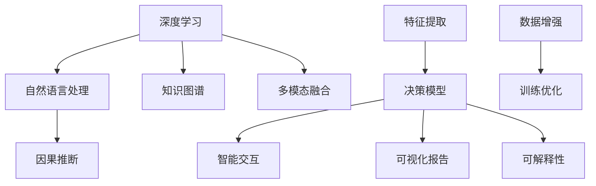

                 

# 软件 2.0 的社会责任：科技向善

## 1. 背景介绍

在数字化时代，软件已经成为推动人类社会进步的重要力量。随着计算能力的飞速提升和数据量的爆炸式增长，软件的发展已经进入了"软件 2.0"的新纪元。所谓软件 2.0，指的是以深度学习、自然语言处理等人工智能技术为核心的新一代软件系统，这些系统具备强大的自主学习和推理能力，能够在复杂环境中自主优化决策，为用户提供更高效、更智能的服务。

然而，随着软件 2.0 技术的广泛应用，其潜在的伦理风险和负面影响也开始浮现。例如，深度学习模型的透明性不足，难以解释决策过程；自然语言处理系统的偏见和歧视问题，可能导致算法偏见和不公平待遇；机器人、自动驾驶等高风险应用，可能在人类不可控的情况下造成严重的安全事故。这些问题不仅挑战了技术的边界，也对人类社会提出了更高的要求。

因此，科技向善（Tech for Good）成为软件 2.0 时代的重要议题。本文将探讨软件 2.0 技术的社会责任，从伦理、公平、透明和可控四个维度出发，提出构建"负责任"软件系统的策略和方法，以期推动科技更好地服务于人类社会。

## 2. 核心概念与联系

### 2.1 核心概念概述

软件 2.0 技术主要基于深度学习和大数据，能够实现自动化决策和智能交互。其核心概念包括：

- **深度学习**：利用多层神经网络模拟人脑的特征提取和分类决策能力，实现对复杂数据的自动化处理。
- **自然语言处理**：通过计算机理解和生成人类语言，实现智能对话、文本摘要、机器翻译等应用。
- **知识图谱**：将结构化知识转化为图形化表示，用于增强模型的常识推理能力。
- **多模态融合**：将视觉、听觉、文本等多种模态数据进行整合，提升模型的感知和决策能力。
- **因果推断**：通过建立模型参数和决策结果之间的因果关系，提高模型的可解释性和鲁棒性。

这些核心技术相互结合，构建了软件 2.0 技术的基本框架，使其具备了强大的自主学习和决策能力。

### 2.2 核心概念原理和架构的 Mermaid 流程图



## 3. 核心算法原理 & 具体操作步骤
### 3.1 算法原理概述

软件 2.0 技术的核心算法包括深度学习模型、自然语言处理模型、知识图谱构建和融合、因果推断等。其中，深度学习模型通过多层次的非线性变换，实现对大规模数据的高效特征提取和分类。自然语言处理模型通过语言模型、序列标注、情感分析等任务，实现对人类语言的理解和生成。知识图谱构建和融合则通过关系抽取、实体识别、知识推理等方法，将结构化知识转化为图形化表示，增强模型的常识推理能力。因果推断则通过因果模型、反事实推断等技术，增强模型的决策透明性和可解释性。

### 3.2 算法步骤详解

软件 2.0 技术的开发流程通常包括以下步骤：

**Step 1: 数据预处理和标注**
- 收集和清洗大规模数据集。
- 对数据进行标注，确保标注的准确性和多样性。

**Step 2: 模型构建和训练**
- 选择适合的深度学习框架（如TensorFlow、PyTorch等）。
- 设计网络结构，选择合适的激活函数、损失函数和优化器。
- 在标注数据上训练模型，调整超参数，优化模型性能。

**Step 3: 模型验证和调优**
- 在验证集上评估模型性能，调整模型结构或参数。
- 应用正则化、Dropout等技术防止过拟合。

**Step 4: 模型部署和监控**
- 将训练好的模型部署到生产环境。
- 实时监控模型性能，及时调整模型参数。

### 3.3 算法优缺点

软件 2.0 技术的优点包括：
1. 高效处理大规模数据：深度学习模型的并行计算能力，使其能够高效处理海量数据。
2. 强大的泛化能力：深度学习模型能够从数据中学习到丰富的特征表示，提升模型泛化性能。
3. 智能决策：自然语言处理模型能够理解和生成自然语言，实现智能交互和决策。
4. 可解释性增强：因果推断技术能够揭示模型决策的因果关系，增强模型的可解释性。

软件 2.0 技术的缺点包括：
1. 计算资源消耗大：深度学习模型通常需要大量的计算资源进行训练和推理。
2. 数据依赖性强：模型性能高度依赖于训练数据的质量和数量。
3. 透明性不足：深度学习模型的决策过程难以解释，难以进行审计和监管。
4. 偏见问题：自然语言处理模型可能学习到数据中的偏见，导致决策偏见和不公平。

### 3.4 算法应用领域

软件 2.0 技术在医疗、金融、教育、交通等领域有广泛应用：

- **医疗**：利用深度学习模型进行医学影像诊断、病历分析、个性化治疗等。
- **金融**：应用自然语言处理模型进行金融舆情监测、客户服务、风险管理等。
- **教育**：通过知识图谱和自然语言处理模型，实现智能教育、作业批改、学情分析等。
- **交通**：利用多模态融合和因果推断技术，实现自动驾驶、智能交通管理等。

## 4. 数学模型和公式 & 详细讲解 & 举例说明

### 4.1 数学模型构建

软件 2.0 技术的数学模型通常包括深度学习模型、自然语言处理模型、知识图谱构建和融合、因果推断等。以下以深度学习模型为例，介绍其基本结构。

假设输入为 $x$，输出为 $y$，深度学习模型的目标是通过训练数据学习参数 $\theta$，最小化损失函数 $L$。常用的损失函数包括均方误差（MSE）、交叉熵（CE）等。

设神经网络模型为 $f(x; \theta) = W^L \dots W_1 x + b^L \dots b_1$，其中 $W$ 和 $b$ 分别为权重和偏置，$L$ 为网络层数。模型训练的目标是：

$$
\theta^* = \mathop{\arg\min}_{\theta} L(y, f(x; \theta))
$$

其中，$L(y, f(x; \theta))$ 为损失函数，$y$ 为真实标签，$f(x; \theta)$ 为模型输出。

### 4.2 公式推导过程

以均方误差损失函数为例，推导深度学习模型的最小二乘解。

设模型的输出为 $\hat{y} = f(x; \theta)$，真实标签为 $y$，均方误差损失函数为：

$$
L(y, \hat{y}) = \frac{1}{N} \sum_{i=1}^N (y_i - \hat{y_i})^2
$$

对损失函数求导，得：

$$
\frac{\partial L}{\partial \theta} = -\frac{2}{N} \sum_{i=1}^N (y_i - \hat{y_i}) f'(x_i; \theta)
$$

其中 $f'(x_i; \theta)$ 为模型对输入 $x_i$ 的导数。

通过梯度下降等优化算法，更新模型参数 $\theta$，使损失函数最小化。

### 4.3 案例分析与讲解

以医学影像诊断为例，分析深度学习模型的构建和训练过程。

**数据预处理和标注**
- 收集大量的医学影像数据，进行标注和清洗。
- 将影像数据转换为张量，进行归一化和标准化处理。

**模型构建和训练**
- 选择卷积神经网络（CNN）模型，设计多层卷积和池化操作。
- 在标注数据上训练模型，调整卷积核大小、层数和激活函数等超参数。
- 应用数据增强技术，扩充训练集，防止过拟合。

**模型验证和调优**
- 在验证集上评估模型性能，计算准确率和召回率。
- 调整模型参数，优化网络结构，提高模型性能。

**模型部署和监控**
- 将训练好的模型部署到医疗系统中，实时接收影像数据。
- 实时监控模型性能，调整参数，确保模型稳定运行。

## 5. 项目实践：代码实例和详细解释说明

### 5.1 开发环境搭建

在使用Python进行深度学习开发时，通常需要以下环境：

- 安装Anaconda：从官网下载并安装Anaconda，用于创建独立的Python环境。
- 创建虚拟环境：
```bash
conda create -n pytorch-env python=3.8 
conda activate pytorch-env
```

- 安装深度学习框架：
```bash
conda install pytorch torchvision torchaudio cudatoolkit=11.1 -c pytorch -c conda-forge
```

- 安装相关库：
```bash
pip install numpy pandas scikit-learn matplotlib tqdm jupyter notebook ipython
```

### 5.2 源代码详细实现

以下是一个基于PyTorch的深度学习模型实现示例：

```python
import torch
import torch.nn as nn
import torch.optim as optim

# 定义模型结构
class Model(nn.Module):
    def __init__(self):
        super(Model, self).__init__()
        self.conv1 = nn.Conv2d(1, 10, kernel_size=5)
        self.conv2 = nn.Conv2d(10, 20, kernel_size=5)
        self.fc1 = nn.Linear(320, 50)
        self.fc2 = nn.Linear(50, 10)
    
    def forward(self, x):
        x = F.relu(self.conv1(x))
        x = F.max_pool2d(x, 2)
        x = F.relu(self.conv2(x))
        x = F.max_pool2d(x, 2)
        x = x.view(-1, 320)
        x = F.relu(self.fc1(x))
        x = self.fc2(x)
        return F.log_softmax(x, dim=1)

# 定义损失函数和优化器
model = Model()
loss_fn = nn.CrossEntropyLoss()
optimizer = optim.SGD(model.parameters(), lr=0.01)

# 定义训练函数
def train_epoch(model, train_loader, loss_fn, optimizer):
    model.train()
    train_loss = 0
    for batch_idx, (data, target) in enumerate(train_loader):
        optimizer.zero_grad()
        output = model(data)
        loss = loss_fn(output, target)
        loss.backward()
        optimizer.step()
        train_loss += loss.item()
    return train_loss / len(train_loader)

# 训练模型
train_loader = torch.utils.data.DataLoader(train_dataset, batch_size=64)
for epoch in range(10):
    train_loss = train_epoch(model, train_loader, loss_fn, optimizer)
    print(f"Epoch {epoch+1}, train loss: {train_loss:.3f}")
```

### 5.3 代码解读与分析

上述代码实现了简单的卷积神经网络模型，用于医学影像分类任务。其中：

- `nn.Conv2d`定义了卷积层，`nn.Linear`定义了全连接层。
- `F.relu`激活函数，`F.max_pool2d`池化操作。
- `nn.CrossEntropyLoss`定义了交叉熵损失函数。
- `optim.SGD`定义了随机梯度下降优化器。
- `train_epoch`函数定义了模型训练循环。

## 6. 实际应用场景

### 6.1 医疗影像诊断

深度学习模型在医疗影像诊断中有着广泛应用。通过大量的医学影像数据，训练深度学习模型，可以实现自动化诊断，提升诊断效率和准确率。

在实践中，可以采用迁移学习的方法，利用预训练的医学影像模型，在小规模数据集上进行微调，以适应特定医院或科室的诊断需求。微调后的模型可以用于辅助医生进行诊断，减少误诊和漏诊，提升医疗服务质量。

### 6.2 金融舆情监测

自然语言处理技术在金融舆情监测中也有着重要应用。通过收集金融领域的微博、新闻、评论等数据，训练自然语言处理模型，可以实现舆情分析和情感分析，及时发现金融市场动向，预警风险。

在实践中，可以采用情感分析模型，对金融舆情进行实时监测，分析市场情绪和舆情趋势。通过舆情分析和情感分析，及时调整投资策略，规避市场风险。

### 6.3 智能教育

知识图谱和自然语言处理技术在智能教育中有重要应用。通过构建知识图谱，可以为学习者提供更加丰富的知识结构，提升学习效果。通过自然语言处理技术，可以辅助教师进行作业批改、学情分析等。

在实践中，可以构建智能教育平台，通过自然语言处理技术进行智能答疑，辅助教师进行个性化教学。同时，利用知识图谱技术，为学习者提供个性化推荐，提升学习效率。

## 7. 工具和资源推荐

### 7.1 学习资源推荐

为了帮助开发者系统掌握深度学习技术，这里推荐一些优质的学习资源：

- Coursera《深度学习专项课程》：由吴恩达教授主讲，系统介绍深度学习原理和实践。
- Fast.ai《深度学习实践课程》：通过实战项目，快速掌握深度学习技术。
- DeepLearning.ai《深度学习应用课程》：介绍深度学习在医疗、金融等领域的实际应用。

### 7.2 开发工具推荐

以下是几款用于深度学习开发和训练的常用工具：

- TensorFlow：由Google开发，功能强大，支持分布式训练和部署。
- PyTorch：由Facebook开发，灵活易用，支持动态图和静态图。
- Keras：基于TensorFlow和Theano，支持快速搭建神经网络模型。
- JAX：由Google开发，高性能计算框架，支持自动微分和分布式计算。

### 7.3 相关论文推荐

深度学习技术的发展离不开学界的持续研究。以下是几篇奠基性的相关论文，推荐阅读：

- ImageNet分类挑战赛论文：AlexNet、VGG、ResNet等经典模型的介绍。
- AlphaGo论文：通过深度学习和蒙特卡罗树搜索，实现围棋人工智能。
- Generative Adversarial Networks（GANs）：生成对抗网络技术，实现高质量的图像生成和数据增强。

## 8. 总结：未来发展趋势与挑战

### 8.1 研究成果总结

深度学习技术已经取得了显著的进展，广泛应用于医疗、金融、教育等领域，为人类社会的进步做出了重要贡献。然而，深度学习技术的应用也带来了诸多挑战，如透明性不足、偏见问题、数据依赖性强等。

### 8.2 未来发展趋势

展望未来，深度学习技术将呈现以下几个发展趋势：

- 可解释性增强：通过因果推断和可解释性模型，增强深度学习的透明性和可解释性。
- 偏见问题缓解：采用公平性约束和数据多样性训练，缓解深度学习模型的偏见问题。
- 分布式计算：通过分布式计算和联邦学习，提升深度学习的训练和推理效率。
- 跨领域应用：将深度学习技术应用于更多领域，如自动驾驶、智能制造等。

### 8.3 面临的挑战

尽管深度学习技术已经取得了显著进展，但在迈向更加智能化、普适化应用的过程中，仍面临诸多挑战：

- 透明性不足：深度学习模型的决策过程难以解释，难以进行审计和监管。
- 偏见问题：深度学习模型可能学习到数据中的偏见，导致决策偏见和不公平。
- 数据依赖性强：模型性能高度依赖于训练数据的质量和数量。
- 计算资源消耗大：深度学习模型通常需要大量的计算资源进行训练和推理。

### 8.4 研究展望

为了解决深度学习技术面临的挑战，未来的研究需要在以下几个方面寻求新的突破：

- 开发更加可解释的深度学习模型，增强模型的透明性和可解释性。
- 引入公平性约束和数据多样性训练，缓解深度学习模型的偏见问题。
- 采用分布式计算和联邦学习技术，提升深度学习的训练和推理效率。
- 将深度学习技术应用于更多领域，如自动驾驶、智能制造等。

## 9. 附录：常见问题与解答

**Q1: 深度学习模型在实际应用中存在哪些问题？**

A: 深度学习模型在实际应用中存在以下问题：
- 透明性不足：深度学习模型的决策过程难以解释，难以进行审计和监管。
- 偏见问题：深度学习模型可能学习到数据中的偏见，导致决策偏见和不公平。
- 数据依赖性强：模型性能高度依赖于训练数据的质量和数量。
- 计算资源消耗大：深度学习模型通常需要大量的计算资源进行训练和推理。

**Q2: 如何缓解深度学习模型的偏见问题？**

A: 缓解深度学习模型的偏见问题，可以采用以下方法：
- 数据多样性训练：使用多样化的数据集进行训练，确保数据分布均衡。
- 公平性约束：引入公平性约束，防止模型对某些类别产生偏见。
- 可解释性增强：通过因果推断和可解释性模型，增强模型的透明性和可解释性。

**Q3: 如何提高深度学习模型的训练效率？**

A: 提高深度学习模型的训练效率，可以采用以下方法：
- 分布式计算：利用分布式计算框架，如TensorFlow、PyTorch等，加速模型训练。
- 模型压缩：使用模型压缩技术，如量化、剪枝等，减小模型尺寸，提升训练和推理效率。
- 联邦学习：通过联邦学习技术，在本地设备上进行分布式训练，避免数据隐私泄露。

**Q4: 如何构建可解释的深度学习模型？**

A: 构建可解释的深度学习模型，可以采用以下方法：
- 可解释性模型：使用可解释性模型，如LIME、SHAP等，对模型的决策过程进行解释。
- 因果推断：通过因果推断模型，揭示模型决策的因果关系，增强模型的透明性和可解释性。
- 可视化工具：使用可视化工具，如TensorBoard、Visdom等，对模型进行可视化展示。

**Q5: 如何处理深度学习模型的偏见问题？**

A: 处理深度学习模型的偏见问题，可以采用以下方法：
- 数据多样性训练：使用多样化的数据集进行训练，确保数据分布均衡。
- 公平性约束：引入公平性约束，防止模型对某些类别产生偏见。
- 可解释性增强：通过因果推断和可解释性模型，增强模型的透明性和可解释性。

---

作者：禅与计算机程序设计艺术 / Zen and the Art of Computer Programming

