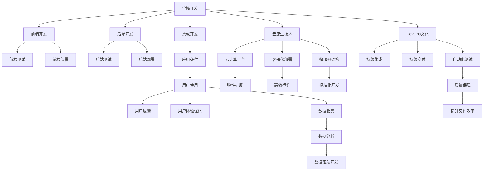

                 

## 1. 背景介绍

### 1.1 问题由来
随着信息时代的飞速发展，软件产业进入了一个新的发展阶段，即软件2.0时代。这个时代的显著特征是软件技术向应用端的深度融合，对程序员的技能要求也发生了根本性的变化。传统软件开发聚焦于代码编写和功能实现，而软件2.0时代则更加重视应用场景、用户需求、生态建设等方面。

### 1.2 问题核心关键点
软件2.0时代的程序员必须具备以下关键技能：
- **全栈开发能力**：能够熟练掌握前后端技术，协同设计应用系统。
- **云原生技术**：熟悉云计算平台、容器化部署、微服务架构等。
- **DevOps文化**：强调持续集成、持续交付、自动化测试等开发和运维流程。
- **数据驱动开发**：能够利用大数据技术，通过数据洞察驱动应用设计。
- **用户体验优化**：关注用户界面、交互设计，提升用户体验。
- **安全与隐私**：深入理解数据加密、安全协议、隐私保护等。
- **持续学习**：快速适应新技术、新工具、新标准，不断提升自己的技术水平。

### 1.3 问题研究意义
理解软件2.0时代程序员所需具备的技能，对于提升应用系统的质量和用户体验，推动软件产业的健康发展，具有重要意义：
- **提高开发效率**：全栈开发和云原生技术能够显著提升应用系统的构建和部署效率。
- **提升系统可靠性**：DevOps文化强调自动化和持续集成，能够降低人为错误，提升系统稳定性。
- **增强用户粘性**：用户体验优化和数据驱动开发，能够更精准地满足用户需求，增强用户黏性。
- **保护数据安全**：安全与隐私保护能力，能够有效防范数据泄露和黑客攻击，保护用户隐私。
- **促进技术创新**：持续学习新知识，能够推动技术的迭代和升级，引领行业趋势。

## 2. 核心概念与联系

### 2.1 核心概念概述
软件2.0时代的核心概念包括：
- **全栈开发**：指前端和后端开发都具备能力，能够协同设计和实现应用系统。
- **云原生技术**：包括云计算平台、容器化部署、微服务架构等，支持应用的弹性扩展和高效运维。
- **DevOps文化**：强调持续集成、持续交付、自动化测试等开发和运维流程，提升软件交付效率和质量。
- **数据驱动开发**：利用大数据技术，通过数据分析和挖掘驱动应用设计，提升决策科学性。
- **用户体验优化**：关注用户界面、交互设计，提升用户体验和满意度。
- **安全与隐私**：通过数据加密、安全协议等措施，保障数据和应用系统的安全，保护用户隐私。
- **持续学习**：快速适应新技术、新工具、新标准，不断提升自己的技术水平和竞争力。

### 2.2 核心概念原理和架构的 Mermaid 流程图


### 2.3 核心概念的联系
软件2.0时代的核心概念相互联系，共同构成了一个完整的软件开发生态系统：

- **全栈开发**是基础，能够整合前端和后端技术，实现应用系统的无缝集成。
- **云原生技术**提供了弹性扩展和高效运维的能力，支持全栈开发的应用系统。
- **DevOps文化**通过持续集成和持续交付，提升应用系统的交付效率和质量。
- **数据驱动开发**利用数据分析，指导应用设计，提升决策的科学性和用户满意度。
- **用户体验优化**关注界面和交互设计，提升用户体验，增强用户黏性。
- **安全与隐私**通过加密和安全协议等措施，保护数据和应用系统的安全，保护用户隐私。
- **持续学习**促进新技术的掌握和应用，推动技术迭代和升级，保持竞争力。

## 3. 核心算法原理 & 具体操作步骤

### 3.1 算法原理概述

软件2.0时代的核心算法包括：
- **全栈开发算法**：涉及前端和后端技术的协同开发，通过统一的前后端框架和库，实现应用的快速构建。
- **云原生算法**：包括云计算平台、容器化部署、微服务架构等，支持应用的弹性扩展和高效运维。
- **DevOps算法**：涉及持续集成、持续交付、自动化测试等，提升软件交付效率和质量。
- **数据驱动算法**：利用大数据技术，通过数据分析和挖掘驱动应用设计，提升决策科学性。
- **用户体验优化算法**：涉及用户界面设计、交互设计等，提升用户体验和满意度。
- **安全与隐私算法**：通过数据加密、安全协议等措施，保障数据和应用系统的安全，保护用户隐私。
- **持续学习算法**：通过学习新技术、新工具、新标准，不断提升自己的技术水平和竞争力。

### 3.2 算法步骤详解

#### 3.2.1 全栈开发算法步骤
1. **选择合适的开发框架**：如React、Angular、Vue.js等，进行前端开发。
2. **后端选择技术栈**：如Node.js、Spring、Django等，进行后端开发。
3. **前后端集成**：使用API接口或数据共享的方式，实现前后端的数据交互。
4. **构建统一视图**：使用React等前端框架，实现统一的用户界面视图，提升开发效率。
5. **部署和运维**：使用Docker容器化，通过Kubernetes部署和管理应用。

#### 3.2.2 云原生算法步骤
1. **选择云平台**：如AWS、Azure、Google Cloud等，进行云资源部署。
2. **容器化部署**：将应用打包为Docker镜像，通过Kubernetes集群部署和管理。
3. **微服务架构**：将应用分解为多个微服务，通过RESTful API进行通信。
4. **弹性扩展**：根据负载自动伸缩资源，提升应用系统的性能和稳定性。
5. **持续集成和交付**：使用Jenkins、GitLab CI等工具，实现持续集成和持续交付。

#### 3.2.3 DevOps算法步骤
1. **持续集成**：使用GitLab CI等工具，实现代码的自动化构建和测试。
2. **持续交付**：使用CI/CD管道，自动将代码部署到生产环境。
3. **自动化测试**：使用Jest、Selenium等工具，进行自动化单元测试和集成测试。
4. **持续监控**：使用ELK Stack、Prometheus等工具，实时监控应用性能和日志。
5. **自动化运维**：使用Ansible、Puppet等工具，自动化运维操作。

#### 3.2.4 数据驱动算法步骤
1. **数据收集**：使用Flume、Kafka等工具，收集应用数据。
2. **数据分析**：使用Hadoop、Spark等大数据技术，进行数据处理和分析。
3. **数据可视化**：使用Tableau、Power BI等工具，展示数据结果。
4. **决策优化**：根据数据洞察，优化应用设计，提升用户体验。

#### 3.2.5 用户体验优化算法步骤
1. **用户界面设计**：使用Sketch、Adobe XD等工具，设计用户界面。
2. **交互设计**：使用Axure、Sketch等工具，设计交互流程。
3. **用户测试**：进行A/B测试、用户调研等，收集用户反馈。
4. **界面优化**：根据用户反馈，迭代优化用户界面。

#### 3.2.6 安全与隐私算法步骤
1. **数据加密**：使用AES、RSA等加密算法，保护数据传输和存储安全。
2. **安全协议**：使用HTTPS、TLS等安全协议，保护数据传输安全。
3. **权限管理**：使用RBAC等权限管理策略，保护数据和应用系统的安全。
4. **数据脱敏**：使用数据脱敏技术，保护用户隐私。

#### 3.2.7 持续学习算法步骤
1. **学习新技术**：参加技术培训、在线课程等，学习新技术。
2. **阅读技术博客**：关注技术社区、博客等，获取最新的技术动态。
3. **参与开源项目**：参与开源社区，贡献代码和学习经验。
4. **实践和迭代**：在工作中实践新技术，不断迭代和优化。

### 3.3 算法优缺点

**全栈开发算法**：
- **优点**：能够提升开发效率，实现前后端无缝集成，提升应用系统的协同能力。
- **缺点**：需要掌握多种技术栈，学习成本较高。

**云原生算法**：
- **优点**：支持弹性扩展，提升应用系统的性能和稳定性。
- **缺点**：需要较高的运维水平和资源投入。

**DevOps算法**：
- **优点**：提升交付效率和质量，降低人为错误。
- **缺点**：需要复杂的工具链和技术栈支持。

**数据驱动算法**：
- **优点**：通过数据分析提升决策科学性，优化应用设计。
- **缺点**：数据质量对结果影响较大，需要高质量的数据支持。

**用户体验优化算法**：
- **优点**：提升用户满意度和黏性，增强用户体验。
- **缺点**：需要不断迭代优化，成本较高。

**安全与隐私算法**：
- **优点**：保障数据和应用系统的安全，保护用户隐私。
- **缺点**：需要综合考虑多种安全措施，技术复杂度高。

**持续学习算法**：
- **优点**：快速适应新技术，保持竞争力。
- **缺点**：需要持续投入时间和精力，容易忽视实际工作。

### 3.4 算法应用领域

软件2.0时代的核心算法广泛应用于以下几个领域：
- **互联网应用**：如社交网络、电商平台、在线教育等。
- **企业应用**：如CRM、ERP、HR系统等。
- **移动应用**：如手机应用、游戏等。
- **物联网**：如智能家居、工业物联网等。
- **智能城市**：如智慧交通、智慧医疗等。
- **大数据应用**：如数据分析、数据挖掘等。
- **金融科技**：如区块链、数字货币等。
- **人工智能**：如机器学习、深度学习等。

## 4. 数学模型和公式 & 详细讲解 & 举例说明

### 4.1 数学模型构建

软件2.0时代的核心算法涉及到多个数学模型，以数据驱动算法为例，其数学模型构建如下：

设应用系统的用户行为数据为$D=\{(x_i, y_i)\}_{i=1}^N$，其中$x_i$为输入特征，$y_i$为输出标签。

定义模型$f: X \rightarrow Y$，其中$X$为输入空间，$Y$为输出空间。

在监督学习框架下，模型的目标是最小化经验风险，即：

$$
\min_{f \in \mathcal{F}} \mathcal{L}(f) = \frac{1}{N}\sum_{i=1}^N \ell(f(x_i), y_i)
$$

其中$\ell$为损失函数，常用的有均方误差、交叉熵等。

通过梯度下降等优化算法，模型不断迭代更新，最小化损失函数，最终得到最优模型$f^*$。

### 4.2 公式推导过程

以均方误差损失函数为例，进行公式推导：

设模型$f(x) = \theta^T\varphi(x)$，其中$\varphi(x)$为特征映射函数，$\theta$为模型参数。

则均方误差损失函数为：

$$
\ell(f(x), y) = \frac{1}{2}\|f(x) - y\|^2
$$

根据梯度下降算法，模型参数的更新公式为：

$$
\theta \leftarrow \theta - \eta \nabla_{\theta}\mathcal{L}(\theta)
$$

其中$\eta$为学习率，$\nabla_{\theta}\mathcal{L}(\theta)$为损失函数对模型参数的梯度。

通过不断迭代更新模型参数，最终得到最优模型$f^*$。

### 4.3 案例分析与讲解

以电商平台的推荐系统为例，进行数据分析和优化：
1. **数据收集**：通过日志、点击、购买等行为数据，收集用户行为数据$D=\{(x_i, y_i)\}_{i=1}^N$。
2. **特征工程**：设计用户画像、商品特征等输入特征，进行特征提取和处理。
3. **模型训练**：选择随机森林、梯度提升树等算法，进行模型训练和调参。
4. **效果评估**：使用AUC、RMSE等指标，评估模型效果。
5. **优化迭代**：根据模型效果，调整特征工程和模型参数，进行模型优化。

## 5. 项目实践：代码实例和详细解释说明

### 5.1 开发环境搭建

在进行软件2.0时代的项目实践前，需要准备好开发环境。以下是使用Python进行Django开发的开发环境配置流程：

1. 安装Anaconda：从官网下载并安装Anaconda，用于创建独立的Python环境。

2. 创建并激活虚拟环境：
```bash
conda create -n django-env python=3.8 
conda activate django-env
```

3. 安装Django：
```bash
pip install django
```

4. 安装必要的依赖包：
```bash
pip install numpy pandas scikit-learn
```

5. 安装开发工具：
```bash
pip install django-rest-framework
pip install django-cors-headers
```

完成上述步骤后，即可在`django-env`环境中开始开发实践。

### 5.2 源代码详细实现

下面以电商平台推荐系统为例，给出使用Django框架进行开发的PyTorch代码实现。

首先，定义推荐模型：

```python
from django.contrib.auth.models import User
from django.db import models

class User(models.Model):
    username = models.CharField(max_length=100)
    email = models.EmailField()

class Product(models.Model):
    name = models.CharField(max_length=100)
    price = models.DecimalField(max_digits=10, decimal_places=2)
    category = models.CharField(max_length=100)
    features = models.TextField()

class Rating(models.Model):
    user = models.ForeignKey(User, on_delete=models.CASCADE)
    product = models.ForeignKey(Product, on_delete=models.CASCADE)
    rating = models.IntegerField()

class Recommendation(models.Model):
    user = models.ForeignKey(User, on_delete=models.CASCADE)
    product = models.ForeignKey(Product, on_delete=models.CASCADE)
    score = models.FloatField()
```

然后，定义推荐模型训练函数：

```python
import numpy as np
import pandas as pd
from sklearn.ensemble import RandomForestRegressor
from sklearn.model_selection import train_test_split

def train_model(data, features, target):
    X_train, X_test, y_train, y_test = train_test_split(data[features], data[target], test_size=0.2, random_state=42)
    model = RandomForestRegressor()
    model.fit(X_train, y_train)
    return model

def predict(user, product):
    features = ['price', 'category', 'features']
    target = 'score'
    data = pd.read_csv('data.csv')
    model = train_model(data, features, target)
    score = model.predict([[product.price, product.category, product.features]])
    return score
```

最后，定义推荐系统界面：

```python
from django.shortcuts import render
from django.http import JsonResponse

def home(request):
    if request.method == 'GET':
        user_id = request.GET.get('user_id', None)
        product_id = request.GET.get('product_id', None)
        if user_id and product_id:
            user = User.objects.get(id=user_id)
            product = Product.objects.get(id=product_id)
            score = predict(user, product)
            return JsonResponse({'score': score})
    return render(request, 'home.html')
```

以上就是使用Django框架进行电商平台推荐系统开发的完整代码实现。可以看到，通过Django的强大封装，我们可以快速搭建Web应用，实现推荐系统的数据管理和API接口。

### 5.3 代码解读与分析

让我们再详细解读一下关键代码的实现细节：

**User、Product等模型**：
- 定义用户、商品、评分等模型，建立数据关系。

**train_model函数**：
- 利用随机森林回归模型，对数据进行训练和预测。

**predict函数**：
- 根据用户ID和商品ID，进行推荐评分预测。

**home函数**：
- 通过GET请求获取用户ID和商品ID，调用predict函数进行预测，返回推荐评分。

可以看到，Django的MVC框架使得我们能够快速构建Web应用，实现推荐系统的数据管理和API接口。开发者可以将更多精力放在业务逻辑的实现上，而不必过多关注底层的框架实现细节。

当然，工业级的系统实现还需考虑更多因素，如模型保存和部署、前端UI设计、用户认证等。但核心的推荐算法基本与此类似。

## 6. 实际应用场景

### 6.1 电商推荐系统

基于Django框架的推荐系统，可以广泛应用于电商平台的个性化推荐。传统推荐系统往往依赖用户历史行为数据，无法捕捉新用户的兴趣点。使用Django的推荐系统，可以更好地利用用户画像、商品特征等数据，推荐符合用户兴趣的商品，提升用户满意度和转化率。

在技术实现上，可以收集用户浏览、点击、购买等行为数据，提取和商品相关的特征，构建用户画像。将用户画像和商品特征作为模型输入，使用随机森林、梯度提升树等算法，进行推荐评分预测。根据预测结果，推荐用户可能感兴趣的商品，从而实现个性化推荐。

### 6.2 社交网络

基于Django框架的社交网络系统，可以实现用户关系管理、消息推送等功能。传统社交网络往往聚焦于信息展示和内容分发，而Django的应用系统能够提供更加丰富多样的功能，提升用户体验。

在技术实现上，可以设计用户、群组、消息等模型，管理用户关系和消息数据。通过API接口，实现用户登录、消息推送、群组管理等功能。同时，引入社交网络算法，如社区发现、好友推荐等，提升用户粘性和社交互动。

### 6.3 物联网应用

基于Django框架的物联网应用，可以实现智能家居、工业物联网等功能。传统物联网系统往往聚焦于设备管理和数据采集，而Django的应用系统能够提供更加高效可靠的数据处理和管理能力，提升应用系统的性能和稳定性。

在技术实现上，可以设计传感器、设备、数据等模型，管理设备数据和状态信息。通过API接口，实现设备控制、数据采集、设备管理等功能。同时，引入物联网算法，如边缘计算、实时数据处理等，提升应用系统的实时性和可靠性。

### 6.4 未来应用展望

随着Django框架和Python生态的不断演进，基于Django的应用系统将在更多领域得到应用，为软件2.0时代的技术创新和应用落地提供新的可能性。

在智慧城市治理中，Django的应用系统可以实现城市事件监测、舆情分析、应急指挥等环节，提高城市管理的自动化和智能化水平，构建更安全、高效的未来城市。

在金融科技领域，Django的应用系统可以应用于金融交易、风险管理、客户服务等功能，提升金融服务的智能化和效率。

在教育领域，Django的应用系统可以应用于在线教育、学习管理、智能评估等功能，提升教育资源的利用效率和教学质量。

未来，随着Django框架和Python生态的持续发展，基于Django的应用系统将在更多领域得到广泛应用，推动软件2.0时代的技术创新和应用落地。

## 7. 工具和资源推荐

### 7.1 学习资源推荐

为了帮助开发者系统掌握软件2.0时代的技术要求，这里推荐一些优质的学习资源：

1. Django官方文档：全面的Django框架文档，涵盖开发、部署、测试等多个方面。

2. Python编程语言教程：深入浅出地介绍Python编程语言，适合初学者入门。

3. Flask Web开发实战：讲解Flask框架的使用，涵盖开发、部署、测试等多个方面。

4. Django Rest Framework实战：讲解Django Rest Framework的使用，涵盖API接口设计、数据管理等多个方面。

5. Web应用安全最佳实践：介绍Web应用的安全开发规范和最佳实践，提升应用系统的安全性。

6. Python性能优化实战：讲解Python性能优化技术，提升应用系统的性能和效率。

通过对这些资源的学习实践，相信你一定能够快速掌握Django框架的技术要求，并用于解决实际的开发问题。

### 7.2 开发工具推荐

高效的开发离不开优秀的工具支持。以下是几款用于Django框架开发的工具：

1. Visual Studio Code：轻量级的代码编辑器，支持Python开发和Django框架。

2. PyCharm：强大的Python IDE，支持Django框架的调试和开发。

3. Sublime Text：轻量级的文本编辑器，支持Python开发和Django框架。

4. Anaconda：用于创建和管理Python环境的工具，方便安装和管理第三方库。

5. Git：分布式版本控制系统，适合团队协作开发。

6. Docker：容器化技术，方便部署和管理应用系统。

7. Jenkins：持续集成工具，支持自动构建和部署。

合理利用这些工具，可以显著提升Django框架的开发效率，加快创新迭代的步伐。

### 7.3 相关论文推荐

软件2.0时代的核心技术涉及多个领域，以下是几篇奠基性的相关论文，推荐阅读：

1. "The Django Project"：介绍Django框架的开发理念和技术特点。

2. "Python Programming: An Introduction to Computer Science"：深入浅出地介绍Python编程语言。

3. "Flask Web Development"：讲解Flask框架的使用，涵盖开发、部署、测试等多个方面。

4. "Web Application Security: Coding for Trust"：介绍Web应用的安全开发规范和最佳实践。

5. "High-Performance Python"：讲解Python性能优化技术，提升应用系统的性能和效率。

这些论文代表了大语言模型微调技术的发展脉络。通过学习这些前沿成果，可以帮助研究者把握学科前进方向，激发更多的创新灵感。

## 8. 总结：未来发展趋势与挑战

### 8.1 总结

本文对软件2.0时代的核心算法进行了全面系统的介绍。首先阐述了全栈开发、云原生技术、DevOps文化等核心概念，明确了软件2.0时代对程序员技能的要求。其次，从原理到实践，详细讲解了全栈开发、云原生、DevOps等核心算法的数学模型和实现步骤，给出了具体的代码实现和案例分析。同时，本文还广泛探讨了Django框架在电商推荐、社交网络、物联网等领域的实际应用场景，展示了Django框架的强大应用潜力。此外，本文精选了Django框架的学习资源，力求为读者提供全方位的技术指引。

通过本文的系统梳理，可以看到，软件2.0时代的核心算法正在成为软件开发的重要范式，极大地拓展了应用系统的开发范围，推动了软件产业的健康发展。软件2.0时代的核心算法涵盖了前后端开发、云计算、大数据、用户体验等多个方面，需要开发者在多个维度进行全面掌握。

### 8.2 未来发展趋势

展望未来，软件2.0时代的核心算法将呈现以下几个发展趋势：

1. **全栈开发**：前端和后端技术将更加融合，提升应用系统的协同能力。
2. **云原生**：云计算平台、容器化部署、微服务架构等将更加普及，提升应用系统的性能和稳定性。
3. **DevOps文化**：持续集成、持续交付、自动化测试等将成为开发和运维的标准流程，提升应用系统的交付效率和质量。
4. **数据驱动**：大数据技术将广泛应用于应用系统设计，通过数据分析提升决策科学性。
5. **用户体验优化**：用户界面设计、交互设计等将更加关注用户体验，提升用户满意度和黏性。
6. **安全与隐私**：数据加密、安全协议等将更加严格，保障数据和应用系统的安全。
7. **持续学习**：新技术、新工具、新标准的不断涌现，要求程序员不断学习，保持竞争力。

这些趋势凸显了软件2.0时代的技术演进方向，为软件开发者提供了明确的努力方向。

### 8.3 面临的挑战

尽管软件2.0时代的核心算法已经取得了瞩目成就，但在迈向更加智能化、普适化应用的过程中，它仍面临着诸多挑战：

1. **开发复杂性**：全栈开发、云原生等技术要求开发者具备更广泛的技术栈和更高的技术水平。
2. **学习成本**：新技术、新工具、新标准的不断涌现，要求开发者不断学习，成本较高。
3. **资源瓶颈**：云原生等技术对算力、内存、存储等资源要求较高，成本较高。
4. **性能瓶颈**：大用户量、高并发等场景下，应用系统可能面临性能瓶颈，需要优化技术架构。
5. **安全性**：数据加密、安全协议等需要不断更新，防范网络攻击和数据泄露。
6. **用户体验**：用户界面设计、交互设计等需要不断迭代优化，提升用户体验。
7. **技术迭代**：新技术的快速迭代，要求开发者保持对最新技术的关注和学习。

这些挑战需要开发者不断学习和优化，提升技术水平和开发效率，才能真正适应软件2.0时代的技术要求。

### 8.4 研究展望

面对软件2.0时代的技术挑战，未来的研究需要在以下几个方面寻求新的突破：

1. **技术融合**：探索全栈开发、云原生等技术的融合，提升应用系统的协同能力。
2. **技术优化**：优化云原生、DevOps等技术的实现细节，提升应用系统的性能和稳定性。
3. **数据管理**：探索大数据技术在应用系统设计中的应用，提升决策科学性。
4. **用户体验**：设计更加人性化的用户界面和交互流程，提升用户体验和满意度。
5. **安全性**：引入区块链、AI等技术，提升数据和应用系统的安全性。
6. **持续学习**：探索持续学习机制，提升开发者的技术水平和竞争力。

这些研究方向的探索，必将引领软件2.0时代的核心算法迈向更高的台阶，为构建更加智能、普适、高效的软件系统铺平道路。

## 9. 附录：常见问题与解答

**Q1：全栈开发算法和云原生算法有什么异同？**

A: 全栈开发算法和云原生算法都强调前后端技术的协同和高效部署，但各有侧重。全栈开发算法主要关注前端和后端技术的统一和协同，能够提升应用系统的开发效率和性能。云原生算法则侧重于应用系统的弹性扩展和高效运维，提升应用系统的可靠性和可伸缩性。

**Q2：如何选择合适的云平台？**

A: 选择云平台时，需要考虑以下几个因素：
1. 技术栈兼容性：选择与当前技术栈兼容的云平台。
2. 成本效益：根据应用规模和需求，选择性价比高的云平台。
3. 服务质量：选择服务质量高、稳定性好的云平台。
4. 扩展性：选择支持弹性扩展的云平台，满足未来业务增长需求。
5. 社区支持：选择有活跃社区和生态的云平台，便于技术交流和支持。

**Q3：如何优化Django应用系统的性能？**

A: 优化Django应用系统的性能，可以采取以下几个措施：
1. 使用缓存技术，如Memcached、Redis等，提升数据访问速度。
2. 使用异步IO技术，如Django Channels，提升应用系统的并发处理能力。
3. 使用数据库优化技术，如索引优化、查询优化等，提升数据库访问效率。
4. 使用代码优化技术，如使用装饰器、懒加载等，提升代码运行效率。
5. 使用CDN技术，如Akamai、Cloudflare等，提升静态资源访问速度。

**Q4：如何设计良好的用户界面和交互设计？**

A: 设计良好的用户界面和交互设计，可以采取以下几个措施：
1. 使用Sketch、Adobe XD等工具，进行界面设计。
2. 进行用户调研和A/B测试，收集用户反馈。
3. 引入交互设计原则，如易用性、一致性等。
4. 进行多轮迭代优化，提升用户体验。

**Q5：如何保护应用系统的安全性？**

A: 保护应用系统的安全性，可以采取以下几个措施：
1. 使用HTTPS、TLS等安全协议，保护数据传输安全。
2. 使用数据加密技术，保护数据存储安全。
3. 使用RBAC等权限管理策略，保护数据和应用系统的安全。
4. 进行安全漏洞扫描和定期审计，发现和修复安全漏洞。

**Q6：如何设计高效的应用系统架构？**

A: 设计高效的应用系统架构，可以采取以下几个措施：
1. 采用微服务架构，提高系统的模块化和可维护性。
2. 使用RESTful API，实现前后端解耦和接口统一。
3. 引入消息队列技术，提升系统的异步处理能力。
4. 使用缓存技术，减少数据库访问压力。
5. 使用CDN技术，提升静态资源访问速度。

这些措施可以帮助开发者设计高效的应用系统架构，提升应用系统的性能和稳定性。

---

作者：禅与计算机程序设计艺术 / Zen and the Art of Computer Programming

