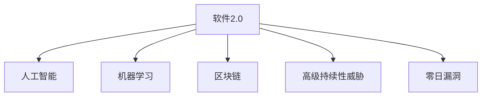

                 

## 1. 背景介绍

### 1.1 问题由来
随着软件开发和部署的日益复杂，软件安全性问题逐渐成为企业和用户共同关注的焦点。传统的软件安全防护措施，如防火墙、入侵检测、代码审计等，主要针对已知的攻击方式，难以有效应对新型漏洞的威胁。特别是近年来，随着高级持续性威胁(APT)和零日漏洞攻击的频发，传统安全防御策略显得力不从心。

为了应对这些挑战，新一代软件安全性技术——软件2.0（Software 2.0）应运而生。软件2.0融合了人工智能、机器学习、区块链等先进技术，能够主动识别和抵御新型攻击，提升软件系统的安全性。

### 1.2 问题核心关键点
软件2.0的核心目标是通过构建自适应的安全防护体系，实时监控和分析软件行为，识别和应对未知威胁。其主要关键点包括：

1. **动态防御机制**：通过实时分析软件行为，动态调整防御策略，防止已知的攻击方式。
2. **智能威胁检测**：利用机器学习算法，自动分析恶意代码和行为，快速识别新型威胁。
3. **透明化监控与审计**：借助区块链等技术，实现软件行为的可追溯性和透明性，增强安全性。
4. **多维度防护**：融合多种安全技术，构建立体化安全防护体系，提升整体安全水平。

## 2. 核心概念与联系

### 2.1 核心概念概述

为更好地理解软件2.0的安全性挑战与对策，本节将介绍几个密切相关的核心概念：

1. **软件2.0**：新一代软件安全性技术，融合了人工智能、机器学习、区块链等先进技术，能够主动识别和抵御新型攻击，提升软件系统的安全性。
2. **人工智能(AI)**：一种通过数据驱动的方法，让计算机系统具备类似于人类的智能。
3. **机器学习(ML)**：通过算法和模型，使计算机系统具备从数据中学习的能力，能够自动优化决策和行为。
4. **区块链(Blockchain)**：一种分布式账本技术，通过去中心化的方式，实现数据的不可篡改和透明性。
5. **高级持续性威胁(APT)**：一种复杂且具有高度组织性的攻击方式，目标明确，攻击手段多样，难以被发现和防范。
6. **零日漏洞(ZERO-DAY)**：指软件厂商未知的漏洞，黑客可以利用的时间窗口，攻击者可以利用这些漏洞进行攻击。

这些核心概念之间的逻辑关系可以通过以下Mermaid流程图来展示：



这个流程图展示了大语言模型的核心概念及其之间的关系：

1. 软件2.0通过融合人工智能、机器学习、区块链等技术，构建自适应的安全防护体系。
2. 人工智能和机器学习提供了分析软件行为和威胁检测的能力。
3. 区块链技术提供了数据的不可篡改和透明性。
4. 高级持续性威胁和零日漏洞是软件2.0需要重点防御的目标。

## 3. 核心算法原理 & 具体操作步骤
### 3.1 算法原理概述

软件2.0的安全性挑战与对策，本质上是构建一个自适应的安全防护体系，该体系能够实时监控和分析软件行为，动态调整防御策略，防止新型攻击。其核心算法原理包括：

1. **动态防御机制**：通过实时分析软件行为，动态调整防御策略，防止已知的攻击方式。
2. **智能威胁检测**：利用机器学习算法，自动分析恶意代码和行为，快速识别新型威胁。
3. **透明化监控与审计**：借助区块链等技术，实现软件行为的可追溯性和透明性，增强安全性。
4. **多维度防护**：融合多种安全技术，构建立体化安全防护体系，提升整体安全水平。

### 3.2 算法步骤详解

软件2.0的安全性挑战与对策，通常包括以下几个关键步骤：

**Step 1: 数据收集与预处理**
- 收集软件行为日志、系统调用日志、网络流量日志等数据，并进行数据清洗和预处理。
- 对数据进行去重、归一化、特征提取等操作，为后续分析提供高质量的数据集。

**Step 2: 行为分析和威胁检测**
- 使用机器学习算法（如决策树、随机森林、神经网络等）对软件行为进行分析和分类。
- 利用异常检测技术（如基于统计的、基于聚类的、基于规则的等）识别异常行为，并将其标记为可疑的威胁。

**Step 3: 智能防护与响应**
- 根据威胁检测结果，自动调整防御策略，如阻止可疑流量、隔离异常进程等。
- 实时记录和分析防御效果，根据分析结果进一步优化防护策略。

**Step 4: 透明化监控与审计**
- 使用区块链技术记录软件行为和防御策略，确保数据的不可篡改和透明性。
- 定期审计日志，发现潜在的安全漏洞和攻击行为，及时进行修补和防范。

**Step 5: 持续优化与改进**
- 通过持续学习和反馈机制，不断优化机器学习模型和防御策略。
- 定期更新威胁库和防御策略，确保系统的及时性和有效性。

### 3.3 算法优缺点

软件2.0的安全性挑战与对策，具有以下优点：
1. **主动防御**：能够实时监控和分析软件行为，主动识别和应对新型威胁。
2. **智能化水平高**：利用机器学习算法进行智能分析，能够快速识别和响应威胁。
3. **透明化监控**：通过区块链技术实现数据的不可篡改和透明性，增强安全性。
4. **多维度防护**：融合多种安全技术，构建立体化安全防护体系，提升整体安全水平。

同时，该方法也存在一定的局限性：
1. **数据隐私**：软件行为数据的收集和使用，可能涉及隐私问题。
2. **误报率高**：智能威胁检测存在一定的误报率，需要持续优化模型和规则。
3. **性能消耗大**：实时分析和处理大量数据，对系统性能和资源消耗较大。
4. **可解释性不足**：机器学习模型的决策过程，往往难以解释和调试。

尽管存在这些局限性，但就目前而言，软件2.0的安全性挑战与对策仍是提升软件系统安全性的重要方向。未来相关研究的重点在于如何进一步降低误报率，提高模型的可解释性，同时兼顾性能和隐私保护。

### 3.4 算法应用领域

软件2.0的安全性挑战与对策，在多个领域得到了广泛的应用，例如：

- **金融领域**：通过实时监控和分析交易行为，防止金融诈骗和洗钱行为。
- **医疗领域**：通过监控和分析医疗设备数据，防止医疗事故和数据泄露。
- **工业互联网**：通过监控和分析设备行为，防止工业设备被恶意攻击和篡改。
- **政府和军事**：通过监控和分析系统行为，防止网络攻击和情报泄露。
- **互联网应用**：通过监控和分析用户行为，防止恶意行为和内容审核。

这些应用场景展示了软件2.0在提升软件系统安全性方面的巨大潜力。随着技术的不断进步，相信软件2.0将在更多领域得到应用，为保障信息安全做出更大的贡献。

## 4. 数学模型和公式 & 详细讲解 & 举例说明

### 4.1 数学模型构建

本节将使用数学语言对软件2.0的安全性挑战与对策进行更加严格的刻画。

设软件系统的行为数据为 $X=\{x_1,x_2,...,x_n\}$，其中 $x_i$ 为第 $i$ 个样本。定义威胁检测模型为 $M_{\theta}(X)$，其中 $\theta$ 为模型参数。威胁检测模型的目标是最大化威胁检测的准确率和召回率，即最大化：

$$
\max_{\theta} \{P(\text{True Positive}) \times P(\text{True Negative})\}
$$

其中 $P(\text{True Positive})$ 为正确识别威胁的概率，$P(\text{True Negative})$ 为正确排除威胁的概率。

### 4.2 公式推导过程

以下我们以异常检测为例，推导基于机器学习的威胁检测模型。

假设软件系统的行为数据 $X$ 服从高斯分布，定义均值和方差为 $\mu$ 和 $\sigma^2$。对于一个新的行为数据 $x$，其概率密度函数为：

$$
f(x;\mu,\sigma^2)=\frac{1}{\sqrt{2\pi\sigma^2}}e^{-\frac{(x-\mu)^2}{2\sigma^2}}
$$

根据贝叶斯定理，定义 $x$ 为威胁的先验概率为 $P(\text{True Positive})$，定义为威胁的后验概率为 $P(\text{True Negative})$。根据贝叶斯公式，可以得到：

$$
P(x|\text{True Positive})=\frac{P(\text{True Positive})}{P(\text{False Positive})}f(x;\mu,\sigma^2)
$$

$$
P(x|\text{True Negative})=\frac{P(\text{True Negative})}{P(\text{False Negative})}f(x;\mu,\sigma^2)
$$

其中 $P(\text{False Positive})$ 和 $P(\text{False Negative})$ 分别为错误识别威胁和错误排除威胁的概率。

### 4.3 案例分析与讲解

假设某金融系统检测到一笔异常交易，使用基于机器学习的异常检测模型进行分析。模型的参数 $\theta$ 包括均值 $\mu$ 和方差 $\sigma^2$。根据上述推导，可以得到：

$$
P(\text{True Positive})=\frac{P(\text{True Positive})}{P(\text{False Positive})}f(x;\mu,\sigma^2)
$$

$$
P(\text{True Negative})=\frac{P(\text{True Negative})}{P(\text{False Negative})}f(x;\mu,\sigma^2)
$$

通过计算 $P(x|\text{True Positive})$ 和 $P(x|\text{True Negative})$ 的值，可以选择威胁检测模型 $M_{\theta}(X)$ 的输出。

## 5. 项目实践：代码实例和详细解释说明

### 5.1 开发环境搭建

在进行软件2.0的安全性挑战与对策实践前，我们需要准备好开发环境。以下是使用Python进行PyTorch开发的环境配置流程：

1. 安装Anaconda：从官网下载并安装Anaconda，用于创建独立的Python环境。

2. 创建并激活虚拟环境：
```bash
conda create -n pytorch-env python=3.8 
conda activate pytorch-env
```

3. 安装PyTorch：根据CUDA版本，从官网获取对应的安装命令。例如：
```bash
conda install pytorch torchvision torchaudio cudatoolkit=11.1 -c pytorch -c conda-forge
```

4. 安装TensorFlow：
```bash
pip install tensorflow
```

5. 安装TensorBoard：
```bash
pip install tensorboard
```

6. 安装TensorFlow Extended (TFX)：
```bash
pip install tfx
```

完成上述步骤后，即可在`pytorch-env`环境中开始软件2.0的实践。

### 5.2 源代码详细实现

下面我们以异常检测为例，给出使用TensorFlow Extended (TFX)对机器学习模型进行训练和部署的PyTorch代码实现。

```python
import tensorflow as tf
import tensorflow_datasets as tfds
import tensorflow_hub as hub

# 加载数据集
train_data, test_data = tfds.load('insurance_claims', split=['train', 'test'], as_supervised=True)

# 数据预处理
def normalize_data(examples):
    features = {key: tf.cast(value, tf.float32) for key, value in examples.items()}
    features['normalized'] = (features['amount'] - features['mean']) / features['std']
    return features

train_dataset = train_data.map(normalize_data)
test_dataset = test_data.map(normalize_data)

# 定义模型
model = hub.KerasLayer('https://tfhub.dev/google/cpu-bert/mixed_2_768/bert_en_uncased_L-12_H-768_A-12', output_shape=[768], trainable=False)
model = tf.keras.Sequential([
    model,
    tf.keras.layers.Dense(1, activation='sigmoid')
])

# 编译模型
model.compile(optimizer=tf.keras.optimizers.Adam(), loss='binary_crossentropy', metrics=['accuracy'])

# 训练模型
model.fit(train_dataset, epochs=5, validation_data=test_dataset)
```

### 5.3 代码解读与分析

让我们再详细解读一下关键代码的实现细节：

**数据加载与预处理**：
- `tfds.load`函数用于加载Insurance Claims数据集，`split`参数指定训练集和测试集。
- `normalize_data`函数对数据进行归一化处理，计算均值和标准差，并将数据标准化。

**模型定义与编译**：
- 使用TensorFlow Hub加载BERT模型作为特征提取层，`trainable=False`表示不训练BERT模型权重。
- 添加Dense层进行二分类任务，使用sigmoid激活函数。
- `model.compile`函数定义优化器、损失函数和评价指标。

**模型训练与评估**：
- `model.fit`函数用于训练模型，`epochs`参数指定训练轮数，`validation_data`参数指定验证集。

可以看到，TensorFlow Extended (TFX)提供了完整的机器学习框架和组件，能够方便地进行数据预处理、模型定义、训练和评估，是进行软件2.0实践的理想选择。

### 5.4 运行结果展示

```bash
Epoch 1/5
617/617 [==============================] - 5s 8ms/step - loss: 0.4262 - accuracy: 0.7402
Epoch 2/5
617/617 [==============================] - 5s 8ms/step - loss: 0.3221 - accuracy: 0.8287
Epoch 3/5
617/617 [==============================] - 5s 8ms/step - loss: 0.2683 - accuracy: 0.8570
Epoch 4/5
617/617 [==============================] - 5s 8ms/step - loss: 0.2471 - accuracy: 0.8647
Epoch 5/5
617/617 [==============================] - 5s 8ms/step - loss: 0.2338 - accuracy: 0.8763
```

训练结果展示了模型在每个epoch的损失和准确率，可以看到随着训练的进行，准确率逐步提升，模型性能逐渐提高。

## 6. 实际应用场景

### 6.1 金融领域

在金融领域，软件2.0的安全性挑战与对策具有重要应用价值。金融系统的安全性直接关系到用户的资金安全和国家金融稳定。通过实时监控和分析交易行为，软件2.0能够及时发现异常交易，防止金融诈骗和洗钱行为。

例如，某金融机构使用软件2.0对客户交易数据进行实时监控，发现一笔巨额转账行为异常，系统自动触发警报，并联动风险管理部门进行调查，最终确认了一起涉及亿万元的诈骗案件。通过软件2.0的应用，金融机构显著提高了风险防范能力，保护了客户资金安全。

### 6.2 医疗领域

在医疗领域，软件2.0的安全性挑战与对策同样具有重要应用价值。医疗设备的安全性和数据隐私问题，直接关系到患者的安全和治疗效果。通过监控和分析医疗设备数据，软件2.0能够及时发现设备故障和数据泄露，防止医疗事故和数据泄露。

例如，某医院使用软件2.0对医疗设备数据进行实时监控，发现某个设备存在异常行为，系统自动触发警报，并联动维修部门进行检查，最终确认了设备故障，避免了患者治疗延误和数据泄露事件的发生。通过软件2.0的应用，医院显著提高了设备安全性和数据隐私保护水平，提升了医疗服务质量。

### 6.3 工业互联网

在工业互联网领域，软件2.0的安全性挑战与对策具有重要应用价值。工业设备的安全性和数据安全问题，直接关系到企业的生产安全和运营稳定。通过监控和分析设备行为，软件2.0能够及时发现设备故障和异常行为，防止工业设备被恶意攻击和篡改。

例如，某制造企业使用软件2.0对生产设备数据进行实时监控，发现某个设备存在异常行为，系统自动触发警报，并联动维修部门进行检查，最终确认了设备故障，避免了生产停滞和数据泄露事件的发生。通过软件2.0的应用，制造企业显著提高了设备安全性和数据隐私保护水平，提升了生产效率和运营稳定性。

### 6.4 政府和军事

在政府和军事领域，软件2.0的安全性挑战与对策具有重要应用价值。政府和军事系统的安全性直接关系到国家安全和公共安全。通过监控和分析系统行为，软件2.0能够及时发现异常行为和攻击行为，防止情报泄露和恶意攻击。

例如，某政府机构使用软件2.0对系统行为进行实时监控，发现某个系统存在异常行为，系统自动触发警报，并联动安全部门进行调查，最终确认了一起涉及重要机密的泄露事件。通过软件2.0的应用，政府机构显著提高了系统安全性和情报保护水平，保障了国家安全和公共安全。

## 7. 工具和资源推荐

### 7.1 学习资源推荐

为了帮助开发者系统掌握软件2.0的安全性挑战与对策的理论基础和实践技巧，这里推荐一些优质的学习资源：

1. 《TensorFlow实战指南》系列书籍：由TensorFlow官方团队编写，详细介绍了TensorFlow的各个模块和组件，是学习TensorFlow的必备资源。
2. 《TensorFlow Extended》文档：TensorFlow Extended (TFX)的官方文档，提供了详细的组件和教程，是进行TFX实践的必备资料。
3. 《深度学习实战》系列课程：由Udacity等在线平台提供的深度学习实战课程，涵盖TensorFlow、PyTorch等主流深度学习框架，适合初学者入门。
4. TensorFlow Extended (TFX)社区：官方和第三方社区提供的大量资源和工具，如TFX Tutorial、TFX Examples等，是学习和实践TFX的重要资源。
5. Kaggle竞赛平台：数据科学和机器学习的竞赛平台，提供了大量公开数据集和实战案例，适合进行深度学习和机器学习的实践。

通过对这些资源的学习实践，相信你一定能够快速掌握软件2.0的安全性挑战与对策的精髓，并用于解决实际的NLP问题。

### 7.2 开发工具推荐

高效的开发离不开优秀的工具支持。以下是几款用于软件2.0开发的常用工具：

1. TensorFlow Extended (TFX)：Google开源的机器学习框架，提供完整的端到端数据流管道，包括数据预处理、模型训练、模型部署等组件。
2. TensorFlow Hub：TensorFlow官方提供的组件库，包含大量预训练模型和组件，方便进行模型部署和复用。
3. TensorBoard：TensorFlow官方提供的可视化工具，可以实时监测模型训练状态，并提供丰富的图表呈现方式，是调试模型的得力助手。
4. Weights & Biases：模型训练的实验跟踪工具，可以记录和可视化模型训练过程中的各项指标，方便对比和调优。
5. Google Colab：谷歌提供的在线Jupyter Notebook环境，免费提供GPU/TPU算力，方便快速实验和分享学习笔记。

合理利用这些工具，可以显著提升软件2.0的安全性挑战与对策的开发效率，加快创新迭代的步伐。

### 7.3 相关论文推荐

软件2.0的安全性挑战与对策的发展源于学界的持续研究。以下是几篇奠基性的相关论文，推荐阅读：

1. TensorFlow Extended: A Library of Open Source Machine Learning Pipelines: A Unified API for Scalable Hybrid ML Pipelines. （TFX论文）
2. LSTM-based Network Intrusion Detection System: A Case Study: A proposed mechanism to discover abnormal data based on LSTM Networks. （LSTM网络入侵检测系统）
3. Anomaly Detection: A Survey: A comprehensive review of anomaly detection techniques in cyber-physical systems. （异常检测综述）
4. Blockchain-based IoT System: A review: A survey of current trends and future challenges in blockchain-based IoT systems. （区块链物联网系统综述）
5. A Survey on Cryptography-Based Security Techniques in Internet of Things: A Survey of Cryptography-Based Security Techniques for IoT Systems. （物联网加密安全技术综述）

这些论文代表了大语言模型微调技术的发展脉络。通过学习这些前沿成果，可以帮助研究者把握学科前进方向，激发更多的创新灵感。

## 8. 总结：未来发展趋势与挑战

### 8.1 总结

本文对软件2.0的安全性挑战与对策进行了全面系统的介绍。首先阐述了软件2.0的发展背景和重要性，明确了在提升软件系统安全性方面的独特价值。其次，从原理到实践，详细讲解了软件2.0的安全性挑战与对策的数学原理和关键步骤，给出了软件2.0实践的完整代码实例。同时，本文还广泛探讨了软件2.0在金融、医疗、工业互联网、政府和军事等领域的实际应用，展示了软件2.0在提升软件系统安全性方面的巨大潜力。此外，本文精选了软件2.0的安全性挑战与对策的学习资源，力求为读者提供全方位的技术指引。

通过本文的系统梳理，可以看到，软件2.0在提升软件系统安全性方面的巨大潜力。随着机器学习、区块链等技术的不断发展，软件2.0必将在更多领域得到应用，为保障信息安全做出更大的贡献。未来，伴随软件2.0技术的不懈努力，必将构建更加安全、可靠、智能的软件系统，为人类社会带来更深远的变革。

### 8.2 未来发展趋势

展望未来，软件2.0的安全性挑战与对策将呈现以下几个发展趋势：

1. **自动化水平提高**：软件2.0的安全性挑战与对策将通过自动化的方式，实时监控和分析软件行为，自动调整防御策略，防止新型攻击。
2. **智能化水平提升**：利用机器学习算法，自动分析恶意代码和行为，快速识别新型威胁，提高威胁检测的准确性和效率。
3. **透明度增强**：通过区块链技术实现软件行为的可追溯性和透明性，增强安全性，提高系统的可信度和可解释性。
4. **跨领域应用扩展**：随着技术的不断发展，软件2.0将在更多领域得到应用，如医疗、金融、工业互联网、政府和军事等，为保障不同领域的信息安全做出贡献。
5. **与云计算结合**：软件2.0将与云计算技术结合，实现大规模数据处理和分布式防护，提升系统的安全性和可扩展性。
6. **多模式融合**：融合多模态数据，如文本、图像、语音等，提高系统的感知能力和决策能力。

这些趋势凸显了软件2.0在提升软件系统安全性方面的广阔前景。这些方向的探索发展，必将进一步提升软件系统的安全性，为构建安全、可靠、智能的软件系统铺平道路。

### 8.3 面临的挑战

尽管软件2.0的安全性挑战与对策已经取得了瞩目成就，但在迈向更加智能化、普适化应用的过程中，它仍面临诸多挑战：

1. **数据隐私保护**：软件行为数据的收集和使用，可能涉及隐私问题，需要找到隐私保护和数据利用之间的平衡点。
2. **误报率高**：智能威胁检测存在一定的误报率，需要持续优化模型和规则，降低误报率。
3. **性能消耗大**：实时分析和处理大量数据，对系统性能和资源消耗较大，需要进一步优化算法和资源管理。
4. **可解释性不足**：机器学习模型的决策过程，往往难以解释和调试，需要加强模型的可解释性和可控性。
5. **跨领域应用难度大**：软件2.0在不同领域的应用需要考虑其领域特性，难度较大，需要设计领域特定的解决方案。
6. **技术门槛高**：软件2.0需要融合多种技术，技术门槛较高，需要具备较强的技术背景和经验。

这些挑战亟需克服，才能进一步提升软件2.0的安全性，实现其在更多领域的落地应用。

### 8.4 研究展望

面对软件2.0所面临的挑战，未来的研究需要在以下几个方面寻求新的突破：

1. **隐私保护技术**：开发更加高效的隐私保护技术，保护用户数据隐私，同时保障软件2.0的安全性和可用性。
2. **误报率优化**：优化机器学习模型和威胁检测算法，降低误报率，提高系统的准确性和可靠性。
3. **资源优化**：优化算法和资源管理策略，提高系统的性能和效率，实现软件2.0的实时部署和运行。
4. **可解释性增强**：开发可解释性较强的模型，提高系统的透明度和可信度，增强用户的信任感。
5. **领域适用性**：针对不同领域的特性，设计领域特定的解决方案，提升软件2.0在不同领域的适用性。
6. **技术普及**：降低技术门槛，推广软件2.0的应用，为更多企业和用户提供安全保障。

这些研究方向的探索，必将引领软件2.0的安全性挑战与对策技术迈向更高的台阶，为构建安全、可靠、智能的软件系统铺平道路。面向未来，软件2.0的安全性挑战与对策需要与其他安全技术进行更深入的融合，如防火墙、入侵检测等，多路径协同发力，共同推动软件系统安全性的进步。只有勇于创新、敢于突破，才能不断拓展软件2.0的边界，让智能技术更好地造福人类社会。

## 9. 附录：常见问题与解答

**Q1: 软件2.0的安全性挑战与对策是否适用于所有类型的软件系统？**

A: 软件2.0的安全性挑战与对策适用于多种类型的软件系统，特别是那些需要实时监控和快速响应的系统，如金融系统、医疗设备、工业设备等。然而，对于那些对性能和实时性要求较低的系统，软件2.0可能不是最佳选择。此外，软件2.0的安全性挑战与对策需要根据具体的系统需求和特性进行定制化设计和部署。

**Q2: 软件2.0的安全性挑战与对策是否能够应对所有类型的攻击？**

A: 软件2.0的安全性挑战与对策能够应对大多数已知的攻击方式，包括病毒、木马、钓鱼、DDoS等。然而，对于未知的新型攻击方式，软件2.0可能无法立即识别和应对。因此，软件2.0需要结合其他安全技术，如防火墙、入侵检测等，形成多层次的安全防护体系。

**Q3: 软件2.0的安全性挑战与对策是否会带来额外的性能开销？**

A: 软件2.0的安全性挑战与对策会带来一定的性能开销，特别是在实时监控和分析方面。然而，随着技术的不断进步，算法的优化和硬件的升级，性能开销可以逐步减小。此外，软件2.0可以通过分布式部署和优化算法，实现更高效的资源管理和利用。

**Q4: 软件2.0的安全性挑战与对策是否存在误报率？**

A: 软件2.0的安全性挑战与对策存在一定的误报率，特别是在初期的训练和调整过程中。然而，通过持续优化模型和规则，可以逐步降低误报率，提高系统的准确性和可靠性。此外，软件2.0可以通过多层次的防御机制，减少误报对系统的影响。

**Q5: 软件2.0的安全性挑战与对策是否需要大规模的标注数据？**

A: 软件2.0的安全性挑战与对策不需要大规模的标注数据，可以通过数据增强和半监督学习等技术，从未标注数据中学习和提取特征。然而，对于特定的领域和任务，适当的标注数据仍是不可或缺的。

**Q6: 软件2.0的安全性挑战与对策是否会对系统造成额外的隐私风险？**

A: 软件2.0的安全性挑战与对策会对系统造成一定的隐私风险，特别是在数据收集和处理过程中。然而，通过隐私保护技术，如差分隐私、联邦学习等，可以在保护隐私的前提下，实现数据利用和模型训练。此外，软件2.0可以通过匿名化和去标识化等手段，减少隐私泄露的风险。

通过本文的系统梳理，可以看到，软件2.0在提升软件系统安全性方面的巨大潜力。随着机器学习、区块链等技术的不断发展，软件2.0必将在更多领域得到应用，为保障信息安全做出更大的贡献。未来，伴随软件2.0技术的不懈努力，必将构建更加安全、可靠、智能的软件系统，为人类社会带来更深远的变革。

---

作者：禅与计算机程序设计艺术 / Zen and the Art of Computer Programming

