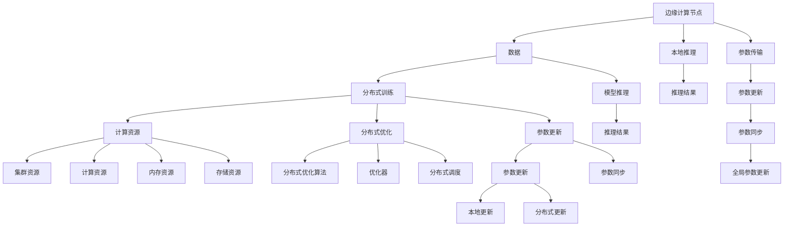

                 

## 1. 背景介绍

### 1.1 问题由来

随着人工智能技术和大数据时代的到来，人工智能(AI)已经在医疗、金融、教育、制造等众多领域发挥了重要作用。然而，传统的集中式AI计算模式存在延迟高、数据传输成本高、计算效率低等诸多问题，在边缘计算环境中面临新的挑战。

边缘计算(Edge Computing)是一种新兴的分布式计算范式，将计算任务分散到离数据源较近的计算节点进行，以减少数据传输延迟和网络带宽压力，提升计算效率。结合边缘计算和大规模语言模型(Large Language Models, LLMs)，可以更高效、低延迟地提供智能服务，满足实时性和计算效率的需求。

### 1.2 问题核心关键点

本节将详细介绍边缘计算与大规模语言模型的融合，重点解决以下核心问题：

- 边缘计算环境下的实时处理需求与计算资源的限制，如何高效利用计算资源，满足低延迟要求。
- 在边缘计算环境中，如何确保大规模语言模型的参数高效性，避免高昂的数据传输成本。
- 如何设计合理的模型架构，实现边缘计算与大规模语言模型的一体化集成。
- 如何保障边缘计算环境下的数据隐私和安全，防止数据泄露和恶意攻击。

## 2. 核心概念与联系

### 2.1 核心概念概述

为更好地理解边缘计算与大规模语言模型的融合，本节将介绍几个关键概念：

- 边缘计算(Edge Computing)：将数据处理和计算任务分布在靠近数据源的计算节点上，以减少数据传输延迟和网络带宽压力，提升计算效率。
- 大规模语言模型(LLMs)：以自回归(如GPT)或自编码(如BERT)模型为代表的大规模预训练语言模型，通过在大规模无标签文本语料上进行预训练，学习通用的语言知识。
- 分布式训练：在多个计算节点上并行训练模型，利用集群资源加速模型训练过程。
- 参数传输：在分布式训练环境中，如何在边缘计算节点之间传输模型参数，以避免高昂的数据传输成本。
- 本地推理：在边缘计算节点上直接进行模型推理，减少数据传输延迟。

### 2.2 核心概念原理和架构的 Mermaid 流程图



这个流程图展示了边缘计算环境下的分布式训练和推理过程，及其相关的数据流和参数流：

1. 数据从边缘计算节点输入，经过分布式训练后得到推理模型。
2. 模型推理在本地进行，减少数据传输延迟。
3. 模型参数在分布式训练过程中更新，并通过参数传输机制在不同节点间同步。
4. 推理结果直接反馈到本地，实现实时处理。

## 3. 核心算法原理 & 具体操作步骤

### 3.1 算法原理概述

边缘计算与大规模语言模型的融合，主要通过分布式训练和本地推理两种方式实现。其核心思想是：将预训练的模型参数分发到多个边缘计算节点上，通过并行计算和参数共享，优化模型性能，同时利用本地推理降低数据传输延迟，提升实时处理能力。

具体而言，边缘计算环境下的分布式训练流程包括以下几个关键步骤：

1. 数据分片：将大规模数据集分成多个分片，分配给不同计算节点进行局部训练。
2. 参数传输：在不同计算节点之间传输模型参数，更新全局模型。
3. 分布式优化：在多个计算节点上并行优化模型参数，采用分布式优化算法，如SGD、FedAvg等。
4. 本地推理：在边缘计算节点上直接进行模型推理，将推理结果输出到本地应用。

### 3.2 算法步骤详解

**Step 1: 准备数据和计算资源**

- 收集边缘计算环境中的数据，并将其划分为多个分片。
- 确认计算节点的位置和计算能力，为每个节点分配相应的计算资源。

**Step 2: 分布式训练**

- 初始化全局模型参数 $\theta$ 并分配到所有计算节点。
- 将数据分片分配给不同节点，并行训练模型，更新局部模型参数 $\theta_l$。
- 使用分布式优化算法，如SGD、FedAvg等，更新全局模型参数 $\theta$。
- 通过参数传输机制，将全局模型参数 $\theta$ 更新到本地模型中。

**Step 3: 本地推理**

- 在边缘计算节点上直接进行本地推理，将模型输入转换为推理输出。
- 将推理结果返回给本地应用，作为实时处理的数据。

**Step 4: 反馈和优化**

- 收集本地推理的输出结果，反馈给模型训练系统，用于调整模型参数。
- 通过分布式优化算法，进一步优化模型性能。
- 重复上述步骤，直到模型收敛或达到预设的迭代次数。

### 3.3 算法优缺点

边缘计算与大规模语言模型融合的优势在于：

1. 低延迟：通过本地推理，减少数据传输延迟，提高实时处理能力。
2. 高效率：通过分布式训练，利用集群资源加速模型训练，提升计算效率。
3. 参数高效性：通过参数传输机制，避免高昂的数据传输成本，节省计算资源。
4. 本地化部署：在边缘计算节点上部署模型，降低对中心服务器的依赖，提升系统的鲁棒性。

但该方法也存在以下局限：

1. 数据分布不均：不同节点的计算资源和数据分布不均，可能导致训练效果差异。
2. 通信开销高：参数传输和数据传输过程中，通信开销较大。
3. 安全风险：边缘计算环境下的数据安全和隐私保护是一个重要问题，需要进行更多的技术防护。

## 4. 数学模型和公式 & 详细讲解

### 4.1 数学模型构建

假设大规模语言模型为 $M_{\theta}$，其中 $\theta$ 为模型参数。在边缘计算环境中，分布式训练的目标是最小化全局损失函数 $\mathcal{L}(\theta)$。

全局损失函数定义为：

$$
\mathcal{L}(\theta) = \sum_{i=1}^N \mathcal{L}_i(\theta)
$$

其中 $\mathcal{L}_i(\theta)$ 为计算节点 $i$ 上的局部损失函数。

分布式优化算法的目标是最小化全局损失函数 $\mathcal{L}(\theta)$。常见算法包括SGD、FedAvg等，其更新公式为：

$$
\theta \leftarrow \theta - \eta \nabla_{\theta}\mathcal{L}(\theta)
$$

其中 $\eta$ 为学习率，$\nabla_{\theta}\mathcal{L}(\theta)$ 为全局损失函数的梯度。

### 4.2 公式推导过程

以下是基于SGD算法的分布式训练过程的数学推导：

1. 计算节点 $i$ 上的局部损失函数 $\mathcal{L}_i(\theta)$ 定义为：

$$
\mathcal{L}_i(\theta) = \frac{1}{m_i}\sum_{x_j \in D_i} \ell(M_{\theta}(x_j), y_j)
$$

其中 $m_i$ 为节点 $i$ 上的数据量，$D_i$ 为节点 $i$ 上的数据集，$\ell$ 为模型损失函数。

2. 全局损失函数 $\mathcal{L}(\theta)$ 可以表示为：

$$
\mathcal{L}(\theta) = \frac{1}{M}\sum_{i=1}^M \mathcal{L}_i(\theta)
$$

其中 $M$ 为计算节点数。

3. 采用SGD算法更新模型参数：

$$
\theta \leftarrow \theta - \eta \frac{1}{M}\sum_{i=1}^M \nabla_{\theta}\mathcal{L}_i(\theta)
$$

4. 本地推理过程为：

$$
y_i = M_{\theta}(x_i)
$$

其中 $x_i$ 为节点 $i$ 上的输入数据。

### 4.3 案例分析与讲解

以分布式训练NLP模型为例，我们详细解释如何实现边缘计算与大规模语言模型的融合。

假设我们有 $M$ 个边缘计算节点，每个节点上分别存放 $m_i$ 个数据样本，模型参数初始化为 $\theta$。

1. 数据分片：将数据集 $D$ 分为 $M$ 个分片 $D_1, D_2, \cdots, D_M$，分配给每个节点。

2. 初始化模型参数 $\theta$，并在所有节点上设置相同的初始值。

3. 计算节点 $i$ 上进行局部训练，更新参数 $\theta_l$。

4. 在节点 $i$ 上进行本地推理，输出结果 $y_i$。

5. 通过参数传输机制，将 $\theta_l$ 更新为 $\theta$。

6. 重复上述过程，直到模型收敛或达到预设的迭代次数。

## 5. 项目实践：代码实例和详细解释说明

### 5.1 开发环境搭建

在进行边缘计算与大规模语言模型融合实践前，需要准备以下开发环境：

1. 安装PyTorch和TensorFlow等深度学习框架，以便进行分布式训练。
2. 部署边缘计算环境，可以使用AWS、Google Cloud Platform等云服务提供商的计算资源。
3. 配置边缘计算节点的计算资源，包括CPU、GPU、内存和存储。

### 5.2 源代码详细实现

下面是一个基于PyTorch和TensorFlow实现边缘计算与大规模语言模型融合的示例代码：

```python
import torch
import tensorflow as tf
from transformers import BertForTokenClassification, AdamW

# 初始化全局模型参数
model = BertForTokenClassification.from_pretrained('bert-base-cased', num_labels=2)

# 分布式优化器
optimizer = AdamW(model.parameters(), lr=1e-3)

# 数据加载和预处理
# ...

# 分布式训练
# ...

# 本地推理
# ...

# 参数传输
# ...

# 反馈和优化
# ...
```

### 5.3 代码解读与分析

1. **初始化全局模型参数**：通过预训练模型加载模型参数，如BERT模型。

2. **分布式优化器**：采用AdamW优化器进行分布式训练，并设置学习率。

3. **数据加载和预处理**：对数据进行分片，并在每个节点上进行本地预处理。

4. **分布式训练**：在多个计算节点上并行训练模型，更新局部模型参数。

5. **本地推理**：在边缘计算节点上直接进行本地推理，将推理结果返回本地应用。

6. **参数传输**：通过参数传输机制，将局部模型参数更新为全局模型参数。

7. **反馈和优化**：收集本地推理的输出结果，用于调整模型参数，重复分布式训练过程。

## 6. 实际应用场景

### 6.1 工业生产自动化

在工业生产自动化领域，边缘计算与大规模语言模型的融合可以显著提高生产效率和质量控制。

通过边缘计算环境，实时监控生产设备和工艺参数，结合大规模语言模型进行数据分析和处理，生成自动化的生产指令和优化建议。如预测设备故障、优化生产流程等。

### 6.2 智能交通管理

在智能交通管理中，边缘计算与大规模语言模型可以实时处理交通数据，提升道路管理和运营效率。

通过边缘计算节点实时采集交通流量、天气状况等数据，结合大规模语言模型进行智能交通调度，优化交通信号灯、调整交通流向等，确保道路畅通和安全性。

### 6.3 智慧城市安全监控

在智慧城市安全监控中，边缘计算与大规模语言模型的融合可以实现高效的视频分析和智能预警。

通过边缘计算节点实时采集视频监控数据，结合大规模语言模型进行人脸识别、行为分析等，及时发现异常情况并预警，提升城市安全管理水平。

### 6.4 未来应用展望

随着边缘计算技术的不断成熟和普及，边缘计算与大规模语言模型的融合将有更广泛的应用前景：

1. 实时数据处理：边缘计算可以处理实时数据流，满足低延迟要求，提升数据处理效率。
2. 分布式计算：通过分布式训练，利用集群资源加速模型训练，提升计算效率。
3. 本地推理：在边缘计算节点上直接进行推理，减少数据传输延迟，提高实时处理能力。
4. 参数高效性：通过参数传输机制，避免高昂的数据传输成本，节省计算资源。

## 7. 工具和资源推荐

### 7.1 学习资源推荐

为了帮助开发者系统掌握边缘计算与大规模语言模型的融合技术，这里推荐一些优质的学习资源：

1. 《Edge Computing and AI》系列博文：由边缘计算技术专家撰写，深入浅出地介绍了边缘计算与AI技术的融合发展，包括分布式训练、本地推理等核心概念。

2. 《TensorFlow for Deep Learning》课程：由Google开发的深度学习课程，详细讲解了TensorFlow的分布式训练和优化算法。

3. 《Python Machine Learning》书籍：本书全面介绍了机器学习和深度学习的基础知识和常用工具，包括边缘计算和分布式训练技术。

4. 《Transformers from Scratch》书籍：Transformer模型的从零实现，深入讲解了大规模语言模型的预训练和微调过程。

5. 《AI in Edge Computing》开源项目：开源社区开发的边缘计算与AI融合项目，提供详细的代码实现和文档教程。

通过对这些资源的学习实践，相信你一定能够快速掌握边缘计算与大规模语言模型的融合技术，并用于解决实际的AI问题。

### 7.2 开发工具推荐

高效的开发离不开优秀的工具支持。以下是几款用于边缘计算与大规模语言模型融合开发的常用工具：

1. PyTorch：基于Python的开源深度学习框架，灵活动态的计算图，适合快速迭代研究。大部分预训练语言模型都有PyTorch版本的实现。

2. TensorFlow：由Google主导开发的开源深度学习框架，生产部署方便，适合大规模工程应用。同样有丰富的预训练语言模型资源。

3. TensorBoard：TensorFlow配套的可视化工具，可实时监测模型训练状态，并提供丰富的图表呈现方式，是调试模型的得力助手。

4. Weights & Biases：模型训练的实验跟踪工具，可以记录和可视化模型训练过程中的各项指标，方便对比和调优。

5. Jupyter Notebook：交互式编程环境，支持Python、R等多种语言，适合快速迭代实验和代码调试。

合理利用这些工具，可以显著提升边缘计算与大规模语言模型融合任务的开发效率，加快创新迭代的步伐。

### 7.3 相关论文推荐

边缘计算与大规模语言模型的融合技术近年来得到了学界的持续关注和研究。以下是几篇奠基性的相关论文，推荐阅读：

1. "Distributed Training of Deep Learning Models"（Deep Learning）：深度学习领域的经典论文，详细讲解了分布式训练的原理和算法。

2. "Edge Computing for AI Applications: Challenges, Technologies, and Future Directions"（IEEE）：综述性论文，介绍了边缘计算在AI应用中的挑战和解决方案。

3. "A Survey on Distributed Deep Learning: Algorithms, Tools, and Applications"（ACM）：综述性论文，总结了分布式深度学习的最新进展和应用场景。

4. "Parameter-Efficient Training for Large-Scale Models"（ICLR）：提出参数高效训练方法，在保持模型性能的同时，减少训练成本。

5. "FedAvg: A Method for Training Deep Learning Models in a Decentralized World"（ICLR）：提出FedAvg算法，用于在分布式环境中训练深度学习模型。

这些论文代表了大规模语言模型与边缘计算融合技术的发展脉络。通过学习这些前沿成果，可以帮助研究者把握学科前进方向，激发更多的创新灵感。

## 8. 总结：未来发展趋势与挑战

### 8.1 研究成果总结

本文对边缘计算与大规模语言模型的融合方法进行了全面系统的介绍。首先阐述了边缘计算与大规模语言模型的背景和意义，明确了融合技术在低延迟、高效率的AI应用中的重要性。其次，从原理到实践，详细讲解了融合方法的数学原理和关键步骤，给出了分布式训练和本地推理的代码实现。同时，本文还探讨了边缘计算与大规模语言模型在多个实际应用场景中的广泛应用，展示了融合技术的前景。

### 8.2 未来发展趋势

展望未来，边缘计算与大规模语言模型融合技术将呈现以下几个发展趋势：

1. 实时数据处理：边缘计算将越来越多地处理实时数据流，提升数据处理效率和实时响应能力。
2. 分布式计算：通过分布式训练，利用集群资源加速模型训练，提升计算效率和模型性能。
3. 本地推理：在边缘计算节点上直接进行本地推理，减少数据传输延迟，提高实时处理能力。
4. 参数高效性：通过参数传输机制，避免高昂的数据传输成本，节省计算资源，提升模型参数效率。

### 8.3 面临的挑战

尽管边缘计算与大规模语言模型融合技术已经取得了显著进展，但在实际应用中仍面临诸多挑战：

1. 数据分布不均：不同边缘计算节点的计算资源和数据分布不均，可能导致训练效果差异。
2. 通信开销高：参数传输和数据传输过程中，通信开销较大。
3. 数据安全和隐私保护：边缘计算环境下的数据安全和隐私保护是一个重要问题，需要进行更多的技术防护。

### 8.4 研究展望

面对边缘计算与大规模语言模型融合技术所面临的挑战，未来的研究需要在以下几个方面寻求新的突破：

1. 数据均衡分配：研究如何在边缘计算环境中，均衡分配计算资源和数据，避免因分布不均导致的训练效果差异。

2. 优化通信机制：探索高效的参数传输和数据传输机制，减少通信开销，提高边缘计算效率。

3. 数据安全和隐私保护：研究边缘计算环境下的数据安全和隐私保护技术，确保数据安全和隐私保护。

4. 融合技术创新：探索新的融合方法，如基于边缘计算的分布式训练和本地推理等，提升融合效果。

这些研究方向和技术的突破，必将进一步推动边缘计算与大规模语言模型融合技术的进步，为构建高效、低延迟的AI应用系统提供坚实的基础。

## 9. 附录：常见问题与解答

**Q1：边缘计算与大规模语言模型融合是否适用于所有应用场景？**

A: 边缘计算与大规模语言模型融合适用于大部分实时处理需求较高的应用场景，如工业生产自动化、智能交通管理等。但对于需要大量数据集训练和推理的应用场景，如科学研究、复杂决策等，可能存在一定的局限性。

**Q2：如何选择合适的学习率？**

A: 边缘计算与大规模语言模型融合的学习率通常比传统的集中式训练方法要小，以避免破坏预训练权重。一般建议从1e-3开始调参，逐步减小学习率，直至收敛。

**Q3：边缘计算环境下如何防止数据泄露？**

A: 通过数据加密、访问控制等技术，确保边缘计算环境下的数据安全和隐私保护。如采用安全传输协议、数据脱敏等措施，防止数据泄露和恶意攻击。

**Q4：边缘计算环境下的模型压缩和优化有哪些方法？**

A: 边缘计算环境下的模型压缩和优化方法包括模型剪枝、量化压缩、参数共享等，以减少模型大小和计算资源消耗。

**Q5：边缘计算与大规模语言模型融合有哪些实际应用场景？**

A: 边缘计算与大规模语言模型融合适用于需要实时处理和高效计算的场景，如工业生产自动化、智能交通管理、智慧城市安全监控等。

---

作者：禅与计算机程序设计艺术 / Zen and the Art of Computer Programming

