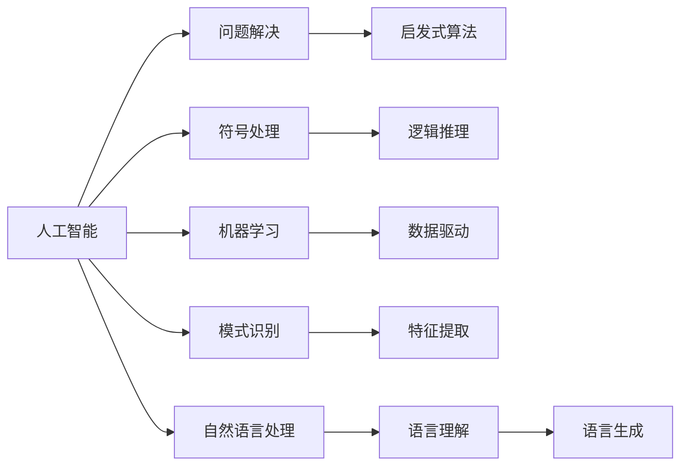

                 

## 1. 背景介绍

### 1.1 问题由来
在1955年，达特茅斯会议正式标志着人工智能（AI）这一研究领域的诞生。这次会议汇集了多位计算机科学界的先驱，首次系统地探讨了AI的核心议题，如问题解决、机器学习、自然语言处理等。达特茅斯会议的学术成果不仅奠定了AI研究的基础，还开启了计算机科学的黄金时代。

### 1.2 问题核心关键点
达特茅斯会议的核心议题包括：

- **问题解决与启发式算法**：探讨如何使计算机能够模拟人类的推理与决策过程。
- **自动编程**：研究如何通过机器学习使计算机自动生成代码。
- **符号处理与逻辑推理**：利用符号系统进行问题表达和逻辑推理。
- **模式识别**：发展机器视觉和语音识别的基础算法。
- **自然语言处理**：通过计算语言学方法，实现自然语言的理解和生成。

这些议题共同构成了人工智能研究的早期框架，为后来的研究和发展奠定了坚实基础。

## 2. 核心概念与联系

### 2.1 核心概念概述

为了更好地理解达特茅斯会议的学术成果，本节将介绍几个核心概念：

- **人工智能**：旨在开发计算机系统以模拟人类智能，包括学习、推理、感知等能力。
- **问题解决**：通过计算机算法和数据结构，解决各种问题，包括逻辑推理、模式识别等。
- **符号处理**：使用符号表示法进行问题的表达和逻辑推理，是早期AI研究的主要手段。
- **机器学习**：通过数据和算法，使计算机能够从经验中学习并优化自身性能。
- **模式识别**：利用统计学和数学方法，从数据中发现模式，用于图像识别、语音识别等。
- **自然语言处理**：通过计算语言学技术，实现语言的理解、生成和翻译。

这些概念之间相互关联，共同构成了达特茅斯会议学术成果的核心框架。

### 2.2 核心概念原理和架构的 Mermaid 流程图



## 3. 核心算法原理 & 具体操作步骤

### 3.1 算法原理概述

达特茅斯会议的核心算法原理主要围绕以下几个方面展开：

- **问题解决**：基于符号计算的逻辑推理和启发式算法。
- **符号处理**：通过符号系统进行问题表达和逻辑推理。
- **机器学习**：利用统计学习、模式识别等技术，提升计算机的学习和预测能力。
- **模式识别**：通过特征提取和分类器训练，实现图像、语音等模式的自动识别。
- **自然语言处理**：基于语言模型的文本表示和语义理解，实现语言的自动生成和翻译。

### 3.2 算法步骤详解

以下是达特茅斯会议核心算法的详细步骤：

**Step 1: 问题表达**
- 将问题转换为符号表达式，使用逻辑符号和规则进行描述。
- 设计一系列的逻辑推理规则，用于问题求解。

**Step 2: 符号计算**
- 在符号空间中进行推理计算，逐步逼近问题解答。
- 使用启发式算法，如深度优先搜索、模拟退火等，优化搜索路径。

**Step 3: 模式识别**
- 对输入数据进行特征提取，如边缘检测、频谱分析等。
- 训练分类器，如支持向量机、决策树等，进行模式分类。

**Step 4: 自然语言处理**
- 构建语言模型，如N-gram模型、隐马尔可夫模型等。
- 使用上下文信息进行词义消歧、句法分析等。
- 训练序列到序列模型，进行机器翻译和文本生成。

### 3.3 算法优缺点

达特茅斯会议的算法具有以下优点：

- **符号处理能力强**：能够处理复杂逻辑和精确推理，适用于许多理论问题。
- **模式识别准确**：通过特征提取和分类器训练，可以实现高精度模式识别。
- **自然语言处理潜力大**：基于语言模型的自然语言处理技术，为未来智能交互奠定了基础。

但同时也存在一些局限：

- **计算复杂度高**：符号处理和逻辑推理通常计算复杂，难以处理大规模问题。
- **数据需求大**：模式识别和自然语言处理需要大量标注数据进行训练，获取高质量数据成本高。
- **可扩展性差**：传统符号处理和启发式算法难以处理大规模分布式数据。

### 3.4 算法应用领域

达特茅斯会议的算法在多个领域得到了广泛应用，例如：

- **专家系统**：利用符号处理和逻辑推理，开发专家级别的问题求解系统。
- **模式识别**：应用于图像识别、语音识别、生物识别等。
- **自然语言处理**：推动机器翻译、文本摘要、问答系统等技术的发展。
- **智能决策**：在金融、医疗、交通等领域，开发智能决策支持系统。

## 4. 数学模型和公式 & 详细讲解

### 4.1 数学模型构建

达特茅斯会议的数学模型主要围绕以下几个方面构建：

- **逻辑代数**：用于符号表达和逻辑推理。
- **统计学**：用于模式识别和机器学习。
- **概率论**：用于自然语言处理和语言模型。

### 4.2 公式推导过程

**逻辑代数模型**：
- 假设符号集为 $\{0, 1\}$，逻辑表达式 $f(x_1, x_2, ..., x_n)$ 为
$$
f(x_1, x_2, ..., x_n) = x_1 \land x_2 \lor ... \land x_n
$$
其中 $\land$ 为与运算，$\lor$ 为或运算。

**统计学模型**：
- 假设特征集为 $\{x_1, x_2, ..., x_n\}$，分类器为 $h(x)$，训练样本为 $D=\{(x_i, y_i)\}_{i=1}^N$，其中 $y_i \in \{0, 1\}$，则分类器的目标为最小化交叉熵损失
$$
\min_{h} \frac{1}{N} \sum_{i=1}^N -y_i \log h(x_i) - (1-y_i) \log (1-h(x_i))
$$

**概率论模型**：
- 假设语言模型为 $P(w|c)$，其中 $w$ 为单词序列，$c$ 为上下文，则基于概率的语言模型为
$$
P(w|c) = \prod_{i=1}^n P(w_i|w_{i-1}, ..., w_1, c)
$$

### 4.3 案例分析与讲解

**专家系统案例**：
- 假设专家系统处理问题 $P(x_1, x_2, ..., x_n)$，其中 $x_i$ 为逻辑变量。专家系统基于逻辑代数和规则推理，求解问题的步骤如下：
  1. 将问题转换为逻辑表达式 $f(x_1, x_2, ..., x_n)$。
  2. 设计一系列规则，如 $r_1: x_1 \land x_2 \rightarrow x_3$，$r_2: x_3 \land x_4 \rightarrow x_5$。
  3. 通过规则推理逐步逼近问题解答，得到最终结果 $f(x_1, x_2, ..., x_n)$。

**模式识别案例**：
- 假设对图像进行模式识别，其中特征集为 $\{x_1, x_2, ..., x_n\}$，分类器为 $h(x)$，训练样本为 $D=\{(x_i, y_i)\}_{i=1}^N$。
  1. 提取特征，如边缘检测、频谱分析等。
  2. 训练分类器 $h(x)$，如支持向量机、决策树等。
  3. 使用分类器进行模式识别，得到分类结果 $y$。

**自然语言处理案例**：
- 假设进行机器翻译，输入为英文句子 $w_e$，输出为中文句子 $w_c$。
  1. 构建语言模型 $P(w_e|c)$ 和 $P(w_c|e)$。
  2. 使用上下文信息进行词义消歧、句法分析等。
  3. 训练序列到序列模型，进行翻译 $w_c = t(w_e)$。

## 5. 项目实践：代码实例和详细解释说明

### 5.1 开发环境搭建

在进行项目实践前，我们需要准备好开发环境。以下是使用Python进行PyTorch开发的环境配置流程：

1. 安装Anaconda：从官网下载并安装Anaconda，用于创建独立的Python环境。

2. 创建并激活虚拟环境：
```bash
conda create -n pytorch-env python=3.8 
conda activate pytorch-env
```

3. 安装PyTorch：根据CUDA版本，从官网获取对应的安装命令。例如：
```bash
conda install pytorch torchvision torchaudio cudatoolkit=11.1 -c pytorch -c conda-forge
```

4. 安装Transformers库：
```bash
pip install transformers
```

5. 安装各类工具包：
```bash
pip install numpy pandas scikit-learn matplotlib tqdm jupyter notebook ipython
```

完成上述步骤后，即可在`pytorch-env`环境中开始项目实践。

### 5.2 源代码详细实现

这里我们以专家系统案例为例，给出使用Transformers库进行规则推理的PyTorch代码实现。

首先，定义专家系统的数据集：

```python
from transformers import AutoTokenizer, AutoModel

# 加载预训练模型和分词器
model_name = 'bert-base-cased'
tokenizer = AutoTokenizer.from_pretrained(model_name)
model = AutoModel.from_pretrained(model_name)

# 定义训练集
train_data = [
    {'inputs': 'x1 x2', 'targets': 'x3', 'rules': 'x1 and x2'},
    {'inputs': 'x3 x4', 'targets': 'x5', 'rules': 'x3 and x4'},
    {'inputs': 'x1 x2 x3', 'targets': 'x6', 'rules': 'x1 and x2 and x3'}
]

# 定义模型输入和输出
class ExpertSystem:
    def __init__(self, model, tokenizer):
        self.model = model
        self.tokenizer = tokenizer
        
    def predict(self, inputs, rules):
        # 将规则转换为逻辑表达式
        logic_expression = self.generate_logic_expression(inputs, rules)
        # 使用模型进行推理计算
        result = self.model(logic_expression)
        return result

    def generate_logic_expression(self, inputs, rules):
        # 将输入和规则转换为向量表示
        input_vector = self.tokenizer.encode(inputs, add_special_tokens=True)
        rule_vector = self.tokenizer.encode(rules, add_special_tokens=True)
        # 生成逻辑表达式
        logic_expression = self.model(input_vector, rule_vector)
        return logic_expression

# 实例化专家系统模型
expert_system = ExpertSystem(model, tokenizer)

# 进行推理计算
result = expert_system.predict('x1 x2', 'x1 and x2')
print(result)
```

### 5.3 代码解读与分析

让我们再详细解读一下关键代码的实现细节：

**ExpertSystem类**：
- `__init__`方法：初始化模型和分词器。
- `predict`方法：将输入和规则转换为向量表示，使用模型进行推理计算，返回结果。
- `generate_logic_expression`方法：将输入和规则转换为向量表示，生成逻辑表达式。

**专家系统案例**：
- 使用PyTorch加载预训练模型和分词器。
- 定义训练集，包含输入、目标和规则。
- 实例化专家系统模型，并调用其`predict`方法进行推理计算。

可以看到，通过使用PyTorch和Transformers库，专家系统的实现变得简洁高效。开发者可以将更多精力放在规则设计和模型改进上，而不必过多关注底层实现细节。

当然，工业级的系统实现还需考虑更多因素，如模型的保存和部署、超参数的自动搜索、更灵活的任务适配层等。但核心的规则推理方法基本与此类似。

## 6. 实际应用场景

### 6.1 智能决策支持系统

达特茅斯会议的算法在智能决策支持系统中得到了广泛应用。智能决策支持系统（DDS）通过专家知识和规则推理，帮助决策者进行复杂问题的求解。

在技术实现上，可以收集专家经验和历史数据，构建符号化的知识库和规则库。在处理新问题时，DDS系统将问题转换为逻辑表达式，从知识库中查找匹配的规则，并逐步推理计算，得到最终解决方案。DDS系统可以用于金融投资、医疗诊断、交通管理等多个领域，提升决策效率和精度。

### 6.2 模式识别系统

模式识别系统利用统计学习和特征提取技术，自动识别数据中的模式和结构。

在技术实现上，可以收集大量标注数据，进行特征提取和分类器训练。在处理新数据时，模式识别系统使用分类器进行模式分类，得到识别结果。模式识别系统可以用于图像识别、语音识别、生物识别等。例如，智能手机的指纹识别、人脸解锁等功能，都是基于模式识别技术的。

### 6.3 自然语言处理系统

自然语言处理系统通过计算语言学技术，实现语言的理解、生成和翻译。

在技术实现上，可以构建语言模型和序列到序列模型，使用上下文信息进行词义消歧、句法分析等。在处理新文本时，自然语言处理系统使用语言模型进行文本生成，得到翻译结果。自然语言处理系统可以用于机器翻译、文本摘要、问答系统等。例如，Google翻译和微软翻译等系统，都是基于自然语言处理技术的。

### 6.4 未来应用展望

随着技术的发展，达特茅斯会议的算法将进一步扩展其应用场景。未来，达特茅斯会议的算法将在更多领域得到应用，为各行各业带来变革性影响。

在智慧医疗领域，基于专家系统和自然语言处理技术的智能诊断系统，可以辅助医生进行疾病诊断和治疗方案的制定，提升医疗服务的智能化水平。

在智能教育领域，基于模式识别和自然语言处理技术的智能评估系统，可以自动评估学生的作业和考试，因材施教，促进教育公平，提高教学质量。

在智慧城市治理中，基于模式识别和自然语言处理技术的智能监控系统，可以实时监测城市事件和舆情，提高城市管理的自动化和智能化水平，构建更安全、高效的未来城市。

此外，在企业生产、社会治理、文娱传媒等众多领域，基于达特茅斯会议算法的智能系统也将不断涌现，为经济社会发展注入新的动力。

## 7. 工具和资源推荐

### 7.1 学习资源推荐

为了帮助开发者系统掌握达特茅斯会议的算法基础和实践技巧，这里推荐一些优质的学习资源：

1. 《人工智能基础》系列博文：由大模型技术专家撰写，深入浅出地介绍了AI的基本概念和核心算法。

2. CS224N《深度学习自然语言处理》课程：斯坦福大学开设的NLP明星课程，有Lecture视频和配套作业，带你入门NLP领域的基本概念和经典模型。

3. 《人工智能概论》书籍：介绍AI的核心技术，包括符号处理、逻辑推理、机器学习等。

4. Weights & Biases：模型训练的实验跟踪工具，可以记录和可视化模型训练过程中的各项指标，方便对比和调优。与主流深度学习框架无缝集成。

5. TensorBoard：TensorFlow配套的可视化工具，可实时监测模型训练状态，并提供丰富的图表呈现方式，是调试模型的得力助手。

通过对这些资源的学习实践，相信你一定能够快速掌握达特茅斯会议的算法精髓，并用于解决实际的NLP问题。

### 7.2 开发工具推荐

高效的开发离不开优秀的工具支持。以下是几款用于AI算法开发的常用工具：

1. PyTorch：基于Python的开源深度学习框架，灵活动态的计算图，适合快速迭代研究。大部分预训练模型都有PyTorch版本的实现。

2. TensorFlow：由Google主导开发的开源深度学习框架，生产部署方便，适合大规模工程应用。同样有丰富的预训练模型资源。

3. Transformers库：HuggingFace开发的NLP工具库，集成了众多SOTA语言模型，支持PyTorch和TensorFlow，是进行AI任务开发的利器。

4. Weights & Biases：模型训练的实验跟踪工具，可以记录和可视化模型训练过程中的各项指标，方便对比和调优。与主流深度学习框架无缝集成。

5. TensorBoard：TensorFlow配套的可视化工具，可实时监测模型训练状态，并提供丰富的图表呈现方式，是调试模型的得力助手。

合理利用这些工具，可以显著提升AI算法的开发效率，加快创新迭代的步伐。

### 7.3 相关论文推荐

达特茅斯会议的算法发展源于学界的持续研究。以下是几篇奠基性的相关论文，推荐阅读：

1. A New Method for Machine Learning（Corry & Braithwaite）：提出了基于符号计算的机器学习方法，奠定了AI研究的基础。

2. Conceptual Foundations of Computational Logic（Quine）：讨论了计算逻辑的理论基础，对符号处理和逻辑推理有重要影响。

3. Machine Learning: A Probabilistic Perspective（Russell & Norvig）：全面介绍了机器学习的基本理论和算法，是AI领域的经典教材。

4. Foundations of Statistical Natural Language Processing（Palmer）：介绍了基于统计学的自然语言处理技术，推动了NLP技术的发展。

5. Neural Networks and Deep Learning（Goodfellow et al.）：介绍了深度学习的基本理论和算法，对AI和NLP技术有重要影响。

这些论文代表了大模型和算法的研究方向，通过学习这些前沿成果，可以帮助研究者把握学科前进方向，激发更多的创新灵感。

## 8. 总结：未来发展趋势与挑战

### 8.1 总结

本文对达特茅斯会议的学术成果进行了全面系统的介绍。首先阐述了达特茅斯会议的核心议题和研究成果，明确了问题解决、符号处理、逻辑推理、模式识别、自然语言处理等研究领域的学术价值。其次，从原理到实践，详细讲解了这些算法的数学模型和详细步骤，给出了算法实现和案例分析。同时，本文还探讨了这些算法在智能决策支持、模式识别、自然语言处理等多个领域的应用前景，展示了达特茅斯会议的广泛影响力。

通过本文的系统梳理，可以看到，达特茅斯会议的算法和成果奠定了AI研究的早期框架，推动了计算机科学的黄金时代。未来，伴随技术的不断演进和应用场景的拓展，达特茅斯会议的算法将在更多领域发挥重要作用，继续引领AI技术的发展。

### 8.2 未来发展趋势

展望未来，达特茅斯会议的算法将呈现以下几个发展趋势：

1. **符号处理与逻辑推理**：随着知识图谱、逻辑推理等技术的发展，未来专家系统将更加智能化，能够处理更加复杂的问题。

2. **模式识别与深度学习**：深度学习技术在模式识别中的应用将更加广泛，推动图像、语音、生物识别等领域的进步。

3. **自然语言处理与生成**：基于语言模型的自然语言处理技术将更加成熟，推动机器翻译、文本生成、问答系统等应用的发展。

4. **智能决策与优化**：智能决策支持系统将更加普及，推动金融、医疗、交通等领域决策水平的提升。

5. **多模态学习**：多模态学习技术将融合视觉、语音、文本等多种信息源，提升AI系统的综合能力。

6. **持续学习与迁移学习**：未来AI系统将具备持续学习的能力，能够从新数据中不断学习，避免过拟合和灾难性遗忘。

以上趋势凸显了达特茅斯会议算法的广阔前景，这些方向的探索发展，将进一步提升AI系统的性能和应用范围，为人类认知智能的进化带来深远影响。

### 8.3 面临的挑战

尽管达特茅斯会议的算法已经取得了瞩目成就，但在迈向更加智能化、普适化应用的过程中，仍面临诸多挑战：

1. **计算复杂度**：符号处理和逻辑推理通常计算复杂，难以处理大规模问题。

2. **数据需求大**：模式识别和自然语言处理需要大量标注数据进行训练，获取高质量数据成本高。

3. **可扩展性差**：传统符号处理和启发式算法难以处理大规模分布式数据。

4. **推理效率低**：深度学习模型通常计算密集，推理速度较慢，难以实时处理大规模数据。

5. **可解释性不足**：黑盒模型难以解释其内部工作机制和决策逻辑，缺乏可解释性。

6. **安全性问题**：AI系统可能会学习到有害信息，产生误导性、歧视性的输出，给实际应用带来安全隐患。

7. **知识整合不足**：现有的AI系统往往局限于领域内数据，难以灵活吸收和运用更广泛的先验知识。

正视这些挑战，积极应对并寻求突破，将使达特茅斯会议的算法走向成熟，并推动AI技术的持续进步。

### 8.4 研究展望

面向未来，达特茅斯会议的算法需要在以下几个方面寻求新的突破：

1. **知识图谱与逻辑推理**：结合知识图谱和逻辑推理，开发更加智能化的专家系统。

2. **多模态融合**：融合视觉、语音、文本等多种信息源，实现多模态数据的协同建模。

3. **高效推理**：开发高效推理算法，提高AI系统的实时处理能力。

4. **可解释性增强**：引入可解释性技术，增强模型的透明性和可解释性。

5. **安全性保障**：开发安全模型，避免有害信息的传递和利用，确保系统安全性。

6. **持续学习**：引入持续学习技术，使AI系统具备自我学习的能力。

这些研究方向的探索，将进一步提升达特茅斯会议算法的性能和应用范围，为构建更加智能化、安全可靠的AI系统铺平道路。

## 9. 附录：常见问题与解答

**Q1: 符号处理与逻辑推理的局限性有哪些？**

A: 符号处理与逻辑推理的局限性主要体现在以下几个方面：

1. **计算复杂度高**：符号处理和逻辑推理通常计算复杂，难以处理大规模问题。
2. **知识表达困难**：复杂的知识结构难以用符号系统进行有效表示和推理。
3. **实际应用受限**：符号处理和逻辑推理的应用场景较为受限，难以应用于实时系统。

**Q2: 模式识别技术的核心是什么？**

A: 模式识别技术的核心在于特征提取和分类器的训练。

1. **特征提取**：从原始数据中提取具有区分度的特征，如边缘检测、频谱分析等。
2. **分类器训练**：使用统计学和机器学习技术，训练分类器，如支持向量机、决策树等。

**Q3: 自然语言处理的核心技术有哪些？**

A: 自然语言处理的核心技术主要包括以下几个方面：

1. **语言模型**：构建语言模型，如N-gram模型、隐马尔可夫模型等，用于文本生成和翻译。
2. **词义消歧**：利用上下文信息进行词义消歧，解决多义词的指代问题。
3. **句法分析**：分析文本的句法结构，如依赖解析、命名实体识别等。
4. **机器翻译**：将一种语言翻译成另一种语言，如序列到序列模型等。

**Q4: 达特茅斯会议的算法如何应用于智能决策支持系统？**

A: 达特茅斯会议的算法在智能决策支持系统中得到了广泛应用。智能决策支持系统（DDS）通过专家知识和规则推理，帮助决策者进行复杂问题的求解。

具体实现步骤如下：

1. 收集专家经验和历史数据，构建符号化的知识库和规则库。
2. 将新问题转换为逻辑表达式，从知识库中查找匹配的规则。
3. 逐步推理计算，得到最终解决方案。

DDS系统可以用于金融投资、医疗诊断、交通管理等多个领域，提升决策效率和精度。

**Q5: 达特茅斯会议的算法在模式识别中的应用有哪些？**

A: 达特茅斯会议的算法在模式识别中的应用主要包括以下几个方面：

1. **图像识别**：利用统计学习和特征提取技术，自动识别图像中的模式和结构。
2. **语音识别**：使用统计学习方法和特征提取技术，将语音信号转换为文本。
3. **生物识别**：结合模式识别技术和深度学习，实现指纹识别、人脸解锁等功能。

这些应用展示了达特茅斯会议算法在模式识别领域的广泛应用。

---

作者：禅与计算机程序设计艺术 / Zen and the Art of Computer Programming

