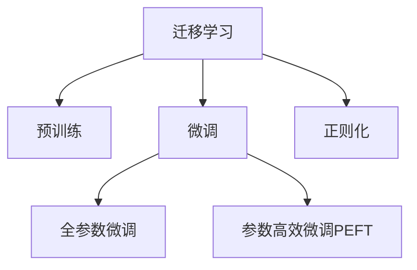

                 

# 迁移学习(Transfer Learning) - 原理与代码实例讲解

> 关键词：迁移学习,监督学习,微调,预训练,模型迁移,深度学习,神经网络,强化学习

## 1. 背景介绍

### 1.1 问题由来
在深度学习时代，模型训练通常需要大量的标注数据和昂贵的计算资源。为了提高模型性能，研究者们提出了一种新的学习范式——迁移学习（Transfer Learning）。迁移学习利用已有模型在某一任务上的知识和经验，快速适应新任务，从而减少新任务上标注数据的需求和训练成本。

迁移学习的核心思想是：将在大规模数据上预训练的模型（预训练模型）迁移到新任务（目标任务）上，通过微调（Fine-tuning）调整部分模型参数，使其在新任务上获得较好的性能。这种范式在计算机视觉、自然语言处理（NLP）等诸多领域都取得了显著的进展。

### 1.2 问题核心关键点
迁移学习的核心在于选择合适的预训练模型，并进行适当的微调，以适应新任务。目前主流的方法包括：
- 选择与目标任务相似或具有相关性的预训练模型。
- 设计任务适配层（Task-Specific Head），调整顶层输出层或解码器。
- 设置合理的微调参数，如学习率、批大小等。
- 应用正则化技术，防止过拟合。
- 考虑参数高效微调（PEFT），只更新少数参数。

迁移学习的目标是在减少标注样本和计算资源的同时，提升模型在特定任务上的性能。该方法已经被广泛应用在图像分类、目标检测、自然语言理解、语音识别等多个领域，成为深度学习模型的重要工具。

### 1.3 问题研究意义
研究迁移学习方法，对于提升深度学习模型的泛化能力和应用效率，降低新任务开发的成本和时间，具有重要意义：

1. **提升泛化能力**：通过迁移已有模型的知识和经验，模型可以在新任务上更快达到更好的泛化性能。
2. **降低标注成本**：利用少量标注数据进行微调，减少了标注数据收集和标注的难度和成本。
3. **加速模型开发**：在已有模型的基础上微调，可以快速构建高性能模型，缩短项目开发周期。
4. **促进知识共享**：预训练模型在多个任务间共享，有助于知识传递和优化。
5. **增强模型可解释性**：迁移学习可以使得模型对新任务的推理过程更加透明，有助于理解和调试。

## 2. 核心概念与联系

### 2.1 核心概念概述

为更好地理解迁移学习的原理和应用，本节将介绍几个关键概念：

- 迁移学习（Transfer Learning）：利用已有模型在新任务上快速适应的学习方法。预训练模型在目标任务上进行微调，提高在新任务上的性能。
- 预训练（Pre-training）：在大规模无标签数据上训练模型，学习通用的知识表示。预训练模型通常具有较高的泛化能力和通用性。
- 微调（Fine-tuning）：在预训练模型的基础上，使用目标任务的少量标注数据，通过有监督学习调整模型参数，使其在新任务上获得更好的性能。
- 正则化（Regularization）：为了防止模型过拟合，在模型训练过程中引入的约束技术，如L2正则、Dropout等。
- 参数高效微调（Parameter-Efficient Fine-Tuning, PEFT）：只更新预训练模型中与新任务相关的少数参数，减少计算资源和参数空间。

这些核心概念之间的逻辑关系可以通过以下Mermaid流程图来展示：



这个流程图展示了大规模迁移学习的核心概念及其之间的关系：

1. 迁移学习利用预训练模型的知识进行任务适配。
2. 预训练模型在大规模无标签数据上学习通用的知识表示。
3. 微调过程在预训练模型基础上，通过有监督学习调整模型参数。
4. 正则化技术用于防止模型过拟合，提升模型泛化能力。
5. 参数高效微调在保证模型性能的同时，减少计算资源和参数空间。

这些概念共同构成了迁移学习的学习和应用框架，使其能够在新任务上快速构建高性能模型。

## 3. 核心算法原理 & 具体操作步骤

### 3.1 算法原理概述

迁移学习的核心原理是在已有模型的基础上，通过微调调整模型参数，使其适应新任务。形式化地，假设预训练模型为 $M_{\theta}$，其中 $\theta$ 为预训练得到的模型参数。给定目标任务 $T$ 的标注数据集 $D=\{(x_i,y_i)\}_{i=1}^N, x_i \in \mathcal{X}, y_i \in \mathcal{Y}$，迁移学习的优化目标是最小化在新任务上的损失函数：

$$
\theta^* = \mathop{\arg\min}_{\theta} \mathcal{L}(M_{\theta},D)
$$

其中 $\mathcal{L}$ 为目标任务 $T$ 设计的损失函数，用于衡量模型预测输出与真实标签之间的差异。常见的损失函数包括交叉熵损失、均方误差损失等。

### 3.2 算法步骤详解

迁移学习的一般步骤包括以下几个关键环节：

**Step 1: 准备预训练模型和数据集**
- 选择合适的预训练模型 $M_{\theta}$ 作为初始化参数，如 ResNet、VGG、BERT 等。
- 准备目标任务 $T$ 的标注数据集 $D$，划分为训练集、验证集和测试集。一般要求标注数据与预训练数据的分布不要差异过大。

**Step 2: 添加任务适配层**
- 根据任务类型，在预训练模型顶层设计合适的输出层和损失函数。
- 对于分类任务，通常在顶层添加线性分类器和交叉熵损失函数。
- 对于生成任务，通常使用语言模型的解码器输出概率分布，并以负对数似然为损失函数。

**Step 3: 设置微调超参数**
- 选择合适的优化算法及其参数，如 Adam、SGD 等，设置学习率、批大小、迭代轮数等。
- 设置正则化技术及强度，包括权重衰减、Dropout、Early Stopping等。
- 确定冻结预训练参数的策略，如仅微调顶层，或全部参数都参与微调。

**Step 4: 执行梯度训练**
- 将训练集数据分批次输入模型，前向传播计算损失函数。
- 反向传播计算参数梯度，根据设定的优化算法和学习率更新模型参数。
- 周期性在验证集上评估模型性能，根据性能指标决定是否触发 Early Stopping。
- 重复上述步骤直到满足预设的迭代轮数或 Early Stopping 条件。

**Step 5: 测试和部署**
- 在测试集上评估微调后模型 $M_{\hat{\theta}}$ 的性能，对比微调前后的精度提升。
- 使用微调后的模型对新样本进行推理预测，集成到实际的应用系统中。
- 持续收集新的数据，定期重新微调模型，以适应数据分布的变化。

以上是迁移学习的一般流程。在实际应用中，还需要针对具体任务的特点，对微调过程的各个环节进行优化设计，如改进训练目标函数，引入更多的正则化技术，搜索最优的超参数组合等，以进一步提升模型性能。

### 3.3 算法优缺点

迁移学习方法具有以下优点：
1. **快速适应新任务**：利用已有模型知识，可以快速构建高性能模型，减少新任务上标注数据的需求。
2. **泛化能力强**：通过在预训练数据上学习通用的知识表示，模型在新任务上通常具有较强的泛化能力。
3. **模型通用性**：预训练模型可以在多个任务间共享，促进知识传递和优化。
4. **计算资源节省**：通过在已有模型的基础上微调，可以减少新的计算资源和标注数据。

同时，该方法也存在一定的局限性：
1. **依赖标注数据**：尽管减少了标注数据量，但仍需要一定量的标注数据进行微调。
2. **预训练模型选择**：选择合适的预训练模型对迁移学习效果至关重要，不同的预训练模型可能对新任务的影响不同。
3. **数据分布差异**：预训练数据和目标任务数据的分布差异较大时，迁移学习的效果可能不佳。
4. **模型复杂性**：预训练模型通常参数量较大，可能增加新模型的复杂性和计算成本。
5. **可解释性不足**：迁移学习模型通常比较复杂，难以提供可解释的推理过程。

尽管存在这些局限性，但就目前而言，迁移学习仍然是大规模深度学习模型应用的重要范式。未来相关研究的重点在于如何进一步降低迁移学习对标注数据的依赖，提高模型的少样本学习和跨领域迁移能力，同时兼顾可解释性和伦理安全性等因素。

### 3.4 算法应用领域

迁移学习在大规模深度学习模型的应用中已经取得了广泛的成功，涵盖了计算机视觉、自然语言处理、语音识别等多个领域：

- **计算机视觉**：利用预训练的卷积神经网络（CNN）模型进行图像分类、目标检测、图像分割等任务。通过微调在特定数据集上进行任务适配，快速获得高性能模型。
- **自然语言处理**：在BERT、GPT等预训练语言模型上进行微调，进行情感分析、问答系统、机器翻译等NLP任务。
- **语音识别**：在预训练的语音识别模型上进行微调，快速构建针对特定领域或任务的语音识别系统。
- **推荐系统**：利用预训练模型进行用户行为预测，结合少样本学习等技术进行个性化推荐。
- **自动驾驶**：在预训练的计算机视觉和语音识别模型上进行微调，构建自动驾驶系统中的环境感知和决策支持。

除了这些传统应用，迁移学习还在医疗影像诊断、金融市场预测、智能制造等领域展现了其强大的潜力。随着预训练模型和迁移学习方法的不断进步，相信其在更多领域的应用将得到更广泛的应用。

## 4. 数学模型和公式 & 详细讲解 & 举例说明

### 4.1 数学模型构建

本节将使用数学语言对迁移学习过程进行严格的刻画。

记预训练模型为 $M_{\theta}$，其中 $\theta$ 为预训练得到的模型参数。假设目标任务 $T$ 的训练集为 $D=\{(x_i,y_i)\}_{i=1}^N, x_i \in \mathcal{X}, y_i \in \mathcal{Y}$。

定义模型 $M_{\theta}$ 在数据样本 $(x,y)$ 上的损失函数为 $\ell(M_{\theta}(x),y)$，则在数据集 $D$ 上的经验风险为：

$$
\mathcal{L}(\theta) = \frac{1}{N} \sum_{i=1}^N \ell(M_{\theta}(x_i),y_i)
$$

迁移学习的优化目标是最小化在新任务上的损失函数，即找到最优参数：

$$
\theta^* = \mathop{\arg\min}_{\theta} \mathcal{L}(M_{\theta},D)
$$

在实践中，我们通常使用基于梯度的优化算法（如SGD、Adam等）来近似求解上述最优化问题。设 $\eta$ 为学习率，$\lambda$ 为正则化系数，则参数的更新公式为：

$$
\theta \leftarrow \theta - \eta \nabla_{\theta}\mathcal{L}(\theta) - \eta\lambda\theta
$$

其中 $\nabla_{\theta}\mathcal{L}(\theta)$ 为损失函数对参数 $\theta$ 的梯度，可通过反向传播算法高效计算。

### 4.2 公式推导过程

以下我们以图像分类任务为例，推导迁移学习的数学模型及其梯度计算公式。

假设模型 $M_{\theta}$ 在输入 $x$ 上的输出为 $\hat{y}=M_{\theta}(x) \in [0,1]$，表示样本属于某一类别的概率。真实标签 $y \in \{1,0\}$。则二分类交叉熵损失函数定义为：

$$
\ell(M_{\theta}(x),y) = -[y\log \hat{y} + (1-y)\log (1-\hat{y})]
$$

将其代入经验风险公式，得：

$$
\mathcal{L}(\theta) = -\frac{1}{N}\sum_{i=1}^N [y_i\log M_{\theta}(x_i)+(1-y_i)\log(1-M_{\theta}(x_i))]
$$

根据链式法则，损失函数对参数 $\theta_k$ 的梯度为：

$$
\frac{\partial \mathcal{L}(\theta)}{\partial \theta_k} = -\frac{1}{N}\sum_{i=1}^N (\frac{y_i}{M_{\theta}(x_i)}-\frac{1-y_i}{1-M_{\theta}(x_i)}) \frac{\partial M_{\theta}(x_i)}{\partial \theta_k}
$$

其中 $\frac{\partial M_{\theta}(x_i)}{\partial \theta_k}$ 可进一步递归展开，利用自动微分技术完成计算。

在得到损失函数的梯度后，即可带入参数更新公式，完成模型的迭代优化。重复上述过程直至收敛，最终得到适应目标任务的最优模型参数 $\theta^*$。

## 5. 项目实践：代码实例和详细解释说明

### 5.1 开发环境搭建

在进行迁移学习实践前，我们需要准备好开发环境。以下是使用Python进行PyTorch开发的环境配置流程：

1. 安装Anaconda：从官网下载并安装Anaconda，用于创建独立的Python环境。

2. 创建并激活虚拟环境：
```bash
conda create -n pytorch-env python=3.8 
conda activate pytorch-env
```

3. 安装PyTorch：根据CUDA版本，从官网获取对应的安装命令。例如：
```bash
conda install pytorch torchvision torchaudio cudatoolkit=11.1 -c pytorch -c conda-forge
```

4. 安装Transformers库：
```bash
pip install transformers
```

5. 安装各类工具包：
```bash
pip install numpy pandas scikit-learn matplotlib tqdm jupyter notebook ipython
```

完成上述步骤后，即可在`pytorch-env`环境中开始迁移学习实践。

### 5.2 源代码详细实现

下面我们以图像分类任务为例，给出使用Transformers库对预训练模型进行迁移学习的PyTorch代码实现。

首先，定义图像分类任务的数据处理函数：

```python
from transformers import AutoModelForImageClassification, AutoTokenizer
from torch.utils.data import Dataset
import torch

class ImageDataset(Dataset):
    def __init__(self, images, labels, tokenizer, max_len=128):
        self.images = images
        self.labels = labels
        self.tokenizer = tokenizer
        self.max_len = max_len
        
    def __len__(self):
        return len(self.images)
    
    def __getitem__(self, item):
        image = self.images[item]
        label = self.labels[item]
        
        encoding = self.tokenizer(image, return_tensors='pt', max_length=self.max_len, padding='max_length', truncation=True)
        input_ids = encoding['input_ids'][0]
        attention_mask = encoding['attention_mask'][0]
        
        # 将图像编码为文字描述
        encoded_description = self.tokenizer("A photo of a " + image, return_tensors='pt', max_length=self.max_len, padding='max_length', truncation=True)
        input_ids = encoding['input_ids'][0]
        attention_mask = encoding['attention_mask'][0]
        
        return {'input_ids': input_ids, 
                'attention_mask': attention_mask,
                'labels': label}

# 初始化tokenizer和模型
tokenizer = AutoTokenizer.from_pretrained('bert-base-cased')
model = AutoModelForImageClassification.from_pretrained('bert-base-cased')
```

然后，定义迁移学习函数：

```python
from transformers import AdamW

def transfer_learning(model, dataset, batch_size, epochs, learning_rate):
    device = torch.device('cuda') if torch.cuda.is_available() else torch.device('cpu')
    model.to(device)

    optimizer = AdamW(model.parameters(), lr=learning_rate)
    
    for epoch in range(epochs):
        model.train()
        train_loss = 0
        for batch in dataset:
            input_ids = batch['input_ids'].to(device)
            attention_mask = batch['attention_mask'].to(device)
            labels = batch['labels'].to(device)
            model.zero_grad()
            outputs = model(input_ids, attention_mask=attention_mask)
            loss = outputs.loss
            train_loss += loss.item()
            loss.backward()
            optimizer.step()
        
        train_loss /= len(dataset)
        print(f"Epoch {epoch+1}, train loss: {train_loss:.3f}")
```

接着，定义测试和评估函数：

```python
from sklearn.metrics import classification_report

def evaluate(model, dataset, batch_size):
    model.eval()
    test_loss = 0
    preds, labels = [], []
    with torch.no_grad():
        for batch in dataset:
            input_ids = batch['input_ids'].to(device)
            attention_mask = batch['attention_mask'].to(device)
            labels = batch['labels'].to(device)
            outputs = model(input_ids, attention_mask=attention_mask)
            preds.append(outputs.logits.argmax(dim=1).to('cpu').tolist())
            labels.append(labels.to('cpu').tolist())
                
    print(classification_report(labels, preds))
```

最后，启动迁移学习流程并在测试集上评估：

```python
# 加载数据集
train_dataset = ImageDataset(train_images, train_labels, tokenizer)
dev_dataset = ImageDataset(dev_images, dev_labels, tokenizer)
test_dataset = ImageDataset(test_images, test_labels, tokenizer)

# 设置参数
epochs = 5
batch_size = 16
learning_rate = 2e-5

# 训练和评估
transfer_learning(model, train_dataset, batch_size, epochs, learning_rate)
print("Test results:")
evaluate(model, test_dataset, batch_size)
```

以上就是使用PyTorch对预训练BERT模型进行图像分类任务迁移学习的完整代码实现。可以看到，得益于Transformers库的强大封装，我们可以用相对简洁的代码完成迁移学习任务的开发。

### 5.3 代码解读与分析

让我们再详细解读一下关键代码的实现细节：

**ImageDataset类**：
- `__init__`方法：初始化图像、标签、分词器等关键组件。
- `__len__`方法：返回数据集的样本数量。
- `__getitem__`方法：对单个样本进行处理，将图像输入编码为文字描述，并转换为模型的输入格式。

**transfer_learning函数**：
- 使用PyTorch的DataLoader对数据集进行批次化加载，供模型训练和推理使用。
- 在每个epoch内，对数据集进行前向传播和反向传播，更新模型参数。
- 记录每个epoch的平均损失，并输出训练过程中的平均损失。

**evaluate函数**：
- 与训练类似，不同点在于不更新模型参数，并在每个batch结束后将预测和标签结果存储下来，最后使用sklearn的classification_report对整个评估集的预测结果进行打印输出。

**迁移学习流程**：
- 定义总的epoch数和batch size，开始循环迭代
- 每个epoch内，先在训练集上训练，输出平均损失
- 在验证集上评估，输出分类指标
- 所有epoch结束后，在测试集上评估，给出最终测试结果

可以看到，PyTorch配合Transformers库使得迁移学习任务的开发变得简洁高效。开发者可以将更多精力放在数据处理、模型改进等高层逻辑上，而不必过多关注底层的实现细节。

当然，工业级的系统实现还需考虑更多因素，如模型的保存和部署、超参数的自动搜索、更灵活的任务适配层等。但核心的迁移学习范式基本与此类似。

## 6. 实际应用场景

### 6.1 智能医疗影像诊断

在医疗领域，大模型迁移学习可以广泛应用于医学影像的自动化诊断。传统医疗影像诊断依赖医生的人工标注，耗时费力且易受主观因素影响。而利用迁移学习，可以在大规模医疗影像数据上进行预训练，然后对特定疾病的诊断模型进行微调，提升诊断的自动化和准确性。

在技术实现上，可以收集不同疾病的医学影像数据，并进行人工标注。将标注数据作为微调样本，对预训练模型进行微调。微调后的模型能够自动理解医学影像的特征，对疾病进行分类和标注。对于新出现的疾病类型，也可以快速适应，进行新的诊断任务。

### 6.2 金融市场预测

在金融领域，大模型迁移学习可以用于市场趋势的预测。利用历史股票、期货、外汇等金融数据进行预训练，然后对特定市场进行微调，建立预测模型。微调后的模型能够学习到市场的基本规律和趋势，进行短期和长期的股票价格预测，帮助投资者进行风险管理和投资决策。

在技术实现上，可以收集历史金融市场数据，并进行基本面和技术面分析。将分析后的数据作为微调样本，对预训练模型进行微调。微调后的模型能够自动捕捉市场变化，预测未来的走势。对于实时市场数据，也可以快速适应，进行实时的预测和分析。

### 6.3 工业设备维护

在工业领域，大模型迁移学习可以用于设备的预测性维护。利用设备运行的历史数据进行预训练，然后对特定设备的维护模型进行微调，预测设备故障和维护周期。微调后的模型能够学习到设备的运行规律和故障特征，进行设备的健康状态评估和维护周期预测。

在技术实现上，可以收集设备的运行数据，并进行故障分析。将分析后的数据作为微调样本，对预训练模型进行微调。微调后的模型能够自动检测设备的运行状态，预测设备故障的发生概率和维护周期。对于实时运行数据，也可以快速适应，进行实时的故障预测和维护调度。

### 6.4 未来应用展望

随着大模型迁移学习方法的不断进步，其在更多领域的应用将得到更广泛的应用，为各行各业带来变革性影响。

在智慧医疗领域，基于迁移学习的医疗影像诊断和病理分析，将提升医疗服务的智能化水平，辅助医生诊疗，加速新药研发进程。

在智能教育领域，迁移学习可用于作业批改、学情分析、知识推荐等方面，因材施教，促进教育公平，提高教学质量。

在智慧城市治理中，迁移学习可用于城市事件监测、舆情分析、应急指挥等环节，提高城市管理的自动化和智能化水平，构建更安全、高效的未来城市。

此外，在企业生产、社会治理、文娱传媒等众多领域，基于大模型迁移学习的人工智能应用也将不断涌现，为经济社会发展注入新的动力。相信随着技术的日益成熟，迁移学习方法将成为深度学习应用的重要范式，推动人工智能技术向更广阔的领域加速渗透。

## 7. 工具和资源推荐
### 7.1 学习资源推荐

为了帮助开发者系统掌握大模型迁移学习的理论基础和实践技巧，这里推荐一些优质的学习资源：

1. 《深度学习入门：基于Python的理论与实现》系列博文：由大模型技术专家撰写，深入浅出地介绍了深度学习的基本概念和迁移学习原理。

2. CS231n《深度学习计算机视觉》课程：斯坦福大学开设的深度学习视觉课程，涵盖图像分类、目标检测、语义分割等经典任务。

3. 《深度学习自然语言处理》书籍：斯坦福大学NLP课程讲义，介绍了自然语言处理的深度学习模型和方法。

4. 《PyTorch官方文档》：详细介绍了PyTorch的使用方法，包括模型的搭建、训练、测试等各个环节。

5. HuggingFace官方文档：提供了大量预训练模型和迁移学习样例，是上手实践的重要资料。

6. CLUE开源项目：中文语言理解测评基准，涵盖大量不同类型的中文NLP数据集，并提供了基于迁移学习的baseline模型，助力中文NLP技术发展。

通过对这些资源的学习实践，相信你一定能够快速掌握大模型迁移学习的精髓，并用于解决实际的NLP问题。
###  7.2 开发工具推荐

高效的开发离不开优秀的工具支持。以下是几款用于大模型迁移学习的常用工具：

1. PyTorch：基于Python的开源深度学习框架，灵活动态的计算图，适合快速迭代研究。大部分预训练语言模型都有PyTorch版本的实现。

2. TensorFlow：由Google主导开发的开源深度学习框架，生产部署方便，适合大规模工程应用。同样有丰富的预训练语言模型资源。

3. Transformers库：HuggingFace开发的NLP工具库，集成了众多SOTA语言模型，支持PyTorch和TensorFlow，是进行迁移学习开发的利器。

4. Weights & Biases：模型训练的实验跟踪工具，可以记录和可视化模型训练过程中的各项指标，方便对比和调优。与主流深度学习框架无缝集成。

5. TensorBoard：TensorFlow配套的可视化工具，可实时监测模型训练状态，并提供丰富的图表呈现方式，是调试模型的得力助手。

6. Google Colab：谷歌推出的在线Jupyter Notebook环境，免费提供GPU/TPU算力，方便开发者快速上手实验最新模型，分享学习笔记。

合理利用这些工具，可以显著提升大模型迁移学习的开发效率，加快创新迭代的步伐。

### 7.3 相关论文推荐

大模型迁移学习的发展源于学界的持续研究。以下是几篇奠基性的相关论文，推荐阅读：

1. ImageNet Classification with Deep Convolutional Neural Networks：提出卷积神经网络（CNN），并在ImageNet数据集上进行了大规模预训练，为计算机视觉领域的迁移学习奠定了基础。

2. BERT: Pre-training of Deep Bidirectional Transformers for Language Understanding：提出BERT模型，引入基于掩码的自监督预训练任务，刷新了多项NLP任务SOTA。

3. ResNet: Deep Residual Learning for Image Recognition：提出残差网络（ResNet），解决了深度网络训练中的梯度消失问题，使得更深的网络成为可能。

4. MoCo: Momentum Contrast for Unsupervised Visual Representation Learning：提出Momentum Contrast，利用大规模无标签数据进行预训练，提升了模型的表示能力。

5. SimCLR: A Simple Framework for Contrastive Learning of Visual Representations：提出SimCLR，利用对比学习（Contrastive Learning）进行预训练，提升了模型的泛化能力和鲁棒性。

这些论文代表了大模型迁移学习的发展脉络。通过学习这些前沿成果，可以帮助研究者把握学科前进方向，激发更多的创新灵感。

## 8. 总结：未来发展趋势与挑战

### 8.1 总结

本文对大模型迁移学习的原理和实践进行了全面系统的介绍。首先阐述了大模型迁移学习的研究背景和意义，明确了迁移学习在模型泛化、标注数据需求、模型构建等方面的独特价值。其次，从原理到实践，详细讲解了迁移学习的数学原理和关键步骤，给出了迁移学习任务开发的完整代码实例。同时，本文还广泛探讨了迁移学习在智能医疗、金融市场、工业设备等众多领域的应用前景，展示了迁移学习范式的巨大潜力。此外，本文精选了迁移学习的各类学习资源，力求为读者提供全方位的技术指引。

通过本文的系统梳理，可以看到，大模型迁移学习已经成为深度学习模型的重要范式，极大地拓展了预训练模型应用的新边界，带来了显著的性能提升和计算资源节省。未来，伴随预训练模型和迁移学习方法的不断进步，相信其在更多领域的应用将得到更广泛的应用，为各行各业带来变革性影响。

### 8.2 未来发展趋势

展望未来，大模型迁移学习技术将呈现以下几个发展趋势：

1. **模型规模持续增大**：随着算力成本的下降和数据规模的扩张，预训练模型和迁移学习模型的参数量还将持续增长。超大规模模型蕴含的丰富知识表示，将使得迁移学习模型在更多任务上取得更好的性能。

2. **模型迁移能力增强**：未来的迁移学习模型将具备更强的跨领域迁移能力，能够适应更多不同领域的任务，提升模型的泛化能力和应用范围。

3. **迁移学习技术多样化**：除了传统的全参数迁移外，未来会涌现更多参数高效和计算高效的迁移学习方法，如Prefix-Tuning、LoRA等，在节省计算资源的同时保证迁移学习精度。

4. **持续学习成为常态**：随着数据分布的不断变化，迁移学习模型需要持续学习新知识以保持性能。如何在不遗忘原有知识的同时，高效吸收新样本信息，将成为重要的研究课题。

5. **无监督和半监督迁移学习**：摆脱对大规模标注数据的依赖，利用自监督学习、主动学习等无监督和半监督范式，最大限度利用非结构化数据，实现更加灵活高效的迁移学习。

6. **多模态迁移学习**：将视觉、语音、文本等多种模态数据进行融合，提升模型的感知能力和理解能力，拓展迁移学习的应用领域。

以上趋势凸显了大模型迁移学习技术的广阔前景。这些方向的探索发展，必将进一步提升迁移学习模型的性能和应用范围，为各行各业带来更广泛的变革性影响。

### 8.3 面临的挑战

尽管大模型迁移学习技术已经取得了显著成就，但在迈向更加智能化、普适化应用的过程中，它仍面临着诸多挑战：

1. **标注成本瓶颈**：虽然减少了标注数据量，但仍需要一定量的标注数据进行微调，标注成本较高。如何进一步降低迁移学习对标注数据的依赖，将是一大难题。

2. **模型鲁棒性不足**：迁移学习模型面对域外数据时，泛化性能往往大打折扣。对于测试样本的微小扰动，模型也容易发生波动。如何提高迁移学习模型的鲁棒性，避免灾难性遗忘，还需要更多理论和实践的积累。

3. **计算资源限制**：预训练模型和迁移学习模型通常参数量较大，对算力和存储资源提出了很高的要求。如何在保证性能的同时，优化计算资源和存储资源，是重要的优化方向。

4. **可解释性不足**：迁移学习模型通常比较复杂，难以提供可解释的推理过程。对于高风险应用，算法的可解释性和可审计性尤为重要。如何赋予迁移学习模型更强的可解释性，将是亟待攻克的难题。

5. **安全性有待保障**：迁移学习模型可能会学习到有偏见、有害的信息，通过迁移传递到下游任务，产生误导性、歧视性的输出，给实际应用带来安全隐患。如何从数据和算法层面消除模型偏见，避免恶意用途，确保输出的安全性，也将是重要的研究课题。

6. **知识整合能力不足**：现有的迁移学习模型往往局限于任务内数据，难以灵活吸收和运用更广泛的先验知识。如何让迁移学习过程更好地与外部知识库、规则库等专家知识结合，形成更加全面、准确的信息整合能力，还有很大的想象空间。

正视迁移学习面临的这些挑战，积极应对并寻求突破，将是大模型迁移学习走向成熟的必由之路。相信随着学界和产业界的共同努力，这些挑战终将一一被克服，大模型迁移学习必将在构建智能系统中的应用中扮演越来越重要的角色。

### 8.4 未来突破

面对大模型迁移学习所面临的种种挑战，未来的研究需要在以下几个方面寻求新的突破：

1. **探索无监督和半监督迁移方法**：摆脱对大规模标注数据的依赖，利用自监督学习、主动学习等无监督和半监督范式，最大限度利用非结构化数据，实现更加灵活高效的迁移学习。

2. **研究参数高效和计算高效的迁移范式**：开发更加参数高效的迁移方法，在固定大部分预训练参数的同时，只更新极少量的任务相关参数。同时优化迁移学习模型的计算图，减少前向传播和反向传播的资源消耗，实现更加轻量级、实时性的部署。

3. **融合因果和对比学习范式**：通过引入因果推断和对比学习思想，增强迁移学习模型建立稳定因果关系的能力，学习更加普适、鲁棒的语言表征，从而提升模型泛化性和抗干扰能力。

4. **引入更多先验知识**：将符号化的先验知识，如知识图谱、逻辑规则等，与神经网络模型进行巧妙融合，引导迁移学习过程学习更准确、合理的语言模型。同时加强不同模态数据的整合，实现视觉、语音等多模态信息与文本信息的协同建模。

5. **结合因果分析和博弈论工具**：将因果分析方法引入迁移学习模型，识别出模型决策的关键特征，增强输出解释的因果性和逻辑性。借助博弈论工具刻画人机交互过程，主动探索并规避模型的脆弱点，提高系统稳定性。

6. **纳入伦理道德约束**：在迁移学习模型训练目标中引入伦理导向的评估指标，过滤和惩罚有偏见、有害的输出倾向。同时加强人工干预和审核，建立模型行为的监管机制，确保输出符合人类价值观和伦理道德。

这些研究方向的探索，必将引领大模型迁移学习技术迈向更高的台阶，为构建安全、可靠、可解释、可控的智能系统铺平道路。面向未来，大模型迁移学习技术还需要与其他人工智能技术进行更深入的融合，如知识表示、因果推理、强化学习等，多路径协同发力，共同推动自然语言理解和智能交互系统的进步。只有勇于创新、敢于突破，才能不断拓展迁移学习的边界，让智能技术更好地造福人类社会。

## 9. 附录：常见问题与解答

**Q1：迁移学习是否适用于所有深度学习任务？**

A: 迁移学习在深度学习任务中广泛应用，但在某些特定领域，如需要大规模数据和复杂结构的深度学习任务，迁移学习的效果可能不如从头训练。对于这些任务，需要根据具体情况选择合适的模型和算法。

**Q2：如何选择预训练模型？**

A: 选择预训练模型的关键是评估其在目标任务上的迁移能力。可以从以下几个方面考虑：
1. 模型的通用性：选择通用性较强的模型，如BERT、GPT等。
2. 任务相似度：选择与目标任务相似或具有相关性的模型，如ImageNet预训练模型用于图像分类任务。
3. 数据分布：选择与目标任务数据分布相似的模型，如医疗影像预训练模型用于医疗影像分类。

**Q3：迁移学习如何避免过拟合？**

A: 为了避免过拟合，可以采取以下策略：
1. 数据增强：通过数据扩充和增强，增加训练集的多样性。
2. 正则化：引入L2正则、Dropout等正则化技术。
3. 早停策略：在验证集上设置早停策略，防止过拟合。
4. 模型裁剪：减少模型的层数或参数量，减小模型复杂度。
5. 模型集成：将多个模型进行集成，取平均值或加权平均值，提升模型的泛化能力。

**Q4：迁移学习如何提升模型泛化能力？**

A: 提升模型泛化能力的关键在于：
1. 使用大规模预训练数据：预训练模型在更广泛的数据上进行训练，能够学习到更通用的语言表示。
2. 合理设计任务适配层：根据目标任务的输出格式和目标，设计合适的输出层。
3. 引入对比学习：利用对比学习（Contrastive Learning）提升模型的泛化能力和鲁棒性。
4. 融合因果推断：利用因果推断方法，提升模型的因果关系理解和推理能力。
5. 多任务学习：将多个相关任务结合起来进行迁移学习，提升模型的跨任务泛化能力。

**Q5：迁移学习如何提高模型可解释性？**

A: 提高模型可解释性的关键在于：
1. 模型简化：设计更加简洁的模型结构，减少不必要的复杂度。
2. 可视化输出：使用可视化工具，如Grad-CAM、LIME等，展示模型的推理过程。
3. 解释性损失：在模型训练目标中引入解释性损失函数，引导模型学习可解释性更好的特征。
4. 知识图谱融合：将知识图谱与模型进行融合，提升模型的可解释性和推理能力。
5. 人工干预：在模型训练和部署过程中，引入人工干预，确保模型的输出符合人类价值观和伦理道德。

通过这些方法，可以有效提升迁移学习模型的可解释性，使其在实际应用中更加透明和可信。

通过本文的系统梳理，可以看到，大模型迁移学习已经成为深度学习模型的重要范式，极大地拓展了预训练模型应用的新边界，带来了显著的性能提升和计算资源节省。未来，伴随预训练模型和迁移学习方法的不断进步，相信其在更多领域的应用将得到更广泛的应用，为各行各业带来变革性影响。相信随着学界和产业界的共同努力，这些挑战终将一一被克服，大模型迁移学习必将在构建智能系统中的应用中扮演越来越重要的角色。

