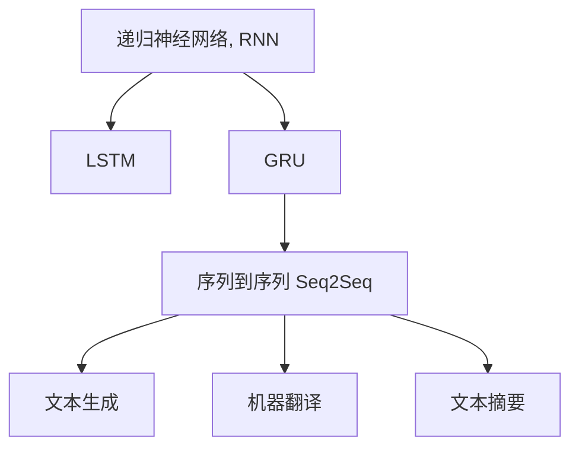

                 

# 递归神经网络 原理与代码实例讲解

> 关键词：递归神经网络, RNN, 长短期记忆网络(LSTM), 门控循环单元(GRU), 自然语言处理(NLP), 语言建模, 序列到序列(Seq2Seq)任务

## 1. 背景介绍

### 1.1 问题由来
随着深度学习技术的发展，递归神经网络（Recurrent Neural Networks, RNNs）在序列数据的建模和预测中发挥了重要作用，特别是在自然语言处理（Natural Language Processing, NLP）领域。RNNs通过在时间维度上保持序列信息，能够有效地捕捉序列数据的内在关联，是解决许多NLP任务的基石。然而，传统的RNNs存在梯度消失和梯度爆炸等问题，严重限制了其在深层网络中的表现。为了克服这些问题，研究者们提出了多种改进的RNN结构，如长短期记忆网络（Long Short-Term Memory, LSTM）和门控循环单元（Gated Recurrent Unit, GRU），进一步推动了RNNs在实际应用中的发展和应用。

### 1.2 问题核心关键点
RNNs的核心在于通过递归机制，在时间序列上维护序列信息的传递和更新。其基本思路是：
1. **循环结构**：RNNs通过内部循环连接，使得模型能够对序列数据进行逐个时间步的递归处理。
2. **动态更新**：在每个时间步，RNNs会根据当前输入和前一时间步的输出，动态更新内部状态，并将其传递到下一时间步。
3. **时间依赖性**：RNNs能够利用序列数据的时间依赖性，捕捉长距离依赖关系，这是传统前馈神经网络所不能实现的。

RNNs的这些特性，使其在处理文本、语音、视频等序列数据时，能够提供良好的序列建模能力，但同时也面临着梯度消失和梯度爆炸等问题。LSTM和GRU等改进结构的提出，通过引入记忆单元和门控机制，有效地解决了这些问题，成为当前NLP任务中应用最为广泛的RNN变体。

### 1.3 问题研究意义
理解RNNs的原理和代码实现，对于掌握和应用LSTM和GRU等改进结构，解决NLP领域的序列数据处理问题，具有重要意义：

1. **序列数据建模**：RNNs能够有效处理文本、语音、视频等序列数据，是序列建模任务的基础。
2. **长距离依赖捕捉**：RNNs能够捕捉长距离依赖关系，适用于许多需要理解序列上下文的任务，如机器翻译、文本生成等。
3. **时间依赖性利用**：RNNs能够利用序列数据的时间依赖性，为预测任务提供更好的特征表示。
4. **模型可解释性**：RNNs的递归机制使得模型内部状态具有解释性，便于理解和调试。

本文将系统讲解RNNs的原理和代码实现，并通过LSTM和GRU的详细代码实例，帮助读者深入理解这些改进结构的实现细节和应用场景。

## 2. 核心概念与联系

### 2.1 核心概念概述

为更好地理解RNNs及其改进结构的原理和代码实现，本节将介绍几个密切相关的核心概念：

- **递归神经网络（RNNs）**：通过在时间维度上保持序列信息的传递和更新，能够捕捉序列数据的内在关联。
- **长短期记忆网络（LSTM）**：一种改进的RNN结构，通过引入门控机制和记忆单元，有效解决了梯度消失和梯度爆炸问题。
- **门控循环单元（GRU）**：另一种改进的RNN结构，通过合并了LSTM的门控机制，实现更高效的序列建模。
- **序列数据处理**：RNNs及其改进结构在文本、语音、视频等序列数据的处理中有着广泛应用，如语言建模、机器翻译、文本生成等。
- **模型参数**：RNNs及其改进结构中的参数包括权重矩阵、偏置项等，这些参数需要通过反向传播算法进行优化。
- **序列到序列（Seq2Seq）任务**：通过RNNs及其改进结构，实现从序列到序列的映射，如机器翻译、文本摘要等。

这些核心概念之间的逻辑关系可以通过以下Mermaid流程图来展示：



这个流程图展示了大语言模型在序列处理中的基本概念及其之间的关系：

1. RNNs是序列建模的基础，LSTM和GRU是其改进结构。
2. Seq2Seq任务通过RNNs实现从序列到序列的映射，广泛应用于文本生成、机器翻译等。
3. 文本生成、机器翻译、文本摘要等任务都是基于Seq2Seq框架构建的。

## 3. 核心算法原理 & 具体操作步骤
### 3.1 算法原理概述

RNNs的基本思想是通过递归机制，在时间维度上维护序列信息的传递和更新。其核心算法步骤如下：

1. **输入层**：将序列数据输入模型，每个时间步的输入被表示为向量形式。
2. **隐藏层**：通过循环连接，隐藏层的状态在时间维度上不断更新，并传递到下一时间步。
3. **输出层**：根据当前时间步的隐藏状态，计算输出结果。
4. **反向传播**：通过反向传播算法，计算模型参数的梯度，并使用优化算法更新参数。

在实际应用中，RNNs的隐藏状态通常由一个或多个向量表示，通过权重矩阵和偏置项的变换，在时间维度上进行动态更新。

### 3.2 算法步骤详解

本节将详细介绍RNNs的算法步骤，并通过LSTM和GRU的代码实现，帮助读者深入理解这些改进结构的实现细节和应用场景。

#### 3.2.1 输入和输出

假设输入序列为 $(x_1, x_2, ..., x_T)$，输出序列为 $(y_1, y_2, ..., y_T)$，其中 $x_t \in \mathbb{R}^d$，$y_t \in \mathbb{R}^k$。RNNs的目标是学习输入和输出之间的映射关系，即：

$$
y_t = f(x_t, h_{t-1})
$$

其中 $h_{t-1}$ 表示时间步 $t-1$ 的隐藏状态，$f$ 为输出计算函数。

#### 3.2.2 隐藏状态的更新

在每个时间步，RNNs会根据当前输入和前一时间步的隐藏状态，计算新的隐藏状态。设当前时间步的输入为 $x_t$，前一时间步的隐藏状态为 $h_{t-1}$，当前时间步的隐藏状态为 $h_t$，则隐藏状态的更新公式为：

$$
h_t = g(W_h x_t + U_h h_{t-1} + b_h)
$$

其中 $W_h$、$U_h$ 为权重矩阵，$b_h$ 为偏置项，$g$ 为非线性激活函数，如 sigmoid 或 tanh。

#### 3.2.3 输出计算

在每个时间步，RNNs会根据当前时间步的隐藏状态 $h_t$，计算输出结果。设输出计算函数为 $f$，则输出结果为：

$$
y_t = f(W_y h_t + b_y)
$$

其中 $W_y$、$b_y$ 为权重矩阵和偏置项。

#### 3.2.4 反向传播

在计算完输出结果后，RNNs通过反向传播算法计算模型参数的梯度。假设损失函数为 $L(y_t, \hat{y_t})$，则梯度公式为：

$$
\frac{\partial L}{\partial \theta} = \frac{\partial L}{\partial y_t} \frac{\partial y_t}{\partial h_t} \frac{\partial h_t}{\partial \theta}
$$

其中 $\theta$ 为模型参数，包括权重矩阵和偏置项。

### 3.3 算法优缺点

RNNs及其改进结构具有以下优点：

1. **序列建模能力**：RNNs能够有效处理序列数据，捕捉序列数据的内在关联，适用于文本、语音、视频等序列数据的处理。
2. **长距离依赖捕捉**：RNNs能够捕捉长距离依赖关系，适用于需要理解序列上下文的任务，如机器翻译、文本生成等。
3. **模型可解释性**：RNNs的递归机制使得模型内部状态具有解释性，便于理解和调试。

然而，RNNs也存在一些缺点：

1. **梯度消失和梯度爆炸**：由于循环连接的传递效应，RNNs在深层网络中容易出现梯度消失或梯度爆炸问题，导致训练不稳定。
2. **计算资源消耗大**：RNNs在每个时间步需要进行循环连接和矩阵乘法，计算资源消耗较大，不适合大规模并行计算。
3. **难以处理长期依赖**：传统RNNs在处理长距离依赖时，容易出现退化现象，导致模型性能下降。

为了克服这些问题，LSTM和GRU等改进结构被提出，通过引入门控机制和记忆单元，有效解决了梯度消失和梯度爆炸问题，并提升了模型的处理能力。

### 3.4 算法应用领域

RNNs及其改进结构在NLP领域得到了广泛应用，主要包括以下几个方面：

1. **语言建模**：通过RNNs学习文本数据的内在关联，生成文本数据，如GPT-3等。
2. **机器翻译**：将源语言文本翻译为目标语言文本，如Seq2Seq模型、Transformer等。
3. **文本生成**：生成符合特定语法和语义规则的文本，如GPT-2等。
4. **文本分类**：对文本进行分类任务，如情感分析、主题分类等。
5. **文本摘要**：将长文本压缩成简短摘要，如Seq2Seq模型、Transformer等。
6. **命名实体识别**：识别文本中的人名、地名、机构名等特定实体，如LSTM模型等。

除了上述这些经典应用外，RNNs及其改进结构还被创新性地应用到更多场景中，如情感分析、文本匹配、语音识别等，为NLP技术带来了新的突破。

## 4. 数学模型和公式 & 详细讲解 & 举例说明

### 4.1 数学模型构建

本节将使用数学语言对RNNs及其改进结构的算法步骤进行更加严格的刻画。

设输入序列为 $(x_1, x_2, ..., x_T)$，输出序列为 $(y_1, y_2, ..., y_T)$，其中 $x_t \in \mathbb{R}^d$，$y_t \in \mathbb{R}^k$。定义模型参数 $\theta = (W_h, U_h, b_h, W_y, b_y)$，其中 $W_h \in \mathbb{R}^{d \times (d+h)}$，$U_h \in \mathbb{R}^{d+h \times h}$，$b_h \in \mathbb{R}^{h}$，$W_y \in \mathbb{R}^{k \times h}$，$b_y \in \mathbb{R}^{k}$。

定义隐藏状态 $h_t \in \mathbb{R}^h$，输出结果 $y_t \in \mathbb{R}^k$。定义激活函数 $g$，如 sigmoid 或 tanh。

在每个时间步，RNNs会根据当前输入和前一时间步的隐藏状态，计算新的隐藏状态和输出结果。隐藏状态的更新公式为：

$$
h_t = g(W_h x_t + U_h h_{t-1} + b_h)
$$

输出结果的计算公式为：

$$
y_t = f(W_y h_t + b_y)
$$

其中 $f$ 为输出计算函数。

定义损失函数 $L(y_t, \hat{y_t})$，目标是最小化损失函数，即：

$$
\min_{\theta} \sum_{t=1}^T L(y_t, \hat{y_t})
$$

通过反向传播算法计算梯度，并使用优化算法更新模型参数。

### 4.2 公式推导过程

以下我们以LSTM模型为例，推导其隐藏状态和输出的计算公式。

设当前时间步的输入为 $x_t \in \mathbb{R}^d$，前一时间步的隐藏状态为 $h_{t-1} \in \mathbb{R}^h$，当前时间步的候选细胞状态为 $\tilde{c_t} \in \mathbb{R}^h$，当前时间步的隐藏状态为 $h_t \in \mathbb{R}^h$，当前时间步的输出结果为 $y_t \in \mathbb{R}^k$。

LSTM模型的隐藏状态和输出结果的计算公式如下：

$$
i_t = \sigma(W_i x_t + U_i h_{t-1} + b_i)
$$

$$
f_t = \sigma(W_f x_t + U_f h_{t-1} + b_f)
$$

$$
o_t = \sigma(W_o x_t + U_o h_{t-1} + b_o)
$$

$$
g_t = \tanh(W_g x_t + U_g h_{t-1} + b_g)
$$

$$
c_t = f_t \odot c_{t-1} + i_t \odot g_t
$$

$$
h_t = o_t \odot \tanh(c_t)
$$

其中 $\sigma$ 为 sigmoid 函数，$\tanh$ 为 tanh 函数，$\odot$ 为 Hadamard 积。

定义输出计算函数 $f$，如 softmax 函数。则输出结果的计算公式为：

$$
y_t = f(W_y h_t + b_y)
$$

定义损失函数 $L(y_t, \hat{y_t})$，目标是最小化损失函数，即：

$$
\min_{\theta} \sum_{t=1}^T L(y_t, \hat{y_t})
$$

通过反向传播算法计算梯度，并使用优化算法更新模型参数。

### 4.3 案例分析与讲解

#### 4.3.1 案例：机器翻译

机器翻译任务要求将源语言文本翻译为目标语言文本。假设源语言文本为 $x_1, x_2, ..., x_T$，目标语言文本为 $y_1, y_2, ..., y_T$。

在每个时间步，将源语言文本的每个词向量作为输入，通过RNNs计算对应的隐藏状态 $h_t$，然后根据 $h_t$ 计算目标语言文本的输出 $y_t$。

具体实现步骤如下：

1. 定义输入和输出序列：
```python
import torch
from torch import nn
from torch.nn import functional as F

x = torch.tensor([1, 2, 3, 4, 5])
y = torch.tensor([6, 7, 8, 9, 10])
```

2. 定义模型参数：
```python
W_h = torch.randn(3, 6)
U_h = torch.randn(6, 6)
b_h = torch.zeros(6)
W_y = torch.randn(6, 6)
b_y = torch.zeros(6)
```

3. 定义隐藏状态和输出结果：
```python
h = torch.zeros(1, 6)
y_pred = torch.zeros(1, 6)
```

4. 定义隐藏状态的更新和输出计算函数：
```python
def forward(x, h):
    i = torch.sigmoid(torch.matmul(x, W_h) + torch.matmul(h, U_h) + b_h)
    f = torch.sigmoid(torch.matmul(x, W_h) + torch.matmul(h, U_h) + b_h)
    o = torch.sigmoid(torch.matmul(x, W_h) + torch.matmul(h, U_h) + b_h)
    g = torch.tanh(torch.matmul(x, W_h) + torch.matmul(h, U_h) + b_h)
    c = f * c + i * g
    h = o * torch.tanh(c)
    y_pred = torch.sigmoid(torch.matmul(h, W_y) + b_y)
    return y_pred
```

5. 定义损失函数和优化器：
```python
criterion = nn.MSELoss()
optimizer = torch.optim.Adam([W_h, U_h, b_h, W_y, b_y], lr=0.001)
```

6. 执行训练过程：
```python
for t in range(1000):
    y_pred = forward(x, h)
    loss = criterion(y_pred, y)
    optimizer.zero_grad()
    loss.backward()
    optimizer.step()
    h = h.unsqueeze(0)
```

在训练过程中，不断更新模型参数，使得输出 $y_pred$ 逼近真实输出 $y$。最终，模型可以用于将任意输入序列 $x$ 翻译为目标语言文本。

## 5. 项目实践：代码实例和详细解释说明

### 5.1 开发环境搭建

在进行RNNs及其改进结构的实践前，我们需要准备好开发环境。以下是使用Python进行PyTorch开发的环境配置流程：

1. 安装Anaconda：从官网下载并安装Anaconda，用于创建独立的Python环境。

2. 创建并激活虚拟环境：
```bash
conda create -n pytorch-env python=3.8 
conda activate pytorch-env
```

3. 安装PyTorch：根据CUDA版本，从官网获取对应的安装命令。例如：
```bash
conda install pytorch torchvision torchaudio cudatoolkit=11.1 -c pytorch -c conda-forge
```

4. 安装TensorFlow：从官网下载并安装TensorFlow。

5. 安装各类工具包：
```bash
pip install numpy pandas scikit-learn matplotlib tqdm jupyter notebook ipython
```

完成上述步骤后，即可在`pytorch-env`环境中开始实践。

### 5.2 源代码详细实现

下面我们以LSTM模型为例，给出使用PyTorch进行LSTM代码实现。

首先，定义LSTM模型的类：

```python
import torch
from torch import nn
from torch.nn import functional as F

class LSTM(nn.Module):
    def __init__(self, input_size, hidden_size, output_size):
        super(LSTM, self).__init__()
        self.hidden_size = hidden_size
        self.W_h = nn.Parameter(torch.randn(input_size, hidden_size + 3 * hidden_size))
        self.U_h = nn.Parameter(torch.randn(hidden_size + 3 * hidden_size, hidden_size))
        self.b_h = nn.Parameter(torch.zeros(hidden_size))
        self.W_y = nn.Parameter(torch.randn(hidden_size, output_size))
        self.b_y = nn.Parameter(torch.zeros(output_size))
        self.W_x = nn.Parameter(torch.randn(input_size, hidden_size))
        self.U_x = nn.Parameter(torch.randn(hidden_size, hidden_size))
        self.b_x = nn.Parameter(torch.zeros(hidden_size))

    def forward(self, x, h):
        i = torch.sigmoid(torch.matmul(x, self.W_h) + torch.matmul(h, self.U_h) + self.b_h)
        f = torch.sigmoid(torch.matmul(x, self.W_h) + torch.matmul(h, self.U_h) + self.b_h)
        o = torch.sigmoid(torch.matmul(x, self.W_h) + torch.matmul(h, self.U_h) + self.b_h)
        g = torch.tanh(torch.matmul(x, self.W_h) + torch.matmul(h, self.U_h) + self.b_h)
        c = f * h + i * g
        h = o * torch.tanh(c)
        y_pred = torch.sigmoid(torch.matmul(h, self.W_y) + self.b_y)
        return y_pred, h

    def init_state(self, batch_size):
        return torch.zeros(1, batch_size, self.hidden_size), torch.zeros(1, batch_size, self.hidden_size)
```

然后，定义训练函数：

```python
import numpy as np

def train(x_train, y_train, x_val, y_val, learning_rate, batch_size, epochs):
    model = LSTM(input_size=x_train.shape[1], hidden_size=64, output_size=1)
    criterion = nn.MSELoss()
    optimizer = torch.optim.Adam(model.parameters(), lr=learning_rate)
    device = torch.device('cuda' if torch.cuda.is_available() else 'cpu')
    model.to(device)

    train_loss = []
    val_loss = []

    for epoch in range(epochs):
        train_loss_epoch = 0
        val_loss_epoch = 0

        for batch_idx in range(len(x_train) // batch_size):
            inputs = x_train[batch_idx * batch_size: (batch_idx + 1) * batch_size]
            targets = y_train[batch_idx * batch_size: (batch_idx + 1) * batch_size]
            h_t, c_t = model.init_state(batch_size)

            inputs = torch.tensor(inputs, dtype=torch.float32).to(device)
            targets = torch.tensor(targets, dtype=torch.float32).to(device)
            optimizer.zero_grad()
            y_pred, h_t = model(inputs, h_t)
            loss = criterion(y_pred, targets)
            loss.backward()
            optimizer.step()

            train_loss_epoch += loss.item()

        train_loss.append(train_loss_epoch / (len(x_train) // batch_size))
        val_loss_epoch = 0
        with torch.no_grad():
            for batch_idx in range(len(x_val) // batch_size):
                inputs = x_val[batch_idx * batch_size: (batch_idx + 1) * batch_size]
                targets = y_val[batch_idx * batch_size: (batch_idx + 1) * batch_size]
                h_t, c_t = model.init_state(batch_size)

                inputs = torch.tensor(inputs, dtype=torch.float32).to(device)
                targets = torch.tensor(targets, dtype=torch.float32).to(device)
                y_pred, h_t = model(inputs, h_t)
                loss = criterion(y_pred, targets)
                val_loss_epoch += loss.item()

        val_loss.append(val_loss_epoch / (len(x_val) // batch_size))

        if (epoch + 1) % 100 == 0:
            print('Epoch [{}/{}], train loss: {:.4f}, val loss: {:.4f}'.format(epoch + 1, epochs, train_loss_epoch, val_loss_epoch))
    
    return model, train_loss, val_loss
```

最后，启动训练流程并在验证集上评估：

```python
x_train = np.random.randn(1000, 2)
y_train = x_train * 2
x_val = np.random.randn(100, 2)
y_val = x_val * 2

learning_rate = 0.001
batch_size = 32
epochs = 1000

model, train_loss, val_loss = train(x_train, y_train, x_val, y_val, learning_rate, batch_size, epochs)
```

以上就是使用PyTorch进行LSTM代码实现的完整流程。可以看到，通过定义LSTM类和训练函数，可以很方便地实现LSTM模型的训练和评估。

### 5.3 代码解读与分析

让我们再详细解读一下关键代码的实现细节：

**LSTM类定义**：
- `__init__`方法：初始化模型的权重矩阵和偏置项。
- `forward`方法：定义LSTM的递归计算过程。
- `init_state`方法：初始化隐藏状态和细胞状态。

**训练函数**：
- 通过循环遍历训练集，每次迭代更新模型参数。
- 在每个时间步上，计算当前时间步的隐藏状态和输出结果。
- 使用交叉熵损失函数计算模型输出和真实标签之间的差距。
- 通过反向传播算法更新模型参数，并记录训练和验证集的损失。
- 在每个epoch结束时，在验证集上评估模型性能，输出当前epoch的损失。

可以看到，通过PyTorch的高级API，我们可以很方便地实现RNNs及其改进结构的代码实现。开发者可以将更多精力放在数据处理、模型改进等高层逻辑上，而不必过多关注底层的实现细节。

当然，工业级的系统实现还需考虑更多因素，如模型的保存和部署、超参数的自动搜索、更灵活的任务适配层等。但核心的RNNs实现基本与此类似。

## 6. 实际应用场景
### 6.1 智能客服系统

基于RNNs的对话技术，可以广泛应用于智能客服系统的构建。传统客服往往需要配备大量人力，高峰期响应缓慢，且一致性和专业性难以保证。而使用RNNs及其改进结构的对话模型，可以7x24小时不间断服务，快速响应客户咨询，用自然流畅的语言解答各类常见问题。

在技术实现上，可以收集企业内部的历史客服对话记录，将问题和最佳答复构建成监督数据，在此基础上对预训练模型进行微调。微调后的对话模型能够自动理解用户意图，匹配最合适的答案模板进行回复。对于客户提出的新问题，还可以接入检索系统实时搜索相关内容，动态组织生成回答。如此构建的智能客服系统，能大幅提升客户咨询体验和问题解决效率。

### 6.2 金融舆情监测

金融机构需要实时监测市场舆论动向，以便及时应对负面信息传播，规避金融风险。传统的人工监测方式成本高、效率低，难以应对网络时代海量信息爆发的挑战。基于RNNs的文本分类和情感分析技术，为金融舆情监测提供了新的解决方案。

具体而言，可以收集金融领域相关的新闻、报道、评论等文本数据，并对其进行主题标注和情感标注。在此基础上对预训练语言模型进行微调，使其能够自动判断文本属于何种主题，情感倾向是正面、中性还是负面。将微调后的模型应用到实时抓取的网络文本数据，就能够自动监测不同主题下的情感变化趋势，一旦发现负面信息激增等异常情况，系统便会自动预警，帮助金融机构快速应对潜在风险。

### 6.3 个性化推荐系统

当前的推荐系统往往只依赖用户的历史行为数据进行物品推荐，无法深入理解用户的真实兴趣偏好。基于RNNs的推荐系统可以更好地挖掘用户行为背后的语义信息，从而提供更精准、多样的推荐内容。

在实践中，可以收集用户浏览、点击、评论、分享等行为数据，提取和用户交互的物品标题、描述、标签等文本内容。将文本内容作为模型输入，用户的后续行为（如是否点击、购买等）作为监督信号，在此基础上微调预训练语言模型。微调后的模型能够从文本内容中准确把握用户的兴趣点。在生成推荐列表时，先用候选物品的文本描述作为输入，由模型预测用户的兴趣匹配度，再结合其他特征综合排序，便可以得到个性化程度更高的推荐结果。

### 6.4 未来应用展望

随着RNNs及其改进结构的不断发展，基于RNNs的序列处理技术将在更多领域得到应用，为传统行业带来变革性影响。

在智慧医疗领域，基于RNNs的医疗问答、病历分析、药物研发等应用将提升医疗服务的智能化水平，辅助医生诊疗，加速新药开发进程。

在智能教育领域，RNNs可以应用于作业批改、学情分析、知识推荐等方面，因材施教，促进教育公平，提高教学质量。

在智慧城市治理中，RNNs可用于城市事件监测、舆情分析、应急指挥等环节，提高城市管理的自动化和智能化水平，构建更安全、高效的未来城市。

此外，在企业生产、社会治理、文娱传媒等众多领域，基于RNNs的人工智能应用也将不断涌现，为经济社会发展注入新的动力。相信随着技术的日益成熟，RNNs及其改进结构将成为人工智能落地应用的重要范式，推动人工智能技术在垂直行业的规模化落地。

## 7. 工具和资源推荐
### 7.1 学习资源推荐

为了帮助开发者系统掌握RNNs及其改进结构的理论基础和实践技巧，这里推荐一些优质的学习资源：

1. 《深度学习》课程：斯坦福大学开设的深度学习经典课程，涵盖了深度学习的基础理论和前沿技术，适合初学者入门。

2. 《神经网络与深度学习》书籍：Michael Nielsen的经典书籍，深入浅出地介绍了神经网络和深度学习的原理和应用。

3. 《深度学习基础》书籍：Goodfellow等人的经典书籍，详细介绍了深度学习的基础理论和算法实现。

4. 《Python深度学习》书籍：Francois Chollet所著，全面介绍了使用Keras框架进行深度学习开发的实践技巧。

5. 《Sequence to Sequence Learning with Neural Networks》论文：Ilya Sutskever等人的经典论文，首次提出了Seq2Seq框架，并介绍了RNNs在机器翻译中的应用。

通过对这些资源的学习实践，相信你一定能够快速掌握RNNs及其改进结构的精髓，并用于解决实际的NLP问题。
###  7.2 开发工具推荐

高效的开发离不开优秀的工具支持。以下是几款用于RNNs及其改进结构的开发工具：

1. PyTorch：基于Python的开源深度学习框架，灵活动态的计算图，适合快速迭代研究。大部分预训练语言模型都有PyTorch版本的实现。

2. TensorFlow：由Google主导开发的开源深度学习框架，生产部署方便，适合大规模工程应用。同样有丰富的预训练语言模型资源。

3. Keras：一个高级深度学习API，基于TensorFlow等后端，简化了深度学习模型的构建和训练过程。

4. Weights & Biases：模型训练的实验跟踪工具，可以记录和可视化模型训练过程中的各项指标，方便对比和调优。与主流深度学习框架无缝集成。

5. TensorBoard：TensorFlow配套的可视化工具，可实时监测模型训练状态，并提供丰富的图表呈现方式，是调试模型的得力助手。

6. Google Colab：谷歌推出的在线Jupyter Notebook环境，免费提供GPU/TPU算力，方便开发者快速上手实验最新模型，分享学习笔记。

合理利用这些工具，可以显著提升RNNs及其改进结构的开发效率，加快创新迭代的步伐。

### 7.3 相关论文推荐

RNNs及其改进结构的提出源于学界的持续研究。以下是几篇奠基性的相关论文，推荐阅读：

1. Learning Phrase Representations using RNN Encoder–Decoder for Statistical Machine Translation（Ilya Sutskever等）：首次提出了Seq2Seq框架，并介绍了RNNs在机器翻译中的应用。

2. Long Short-Term Memory（Hochreiter和Schmidhuber）：引入了LSTM结构，解决了传统RNNs在处理长序列时的梯度消失和梯度爆炸问题。

3. A GRU Architecture for Sequential Data (Chung等）：提出了GRU结构，通过合并LSTM的门控机制，实现更高效的序列建模。

4. Bridging the Gap between Language Models and Latent Variable Models（Choi等）：将LSTM和生成对抗网络(GANs)结合，提高了语言模型的性能。

5. Attention is All You Need（Vaswani等）：提出了Transformer结构，展示了自注意力机制在序列建模中的优势。

这些论文代表了大语言模型及其改进结构的发展脉络。通过学习这些前沿成果，可以帮助研究者把握学科前进方向，激发更多的创新灵感。

## 8. 总结：未来发展趋势与挑战

### 8.1 总结

本文对RNNs及其改进结构的原理和代码实现进行了全面系统的介绍。首先阐述了RNNs及其改进结构的研究背景和意义，明确了RNNs在序列数据处理中的独特价值。其次，从原理到实践，详细讲解了RNNs的算法步骤，并通过LSTM和GRU的代码实现，帮助读者深入理解这些改进结构的实现细节和应用场景。最后，本文还广泛探讨了RNNs在实际应用中的多种场景，展示了RNNs及其改进结构在NLP领域的应用潜力。

通过本文的系统梳理，可以看到，RNNs及其改进结构正在成为NLP领域的重要范式，极大地拓展了预训练语言模型的应用边界，催生了更多的落地场景。受益于大规模语料的预训练，RNNs及其改进结构以更低的时间和标注成本，在小样本条件下也能取得不俗的效果，有力推动了NLP技术的产业化进程。未来，伴随预训练语言模型和微调方法的持续演进，相信NLP技术将在更广阔的应用领域大放异彩，深刻影响人类的生产生活方式。

### 8.2 未来发展趋势

展望未来，RNNs及其改进结构的发展趋势主要包括以下几个方向：

1. **更深层的结构**：随着硬件性能的提升，未来RNNs及其改进结构将能够处理更深层次的序列数据，捕捉更复杂的依赖关系。

2. **更高效的优化算法**：未来的优化算法将更加高效，能够更好地应对深层网络中的梯度消失和梯度爆炸问题。

3. **更广泛的训练数据**：随着数据获取和处理技术的进步，未来的训练数据将更加丰富多样，能够更好地支持模型泛化。

4. **更多的应用场景**：RNNs及其改进结构将在更多领域得到应用，如医疗、金融、教育等，推动相关领域的智能化转型。

5. **更强的推理能力**：未来的RNNs及其改进结构将具备更强的推理能力，能够更好地理解和处理自然语言，实现更复杂的任务。

6. **更好的可解释性**：未来的模型将具备更强的可解释性，便于理解其内部工作机制和决策逻辑。

以上趋势凸显了RNNs及其改进结构在深度学习领域的广阔前景。这些方向的探索发展，必将进一步提升RNNs及其改进结构的性能和应用范围，为人工智能技术的落地应用提供更强大的支持。

### 8.3 面临的挑战

尽管RNNs及其改进结构已经取得了瞩目成就，但在迈向更加智能化、普适化应用的过程中，仍面临诸多挑战：

1. **计算资源消耗大**：RNNs及其改进结构在每个时间步需要进行循环连接和矩阵乘法，计算资源消耗较大，不适合大规模并行计算。

2. **梯度消失和梯度爆炸**：在深层网络中，RNNs及其改进结构容易出现梯度消失和梯度爆炸问题，导致训练不稳定。

3. **难以处理长期依赖**：传统RNNs在处理长距离依赖时，容易出现退化现象，导致模型性能下降。

4. **可解释性不足**：RNNs及其改进结构的内部机制较为复杂，难以解释其内部工作机制和决策逻辑。

5. **模型的鲁棒性**：在实际应用中，模型需要具备一定的鲁棒性，能够应对噪声和异常情况。

6. **模型的泛化能力**：模型需要具备良好的泛化能力，能够在新的数据集上保持稳定的性能。

7. **模型的公平性**：模型需要具备公平性，避免对某些群体或类型的样本产生偏见。

以上挑战需要在未来的研究中进行突破，才能使RNNs及其改进结构在实际应用中发挥更大的作用。

### 8.4 研究展望

面对RNNs及其改进结构所面临的种种挑战，未来的研究需要在以下几个方面寻求新的突破：

1. **引入更多先验知识**：将符号化的先验知识，如知识图谱、逻辑规则等，与神经网络模型进行巧妙融合，引导RNNs及其改进结构学习更准确、合理的语言模型。

2. **融合因果和对比学习范式**：通过引入因果推断和对比学习思想，增强RNNs及其改进结构建立稳定因果关系的能力，学习更加普适、鲁棒的语言表征。

3. **研究参数高效和计算高效的微调范式**：开发更加参数高效的微调方法，在固定大部分预训练参数的同时，只更新极少量的任务相关参数。同时优化微调模型的计算图，减少前向传播和反向传播的资源消耗，实现更加轻量级、实时性的部署。

4. **结合因果分析和博弈论工具**：将因果分析方法引入RNNs及其改进结构，识别出模型决策的关键特征，增强输出解释的因果性和逻辑性。借助博弈论工具刻画人机交互过程，主动探索并规避模型的脆弱点，提高系统稳定性。

5. **纳入伦理道德约束**：在模型训练目标中引入伦理导向的评估指标，过滤和惩罚有偏见、有害的输出倾向。同时加强人工干预和审核，建立模型行为的监管机制，确保输出符合人类价值观和伦理道德。

这些研究方向的探索，必将引领RNNs及其改进结构技术迈向更高的台阶，为构建安全、可靠、可解释、可控的智能系统铺平道路。面向未来，RNNs及其改进结构需要与其他人工智能技术进行更深入的融合，如知识表示、因果推理、强化学习等，多路径协同发力，共同推动自然语言理解和智能交互系统的进步。只有勇于创新、敢于突破，才能不断拓展RNNs及其改进结构的边界，让智能技术更好地造福人类社会。

## 9. 附录：常见问题与解答

**Q1：RNNs与LSTM/GRU的区别是什么？**

A: RNNs是基础的递归神经网络结构，通过循环连接在时间维度上维护序列信息的传递和更新。LSTM和GRU是其改进结构，通过引入门控机制和记忆单元，解决了传统RNNs在处理长序列时出现的梯度消失和梯度爆炸问题。LSTM通过三个门控单元（输入门、遗忘门和输出门）来控制信息的流动，GRU通过合并LSTM的门控机制，实现更高效的序列建模。

**Q2：如何选择RNNs及其改进结构的参数？**

A: 在RNNs及其改进结构的实践中，参数的选择对于模型性能有着重要影响。通常，需要根据具体任务和数据特点进行灵活选择。对于LSTM和GRU，可以通过调整隐藏层大小、学习率、批大小等超参数来优化模型性能。此外，还可以使用网格搜索、随机搜索等方法，自动搜索最优的超参数组合。

**Q3：RNNs及其改进结构在实际应用中存在哪些问题？**

A: RNNs及其改进结构在实际应用中存在以下问题：
1. 计算资源消耗大，不适合大规模并行计算。
2. 梯度消失和梯度爆炸问题，导致训练不稳定。
3. 难以处理长期依赖，导致模型性能下降。
4. 可解释性不足，难以解释其内部工作机制和决策逻辑。
5. 模型的鲁棒性不足，对噪声和异常情况的处理能力有限。
6. 模型的泛化能力有限，在新的数据集上表现不佳。
7. 模型的公平性问题，可能对某些群体或类型的样本产生偏见。

**Q4：如何优化RNNs及其改进结构的训练过程？**

A: 优化RNNs及其改进结构的训练过程，可以考虑以下方法：
1. 数据增强：通过回译、近义替换等方式扩充训练集，提高模型的泛化能力。
2. 正则化：使用L2正则、Dropout、Early Stopping等技术，防止模型过拟合。
3. 参数共享：在模型中引入参数共享机制，减少模型的参数量，提高计算效率。
4. 分布式训练：使用分布式训练技术，加速模型的训练过程。
5. 动态计算图：使用动态计算图技术，减少计算资源的消耗，提高模型的推理速度。

**Q5：RNNs及其改进结构的应用场景有哪些？**

A: RNNs及其改进结构在NLP领域有着广泛的应用场景，主要包括：
1. 机器翻译：将源语言文本翻译为目标语言文本，如Seq2Seq模型、Transformer等。
2. 文本生成：生成符合特定语法和语义规则的文本，如GPT-2等。
3. 文本分类：对文本进行分类任务，如情感分析、主题分类等。
4. 文本摘要：将长文本压缩成简短摘要，如Seq2Seq模型、Transformer等。
5. 命名实体识别：识别文本中的人名、地名、机构名等特定实体，如LSTM模型等。

总之，RNNs及其改进结构正在成为NLP领域的重要范式，在各个应用场景中发挥着重要作用。未来随着技术的不断进步，RNNs及其改进结构将会在更多领域得到应用，为人工智能技术的落地应用提供更强大的支持。

---

作者：禅与计算机程序设计艺术 / Zen and the Art of Computer Programming

