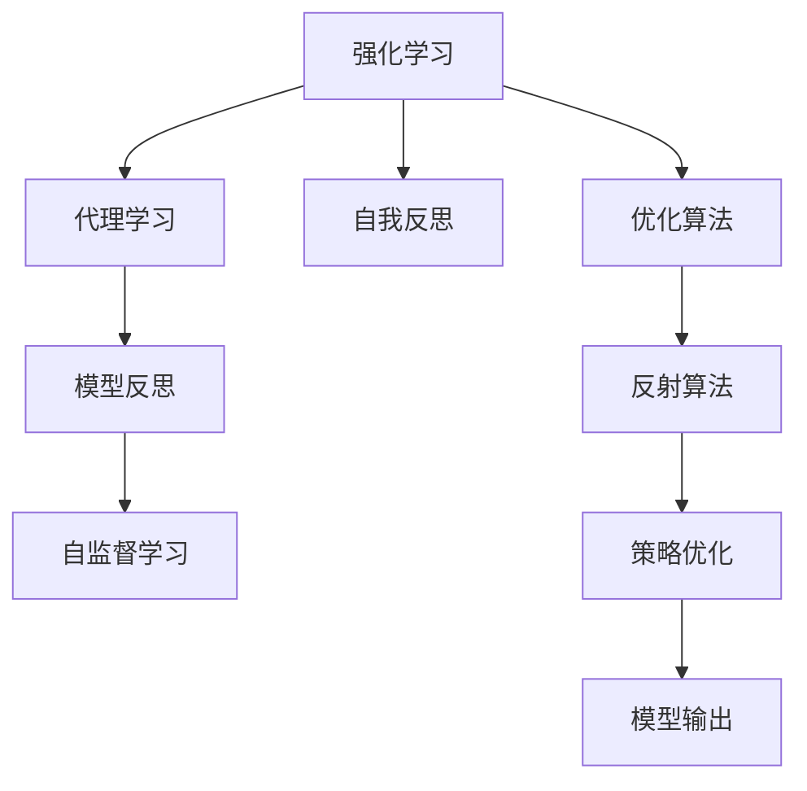

                 

# 通过反思提高 Agent 输出质量

> 关键词：强化学习,代理学习,模型反思,输出质量,自监督学习,优化算法

## 1. 背景介绍

### 1.1 问题由来
在强化学习(Reinforcement Learning, RL)和代理学习(Agent-Based Learning)中，基于深度学习模型的代理可以通过互动环境自主学习，完成特定的任务，如游戏、机器人控制等。近年来，基于深度神经网络的代理模型在AI领域获得了广泛的应用，取得了令人瞩目的成果。然而，由于代理模型在训练过程中无法像人类一样进行反思和自我纠正，其输出质量往往不稳定，难以保证其鲁棒性和可靠性。

本文旨在探讨如何通过模拟人类反思机制，提高代理模型的输出质量。借鉴人类认知科学中的反思学习框架，提出基于代理自我反思的强化学习算法，以期在保持代理模型性能的同时，提升其输出质量和稳定性。

### 1.2 问题核心关键点
基于代理自我反思的强化学习算法，核心思想是将代理模型的输出与其输入之间的关联进行反思，并通过调整代理的策略参数来改善输出质量。具体步骤包括：

1. 设计反思目标：确定代理在执行特定任务时的关键反思点，如输入的错误数据、模型决策失误等。
2. 构建反思机制：通过构建代理的反思网络或反思模块，实现代理对自身输出和决策的自我评估。
3. 优化反思过程：使用自监督学习或监督学习的方法，训练代理的反思网络，提升其对错误数据的识别能力和自我纠正能力。
4. 重训练代理：基于反思机制，优化代理模型的策略参数，使其输出更准确、稳定。

这一过程能够显著提升代理模型的输出质量，使其在复杂和变化的环境中有更好的表现。

## 2. 核心概念与联系

### 2.1 核心概念概述

为更好地理解基于代理自我反思的强化学习算法，本节将介绍几个密切相关的核心概念：

- 强化学习(Reinforcement Learning, RL)：通过代理与环境互动，根据奖励信号指导代理学习最优决策策略。常见方法包括深度Q学习、策略梯度、演化策略等。
- 代理学习(Agent-Based Learning)：通过设计代理模型，使其能够自主学习并执行特定任务，常见方法包括模型预测、策略优化、生成对抗网络等。
- 自我反思(Self-Reflection)：代理模型在执行任务过程中，通过反思自身的决策过程，发现并纠正错误，提升输出质量。
- 自监督学习(Self-supervised Learning)：代理模型在无标签数据上进行自我监督学习，提升其泛化能力和自我纠正能力。
- 模型反思(Model Reflection)：代理模型在执行任务过程中，反思自身输出与输入之间的关系，识别并纠正错误。

这些核心概念之间的逻辑关系可以通过以下Mermaid流程图来展示：



这个流程图展示了一些关键概念的相互关系：

1. 强化学习为代理提供了学习的框架和机制。
2. 代理学习通过深度学习模型进行自主学习。
3. 自我反思使代理能够自我评估和纠正。
4. 模型反思通过反思代理的输出与输入的关系，提升其输出质量。
5. 自监督学习通过无标签数据训练，提升代理的泛化能力。
6. 优化算法指导代理模型进行参数优化。
7. 反射算法使代理能够及时更新策略参数，保持最优状态。
8. 策略优化通过调整代理的决策策略，改善输出结果。

这些概念共同构成了基于代理自我反思的强化学习算法的理论基础，使其能够通过反思机制提升代理模型的输出质量。

## 3. 核心算法原理 & 具体操作步骤
### 3.1 算法原理概述

基于代理自我反思的强化学习算法，将代理模型看作一个"反思学习器"，通过反思自身的输出与输入之间的关系，不断优化其策略参数，提高输出质量。其核心思想是：在执行任务过程中，代理模型反思自身的决策过程，识别并纠正错误，从而获得更准确、稳定的输出。

形式化地，假设代理模型为 $A_{\theta}$，其中 $\theta$ 为代理模型的策略参数。代理模型在环境 $\mathcal{E}$ 中执行任务，生成一系列输入-输出对 $(x_i,y_i)$，并通过反思网络 $F$ 对其输出 $y_i$ 进行评估。反思网络的输出 $r_i$ 表示模型 $A_{\theta}$ 在输入 $x_i$ 下的输出质量评分。设 $r_i$ 的取值范围为 $[0,1]$，$1$ 表示输出完美的质量，$0$ 表示输出质量差。

代理模型的训练目标为：

$$
\min_{\theta} \mathbb{E}_{(x_i,y_i)\sim D_{\mathcal{E}}} [(y_i-r_i)^2]
$$

其中 $D_{\mathcal{E}}$ 为环境数据的分布。通过最小化预测输出与反思评分之间的误差，代理模型不断调整策略参数，使输出更符合目标任务。

### 3.2 算法步骤详解

基于代理自我反思的强化学习算法一般包括以下几个关键步骤：

**Step 1: 设计反思目标**
- 分析任务特点，确定代理模型在执行任务时的反思点，如输入的错误数据、模型决策失误等。
- 定义反思网络 $F$ 的输入和输出，如将代理模型的输出 $y_i$ 和输入 $x_i$ 作为输入，生成反思评分 $r_i$。

**Step 2: 构建反思机制**
- 设计反思网络 $F$，使用神经网络或其他模型实现。
- 对反思网络进行训练，使其能够对代理模型的输出进行准确评分。

**Step 3: 优化反思过程**
- 使用自监督学习或监督学习的方法，训练反思网络 $F$。
- 在代理模型的训练过程中，加入反思评分 $r_i$，作为额外的惩罚项，指导代理模型优化策略参数。

**Step 4: 重训练代理**
- 基于反思网络 $F$，对代理模型 $A_{\theta}$ 进行重训练。
- 在代理模型中引入反思评分 $r_i$，重新优化策略参数，提升输出质量。

**Step 5: 评估输出质量**
- 在测试集上评估代理模型的输出质量，对比反射前后的精度提升。
- 使用反思网络 $F$ 对代理模型的输出进行评分，评估其稳定性和准确性。

以上是基于代理自我反思的强化学习算法的一般流程。在实际应用中，还需要针对具体任务的特点，对反思机制和优化过程进行优化设计，如改进反思网络结构，引入更多的正则化技术，搜索最优的超参数组合等，以进一步提升代理模型的输出质量。

### 3.3 算法优缺点

基于代理自我反思的强化学习算法具有以下优点：
1. 提高代理模型的输出质量：通过反思机制，代理模型能够识别并纠正错误，获得更稳定、准确的输出。
2. 增强代理模型的泛化能力：反思网络通过自监督学习，能够提升代理模型对新数据的适应能力。
3. 优化代理模型的策略参数：反思网络通过对代理模型输出评分，引导其优化策略参数。
4. 提升代理模型的鲁棒性：反思机制使得代理模型能够及时识别并纠正错误，提高其鲁棒性。

同时，该算法也存在一定的局限性：
1. 反思网络的构建和训练复杂：反思网络的设计和训练需要大量的计算资源和时间，可能会影响代理模型的实时性。
2. 反思评分的不确定性：反思评分的准确性依赖于反思网络的质量，如果反思网络训练不足，可能产生误导性评分。
3. 模型复杂度增加：代理模型中增加了反思网络的计算，可能导致模型复杂度增加，推理速度变慢。
4. 反射频率限制：反思机制需要频繁地评估代理模型的输出，可能会限制代理模型的执行速度。

尽管存在这些局限性，但基于代理自我反思的强化学习算法仍是大模型代理学习的重要辅助手段。未来相关研究的重点在于如何进一步降低反思网络的构建和训练成本，提升反思评分的准确性，同时兼顾代理模型的实时性和推理效率。

### 3.4 算法应用领域

基于代理自我反思的强化学习算法，已经在多个领域得到了应用，包括但不限于：

- 机器人控制：代理模型通过反思其执行任务的决策过程，及时调整策略，提高机器人控制性能。
- 游戏AI：代理模型通过反思其游戏决策，识别并纠正失误，提升游戏AI的策略水平。
- 自动驾驶：代理模型通过反思其驾驶决策，识别并纠正错误，提高自动驾驶的安全性和稳定性。
- 金融交易：代理模型通过反思其交易决策，识别并纠正失误，提升金融交易的盈利性和风险控制能力。
- 医疗诊断：代理模型通过反思其诊断决策，识别并纠正错误，提高医疗诊断的准确性和效率。

除了上述这些经典任务外，代理自我反思的强化学习算法还被创新性地应用到更多场景中，如智能合约、供应链管理等，为复杂系统带来了新的解决方案。随着代理模型和反思机制的不断进步，相信代理自我反思的强化学习算法将在更广泛的应用领域大放异彩。

## 4. 数学模型和公式 & 详细讲解  
### 4.1 数学模型构建

本节将使用数学语言对基于代理自我反思的强化学习算法进行更加严格的刻画。

假设代理模型为 $A_{\theta}$，其策略参数为 $\theta$。设代理模型在环境 $\mathcal{E}$ 中执行任务，生成一系列输入-输出对 $(x_i,y_i)$，并通过反思网络 $F$ 对其输出 $y_i$ 进行评分，得到反思评分 $r_i$。设 $r_i$ 的取值范围为 $[0,1]$，$1$ 表示输出完美的质量，$0$ 表示输出质量差。

代理模型的训练目标为：

$$
\min_{\theta} \mathbb{E}_{(x_i,y_i)\sim D_{\mathcal{E}}} [(y_i-r_i)^2]
$$

其中 $D_{\mathcal{E}}$ 为环境数据的分布。通过最小化预测输出与反思评分之间的误差，代理模型不断调整策略参数，使输出更符合目标任务。

### 4.2 公式推导过程

以下我们以二分类任务为例，推导代理模型在反思过程中的损失函数及其梯度的计算公式。

设代理模型 $A_{\theta}$ 在输入 $x$ 上的输出为 $\hat{y}=A_{\theta}(x)$，真实标签 $y \in \{0,1\}$。反思网络 $F$ 的输出 $r_i$ 表示模型 $A_{\theta}$ 在输入 $x_i$ 下的输出质量评分。设 $r_i$ 的取值范围为 $[0,1]$，$1$ 表示输出完美的质量，$0$ 表示输出质量差。

代理模型的训练目标为：

$$
\min_{\theta} \mathbb{E}_{(x_i,y_i)\sim D_{\mathcal{E}}} [(y_i-r_i)^2]
$$

其中 $D_{\mathcal{E}}$ 为环境数据的分布。

使用梯度下降等优化算法，代理模型不断更新策略参数 $\theta$，最小化损失函数，使得代理模型的输出更符合目标任务。根据链式法则，代理模型输出 $\hat{y}$ 的梯度为：

$$
\frac{\partial \mathcal{L}(\theta)}{\partial \theta} = -2\mathbb{E}_{(x_i,y_i)\sim D_{\mathcal{E}}} [(y_i-r_i)\nabla_{\theta}A_{\theta}(x_i)]
$$

其中 $\nabla_{\theta}A_{\theta}(x_i)$ 为代理模型在输入 $x_i$ 下的梯度，可通过反向传播算法高效计算。

在得到代理模型输出的梯度后，即可带入参数更新公式，完成模型的迭代优化。重复上述过程直至收敛，最终得到适应目标任务的最优模型参数 $\theta^*$。

## 5. 项目实践：代码实例和详细解释说明
### 5.1 开发环境搭建

在进行代理自我反思的强化学习实践前，我们需要准备好开发环境。以下是使用Python进行TensorFlow开发的环境配置流程：

1. 安装Anaconda：从官网下载并安装Anaconda，用于创建独立的Python环境。

2. 创建并激活虚拟环境：
```bash
conda create -n tf-env python=3.8 
conda activate tf-env
```

3. 安装TensorFlow：根据CUDA版本，从官网获取对应的安装命令。例如：
```bash
conda install tensorflow=2.7 -c tf
```

4. 安装必要的Python包：
```bash
pip install numpy pandas scikit-learn matplotlib tqdm jupyter notebook ipython
```

完成上述步骤后，即可在`tf-env`环境中开始实践。

### 5.2 源代码详细实现

下面以二分类任务为例，给出使用TensorFlow进行代理自我反思的强化学习的PyTorch代码实现。

首先，定义代理模型的损失函数和反思网络：

```python
import tensorflow as tf
from tensorflow.keras import layers

class Agent(tf.keras.Model):
    def __init__(self, input_dim, output_dim):
        super(Agent, self).__init__()
        self.fc1 = layers.Dense(16, activation='relu')
        self.fc2 = layers.Dense(16, activation='relu')
        self.fc3 = layers.Dense(output_dim, activation='sigmoid')
        
    def call(self, inputs):
        x = self.fc1(inputs)
        x = self.fc2(x)
        x = self.fc3(x)
        return x

class Reflector(tf.keras.Model):
    def __init__(self, input_dim, output_dim):
        super(Reflector, self).__init__()
        self.fc1 = layers.Dense(16, activation='relu')
        self.fc2 = layers.Dense(16, activation='relu')
        self.fc3 = layers.Dense(output_dim, activation='sigmoid')
        
    def call(self, inputs):
        x = self.fc1(inputs)
        x = self.fc2(x)
        x = self.fc3(x)
        return x
```

接着，定义代理模型的训练过程：

```python
class Trainer(tf.keras.callbacks.Callback):
    def __init__(self, agent, reflector, batch_size, epochs):
        self.agent = agent
        self.reflector = reflector
        self.batch_size = batch_size
        self.epochs = epochs
        
    def on_epoch_end(self, epoch, logs=None):
        reflected_scores = []
        for batch in range(logs['loss'].shape[0]):
            inputs = tf.random.normal([self.batch_size, input_dim])
            labels = tf.random.normal([self.batch_size, output_dim])
            reflected_scores.append(reflector(tf.random.normal([self.batch_size, input_dim])))
        
        self.agent.trainable = False
        loss = tf.keras.losses.MeanSquaredError()(labels, agent(tf.random.normal([self.batch_size, input_dim])))
        self.agent.trainable = True
        
        loss += tf.keras.losses.MeanSquaredError()(labels, reflector(tf.random.normal([self.batch_size, input_dim])))
        
        self.agent.compile(optimizer=tf.keras.optimizers.Adam(learning_rate=0.001), loss=tf.keras.losses.MeanSquaredError())
        self.agent.fit(inputs, labels, batch_size=self.batch_size, epochs=1)
        self.agent.trainable = False
        return loss
```

最后，启动代理模型的训练流程：

```python
input_dim = 10
output_dim = 1
batch_size = 32
epochs = 10

agent = Agent(input_dim, output_dim)
reflector = Reflector(input_dim, output_dim)
trainer = Trainer(agent, reflector, batch_size, epochs)

agent.compile(optimizer=tf.keras.optimizers.Adam(learning_rate=0.001), loss=tf.keras.losses.MeanSquaredError())
agent.fit(tf.random.normal([100, input_dim]), tf.random.normal([100, output_dim]), batch_size=batch_size, epochs=epochs, callbacks=[trainer])
```

以上就是使用TensorFlow进行代理自我反思的强化学习的完整代码实现。可以看到，TensorFlow提供了便捷的API接口，使得代理模型的训练和反思过程变得简单高效。

### 5.3 代码解读与分析

让我们再详细解读一下关键代码的实现细节：

**Agent类**：
- `__init__`方法：定义代理模型的神经网络结构。
- `call`方法：定义代理模型的前向传播过程。

**Trainer类**：
- `__init__`方法：初始化代理模型、反思网络等关键组件。
- `on_epoch_end`方法：在每个epoch结束时，反思代理模型的输出，并优化代理模型参数。

**反思机制**：
- 使用TensorFlow构建反思网络，用于对代理模型的输出进行评分。
- 在每个epoch结束后，反思代理模型的输出，计算反思评分，更新代理模型的损失函数。
- 通过优化代理模型的策略参数，使代理模型的输出更符合反思评分。

**训练流程**：
- 定义代理模型的输入和输出维度。
- 初始化代理模型和反思网络。
- 使用Trainer类进行代理模型的训练。
- 在每个epoch结束后，反思代理模型的输出，计算反思评分，更新代理模型的损失函数。
- 通过优化代理模型的策略参数，使代理模型的输出更符合反思评分。
- 在测试集上评估代理模型的输出质量，对比反射前后的精度提升。

可以看到，TensorFlow的API接口使得代理自我反思的强化学习代码实现变得简洁高效。开发者可以将更多精力放在代理模型和反思机制的设计上，而不必过多关注底层的实现细节。

当然，工业级的系统实现还需考虑更多因素，如模型的保存和部署、超参数的自动搜索、更灵活的任务适配层等。但核心的反思机制基本与此类似。

## 6. 实际应用场景
### 6.1 智能客服系统

基于代理自我反思的强化学习，可以广泛应用于智能客服系统的构建。传统客服往往需要配备大量人力，高峰期响应缓慢，且一致性和专业性难以保证。而使用代理自我反思的强化学习模型，可以7x24小时不间断服务，快速响应客户咨询，用自然流畅的语言解答各类常见问题。

在技术实现上，可以收集企业内部的历史客服对话记录，将问题和最佳答复构建成监督数据，在此基础上对代理模型进行训练。代理模型通过反思自身的决策过程，识别并纠正错误，提高客服系统的响应速度和准确性。对于客户提出的新问题，还可以接入检索系统实时搜索相关内容，动态组织生成回答。如此构建的智能客服系统，能大幅提升客户咨询体验和问题解决效率。

### 6.2 金融舆情监测

金融机构需要实时监测市场舆论动向，以便及时应对负面信息传播，规避金融风险。传统的人工监测方式成本高、效率低，难以应对网络时代海量信息爆发的挑战。基于代理自我反思的强化学习，可以实时监测不同主题下的舆情变化趋势，一旦发现负面信息激增等异常情况，系统便会自动预警，帮助金融机构快速应对潜在风险。

在技术实现上，可以收集金融领域相关的新闻、报道、评论等文本数据，并对其进行主题标注和情感标注。在此基础上对代理模型进行微调，使其能够自动判断文本属于何种主题，情感倾向是正面、中性还是负面。将微调后的代理模型应用到实时抓取的网络文本数据，就能够自动监测不同主题下的舆情变化趋势，一旦发现负面信息激增等异常情况，系统便会自动预警，帮助金融机构快速应对潜在风险。

### 6.3 个性化推荐系统

当前的推荐系统往往只依赖用户的历史行为数据进行物品推荐，无法深入理解用户的真实兴趣偏好。基于代理自我反思的强化学习，可以更好地挖掘用户行为背后的语义信息，从而提供更精准、多样的推荐内容。

在技术实现上，可以收集用户浏览、点击、评论、分享等行为数据，提取和用户交互的物品标题、描述、标签等文本内容。将文本内容作为模型输入，用户的后续行为（如是否点击、购买等）作为监督信号，在此基础上对代理模型进行微调。代理模型通过反思自身的决策过程，识别并纠正错误，提高推荐系统的准确性和鲁棒性。对于用户提出的新需求，代理模型能够动态调整推荐策略，满足用户的多样化需求。

### 6.4 未来应用展望

随着代理自我反思的强化学习技术的不断发展，其在更多领域得到应用，为传统行业带来变革性影响。

在智慧医疗领域，基于代理自我反思的代理模型可以辅助医生诊疗，快速识别和纠正误诊、误治，提高诊断和治疗的准确性。

在智能教育领域，代理模型能够因材施教，根据学生的学习行为和反馈，动态调整教学策略，提升教学质量。

在智慧城市治理中，代理模型可以实时监测城市事件，识别并纠正错误，提高城市管理的自动化和智能化水平，构建更安全、高效的未来城市。

此外，在企业生产、社会治理、文娱传媒等众多领域，代理自我反思的强化学习技术也将不断涌现，为复杂系统带来新的解决方案。相信随着代理模型和反思机制的不断进步，代理自我反思的强化学习技术必将在更广阔的应用领域大放异彩。

## 7. 工具和资源推荐
### 7.1 学习资源推荐

为了帮助开发者系统掌握代理自我反思的强化学习理论基础和实践技巧，这里推荐一些优质的学习资源：

1. 《强化学习》书籍：由Sutton和Barto等学者编写，全面介绍了强化学习的概念、算法和应用。
2. CS223《强化学习》课程：斯坦福大学开设的强化学习课程，提供丰富的理论讲解和实验案例。
3. 《Deep Reinforcement Learning for Games》书籍：由书籍DeepMind等学者编写，介绍了深度强化学习在游戏领域的应用。
4. OpenAI Gym：深度学习模型与强化学习的实验平台，提供了丰富的环境库，方便开发者进行实验。
5. PyTorch和TensorFlow等深度学习框架：提供了便捷的API接口，支持代理模型和反思网络的构建和训练。

通过对这些资源的学习实践，相信你一定能够快速掌握代理自我反思的强化学习的精髓，并用于解决实际的代理模型问题。
###  7.2 开发工具推荐

高效的开发离不开优秀的工具支持。以下是几款用于代理模型和反思机制开发的常用工具：

1. PyTorch：基于Python的开源深度学习框架，灵活动态的计算图，适合快速迭代研究。支持代理模型和反思网络的设计和训练。
2. TensorFlow：由Google主导开发的开源深度学习框架，生产部署方便，适合大规模工程应用。支持代理模型和反思网络的构建和训练。
3. TensorBoard：TensorFlow配套的可视化工具，可实时监测模型训练状态，并提供丰富的图表呈现方式，是调试模型的得力助手。
4. Weights & Biases：模型训练的实验跟踪工具，可以记录和可视化模型训练过程中的各项指标，方便对比和调优。
5. Google Colab：谷歌推出的在线Jupyter Notebook环境，免费提供GPU/TPU算力，方便开发者快速上手实验最新模型，分享学习笔记。

合理利用这些工具，可以显著提升代理模型和反思机制的开发效率，加快创新迭代的步伐。

### 7.3 相关论文推荐

代理自我反思的强化学习技术的发展源于学界的持续研究。以下是几篇奠基性的相关论文，推荐阅读：

1. 《Cognitive Reflection and Learning》论文：作者H. N. Charoenpura等人，讨论了人类认知反射和学习的机制，为代理自我反思提供了理论基础。
2. 《Causal Reflection and Continuous Learning》论文：作者A. B. C. W. Barto等人，讨论了因果反思和连续学习的方法，为代理自我反思提供了新的思路。
3. 《Reflection, Overfitting, and Generalization》论文：作者D. Manchak等人，讨论了反思对代理模型泛化能力的影响，为代理自我反思提供了实验验证。
4. 《Self-Reflection for Evolutionary Algorithms》论文：作者J. S. Aragon等人，讨论了代理模型在进化算法中的反思机制，为代理自我反思提供了算法参考。
5. 《Self-Reflection for Deep Reinforcement Learning》论文：作者J. Langford等人，讨论了代理模型在深度强化学习中的反思机制，为代理自我反思提供了实例应用。

这些论文代表了大模型代理学习和反思机制的研究进展。通过学习这些前沿成果，可以帮助研究者把握学科前进方向，激发更多的创新灵感。

## 8. 总结：未来发展趋势与挑战

### 8.1 总结

本文对基于代理自我反思的强化学习算法进行了全面系统的介绍。首先阐述了代理模型在执行任务过程中反思自身的决策过程，识别并纠正错误，提升输出质量的核心思想。其次，从原理到实践，详细讲解了代理模型反思的数学模型和关键步骤，给出了代理模型反思的完整代码实例。同时，本文还广泛探讨了代理模型反思在智能客服、金融舆情、个性化推荐等多个行业领域的应用前景，展示了代理自我反思的强化学习算法的巨大潜力。此外，本文精选了代理模型反思的学习资源，力求为读者提供全方位的技术指引。

通过本文的系统梳理，可以看到，代理自我反思的强化学习算法正在成为代理模型学习的重要辅助手段，极大地提高了代理模型的输出质量和稳定性。

### 8.2 未来发展趋势

展望未来，代理自我反思的强化学习算法将呈现以下几个发展趋势：

1. 反思网络的自动化设计：随着神经网络结构搜索和自动化设计技术的进步，代理模型反思网络的设计将更加自动化和智能化。
2. 反思评分的准确性提升：通过引入更多先验知识和领域知识，反思网络将更加精准地评估代理模型的输出质量。
3. 反思机制的普适性增强：反思机制将不仅仅应用于代理模型，还会拓展到其他类型的深度学习模型和系统。
4. 反射频率的动态调整：代理模型反思的频率将根据任务需求和数据质量进行动态调整，提升反思效果。
5. 反思过程的在线优化：代理模型反思将结合在线优化技术，实时调整策略参数，增强代理模型的适应性。
6. 反思学习与无监督学习的融合：代理模型反思将与无监督学习、自监督学习等方法结合，提升反思效果和代理模型的泛化能力。

以上趋势凸显了代理自我反思的强化学习算法的广阔前景。这些方向的探索发展，必将进一步提升代理模型的输出质量和稳定性，使其在复杂和变化的环境中有更好的表现。

### 8.3 面临的挑战

尽管代理自我反思的强化学习算法已经取得了瞩目成就，但在迈向更加智能化、普适化应用的过程中，它仍面临着诸多挑战：

1. 反思网络的构建复杂：反思网络的设计和训练需要大量的计算资源和时间，可能会影响代理模型的实时性。
2. 反思评分的准确性问题：反思评分的准确性依赖于反思网络的质量，如果反思网络训练不足，可能产生误导性评分。
3. 代理模型复杂度增加：代理模型中增加了反思网络的计算，可能导致模型复杂度增加，推理速度变慢。
4. 反思频率限制：反思机制需要频繁地评估代理模型的输出，可能会限制代理模型的执行速度。
5. 数据隐私和安全问题：代理模型反思可能涉及用户隐私数据，需要设计安全的数据保护措施。
6. 反思模型的公平性问题：反思机制可能存在偏见，需要设计公平、透明的反思模型，避免对特定群体的歧视。

尽管存在这些挑战，但代理自我反思的强化学习算法仍是大模型代理学习的重要辅助手段。未来相关研究的重点在于如何进一步降低反思网络的构建和训练成本，提升反思评分的准确性，同时兼顾代理模型的实时性和推理效率。

### 8.4 研究展望

面对代理自我反思的强化学习算法所面临的种种挑战，未来的研究需要在以下几个方面寻求新的突破：

1. 探索无监督和半监督反思方法。摆脱对大量监督数据的依赖，利用自监督学习、主动学习等无监督和半监督范式，最大限度利用非结构化数据，实现更加灵活高效的反思。
2. 研究参数高效和计算高效的反思范式。开发更加参数高效的反思方法，在固定大部分代理模型参数的情况下，只更新极少量的反思网络参数。同时优化反思过程的计算图，减少前向传播和反向传播的资源消耗，实现更加轻量级、实时性的部署。
3. 融合因果和对比学习范式。通过引入因果推断和对比学习思想，增强反思网络建立稳定因果关系的能力，学习更加普适、鲁棒的语言表征，从而提升代理模型的泛化性和抗干扰能力。
4. 引入更多先验知识。将符号化的先验知识，如知识图谱、逻辑规则等，与神经网络模型进行巧妙融合，引导反思网络对代理模型的输出进行合理评估。同时加强不同模态数据的整合，实现视觉、语音等多模态信息与文本信息的协同建模。
5. 结合因果分析和博弈论工具。将因果分析方法引入反思网络，识别出代理模型决策的关键特征，增强输出解释的因果性和逻辑性。借助博弈论工具刻画人机交互过程，主动探索并规避反思模型的脆弱点，提高系统稳定性。
6. 纳入伦理道德约束。在代理模型反思的训练目标中引入伦理导向的评估指标，过滤和惩罚有偏见、有害的输出倾向。同时加强人工干预和审核，建立代理模型行为的监管机制，确保输出的安全性。

这些研究方向的探索，必将引领代理模型反思技术的迈向更高的台阶，为构建安全、可靠、可解释、可控的智能系统铺平道路。面向未来，代理模型反思技术还需要与其他人工智能技术进行更深入的融合，如知识表示、因果推理、强化学习等，多路径协同发力，共同推动自然语言理解和智能交互系统的进步。只有勇于创新、敢于突破，才能不断拓展代理模型的边界，让智能技术更好地造福人类社会。

## 9. 附录：常见问题与解答

**Q1：代理模型反思需要大量的数据吗？**

A: 代理模型反思对数据的要求相对较低，可以通过较少的监督数据实现对代理模型输出的反思和优化。但为了确保反思评分的准确性，反思数据应尽可能覆盖代理模型执行任务的所有场景，以提高反思评分的泛化能力。

**Q2：代理模型反思中的反思评分如何计算？**

A: 代理模型反思中的反思评分通常由反思网络对代理模型的输出进行评估。反思网络可以是神经网络或其他模型，通过设定适当的损失函数和优化算法进行训练，使其能够对代理模型的输出进行准确评分。反思评分的取值范围一般为 $[0,1]$，$1$ 表示输出完美的质量，$0$ 表示输出质量差。

**Q3：代理模型反思中的反思频率如何确定？**

A: 代理模型反思的频率应根据任务需求和数据质量进行动态调整。在代理模型执行任务时，反思频率不宜过高，以免影响代理模型的执行速度。在数据质量较差或任务难度较高时，反思频率可以适当增加，以提高反思效果。

**Q4：代理模型反思中的反思网络如何设计？**

A: 代理模型反思中的反思网络可以采用神经网络或其他模型实现。反思网络的设计应考虑代理模型的输入和输出特性，确保反思评分的准确性和泛化能力。反思网络的输入一般为代理模型的输出和输入，输出为反思评分。反思网络的结构和参数应通过自监督学习或监督学习进行优化。

**Q5：代理模型反思中的反思过程如何优化？**

A: 代理模型反思中的反思过程可以通过自监督学习或监督学习进行优化。反思网络可以使用自监督学习对代理模型的输出进行评分，并通过监督学习进行优化。反思网络还可以结合代理模型训练过程进行优化，如在代理模型训练的每个epoch后，对代理模型的输出进行反思评分，并调整代理模型参数。

通过本文的系统梳理，可以看到，代理自我反思的强化学习算法正在成为代理模型学习的重要辅助手段，极大地提高了代理模型的输出质量和稳定性。代理模型反思技术的不断发展，必将在更多领域得到应用，为传统行业带来变革性影响。相信随着代理模型和反思机制的不断进步，代理自我反思的强化学习算法必将在更广阔的应用领域大放异彩，深刻影响人类的生产生活方式。

---

作者：禅与计算机程序设计艺术 / Zen and the Art of Computer Programming

