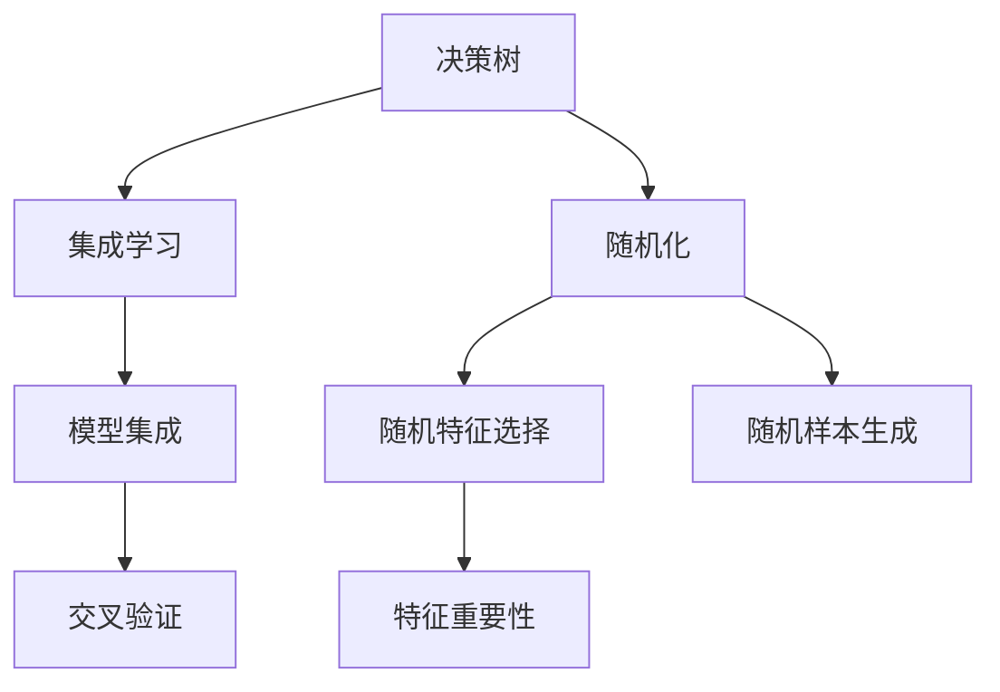

                 

# 随机森林 原理与代码实例讲解

> 关键词：随机森林,决策树,随机性,模型集成,特征重要性,集成学习,代码实现,可解释性

## 1. 背景介绍

### 1.1 问题由来
在机器学习领域，决策树和集成学习是两种广泛应用的算法范式。决策树以其易于理解和解释而著称，但在处理噪声和复杂数据时易过拟合；而集成学习，尤其是基于随机化的模型集成，通过组合多个决策树的预测，有效提升了模型的泛化能力和稳定性。本文将聚焦于随机森林算法，阐述其原理与实现细节，并结合实际案例进行讲解。

### 1.2 问题核心关键点
随机森林（Random Forest）作为一种集成学习方法，其核心思想是通过随机选取特征和样本，构建多个决策树，并通过对这些决策树的结果进行平均或投票，得到最终预测结果。随机森林的关键在于如何生成这些随机化的决策树，以及如何对这些树进行有效集成。

随机森林具有以下特点：
- 基于决策树，易于理解和解释。
- 通过随机特征选择和随机样本生成，降低了过拟合风险。
- 可以利用并行计算，提高训练效率。
- 具有较好的泛化能力和鲁棒性。

## 2. 核心概念与联系

### 2.1 核心概念概述

为更好地理解随机森林算法，本节将介绍几个密切相关的核心概念：

- **决策树（Decision Tree）**：一种基于树形结构的分类模型，通过对数据集进行递归划分，得到最终的分类结果。决策树易于理解和解释，但易过拟合。
- **集成学习（Ensemble Learning）**：通过结合多个基础模型的预测，提升整体模型的性能。常见的集成方法包括Bagging、Boosting等。
- **随机化（Randomization）**：在随机森林中，随机特征选择和随机样本生成是其核心的随机化策略，用于降低过拟合风险。
- **特征重要性（Feature Importance）**：随机森林通过对每个特征的随机使用情况进行统计，得到特征的重要性，用于特征选择和模型调优。
- **交叉验证（Cross-Validation）**：一种模型评估方法，通过将数据集划分为训练集和验证集，交叉验证提升了模型评估的稳健性。

这些核心概念之间的逻辑关系可以通过以下Mermaid流程图来展示：



这个流程图展示了决策树、集成学习、随机化等概念之间的关系：

1. 决策树是随机森林的基础，通过随机化策略改进后，构成了随机森林的核心组件。
2. 随机化策略中的随机特征选择和随机样本生成，分别提升了模型的泛化能力和训练效率。
3. 集成学习通过组合多个随机化的决策树，得到最终的预测结果，提高了模型的稳定性和泛化能力。
4. 特征重要性帮助理解哪些特征对模型预测贡献最大，用于特征选择和模型调优。
5. 交叉验证通过验证集评估模型性能，保证了模型评估的准确性。

## 3. 核心算法原理 & 具体操作步骤
### 3.1 算法原理概述

随机森林算法的核心在于通过随机选择特征和样本，构建多个决策树，并通过集成这些树来提升模型性能。其基本流程如下：

1. **数据准备**：从原始数据中随机抽取有放回的样本，构成训练集。
2. **特征随机选择**：随机选择部分特征，用于构建每个决策树。
3. **决策树构建**：基于随机选择的特征和样本，构建决策树。
4. **模型集成**：通过平均或投票等策略，将多个决策树的结果进行集成，得到最终预测结果。

随机森林的优点包括：
- 可以处理多类别问题。
- 可以处理缺失值。
- 具有较好的泛化能力和鲁棒性。
- 易于理解和解释。

### 3.2 算法步骤详解

以下是对随机森林算法具体步骤的详细介绍：

**Step 1: 数据准备**
- 随机选择训练集数据，有放回地抽取 $n$ 个样本，构成训练集 $\{(x_1, y_1), (x_2, y_2), \ldots, (x_n, y_n)\}$。
- 假设样本维度为 $m$，随机选择 $k$ 个特征，构成特征集合 $S$。

**Step 2: 决策树构建**
- 对于每个样本 $(x_i, y_i)$，随机选择 $k$ 个特征 $S_i$，构成子集 $S_i = \{j_1, j_2, \ldots, j_k\}$。
- 在 $S_i$ 上构建决策树，得到树 $T_i$。
- 记录 $T_i$ 的根节点 $r_i$ 和所有节点的特征 $f_i$。

**Step 3: 模型集成**
- 对于每个样本 $x_i$，计算树 $T_i$ 的预测结果 $y_i = \hat{y}(x_i)$。
- 将 $y_i$ 进行平均或投票，得到最终预测结果 $\hat{y}(x_i)$。

**Step 4: 特征重要性计算**
- 对于每个特征 $j$，计算其使用的次数 $N_j$ 和每次使用的平均预测准确度 $A_j$。
- 特征的重要性 $I_j = N_j \times (1 - A_j)$，即特征越重要，使用次数越多，但平均预测准确度越低。

**Step 5: 模型评估**
- 使用交叉验证方法评估模型性能，如留出法、k折交叉验证等。
- 根据评估结果调整模型参数，如决策树的深度、样本数量等。

### 3.3 算法优缺点

随机森林算法具有以下优点：
- 易于理解和解释，决策树可以直观地表示决策过程。
- 具有较好的泛化能力和鲁棒性，通过集成多个决策树，可以降低过拟合风险。
- 可以处理高维数据和缺失值。
- 可以利用并行计算，提高训练效率。

同时，随机森林也存在以下缺点：
- 模型复杂度高，占用的存储空间较大。
- 训练时间较长，对于大规模数据集，计算开销较大。
- 对异常值和噪声敏感，需要预先处理数据。

### 3.4 算法应用领域

随机森林算法在多个领域都有广泛应用，如金融风险评估、医疗诊断、自然语言处理、图像识别等。具体应用场景包括：

- **金融风险评估**：通过随机森林模型，评估客户的信用风险和贷款违约概率，辅助银行进行贷款审批。
- **医疗诊断**：随机森林可以用于肿瘤分类、疾病预测等医疗领域，通过分析病人的各项指标，辅助医生进行诊断和治疗。
- **自然语言处理**：随机森林可以用于文本分类、情感分析等任务，通过分析文本的特征，识别文本的情感倾向。
- **图像识别**：随机森林可以用于图像分类、目标检测等任务，通过分析图像的特征，识别图像中的物体和场景。

## 4. 数学模型和公式 & 详细讲解  
### 4.1 数学模型构建

假设有一个训练集 $\{(x_1, y_1), (x_2, y_2), \ldots, (x_n, y_n)\}$，其中 $x_i \in \mathcal{X}$，$y_i \in \{1, 2, \ldots, K\}$，$K$ 为类别数。

定义决策树 $T$ 的结构为 $(X, F)$，其中 $X$ 为树节点，$F$ 为节点到特征的映射。假设决策树 $T$ 的叶节点数为 $N$，节点到特征的映射 $f: [1, N] \times [1, K] \rightarrow [1, m]$，即第 $i$ 个节点，特征 $k$ 上，对应特征值 $j$。

定义决策树 $T$ 的预测结果为 $\hat{y}(x)$，对于样本 $x_i$，通过从根节点开始递归遍历树，得到预测结果 $\hat{y}(x_i)$。

随机森林模型 $M$ 由多个决策树 $T_1, T_2, \ldots, T_n$ 组成，定义为 $M = (T_1, T_2, \ldots, T_n)$。

假设 $y_i$ 的预测结果为 $\hat{y}_i$，随机森林的预测结果为 $\hat{y}$，则：

$$
\hat{y} = \frac{1}{n} \sum_{i=1}^n \hat{y}_i
$$

其中 $\hat{y}_i = \hat{y}(x_i)$。

### 4.2 公式推导过程

以下我们以二分类任务为例，推导随机森林模型的预测公式。

假设决策树 $T$ 的预测结果为 $\hat{y}(x) = 1$ 或 $\hat{y}(x) = 0$，随机森林的预测结果为 $\hat{y}$，则：

$$
\hat{y} = \frac{1}{n} \sum_{i=1}^n \hat{y}_i
$$

其中 $\hat{y}_i$ 为第 $i$ 棵树的预测结果。对于样本 $x_i$，在决策树 $T_i$ 上，得到预测结果 $\hat{y}_i$，计算如下：

1. 从根节点开始，递归遍历树，到达叶节点。
2. 对于每个节点，根据特征 $j$ 和阈值 $t$，判断样本 $x_i$ 是否满足条件 $x_i[j] > t$。
3. 根据节点的预测结果和样本 $x_i$ 是否满足条件，继续遍历子树或返回叶节点。
4. 根据叶节点的预测结果，得到 $\hat{y}_i$。

设决策树 $T_i$ 的叶节点数为 $N_i$，每个叶节点 $r$ 的预测结果为 $y_r$，则：

$$
\hat{y}_i = \sum_{r=1}^{N_i} y_r \times \text{Pr}(r|x_i)
$$

其中 $\text{Pr}(r|x_i)$ 为样本 $x_i$ 到达叶节点 $r$ 的概率，根据节点到特征的映射 $f$ 计算得到。

将 $\hat{y}_i$ 的计算公式带入随机森林的预测公式，得到：

$$
\hat{y} = \frac{1}{n} \sum_{i=1}^n \left( \sum_{r=1}^{N_i} y_r \times \text{Pr}(r|x_i) \right)
$$

### 4.3 案例分析与讲解

假设有一个二分类问题，数据集如下：

| 样本 | 特征 | 类别 |
| --- | --- | --- |
| 1 | 3 | 0 |
| 1 | 1 | 0 |
| 1 | 2 | 1 |
| 2 | 3 | 1 |
| 2 | 2 | 0 |
| 2 | 1 | 1 |
| 3 | 2 | 0 |
| 3 | 1 | 1 |

假设随机选择特征 $k = 1$，随机抽取样本 $n = 4$，构建随机森林。

1. 随机抽取样本 $x_1 = (1, 3)$，$x_2 = (2, 2)$，$x_3 = (1, 2)$，$x_4 = (3, 1)$。
2. 对于每个样本，随机选择特征 $k = 1$，构建决策树。
3. 对于每个样本 $x_i$，计算其随机森林的预测结果 $\hat{y}_i$。
4. 计算随机森林的预测结果 $\hat{y}$。

以样本 $x_1 = (1, 3)$ 为例，随机抽取样本 $n = 4$，随机选择特征 $k = 1$，构建决策树 $T_1$。

1. 从根节点开始，递归遍历树，到达叶节点。
2. 对于每个节点，根据特征 $j = 1$ 和阈值 $t$，判断样本 $x_i = (1, 3)$ 是否满足条件 $x_i[j] > t$。
3. 根据节点的预测结果和样本 $x_i = (1, 3)$ 是否满足条件，继续遍历子树或返回叶节点。
4. 根据叶节点的预测结果，得到 $\hat{y}_1$。

假设叶节点 $r = 1$ 的预测结果为 $y_1 = 0$，叶节点 $r = 2$ 的预测结果为 $y_2 = 1$，则：

$$
\hat{y}_1 = 0 \times \text{Pr}(1|x_1) + 1 \times \text{Pr}(2|x_1)
$$

其中 $\text{Pr}(1|x_1)$ 和 $\text{Pr}(2|x_1)$ 根据节点到特征的映射 $f$ 计算得到。

同理，对于其他样本，计算随机森林的预测结果 $\hat{y}_2, \hat{y}_3, \hat{y}_4$。

最后，计算随机森林的预测结果 $\hat{y} = \frac{1}{4} (\hat{y}_1 + \hat{y}_2 + \hat{y}_3 + \hat{y}_4)$。

## 5. 项目实践：代码实例和详细解释说明
### 5.1 开发环境搭建

在进行随机森林项目实践前，我们需要准备好开发环境。以下是使用Python进行Scikit-learn开发的环境配置流程：

1. 安装Anaconda：从官网下载并安装Anaconda，用于创建独立的Python环境。

2. 创建并激活虚拟环境：
```bash
conda create -n randomforest-env python=3.8 
conda activate randomforest-env
```

3. 安装Scikit-learn：
```bash
conda install scikit-learn
```

4. 安装其他必要的工具包：
```bash
pip install numpy pandas matplotlib seaborn scikit-learn
```

完成上述步骤后，即可在`randomforest-env`环境中开始随机森林实践。

### 5.2 源代码详细实现

这里我们以波士顿房价预测问题为例，使用Scikit-learn的随机森林模型进行代码实现。

首先，导入必要的库：

```python
import numpy as np
import pandas as pd
import matplotlib.pyplot as plt
from sklearn.datasets import load_boston
from sklearn.model_selection import train_test_split
from sklearn.ensemble import RandomForestRegressor
from sklearn.metrics import mean_squared_error
```

然后，加载波士顿房价数据集：

```python
boston = load_boston()
X = boston.data
y = boston.target
```

接下来，将数据集划分为训练集和测试集：

```python
X_train, X_test, y_train, y_test = train_test_split(X, y, test_size=0.2, random_state=42)
```

接着，创建随机森林模型并进行训练：

```python
rf = RandomForestRegressor(n_estimators=100, random_state=42)
rf.fit(X_train, y_train)
```

最后，在测试集上评估模型性能：

```python
y_pred = rf.predict(X_test)
rmse = np.sqrt(mean_squared_error(y_test, y_pred))
print(f"RMSE: {rmse:.2f}")
```

以上就是使用Scikit-learn实现随机森林模型的完整代码实现。可以看到，Scikit-learn提供了简单易用的接口，使得随机森林的实现变得简洁高效。

### 5.3 代码解读与分析

让我们再详细解读一下关键代码的实现细节：

**load_boston函数**：
- 用于加载波士顿房价数据集，包含特征和目标变量。

**train_test_split函数**：
- 用于将数据集划分为训练集和测试集，test_size参数指定测试集的比例，random_state参数用于控制随机种子。

**RandomForestRegressor类**：
- 创建随机森林模型，n_estimators参数指定决策树的数量。

**fit函数**：
- 训练模型，通过训练集数据拟合模型参数。

**predict函数**：
- 预测测试集数据，得到模型的预测结果。

**mean_squared_error函数**：
- 计算预测结果和真实结果之间的均方误差。

**RMSE计算**：
- 计算均方根误差，用于评估模型的预测性能。

## 6. 实际应用场景
### 6.1 金融风险评估

随机森林在金融领域的应用非常广泛，常用于信用评分、贷款违约预测、股票价格预测等任务。通过随机森林模型，金融机构可以准确评估客户的信用风险，优化贷款审批流程，降低坏账率。

### 6.2 医疗诊断

随机森林在医疗诊断中也得到了广泛应用，常用于癌症分类、疾病预测等任务。通过分析病人的各项指标，随机森林模型可以辅助医生进行诊断和治疗，提高诊断的准确性和效率。

### 6.3 自然语言处理

随机森林在自然语言处理领域也有重要应用，常用于文本分类、情感分析、实体识别等任务。通过分析文本的特征，随机森林模型可以识别文本的情感倾向、实体类型等，辅助自然语言处理任务的实现。

### 6.4 图像识别

随机森林在图像识别领域也有广泛应用，常用于目标检测、图像分类等任务。通过分析图像的特征，随机森林模型可以识别图像中的物体和场景，辅助图像识别任务的实现。

## 7. 工具和资源推荐
### 7.1 学习资源推荐

为了帮助开发者系统掌握随机森林的理论基础和实践技巧，这里推荐一些优质的学习资源：

1. 《Python机器学习》（原书第二版）：由机器学习专家Sebastian Raschka撰写，详细介绍了随机森林的原理和实现，适合初学者和进阶读者。

2. Coursera《机器学习》课程：由斯坦福大学的Andrew Ng教授主讲，涵盖了机器学习的多种算法和应用，包括随机森林。

3. Scikit-learn官方文档：Scikit-learn提供了丰富的随机森林模型和示例代码，是学习和实践随机森林的绝佳资源。

4. Kaggle竞赛：Kaggle是数据科学竞赛平台，许多随机森林相关的竞赛任务可以帮助你实践随机森林，提升技能。

5. Random Forest Tutorial by Towards Data Science：Towards Data Science网站提供了一篇详细的随机森林教程，适合初学者了解随机森林的原理和实践。

通过对这些资源的学习实践，相信你一定能够快速掌握随机森林的精髓，并用于解决实际的机器学习问题。

### 7.2 开发工具推荐

高效的开发离不开优秀的工具支持。以下是几款用于随机森林开发的常用工具：

1. Jupyter Notebook：一款开源的交互式笔记本，适合用于数据探索、模型训练、结果展示等。

2. Visual Studio Code：一款功能强大的IDE，支持多种编程语言和工具插件，适合用于开发随机森林模型。

3. PyCharm：一款集成开发环境，提供了丰富的代码提示和调试功能，适合用于开发随机森林模型。

4. R语言：R语言是统计分析和机器学习的常用工具，许多随机森林相关的包和函数可以帮助你进行实践。

5. Weka：Weka是一款机器学习工具，支持多种算法和数据预处理方法，适合用于随机森林的开发和应用。

合理利用这些工具，可以显著提升随机森林模型的开发效率，加快创新迭代的步伐。

### 7.3 相关论文推荐

随机森林算法的研究源于学界的持续探索。以下是几篇奠基性的相关论文，推荐阅读：

1. Breiman, L. (2001). Random Forests. Machine Learning, 45(1), 5-32.

2. Quinlan, J. R. (1986). Induction of Decision Trees. Machine Learning, 1(1), 81-106.

3. Ho, T. K. (1998). The Random Subspace Method for Constructing Decision Trees Inductively. Pattern Analysis and Machine Intelligence, IEEE Transactions on, 20(8), 832-844.

4. Liaw, A., & Wiener, M. (2002). Classification and Regression by RandomForest. R News, 2(3), 18-22.

5. Geron, A. (2019). Hands-On Machine Learning with Scikit-Learn, Keras, and TensorFlow. O'Reilly Media.

这些论文代表了许多学者对随机森林算法的深入研究，通过学习这些前沿成果，可以帮助研究者把握学科前进方向，激发更多的创新灵感。

## 8. 总结：未来发展趋势与挑战
### 8.1 总结

本文对随机森林算法进行了全面系统的介绍。首先阐述了随机森林算法的基本原理和核心思想，明确了其在集成学习和特征随机化等方面的独特优势。其次，从原理到实践，详细讲解了随机森林的数学模型和代码实现，给出了随机森林任务开发的完整代码实例。同时，本文还广泛探讨了随机森林在金融、医疗、自然语言处理等多个领域的应用前景，展示了随机森林的广泛适用性。

通过本文的系统梳理，可以看到，随机森林算法在机器学习领域具有重要的地位，其在处理高维数据、处理噪声和异常值等方面表现优异。未来，伴随数据量的增加和计算能力的提升，随机森林的应用将更加广泛，为解决实际问题提供更多的可能性。

### 8.2 未来发展趋势

展望未来，随机森林算法将呈现以下几个发展趋势：

1. 处理更大规模数据：随着数据量的增加，随机森林模型可以处理更大规模的数据，提升模型的泛化能力和稳定性。

2. 深度融合深度学习：随机森林可以与深度学习模型进行融合，提升模型的表达能力和预测性能。

3. 集成更多数据来源：随机森林可以融合多种数据来源，提升模型的综合利用能力和鲁棒性。

4. 实现自适应学习：通过引入自适应学习算法，随机森林可以自动调整模型参数，适应不同的数据分布。

5. 实现多模态融合：随机森林可以融合多种模态数据，提升模型的多模态信息利用能力。

以上趋势凸显了随机森林算法的强大生命力和广阔应用前景，其未来的发展必将进一步提升机器学习模型的性能和应用范围，为解决实际问题提供新的思路和方法。

### 8.3 面临的挑战

尽管随机森林算法已经取得了瞩目成就，但在迈向更加智能化、普适化应用的过程中，它仍面临着诸多挑战：

1. 模型复杂度高：随机森林模型包含大量的决策树，占用的存储空间较大，训练时间较长。

2. 特征重要性计算复杂：特征重要性的计算涉及到大量的样本和特征，计算复杂度较高。

3. 模型鲁棒性不足：随机森林模型对噪声和异常值较为敏感，需要进行预处理。

4. 难以解释：随机森林模型通常难以解释其内部工作机制和决策逻辑，对于高风险应用尤为重要。

5. 资源消耗大：随机森林模型通常需要较大的计算资源，包括内存和存储。

6. 难以自动调参：随机森林模型需要手动设置多个参数，如决策树的数量、深度等，自动调参方法仍需研究。

正视随机森林面临的这些挑战，积极应对并寻求突破，将使随机森林算法在未来的发展中更加成熟和完善。

### 8.4 研究展望

面对随机森林算法面临的挑战，未来的研究需要在以下几个方面寻求新的突破：

1. 探索更高效的随机特征选择方法：通过改进特征选择算法，降低计算复杂度，提升模型训练速度。

2. 研究自适应随机森林模型：通过引入自适应学习算法，动态调整模型参数，提高模型的泛化能力和稳定性。

3. 探索多模态随机森林模型：通过融合多种模态数据，提升模型的综合利用能力和鲁棒性。

4. 引入深度学习思想：通过与深度学习模型的融合，提升模型的表达能力和预测性能。

5. 引入可解释性技术：通过引入可解释性技术，提升模型的可解释性和可审计性。

6. 研究自动调参方法：通过引入自动调参算法，提升模型的自动化调优能力，降低人工调参的工作量。

这些研究方向的研究成果，必将使随机森林算法在未来的发展中更加成熟和完善，为解决实际问题提供更多的可能性。

## 9. 附录：常见问题与解答

**Q1：随机森林和决策树有什么区别？**

A: 随机森林是一种基于决策树的集成学习方法，通过随机选择特征和样本，构建多个决策树，并通过集成这些树来提升模型性能。而决策树是一种基于树形结构的分类模型，通过递归划分数据集，得到最终的分类结果。随机森林相对于决策树的优势在于，通过集成多个决策树，可以降低过拟合风险，提升模型的泛化能力和鲁棒性。

**Q2：随机森林中的特征重要性如何计算？**

A: 随机森林中的特征重要性通过统计特征在随机森林中的使用次数和平均预测准确度来计算。对于每个特征，随机森林会随机选择一些样本和特征，构建多个决策树，统计特征在每个树中使用次数 $N_j$ 和平均预测准确度 $A_j$。特征的重要性 $I_j = N_j \times (1 - A_j)$，即特征越重要，使用次数越多，但平均预测准确度越低。

**Q3：随机森林在处理高维数据时有什么优势？**

A: 随机森林在处理高维数据时具有优势，原因如下：
1. 随机森林通过随机特征选择，减少了计算复杂度，可以处理高维数据。
2. 随机森林可以处理缺失值和噪声，不需要进行数据预处理。
3. 随机森林可以通过随机化策略，降低过拟合风险，提高模型的泛化能力。

**Q4：随机森林可以处理多类别问题吗？**

A: 随机森林可以处理多类别问题，通过使用多类分类算法，如One-vs-All、One-vs-One等，可以得到多类别的预测结果。在处理多类别问题时，需要选择合适的分类算法，并进行适当的模型调优。

**Q5：随机森林在金融风险评估中的应用有哪些？**

A: 随机森林在金融风险评估中的应用包括：
1. 信用评分：通过随机森林模型，评估客户的信用风险，辅助贷款审批。
2. 贷款违约预测：通过随机森林模型，预测贷款违约概率，优化贷款审批流程。
3. 股票价格预测：通过随机森林模型，预测股票价格走势，辅助投资决策。

这些应用场景展示了随机森林在金融领域的重要作用，通过分析金融数据，随机森林模型可以辅助金融机构进行风险管理和决策。

