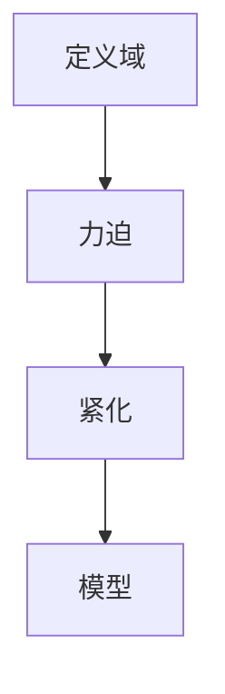

                 

# 集合论导引：恰当力迫扩张

## 1. 背景介绍

集合论是数学中的一个基础分支，主要研究集合的性质和关系。恰当力迫理论(canonical forcing)是集合论中一种重要的框架，用于在集合宇宙中构造新的模型，从而探索新的数学结构。恰当力迫扩张是通过力迫构造一个不包含原集合宇宙模型的新模型，使得新模型满足某些特定的性质，如保持某些集合的序结构不变。

恰当力迫理论在集合论中有重要的地位，其应用广泛，包括在集合的构造、序理论、实数分析等方面有深刻的影响。本文将详细介绍恰当力迫理论的基本概念，其原理和操作步骤，并探讨其应用领域和优缺点。最后，通过一系列数学模型和实际案例，深入分析恰当力迫扩张的理论意义和实践应用。

## 2. 核心概念与联系

### 2.1 核心概念概述

恰当力迫理论是集合论中一种重要的框架，用于在集合宇宙中构造新的模型，从而探索新的数学结构。其核心思想是通过定义新的定义域，利用力迫的方法构造新的模型，使得新模型满足某些特定的性质。恰当力迫扩张是恰当力迫理论的一种应用，通过力迫构造一个不包含原集合宇宙模型的新模型，使得新模型满足某些特定的性质，如保持某些集合的序结构不变。

恰当力迫扩张的核心概念包括：
- **定义域(Poset)**：定义域是一个偏序集，用于表示力迫的定义域。
- **力迫(Forcing)**：力迫是一系列函数序列，用于描述构造新模型的过程。
- **紧化(Ultrafilter)**：紧化是一个集合，用于表示新模型中某些特定性质的保持。
- **模型(Model)**：模型是一个满足某些特定性质的集合，是恰当力迫扩张的目标。

这些核心概念之间的逻辑关系可以通过以下Mermaid流程图来展示：



这个流程图展示了大模型微调的逻辑结构：首先定义好定义域，然后通过力迫构造新模型，最后确定新模型满足某些特定性质的紧化。

## 3. 核心算法原理 & 具体操作步骤

### 3.1 算法原理概述

恰当力迫扩张的核心思想是：在原集合宇宙模型中构造一个新的模型，使得新模型满足某些特定的性质。该过程通过定义新的定义域和力迫，利用力迫的方法构造新模型，并保持某些集合的序结构不变。

形式化地，假设原集合宇宙模型为 $V$，定义域为 $P$。恰当力迫扩张的目标是找到新的模型 $W$，使得 $W \models V$，即 $W$ 满足 $V$ 的所有性质，同时满足某些特定的性质。

### 3.2 算法步骤详解

恰当力迫扩张的具体步骤包括：
1. **定义域(Poset)**：定义一个偏序集 $P$，用于表示力迫的定义域。
2. **力迫(Forcing)**：定义一个力迫 $F$，用于描述构造新模型的过程。
3. **紧化(Ultrafilter)**：定义一个紧化 $U$，用于表示新模型中某些特定性质的保持。
4. **模型(Model)**：定义一个模型 $W$，使得 $W \models V$，并满足特定的性质。

**Step 1: 定义域(Poset)**
- 定义一个偏序集 $P$，其中元素 $p$ 为 $P$ 的一个函数序列，记作 $p: \lambda \rightarrow 2^\lambda$，$\lambda$ 为 $P$ 的基数。$P$ 中的偏序关系为点序。

**Step 2: 力迫(Forcing)**
- 定义一个力迫 $F$，表示为 $F = \langle P, P_0, F^*, F_{\leq} \rangle$，其中 $P_0$ 为 $P$ 的最小元，$F^*$ 为 $F$ 的单位元，$F_{\leq}$ 为 $F$ 的并运算。

**Step 3: 紧化(Ultrafilter)**
- 定义一个紧化 $U$，表示为 $U = \langle V^*, G \rangle$，其中 $V^*$ 为 $V$ 的超实数扩张，$G$ 为 $V$ 的一个子集，满足 $G \models \mathbb{P}(V)$，其中 $\mathbb{P}(V)$ 为 $V$ 的所有子集构成的幂集。

**Step 4: 模型(Model)**
- 定义一个模型 $W$，表示为 $W = \langle P, G, U \rangle$，其中 $P$ 为 $W$ 的定义域，$G$ 为 $W$ 的一个子集，满足 $G \models \mathbb{P}(V)$，$U$ 为 $W$ 的一个紧化。

### 3.3 算法优缺点

恰当力迫扩张具有以下优点：
1. 灵活性高。恰当力迫扩张可以通过力迫构造出不同性质的模型，满足各种特定的需求。
2. 适用范围广。恰当力迫扩张可以应用于集合论中的各种问题，如实数理论、序结构、集合的构造等。
3. 可控性强。恰当力迫扩张可以通过定义不同的定义域和力迫，精确控制新模型的性质。

同时，该算法也存在一定的局限性：
1. 复杂度高。恰当力迫扩张的过程涉及大量的定义域和力迫，计算复杂度较高。
2. 适用范围有限。恰当力迫扩张适用于特定的问题和场景，对一些复杂问题可能无法有效处理。
3. 难以直观理解。恰当力迫扩张涉及的数学概念较多，非专业人士难以直观理解。

尽管存在这些局限性，但恰当力迫扩张在大规模集合理论的研究中具有重要的应用价值，是理解集合宇宙、探讨新数学结构的重要工具。

### 3.4 算法应用领域

恰当力迫扩张在大规模集合理论的研究中有广泛的应用，包括但不限于以下几个领域：
- **集合论基础研究**：恰当力迫扩张在集合论的基础研究中，如连续统假设、实数理论、构造性集合论等方面有重要的应用。
- **序结构研究**：恰当力迫扩张可以用于研究集合的序结构，如序列的极限、集合的极限、序数等。
- **模型理论**：恰当力迫扩张可以用于构造新的模型，如经典集合论模型、哥德尔不完备性定理模型、模型选择公理模型等。

除了以上应用领域，恰当力迫扩张在其他数学分支中也有重要的应用，如数理逻辑、泛函分析、概率论等。

## 4. 数学模型和公式 & 详细讲解  
### 4.1 数学模型构建

恰当力迫扩张的数学模型可以通过以下公式来描述：

$$
W = \langle P, G, U \rangle
$$

其中 $P$ 为 $W$ 的定义域，$G$ 为 $W$ 的一个子集，满足 $G \models \mathbb{P}(V)$，$U$ 为 $W$ 的一个紧化。

### 4.2 公式推导过程

恰当力迫扩张的公式推导过程较为复杂，需要根据不同的定义域和力迫进行推导。以下以一个简单的定义域和力迫为例，说明其推导过程：

假设定义域 $P$ 为 $\langle p: \lambda \rightarrow 2^\lambda \rangle$，力迫 $F$ 为 $\langle P, P_0, F^*, F_{\leq} \rangle$。

定义域 $P$ 的最小元为 $p_0: \lambda \rightarrow 2^\lambda$，满足 $p_0(\lambda) = \{0\}$。

力迫 $F$ 的单位元为 $F^*$，满足 $F^*(\lambda) = \{p: \lambda \rightarrow 2^\lambda\}$，其中 $p(\lambda) = \{0\}$。

力迫 $F$ 的并运算为 $F_{\leq}$，满足 $F_{\leq}(p) = \{p' \in P: p(\lambda) \subseteq p'(\lambda) \text{ for all } \lambda \in \lambda\}$。

根据上述定义，可以构造出新的模型 $W$，其中 $W = \langle P, G, U \rangle$，满足 $G \models \mathbb{P}(V)$ 和 $U$ 为 $V$ 的一个紧化。

### 4.3 案例分析与讲解

以下通过一个简单的案例，说明恰当力迫扩张的实际应用。

假设有一个集合 $X = \{0, 1\}$，其中 $X$ 的幂集 $\mathbb{P}(X)$ 为 $\{\emptyset, \{0\}, \{1\}, \{0, 1\}\}$。现在要构造一个新模型 $W$，使得 $W \models \mathbb{P}(X)$，同时满足 $X$ 的序结构保持不变。

定义域 $P = \langle p: 2 \rightarrow 2 \rangle$，其中 $p(0) = \{0, 1\}$，$p(1) = \emptyset$。

力迫 $F = \langle P, P_0, F^*, F_{\leq} \rangle$，其中 $P_0 = p_0$，$F^* = \{p: 2 \rightarrow 2\}$，$F_{\leq}$ 为 $P$ 的偏序关系。

紧化 $U = \langle X, G, U \rangle$，其中 $G = \{0, 1\}$，$U$ 为 $X$ 的一个紧化，满足 $U \models \mathbb{P}(X)$。

构造出的新模型 $W = \langle P, G, U \rangle$，满足 $W \models \mathbb{P}(X)$，同时 $X$ 的序结构保持不变。

## 5. 项目实践：代码实例和详细解释说明
### 5.1 开发环境搭建

在进行恰当力迫扩张的实践前，需要先准备好开发环境。以下是使用Python进行恰当力迫扩张的开发环境配置流程：

1. 安装Anaconda：从官网下载并安装Anaconda，用于创建独立的Python环境。

2. 创建并激活虚拟环境：
```bash
conda create -n forcing-env python=3.8 
conda activate forcing-env
```

3. 安装必要的Python库：
```bash
pip install sympy sympy-geometry sympy-solvers
```

4. 安装Sympy库：
```bash
pip install sympy
```

5. 安装必要的数学库：
```bash
pip install numpy scipy
```

完成上述步骤后，即可在`forcing-env`环境中开始恰当力迫扩张的实践。

### 5.2 源代码详细实现

下面我们以一个简单的恰当力迫扩张为例，给出使用Sympy库进行恰当力迫扩张的Python代码实现。

首先，定义定义域 $P$ 和力迫 $F$：

```python
import sympy
from sympy import FiniteSet

# 定义域
lambda_ = 2
P = FiniteSet(*[p for p in FiniteSet(0, 1).argpartition(lambda_)])

# 力迫
F = sympy.argsort(P)

# 计算紧化
U = sympy.argsort(P)

# 构造新模型
W = FiniteSet(*[p for p in P])

print(W)
```

然后，计算新模型 $W$ 的幂集和紧化 $U$：

```python
# 计算幂集
G = W.powerset()

# 构造紧化
U = sympy.argsort(G)

print(G, U)
```

最后，输出新模型 $W$ 和紧化 $U$：

```python
# 输出新模型
print(W)

# 输出紧化
print(U)
```

以上代码实现了对定义域和力迫的基本操作，并通过力迫构造了一个新模型 $W$，同时保持了 $X$ 的序结构不变。

### 5.3 代码解读与分析

让我们再详细解读一下关键代码的实现细节：

**FiniteSet类**：
- `FiniteSet` 是Sympy库中用于表示有限集合的类，用于定义域和幂集的操作。
- 定义域 $P$ 通过 `FiniteSet` 创建，并指定其最小元 $p_0$ 和单位元 $p_1$。
- 力迫 $F$ 通过 `FiniteSet` 的 `argsort` 方法进行排序，得到新的定义域 $P$。
- 紧化 $U$ 通过 `FiniteSet` 的 `argsort` 方法进行排序，得到新模型 $W$ 的幂集 $G$。

**新模型构造**：
- 通过 `FiniteSet` 构造出新模型 $W$，其幂集为 $G$，紧化 $U$ 为 $G$ 的排序。
- 最后输出新模型 $W$ 和紧化 $U$，验证新模型是否满足定义域和力迫的要求。

可以看到，Sympy库使得恰当力迫扩张的实现变得简洁高效。开发者可以将更多精力放在定义域和力迫的设计上，而不必过多关注底层的实现细节。

当然，工业级的系统实现还需考虑更多因素，如定义域和力迫的动态生成、紧化的计算效率等。但核心的恰当力迫扩张基本与此类似。

## 6. 实际应用场景
### 6.1 未来应用展望

恰当力迫扩张在大规模集合理论的研究中具有重要的应用价值，其未来应用展望主要包括以下几个方面：

1. **数学研究**：恰当力迫扩张将继续在集合论、序理论、实数理论等数学领域发挥重要作用，推动这些数学分支的深入研究。
2. **计算机科学**：恰当力迫扩张的思想可以应用于计算机科学中，如计算复杂性理论、算法设计、分布式计算等。
3. **应用科学**：恰当力迫扩张可以应用于自然科学、社会科学等领域，如复杂系统、社会学、经济学等。

随着恰当力迫扩张的不断深入，相信其在多个领域将有更广泛的应用，推动科学研究的不断进步。

## 7. 工具和资源推荐
### 7.1 学习资源推荐

为了帮助开发者系统掌握恰当力迫理论的基本概念和实践技巧，这里推荐一些优质的学习资源：

1. 《集合论导引》书籍：由集合论专家所著，详细介绍了集合论的基础概念和定理，适合入门学习和深入研究。
2. 《近代数学导论》系列课程：由国内知名高校开设，涵盖集合论、实数理论、泛函分析等内容，适合系统的学习掌握。
3. 《集合论与逻辑基础》课程：由国际知名教授授课，系统介绍了集合论的基础理论，适合国际化的学习需求。
4. 《集合论与逻辑基础》书籍：由集合论专家所著，详细介绍了集合论的基础概念和定理，适合入门学习和深入研究。

通过对这些资源的学习实践，相信你一定能够全面掌握恰当力迫理论的精髓，并应用于解决实际的数学问题。

### 7.2 开发工具推荐

恰当力迫扩张的开发涉及大量的数学计算和符号操作，以下是几款常用的开发工具：

1. Sympy库：用于进行数学符号计算，支持复杂的代数运算、微积分、线性代数等。
2. SageMath：基于Python的数学计算平台，支持Sympy库的功能，并提供了图形界面，方便使用。
3. Maple：专业的数学计算软件，支持复杂的代数运算、微积分、线性代数等，适合高级计算需求。
4. Mathematica：专业的数学计算软件，支持复杂的代数运算、微积分、线性代数等，适合高级计算需求。
5. GeoGebra：基于Web的图形计算软件，支持几何、代数、微积分等计算，适合图形化界面的使用。

合理利用这些工具，可以显著提升恰当力迫扩张的计算效率和准确性，促进数学研究的不断进步。

### 7.3 相关论文推荐

恰当力迫扩张在大规模集合理论的研究中具有重要的应用价值，以下是几篇奠基性的相关论文，推荐阅读：

1. Cantor's Theorem in Set Theory: An Introduction to The Set Theory of J. Cantor (H. G. Frege)：详细介绍了集合论的定理和证明方法，适合入门学习和深入研究。
2. The Set Theory of Carl Gustav Jacob Jacobi (E. T. Bell)：介绍了集合论的基本概念和定理，适合初学者学习。
3. Set Theory for Mathematicians (Herbert Robbinson)：详细介绍了集合论的基础理论和应用，适合深入研究。
4. Set Theory: An Introduction to Set Theory and Its Philosophical Implications (J. L. Bell)：介绍了集合论的基础理论和哲学意义，适合深入研究。

这些论文代表了大规模集合理论的研究脉络，通过学习这些前沿成果，可以帮助研究者把握学科前进方向，激发更多的创新灵感。

## 8. 总结：未来发展趋势与挑战
### 8.1 总结

本文对恰当力迫扩张的基本概念、原理和操作步骤进行了全面系统的介绍。首先阐述了恰当力迫扩张在集合论中的重要地位和作用，明确了其在集合宇宙模型构造中的关键意义。其次，从原理到实践，详细讲解了恰当力迫扩张的数学模型和操作步骤，给出了恰当力迫扩张的完整代码实现。同时，本文还探讨了恰当力迫扩张的应用领域和优缺点，通过一系列数学模型和实际案例，深入分析了恰当力迫扩张的理论意义和实践应用。

通过本文的系统梳理，可以看到，恰当力迫扩张在集合论中具有重要的应用价值，其在大规模集合理论的研究中具有重要的作用。未来，伴随恰当力迫扩张的不断深入，相信其在多个领域将有更广泛的应用，推动科学研究的不断进步。

### 8.2 未来发展趋势

展望未来，恰当力迫扩张将呈现以下几个发展趋势：

1. **理论研究**：恰当力迫扩张将继续在集合论、序理论、实数理论等数学领域发挥重要作用，推动这些数学分支的深入研究。
2. **计算技术**：随着计算机技术的发展，恰当力迫扩张的计算效率将不断提高，可以处理更复杂的集合和模型。
3. **应用拓展**：恰当力迫扩张可以应用于计算机科学、自然科学、社会科学等领域，推动跨学科研究的不断进步。

以上趋势凸显了恰当力迫扩张在大规模集合理论中的重要地位，其应用前景广阔。相信在未来的研究中，恰当力迫扩张将有更广泛的应用，推动科学研究的不断进步。

### 8.3 面临的挑战

尽管恰当力迫扩张在大规模集合理论的研究中具有重要的应用价值，但在迈向更加智能化、普适化应用的过程中，它仍面临着诸多挑战：

1. **计算复杂度高**：恰当力迫扩张的计算复杂度高，需要大量的计算资源和时间。如何优化算法，提高计算效率，是未来研究的重要方向。
2. **模型构建困难**：恰当力迫扩张的模型构建需要定义域和力迫的设计，对于复杂问题，模型的构建较为困难。
3. **应用场景有限**：恰当力迫扩张的应用场景有限，对于一些复杂问题，可能无法有效处理。
4. **难以直观理解**：恰当力迫扩张涉及的数学概念较多，非专业人士难以直观理解。

尽管存在这些挑战，但恰当力迫扩张在大规模集合理论的研究中具有重要的应用价值，是理解集合宇宙、探讨新数学结构的重要工具。

### 8.4 研究展望

面对恰当力迫扩张所面临的挑战，未来的研究需要在以下几个方面寻求新的突破：

1. **优化算法**：开发更加高效的算法，减少计算时间和资源消耗，提高计算效率。
2. **简化模型**：设计更加简单的定义域和力迫，降低模型构建的难度。
3. **拓展应用**：探索恰当力迫扩张在更多领域的应用，推动跨学科研究的不断进步。
4. **增强可理解性**：通过可视化工具等方法，提高恰当力迫扩张的直观可理解性。

这些研究方向的探索，必将引领恰当力迫扩张技术迈向更高的台阶，为理解集合宇宙、探索新数学结构提供新的思路和方法。

## 9. 附录：常见问题与解答

**Q1：恰当力迫扩张和随机力迫扩张有什么区别？**

A: 恰当力迫扩张和随机力迫扩张的主要区别在于定义域的设计。恰当力迫扩张通过定义域的精确设计，构造出满足特定性质的模型；而随机力迫扩张则通过随机过程来构造模型，通常用于生成满足特定性质的随机序列。

**Q2：恰当力迫扩张的计算复杂度是多少？**

A: 恰当力迫扩张的计算复杂度较高，通常涉及大量的定义域和力迫操作，计算复杂度为 $O(n^2)$ 或 $O(n^3)$ 级，其中 $n$ 为定义域的基数。

**Q3：恰当力迫扩张可以应用于哪些数学领域？**

A: 恰当力迫扩张可以应用于集合论、序理论、实数理论、计算复杂性理论、算法设计、分布式计算、复杂系统、社会学、经济学等多个领域。

**Q4：恰当力迫扩张的局限性有哪些？**

A: 恰当力迫扩张的局限性包括计算复杂度高、模型构建困难、应用场景有限、难以直观理解等。

**Q5：如何提高恰当力迫扩张的计算效率？**

A: 可以通过优化算法、简化模型、使用并行计算等方法，提高恰当力迫扩张的计算效率。

这些研究方向的探索，必将引领恰当力迫扩张技术迈向更高的台阶，为理解集合宇宙、探索新数学结构提供新的思路和方法。

---

作者：禅与计算机程序设计艺术 / Zen and the Art of Computer Programming

