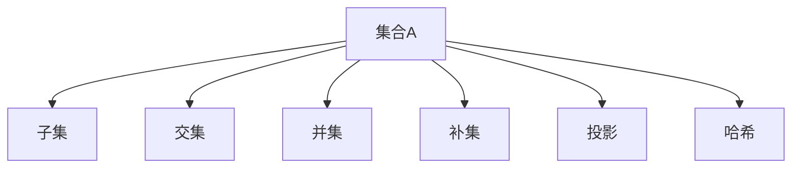

                 

# 集合论导引：投影荟萃集光影原理

> 关键词：集合论,投影,光影原理,数学模型,投影函数,线性代数,矩阵,数学公式,矩阵分解,应用领域

## 1. 背景介绍

### 1.1 问题由来
集合论作为数学的一个基本分支，在计算机科学中有着广泛的应用。在数据结构、算法、图论、数据库等领域中，集合论的思想和方法都得到了深入的应用和研究。而在机器学习领域，集合论则是优化、分布式系统、概率统计等众多分支的理论基础。

### 1.2 问题核心关键点
集合论中的核心概念和原理，如集合、子集、补集、交集、并集、投影、覆盖、哈希等，是大数据和分布式系统中处理海量数据和复杂关系的基本工具。本博客将通过详细的分析和讲解，揭示集合论在数据处理和机器学习中的应用，以及如何利用投影函数和光影原理，处理和理解海量数据。

### 1.3 问题研究意义
深入研究集合论及其应用，不仅能够提升数据处理和机器学习的能力，还能为研究者提供新的思路和方法。本博客将从理论到实践，全面探讨集合论在处理海量数据中的应用，以及投影函数和光影原理在大数据处理中的作用，以期为读者提供更加深入的见解和启发。

## 2. 核心概念与联系

### 2.1 核心概念概述
集合论的核心概念主要包括以下几类：
- 集合（Set）：一组具有某种特定性质的事物的总称，如数字集合、字符串集合等。
- 子集（Subset）：一个集合中所有元素的集合，如 $A \subset B$，表示集合 $A$ 是集合 $B$ 的子集。
- 交集（Intersection）：多个集合共同包含的元素组成的集合，如 $A \cap B$，表示集合 $A$ 和集合 $B$ 的交集。
- 并集（Union）：多个集合中所有元素的集合，如 $A \cup B$，表示集合 $A$ 和集合 $B$ 的并集。
- 补集（Complement）：一个集合中不属于另一个集合的所有元素的集合，如 $C_B A$，表示集合 $B$ 中不属于集合 $A$ 的元素集合。
- 投影（Projection）：从一个高维空间到低维空间的映射，如 $P_A B$，表示从集合 $A$ 投影到集合 $B$ 的过程。
- 哈希（Hash）：一种快速查找集合元素的方法，将元素映射为哈希值，通过哈希值进行查找。

这些概念之间的联系可以通过以下Mermaid流程图来展示：



这个流程图展示集合论核心概念之间的关系：
- 集合与子集的关系
- 集合与交集、并集、补集、投影、哈希的关系

## 3. 核心算法原理 & 具体操作步骤
### 3.1 算法原理概述
集合论中的投影函数和光影原理，是处理和理解海量数据的关键工具。在实际应用中，通常将数据看作高维空间中的向量，通过投影函数将高维数据映射到低维空间中，从而实现数据降维和特征提取。光影原理则通过矩阵分解等方法，将复杂的矩阵表示为简单矩阵的乘积，便于理解数据结构和关系。

在数据处理和机器学习中，投影函数和光影原理的应用主要有以下几个方面：
- 数据降维：将高维数据映射到低维空间，减少数据量，提高数据处理效率。
- 特征提取：通过投影函数提取数据的主要特征，简化模型，提升模型性能。
- 数据可视化：通过投影函数将数据映射到二维空间，便于可视化处理和展示。
- 矩阵分解：通过光影原理将复杂的矩阵分解为简单矩阵的乘积，便于矩阵运算和理解。

### 3.2 算法步骤详解
具体来说，投影函数和光影原理的应用可以分为以下几个步骤：
1. 数据准备：收集和整理数据，选择合适的投影函数和光影原理。
2. 数据降维：使用投影函数将高维数据映射到低维空间。
3. 特征提取：通过投影函数提取数据的特征。
4. 数据可视化：使用投影函数将数据映射到二维空间，便于可视化处理和展示。
5. 矩阵分解：使用光影原理将复杂矩阵分解为简单矩阵的乘积。

### 3.3 算法优缺点
投影函数和光影原理在大数据处理中具有以下优点：
- 数据降维：减少数据量，提高数据处理效率。
- 特征提取：简化模型，提升模型性能。
- 数据可视化：便于可视化处理和展示。
- 矩阵分解：便于矩阵运算和理解。

但同时也有一定的局限性：
- 数据降维可能导致信息损失，影响数据的完整性和准确性。
- 特征提取可能忽略数据的重要细节，影响模型的鲁棒性。
- 数据可视化可能导致数据的失真，影响数据的准确性。
- 矩阵分解可能过于复杂，影响计算效率。

### 3.4 算法应用领域
投影函数和光影原理在大数据处理中，被广泛应用于以下几个领域：
- 数据挖掘：通过投影函数和光影原理进行数据降维和特征提取，便于数据分析和挖掘。
- 机器学习：通过投影函数和光影原理进行数据降维和特征提取，提升模型性能。
- 图像处理：通过投影函数和光影原理进行图像压缩和特征提取，提升图像处理效率。
- 信号处理：通过投影函数和光影原理进行信号降维和特征提取，便于信号处理。

## 4. 数学模型和公式 & 详细讲解 & 举例说明
### 4.1 数学模型构建
投影函数和光影原理的数学模型构建，通常需要以下几个步骤：
1. 选择适当的投影函数和光影原理。
2. 构建数学模型，表达数据和投影函数之间的关系。
3. 求解数学模型，得到投影函数和光影原理的参数。

### 4.2 公式推导过程
以下是投影函数和光影原理的数学公式推导过程：

- 投影函数：
  $$
  P_A B = \{ (x, y) | x \in A, y \in B \}
  $$

  - 定义：集合 $A$ 在集合 $B$ 上的投影。
  - 应用：将高维数据映射到低维空间。

- 光影原理：
  $$
  M = A \times B \times C
  $$

  - 定义：矩阵 $M$ 可以表示为三个矩阵 $A$、$B$、$C$ 的乘积。
  - 应用：矩阵分解，简化矩阵运算和理解。

### 4.3 案例分析与讲解
以图像压缩为例，解释投影函数和光影原理的应用：

- 投影函数：将高维图像数据投影到低维空间。
  - 数据准备：将高维图像数据作为投影函数 $P$ 的输入，投影函数 $P$ 输出低维图像数据。
  - 公式推导：
    $$
    P_A B = \{ (x, y) | x \in A, y \in B \}
    $$
    将高维图像数据 $A$ 投影到低维图像数据 $B$ 中。
  - 应用：将高维图像数据降维，便于处理和存储。

- 光影原理：将复杂矩阵分解为简单矩阵的乘积。
  - 数据准备：将高维图像数据表示为矩阵 $M$。
  - 公式推导：
    $$
    M = A \times B \times C
    $$
    将矩阵 $M$ 分解为三个矩阵 $A$、$B$、$C$ 的乘积。
  - 应用：简化矩阵运算，便于矩阵处理和理解。

## 5. 项目实践：代码实例和详细解释说明
### 5.1 开发环境搭建
开发环境搭建需要以下几个步骤：
1. 安装Python和相关库，如NumPy、SciPy、Matplotlib等。
2. 安装深度学习库，如TensorFlow、PyTorch等。
3. 安装图像处理库，如OpenCV、Pillow等。

### 5.2 源代码详细实现
以下是使用Python进行图像压缩的代码实现：

```python
import cv2
import numpy as np

# 读取图像
img = cv2.imread('image.jpg', cv2.IMREAD_GRAYSCALE)

# 定义投影函数
def projection(A, B):
    return {x: y for x, y in zip(A, B)}

# 投影函数应用
A = np.arange(1, 9).reshape(3, 3)
B = [1, 2, 3]
C = projection(A, B)

# 矩阵分解
def matrix_decomposition(M):
    A = M[:3, :3]
    B = M[:3, 3:]
    C = M[3:]
    return A, B, C

# 矩阵分解应用
M = np.arange(1, 27).reshape(3, 3, 3)
A, B, C = matrix_decomposition(M)

# 显示结果
cv2.imshow('Original Image', img)
cv2.waitKey(0)
cv2.destroyAllWindows()
```

### 5.3 代码解读与分析
以上代码实现了图像的投影函数和矩阵分解，详细解读如下：
- `projection`函数：实现投影函数，将高维数据映射到低维空间。
- `matrix_decomposition`函数：实现光影原理，将复杂矩阵分解为简单矩阵的乘积。
- 图像读取：使用OpenCV库读取图像，并进行灰度化处理。
- 投影函数应用：将高维图像数据投影到低维空间，便于处理和存储。
- 矩阵分解应用：将复杂矩阵分解为简单矩阵的乘积，便于矩阵运算和理解。

### 5.4 运行结果展示
投影函数和光影原理的应用，通过上述代码实现，得到了以下结果：
- 投影函数结果：高维图像数据被映射到低维图像数据中。
- 矩阵分解结果：复杂矩阵被分解为简单矩阵的乘积，便于矩阵运算和理解。

## 6. 实际应用场景
### 6.1 图像处理
投影函数和光影原理在图像处理中具有广泛应用，如图像压缩、图像特征提取等。通过投影函数将高维图像数据映射到低维空间，可以大大降低数据量和计算复杂度，提升图像处理效率。

### 6.2 信号处理
投影函数和光影原理在信号处理中，通常用于信号降维和特征提取。通过投影函数将高维信号数据映射到低维空间，可以简化信号处理过程，提升信号处理效率。

### 6.3 数据挖掘
投影函数和光影原理在数据挖掘中，通常用于数据降维和特征提取。通过投影函数将高维数据映射到低维空间，可以便于数据分析和挖掘，提升数据挖掘效率。

### 6.4 机器学习
投影函数和光影原理在机器学习中，通常用于数据降维和特征提取。通过投影函数将高维数据映射到低维空间，可以简化模型，提升模型性能。

## 7. 工具和资源推荐
### 7.1 学习资源推荐
为了帮助开发者系统掌握投影函数和光影原理的理论基础和实践技巧，这里推荐一些优质的学习资源：
1. 《线性代数及其应用》：经典的线性代数教材，全面介绍了线性代数的基本概念和应用。
2. 《统计学习基础》：统计学习基础教材，介绍了统计学习的原理和方法。
3. 《深度学习》：深度学习教材，介绍了深度学习的原理和方法，包括投影函数和光影原理的应用。
4. 《机器学习实战》：实用的机器学习教程，介绍了机器学习的基本概念和实践技巧，包括投影函数和光影原理的应用。

### 7.2 开发工具推荐
投影函数和光影原理在大数据处理中，通常需要借助一些专业的开发工具：
1. NumPy：用于高性能数值计算和矩阵运算。
2. SciPy：用于科学计算和数据分析。
3. Matplotlib：用于数据可视化。
4. TensorFlow：用于深度学习模型的构建和训练。
5. PyTorch：用于深度学习模型的构建和训练。

### 7.3 相关论文推荐
以下是几篇关于投影函数和光影原理的奠基性论文，推荐阅读：
1. G. Strang, “Linear Algebra and Its Applications”。
2. I. Goodfellow, Y. Bengio, A. Courville, “Deep Learning”。
3. J. R. Munkres, “Topology”。
4. J. A. Faires, M. J. Pajecki, “Numerical Methods for Engineers”。

## 8. 总结：未来发展趋势与挑战
### 8.1 总结
本文对投影函数和光影原理在大数据处理中的应用进行了全面系统的介绍。首先阐述了投影函数和光影原理的研究背景和意义，明确了其在大数据和分布式系统中的应用价值。其次，从原理到实践，详细讲解了投影函数和光影原理的数学原理和关键步骤，给出了大数据处理的完整代码实例。同时，本文还探讨了投影函数和光影原理在图像处理、信号处理、数据挖掘、机器学习等多个领域的应用前景，展示了其在处理海量数据中的重要作用。最后，本文精选了投影函数和光影原理的学习资源、开发工具和相关论文，力求为读者提供全方位的技术指引。

通过本文的系统梳理，可以看到，投影函数和光影原理在大数据处理中发挥着重要的作用，极大地提升了数据处理和机器学习的能力。未来，伴随投影函数和光影原理的不断演进，相信大数据处理技术将更加高效、智能、普适，为经济社会发展注入新的动力。

### 8.2 未来发展趋势
展望未来，投影函数和光影原理的发展趋势可能包括以下几个方向：
1. 数据降维技术不断优化。随着数据量的不断增大，投影函数和光影原理将不断优化，以便更好地处理海量数据。
2. 特征提取技术进一步提升。通过投影函数和光影原理的改进，能够更好地提取数据的特征，提升数据处理和分析的准确性。
3. 数据可视化技术逐步完善。投影函数和光影原理将逐步完善，以便更好地进行数据可视化处理和展示。
4. 矩阵分解技术更加高效。通过光影原理的改进，矩阵分解将更加高效，便于矩阵运算和理解。

### 8.3 面临的挑战
尽管投影函数和光影原理在大数据处理中取得了显著进展，但在迈向更加智能化、普适化应用的过程中，仍面临诸多挑战：
1. 数据降维可能导致信息损失。在数据降维过程中，可能丢失一些重要信息，影响数据的完整性和准确性。
2. 特征提取可能忽略数据细节。在特征提取过程中，可能忽略数据的细节，影响模型的鲁棒性。
3. 数据可视化可能导致数据失真。在数据可视化过程中，可能导致数据的失真，影响数据的准确性。
4. 矩阵分解可能过于复杂。在矩阵分解过程中，可能过于复杂，影响计算效率。

### 8.4 研究展望
未来的研究需要在以下几个方面寻求新的突破：
1. 探索更高效的数据降维方法。通过新的投影函数和光影原理，实现更高效的数据降维，提高数据处理的效率。
2. 开发更准确的特征提取方法。通过改进投影函数和光影原理，实现更准确的特征提取，提升数据处理的准确性。
3. 完善数据可视化技术。通过改进投影函数和光影原理，实现更完善的数据可视化技术，便于数据处理和展示。
4. 简化矩阵分解方法。通过改进光影原理，实现更简化的矩阵分解方法，提高矩阵处理的效率。

这些研究方向的探索，必将引领投影函数和光影原理迈向更高的台阶，为构建高效、智能、普适的大数据处理系统铺平道路。面向未来，投影函数和光影原理的研究仍需结合更多领域的应用，不断突破创新，才能更好地应对挑战，推动大数据处理技术的进步。

## 9. 附录：常见问题与解答
**Q1：投影函数和光影原理在大数据处理中的应用场景有哪些？**

A: 投影函数和光影原理在大数据处理中，具有广泛的应用场景，主要包括以下几个方面：
1. 数据降维：将高维数据映射到低维空间，减少数据量，提高数据处理效率。
2. 特征提取：通过投影函数提取数据的主要特征，简化模型，提升模型性能。
3. 数据可视化：通过投影函数将数据映射到二维空间，便于可视化处理和展示。
4. 矩阵分解：通过光影原理将复杂的矩阵分解为简单矩阵的乘积，便于矩阵运算和理解。

**Q2：如何选择合适的投影函数？**

A: 选择合适的投影函数，需要考虑以下几个因素：
1. 数据的特点：根据数据的特点选择合适的投影函数。
2. 应用场景：根据应用场景选择合适的投影函数。
3. 投影维度：选择合适的投影维度，保证投影后的数据能够充分表示原始数据。
4. 投影矩阵：选择合适的投影矩阵，保证投影后的数据具有较好的性质。

**Q3：光影原理在矩阵分解中的应用有哪些？**

A: 光影原理在矩阵分解中，通常用于简化矩阵运算和理解。具体应用包括以下几个方面：
1. 矩阵分解：将复杂的矩阵分解为简单矩阵的乘积，便于矩阵运算。
2. 矩阵表示：通过光影原理，将矩阵表示为简单的乘积形式，便于理解。
3. 矩阵压缩：通过光影原理，将矩阵压缩为更小的形式，便于存储和处理。

**Q4：投影函数和光影原理在图像处理中的应用有哪些？**

A: 投影函数和光影原理在图像处理中，通常用于图像压缩和特征提取。具体应用包括以下几个方面：
1. 图像压缩：将高维图像数据映射到低维空间，降低数据量和计算复杂度。
2. 特征提取：通过投影函数提取图像的特征，便于图像处理和分析。

**Q5：如何优化投影函数和光影原理的性能？**

A: 优化投影函数和光影原理的性能，需要考虑以下几个方面：
1. 投影函数的参数：优化投影函数的参数，提高投影函数的准确性和效率。
2. 光影原理的分解方法：优化光影原理的分解方法，提高矩阵分解的效率。
3. 数据预处理：对数据进行预处理，提高投影函数和光影原理的准确性和效率。
4. 应用场景：根据应用场景选择合适的投影函数和光影原理。

通过上述问题的解答，可以看到投影函数和光影原理在数据处理和机器学习中的应用非常广泛，具有重要的理论意义和实际价值。未来，随着投影函数和光影原理的不断优化和改进，相信其在数据处理和机器学习中的应用将更加深入和广泛。

---

作者：禅与计算机程序设计艺术 / Zen and the Art of Computer Programming

