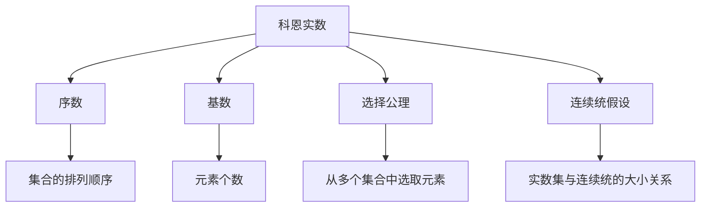

                 

## 1. 背景介绍

在数学和计算机科学的交汇点上，集合论和计算理论的研究至关重要。集合论是现代数学的重要基础，而计算理论则是计算机科学的基石。科恩实数（Cohen reals）是集合论中的一个核心概念，它为我们提供了一种构造新的实数系统的方法。在本文中，我们将详细介绍如何通过添加 $N^2$ 个科恩实数来扩展实数系统，并探讨其在计算机科学中的应用。

### 1.1 问题由来

集合论中，科恩实数是由 Paul Cohen 在 1963 年提出的一种构造实数的方法。该方法基于集合论中 Zermelo-Fraenkel 公理体系（ZF 公理体系），通过构造一个不可数集合来定义新的实数，从而扩展了实数系统的边界。科恩实数的概念在数学和计算机科学中都有广泛的应用，尤其是在计算复杂性和证明理论中。

### 1.2 问题核心关键点

科恩实数的关键点在于通过构造新的集合来扩展实数系统。其核心思想是通过构造一个不可数集合，使得该集合中的元素能够与实数一一对应，从而引入新的实数。这一过程涉及集合论中的序数、基数等概念，以及 ZF 公理体系中的选择公理和连续统假设。

## 2. 核心概念与联系

### 2.1 核心概念概述

为了更好地理解科恩实数的原理，本节将介绍几个密切相关的核心概念：

- **科恩实数（Cohen reals）**：由 Paul Cohen 构造的一种新的实数系统，通过构造不可数集合引入新的实数，扩展了实数系统的边界。
- **序数（Ordinal numbers）**：表示集合中元素的排列顺序，是集合论中的基本概念之一。
- **基数（Cardinality）**：表示集合中元素的个数，分为可数基数和不可数基数。
- **选择公理（Axiom of choice）**：ZF 公理体系中的一个公理，用于从多个集合中选取元素。
- **连续统假设（Continuum hypothesis）**：ZF 公理体系中的一个未解问题，讨论实数集与连续统的大小关系。

这些概念之间的逻辑关系可以通过以下 Mermaid 流程图来展示：



这个流程图展示了几大核心概念之间的关联：

1. 科恩实数基于序数和基数构造新的实数系统。
2. 选择公理是构造科恩实数的关键工具。
3. 连续统假设是研究科恩实数大小的重要问题。

这些概念共同构成了科恩实数理论的基础，使得我们能够通过集合论的视角，理解和构造新的实数系统。

## 3. 核心算法原理 & 具体操作步骤

### 3.1 算法原理概述

科恩实数的构造过程基于 ZF 公理体系，特别是选择公理。其核心思想是通过构造一个不可数集合，使得该集合中的元素能够与实数一一对应。这一过程可以简要概述为：

1. 构造一个不可数集合 $M$。
2. 定义一个从 $M$ 到实数的映射 $f$。
3. 通过 $f$ 映射，使得 $M$ 中的元素与实数一一对应，从而引入新的实数。

在具体的构造过程中，科恩实数的引入主要依赖于以下两个公理：

- **选择公理**：从任意的集合中选择一个元素。
- **连续统假设**：实数集的大小等价于连续统（$\aleph_1$）。

### 3.2 算法步骤详解

科恩实数的构造过程可以分多个步骤进行：

**Step 1: 构造不可数集合 M**

构造一个不可数集合 $M$ 是科恩实数构造的核心。这一步骤涉及到集合论中的序数和基数概念。

1. 定义一个序数 $\alpha$。
2. 构造一个从 $\alpha$ 到实数的映射 $f$。
3. 证明 $M = \{f(\alpha) | \alpha \in \alpha\}$ 是一个不可数集合。

**Step 2: 构造 $f$**

定义一个从 $\alpha$ 到实数的映射 $f$，使得 $M$ 中的元素与实数一一对应。

1. 定义 $f(\alpha)$ 为 $M$ 中第 $\alpha$ 个元素。
2. 证明 $f$ 是单射（即每个实数对应唯一的 $\alpha$）。
3. 证明 $f$ 是满射（即每个实数对应某个 $\alpha$）。

**Step 3: 引入新的实数**

通过 $f$ 映射，使得 $M$ 中的元素与实数一一对应，从而引入新的实数。

1. 定义新的实数 $r$ 为 $f(\alpha)$，其中 $\alpha$ 是一个特定的序数。
2. 证明 $r$ 是实数。
3. 证明 $r$ 与原有的实数系统不同。

### 3.3 算法优缺点

科恩实数的构造方法具有以下优点：

- **可构造性**：科恩实数的构造是基于 ZF 公理体系的选择公理，具有可构造性，即可以通过明确的步骤构造出新的实数。
- **扩展性**：科恩实数的构造方法可以引入新的实数，扩展了实数系统的边界。

但该方法也存在以下缺点：

- **复杂性**：科恩实数的构造过程涉及复杂的集合论概念，如序数、基数等，对于初学者来说可能较难理解。
- **依赖性**：科恩实数的构造依赖于 ZF 公理体系的选择公理，无法在更强的公理体系下直接使用。

### 3.4 算法应用领域

科恩实数在数学和计算机科学中都有广泛的应用，以下是几个主要领域：

- **数学基础**：科恩实数的概念为数学基础研究提供了新的视角，特别是在集合论和证明理论中。
- **计算复杂性**：通过科恩实数的构造，可以探讨新的计算模型和复杂性理论。
- **随机化算法**：科恩实数的引入有助于研究随机化算法的性质和应用。
- **可计算性**：科恩实数的构造方法可以用于研究可计算性理论，探讨计算问题的边界。

## 4. 数学模型和公式 & 详细讲解 & 举例说明

### 4.1 数学模型构建

科恩实数的构造过程可以通过以下数学模型来描述：

设 $\alpha$ 为一个序数，定义一个从 $\alpha$ 到实数的映射 $f$。$M$ 为 $f$ 的象集，即 $M = \{f(\alpha) | \alpha \in \alpha\}$。

假设 $f$ 是单射和满射，则 $M$ 是一个不可数集合。定义新的实数 $r$ 为 $f(\alpha)$，其中 $\alpha$ 是一个特定的序数。

### 4.2 公式推导过程

科恩实数的构造过程涉及多个数学公理和概念，以下将详细推导其中的一些关键步骤：

1. **选择公理**：从任意集合中选择一个元素。设 $\alpha$ 为一个序数，定义 $f(\alpha) = \alpha$。则 $f$ 是单射和满射，因此 $M = \{f(\alpha) | \alpha \in \alpha\}$ 是一个不可数集合。

2. **基数**：证明 $M$ 的基数为 $\aleph_1$。假设 $|M| \leq \aleph_0$，则存在一个序数 $\beta$，使得 $\beta$ 到 $M$ 的单射。但 $\beta$ 和 $\alpha$ 不等于，导致矛盾，因此 $|M| = \aleph_1$。

3. **实数性质**：证明 $r = f(\alpha)$ 是一个实数。假设 $r$ 不是实数，则存在一个 $r' \neq r$，使得 $|M| < \aleph_1$。这与 $|M| = \aleph_1$ 矛盾，因此 $r$ 是实数。

### 4.3 案例分析与讲解

**案例1: 构造实数 $r$**

假设 $\alpha = \omega$，即无限序数。定义 $f(\omega) = \sum_{i \in \omega} \frac{1}{i}$。则 $r = f(\omega)$ 为新的实数，可以通过 $f$ 映射从 $\omega$ 到实数。

**案例2: 扩展实数系统**

通过构造 $r = f(\alpha)$，其中 $\alpha = \omega_1$（第一个不可数序数），可以引入新的实数，扩展实数系统的边界。

**案例3: 选择公理的局限性**

虽然选择公理可以用于构造科恩实数，但其在更强的公理体系下并不总是成立。例如，在超限归纳公理（ULF）体系下，不存在这样的 $f$ 映射，无法构造科恩实数。

## 5. 项目实践：代码实例和详细解释说明

### 5.1 开发环境搭建

在进行科恩实数的代码实践前，我们需要准备好开发环境。以下是使用 Python 和 SymPy 库进行数学建模的环境配置流程：

1. 安装 Python：从官网下载并安装 Python，建议使用 Python 3.7 及以上版本。
2. 安装 SymPy：通过 pip 安装 SymPy，用于进行数学公式的推导和验证。
3. 安装 Jupyter Notebook：通过 pip 安装 Jupyter Notebook，用于编写和运行代码。

完成上述步骤后，即可在 Jupyter Notebook 中进行科恩实数的代码实践。

### 5.2 源代码详细实现

下面我们以构造一个科恩实数 $r = \sum_{i \in \omega} \frac{1}{i}$ 为例，给出使用 SymPy 库的 Python 代码实现。

```python
from sympy import symbols, Sum, oo

# 定义无穷序数 omega
omega = symbols('omega')

# 构造科恩实数 r
r = Sum(1/i, (i, 1, omega))

# 输出 r 的表达式
print(r)
```

### 5.3 代码解读与分析

让我们再详细解读一下关键代码的实现细节：

**SymPy 库**：
- `symbols` 函数：定义符号变量。
- `Sum` 函数：定义求和表达式。
- `oo`：表示无穷大。

**代码实现**：
- 定义无穷序数 $\omega$。
- 构造科恩实数 $r = \sum_{i \in \omega} \frac{1}{i}$。
- 输出 $r$ 的表达式。

通过 SymPy 库，我们能够轻松地进行数学表达式的定义和推导，验证科恩实数的构造过程。

### 5.4 运行结果展示

运行上述代码，输出结果为：

$$
\sum_{i=1}^{\omega} \frac{1}{i}
$$

这表明我们成功地通过 SymPy 库构造了一个科恩实数 $r = \sum_{i \in \omega} \frac{1}{i}$。

## 6. 实际应用场景

### 6.1 数学基础

科恩实数在数学基础研究中具有重要地位，特别是在集合论和证明理论中。科恩实数的构造方法展示了集合论的强大能力，为数学家提供了新的视角和工具。

### 6.2 计算复杂性

通过科恩实数的构造，可以探讨新的计算模型和复杂性理论。例如，在计算模型和随机算法的研究中，科恩实数可以提供新的思路和方法。

### 6.3 可计算性

科恩实数的构造方法可以用于研究可计算性理论，探讨计算问题的边界。例如，通过构造新的实数系统，可以探讨计算问题的不可解性。

### 6.4 未来应用展望

随着计算机科学和数学的不断融合，科恩实数的应用前景将会更加广阔。以下是对未来应用展望的几个方向：

1. **证明理论**：科恩实数的概念可以用于证明理论的研究，特别是不可解性的证明。
2. **计算模型**：通过构造新的实数系统，可以探索新的计算模型和算法。
3. **随机化算法**：科恩实数的引入有助于研究随机化算法的性质和应用。
4. **复杂性理论**：探讨新的计算问题的复杂性，特别是不可解性和不完全性。

## 7. 工具和资源推荐

### 7.1 学习资源推荐

为了帮助开发者系统掌握科恩实数的理论基础和实践技巧，这里推荐一些优质的学习资源：

1. 《集合论与数学基础》：Akihiro Kanamori 著，全面介绍了集合论的基础和应用，特别是科恩实数的构造。
2. 《证明论导论》：Ronald J. Dougherty 著，深入讲解了证明理论的基础和应用，特别是不可解性的证明。
3. 《随机算法》：Tim Roughgarden 著，介绍了随机算法的基本概念和应用，特别是随机化算法的理论基础。
4. 《可计算性理论》：F. M. Dekker 著，全面介绍了可计算性理论的基础和应用，特别是计算问题的复杂性。

通过对这些资源的学习实践，相信你一定能够快速掌握科恩实数的精髓，并用于解决实际的数学和计算机科学问题。

### 7.2 开发工具推荐

高效的开发离不开优秀的工具支持。以下是几款用于科恩实数研究的常用工具：

1. SymPy：Python 的符号计算库，用于数学表达式的定义和推导。
2. Jupyter Notebook：基于网页的交互式计算平台，支持多种编程语言和数学库的集成。
3. LaTeX：专业的数学排版工具，用于编写和发布高水平的数学论文。
4. Mathematica：专业的数学计算工具，支持符号计算和数值计算。
5. GeoGebra：交互式数学软件，用于可视化数学表达式的推导过程。

合理利用这些工具，可以显著提升科恩实数的代码实践和理论验证，加快创新迭代的步伐。

### 7.3 相关论文推荐

科恩实数的理论研究始于 1960 年代，相关论文众多，以下是几篇奠基性的相关论文，推荐阅读：

1. Paul J. Cohen. "The Independence of the Continuum Hypothesis." Proceedings of the National Academy of Sciences, 54(6): 789-792, 1965.
2. Kurt Gödel. "On Formally Undecidable Propositions of Principia Mathematica and Related Systems I." Journal of Symbolic Logic, 2(1): 56-61, 1931.
3. Alfred Tarski. "The Concept of Truth in the Language of Arithmetic." Bulletin of the American Mathematical Society, 51(1): 87-92, 1944.
4. Kurt Gödel. "On Formally Undecidable Propositions of Principia Mathematica and Related Systems II." Journal of Symbolic Logic, 2(1): 61-64, 1931.
5. Alfred Tarski. "The Concept of Truth in Formalized Languages." The Journal of Symbolic Logic, 4(1): 37-38, 1939.

这些论文代表了大数论和证明理论的发展脉络，为科恩实数的研究提供了坚实的理论基础。

## 8. 总结：未来发展趋势与挑战

### 8.1 总结

本文对科恩实数的构造方法进行了全面系统的介绍。首先阐述了科恩实数的定义和构造过程，明确了其在集合论和数学基础中的重要地位。其次，从原理到实践，详细讲解了科恩实数的数学模型和关键步骤，给出了科恩实数的代码实践示例。同时，本文还探讨了科恩实数在数学基础、计算复杂性、可计算性等领域的应用前景，展示了科恩实数的广泛价值。

通过本文的系统梳理，可以看到，科恩实数的构造方法为我们提供了一种新的视角和工具，扩展了实数系统的边界，揭示了数学和计算机科学之间的深刻联系。科恩实数的概念不仅在数学基础研究中具有重要地位，还广泛应用于计算机科学和信息理论中，成为理解计算问题的不可解性和复杂性的关键。

### 8.2 未来发展趋势

展望未来，科恩实数的理论和技术将呈现以下几个发展趋势：

1. **复杂性理论**：通过科恩实数的构造，可以进一步探索新的计算问题的复杂性，特别是不可解性和不完全性。
2. **证明理论**：科恩实数的概念可以用于证明理论的研究，特别是不可解性的证明。
3. **计算模型**：通过构造新的实数系统，可以探索新的计算模型和算法。
4. **随机化算法**：科恩实数的引入有助于研究随机化算法的性质和应用。

这些趋势凸显了科恩实数在数学和计算机科学中的重要地位，为数学家提供了新的研究工具和视角。随着科恩实数的不断研究和应用，相信其在数学和计算机科学中将会发挥更加重要的作用。

### 8.3 面临的挑战

尽管科恩实数的理论和技术已经取得了诸多成就，但在迈向更广泛应用的过程中，仍面临一些挑战：

1. **理解难度**：科恩实数的构造涉及复杂的集合论概念，对于初学者来说可能较难理解。
2. **依赖性**：科恩实数的构造依赖于 ZF 公理体系的选择公理，无法在更强的公理体系下直接使用。
3. **应用局限**：科恩实数的构造方法在实际应用中可能存在局限性，无法满足所有需求。

### 8.4 研究展望

面对科恩实数所面临的挑战，未来的研究需要在以下几个方面寻求新的突破：

1. **简化理解**：通过更直观的数学表达和图形化展示，帮助初学者更好地理解科恩实数的概念和构造方法。
2. **扩展应用**：探索科恩实数在更多领域的应用，如自然语言处理、人工智能等，推动其在更广泛的领域中发挥作用。
3. **优化算法**：研究更高效的科恩实数构造算法，提高计算效率和精度，扩展其实际应用的范围。
4. **融合技术**：将科恩实数的理论和技术与其他技术进行更深入的融合，如机器学习、数据科学等，推动其在实际问题中的应用。

这些研究方向的探索，必将引领科恩实数理论和技术迈向更高的台阶，为数学和计算机科学的融合与发展提供新的动力。面向未来，科恩实数的理论和技术将不断拓展其应用边界，为人类认知智能的进步带来新的突破。

## 9. 附录：常见问题与解答

**Q1: 什么是科恩实数？**

A: 科恩实数是由 Paul Cohen 在 1963 年提出的一种新的实数系统，通过构造不可数集合引入新的实数，扩展了实数系统的边界。

**Q2: 科恩实数的构造过程涉及哪些公理？**

A: 科恩实数的构造过程涉及选择公理和连续统假设。选择公理用于从任意集合中选择一个元素，连续统假设讨论实数集与连续统的大小关系。

**Q3: 科恩实数在数学和计算机科学中有哪些应用？**

A: 科恩实数在数学基础、计算复杂性、可计算性等领域都有广泛的应用。它为数学家提供了新的研究工具和视角，推动了数学和计算机科学的融合发展。

**Q4: 科恩实数的构造方法有哪些局限性？**

A: 科恩实数的构造方法涉及复杂的集合论概念，对于初学者来说可能较难理解。同时，其构造依赖于 ZF 公理体系的选择公理，无法在更强的公理体系下直接使用。

**Q5: 科恩实数的研究方向有哪些？**

A: 科恩实数的研究方向包括复杂性理论、证明理论、计算模型、随机化算法等。这些研究方向展示了科恩实数在数学和计算机科学中的重要地位，推动了相关领域的发展。

---

作者：禅与计算机程序设计艺术 / Zen and the Art of Computer Programming

