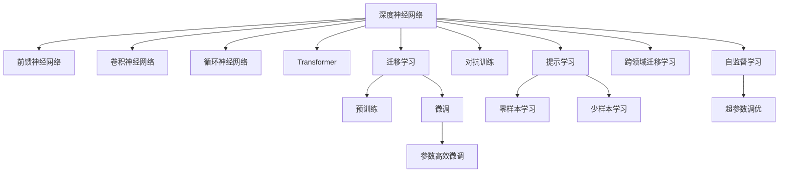

                 

## 1. 背景介绍

### 1.1 问题由来
人类历史上的每一次重大科技革命，都伴随着对未知事物认知的飞跃。从哥白尼的日心说颠覆地心说到爱因斯坦的相对论挑战牛顿经典力学，从计算机的诞生到深度学习的崛起，无不在不断地拓展人类认知的边界。在信息时代，人工智能（AI）尤其是深度学习，已经成为推动新一轮认知革命的主力军。

深度学习，尤其是深度神经网络，赋予了机器模拟人类大脑的能力，使其具备了复杂模式识别和自主学习能力。这一突破性进展，正在重塑我们对数据、知识和智慧的理解和运用。本文旨在探讨AI时代认知演变的关键技术——深度学习，特别是它在处理未知事物上的应用和演进。

### 1.2 问题核心关键点
在深度学习的发展历程中，以下几个核心关键点尤为突出：

1. **神经网络结构创新**：从早期的单层前馈网络到多层感知机（MLP），再到卷积神经网络（CNN）、循环神经网络（RNN）和Transformer，神经网络结构的不断创新，使得机器能够从简单的线性关系推断，发展到更复杂的高维非线性关系。

2. **损失函数优化**：从最早的均方误差损失到交叉熵损失，再到自编码损失、对抗性损失等，损失函数的设计和优化，极大地提升了深度学习的训练效果和泛化能力。

3. **正则化技术**：如L2正则化、Dropout、Early Stopping等，在避免过拟合的同时，提高了模型的泛化能力和稳定性。

4. **大规模数据集与分布式计算**：深度学习模型通常需要海量数据进行训练，而分布式计算框架（如TensorFlow、PyTorch等）的演进，极大地提高了深度学习训练的效率。

5. **迁移学习与预训练**：通过在大规模数据上预训练模型，再进行微调，能够在不牺牲泛化能力的前提下，快速适应新的任务和数据分布。

### 1.3 问题研究意义
深度学习作为新一轮认知革命的重要工具，其研究与应用意义重大：

1. **推动知识发现与创新**：深度学习能够从海量数据中自动发现规律和模式，为科学研究和工业创新提供新思路和新方法。

2. **提升决策支持水平**：深度学习模型能够处理大量数据，提供客观、可解释的决策支持，提高决策的科学性和精确性。

3. **促进个性化与智能化**：深度学习模型能够根据用户行为和偏好，提供个性化服务，推动智能化应用的发展。

4. **拓展应用领域**：深度学习已应用于医疗、金融、交通、制造等多个领域，显示出巨大的市场潜力和应用前景。

## 2. 核心概念与联系

### 2.1 核心概念概述

在探讨深度学习对认知演变的贡献时，需要重点关注以下几个核心概念：

1. **深度神经网络（Deep Neural Network, DNN）**：由多个层次组成的神经网络，每个层次包含多个神经元，可以学习复杂的多层非线性映射关系。

2. **前馈神经网络（Feedforward Neural Network, FNN）**：一种最简单的神经网络，数据仅从输入层向输出层单向传递，层次间没有循环连接。

3. **卷积神经网络（Convolutional Neural Network, CNN）**：专门用于图像识别和处理的神经网络，通过卷积层、池化层等组件，学习图像的局部特征和全局结构。

4. **循环神经网络（Recurrent Neural Network, RNN）**：通过循环结构，可以处理序列数据，如时间序列预测、自然语言处理等。

5. **Transformer**：一种基于自注意力机制的神经网络架构，用于处理序列数据，能够高效地捕捉长距离依赖关系。

6. **迁移学习（Transfer Learning）**：在大规模数据上预训练的模型，在特定任务上微调，能够快速适应新数据分布。

7. **预训练（Pre-training）**：在无标签数据上训练模型，使其学习到通用的语言或图像表示，然后通过微调适应特定任务。

8. **微调（Fine-tuning）**：在预训练模型的基础上，使用有标签数据进行任务特定优化，提升模型在该任务上的性能。

9. **参数高效微调（Parameter-Efficient Fine-tuning, PEFT）**：只更新部分模型参数进行微调，减小微调过程中的计算和存储开销。

10. **对抗训练（Adversarial Training）**：通过引入对抗样本，提升模型的鲁棒性和泛化能力。

11. **提示学习（Prompt Learning）**：通过精心设计的输入模板，引导模型进行推理和生成，避免额外的微调。

12. **零样本学习（Zero-shot Learning）**：模型在没有见过的数据上，根据任务描述直接生成输出。

13. **少样本学习（Few-shot Learning）**：模型在少量标注样本上，能够快速适应新任务。

14. **跨领域迁移学习（Cross-domain Transfer Learning）**：模型在不同领域间迁移应用，提升模型在新领域上的性能。

15. **自监督学习（Self-supervised Learning）**：使用无标签数据进行自监督训练，学习数据的潜在结构。

16. **超参数调优（Hyperparameter Tuning）**：对模型的超参数进行优化，以提高模型的性能和泛化能力。

这些概念共同构成了深度学习的基本框架，使得机器能够处理未知事物，提升认知能力。

### 2.2 核心概念原理和架构的 Mermaid 流程图



这个流程图展示了深度学习从基础概念到高级技术的演进脉络。每个节点代表一种核心概念，节点间的箭头表示概念之间的逻辑联系。通过理解这些概念及其相互关系，可以更好地把握深度学习的核心原理和发展方向。

## 3. 核心算法原理 & 具体操作步骤

### 3.1 算法原理概述

深度学习通过多层非线性变换，学习数据的复杂结构和高维表示。其核心在于神经网络的结构设计和优化算法的创新。本文将重点介绍深度学习处理未知事物的核心算法和具体操作步骤。

深度学习的关键算法包括反向传播算法、梯度下降优化算法、自注意力机制等。反向传播算法通过链式法则，计算模型参数对损失函数的梯度，从而进行参数更新。梯度下降优化算法通过迭代更新模型参数，最小化损失函数。自注意力机制通过计算注意力权重，动态地调整模型对输入数据的关注程度，从而提升模型的表达能力和泛化能力。

### 3.2 算法步骤详解

深度学习的训练步骤通常包括以下几个关键环节：

1. **数据准备**：收集和预处理训练数据，将其转化为模型可以处理的格式。

2. **模型构建**：选择合适的神经网络结构，并定义模型损失函数。

3. **模型训练**：使用反向传播算法和优化算法，对模型参数进行迭代更新。

4. **模型评估**：在测试数据集上评估模型的性能，检查模型的泛化能力。

5. **模型调优**：根据评估结果，调整模型参数和超参数，进一步提升模型性能。

6. **模型应用**：将训练好的模型应用到实际问题中，进行推理和预测。

### 3.3 算法优缺点

深度学习在处理未知事物方面具有以下优点：

1. **模型表达能力强**：多层神经网络能够学习复杂的数据结构和表示形式，适用于多种未知事物的处理。

2. **自适应能力强**：深度学习模型能够根据新数据进行自适应调整，提升模型性能。

3. **泛化能力强**：通过迁移学习和预训练，深度学习模型能够在不同领域和任务间进行有效迁移。

4. **数据驱动**：深度学习模型能够从大规模数据中自动学习规律和模式，提高决策的客观性和准确性。

5. **可扩展性好**：深度学习模型可以通过增加层数和参数，提升模型的复杂度和表达能力。

但深度学习也存在一些局限性：

1. **计算资源需求高**：深度学习模型通常需要大量的计算资源进行训练，限制了其在小型设备上的应用。

2. **模型复杂度高**：深度学习模型结构复杂，难以解释和调试，存在"黑箱"问题。

3. **数据依赖性强**：深度学习模型的性能高度依赖于数据质量，数据偏差可能导致模型偏见。

4. **过拟合风险高**：深度学习模型容易过拟合，特别是当训练数据量较少时。

5. **训练时间长**：深度学习模型的训练过程耗时较长，可能面临数据和计算资源的瓶颈。

### 3.4 算法应用领域

深度学习在多个领域得到了广泛应用，特别是在处理未知事物方面表现出色：

1. **计算机视觉**：用于图像识别、物体检测、人脸识别等任务，通过卷积神经网络学习图像特征。

2. **自然语言处理**：用于文本分类、语言模型、机器翻译等任务，通过循环神经网络和Transformer学习语言结构。

3. **语音识别**：用于语音转文本、语音命令识别等任务，通过卷积神经网络和RNN学习语音特征。

4. **机器人控制**：用于机器人路径规划、物体抓取等任务，通过神经网络学习运动控制策略。

5. **医疗诊断**：用于疾病诊断、病理分析等任务，通过深度学习模型学习医学图像和文本数据。

6. **金融预测**：用于股票预测、信用评分等任务，通过深度学习模型学习金融市场数据。

7. **游戏AI**：用于围棋、星际争霸等游戏，通过神经网络学习游戏规则和策略。

8. **智能推荐**：用于个性化推荐、广告投放等任务，通过深度学习模型学习用户行为和偏好。

9. **自动驾驶**：用于车辆路径规划、障碍物检测等任务，通过神经网络学习感知数据。

10. **智能家居**：用于语音控制、环境感知等任务，通过深度学习模型学习用户指令和环境信息。

## 4. 数学模型和公式 & 详细讲解 & 举例说明

### 4.1 数学模型构建

深度学习的数学模型主要基于神经网络的结构和优化算法。这里以卷积神经网络为例，介绍其数学模型的构建过程。

卷积神经网络通常包括卷积层、池化层、全连接层等组件。其数学模型可以表示为：

$$
y = h(W_1x_1 + b_1) * W_2 + b_2
$$

其中，$x_1$表示输入数据，$W_1$和$b_1$表示第一层卷积核和偏置项，$h$表示卷积操作，$*$表示乘法操作，$W_2$和$b_2$表示第二层卷积核和偏置项，$y$表示输出结果。

### 4.2 公式推导过程

卷积神经网络的公式推导主要涉及卷积操作和池化操作。这里以卷积层为例，介绍其数学推导过程。

卷积层通过滑动卷积核，对输入数据进行卷积操作，得到卷积特征图。其数学公式可以表示为：

$$
y_i^k = \sum_{j=0}^{k-1} W_{i,j} * x_{i-j}^k + b_i
$$

其中，$y_i^k$表示第$i$个输出特征，$x_{i-j}^k$表示输入数据在位置$i-j$的局部特征，$W_{i,j}$表示卷积核中的权重，$b_i$表示偏置项。

### 4.3 案例分析与讲解

以图像分类任务为例，分析卷积神经网络的处理过程。假设输入图像的尺寸为$28\times28$，卷积核的大小为$3\times3$，步长为$1$，输出特征图的尺寸为$10\times10$。

输入图像经过卷积层处理后，可以得到如下的卷积特征图：

$$
y_{1,1}^1 = \sum_{j=0}^{2} W_{1,j} * x_{1-j}^1 + b_1
$$

$$
y_{1,2}^1 = \sum_{j=0}^{2} W_{1,j} * x_{1-j}^1 + b_1
$$

$$
y_{1,3}^1 = \sum_{j=0}^{2} W_{1,j} * x_{1-j}^1 + b_1
$$

$$
y_{1,4}^1 = \sum_{j=0}^{2} W_{1,j} * x_{1-j}^1 + b_1
$$

$$
y_{1,5}^1 = \sum_{j=0}^{2} W_{1,j} * x_{1-j}^1 + b_1
$$

$$
y_{1,6}^1 = \sum_{j=0}^{2} W_{1,j} * x_{1-j}^1 + b_1
$$

$$
y_{1,7}^1 = \sum_{j=0}^{2} W_{1,j} * x_{1-j}^1 + b_1
$$

$$
y_{1,8}^1 = \sum_{j=0}^{2} W_{1,j} * x_{1-j}^1 + b_1
$$

$$
y_{1,9}^1 = \sum_{j=0}^{2} W_{1,j} * x_{1-j}^1 + b_1
$$

$$
y_{1,10}^1 = \sum_{j=0}^{2} W_{1,j} * x_{1-j}^1 + b_1
$$

$$
y_{1,11}^1 = \sum_{j=0}^{2} W_{1,j} * x_{1-j}^1 + b_1
$$

$$
y_{1,12}^1 = \sum_{j=0}^{2} W_{1,j} * x_{1-j}^1 + b_1
$$

$$
y_{1,13}^1 = \sum_{j=0}^{2} W_{1,j} * x_{1-j}^1 + b_1
$$

$$
y_{1,14}^1 = \sum_{j=0}^{2} W_{1,j} * x_{1-j}^1 + b_1
$$

$$
y_{1,15}^1 = \sum_{j=0}^{2} W_{1,j} * x_{1-j}^1 + b_1
$$

$$
y_{1,16}^1 = \sum_{j=0}^{2} W_{1,j} * x_{1-j}^1 + b_1
$$

$$
y_{1,17}^1 = \sum_{j=0}^{2} W_{1,j} * x_{1-j}^1 + b_1
$$

$$
y_{1,18}^1 = \sum_{j=0}^{2} W_{1,j} * x_{1-j}^1 + b_1
$$

$$
y_{1,19}^1 = \sum_{j=0}^{2} W_{1,j} * x_{1-j}^1 + b_1
$$

$$
y_{1,20}^1 = \sum_{j=0}^{2} W_{1,j} * x_{1-j}^1 + b_1
$$

$$
y_{1,21}^1 = \sum_{j=0}^{2} W_{1,j} * x_{1-j}^1 + b_1
$$

$$
y_{1,22}^1 = \sum_{j=0}^{2} W_{1,j} * x_{1-j}^1 + b_1
$$

$$
y_{1,23}^1 = \sum_{j=0}^{2} W_{1,j} * x_{1-j}^1 + b_1
$$

$$
y_{1,24}^1 = \sum_{j=0}^{2} W_{1,j} * x_{1-j}^1 + b_1
$$

$$
y_{1,25}^1 = \sum_{j=0}^{2} W_{1,j} * x_{1-j}^1 + b_1
$$

$$
y_{1,26}^1 = \sum_{j=0}^{2} W_{1,j} * x_{1-j}^1 + b_1
$$

$$
y_{1,27}^1 = \sum_{j=0}^{2} W_{1,j} * x_{1-j}^1 + b_1
$$

$$
y_{1,28}^1 = \sum_{j=0}^{2} W_{1,j} * x_{1-j}^1 + b_1
$$

通过上述推导，可以理解卷积神经网络是如何通过卷积层处理输入图像，学习特征图的过程。

## 5. 项目实践：代码实例和详细解释说明

### 5.1 开发环境搭建

在进行深度学习项目实践前，需要准备好开发环境。以下是使用Python和TensorFlow进行深度学习开发的常见环境配置流程：

1. 安装Anaconda：从官网下载并安装Anaconda，用于创建独立的Python环境。

2. 创建并激活虚拟环境：
```bash
conda create -n tf-env python=3.8
conda activate tf-env
```

3. 安装TensorFlow：
```bash
pip install tensorflow==2.4
```

4. 安装相关依赖包：
```bash
pip install numpy pandas scikit-learn matplotlib tensorboard
```

5. 安装Jupyter Notebook：
```bash
pip install jupyter notebook
```

完成上述步骤后，即可在`tf-env`环境中开始深度学习项目的开发。

### 5.2 源代码详细实现

这里以图像分类任务为例，展示使用TensorFlow进行卷积神经网络（CNN）训练的代码实现。

首先，定义模型架构：

```python
import tensorflow as tf
from tensorflow.keras import layers

model = tf.keras.Sequential([
    layers.Conv2D(32, (3, 3), activation='relu', input_shape=(28, 28, 1)),
    layers.MaxPooling2D((2, 2)),
    layers.Conv2D(64, (3, 3), activation='relu'),
    layers.MaxPooling2D((2, 2)),
    layers.Flatten(),
    layers.Dense(64, activation='relu'),
    layers.Dense(10, activation='softmax')
])
```

然后，定义损失函数和优化器：

```python
model.compile(optimizer=tf.keras.optimizers.Adam(learning_rate=0.001),
              loss=tf.keras.losses.SparseCategoricalCrossentropy(from_logits=True),
              metrics=['accuracy'])
```

接着，加载和预处理数据：

```python
(x_train, y_train), (x_test, y_test) = tf.keras.datasets.mnist.load_data()
x_train = x_train.reshape(-1, 28, 28, 1).astype('float32') / 255.0
x_test = x_test.reshape(-1, 28, 28, 1).astype('float32') / 255.0
```

最后，进行模型训练和评估：

```python
history = model.fit(x_train, y_train, epochs=10, validation_data=(x_test, y_test))
model.evaluate(x_test, y_test)
```

以上就是使用TensorFlow进行CNN模型训练的完整代码实现。可以看到，借助TensorFlow的高级API，可以迅速搭建和训练卷积神经网络，提高开发效率。

### 5.3 代码解读与分析

这里我们详细解读关键代码的实现细节：

**Sequential模型**：
- `Sequential`是一个线性堆叠的神经网络模型，可以方便地添加多个层次。

**卷积层（Conv2D）**：
- `Conv2D`用于定义卷积层，第一个参数`32`表示卷积核的数量，`(3, 3)`表示卷积核的大小，`activation='relu'`表示激活函数使用ReLU，`input_shape=(28, 28, 1)`表示输入数据的形状。

**池化层（MaxPooling2D）**：
- `MaxPooling2D`用于定义池化层，`(2, 2)`表示池化核的大小。

**全连接层（Dense）**：
- `Dense`用于定义全连接层，第一个参数`64`表示神经元的数量，`activation='relu'`表示激活函数使用ReLU。

**损失函数（SparseCategoricalCrossentropy）**：
- `SparseCategoricalCrossentropy`用于定义损失函数，`from_logits=True`表示模型输出为未经过softmax处理的logits。

**优化器（Adam）**：
- `Adam`用于定义优化器，`learning_rate=0.001`表示学习率。

**数据加载与预处理**：
- `tf.keras.datasets.mnist.load_data()`用于加载MNIST数据集，`x_train`和`y_train`为训练集数据和标签，`x_test`和`y_test`为测试集数据和标签。
- `reshape(-1, 28, 28, 1)`用于将二维数据展平为四维张量，`astype('float32')`用于将数据类型转换为float32，`/ 255.0`用于归一化数据。

**模型训练与评估**：
- `model.fit(x_train, y_train, epochs=10, validation_data=(x_test, y_test))`用于训练模型，`epochs=10`表示训练轮数，`validation_data=(x_test, y_test)`表示验证集数据。
- `model.evaluate(x_test, y_test)`用于评估模型性能，输出测试集上的损失和精度。

**代码运行结果展示**：
- 训练过程中，模型会在每个epoch打印当前的损失和精度。
- 评估过程中，模型会输出测试集上的损失和精度。

可以看到，TensorFlow提供了一个简洁高效的开发平台，能够快速搭建和训练深度学习模型。

## 6. 实际应用场景

### 6.1 智能推荐系统

智能推荐系统是深度学习在商业应用中最为成功的案例之一。通过分析用户行为数据和物品特征数据，深度学习模型能够学习用户兴趣和物品相关性，实现个性化推荐。

以电商推荐为例，用户每次浏览、点击、购买等行为都会被记录，深度学习模型能够从中学习到用户的偏好。同时，物品的标题、描述、图片等特征信息也被加入模型训练，提升推荐精度。最终，模型根据用户兴趣和物品特征，生成个性化推荐列表。

### 6.2 医疗诊断系统

深度学习在医疗诊断中也有广泛应用。通过分析医学影像、病历数据等，深度学习模型能够学习到疾病特征，辅助医生进行疾病诊断和治疗方案推荐。

以医学影像分析为例，深度学习模型能够从CT、MRI等影像中学习到病灶的特征，自动标注出异常区域。同时，模型还能对病历数据进行分析，学习患者的病情变化规律，辅助医生进行诊断和治疗决策。

### 6.3 金融风险预测

深度学习在金融风险预测中也发挥了重要作用。通过分析金融市场数据、交易数据等，深度学习模型能够学习到市场趋势和投资行为，预测未来的股票价格和交易风险。

以股票价格预测为例，深度学习模型能够从历史股价、交易量、新闻等数据中学习到市场变化规律，预测未来的股价走势。同时，模型还能对交易数据进行分析，识别异常交易行为，防范金融风险。

## 7. 工具和资源推荐

### 7.1 学习资源推荐

为了帮助开发者系统掌握深度学习的核心概念和实践技巧，这里推荐一些优质的学习资源：

1. 《深度学习》（Ian Goodfellow、Yoshua Bengio和Aaron Courville合著）：经典教材，全面介绍深度学习的理论和实践。

2. CS231n《卷积神经网络和视觉识别》课程：斯坦福大学开设的计算机视觉课程，系统讲解CNN理论及其应用。

3. CS224n《神经网络语言模型》课程：斯坦福大学开设的自然语言处理课程，系统讲解RNN、Transformer等模型。

4. 《动手学深度学习》（李沐等人合著）：开源教材，从理论和实践两个方面全面介绍深度学习。

5. TensorFlow官方文档：TensorFlow的官方文档，提供详细的API文档和案例代码，是深度学习开发的必备资料。

6. PyTorch官方文档：PyTorch的官方文档，提供丰富的模型和算法实现，适合深度学习研究和开发。

7. Kaggle竞赛平台：全球最大的数据科学竞赛平台，提供大量真实数据和算法挑战，提升深度学习实战能力。

通过对这些资源的学习实践，相信你一定能够快速掌握深度学习的精髓，并用于解决实际的AI问题。

### 7.2 开发工具推荐

为了提高深度学习项目的开发效率，以下是几款常用的开发工具：

1. PyTorch：基于Python的开源深度学习框架，灵活高效的动态计算图，适合深度学习研究和开发。

2. TensorFlow：由Google主导开发的深度学习框架，生产部署方便，适合大规模工程应用。

3. Keras：高层API，简单易用的深度学习框架，适合快速原型设计和模型实验。

4. Jupyter Notebook：交互式的笔记本环境，支持Python和TensorFlow等深度学习工具，适合数据科学家的探索性研究和模型开发。

5. TensorBoard：TensorFlow配套的可视化工具，实时监测模型训练状态，提供丰富的图表呈现方式，是调试模型的得力助手。

6. Weights & Biases：模型训练的实验跟踪工具，记录和可视化模型训练过程中的各项指标，方便对比和调优。

7. Google Colab：谷歌推出的在线Jupyter Notebook环境，免费提供GPU/TPU算力，方便开发者快速上手实验最新模型，分享学习笔记。

合理利用这些工具，可以显著提升深度学习项目的开发效率，加快创新迭代的步伐。

### 7.3 相关论文推荐

深度学习的发展得益于学界的持续研究。以下是几篇奠基性的相关论文，推荐阅读：

1. ImageNet Classification with Deep Convolutional Neural Networks（AlexNet论文）：提出卷积神经网络，开启计算机视觉领域的深度学习时代。

2. Deep Residual Learning for Image Recognition（ResNet论文）：提出残差网络，解决深度网络训练过程中梯度消失的问题。

3. Attention is All You Need（Transformer论文）：提出自注意力机制，提升序列数据处理的效率和效果。

4. A Simple Neural Network Module for the Attention Mechanism（Attention机制论文）：提出注意力机制，提升序列数据处理的灵活性和准确性。

5. Deep Learning for Medical Image Analysis：探讨深度学习在医学影像分析中的应用，推动医学影像自动化的发展。

6. Deep Reinforcement Learning for Trading（DQN论文）：提出深度强化学习，解决金融市场交易中的多臂赌博问题。

以上论文代表了大深度学习的研究进展，通过学习这些前沿成果，可以帮助研究者把握学科前进方向，激发更多的创新灵感。

## 8. 总结：未来发展趋势与挑战

### 8.1 总结

本文对深度学习处理未知事物的过程和原理进行了全面系统的介绍。首先阐述了深度学习在处理未知事物方面的优势和应用场景，明确了深度学习作为认知演变的关键技术的意义。其次，从模型构建到训练评估，详细讲解了深度学习的核心算法和具体操作步骤，给出了深度学习项目开发的完整代码实现。同时，本文还广泛探讨了深度学习在多个领域的应用前景，展示了深度学习技术的广阔应用前景。此外，本文精选了深度学习技术的各类学习资源，力求为读者提供全方位的技术指引。

通过本文的系统梳理，可以看到，深度学习在处理未知事物方面展现了强大的能力，极大地拓展了人类的认知边界。深度学习模型能够从海量数据中自动学习规律和模式，提供客观、可解释的决策支持，推动智能化应用的发展。未来，随着深度学习技术的不断演进，其应用领域将进一步拓展，带来更多的创新突破。

### 8.2 未来发展趋势

展望未来，深度学习处理未知事物的能力将不断提升：

1. **模型复杂度提升**：随着算力成本的下降和深度学习模型的持续演进，模型复杂度将不断提升，处理未知事物的能力也将进一步增强。

2. **自监督学习兴起**：自监督学习能够利用未标注数据进行训练，减少对标注数据的依赖，提升深度学习的泛化能力和鲁棒性。

3. **知识图谱与深度学习结合**：通过知识图谱与深度学习模型的结合，提升模型的知识表示和推理能力，解决更多复杂任务。

4. **跨领域迁移学习发展**：深度学习模型将在更多领域进行迁移应用，推动不同领域的知识融合与创新。

5. **无监督学习与强化学习结合**：深度学习模型将结合无监督学习和强化学习技术，提升模型的自主学习和适应能力。

6. **多模态学习深入**：深度学习模型将结合多模态数据进行联合建模，提升模型对复杂现实世界的理解和处理能力。

7. **实时性提升**：通过优化模型结构和算法，深度学习模型将具备更强的实时性和计算效率，更好地应用于实时场景。

8. **可解释性与可控性增强**：深度学习模型将增强其可解释性和可控性，提升其决策过程的透明度和安全性。

以上趋势凸显了深度学习处理未知事物的潜力和发展方向。这些方向的探索发展，必将进一步提升深度学习系统的性能和应用范围，为人类认知智能的进化带来深远影响。

### 8.3 面临的挑战

尽管深度学习在处理未知事物方面展现了强大的能力，但在迈向更加智能化、普适化应用的过程中，仍面临诸多挑战：

1. **数据依赖性**：深度学习模型高度依赖于数据，数据偏差可能导致模型偏见，需要更多的数据采集和标注工作。

2. **计算资源需求**：深度学习模型需要大量的计算资源进行训练和推理，存在硬件瓶颈。

3. **模型可解释性**：深度学习模型往往缺乏可解释性，难以理解和调试其决策过程。

4. **鲁棒性不足**：深度学习模型在面对新数据和噪声时，容易发生泛化能力下降，鲁棒性不足。

5. **公平性与偏见**：深度学习模型可能学习到有偏见的数据特征，导致输出偏见和歧视。

6. **隐私与安全**：深度学习模型处理敏感数据时，需要考虑数据隐私和模型安全问题。

7. **道德与伦理**：深度学习模型在处理决策问题时，需要考虑其道德与伦理问题，确保其决策过程符合人类价值观。

8. **持续学习与更新**：深度学习模型需要不断学习新数据和知识，更新其模型参数和决策逻辑，避免模型过时。

这些挑战需要深度学习研究者和开发者共同面对和解决，通过技术创新和伦理监管，确保深度学习技术的可持续发展。

### 8.4 研究展望

面对深度学习处理未知事物面临的挑战，未来的研究需要在以下几个方面寻求新的突破：

1. **数据生成与增强**：利用生成对抗网络（GAN）等技术，生成更多高质量的合成数据，提升深度学习模型的泛化能力。

2. **模型压缩与优化**：开发更高效、更轻量级的模型压缩和优化方法，提升深度学习模型的计算效率和实时性。

3. **多模态学习融合**：结合多模态数据进行联合建模，提升深度学习模型的跨领域迁移能力和复杂场景处理能力。

4. **对抗训练与鲁棒性提升**：通过对抗训练等方法，提升深度学习模型的鲁棒性和泛化能力，避免对抗攻击。

5. **知识图谱与模型结合**：结合知识图谱与深度学习模型，提升模型的知识表示和推理能力，解决更多复杂任务。

6. **无监督学习与强化学习结合**：结合无监督学习和强化学习技术，提升深度学习模型的自主学习和适应能力。

7. **可解释性与可控性增强**：通过可解释性和可控性增强技术，提升深度学习模型的决策过程的透明度和安全性。

8. **跨领域迁移学习**：开发更多跨领域迁移学习方法，提升深度学习模型在不同领域间的泛化能力。

9. **伦理与道德研究**：加强深度学习模型的伦理与道德研究，确保其决策过程符合人类价值观和伦理道德。

通过这些研究方向的探索，深度学习技术将进一步拓展其应用边界，为人工智能时代的认知智能发展提供新的动力。面向未来，深度学习研究者和开发者需要勇于创新、敢于突破，共同推动深度学习技术的持续发展和应用。

