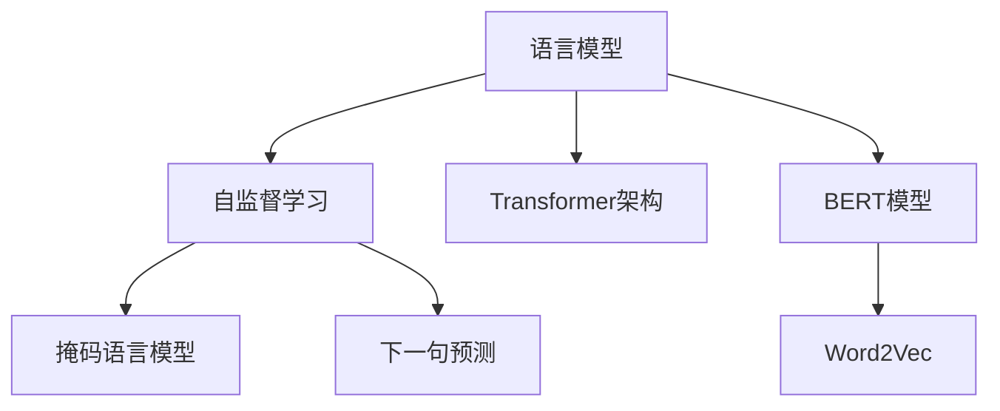

                 

# 预训练 (Pre-training)

> 关键词：预训练,语言模型,自监督学习,无监督学习,Transformer,数据增强,自回归,掩码语言模型,Word2Vec

## 1. 背景介绍

### 1.1 问题由来

预训练（Pre-training）技术是近年来自然语言处理（NLP）领域的一项重要创新。预训练通过在大规模无标签文本数据上，利用自监督学习（Self-Supervised Learning）任务训练语言模型，使其具备强大的语言理解和生成能力。预训练模型可以在下游任务上通过微调（Fine-tuning）获得显著的性能提升，广泛应用在各种NLP任务中，如文本分类、情感分析、问答系统等。

传统的NLP任务通常依赖于人工标注数据集，这对标注成本和时间都提出了较高的要求。而预训练模型通过无监督学习，可以在更短的时间内获得性能更强的语言模型，显著降低了NLP任务开发和部署的门槛。预训练方法的出现，不仅提升了NLP系统的性能，也推动了整个行业的快速发展。

### 1.2 问题核心关键点

预训练的核心在于如何构建一个高质量的语言模型，通过在大量无标签文本上学习语言的通用表示。预训练的主要过程包括两个阶段：预训练和微调。

- **预训练阶段**：通过自监督学习任务，如掩码语言模型（Masked Language Model, MLM）、下一句预测（Next Sentence Prediction, NSP）等，训练语言模型，使其具备较强的语言理解和生成能力。
- **微调阶段**：将预训练模型作为初始参数，在特定任务的有标签数据集上进行微调，以优化模型在特定任务上的性能。

预训练-微调的方法已经在多项NLP任务中取得了突破性的成果，成为当前NLP技术的主流范式。预训练的目的是让模型学习到尽可能广泛的语义和语法知识，从而在微调时能够更快适应各种不同领域的NLP任务。

### 1.3 问题研究意义

预训练技术对NLP领域的研究和应用具有重要意义：

1. **降低开发成本**：预训练模型可以大大降低NLP任务对标注数据的需求，显著缩短模型训练和调优的时间，从而降低开发成本。
2. **提升模型效果**：通过预训练获得的通用语言表示，微调后的模型在特定任务上的性能往往优于从头训练模型。
3. **加速模型部署**：预训练模型可以在多种NLP任务间复用，加速模型的实际应用和部署。
4. **促进技术进步**：预训练方法催生了多项NLP技术的突破，推动了NLP技术的不断进步。
5. **赋能行业应用**：预训练模型能够快速集成到各种应用系统中，推动NLP技术在各行各业的落地应用。

## 2. 核心概念与联系

### 2.1 核心概念概述

为更好地理解预训练方法，本节将介绍几个密切相关的核心概念：

- **语言模型（Language Model, LM）**：用于预测给定序列下一个单词的概率分布的模型。语言模型是预训练的重要目标，通过训练使模型能够准确地预测文本序列的概率分布。
- **自监督学习（Self-Supervised Learning）**：一种无需标注数据，直接利用数据本身的结构性信息进行学习的方法。常见的自监督学习任务包括掩码语言模型、下一句预测等。
- **掩码语言模型（Masked Language Model, MLM）**：一种自监督学习任务，在输入文本中随机掩码部分单词，让模型预测这些被掩码的单词。该任务旨在训练模型学习上下文信息，使其具备更强的语言理解能力。
- **Transformer架构**：一种用于实现语言模型的神经网络结构，通过多头自注意力机制（Multi-Head Self-Attention）和层归一化（Layer Normalization）等技术，显著提升了模型的训练效率和表示能力。
- **BERT模型**：由Google提出的基于Transformer架构的预训练语言模型，通过掩码语言模型和下一句预测任务进行预训练，广泛应用于各种NLP任务中。
- **Word2Vec**：一种基于神经网络的单词表示方法，通过学习单词在上下文中的分布，得到单词的向量表示。Word2Vec是预训练技术的一个早期案例，为后来的预训练方法奠定了基础。

这些核心概念之间的逻辑关系可以通过以下Mermaid流程图来展示：



这个流程图展示了大语言模型的构建过程：

1. 语言模型通过自监督学习任务进行预训练，掌握语言的通用表示。
2. Transformer架构作为实现语言模型的重要技术手段，提高了模型的训练效率和表示能力。
3. BERT模型通过掩码语言模型和下一句预测任务进行预训练，取得了显著的性能提升。
4. Word2Vec是最早的预训练方法之一，为后来的预训练技术提供了重要的参考。

## 3. 核心算法原理 & 具体操作步骤
### 3.1 算法原理概述

预训练技术基于自监督学习，利用大规模无标签文本数据训练语言模型。其核心思想是：在无标签数据上，通过设计合适的自监督学习任务，让模型学习语言的通用表示。

形式化地，假设输入文本序列为 $x=(x_1, x_2, ..., x_n)$，其中 $x_i$ 为单词。语言模型的目标是最小化以下交叉熵损失函数：

$$
L = -\sum_{i=1}^n \log P(x_i | x_{<i})
$$

其中 $P(x_i | x_{<i})$ 为给定前 $i-1$ 个单词的情况下，单词 $x_i$ 出现的概率。通过优化损失函数，使模型能够准确预测文本序列的概率分布。

预训练的目的是通过自监督学习任务，使模型学习到语言的通用表示。常见的自监督学习任务包括掩码语言模型和下一句预测。这些任务不需要标注数据，利用文本数据的结构性信息进行训练。

### 3.2 算法步骤详解

预训练的一般流程如下：

**Step 1: 准备预训练数据**
- 收集大规模无标签文本数据，通常要求数据量超过100亿个单词。
- 对文本进行预处理，包括分词、去除停用词、构建词汇表等。

**Step 2: 设计自监督学习任务**
- 设计合适的自监督学习任务，如掩码语言模型、下一句预测等。
- 确定任务的输入输出格式，包括输入文本的掩码策略、下一句预测的正负样本等。

**Step 3: 训练预训练模型**
- 使用Transformer架构构建预训练模型。
- 在自监督学习任务上训练模型，最小化任务损失函数。
- 定期在验证集上评估模型性能，调整训练超参数。

**Step 4: 保存预训练模型**
- 训练完成后，保存预训练模型的权重参数，供后续微调使用。

### 3.3 算法优缺点

预训练技术具有以下优点：

1. **通用性强**：预训练模型在大规模无标签数据上进行训练，具备较强的通用语言表示能力，能够适应多种NLP任务。
2. **效率高**：预训练模型通常使用大规模并行分布式训练，能够在较短时间内获得高质量的模型参数。
3. **泛化能力强**：预训练模型通过学习语言的通用表示，在微调时能够快速适应新任务，取得更好的性能。
4. **适用性广**：预训练方法适用于各种NLP任务，包括分类、匹配、生成等，具有广泛的适用性。

同时，预训练技术也存在一些局限性：

1. **数据需求高**：预训练需要大规模无标签数据，对于某些领域的数据可能不易获取。
2. **模型复杂度大**：预训练模型通常具有亿级别的参数规模，需要高性能的计算资源。
3. **计算成本高**：预训练过程需要大量计算资源和时间，尤其是大规模模型的训练。
4. **泛化能力有限**：预训练模型虽然具备强大的语言理解能力，但在特定领域的数据上，泛化能力仍有所限制。
5. **可解释性不足**：预训练模型通常缺乏可解释性，难以理解其内部工作机制。

尽管存在这些局限性，但预训练技术仍是大语言模型研究的重要方向，通过不断改进预训练方法，可以进一步提升模型的通用性和泛化能力。

### 3.4 算法应用领域

预训练技术在NLP领域得到了广泛的应用，涵盖多种NLP任务，具体如下：

1. **文本分类**：如情感分析、主题分类等。通过预训练模型学习文本-标签映射。
2. **命名实体识别**：识别文本中的人名、地名、机构名等特定实体。通过预训练模型学习实体边界和类型。
3. **关系抽取**：从文本中抽取实体之间的语义关系。通过预训练模型学习实体-关系三元组。
4. **问答系统**：对自然语言问题给出答案。通过预训练模型学习问题-答案对。
5. **机器翻译**：将源语言文本翻译成目标语言。通过预训练模型学习语言-语言映射。
6. **文本摘要**：将长文本压缩成简短摘要。通过预训练模型学习抓取要点。
7. **对话系统**：使机器能够与人自然对话。通过预训练模型学习对话历史-回复映射。

除了上述这些经典任务外，预训练方法也被创新性地应用到更多场景中，如可控文本生成、常识推理、代码生成、数据增强等，为NLP技术带来了全新的突破。随着预训练模型的不断进步，相信NLP技术将在更广阔的应用领域大放异彩。

## 4. 数学模型和公式 & 详细讲解  
### 4.1 数学模型构建

本节将使用数学语言对预训练过程进行更加严格的刻画。

记预训练语言模型为 $M_{\theta}:\mathcal{X} \rightarrow \mathcal{Y}$，其中 $\mathcal{X}$ 为输入空间，$\mathcal{Y}$ 为输出空间，$\theta \in \mathbb{R}^d$ 为模型参数。假设预训练任务的训练集为 $D=\{(x_i,y_i)\}_{i=1}^N, x_i \in \mathcal{X}, y_i \in \mathcal{Y}$。

定义预训练模型 $M_{\theta}$ 在输入 $x$ 上的损失函数为 $\ell(M_{\theta}(x),y)$，则在数据集 $D$ 上的经验风险为：

$$
\mathcal{L}(\theta) = \frac{1}{N} \sum_{i=1}^N \ell(M_{\theta}(x_i),y_i)
$$

预训练的目标是最小化经验风险，即找到最优参数：

$$
\theta^* = \mathop{\arg\min}_{\theta} \mathcal{L}(\theta)
$$

在实践中，我们通常使用基于梯度的优化算法（如SGD、Adam等）来近似求解上述最优化问题。设 $\eta$ 为学习率，$\lambda$ 为正则化系数，则参数的更新公式为：

$$
\theta \leftarrow \theta - \eta \nabla_{\theta}\mathcal{L}(\theta) - \eta\lambda\theta
$$

其中 $\nabla_{\theta}\mathcal{L}(\theta)$ 为损失函数对参数 $\theta$ 的梯度，可通过反向传播算法高效计算。

### 4.2 公式推导过程

以下我们以掩码语言模型为例，推导掩码语言模型的损失函数及其梯度的计算公式。

假设模型 $M_{\theta}$ 在输入 $x$ 上的输出为 $\hat{y}=M_{\theta}(x) \in [0,1]$，表示单词 $x_i$ 出现的概率。真实标签 $y \in \{0,1\}$。则掩码语言模型的交叉熵损失函数定义为：

$$
\ell(M_{\theta}(x),y) = -y\log \hat{y} + (1-y)\log (1-\hat{y})
$$

将其代入经验风险公式，得：

$$
\mathcal{L}(\theta) = -\frac{1}{N}\sum_{i=1}^N [y_i\log M_{\theta}(x_i)+(1-y_i)\log(1-M_{\theta}(x_i))]
$$

根据链式法则，损失函数对参数 $\theta_k$ 的梯度为：

$$
\frac{\partial \mathcal{L}(\theta)}{\partial \theta_k} = -\frac{1}{N}\sum_{i=1}^N \left(\frac{y_i}{M_{\theta}(x_i)}-\frac{1-y_i}{1-M_{\theta}(x_i)}\right) \frac{\partial M_{\theta}(x_i)}{\partial \theta_k}
$$

其中 $\frac{\partial M_{theta}(x_i)}{\partial \theta_k}$ 可进一步递归展开，利用自动微分技术完成计算。

在得到损失函数的梯度后，即可带入参数更新公式，完成模型的迭代优化。重复上述过程直至收敛，最终得到预训练后的模型参数 $\theta^*$。

## 5. 项目实践：代码实例和详细解释说明
### 5.1 开发环境搭建

在进行预训练实践前，我们需要准备好开发环境。以下是使用Python进行PyTorch开发的环境配置流程：

1. 安装Anaconda：从官网下载并安装Anaconda，用于创建独立的Python环境。

2. 创建并激活虚拟环境：
```bash
conda create -n pytorch-env python=3.8 
conda activate pytorch-env
```

3. 安装PyTorch：根据CUDA版本，从官网获取对应的安装命令。例如：
```bash
conda install pytorch torchvision torchaudio cudatoolkit=11.1 -c pytorch -c conda-forge
```

4. 安装Transformers库：
```bash
pip install transformers
```

5. 安装各类工具包：
```bash
pip install numpy pandas scikit-learn matplotlib tqdm jupyter notebook ipython
```

完成上述步骤后，即可在`pytorch-env`环境中开始预训练实践。

### 5.2 源代码详细实现

下面我们以BERT模型为例，给出使用Transformers库进行预训练的PyTorch代码实现。

首先，定义掩码语言模型任务：

```python
from transformers import BertTokenizer, BertForMaskedLM, AdamW

tokenizer = BertTokenizer.from_pretrained('bert-base-cased')
model = BertForMaskedLM.from_pretrained('bert-base-cased', num_labels=2)

device = torch.device('cuda') if torch.cuda.is_available() else torch.device('cpu')
model.to(device)

# 定义掩码语言模型的数据集
class MaskedLMDataset(Dataset):
    def __init__(self, sentences):
        self.sentences = sentences
        self.tokenizer = tokenizer
        self.max_len = 128
        
    def __len__(self):
        return len(self.sentences)
    
    def __getitem__(self, item):
        sentence = self.sentences[item]
        encoding = self.tokenizer(sentence, return_tensors='pt', max_length=self.max_len, padding='max_length', truncation=True)
        input_ids = encoding['input_ids'][0]
        attention_mask = encoding['attention_mask'][0]
        
        # 定义掩码策略
        mask_idxs = np.random.choice(input_ids.shape[-1], size=8, replace=False)
        masked_input_ids = input_ids.clone()
        masked_input_ids[mask_idxs] = tokenizer.mask_token_id
        
        # 返回数据
        return {'input_ids': masked_input_ids, 
                'attention_mask': attention_mask,
                'masked_labels': input_ids[mask_idxs]}
        
# 创建dataset
sentences = ['This is a masked sentence.', 'Another masked sentence.']

train_dataset = MaskedLMDataset(sentences)
val_dataset = MaskedLMDataset(sentences)
test_dataset = MaskedLMDataset(sentences)
```

然后，定义训练和评估函数：

```python
from torch.utils.data import DataLoader
from tqdm import tqdm

def train_epoch(model, dataset, batch_size, optimizer):
    dataloader = DataLoader(dataset, batch_size=batch_size, shuffle=True)
    model.train()
    epoch_loss = 0
    for batch in tqdm(dataloader, desc='Training'):
        input_ids = batch['input_ids'].to(device)
        attention_mask = batch['attention_mask'].to(device)
        labels = batch['masked_labels'].to(device)
        model.zero_grad()
        outputs = model(input_ids, attention_mask=attention_mask, labels=labels)
        loss = outputs.loss
        epoch_loss += loss.item()
        loss.backward()
        optimizer.step()
    return epoch_loss / len(dataloader)

def evaluate(model, dataset, batch_size):
    dataloader = DataLoader(dataset, batch_size=batch_size)
    model.eval()
    preds, labels = [], []
    with torch.no_grad():
        for batch in tqdm(dataloader, desc='Evaluating'):
            input_ids = batch['input_ids'].to(device)
            attention_mask = batch['attention_mask'].to(device)
            labels = batch['masked_labels']
            outputs = model(input_ids, attention_mask=attention_mask)
            preds.append(outputs.logits.argmax(dim=2).tolist())
            labels = labels.tolist()
            
    print('Evaluation Results:')
    print(classification_report(labels, preds))
```

最后，启动预训练流程：

```python
epochs = 5
batch_size = 16

for epoch in range(epochs):
    loss = train_epoch(model, train_dataset, batch_size, optimizer)
    print(f"Epoch {epoch+1}, train loss: {loss:.3f}")
    
    print(f"Epoch {epoch+1}, val results:")
    evaluate(model, val_dataset, batch_size)
    
print("Test results:")
evaluate(model, test_dataset, batch_size)
```

以上就是使用PyTorch对BERT进行掩码语言模型预训练的完整代码实现。可以看到，得益于Transformers库的强大封装，我们可以用相对简洁的代码完成BERT模型的预训练。

### 5.3 代码解读与分析

让我们再详细解读一下关键代码的实现细节：

**MaskedLMDataset类**：
- `__init__`方法：初始化句子、分词器等关键组件。
- `__len__`方法：返回数据集的样本数量。
- `__getitem__`方法：对单个样本进行处理，将句子输入编码为token ids，并随机掩码部分单词，最终返回模型所需的输入。

**预训练函数**：
- 使用PyTorch的DataLoader对数据集进行批次化加载，供模型训练和推理使用。
- 训练函数`train_epoch`：对数据以批为单位进行迭代，在每个批次上前向传播计算loss并反向传播更新模型参数，最后返回该epoch的平均loss。
- 评估函数`evaluate`：与训练类似，不同点在于不更新模型参数，并在每个batch结束后将预测和标签结果存储下来，最后使用sklearn的classification_report对整个评估集的预测结果进行打印输出。

**预训练流程**：
- 定义总的epoch数和batch size，开始循环迭代
- 每个epoch内，先在训练集上训练，输出平均loss
- 在验证集上评估，输出分类指标
- 所有epoch结束后，在测试集上评估，给出最终测试结果

可以看到，PyTorch配合Transformers库使得BERT预训练的代码实现变得简洁高效。开发者可以将更多精力放在数据处理、模型改进等高层逻辑上，而不必过多关注底层的实现细节。

当然，工业级的系统实现还需考虑更多因素，如模型的保存和部署、超参数的自动搜索、更灵活的任务适配层等。但核心的预训练范式基本与此类似。

## 6. 实际应用场景
### 6.1 智能客服系统

基于预训练的大语言模型，可以广泛应用于智能客服系统的构建。传统客服往往需要配备大量人力，高峰期响应缓慢，且一致性和专业性难以保证。而使用预训练模型，可以7x24小时不间断服务，快速响应客户咨询，用自然流畅的语言解答各类常见问题。

在技术实现上，可以收集企业内部的历史客服对话记录，将问题和最佳答复构建成监督数据，在此基础上对预训练模型进行微调。微调后的对话模型能够自动理解用户意图，匹配最合适的答案模板进行回复。对于客户提出的新问题，还可以接入检索系统实时搜索相关内容，动态组织生成回答。如此构建的智能客服系统，能大幅提升客户咨询体验和问题解决效率。

### 6.2 金融舆情监测

金融机构需要实时监测市场舆论动向，以便及时应对负面信息传播，规避金融风险。传统的人工监测方式成本高、效率低，难以应对网络时代海量信息爆发的挑战。基于预训练语言模型的文本分类和情感分析技术，为金融舆情监测提供了新的解决方案。

具体而言，可以收集金融领域相关的新闻、报道、评论等文本数据，并对其进行主题标注和情感标注。在此基础上对预训练语言模型进行预训练，使其能够自动判断文本属于何种主题，情感倾向是正面、中性还是负面。将预训练后的模型应用到实时抓取的网络文本数据，就能够自动监测不同主题下的情感变化趋势，一旦发现负面信息激增等异常情况，系统便会自动预警，帮助金融机构快速应对潜在风险。

### 6.3 个性化推荐系统

当前的推荐系统往往只依赖用户的历史行为数据进行物品推荐，无法深入理解用户的真实兴趣偏好。基于预训练语言模型的个性化推荐系统，可以更好地挖掘用户行为背后的语义信息，从而提供更精准、多样的推荐内容。

在实践中，可以收集用户浏览、点击、评论、分享等行为数据，提取和用户交互的物品标题、描述、标签等文本内容。将文本内容作为模型输入，用户的后续行为（如是否点击、购买等）作为监督信号，在此基础上预训练预训练语言模型。预训练后的模型能够从文本内容中准确把握用户的兴趣点。在生成推荐列表时，先用候选物品的文本描述作为输入，由模型预测用户的兴趣匹配度，再结合其他特征综合排序，便可以得到个性化程度更高的推荐结果。

### 6.4 未来应用展望

随着预训练语言模型和微调方法的不断发展，基于预训练的微调方法必将在更多领域得到应用，为传统行业带来变革性影响。

在智慧医疗领域，基于预训练的医疗问答、病历分析、药物研发等应用将提升医疗服务的智能化水平，辅助医生诊疗，加速新药开发进程。

在智能教育领域，预训练技术可应用于作业批改、学情分析、知识推荐等方面，因材施教，促进教育公平，提高教学质量。

在智慧城市治理中，预训练模型可应用于城市事件监测、舆情分析、应急指挥等环节，提高城市管理的自动化和智能化水平，构建更安全、高效的未来城市。

此外，在企业生产、社会治理、文娱传媒等众多领域，基于预训练的语言模型预训练技术也将不断涌现，为经济社会发展注入新的动力。相信随着技术的日益成熟，预训练方法将成为人工智能落地应用的重要范式，推动人工智能技术在垂直行业的规模化落地。总之，预训练技术正在深刻改变着人类的生产生活方式，预示着人工智能技术的更广泛应用前景。

## 7. 工具和资源推荐
### 7.1 学习资源推荐

为了帮助开发者系统掌握预训练语言模型的原理和实践技巧，这里推荐一些优质的学习资源：

1. 《深度学习框架PyTorch入门》系列博文：由大模型技术专家撰写，深入浅出地介绍了PyTorch的使用方法和代码实践。

2. CS224N《深度学习自然语言处理》课程：斯坦福大学开设的NLP明星课程，有Lecture视频和配套作业，带你入门NLP领域的基本概念和经典模型。

3. 《自然语言处理与深度学习》书籍：本书详细介绍了自然语言处理的理论和实践，包括预训练技术在内的多项前沿技术。

4. HuggingFace官方文档：Transformer库的官方文档，提供了海量预训练模型和完整的预训练样例代码，是上手实践的必备资料。

5. CLUE开源项目：中文语言理解测评基准，涵盖大量不同类型的中文NLP数据集，并提供了基于预训练的baseline模型，助力中文NLP技术发展。

通过对这些资源的学习实践，相信你一定能够快速掌握预训练语言模型的精髓，并用于解决实际的NLP问题。
###  7.2 开发工具推荐

高效的开发离不开优秀的工具支持。以下是几款用于预训练开发的常用工具：

1. PyTorch：基于Python的开源深度学习框架，灵活动态的计算图，适合快速迭代研究。大部分预训练语言模型都有PyTorch版本的实现。

2. TensorFlow：由Google主导开发的开源深度学习框架，生产部署方便，适合大规模工程应用。同样有丰富的预训练语言模型资源。

3. Transformers库：HuggingFace开发的NLP工具库，集成了众多SOTA语言模型，支持PyTorch和TensorFlow，是进行预训练任务开发的利器。

4. Weights & Biases：模型训练的实验跟踪工具，可以记录和可视化模型训练过程中的各项指标，方便对比和调优。与主流深度学习框架无缝集成。

5. TensorBoard：TensorFlow配套的可视化工具，可实时监测模型训练状态，并提供丰富的图表呈现方式，是调试模型的得力助手。

6. Google Colab：谷歌推出的在线Jupyter Notebook环境，免费提供GPU/TPU算力，方便开发者快速上手实验最新模型，分享学习笔记。

合理利用这些工具，可以显著提升预训练模型的开发效率，加快创新迭代的步伐。

### 7.3 相关论文推荐

预训练技术在NLP领域的发展得益于学界的持续研究。以下是几篇奠基性的相关论文，推荐阅读：

1. Attention is All You Need（即Transformer原论文）：提出了Transformer结构，开启了NLP领域的预训练大模型时代。

2. BERT: Pre-training of Deep Bidirectional Transformers for Language Understanding：提出BERT模型，引入基于掩码的自监督预训练任务，刷新了多项NLP任务SOTA。

3. Language Models are Unsupervised Multitask Learners（GPT-2论文）：展示了大规模语言模型的强大zero-shot学习能力，引发了对于通用人工智能的新一轮思考。

4. Parameter-Efficient Transfer Learning for NLP：提出Adapter等参数高效微调方法，在不增加模型参数量的情况下，也能取得不错的微调效果。

5. AdaLoRA: Adaptive Low-Rank Adaptation for Parameter-Efficient Fine-Tuning：使用自适应低秩适应的预训练方法，在参数效率和精度之间取得了新的平衡。

这些论文代表了大语言模型预训练技术的发展脉络。通过学习这些前沿成果，可以帮助研究者把握学科前进方向，激发更多的创新灵感。

## 8. 总结：未来发展趋势与挑战
### 8.1 总结

本文对预训练语言模型的原理和实践进行了全面系统的介绍。首先阐述了预训练技术的研究背景和意义，明确了预训练在拓展语言模型应用、提升模型性能方面的独特价值。其次，从原理到实践，详细讲解了预训练模型的数学原理和关键步骤，给出了预训练任务开发的完整代码实例。同时，本文还广泛探讨了预训练方法在智能客服、金融舆情、个性化推荐等多个行业领域的应用前景，展示了预训练范式的巨大潜力。此外，本文精选了预训练技术的各类学习资源，力求为读者提供全方位的技术指引。

通过本文的系统梳理，可以看到，基于预训练的语言模型，已经在大规模无标签数据上获得了显著的通用语言表示能力，并在下游任务上取得了突破性的性能提升。预训练技术正在成为NLP领域的重要范式，极大地拓展了语言模型的应用边界，催生了更多的落地场景。未来，伴随预训练模型的不断进步，基于预训练的微调方法必将在更多领域得到应用，为传统行业带来变革性影响。

### 8.2 未来发展趋势

展望未来，预训练技术将呈现以下几个发展趋势：

1. **模型规模持续增大**。随着算力成本的下降和数据规模的扩张，预训练语言模型的参数量还将持续增长。超大规模语言模型蕴含的丰富语言知识，有望支撑更加复杂多变的下游任务。

2. **预训练方法日趋多样**。除了传统的掩码语言模型外，未来会涌现更多自监督学习任务，如掩码语义角色标注、掩码实体关系标注等，进一步提升预训练模型的泛化能力和性能。

3. **知识整合能力增强**。将符号化的先验知识，如知识图谱、逻辑规则等，与神经网络模型进行巧妙融合，引导预训练过程学习更准确、合理的语言模型。同时加强不同模态数据的整合，实现视觉、语音等多模态信息与文本信息的协同建模。

4. **跨语言预训练技术发展**。预训练模型可以在不同语言上通用，进一步提升跨语言NLP任务的性能。跨语言预训练技术的发展，将推动全球范围内NLP应用的普及。

5. **多模态预训练技术的崛起**。预训练技术不仅适用于文本数据，也可以应用于图像、视频、语音等多种模态数据。多模态预训练技术的发展，将推动跨模态NLP任务的突破。

6. **预训练范式与其他AI技术的融合**。预训练技术可以与其他AI技术如知识表示、因果推理、强化学习等进行深入融合，提升预训练模型的能力，推动人工智能技术的全面发展。

以上趋势凸显了预训练技术的前景广阔，将进一步提升NLP系统的性能和应用范围，为人类认知智能的进化带来深远影响。

### 8.3 面临的挑战

尽管预训练技术已经取得了瞩目成就，但在迈向更加智能化、普适化应用的过程中，它仍面临着诸多挑战：

1. **计算资源瓶颈**。预训练模型通常具有亿级别的参数规模，需要高性能的计算资源。尽管现代硬件技术取得了巨大进展，但预训练模型的训练仍面临计算资源和时间的限制。

2. **数据质量和多样性**。预训练需要大规模无标签数据，数据质量和多样性对模型性能影响显著。低质量、低多样性的数据可能导致模型泛化能力不足。

3. **模型可解释性不足**。预训练模型通常缺乏可解释性，难以理解其内部工作机制和决策逻辑。对于医疗、金融等高风险应用，算法的可解释性和可审计性尤为重要。

4. **有害信息过滤**。预训练模型可能会学习到有害信息，如歧视性语言、误导性信息等。如何从数据和算法层面消除模型偏见，避免恶意用途，确保输出的安全性，也将是重要的研究课题。

5. **跨领域泛化能力**。尽管预训练模型具备较强的通用语言表示能力，但在特定领域的数据上，泛化能力仍有所限制。如何在不同领域上有效利用预训练模型，提升跨领域泛化能力，也是未来需要解决的问题。

6. **跨模态数据整合**。预训练技术虽然适用于文本数据，但如何与其他模态数据进行有效整合，仍是跨模态NLP任务的挑战之一。

正视预训练面临的这些挑战，积极应对并寻求突破，将预训练技术带入更高的台阶，使之成为人工智能技术的核心竞争力。

### 8.4 研究展望

面对预训练所面临的挑战，未来的研究需要在以下几个方面寻求新的突破：

1. **更高效的预训练算法**。开发更高效的预训练算法，如基于流式预训练、多任务预训练等方法，进一步提升预训练的效率和效果。

2. **多模态预训练技术**。将预训练技术拓展到图像、视频、语音等多种模态数据，推动跨模态NLP任务的发展。

3. **知识增强预训练**。将先验知识如知识图谱、逻辑规则等与预训练模型进行有效融合，提升模型的泛化能力和解释性。

4. **跨语言预训练技术**。推动跨语言预训练技术的发展，提升预训练模型在不同语言上的通用性和泛化能力。

5. **分布式预训练**。利用分布式计算资源，进一步提升预训练模型的训练效率和效果。

6. **预训练模型的可解释性**。探索如何增强预训练模型的可解释性，提供更可靠的输出结果。

这些研究方向的探索，必将引领预训练技术迈向更高的台阶，为构建安全、可靠、可解释、可控的智能系统铺平道路。面向未来，预训练技术还需要与其他人工智能技术进行更深入的融合，如知识表示、因果推理、强化学习等，多路径协同发力，共同推动自然语言理解和智能交互系统的进步。只有勇于创新、敢于突破，才能不断拓展预训练模型的边界，让智能技术更好地造福人类社会。

## 9. 附录：常见问题与解答
----------------------------------------------------------------
**Q1：预训练模型的训练时间通常很长，如何解决计算资源瓶颈？**

A: 计算资源瓶颈是预训练技术面临的重要问题。为了解决这一问题，可以采用以下方法：

1. **分布式训练**：利用多台机器并行计算，加速预训练过程。如TensorFlow和PyTorch都支持分布式训练，可以大幅提升训练效率。
2. **混合精度训练**：采用混合精度（如FP16）进行训练，减少计算资源消耗，提升训练速度。
3. **剪枝和量化**：对预训练模型进行剪枝和量化，减少不必要的参数和计算，进一步优化模型结构。
4. **流式预训练**：采用流式预训练（如在线预训练）方法，逐步增加数据量，减少单次训练的计算负担。
5. **模型压缩**：采用模型压缩技术（如知识蒸馏、知识蒸馏等），进一步优化模型结构和性能。

这些方法可以结合使用，进一步提升预训练模型的训练效率。

**Q2：预训练模型如何应对不同领域的任务？**

A: 预训练模型虽然具备较强的通用语言表示能力，但在特定领域的数据上，泛化能力仍有所限制。为了应对不同领域的任务，可以采用以下方法：

1. **领域自适应预训练**：在特定领域的数据上进行预训练，学习领域的特定知识。如将医疗领域的病历数据作为预训练语料，学习医疗领域的语言表示。
2. **微调技术**：在特定任务的有标签数据集上进行微调，优化模型在特定任务上的性能。微调可以进一步提升模型在特定领域上的泛化能力。
3. **多任务学习**：同时进行多个任务的预训练，学习多个领域的语言表示。如BERT模型就是通过掩码语言模型和下一句预测两个自监督任务进行预训练，适用于多种NLP任务。
4. **跨模态预训练**：将预训练技术拓展到图像、视频、语音等多种模态数据，提升跨模态NLP任务的性能。如可以同时进行文本和图像的预训练，提升图像描述和视觉问答任务的性能。

这些方法可以结合使用，进一步提升预训练模型的泛化能力和适应性。

**Q3：预训练模型如何增强可解释性？**

A: 预训练模型通常缺乏可解释性，难以理解其内部工作机制和决策逻辑。为了增强模型的可解释性，可以采用以下方法：

1. **注意力机制可视化**：通过可视化模型的注意力机制，理解模型在推理过程中对哪些输入进行了关注。如使用 heatmap 等工具，可视化Transformer模型中每个token的注意力权重。
2. **模型解释性模块**：在模型中引入解释性模块，如规则推理器、特征解释器等，辅助解释模型输出。
3. **可解释性评估指标**：引入可解释性评估指标（如LIME、SHAP等），评估模型的可解释性和泛化能力。
4. **后处理方法**：通过后处理技术（如特征重要性排序、特征选择等），进一步提升模型的可解释性。

这些方法可以结合使用，进一步增强预训练模型的可解释性和可靠性。

**Q4：预训练模型如何避免有害信息？**

A: 预训练模型可能会学习到有害信息，如歧视性语言、误导性信息等。为了避免有害信息，可以采用以下方法：

1. **数据过滤**：在预训练数据中添加过滤机制，去除有害数据。如在预训练语料中添加过滤规则，去除包含歧视、暴力等内容的文本。
2. **对抗训练**：引入对抗样本，训练模型鲁棒性。通过对抗训练，使模型对输入的微小扰动具备一定程度的鲁棒性，避免有害信息的干扰。
3. **伦理约束**：在预训练目标中引入伦理导向的评估指标，过滤和惩罚有害的输出倾向。如在模型训练目标中引入公平性、中立性等指标，防止模型输出有害信息。
4. **人工干预**：在模型输出时进行人工审查，确保输出的内容符合伦理道德标准。如在智能客服系统中，对模型的输出进行人工审核，确保内容无害。

这些方法可以结合使用，进一步提升预训练模型的伦理性和安全性。

**Q5：预训练模型如何进行多任务学习？**

A: 多任务学习是一种通过同时进行多个任务的预训练，提升模型性能的方法。进行多任务学习时，可以采用以下策略：

1. **联合预训练**：在同一预训练任务中，同时进行多个任务的预训练。如BERT模型就是通过掩码语言模型和下一句预测两个自监督任务进行预训练，适用于多种NLP任务。
2. **多任务自监督学习**：设计多个自监督学习任务，并行训练模型。如在文本分类任务和语言模型任务上进行联合训练，提升模型的泛化能力。
3. **任务间对齐**：在多个任务的预训练过程中，设计任务间对齐机制，提升模型在不同任务上的表现。如在文本分类任务和情感分析任务上进行联合训练，提升模型在情感分析任务上的性能。
4. **多任务目标优化**：在模型训练过程中，引入多个任务的损失函数，优化模型在多个任务上的性能。如在文本分类任务和语言模型任务上，分别定义损失函数，并同时优化。

这些方法可以结合使用，进一步提升预训练模型的多任务学习能力和性能。

通过本文的系统梳理，可以看到，预训练技术正在深刻改变着人类的生产生活方式，预示着人工智能技术的更广泛应用前景。预训练技术不仅提升了NLP模型的性能，还推动了NLP技术在更多领域的应用。未来，预训练技术还将继续发展，推动人工智能技术迈向更广阔的应用领域。

---

作者：禅与计算机程序设计艺术 / Zen and the Art of Computer Programming

