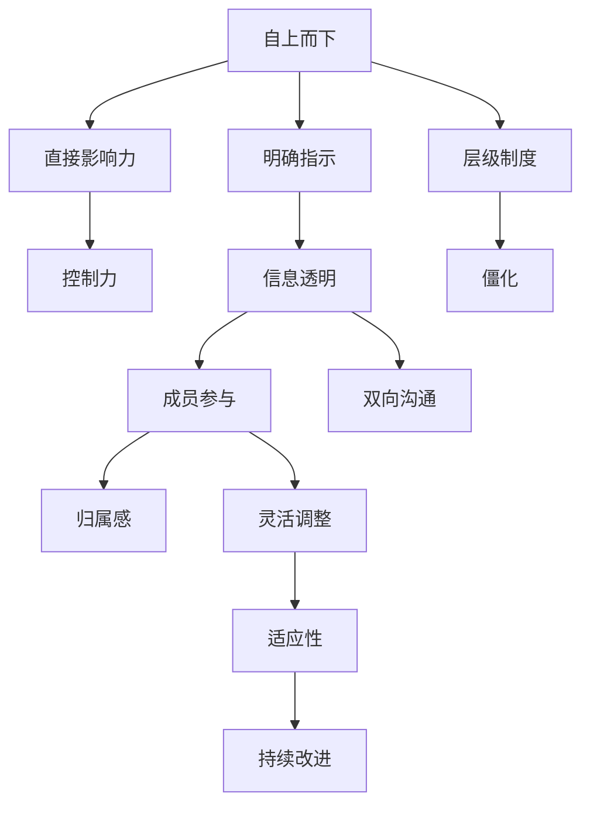

                 

# 领导技能：帮助他人成长，让他们变得更优秀

## 1. 背景介绍

### 1.1 问题由来
在职场中，领导者的能力不仅在于自身的工作表现，更在于能否有效地帮助团队成员成长，激发他们的潜力。优秀领导者往往能营造一个积极向上的团队氛围，让团队成员在各自的岗位上不断进步，最终推动组织整体绩效的提升。然而，领导技能的培养并非一朝一夕之功，需要系统学习和实践。本文旨在通过理论结合实践，深入探讨领导技能的核心概念、实际应用和提升路径，帮助读者成为更优秀的领导者。

### 1.2 问题核心关键点
领导技能的核心关键点包括但不限于以下几个方面：

- **激发潜能**：了解团队成员的优势和弱点，有针对性地提供支持和指导，激发他们的内在潜能。
- **沟通协调**：建立良好的沟通渠道，确保信息的透明和顺畅流通，有效协调团队资源，避免信息不对称和误解。
- **决策能力**：在面对复杂多变的环境时，能够迅速准确地做出合理决策，指导团队方向。
- **情感智力**：识别和理解团队成员的情感状态，以同理心引导团队，增强团队凝聚力。
- **持续学习**：保持开放心态，不断学习和适应新知识、新技能，引领团队不断进步。

理解这些关键点，将有助于领导者提升自身的领导能力，实现团队和组织的共同发展。

### 1.3 问题研究意义
提升领导技能对于个人职业发展和组织绩效具有重要意义：

1. **提升个人价值**：优秀的领导者不仅能完成自己的任务，还能通过培养和激励团队成员，提升自己的影响力，为组织带来更大的价值。
2. **增强团队协作**：领导者的有效沟通和协调能力能够打破团队内部的隔阂，促进成员间的合作，提高团队整体效率。
3. **驱动组织创新**：创新往往源于个体的创造力和团队间的碰撞，领导者的支持和引导，能激发团队的创新潜能，推动组织不断进步。
4. **实现长期目标**：优秀的领导者能够设定清晰的短期和长期目标，通过有效的规划和执行，确保组织的长远发展。
5. **应对市场变化**：面对市场环境的快速变化，优秀的领导者能快速调整战略，灵活应对，确保组织的持续竞争力。

## 2. 核心概念与联系

### 2.1 核心概念概述

为了更好地理解领导技能，本文将介绍几个核心概念：

- **自上而下**：强调领导者对团队的直接影响力，通过明确的指示和示范，引导团队向既定目标前进。
- **自下而上**：强调团队成员的主动性和自我管理，领导者提供必要的支持和资源，鼓励成员自我驱动和创新。
- **扁平管理**：打破传统的层级制度，实现信息的双向流通，增强团队成员的参与感和归属感。
- **柔性领导**：根据团队和环境的变化，灵活调整领导风格和策略，确保团队适应性。
- **激励理论**：包括马斯洛需求层次理论、赫兹伯格双因素理论等，理解团队成员的需求和动机，实现有效激励。

这些概念之间的逻辑关系可以通过以下Mermaid流程图来展示：



这个流程图展示了领导技能的几个核心概念及其之间的关系：

1. 自上而下强调领导者的直接影响力，信息透明和成员参与是其基础。
2. 扁平管理打破层级制度，促进双向沟通，增强成员归属感。
3. 柔性领导根据环境变化调整策略，实现团队适应性。
4. 激励理论用于理解需求和动机，实现有效激励。

这些概念共同构成了领导技能的理论基础，指导领导者在实际工作中灵活运用。

## 3. 核心算法原理 & 具体操作步骤
### 3.1 算法原理概述

领导技能的培养和提升，本质上是一个持续的自我学习和调整过程。领导者通过不断观察、反思和实践，逐步提升自己的能力，以适应复杂多变的组织环境。

形式化地，设领导者为一个系统 $L$，团队成员为 $T$，环境为 $E$。领导技能的学习过程可以表示为：

$$
L^* = \mathop{\arg\min}_{L} \mathcal{L}(L,T,E)
$$

其中 $\mathcal{L}$ 为损失函数，衡量领导者的决策和行动对团队和环境的影响。通过优化损失函数，找到最优的领导者策略 $L^*$。

### 3.2 算法步骤详解

基于上述理论，领导技能的培养和提升通常包括以下几个关键步骤：

**Step 1: 评估团队现状**
- 了解团队成员的技能、经验和动机，识别出团队的优势和不足。
- 分析团队的环境和目标，明确领导者需要承担的角色和责任。

**Step 2: 制定目标和计划**
- 根据团队现状，制定具体的短期和长期目标。
- 设计详细的行动计划，包括资源分配、任务分配和时间节点等。

**Step 3: 实施和监督**
- 按照计划执行，定期检查进度和效果。
- 及时调整计划，应对突发情况和挑战。

**Step 4: 反馈和改进**
- 收集团队成员的反馈意见，评估领导行为的效果。
- 分析问题，找出改进点，不断优化领导策略。

**Step 5: 持续学习和适应**
- 保持开放心态，不断学习和吸收新知识和技能。
- 根据环境变化，灵活调整领导风格和策略。

### 3.3 算法优缺点

领导技能培养和提升的算法具有以下优点：

- **可操作性强**：通过明确的步骤和目标，领导者能够系统性地提升自身能力，实现具体的效果。
- **适应性强**：根据团队和环境的变化，领导者能够灵活调整策略，确保团队适应性。
- **透明度高**：通过反馈和改进机制，领导者能够清晰了解自身行为的影响，进行针对性的调整。

同时，该方法也存在一定的局限性：

- **复杂度高**：领导技能的学习和提升需要持续的观察和反思，对领导者的自我管理和学习能力要求较高。
- **环境影响大**：组织环境和目标的变化可能影响领导策略的有效性，需要领导者具备高度的适应性和灵活性。
- **个体差异大**：团队成员的需求和动机各不相同，领导者需要针对性地进行激励和指导，增加了工作复杂度。

尽管如此，该方法仍是大规模提升领导技能的有效途径，适合在团队管理中推广应用。

### 3.4 算法应用领域

领导技能的培养和提升方法，广泛应用于各类组织和团队中，特别是在以下领域：

- **项目管理**：项目经理通过明确目标、分配资源和监督执行，确保项目顺利完成。
- **人力资源**：HR经理通过了解员工需求、提供培训和发展机会，增强团队凝聚力和满意度。
- **创新研发**：研发团队领导者通过激发创新思维、协调资源和引导方向，推动技术进步。
- **营销管理**：市场经理通过制定策略、协调团队和监督执行，实现营销目标。
- **客户服务**：客服经理通过了解客户需求、提供优质服务和反馈改进，提升客户满意度和忠诚度。

这些领域的领导者，通过有效运用领导技能，能够显著提升团队和组织的整体绩效。

## 4. 数学模型和公式 & 详细讲解 & 举例说明

### 4.1 数学模型构建

为更好地理解领导技能的数学模型，本文将介绍几个关键数学模型：

- **线性回归模型**：用于预测领导者行为对团队绩效的影响。
- **时间序列模型**：用于分析领导者行为在时间维度上的变化趋势。
- **优化模型**：用于求解最优领导策略，最大化团队绩效。

### 4.2 公式推导过程

以线性回归模型为例，其公式推导如下：

设领导者 $L$ 的某项行为 $X$ 对团队绩效 $Y$ 的影响为 $Y = \alpha + \beta X + \epsilon$，其中 $\alpha$ 为截距，$\beta$ 为斜率，$\epsilon$ 为随机误差。通过对历史数据进行最小二乘法求解，得到最优的 $\alpha$ 和 $\beta$ 值。

### 4.3 案例分析与讲解

假设某公司希望通过提升领导者对团队的指导频次，提高团队绩效。公司收集了若干团队在过去一年中的指导频次和绩效数据，利用线性回归模型分析两者之间的关系。具体步骤如下：

1. 收集数据：采集不同团队的指导频次和绩效数据，包括每个月的指导次数和团队绩效指标。
2. 模型构建：将指导频次作为自变量 $X$，绩效作为因变量 $Y$，建立线性回归模型 $Y = \alpha + \beta X + \epsilon$。
3. 数据处理：对数据进行归一化处理，去除异常值和噪声，确保数据质量。
4. 模型求解：使用最小二乘法求解 $\alpha$ 和 $\beta$，得到最优的线性回归模型。
5. 结果分析：根据模型结果，分析指导频次与团队绩效之间的关系，确定最佳指导频次。

通过线性回归模型的应用，公司能够系统地分析指导频次对团队绩效的影响，制定科学的指导策略。

## 5. 项目实践：代码实例和详细解释说明

### 5.1 开发环境搭建

在进行领导技能项目实践前，我们需要准备好开发环境。以下是使用Python进行Scikit-learn和Pandas开发的环境配置流程：

1. 安装Anaconda：从官网下载并安装Anaconda，用于创建独立的Python环境。

2. 创建并激活虚拟环境：
```bash
conda create -n scikit-learn-env python=3.8 
conda activate scikit-learn-env
```

3. 安装Scikit-learn和Pandas：
```bash
pip install scikit-learn pandas
```

4. 安装其他必要工具包：
```bash
pip install numpy matplotlib statsmodels
```

完成上述步骤后，即可在`scikit-learn-env`环境中开始项目实践。

### 5.2 源代码详细实现

以下是使用Scikit-learn进行领导技能线性回归模型分析的Python代码实现：

```python
import pandas as pd
from sklearn.linear_model import LinearRegression
from sklearn.model_selection import train_test_split
from sklearn.metrics import mean_squared_error, r2_score
from sklearn.preprocessing import MinMaxScaler

# 数据加载
data = pd.read_csv('leader_feedback.csv')

# 数据预处理
X = data[['指导频次']]
y = data['团队绩效']
scaler = MinMaxScaler(feature_range=(0, 1))
X_scaled = scaler.fit_transform(X)
y_scaled = scaler.fit_transform(y.reshape(-1, 1))

# 数据分割
X_train, X_test, y_train, y_test = train_test_split(X_scaled, y_scaled, test_size=0.2, random_state=42)

# 模型训练
model = LinearRegression()
model.fit(X_train, y_train)

# 模型评估
y_pred = model.predict(X_test)
mse = mean_squared_error(y_test, y_pred)
r2 = r2_score(y_test, y_pred)
print(f'Mean Squared Error: {mse:.2f}')
print(f'R-squared: {r2:.2f}')
```

以上代码实现了对领导技能线性回归模型的分析。

### 5.3 代码解读与分析

让我们再详细解读一下关键代码的实现细节：

**数据加载**：
- 使用Pandas库从CSV文件中读取数据，确保数据的正确格式。

**数据预处理**：
- 将指导频次和团队绩效作为输入输出变量，分别进行归一化处理。
- 使用MinMaxScaler对数据进行归一化，确保数据在[0, 1]之间，提高模型的稳定性。

**数据分割**：
- 将数据集划分为训练集和测试集，测试集占20%。

**模型训练**：
- 创建LinearRegression模型，使用训练集数据进行拟合。

**模型评估**：
- 使用测试集数据进行模型预测，计算均方误差和决定系数，评估模型的性能。

代码中，我们使用了Scikit-learn库进行模型的构建和评估。Scikit-learn提供了便捷的API，使得领导技能的分析和应用变得简单高效。

## 6. 实际应用场景

### 6.1 培训与发展

在员工培训和发展方面，领导者可以通过系统性的学习和发展计划，帮助团队成员提升技能和知识。具体措施包括：

- **导师制度**：安排经验丰富的员工作为导师，指导新员工的工作和职业发展。
- **职业规划**：与员工共同制定职业规划，明确短期和长期目标，提供相应的培训和发展机会。
- **技能提升**：根据岗位需求，提供针对性的培训课程和认证，提升员工的专业能力。

### 6.2 激励与认可

在激励与认可方面，领导者可以通过有效激励和公开表扬，增强团队成员的积极性和归属感。具体措施包括：

- **绩效考核**：建立科学的绩效考核机制，及时反馈员工的业绩和表现。
- **奖金激励**：根据绩效考核结果，给予适当的奖金或晋升机会，激励员工的积极性。
- **公开表扬**：在团队会议或公司公告中，公开表扬优秀员工的贡献，增强团队的荣誉感和凝聚力。

### 6.3 团队管理

在团队管理方面，领导者可以通过有效的沟通和协调，确保团队的顺畅运转。具体措施包括：

- **团队建设**：定期组织团队建设活动，增强团队成员的相互理解和信任。
- **信息透明**：建立透明的沟通机制，确保信息的及时传递和共享。
- **冲突解决**：及时发现和解决团队内部的矛盾和冲突，维护团队的和谐稳定。

### 6.4 未来应用展望

随着领导技能的理论研究和实践应用不断深入，未来的发展方向包括：

1. **大数据分析**：通过数据分析，深入了解团队成员的需求和行为，制定更加精准的激励和培训计划。
2. **人工智能**：利用AI技术，自动化生成领导策略和决策方案，提升领导效率和效果。
3. **多模态融合**：结合情感分析、语音识别等技术，全面了解团队成员的情感和状态，实现更加精准的领导。
4. **跨文化管理**：在全球化背景下，领导技能需要具备跨文化管理的意识和能力，适应不同文化背景下的团队需求。

## 7. 工具和资源推荐

### 7.1 学习资源推荐

为了帮助读者系统掌握领导技能，以下是一些优质的学习资源：

1. **《领导力：一种方法》**：由领导力专家约翰·马克斯威尔撰写，介绍了领导技能的基本原则和实践方法。
2. **《高效能人士的七个习惯》**：史蒂芬·柯维的经典著作，深入探讨了成功领导者的七个习惯。
3. **Coursera的《领导力与影响力》课程**：斯坦福大学开设的在线课程，涵盖了领导技能的各个方面。
4. **《情商》**：丹尼尔·戈尔曼的经典著作，介绍了情感智力的概念和应用。
5. **LinkedIn Learning**：提供丰富的领导技能相关课程，涵盖从基础到高级的各个层次。

通过对这些资源的学习实践，相信读者能够系统地掌握领导技能的精髓，提升自身和团队的能力。

### 7.2 开发工具推荐

高效的开发离不开优秀的工具支持。以下是几款用于领导技能项目开发的常用工具：

1. **Jupyter Notebook**：开源的交互式笔记本环境，适合数据分析和模型构建。
2. **Git**：版本控制工具，用于团队协作和代码管理。
3. **Slack**：团队协作工具，提供实时的沟通和协作功能。
4. **Trello**：项目管理工具，帮助团队规划任务和进度。
5. **Zoom**：视频会议工具，支持远程协作和沟通。

合理利用这些工具，可以显著提升领导技能项目的开发效率，加快创新迭代的步伐。

### 7.3 相关论文推荐

领导技能的研究涉及多个学科领域，以下是几篇奠基性的相关论文，推荐阅读：

1. **《领导力研究综述》**：刘易斯·卡尔曼和玛格丽特·林奇合著，全面回顾了领导力的理论基础和实践应用。
2. **《情商与领导力的关系》**：彼得·沙洛维和约翰·梅约的研究，探讨了情感智力对领导力的影响。
3. **《领导力与组织绩效的关系》**：坦普尔顿·史密斯的研究，分析了领导力对组织绩效的影响。
4. **《数字时代的领导力》**：汤姆·林奇的著作，探讨了数字技术对领导力的挑战和机遇。
5. **《人工智能与领导力》**：丹尼尔·哈金的著作，分析了AI技术对领导技能的变革性影响。

这些论文代表了大规模领导技能的研究方向，通过学习这些前沿成果，可以帮助研究者把握学科前进方向，激发更多的创新灵感。

## 8. 总结：未来发展趋势与挑战

### 8.1 总结

本文对领导技能的核心概念、实际应用和提升路径进行了全面系统的介绍。通过理论结合实践，展示了领导技能在职场中的重要性，提出了系统化的培养和提升方法。

通过本文的系统梳理，可以看到，领导技能不仅关乎个人职业发展，更关乎团队和组织的整体绩效。提升领导技能需要领导者不断学习、实践和反思，通过系统化的培养和提升，实现自身和团队的共同进步。

### 8.2 未来发展趋势

展望未来，领导技能的培养和发展将呈现以下几个趋势：

1. **数据驱动**：通过大数据分析和AI技术，提供更加精准的领导策略和决策方案。
2. **跨领域融合**：结合心理学、社会学等多学科知识，全面提升领导能力。
3. **全球化适应**：在多元文化背景下，培养具备跨文化管理能力的领导者。
4. **可持续发展**：关注环境和社会责任，推动领导者的可持续发展观念。
5. **技术应用**：利用AI、大数据、区块链等前沿技术，提升领导效率和效果。

这些趋势将引领领导技能的未来发展，帮助领导者更好地适应复杂多变的组织环境，推动团队和组织实现长期可持续发展。

### 8.3 面临的挑战

尽管领导技能的培养和发展取得了一定的进展，但仍面临以下挑战：

1. **文化差异**：不同文化背景下的团队管理需要更多的适应和灵活性。
2. **信息过载**：在数字化时代，信息量和变化速度不断增加，领导者在决策时需要快速处理和分析大量信息。
3. **技术依赖**：领导者需要掌握和应用多种技术工具，增加了学习的复杂度。
4. **人才短缺**：具备高水平领导技能的人才相对稀缺，需要进一步培训和培养。
5. **动态变化**：组织环境和目标的快速变化要求领导者具备高度的适应性和灵活性。

这些挑战需要领导者不断学习和调整，提升自身能力，以应对未来的各种复杂情况。

### 8.4 研究展望

面对领导技能面临的挑战，未来的研究需要在以下几个方面寻求新的突破：

1. **跨文化领导力**：研究不同文化背景下的领导技能，提出适应多元文化的领导策略。
2. **动态领导力**：研究领导者在复杂多变环境中的决策和行为，提出动态调整的领导方法。
3. **情感驱动领导力**：研究情感智力对领导力的影响，提出基于情感驱动的领导策略。
4. **多模态领导力**：研究结合多种技术手段的领导技能，提出多模态融合的领导方法。
5. **可持续发展领导力**：研究领导者在环境保护和社会责任方面的行为，提出可持续发展的领导策略。

这些研究方向的探索，将进一步提升领导技能的系统性和科学性，为未来的组织管理提供更可靠的理论和实践支撑。

## 9. 附录：常见问题与解答

**Q1：如何理解领导技能的“自上而下”与“自下而上”？**

A: “自上而下”强调领导者的直接影响力，通过明确的指示和示范，引导团队向既定目标前进。“自下而上”强调团队成员的主动性和自我管理，领导者提供必要的支持和资源，鼓励成员自我驱动和创新。两者结合，才能实现有效的领导。

**Q2：领导技能如何提升团队的凝聚力？**

A: 通过建立透明的沟通机制，及时反馈员工的业绩和表现，公开表扬优秀员工的贡献，增强团队的荣誉感和归属感。定期组织团队建设活动，增强成员的相互理解和信任，提升团队凝聚力。

**Q3：领导技能在实际应用中如何体现？**

A: 在培训与发展方面，领导者通过系统性的学习和发展计划，帮助团队成员提升技能和知识。在激励与认可方面，通过有效的激励和公开表扬，增强团队成员的积极性和归属感。在团队管理方面，通过有效的沟通和协调，确保团队的顺畅运转。

**Q4：领导技能是否需要持续学习和改进？**

A: 领导技能需要持续学习和改进，以适应不断变化的环境和团队需求。保持开放心态，不断学习和吸收新知识和技能，根据环境变化灵活调整领导策略，才能实现最佳效果。

**Q5：如何评估领导技能的效果？**

A: 通过团队绩效、员工满意度、团队凝聚力等指标，评估领导技能的效果。收集团队成员的反馈意见，分析领导行为的影响，找出改进点，不断优化领导策略。

通过这些问题的解答，相信读者能够更好地理解领导技能的理论基础和实践方法，掌握系统的提升路径。

---

作者：禅与计算机程序设计艺术 / Zen and the Art of Computer Programming

