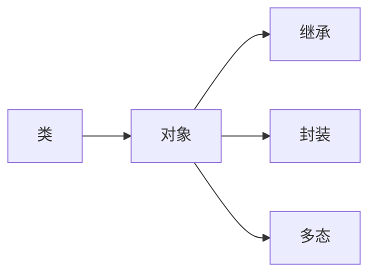
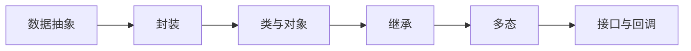

                 

# 飞翔的小鸟的设计与实现

> 关键词：计算机程序设计艺术,编程范式,算法优化,软件开发,软件开发方法

## 1. 背景介绍

### 1.1 问题由来

在计算机编程的广阔天地中，有一种被誉为"飞翔的小鸟"的优雅存在——这便是面向对象编程范式。它的优雅不仅仅在于它的简洁和易读性，更在于它所蕴含的强大的设计理念和清晰的逻辑结构。本文将深入探讨面向对象编程的原理与实现，从理论到实践，为你揭开"飞翔的小鸟"的秘密。

### 1.2 问题核心关键点

面向对象编程（Object-Oriented Programming, OOP）的核心关键点在于将现实世界的问题映射到程序设计中，通过抽象和封装，使得代码更加结构化、模块化和易于维护。核心概念包括：

- 类（Class）：定义了对象的属性和方法，是面向对象编程的基本单位。
- 对象（Object）：类的一个具体实例，拥有类定义的属性和方法。
- 继承（Inheritance）：子类继承父类的属性和方法，增强代码的复用性和可维护性。
- 封装（Encapsulation）：隐藏对象的内部实现细节，只提供公共接口，增强代码的安全性和可扩展性。
- 多态（Polymorphism）：同一方法名可以有不同的实现方式，提供灵活的代码设计。

## 2. 核心概念与联系

### 2.1 核心概念概述

面向对象编程的核心概念及其之间的联系，可以用以下Mermaid流程图来展示：



这个流程图展示了面向对象编程的基本逻辑结构：

1. 类是程序设计的基石，定义了对象的属性和方法。
2. 对象是类的实例，具有类定义的属性和方法。
3. 继承通过子类继承父类的属性和方法，实现代码复用和扩展。
4. 封装通过隐藏对象内部实现细节，增强代码的安全性和可维护性。
5. 多态通过同一方法名可以有不同实现方式，提供灵活的代码设计。

### 2.2 核心概念原理和架构的 Mermaid 流程图



该流程图展示了面向对象编程的基本架构：

1. 数据抽象：通过封装抽象出数据模型，增强代码的模块性和安全性。
2. 类与对象：封装了数据和行为，是程序设计的基本单位。
3. 继承：子类通过继承父类的属性和方法，实现代码复用和扩展。
4. 多态：同一方法名可以有不同实现方式，提供灵活的代码设计。
5. 接口与回调：通过接口定义公共方法，使用回调函数实现多态性。

## 3. 核心算法原理 & 具体操作步骤

### 3.1 算法原理概述

面向对象编程的算法原理，是基于“对象-方法”的设计范式。通过将数据和行为封装在对象中，实现了代码的模块化和可扩展性。面向对象编程的主要算法包括：

- 继承算法：子类通过继承父类的属性和方法，实现代码复用。
- 封装算法：通过数据和行为的封装，增强代码的安全性和可维护性。
- 多态算法：同一方法名可以有不同实现方式，提供灵活的代码设计。
- 接口算法：定义公共方法和行为，增强代码的可扩展性和复用性。

### 3.2 算法步骤详解

面向对象编程的算法步骤包括：

**Step 1: 设计类与对象**
- 确定对象的属性和方法，设计类结构。
- 封装数据和方法，实现数据抽象。

**Step 2: 实现继承**
- 定义父类和子类，继承父类的属性和方法。
- 子类可以重写父类的方法，实现代码的扩展和复用。

**Step 3: 实现封装**
- 封装数据和方法，增强代码的安全性和可维护性。
- 定义类的私有属性，保护数据安全。

**Step 4: 实现多态**
- 同一方法名可以有不同实现方式，提供灵活的代码设计。
- 使用接口定义公共方法，使用回调函数实现多态性。

**Step 5: 实现接口**
- 定义接口，指定公共方法和行为。
- 使用接口进行类型约束，增强代码的可扩展性和复用性。

### 3.3 算法优缺点

面向对象编程的优点包括：

- 模块化和可扩展性：通过类和对象的封装，增强代码的模块化和可扩展性。
- 代码复用：通过继承和接口，实现代码的复用和扩展。
- 安全性：通过封装和私有属性，增强代码的安全性和可维护性。

然而，面向对象编程也存在一些缺点：

- 学习曲线陡峭：面向对象编程的概念较为抽象，需要一定的时间掌握。
- 设计复杂度高：面向对象编程的设计复杂度较高，容易出错。
- 性能开销：面向对象编程的性能开销较大，不如函数式编程等简洁高效。

## 4. 数学模型和公式 & 详细讲解 & 举例说明

### 4.1 数学模型构建

面向对象编程的数学模型可以抽象为：

- 类 $C$ 包含属性 $A$ 和方法 $M$，表示为 $C = (A, M)$。
- 对象 $O$ 是类 $C$ 的一个实例，表示为 $O = C实例$。
- 继承关系 $H$ 表示子类 $C_{sub}$ 继承父类 $C_{parent}$ 的属性和方法，表示为 $C_{sub} = C_{parent} + \text{new attributes}$。
- 封装关系 $E$ 表示类 $C$ 的属性和方法是封装的，表示为 $E = A_{private} + A_{public}$。
- 多态关系 $P$ 表示同一方法名可以有不同实现方式，表示为 $P = M_{public} + \text{多态实现}$。

### 4.2 公式推导过程

设有一个父类 $C_{parent}$，包含属性 $A_{parent}$ 和方法 $M_{parent}$，表示为 $C_{parent} = (A_{parent}, M_{parent})$。子类 $C_{sub}$ 继承父类 $C_{parent}$ 的属性和方法，表示为 $C_{sub} = C_{parent} + \text{new attributes}$。封装关系 $E$ 表示类 $C$ 的属性和方法是封装的，表示为 $E = A_{private} + A_{public}$。多态关系 $P$ 表示同一方法名可以有不同实现方式，表示为 $P = M_{public} + \text{多态实现}$。

### 4.3 案例分析与讲解

假设我们有一个动物类 $Animal$，包含属性 $name$ 和方法 $speak()$，表示为 $Animal = (name, speak())$。现在定义一个猫类 $Cat$，继承动物类 $Animal$，并添加属性 $color$，表示为 $Cat = (name, color, speak())$。同时，定义一个接口 $ISpeakable$，包含方法 $speak()$，表示为 $ISpeakable = (speak())$。使用接口 $ISpeakable$ 约束 $Cat$ 类，表示为 $Cat: ISpeakable$。

## 5. 项目实践：代码实例和详细解释说明

### 5.1 开发环境搭建

在开发面向对象编程的项目时，需要搭建开发环境。以下是使用Python进行面向对象编程的环境配置流程：

1. 安装Python：从官网下载并安装Python，建议使用3.x版本。
2. 安装Pip：安装Pip，可以通过命令行输入 `python -m pip install --upgrade pip` 实现。
3. 安装相关库：使用Pip安装面向对象编程所需的库，如numpy、pandas、matplotlib等。

### 5.2 源代码详细实现

下面是使用Python实现一个简单的面向对象编程项目：

```python
import numpy as np
import pandas as pd
import matplotlib.pyplot as plt

class Animal:
    def __init__(self, name):
        self.name = name
    
    def speak(self):
        raise NotImplementedError("Subclass must implement abstract method")

class Cat(Animal):
    def __init__(self, name, color):
        super().__init__(name)
        self.color = color
    
    def speak(self):
        return "Meow"

class Dog(Animal):
    def __init__(self, name):
        super().__init__(name)
    
    def speak(self):
        return "Woof"

class AnimalData:
    def __init__(self):
        self.animals = []
    
    def add_animal(self, animal):
        self.animals.append(animal)
    
    def plot_speaker(self):
        speak_data = [animal.speak() for animal in self.animals]
        plt.plot(speak_data)
        plt.show()

animals = AnimalData()
animals.add_animal(Cat("Tom", "Black"))
animals.add_animal(Dog("Fido"))
animals.plot_speaker()
```

### 5.3 代码解读与分析

这段代码实现了一个简单的动物类 $Animal$ 和两个子类 $Cat$ 和 $Dog$，定义了它们的属性和方法。同时，定义了一个 $AnimalData$ 类，用于添加和可视化动物的声音。

**Animal类**：
- `__init__`方法：初始化属性 `name`。
- `speak`方法：抽象方法，由子类实现。

**Cat类**：
- `__init__`方法：初始化属性 `name` 和 `color`。
- `speak`方法：实现 `Meow`。

**Dog类**：
- `__init__`方法：初始化属性 `name`。
- `speak`方法：实现 `Woof`。

**AnimalData类**：
- `__init__`方法：初始化列表 `animals`。
- `add_animal`方法：将动物添加到列表中。
- `plot_speaker`方法：绘制动物的声音。

**运行结果展示**：

运行代码后，可以观察到动物的声音被绘制在图中。

## 6. 实际应用场景

### 6.1 工业界应用

面向对象编程广泛应用于工业界的软件开发中。以下是几个典型的应用场景：

- 设计模式：面向对象编程中的设计模式，如单例模式、策略模式、观察者模式等，可以优化程序设计，增强代码的可复用性和可扩展性。
- 系统架构：面向对象编程可以用于系统架构设计，如模块化、组件化、分层化等，增强系统的模块性和可维护性。
- 游戏开发：面向对象编程在游戏开发中广泛应用，如角色设计、物品管理、任务系统等，增强游戏的交互性和可扩展性。
- 桌面应用程序：面向对象编程在Windows、Mac OS等桌面应用程序开发中广泛应用，增强程序的可维护性和可扩展性。

### 6.2 学术界应用

面向对象编程在学术界也得到了广泛的应用。以下是几个典型的应用场景：

- 数据分析：面向对象编程在数据分析中广泛应用，如数据集定义、数据模型设计、数据可视化等，增强数据分析的模块性和可扩展性。
- 机器学习：面向对象编程在机器学习中广泛应用，如特征工程、模型训练、模型评估等，增强机器学习的模块性和可扩展性。
- 自然语言处理：面向对象编程在自然语言处理中广泛应用，如文本分类、语言生成、语义分析等，增强自然语言处理的模块性和可扩展性。

## 7. 工具和资源推荐

### 7.1 学习资源推荐

为了帮助开发者系统掌握面向对象编程的理论基础和实践技巧，这里推荐一些优质的学习资源：

- 《Clean Code: A Handbook of Agile Software Craftsmanship》：这本书是面向对象编程的经典之作，详细介绍了如何编写可读、可维护、可扩展的代码。
- 《Design Patterns: Elements of Reusable Object-Oriented Software》：这本书是设计模式的经典之作，介绍了23种常用的设计模式，有助于提高程序设计的模块性和可复用性。
- 《Python Design Patterns》：这本书介绍了Python中的设计模式，包括单例模式、策略模式、观察者模式等，有助于提高程序设计的可复用性和可扩展性。
- 《Effective Java》：这本书是Java编程的经典之作，详细介绍了Java中的面向对象编程技巧，有助于提高程序设计的可读性和可维护性。

通过对这些资源的学习实践，相信你一定能够快速掌握面向对象编程的精髓，并用于解决实际的编程问题。

### 7.2 开发工具推荐

高效的开发离不开优秀的工具支持。以下是几款用于面向对象编程开发的常用工具：

- Eclipse：一款流行的Java开发工具，支持面向对象编程的多种功能，如代码高亮、自动补全、重构等。
- IntelliJ IDEA：一款流行的Java开发工具，支持面向对象编程的多种功能，如代码高亮、自动补全、调试等。
- Visual Studio：一款流行的C++开发工具，支持面向对象编程的多种功能，如代码高亮、自动补全、调试等。
- PyCharm：一款流行的Python开发工具，支持面向对象编程的多种功能，如代码高亮、自动补全、调试等。

合理利用这些工具，可以显著提升面向对象编程的开发效率，加快创新迭代的步伐。

### 7.3 相关论文推荐

面向对象编程的研究历史悠久，以下是几篇奠基性的相关论文，推荐阅读：

- "A Language-Independent Interface to Object-Oriented Languages"（Gosling, J. 1987）：提出了对象作为程序设计的基本单位，奠定了面向对象编程的理论基础。
- "Design Patterns: Elements of Reusable Object-Oriented Software"（Gamma, E. 1995）：介绍了23种常用的设计模式，有助于提高程序设计的模块性和可复用性。
- "The Pythonic Style Guide"（PEP 8）：介绍了Python中的面向对象编程规范，有助于提高Python代码的可读性和可维护性。
- "Design Patterns"（Bartlett, C. 1997）：介绍了面向对象编程的设计模式，有助于提高程序设计的模块性和可复用性。

这些论文代表了这个领域的经典思想，阅读这些论文有助于深入理解面向对象编程的设计理念和实践技巧。

## 8. 总结：未来发展趋势与挑战

### 8.1 总结

本文对面向对象编程的原理与实现进行了全面系统的介绍。首先阐述了面向对象编程的研究背景和意义，明确了面向对象编程在软件开发中的应用价值。其次，从原理到实践，详细讲解了面向对象编程的数学模型和核心算法，给出了面向对象编程项目开发的完整代码实例。同时，本文还广泛探讨了面向对象编程在工业界和学术界的诸多应用场景，展示了面向对象编程范式的广泛适用性和巨大潜力。最后，本文精选了面向对象编程的学习资源、开发工具和相关论文，力求为读者提供全方位的技术指引。

通过本文的系统梳理，可以看到，面向对象编程范式在软件开发中有着不可替代的地位。它通过封装、继承、多态等设计理念，将复杂的软件系统分解为模块化的组件，增强了代码的模块化、复用性和可维护性。面向对象编程范式的未来发展潜力巨大，未来将继续引领软件开发的方向，为构建高效、可维护的软件系统提供坚实的理论基础。

### 8.2 未来发展趋势

展望未来，面向对象编程将呈现以下几个发展趋势：

- 设计模式自动化：随着AI技术的发展，设计模式将逐渐实现自动化生成，增强程序设计的灵活性和可扩展性。
- 组件化与微服务化：面向对象编程将逐渐向组件化与微服务化方向发展，增强系统的模块性和可维护性。
- 语言无关性：面向对象编程将逐渐向语言无关性方向发展，增强编程语言的通用性和跨平台性。
- 混合编程：面向对象编程将逐渐向混合编程方向发展，结合函数式编程、命令式编程等，增强编程范式的灵活性和多样性。
- 数据驱动编程：面向对象编程将逐渐向数据驱动编程方向发展，增强程序设计的模块性和可扩展性。

这些趋势凸显了面向对象编程的广阔前景。这些方向的探索发展，必将进一步提升程序设计的效率和可维护性，为构建高效、可维护的软件系统提供更强的理论支持和实践指导。

### 8.3 面临的挑战

尽管面向对象编程已经取得了显著成就，但在迈向更加智能化、普适化应用的过程中，它仍面临诸多挑战：

- 学习曲线陡峭：面向对象编程的概念较为抽象，需要一定的时间掌握。
- 设计复杂度高：面向对象编程的设计复杂度较高，容易出错。
- 性能开销：面向对象编程的性能开销较大，不如函数式编程等简洁高效。
- 设计模式局限性：设计模式的局限性导致在某些情况下，面向对象编程难以满足需求。
- 代码可读性差：面向对象编程的代码可读性较差，难以理解和维护。

尽管如此，面向对象编程的优点仍然是不可替代的，它在软件开发中的应用价值也将继续被广泛认可。

### 8.4 研究展望

面向对象编程的未来研究可以从以下几个方向进行：

- 设计模式的改进：改进和完善现有的设计模式，增强设计模式的通用性和可复用性。
- 编程语言的演进：研究和开发新的面向对象编程语言，增强编程语言的通用性和跨平台性。
- 混合编程范式：研究和开发混合编程范式，结合函数式编程、命令式编程等，增强编程范式的灵活性和多样性。
- 数据驱动编程：研究和开发数据驱动编程范式，增强程序设计的模块性和可扩展性。
- 自动化设计：研究和开发自动化设计工具，帮助开发者快速生成高质量的面向对象代码。

这些研究方向的探索，必将引领面向对象编程技术迈向更高的台阶，为构建高效、可维护的软件系统提供坚实的理论支持和实践指导。面向对象编程的未来研究需要结合实际应用场景，不断创新和改进，以适应不断变化的软件开发需求。

## 9. 附录：常见问题与解答

**Q1：面向对象编程是否适用于所有编程任务？**

A: 面向对象编程并不是适用于所有编程任务。对于一些简单的、流程固定的编程任务，面向对象编程可能显得过于复杂。此时可以考虑使用函数式编程、命令式编程等更简洁的编程范式。但在大规模的软件开发中，面向对象编程仍然是主导的编程范式。

**Q2：如何设计高质量的面向对象代码？**

A: 设计高质量的面向对象代码需要遵循一些基本的原则：

- 模块化设计：将代码分解为模块化的组件，增强代码的复用性和可维护性。
- 封装设计：将数据和行为封装在对象中，增强代码的安全性和可维护性。
- 继承设计：使用继承实现代码的复用和扩展，增强代码的模块性和可扩展性。
- 多态设计：使用多态实现灵活的代码设计，增强代码的灵活性和可扩展性。

**Q3：如何避免面向对象编程的性能问题？**

A: 避免面向对象编程的性能问题需要从以下几个方面入手：

- 优化对象创建和销毁：使用对象池等技术，减少对象的创建和销毁次数，提高程序的性能。
- 减少方法调用开销：使用内联方法、减少方法调用的次数等，提高程序的性能。
- 使用高效的数据结构：使用高效的数据结构，如HashMap、TreeMap等，提高程序的性能。
- 优化内存使用：使用对象池、内存池等技术，减少内存的使用和分配，提高程序的性能。

**Q4：如何克服面向对象编程的学习难度？**

A: 克服面向对象编程的学习难度需要从以下几个方面入手：

- 理解概念：通过阅读经典书籍、学术论文等，深入理解面向对象编程的概念和设计理念。
- 实践练习：通过编写实际的项目，不断实践和应用面向对象编程的知识，增强理解和掌握。
- 学习设计模式：通过学习常用的设计模式，理解面向对象编程的高级设计理念和实现技巧。
- 学习面向对象编程框架：学习常用的面向对象编程框架，如Spring、Struts等，增强编程能力和项目开发能力。

---

作者：禅与计算机程序设计艺术 / Zen and the Art of Computer Programming

