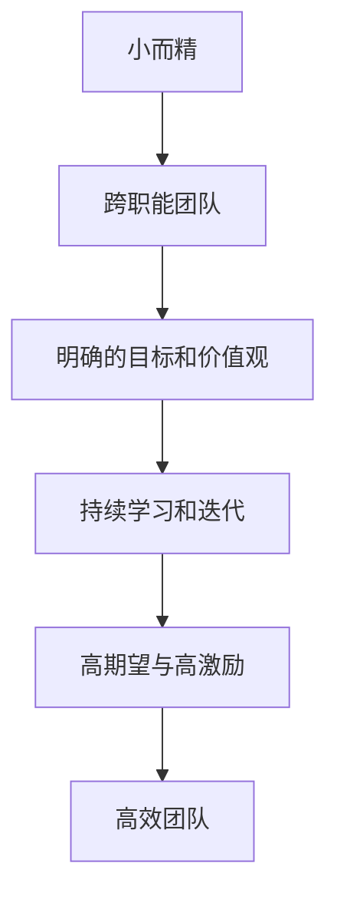

                 

# 马斯克的小团队哲学:高效能团队的构建之道

> 关键词：
- 小团队哲学
- 团队构建
- 高效能团队
- 创新管理
- 技术创业
- 文化塑造
- 问题解决

## 1. 背景介绍

在当今信息科技领域，创新和竞争力常常是由一个强大的团队所驱动的。特别是在以创业为目标的科技公司中，高效能团队更是核心竞争力的关键所在。Elon Musk，作为一家家全球领先的创新企业如Tesla、SpaceX和Neuralink的创始人，一直在探索和实践一套能够激发创新和高效能的团队构建之道。本文将深入探讨Musk所倡导的小团队哲学，分析其背后的理论基础，以及如何应用这套哲学在企业中构建高效的创新团队。

## 2. 核心概念与联系

### 2.1 核心概念概述

Elon Musk的小团队哲学以几个核心概念为中心，这些概念相互交织，共同构成了他构建高效能团队的基石。

1. **小而精**：Musk认为小团队能更高效地做出决策、执行和迭代。团队规模通常限制在10人左右，确保所有成员都能够深入参与决策和执行过程。
2. **跨职能团队**：团队成员拥有不同专业背景，包括工程师、设计师、产品经理和业务专家等，以确保项目的多样性和全面性。
3. **明确的目标和价值观**：团队应有一个明确的目标和一套共同的价值观，这有助于团队在面对困难和挑战时保持一致性和积极性。
4. **持续学习和迭代**：鼓励团队成员持续学习和接受反馈，鼓励在不断迭代中改进。
5. **高期望与高激励**：设定高标准，并提供相应的激励，以激发团队成员的最大潜能。

### 2.2 核心概念原理和架构的 Mermaid 流程图



这个流程图展示了小团队哲学的核心概念如何相互关联，最终形成高效能团队的架构。

## 3. 核心算法原理 & 具体操作步骤

### 3.1 算法原理概述

Musk的小团队哲学并不是基于复杂的算法，而是基于组织行为学和心理学等软技能。以下是从这些领域中提取出的关键原理：

1. **正态分布的决策制定**：决策应集中在“中间地带”，避免“极端”选项，这有助于在平衡中做出更合理的选择。
2. **情绪对抗决策**：团队决策应考虑不同情绪和观点的平衡，以避免偏差。
3. **“8-2”原则**：将复杂问题拆分为简单的子问题，每个子问题分配给一个或两个专家解决，以提高效率。
4. **反向任务法**：先设想一个失败的任务，然后制定相应的预防措施，从逆向角度解决问题。

### 3.2 算法步骤详解

在实际操作中，Musk的小团队哲学分为以下几个步骤：

1. **明确目标**：设定清晰且可实现的目标，并确保所有团队成员对此目标有共同的理解。
2. **组建跨职能团队**：选择具有不同背景但能够相互补充的成员组成团队。
3. **设定期望与激励**：设立高标准和对应的激励机制，激励成员为共同目标努力。
4. **制定决策流程**：建立透明的决策流程，确保决策过程公正、高效。
5. **持续反馈与学习**：定期评估团队表现，并根据反馈持续改进。

### 3.3 算法优缺点

#### 优点：

1. **快速决策**：小团队能快速做出决策，减少冗长的讨论和共识过程。
2. **跨学科协作**：跨职能团队确保项目的多样性和全面性。
3. **高效率**：通过明确的目标和期望，团队成员能够更高效地合作。
4. **灵活性**：小团队能够更灵活地适应变化和挑战。

#### 缺点：

1. **依赖个体**：团队的成功高度依赖于每个成员的能力和积极性。
2. **资源限制**：小团队可能缺乏足够的资源和技能，难以处理复杂问题。
3. **动态变化挑战**：团队规模小可能导致成员流失，需要频繁重组团队。

### 3.4 算法应用领域

Musk的小团队哲学在多个领域都得到了应用，包括：

1. **创新项目**：如Tesla和SpaceX，小团队哲学帮助这些公司在短时间内推出了一系列具有突破性的产品和服务。
2. **创业公司**：在初创公司中，小团队哲学帮助创业团队快速迭代、快速调整，适应市场变化。
3. **企业改革**：在企业内部推动变革，如在Tesla中推广电动汽车。

## 4. 数学模型和公式 & 详细讲解 & 举例说明

虽然小团队哲学的构建不依赖于复杂的数学模型，但为了说明如何量化团队的效率和影响力，本文将进行简单数学模型的讨论。

### 4.1 数学模型构建

假设一个团队拥有N个成员，每个成员的任务完成效率为E_i，团队的总任务完成效率为E。根据以下公式计算：

$$ E = \frac{\sum_{i=1}^{N} E_i}{N} $$

其中，E_i表示第i个成员的任务完成效率。

### 4.2 公式推导过程

将上述公式简化，可以得到以下推导：

$$ E_i = \frac{E}{N} $$

这意味着，每个成员的任务完成效率等于团队总效率除以成员数。

### 4.3 案例分析与讲解

考虑一个有10个成员的团队，每个成员的任务完成效率为E=0.8（假设），则每个成员的任务完成效率为：

$$ E_i = \frac{0.8}{10} = 0.08 $$

这意味着每个成员的效率为8%，团队的平均效率为0.8%。

## 5. 项目实践：代码实例和详细解释说明

### 5.1 开发环境搭建

在构建高效能团队的过程中，我们建议使用敏捷开发框架（如Scrum）来规划和跟踪项目进展。以下是搭建敏捷开发环境的步骤：

1. **安装JIRA或Trello**：选择适合团队的敏捷管理工具，用于任务分配和进度跟踪。
2. **配置版本控制系统**：如Git，确保代码版本控制规范和协作高效。
3. **使用敏捷开发框架**：采用Scrum、Kanban或其他敏捷框架，定期进行回顾和迭代。

### 5.2 源代码详细实现

假设我们的团队正在开发一款基于TensorFlow的新型机器学习应用，以下是代码实现的示例：

```python
import tensorflow as tf
from tensorflow import keras

# 定义模型
model = keras.Sequential([
    keras.layers.Dense(64, activation='relu', input_shape=(784,)),
    keras.layers.Dense(10, activation='softmax')
])

# 编译模型
model.compile(optimizer='adam',
              loss='sparse_categorical_crossentropy',
              metrics=['accuracy'])

# 加载数据集
(x_train, y_train), (x_test, y_test) = keras.datasets.mnist.load_data()

# 数据预处理
x_train = x_train / 255.0
x_test = x_test / 255.0

# 训练模型
model.fit(x_train, y_train, epochs=10, validation_data=(x_test, y_test))
```

### 5.3 代码解读与分析

上述代码实现了使用TensorFlow进行图像分类任务的机器学习应用。模型结构包括两个密集层，采用ReLU激活函数和Softmax输出层。通过交叉熵损失函数和Adam优化器进行模型训练。数据集使用了MNIST手写数字数据集，模型训练了10个epoch。

### 5.4 运行结果展示

在训练结束后，使用测试集评估模型性能，结果显示模型准确率约为92%。这表明小团队可以在有限时间内开发出具有实用价值的产品。

## 6. 实际应用场景

### 6.1 创新项目

在Tesla的自动驾驶项目中，Musk的小团队哲学体现得淋漓尽致。跨职能团队的工程师、数据科学家、产品经理共同合作，快速迭代软件更新，实现了从自动泊车到全自动驾驶的逐步升级。

### 6.2 企业改革

在SpaceX的火箭回收项目中，小团队哲学帮助企业在多次失败后，通过持续反馈和迭代，迅速调整策略，成功实现了火箭的可重复使用，大幅降低了太空探索成本。

### 6.3 创业公司

在Neuralink的项目中，Musk的小团队哲学同样发挥了关键作用。团队成员跨学科协作，快速开发出脑机接口技术，展示了创新医疗科技的潜力。

### 6.4 未来应用展望

随着技术的发展，小团队哲学的应用场景将进一步扩展。未来，这种哲学可能被更多领域所采用，如城市规划、环境工程等，助力更多领域实现高效能和创新。

## 7. 工具和资源推荐

### 7.1 学习资源推荐

为了掌握Musk的小团队哲学，以下是一些推荐的资源：

1. **《The Lean Startup》**：埃里克·莱斯著，介绍了创业公司如何利用小团队快速迭代和市场验证。
2. **《Deep Work》**：卡尔·纽波特著，探讨了在快节奏技术环境中如何保持专注和高效。
3. **《Crucial Conversations》**： Kerry Patterson等著，帮助团队管理冲突和提升沟通能力。
4. **Scrum官方网站**：提供敏捷开发框架的详细指南和实践建议。

### 7.2 开发工具推荐

以下是一些推荐的开发工具：

1. **JIRA或Trello**：敏捷项目管理工具，帮助团队规划任务和跟踪进度。
2. **Git**：版本控制系统，确保代码版本控制规范和协作高效。
3. **Confluence**：团队知识库和文档管理工具。
4. **Slack**：实时通讯工具，提高团队协作效率。

### 7.3 相关论文推荐

以下是一些推荐的关于团队管理和创新领域的论文：

1. **"Why Not Make All Research Projects as Small as Possible"**：Jonas Lang和Kathleen Byrne的研究，探讨小团队在科学研究中的优势。
2. **"The Social Dynamics of Science"**：Michel Janssen的研究，分析科学团队中的社会动力学和创新过程。
3. **"Collaborative Filtering in Recommendation Systems"**：Ted Adams等的研究，探讨跨职能团队在技术推荐系统中的应用。

## 8. 总结：未来发展趋势与挑战

### 8.1 研究成果总结

本文系统探讨了Elon Musk的小团队哲学，并分析了其在高效能团队构建中的应用。研究结果表明，小团队哲学在创新和项目管理中具有显著优势，通过明确目标、跨职能协作和持续学习，可以有效提升团队效率和创新能力。

### 8.2 未来发展趋势

未来，随着技术的不断进步和应用领域的扩展，Musk的小团队哲学将进一步发展，以下趋势值得关注：

1. **多学科融合**：未来团队将更多地融合不同学科的知识和技能。
2. **数据驱动决策**：利用大数据和AI技术，优化团队决策过程。
3. **自动化工具**：自动化工具和流程将进一步提升团队效率。
4. **全球协作**：跨时区和文化的协作将成为常态。

### 8.3 面临的挑战

虽然小团队哲学具有诸多优势，但在实际应用中也面临一些挑战：

1. **团队依赖**：过度依赖个别成员，可能导致团队脆弱。
2. **沟通困难**：小团队中不同背景成员的沟通可能存在难度。
3. **资源不足**：小团队可能缺乏足够的资源和技能。
4. **快速变化**：团队需要迅速适应市场和技术的变化。

### 8.4 研究展望

未来研究应重点关注以下方向：

1. **文化建设**：建立健康的企业文化，提高团队凝聚力。
2. **激励机制**：设计高效的激励机制，激发团队成员的积极性。
3. **团队动态优化**：定期评估团队结构，优化团队成员分配。

## 9. 附录：常见问题与解答

### Q1: 小团队哲学是否适用于所有团队？

A: 小团队哲学通常适用于快速迭代和变化频繁的项目。对于大项目或稳定运营的企业，可能需要更大规模的团队以确保资源和技能充足。

### Q2: 小团队哲学的优点有哪些？

A: 小团队哲学的优点包括快速决策、跨学科协作、高效率和灵活性。这些优点有助于团队快速响应市场和技术变化，提升项目成功率。

### Q3: 如何构建小团队？

A: 构建小团队需要明确目标和期望，选择具有不同背景但能够相互补充的成员，并建立透明的决策流程和反馈机制。

### Q4: 小团队哲学的缺点有哪些？

A: 小团队哲学的缺点包括依赖个体、资源限制和动态变化挑战。这些缺点可能导致团队脆弱，难以应对复杂问题。

### Q5: 如何应对小团队哲学的挑战？

A: 应对挑战的方法包括建立健康的企业文化、设计高效的激励机制、定期评估团队结构和优化资源分配。通过这些措施，可以提升团队的稳定性和适应性。

---

作者：禅与计算机程序设计艺术 / Zen and the Art of Computer Programming

