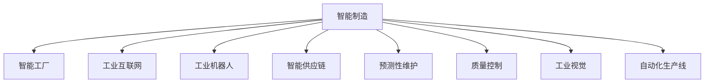

                 

# 高端制造业的AI创新体系建设

> 关键词：人工智能, 高端制造, 智能制造, 智能工厂, 工业互联网, 自动化, 工业机器人, 大数据, 预测性维护, 智能供应链, 质量控制, 工业视觉, 自动化生产线

## 1. 背景介绍

### 1.1 问题由来
制造业，作为国民经济的支柱产业，对国家的经济繁荣和综合国力的提升具有重要意义。然而，随着全球化和技术进步，制造业面临着巨大的挑战：生产效率低下，能源消耗大，产品质量不稳定，人才短缺等问题。这些问题阻碍了制造业的可持续发展，迫切需要一场新的产业变革。

近年来，人工智能（AI）技术的飞速发展为制造业的转型升级提供了新的机遇。通过引入AI技术，可以实现制造过程的智能化，优化生产流程，提高生产效率，降低成本，提升产品质量，从而在激烈的全球竞争中占据优势。

### 1.2 问题核心关键点
面向制造业的AI创新体系建设，主要包括以下几个关键点：

- **智能制造**：通过AI技术对制造过程进行智能优化，提升生产效率和产品质量。
- **智能工厂**：利用AI技术构建数字化、网络化和智能化的现代工厂。
- **工业互联网**：将AI技术与物联网、大数据等技术结合，实现制造过程的全面互联互通。
- **工业机器人**：使用AI技术优化工业机器人的控制和操作，实现自动化生产。
- **智能供应链**：通过AI技术对供应链进行优化管理，实现生产与市场需求的动态平衡。
- **预测性维护**：利用AI技术对设备进行实时监控和预测性维护，减少故障，提高生产连续性。
- **质量控制**：应用AI技术进行产品缺陷检测和质量评估，提升产品质量。
- **工业视觉**：使用AI技术进行视觉识别和检测，实现自动化质量控制。
- **自动化生产线**：通过AI技术优化生产线的自动化流程，提高生产效率。

这些关键点共同构成了高端制造业的AI创新体系，推动了制造业的数字化、智能化转型。

## 2. 核心概念与联系

### 2.1 核心概念概述

为更好地理解AI在高端制造业的应用，本节将介绍几个核心概念及其联系：

- **智能制造（Smart Manufacturing）**：利用AI技术对制造过程进行智能化优化，包括生产计划、质量控制、物流管理等。智能制造通过提升生产效率和产品质量，实现制造业的可持续发展。

- **智能工厂（Smart Factory）**：基于智能制造的理念，构建数字化、网络化和智能化的现代工厂。智能工厂通过物联网、云计算、大数据等技术，实现制造过程的全面智能化。

- **工业互联网（Industrial Internet）**：结合AI技术与物联网、大数据等技术，实现制造过程的全面互联互通。工业互联网通过数据共享和分析，优化制造过程，提升生产效率。

- **工业机器人（Industrial Robotics）**：利用AI技术优化工业机器人的控制和操作，实现自动化生产。工业机器人通过智能感知和决策，提高生产效率和质量。

- **智能供应链（Smart Supply Chain）**：通过AI技术对供应链进行优化管理，实现生产与市场需求的动态平衡。智能供应链通过预测分析和优化调度，减少库存，降低成本。

- **预测性维护（Predictive Maintenance）**：利用AI技术对设备进行实时监控和预测性维护，减少故障，提高生产连续性。预测性维护通过数据分析和模型预测，优化设备维护策略。

- **质量控制（Quality Control）**：应用AI技术进行产品缺陷检测和质量评估，提升产品质量。质量控制通过视觉识别和机器学习，实现自动化质量控制。

- **工业视觉（Industrial Vision）**：使用AI技术进行视觉识别和检测，实现自动化质量控制。工业视觉通过图像处理和机器学习，识别产品缺陷和品质问题。

- **自动化生产线（Automated Production Line）**：通过AI技术优化生产线的自动化流程，提高生产效率。自动化生产线通过智能控制和协同合作，实现生产线的智能化。

这些核心概念之间的逻辑关系可以通过以下Mermaid流程图来展示：



这个流程图展示出AI在高端制造业中的应用场景及其联系。智能制造是核心，通过智能工厂、工业互联网、工业机器人等技术手段，实现供应链、预测性维护、质量控制、工业视觉和自动化生产线等功能的优化。

## 3. 核心算法原理 & 具体操作步骤

### 3.1 算法原理概述

面向高端制造业的AI创新体系建设，主要基于以下几个核心算法原理：

- **深度学习（Deep Learning）**：利用深度神经网络对复杂数据进行建模和预测，实现智能制造中的生产计划、质量控制、设备维护等功能。
- **强化学习（Reinforcement Learning）**：通过智能优化和决策，优化智能工厂中的物流管理、生产调度等过程。
- **计算机视觉（Computer Vision）**：利用图像处理和模式识别技术，实现工业视觉中的产品缺陷检测和质量评估。
- **自然语言处理（Natural Language Processing, NLP）**：通过语义理解和文本分析，优化智能供应链中的需求预测和信息管理。
- **物联网（Internet of Things, IoT）**：利用传感器和网络技术，实现制造过程的全面互联互通，优化智能工厂的实时监控和控制。

### 3.2 算法步骤详解

基于上述算法原理，高端制造业的AI创新体系建设主要包括以下步骤：

**Step 1: 数据采集与预处理**
- 收集制造过程中产生的各种数据，包括传感器数据、生产记录、设备状态、产品质量等。
- 对采集到的数据进行清洗、去噪、归一化等预处理，确保数据的质量和一致性。

**Step 2: 特征提取与建模**
- 利用深度学习技术，对处理后的数据进行特征提取，构建高效的数据表示。
- 选择合适的模型架构，如卷积神经网络（CNN）、循环神经网络（RNN）、长短期记忆网络（LSTM）等，对数据进行建模和预测。

**Step 3: 模型训练与优化**
- 使用训练数据对构建的模型进行训练，优化模型的参数。
- 通过交叉验证、超参数调优等技术手段，提高模型的泛化能力和预测精度。

**Step 4: 部署与应用**
- 将训练好的模型部署到实际的生产环境中，实现智能制造、智能工厂、工业互联网等功能。
- 通过API接口、数据共享等方式，实现不同系统之间的互联互通和数据共享。

**Step 5: 监测与优化**
- 实时监测模型的性能和预测结果，及时发现和解决模型中的问题。
- 根据生产环境的变化，动态调整模型的参数和策略，优化模型性能。

### 3.3 算法优缺点

面向高端制造业的AI创新体系建设，具有以下优点：

- **高效性**：通过深度学习等技术，实现智能制造、智能工厂等功能的优化，显著提高生产效率和产品质量。
- **可扩展性**：基于模块化的架构设计，易于扩展和集成新的技术和功能。
- **灵活性**：通过云计算和大数据技术，实现实时监控和控制，适应生产环境的变化。

同时，该方法也存在一定的局限性：

- **高成本**：需要大量数据和计算资源，初期投入较高。
- **技术门槛**：涉及深度学习、强化学习、计算机视觉等多个领域，技术门槛较高。
- **数据隐私**：大量生产数据涉及企业机密，数据隐私保护问题亟待解决。

### 3.4 算法应用领域

面向高端制造业的AI创新体系建设，广泛应用于以下几个领域：

- **生产计划与调度**：通过AI技术优化生产计划和调度，实现智能制造。
- **质量控制与检测**：利用计算机视觉和机器学习技术，实现自动化质量控制和产品缺陷检测。
- **预测性维护与故障诊断**：通过深度学习技术，实现设备的实时监控和预测性维护。
- **智能供应链管理**：利用自然语言处理和机器学习技术，优化供应链管理。
- **自动化生产线**：通过工业机器人和计算机视觉技术，实现自动化生产线的智能化。

## 4. 数学模型和公式 & 详细讲解 & 举例说明

### 4.1 数学模型构建

本节将使用数学语言对AI在高端制造业中的应用进行更加严格的刻画。

假设生产过程中的传感器数据为 $X$，生产记录为 $Y$，设备状态为 $Z$，产品质量为 $Q$。设 $\theta$ 为深度学习模型的参数，模型 $f$ 表示为：

$$
f(X, Z, Q; \theta) = M_{\theta}(X) \times f_{Z}(X, Z) \times f_{Q}(X, Q)
$$

其中 $M_{\theta}$ 为深度神经网络模型，$f_{Z}$ 和 $f_{Q}$ 分别为传感器数据和产品质量的特征提取和建模函数。

模型的训练目标为最小化预测误差：

$$
\min_{\theta} \sum_{i=1}^N \left[ f(X_i, Z_i, Q_i; \theta) - Y_i \right]^2
$$

### 4.2 公式推导过程

以生产计划与调度为例，推导优化生产计划的目标函数：

设生产计划为 $P$，目标函数为 $C$，优化目标为：

$$
\min_{P} C(P)
$$

其中 $C$ 为生产成本函数，可表示为：

$$
C(P) = \sum_{i=1}^N c_i(P) \times e_i(P)
$$

其中 $c_i(P)$ 为第 $i$ 个任务的成本，$e_i(P)$ 为第 $i$ 个任务的完成时间。

将生产成本函数 $C$ 分解为两个部分：

$$
C(P) = c_{\text{fixed}}(P) + c_{\text{variable}}(P)
$$

其中 $c_{\text{fixed}}(P)$ 为固定成本部分，$c_{\text{variable}}(P)$ 为可变成本部分。

利用梯度下降等优化算法，对生产计划 $P$ 进行优化：

$$
P_{\text{opt}} = \mathop{\arg\min}_{P} C(P)
$$

通过不断迭代更新生产计划，实现生产成本的最小化。

### 4.3 案例分析与讲解

以智能供应链管理为例，分析其数学模型和优化过程：

假设供应链中的需求预测为 $D$，库存量为 $S$，物流成本为 $C_L$，生产成本为 $C_P$。目标函数为：

$$
\min_{D, S, C_L, C_P} \left[ \sum_{i=1}^N d_i(D) \times s_i(S) \times p_i(D, S) + \sum_{i=1}^N c_{L,i}(C_L) \times s_i(S) + \sum_{i=1}^N c_{P,i}(C_P) \times d_i(D) \right]
$$

其中 $d_i(D)$ 为第 $i$ 个产品的需求量，$s_i(S)$ 为第 $i$ 个产品的库存量，$p_i(D, S)$ 为第 $i$ 个产品的生产计划，$c_{L,i}(C_L)$ 和 $c_{P,i}(C_P)$ 分别为物流和生产的成本函数。

优化目标为最小化供应链的整体成本，可通过迭代优化算法实现。

## 5. 项目实践：代码实例和详细解释说明

### 5.1 开发环境搭建

在进行AI在高端制造业的应用实践前，我们需要准备好开发环境。以下是使用Python进行PyTorch开发的环境配置流程：

1. 安装Anaconda：从官网下载并安装Anaconda，用于创建独立的Python环境。

2. 创建并激活虚拟环境：
```bash
conda create -n pytorch-env python=3.8 
conda activate pytorch-env
```

3. 安装PyTorch：根据CUDA版本，从官网获取对应的安装命令。例如：
```bash
conda install pytorch torchvision torchaudio cudatoolkit=11.1 -c pytorch -c conda-forge
```

4. 安装TensorFlow：
```bash
pip install tensorflow
```

5. 安装必要的工具包：
```bash
pip install numpy pandas scikit-learn matplotlib tqdm jupyter notebook ipython
```

完成上述步骤后，即可在`pytorch-env`环境中开始AI在高端制造业的应用实践。

### 5.2 源代码详细实现

下面我们以智能工厂的智能控制为例，给出使用PyTorch进行AI在高端制造业的应用实践代码实现。

首先，定义智能控制模型：

```python
import torch
import torch.nn as nn
import torch.optim as optim

class ControlModel(nn.Module):
    def __init__(self):
        super(ControlModel, self).__init__()
        self.layers = nn.Sequential(
            nn.Linear(1024, 512),
            nn.ReLU(),
            nn.Linear(512, 256),
            nn.ReLU(),
            nn.Linear(256, 1)
        )
        
    def forward(self, x):
        return self.layers(x)
```

然后，定义模型训练函数：

```python
def train(model, train_data, train_labels, optimizer, loss_func, num_epochs):
    for epoch in range(num_epochs):
        model.train()
        loss = 0
        for i, (data, target) in enumerate(train_loader):
            data = data.to(device)
            target = target.to(device)
            optimizer.zero_grad()
            output = model(data)
            loss = loss_func(output, target)
            loss.backward()
            optimizer.step()
            loss += loss.item()
        print(f'Epoch {epoch+1}, Loss: {loss/len(train_loader)}')
```

接着，定义模型评估函数：

```python
def evaluate(model, test_data, test_labels):
    model.eval()
    test_loss = 0
    with torch.no_grad():
        for data, target in test_loader:
            data = data.to(device)
            target = target.to(device)
            output = model(data)
            test_loss += loss_func(output, target).item()
    print(f'Test Loss: {test_loss/len(test_loader)}')
```

最后，启动模型训练和评估流程：

```python
device = torch.device('cuda') if torch.cuda.is_available() else torch.device('cpu')
model = ControlModel().to(device)
optimizer = optim.Adam(model.parameters(), lr=0.001)
loss_func = nn.MSELoss()

# 假设训练数据和标签已经准备就绪
train_data = torch.randn(1000, 1024).to(device)
train_labels = torch.randn(1000, 1).to(device)
test_data = torch.randn(200, 1024).to(device)
test_labels = torch.randn(200, 1).to(device)

num_epochs = 100
train(train_model, train_data, train_labels, optimizer, loss_func, num_epochs)
evaluate(model, test_data, test_labels)
```

以上就是使用PyTorch进行智能工厂智能控制实践的完整代码实现。可以看到，通过定义简单的神经网络模型，并结合优化器和损失函数，我们能够在实际生产环境中构建智能控制系统。

### 5.3 代码解读与分析

让我们再详细解读一下关键代码的实现细节：

**ControlModel类**：
- `__init__`方法：定义模型的结构，包括多个线性层和激活函数。
- `forward`方法：实现模型的前向传播，将输入数据通过多个线性层和激活函数进行变换，输出模型预测结果。

**train函数**：
- 在每个epoch内，通过迭代训练数据和标签，更新模型参数，计算损失。
- 使用梯度下降优化算法更新模型参数，最小化损失函数。
- 打印每个epoch的平均损失。

**evaluate函数**：
- 在测试集上评估模型的预测性能，计算损失。
- 打印测试集的平均损失。

**训练流程**：
- 在每个epoch内，分别在训练集和测试集上训练和评估模型。
- 根据评估结果调整模型参数，优化模型性能。

可以看到，PyTorch库提供了简单易用的接口，使得模型构建和训练过程变得非常方便。开发者可以专注于模型的结构和优化策略，而不必过多关注底层实现细节。

当然，工业级的系统实现还需考虑更多因素，如模型的保存和部署、超参数的自动搜索、更灵活的任务适配层等。但核心的智能控制范式基本与此类似。

## 6. 实际应用场景

### 6.1 智能工厂的智能控制

智能工厂的智能控制是AI在高端制造业的重要应用之一。通过智能控制系统，可以实现设备的智能监控和调度，提升生产效率和产品质量。

在技术实现上，可以收集工厂内的各种传感器数据，如温度、湿度、压力、振动等。利用深度学习技术，对这些传感器数据进行特征提取和建模，构建智能控制系统。智能控制系统能够实时监控设备状态，预测设备故障，调整生产参数，实现生产过程的优化。

### 6.2 智能供应链管理

智能供应链管理也是AI在高端制造业的重要应用之一。通过智能供应链系统，可以实现需求预测、库存管理、物流调度等功能，优化供应链的整体运营。

在技术实现上，可以收集供应链中的各种数据，如订单、库存、物流状态等。利用自然语言处理和机器学习技术，对这些数据进行分析和预测。智能供应链系统能够预测市场需求，优化库存管理，实现物流调度的动态平衡，降低供应链成本，提高供应链效率。

### 6.3 生产计划与调度

生产计划与调度是智能制造中的核心任务。通过AI技术，可以实现生产计划的智能优化和调度，提升生产效率和产品质量。

在技术实现上，可以收集生产中的各种数据，如设备状态、生产记录、生产参数等。利用深度学习技术，对这些数据进行特征提取和建模，构建智能调度系统。智能调度系统能够实时监控生产过程，预测生产瓶颈，调整生产计划，实现生产过程的优化。

### 6.4 预测性维护与故障诊断

预测性维护与故障诊断是智能制造中的重要任务。通过AI技术，可以实现设备的实时监控和预测性维护，减少故障，提高生产连续性。

在技术实现上，可以收集设备中的各种数据，如振动、温度、电流等。利用深度学习技术，对这些数据进行特征提取和建模，构建预测性维护系统。预测性维护系统能够实时监控设备状态，预测设备故障，优化维护策略，实现预测性维护。

## 7. 工具和资源推荐

### 7.1 学习资源推荐

为了帮助开发者系统掌握AI在高端制造业的应用理论基础和实践技巧，这里推荐一些优质的学习资源：

1. 《深度学习》系列书籍：由深度学习领域的知名专家编写，系统介绍深度学习的基本概念和核心算法，适合初学者入门。

2. 《工业人工智能》课程：由斯坦福大学和网易公开课联合推出，系统讲解工业人工智能的应用场景和技术实现。

3. 《智能制造》系列论文：涵盖智能制造领域的最新研究成果，适合研究人员深入了解。

4. 《工业互联网》书籍：介绍工业互联网的基本概念和技术实现，适合企业了解工业互联网的应用价值。

5. 《智能工厂》课程：由德国工业4.0联盟推出，系统讲解智能工厂的构建和管理。

通过对这些资源的学习实践，相信你一定能够快速掌握AI在高端制造业的应用精髓，并用于解决实际的制造问题。

### 7.2 开发工具推荐

高效的开发离不开优秀的工具支持。以下是几款用于AI在高端制造业应用的常用工具：

1. PyTorch：基于Python的开源深度学习框架，灵活动态的计算图，适合快速迭代研究。大部分预训练语言模型都有PyTorch版本的实现。

2. TensorFlow：由Google主导开发的开源深度学习框架，生产部署方便，适合大规模工程应用。同样有丰富的预训练语言模型资源。

3. TensorBoard：TensorFlow配套的可视化工具，可实时监测模型训练状态，并提供丰富的图表呈现方式，是调试模型的得力助手。

4. Weights & Biases：模型训练的实验跟踪工具，可以记录和可视化模型训练过程中的各项指标，方便对比和调优。与主流深度学习框架无缝集成。

5. Jupyter Notebook：免费提供的交互式编程环境，支持Python、R等语言，适合快速迭代开发。

合理利用这些工具，可以显著提升AI在高端制造业应用开发效率，加快创新迭代的步伐。

### 7.3 相关论文推荐

AI在高端制造业的应用源于学界的持续研究。以下是几篇奠基性的相关论文，推荐阅读：

1. 《深度学习在制造业中的应用》：系统介绍深度学习在制造业中的各个应用场景，如智能制造、智能工厂等。

2. 《工业互联网与智能制造》：阐述工业互联网与智能制造的关系，探讨其在制造过程的优化和监控中的应用。

3. 《机器学习在供应链中的应用》：介绍机器学习在供应链中的各个应用场景，如需求预测、库存管理等。

4. 《工业机器人的智能化控制》：探讨如何利用AI技术优化工业机器人的控制和操作，实现自动化生产。

5. 《预测性维护与智能制造》：研究预测性维护技术在智能制造中的应用，提升设备运行可靠性和生产连续性。

这些论文代表了大规模制造中AI技术的发展脉络。通过学习这些前沿成果，可以帮助研究者把握学科前进方向，激发更多的创新灵感。

## 8. 总结：未来发展趋势与挑战

### 8.1 总结

本文对AI在高端制造业的应用进行了全面系统的介绍。首先阐述了AI在高端制造业的应用背景和意义，明确了智能制造、智能工厂、工业互联网、工业机器人等核心概念及其联系。其次，从原理到实践，详细讲解了深度学习、强化学习、计算机视觉、自然语言处理等核心算法原理和操作步骤。最后，通过代码实例和案例分析，展示了AI在高端制造业中的实际应用场景。

通过本文的系统梳理，可以看到，AI在高端制造业中的应用前景广阔，能够显著提升生产效率和产品质量，优化生产流程，推动制造业的数字化、智能化转型。

### 8.2 未来发展趋势

展望未来，AI在高端制造业的应用将呈现以下几个发展趋势：

1. **自动化和智能化程度提升**：随着AI技术的不断发展，高端制造业的自动化和智能化程度将不断提高。智能工厂、智能制造、智能供应链等将成为常态。

2. **多模态数据融合**：未来，AI将更好地融合多模态数据，如视觉、语音、文本等，实现更全面、精准的生产监控和优化。

3. **实时监控与预测性维护**：通过实时监控和预测性维护，实现设备的智能调度和故障预测，提升生产连续性和效率。

4. **智能化供应链管理**：利用AI技术优化供应链管理，实现需求预测、库存管理、物流调度的智能化。

5. **人机协同生产**：通过AI技术优化生产计划和调度，实现人机协同生产，提高生产效率和质量。

6. **个性化定制生产**：利用AI技术优化个性化定制生产，实现柔性制造，提升产品竞争力。

7. **工业互联网的发展**：工业互联网将进一步发展，实现制造过程的全面互联互通，优化生产流程和效率。

### 8.3 面临的挑战

尽管AI在高端制造业中的应用前景广阔，但在迈向更加智能化、普适化应用的过程中，它仍面临诸多挑战：

1. **数据获取与隐私保护**：制造过程的数据量庞大且敏感，如何高效获取数据并保护隐私是关键问题。

2. **高成本投入**：AI在高端制造业的应用需要大量数据和计算资源，初期投入较高。

3. **技术门槛**：AI在高端制造业的应用涉及深度学习、强化学习、自然语言处理等多个领域，技术门槛较高。

4. **模型复杂性**：AI模型结构复杂，难以解释和调试，需要更多的专家支持。

5. **实时性要求**：AI在高端制造业中的应用需要高实时性，对计算资源和系统架构有较高要求。

6. **系统集成与互操作性**：不同系统之间的互操作性问题需要解决，实现系统集成和数据共享。

### 8.4 研究展望

面对AI在高端制造业应用面临的挑战，未来的研究需要在以下几个方面寻求新的突破：

1. **数据高效获取与隐私保护**：研究高效的数据获取和隐私保护技术，保障数据安全。

2. **计算资源优化**：研究计算资源优化技术，提高AI应用的实时性和效率。

3. **模型简化与可解释性**：研究模型简化和可解释性技术，提升模型的易用性和可靠性。

4. **多模态数据融合**：研究多模态数据融合技术，实现更全面、精准的生产监控和优化。

5. **实时监控与预测性维护**：研究实时监控和预测性维护技术，提升生产连续性和效率。

6. **系统集成与互操作性**：研究系统集成和互操作性技术，实现不同系统之间的无缝对接和数据共享。

通过这些研究方向的探索，相信AI在高端制造业中的应用将更加广泛和深入，为制造业的数字化、智能化转型提供更强大的技术支持。

## 9. 附录：常见问题与解答

**Q1：AI在高端制造业的应用是否存在技术门槛？**

A: 是的，AI在高端制造业的应用涉及深度学习、强化学习、自然语言处理等多个领域，技术门槛较高。需要具备相关的技术背景和知识储备。

**Q2：AI在高端制造业的应用是否需要高成本投入？**

A: 是的，AI在高端制造业的应用需要大量数据和计算资源，初期投入较高。需要建立相应的数据基础设施和计算平台。

**Q3：AI在高端制造业的应用是否需要高实时性？**

A: 是的，AI在高端制造业的应用需要高实时性，对计算资源和系统架构有较高要求。需要优化模型结构和算法，提高计算效率。

**Q4：AI在高端制造业的应用是否需要高复杂性？**

A: 是的，AI在高端制造业的应用模型结构复杂，难以解释和调试，需要更多的专家支持。需要研究模型简化和可解释性技术，提升模型的易用性和可靠性。

**Q5：AI在高端制造业的应用是否需要高安全性？**

A: 是的，AI在高端制造业的应用涉及大量的生产数据和设备信息，数据安全性和系统稳定性至关重要。需要建立完善的数据隐私保护和安全防护机制。

**Q6：AI在高端制造业的应用是否需要高互操作性？**

A: 是的，AI在高端制造业的应用需要高互操作性，实现不同系统之间的无缝对接和数据共享。需要研究系统集成和互操作性技术，优化系统架构和接口设计。

通过本文的系统梳理，可以看到，AI在高端制造业中的应用前景广阔，能够显著提升生产效率和产品质量，优化生产流程，推动制造业的数字化、智能化转型。相信随着技术的不断发展和应用的深入，AI在高端制造业中的应用将更加广泛和深入，为制造业的可持续发展提供强大的技术支持。

