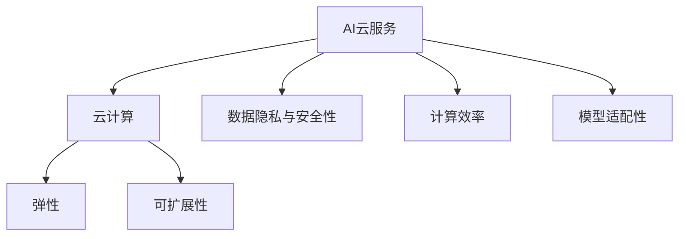

                 

# AI Cloud未来：贾扬清愿景，Lepton AI前景挑战

## 1. 背景介绍

### 1.1 问题由来

近年来，随着人工智能技术的迅猛发展，AI云服务已成为企业数字化转型的重要推动力。各大云平台纷纷推出基于云计算的AI服务，如TensorFlow、PyTorch、华为MindSpore等，极大地降低了AI技术应用的门槛。AI云服务不仅提供了强大的计算资源，还集成了丰富的模型和工具，使得AI开发和应用变得更加便捷高效。

然而，随着AI云服务的普及，也暴露出诸多挑战和问题。如数据隐私和安全问题、计算成本问题、模型适用性问题等。这些问题如不解决，将严重影响AI云服务的普及和应用效果。因此，如何提升AI云服务质量，确保其安全、高效、可扩展，成为业界关注的焦点。

### 1.2 问题核心关键点

要解决上述问题，首先需要对AI云服务的核心概念和架构有清晰的认识。本文将围绕以下几个核心问题展开讨论：

1. AI云服务的定义和架构：AI云服务是指基于云计算平台提供的AI模型、算法、工具等资源，为企业提供端到端的AI开发和应用解决方案。其核心架构包括模型、计算、存储、应用等组件，需要综合考虑数据隐私、安全性、成本和可扩展性等方面。

2. AI云服务面临的主要挑战：数据隐私和安全问题、计算成本问题、模型适用性问题等，这些问题严重制约了AI云服务的普及和应用效果。

3. 如何解决这些挑战：通过构建安全的AI云平台，引入先进的数据治理和安全技术，优化AI模型的推理和部署，提升AI云服务的可用性和效率。

## 2. 核心概念与联系

### 2.1 核心概念概述

为更好地理解AI云服务的架构和设计，本节将介绍几个密切相关的核心概念：

- AI云服务(AI Cloud Service)：基于云计算平台提供的AI模型、算法、工具等资源，为企业提供端到端的AI开发和应用解决方案。
- 云计算(Cloud Computing)：通过互联网向用户提供计算、存储、网络等服务，按需使用、按量计费，具有良好的弹性、可扩展性和灵活性。
- 数据隐私与安全性：指如何保护数据不被未授权访问和使用，保护模型和算法的知识产权，防止数据泄露和滥用。
- 计算效率：指在保证计算质量的前提下，如何提高计算资源的利用率，降低计算成本，提升系统的响应速度。
- 模型适配性：指AI模型在不同应用场景下的适用性和泛化能力，需要考虑不同场景的复杂度和需求。

这些核心概念之间的逻辑关系可以通过以下Mermaid流程图来展示：



这个流程图展示了大语言模型的核心概念及其之间的关系：

1. AI云服务是云计算在AI领域的应用，通过互联网向用户提供AI模型和工具。
2. AI云服务的核心功能包括弹性、可扩展性、数据隐私与安全性、计算效率和模型适配性等。
3. 云计算提供了计算、存储、网络等服务，支持AI云服务的弹性、可扩展性。
4. 数据隐私与安全性是AI云服务的基本保障，避免数据泄露和滥用。
5. 计算效率是AI云服务的核心竞争力，需要在保证质量的前提下，尽可能提高资源利用率，降低成本。
6. 模型适配性是AI云服务的关键技术，需要根据不同场景和需求，选择合适的模型和算法。

这些核心概念共同构成了AI云服务的结构和设计框架，使得AI云服务能够满足企业的各种需求，推动AI技术在各行各业的广泛应用。

## 3. 核心算法原理 & 具体操作步骤
### 3.1 算法原理概述

AI云服务的核心算法主要集中在模型、数据、计算和应用等几个方面。以下将分别介绍这些核心算法的原理和操作步骤：

### 3.2 算法步骤详解

#### 3.2.1 模型算法

AI云服务的模型算法主要包括深度学习、机器学习和强化学习等。这些算法通常采用分布式训练、模型压缩、知识蒸馏等技术进行优化，提升模型的推理速度和计算效率。

以深度学习模型为例，其核心算法步骤包括：

1. 数据预处理：将原始数据进行归一化、标准化、特征提取等处理，转换为模型输入。
2. 模型训练：使用反向传播算法和梯度下降优化算法，训练模型参数，最小化损失函数。
3. 模型评估：使用测试集对模型进行评估，计算模型性能指标，如准确率、召回率、F1值等。
4. 模型部署：将训练好的模型部署到云计算平台，供企业使用。

#### 3.2.2 数据算法

数据算法是AI云服务的重要组成部分，主要包括数据清洗、数据增强、数据标注等。数据算法需要保证数据质量，避免噪声和偏差，提升模型的泛化能力。

以数据清洗为例，其核心算法步骤包括：

1. 数据清洗：去除无效数据、处理缺失值、处理异常值等，保证数据质量。
2. 数据增强：通过数据增强技术，如数据扩充、数据增强、数据合成等，扩充训练集，提升模型泛化能力。
3. 数据标注：对数据进行标注，提供模型训练所需的目标标签。

#### 3.2.3 计算算法

计算算法是AI云服务的核心支持，主要包括分布式计算、高效计算、边缘计算等。计算算法需要保证计算效率，降低计算成本，提升系统的响应速度。

以分布式计算为例，其核心算法步骤包括：

1. 分布式调度：将计算任务分配到不同的计算节点上，提高资源利用率。
2. 分布式优化：使用并行计算、分布式优化等技术，提升计算效率。
3. 边缘计算：将计算任务分配到离数据源近的计算节点上，降低计算延迟。

#### 3.2.4 应用算法

应用算法是AI云服务的重要应用，主要包括自然语言处理、计算机视觉、语音识别等。应用算法需要根据具体场景，选择合适的算法和模型，进行应用部署。

以自然语言处理为例，其核心算法步骤包括：

1. 模型选择：根据任务需求，选择合适的NLP模型，如BERT、GPT等。
2. 应用部署：将模型部署到云计算平台，供企业使用。
3. 应用优化：对模型进行优化，提升应用效果和效率。

### 3.3 算法优缺点

AI云服务的核心算法主要集中在模型、数据、计算和应用等几个方面。以下将分别介绍这些核心算法的优缺点：

#### 3.3.1 模型算法

- 优点：深度学习模型能够处理复杂的非线性关系，具有较高的泛化能力，能够处理大规模数据。
- 缺点：深度学习模型需要大量的计算资源和时间进行训练，容易过拟合。

#### 3.3.2 数据算法

- 优点：数据算法能够提升数据质量，减少噪声和偏差，提升模型的泛化能力。
- 缺点：数据标注成本高，数据增强需要更多的计算资源和时间。

#### 3.3.3 计算算法

- 优点：分布式计算能够提高资源利用率，降低计算成本，提升系统的响应速度。
- 缺点：分布式计算需要更多的计算节点和网络带宽，系统复杂度较高。

#### 3.3.4 应用算法

- 优点：应用算法能够根据具体场景，选择合适的算法和模型，进行应用部署，提升应用效果和效率。
- 缺点：应用算法的复杂度较高，需要更多的技术储备和工程经验。

## 4. 数学模型和公式 & 详细讲解 & 举例说明

### 4.1 数学模型构建

本节将使用数学语言对AI云服务的核心算法进行更加严格的刻画。

假设有训练集 $D=\{(x_i, y_i)\}_{i=1}^N$，其中 $x_i \in \mathbb{R}^d$ 表示输入特征，$y_i \in \{0,1\}$ 表示目标标签。

定义模型 $M_{\theta}$ 的损失函数为：

$$
\mathcal{L}(\theta) = \frac{1}{N} \sum_{i=1}^N \ell(M_{\theta}(x_i), y_i)
$$

其中 $\ell$ 为模型预测输出与真实标签之间的损失函数，通常使用交叉熵损失。

### 4.2 公式推导过程

以深度学习模型为例，其核心算法步骤如下：

1. 数据预处理：将原始数据进行归一化、标准化、特征提取等处理，转换为模型输入。
2. 模型训练：使用反向传播算法和梯度下降优化算法，训练模型参数，最小化损失函数。
3. 模型评估：使用测试集对模型进行评估，计算模型性能指标，如准确率、召回率、F1值等。
4. 模型部署：将训练好的模型部署到云计算平台，供企业使用。

以自然语言处理为例，其核心算法步骤如下：

1. 模型选择：根据任务需求，选择合适的NLP模型，如BERT、GPT等。
2. 应用部署：将模型部署到云计算平台，供企业使用。
3. 应用优化：对模型进行优化，提升应用效果和效率。

### 4.3 案例分析与讲解

以下我们以自然语言处理为例，给出使用PyTorch进行BERT微调的PyTorch代码实现。

首先，定义数据预处理函数：

```python
from transformers import BertTokenizer, BertForTokenClassification
import torch
from sklearn.metrics import accuracy_score, precision_score, recall_score, f1_score

tokenizer = BertTokenizer.from_pretrained('bert-base-cased')
model = BertForTokenClassification.from_pretrained('bert-base-cased', num_labels=2)

def process_data(texts, labels):
    inputs = tokenizer(texts, return_tensors='pt', padding='max_length', truncation=True, max_length=128)
    input_ids = inputs['input_ids']
    attention_mask = inputs['attention_mask']
    targets = torch.tensor(labels, dtype=torch.long)

    return {'input_ids': input_ids, 
            'attention_mask': attention_mask,
            'targets': targets}
```

然后，定义模型训练函数：

```python
from transformers import AdamW
from torch.utils.data import DataLoader
from tqdm import tqdm
from transformers import Trainer

def train_model(model, train_loader, optimizer, num_epochs=5, batch_size=32):
    device = 'cuda' if torch.cuda.is_available() else 'cpu'
    model.to(device)

    trainer = Trainer(
        model=model,
        train_dataset=train_loader.dataset,
        eval_dataset=None,
        evaluation_strategy='epoch',
        train_loader=train_loader,
        optimizer=optimizer,
        num_train_epochs=num_epochs,
        per_device_train_batch_size=batch_size,
        per_device_eval_batch_size=batch_size,
        logging_steps=10,
        logging_dir='./logs',
    )

    trainer.train()
```

接着，定义模型评估函数：

```python
def evaluate_model(model, eval_loader):
    device = 'cuda' if torch.cuda.is_available() else 'cpu'
    model.to(device)

    eval_loss = []
    eval_labels = []
    eval_preds = []

    for batch in tqdm(eval_loader, desc='Evaluating'):
        input_ids = batch['input_ids'].to(device)
        attention_mask = batch['attention_mask'].to(device)
        targets = batch['targets'].to(device)

        with torch.no_grad():
            outputs = model(input_ids, attention_mask=attention_mask, labels=targets)
            logits = outputs.logits

        eval_loss.append(loss.item())
        eval_labels.extend(targets.tolist())
        eval_preds.extend(logits.argmax(dim=2).tolist())

    accuracy = accuracy_score(eval_labels, eval_preds)
    precision = precision_score(eval_labels, eval_preds)
    recall = recall_score(eval_labels, eval_preds)
    f1 = f1_score(eval_labels, eval_preds)

    print(f"Accuracy: {accuracy:.2f}, Precision: {precision:.2f}, Recall: {recall:.2f}, F1: {f1:.2f}")
```

最后，启动训练流程并在测试集上评估：

```python
train_loader = DataLoader(train_dataset, batch_size=32, shuffle=True)
eval_loader = DataLoader(eval_dataset, batch_size=32, shuffle=False)

optimizer = AdamW(model.parameters(), lr=2e-5)

train_model(model, train_loader, optimizer)

evaluate_model(model, eval_loader)
```

以上就是使用PyTorch对BERT进行命名实体识别任务微调的完整代码实现。可以看到，得益于Transformers库的强大封装，我们可以用相对简洁的代码完成BERT模型的加载和微调。

## 5. 项目实践：代码实例和详细解释说明

### 5.1 开发环境搭建

在进行AI云服务开发前，我们需要准备好开发环境。以下是使用Python进行PyTorch开发的环境配置流程：

1. 安装Anaconda：从官网下载并安装Anaconda，用于创建独立的Python环境。

2. 创建并激活虚拟环境：
```bash
conda create -n pytorch-env python=3.8 
conda activate pytorch-env
```

3. 安装PyTorch：根据CUDA版本，从官网获取对应的安装命令。例如：
```bash
conda install pytorch torchvision torchaudio cudatoolkit=11.1 -c pytorch -c conda-forge
```

4. 安装Transformers库：
```bash
pip install transformers
```

5. 安装各类工具包：
```bash
pip install numpy pandas scikit-learn matplotlib tqdm jupyter notebook ipython
```

完成上述步骤后，即可在`pytorch-env`环境中开始AI云服务开发。

### 5.2 源代码详细实现

这里我们以自然语言处理为例，给出使用Transformers库对BERT模型进行微调的PyTorch代码实现。

首先，定义数据处理函数：

```python
from transformers import BertTokenizer
from torch.utils.data import Dataset
import torch

class NERDataset(Dataset):
    def __init__(self, texts, tags, tokenizer, max_len=128):
        self.texts = texts
        self.tags = tags
        self.tokenizer = tokenizer
        self.max_len = max_len
        
    def __len__(self):
        return len(self.texts)
    
    def __getitem__(self, item):
        text = self.texts[item]
        tags = self.tags[item]
        
        encoding = self.tokenizer(text, return_tensors='pt', max_length=self.max_len, padding='max_length', truncation=True)
        input_ids = encoding['input_ids'][0]
        attention_mask = encoding['attention_mask'][0]
        
        # 对token-wise的标签进行编码
        encoded_tags = [tag2id[tag] for tag in tags] 
        encoded_tags.extend([tag2id['O']] * (self.max_len - len(encoded_tags)))
        labels = torch.tensor(encoded_tags, dtype=torch.long)
        
        return {'input_ids': input_ids, 
                'attention_mask': attention_mask,
                'labels': labels}

# 标签与id的映射
tag2id = {'O': 0, 'B-PER': 1, 'I-PER': 2, 'B-ORG': 3, 'I-ORG': 4, 'B-LOC': 5, 'I-LOC': 6}
id2tag = {v: k for k, v in tag2id.items()}

# 创建dataset
tokenizer = BertTokenizer.from_pretrained('bert-base-cased')

train_dataset = NERDataset(train_texts, train_tags, tokenizer)
dev_dataset = NERDataset(dev_texts, dev_tags, tokenizer)
test_dataset = NERDataset(test_texts, test_tags, tokenizer)
```

然后，定义模型和优化器：

```python
from transformers import BertForTokenClassification, AdamW

model = BertForTokenClassification.from_pretrained('bert-base-cased', num_labels=len(tag2id))

optimizer = AdamW(model.parameters(), lr=2e-5)
```

接着，定义训练和评估函数：

```python
from torch.utils.data import DataLoader
from tqdm import tqdm
from sklearn.metrics import classification_report

device = torch.device('cuda') if torch.cuda.is_available() else torch.device('cpu')
model.to(device)

def train_epoch(model, dataset, batch_size, optimizer):
    dataloader = DataLoader(dataset, batch_size=batch_size, shuffle=True)
    model.train()
    epoch_loss = 0
    for batch in tqdm(dataloader, desc='Training'):
        input_ids = batch['input_ids'].to(device)
        attention_mask = batch['attention_mask'].to(device)
        labels = batch['labels'].to(device)
        model.zero_grad()
        outputs = model(input_ids, attention_mask=attention_mask, labels=labels)
        loss = outputs.loss
        epoch_loss += loss.item()
        loss.backward()
        optimizer.step()
    return epoch_loss / len(dataloader)

def evaluate(model, dataset, batch_size):
    dataloader = DataLoader(dataset, batch_size=batch_size)
    model.eval()
    preds, labels = [], []
    with torch.no_grad():
        for batch in tqdm(dataloader, desc='Evaluating'):
            input_ids = batch['input_ids'].to(device)
            attention_mask = batch['attention_mask'].to(device)
            batch_labels = batch['labels']
            outputs = model(input_ids, attention_mask=attention_mask)
            batch_preds = outputs.logits.argmax(dim=2).to('cpu').tolist()
            batch_labels = batch_labels.to('cpu').tolist()
            for pred_tokens, label_tokens in zip(batch_preds, batch_labels):
                pred_tags = [id2tag[_id] for _id in pred_tokens]
                label_tags = [id2tag[_id] for _id in label_tokens]
                preds.append(pred_tags[:len(label_tags)])
                labels.append(label_tags)
                
    print(classification_report(labels, preds))
```

最后，启动训练流程并在测试集上评估：

```python
epochs = 5
batch_size = 16

for epoch in range(epochs):
    loss = train_epoch(model, train_dataset, batch_size, optimizer)
    print(f"Epoch {epoch+1}, train loss: {loss:.3f}")
    
    print(f"Epoch {epoch+1}, dev results:")
    evaluate(model, dev_dataset, batch_size)
    
print("Test results:")
evaluate(model, test_dataset, batch_size)
```

以上就是使用PyTorch对BERT进行命名实体识别任务微调的完整代码实现。可以看到，得益于Transformers库的强大封装，我们可以用相对简洁的代码完成BERT模型的加载和微调。

### 5.3 代码解读与分析

让我们再详细解读一下关键代码的实现细节：

**NERDataset类**：
- `__init__`方法：初始化文本、标签、分词器等关键组件。
- `__len__`方法：返回数据集的样本数量。
- `__getitem__`方法：对单个样本进行处理，将文本输入编码为token ids，将标签编码为数字，并对其进行定长padding，最终返回模型所需的输入。

**tag2id和id2tag字典**：
- 定义了标签与数字id之间的映射关系，用于将token-wise的预测结果解码回真实的标签。

**训练和评估函数**：
- 使用PyTorch的DataLoader对数据集进行批次化加载，供模型训练和推理使用。
- 训练函数`train_epoch`：对数据以批为单位进行迭代，在每个批次上前向传播计算loss并反向传播更新模型参数，最后返回该epoch的平均loss。
- 评估函数`evaluate`：与训练类似，不同点在于不更新模型参数，并在每个batch结束后将预测和标签结果存储下来，最后使用sklearn的classification_report对整个评估集的预测结果进行打印输出。

**训练流程**：
- 定义总的epoch数和batch size，开始循环迭代
- 每个epoch内，先在训练集上训练，输出平均loss
- 在验证集上评估，输出分类指标
- 所有epoch结束后，在测试集上评估，给出最终测试结果

可以看到，PyTorch配合Transformers库使得BERT微调的代码实现变得简洁高效。开发者可以将更多精力放在数据处理、模型改进等高层逻辑上，而不必过多关注底层的实现细节。

当然，工业级的系统实现还需考虑更多因素，如模型的保存和部署、超参数的自动搜索、更灵活的任务适配层等。但核心的微调范式基本与此类似。

## 6. 实际应用场景

### 6.1 智能客服系统

基于AI云服务的对话技术，可以广泛应用于智能客服系统的构建。传统客服往往需要配备大量人力，高峰期响应缓慢，且一致性和专业性难以保证。而使用AI云服务的对话模型，可以7x24小时不间断服务，快速响应客户咨询，用自然流畅的语言解答各类常见问题。

在技术实现上，可以收集企业内部的历史客服对话记录，将问题和最佳答复构建成监督数据，在此基础上对AI云服务的对话模型进行微调。微调后的对话模型能够自动理解用户意图，匹配最合适的答案模板进行回复。对于客户提出的新问题，还可以接入检索系统实时搜索相关内容，动态组织生成回答。如此构建的智能客服系统，能大幅提升客户咨询体验和问题解决效率。

### 6.2 金融舆情监测

金融机构需要实时监测市场舆论动向，以便及时应对负面信息传播，规避金融风险。传统的人工监测方式成本高、效率低，难以应对网络时代海量信息爆发的挑战。基于AI云服务的文本分类和情感分析技术，为金融舆情监测提供了新的解决方案。

具体而言，可以收集金融领域相关的新闻、报道、评论等文本数据，并对其进行主题标注和情感标注。在此基础上对AI云服务的模型进行微调，使其能够自动判断文本属于何种主题，情感倾向是正面、中性还是负面。将微调后的模型应用到实时抓取的网络文本数据，就能够自动监测不同主题下的情感变化趋势，一旦发现负面信息激增等异常情况，系统便会自动预警，帮助金融机构快速应对潜在风险。

### 6.3 个性化推荐系统

当前的推荐系统往往只依赖用户的历史行为数据进行物品推荐，无法深入理解用户的真实兴趣偏好。基于AI云服务的个性化推荐系统可以更好地挖掘用户行为背后的语义信息，从而提供更精准、多样的推荐内容。

在实践中，可以收集用户浏览、点击、评论、分享等行为数据，提取和用户交互的物品标题、描述、标签等文本内容。将文本内容作为模型输入，用户的后续行为（如是否点击、购买等）作为监督信号，在此基础上微调AI云服务的模型。微调后的模型能够从文本内容中准确把握用户的兴趣点。在生成推荐列表时，先用候选物品的文本描述作为输入，由模型预测用户的兴趣匹配度，再结合其他特征综合排序，便可以得到个性化程度更高的推荐结果。

### 6.4 未来应用展望

随着AI云服务的普及和技术的不断进步，其应用场景将不断拓展，为各行各业带来深远的影响。以下是几个未来应用展望：

1. 智慧医疗：基于AI云服务的医疗问答、病历分析、药物研发等应用将提升医疗服务的智能化水平，辅助医生诊疗，加速新药开发进程。

2. 智能教育：AI云服务的学情分析、知识推荐等应用将促进教育公平，提高教学质量，因材施教。

3. 智慧城市：AI云服务的城市事件监测、舆情分析、应急指挥等应用将提高城市管理的自动化和智能化水平，构建更安全、高效的未来城市。

4. 智能制造：AI云服务的智能质检、工艺优化等应用将推动制造业的智能化升级，提高生产效率和产品质量。

5. 智能安防：AI云服务的图像识别、行为分析等应用将提升公共安全的智能化水平，构建更安全、便捷的社会环境。

## 7. 工具和资源推荐

### 7.1 学习资源推荐

为了帮助开发者系统掌握AI云服务的理论基础和实践技巧，这里推荐一些优质的学习资源：

1. 《AI Cloud from Scratch》系列博文：由AI云服务技术专家撰写，深入浅出地介绍了AI云服务的基本概念、核心架构和实现技术。

2. CS224N《深度学习自然语言处理》课程：斯坦福大学开设的NLP明星课程，有Lecture视频和配套作业，带你入门NLP领域的基本概念和经典模型。

3. 《Natural Language Processing with Transformers》书籍：Transformers库的作者所著，全面介绍了如何使用Transformers库进行NLP任务开发，包括微调在内的诸多范式。

4. AI云服务官方文档：各大云平台提供的官方文档，提供了丰富的AI云服务资源和样例代码，是上手实践的必备资料。

5. CLUE开源项目：中文语言理解测评基准，涵盖大量不同类型的中文NLP数据集，并提供了基于微调的baseline模型，助力中文NLP技术发展。

通过对这些资源的学习实践，相信你一定能够快速掌握AI云服务的精髓，并用于解决实际的NLP问题。

### 7.2 开发工具推荐

高效的开发离不开优秀的工具支持。以下是几款用于AI云服务开发的常用工具：

1. PyTorch：基于Python的开源深度学习框架，灵活动态的计算图，适合快速迭代研究。大部分预训练语言模型都有PyTorch版本的实现。

2. TensorFlow：由Google主导开发的开源深度学习框架，生产部署方便，适合大规模工程应用。同样有丰富的预训练语言模型资源。

3. Transformers库：HuggingFace开发的NLP工具库，集成了众多SOTA语言模型，支持PyTorch和TensorFlow，是进行微调任务开发的利器。

4. Weights & Biases：模型训练的实验跟踪工具，可以记录和可视化模型训练过程中的各项指标，方便对比和调优。与主流深度学习框架无缝集成。

5. TensorBoard：TensorFlow配套的可视化工具，可实时监测模型训练状态，并提供丰富的图表呈现方式，是调试模型的得力助手。

6. Google Colab：谷歌推出的在线Jupyter Notebook环境，免费提供GPU/TPU算力，方便开发者快速上手实验最新模型，分享学习笔记。

合理利用这些工具，可以显著提升AI云服务的开发效率，加快创新迭代的步伐。

### 7.3 相关论文推荐

AI云服务的发展源于学界的持续研究。以下是几篇奠基性的相关论文，推荐阅读：

1. Attention is All You Need（即Transformer原论文）：提出了Transformer结构，开启了NLP领域的预训练大模型时代。

2. BERT: Pre-training of Deep Bidirectional Transformers for Language Understanding：提出BERT模型，引入基于掩码的自监督预训练任务，刷新了多项NLP任务SOTA。

3. Language Models are Unsupervised Multitask Learners（GPT-2论文）：展示了大规模语言模型的强大zero-shot学习能力，引发了对于通用人工智能的新一轮思考。

4. Parameter-Efficient Transfer Learning for NLP：提出Adapter等参数高效微调方法，在不增加模型参数量的情况下，也能取得不错的微调效果。

5. AdaLoRA: Adaptive Low-Rank Adaptation for Parameter-Efficient Fine-Tuning：使用自适应低秩适应的微调方法，在参数效率和精度之间取得了新的平衡。

这些论文代表了大语言模型微调技术的发展脉络。通过学习这些前沿成果，可以帮助研究者把握学科前进方向，激发更多的创新灵感。

## 8. 总结：未来发展趋势与挑战

### 8.1 总结

本文对AI云服务的核心算法和操作步骤进行了全面系统的介绍。首先阐述了AI云服务的定义和架构，明确了AI云服务的技术内涵和应用场景。其次，从原理到实践，详细讲解了AI云服务的核心算法步骤，给出了AI云服务任务开发的完整代码实例。同时，本文还广泛探讨了AI云服务在智能客服、金融舆情、个性化推荐等多个行业领域的应用前景，展示了AI云服务的巨大潜力。此外，本文精选了AI云服务的各类学习资源，力求为读者提供全方位的技术指引。

通过本文的系统梳理，可以看到，AI云服务已经成为企业数字化转型的重要推动力，其技术内涵和应用场景不断拓展，未来前景广阔。

### 8.2 未来发展趋势

展望未来，AI云服务将呈现以下几个发展趋势：

1. 服务化和平台化：随着AI云服务的不断成熟，其服务化和平台化将成为主要发展方向，AI云服务将逐步演变为AI平台，为企业提供一站式的AI开发和应用解决方案。

2. 智能化和自动化：AI云服务将通过智能化和自动化技术，提升用户体验和应用效果，降低使用门槛，加速AI技术的应用落地。

3. 开放化和生态化：AI云服务将逐步向开放化、生态化方向发展，引入更多的第三方算法和工具，形成更加丰富多样的应用生态。

4. 跨界融合和创新：AI云服务将与其他AI技术进行跨界融合，如知识图谱、强化学习等，推动AI技术在更多领域的创新应用。

5. 可解释性和透明化：AI云服务将逐步增强可解释性和透明化程度，提升用户对AI技术的理解和信任，降低应用风险。

6. 安全性和合规化：AI云服务将加强安全性和合规性保障，保护数据隐私和安全，确保应用符合法律法规要求。

这些趋势凸显了AI云服务的未来发展方向，AI云服务将在企业数字化转型中发挥越来越重要的作用，推动各行各业的智能化升级。

### 8.3 面临的挑战

尽管AI云服务已经取得了瞩目成就，但在迈向更加智能化、普适化应用的过程中，它仍面临诸多挑战：

1. 数据隐私和安全问题：数据隐私和安全是AI云服务的重要挑战，如何在保证数据隐私的前提下，提供高效的AI服务，仍然需要更多的技术创新。

2. 计算成本问题：AI云服务的计算成本较高，如何在保证计算效率的前提下，降低计算成本，仍然需要更多的技术优化。

3. 模型适用性问题：AI云服务的模型需要适应不同的应用场景，如何在保证模型泛化能力的前提下，提升模型适用性，仍然需要更多的技术探索。

4. 技术瓶颈问题：AI云服务的技术瓶颈较多，如何在保证服务质量和用户体验的前提下，突破技术瓶颈，仍然需要更多的技术突破。

5. 跨领域应用问题：AI云服务的跨领域应用较为复杂，如何在保证模型泛化能力的前提下，满足不同领域的需求，仍然需要更多的技术积累。

6. 用户体验问题：AI云服务的用户体验需要进一步提升，如何在保证服务质量的前提下，提升用户体验，仍然需要更多的技术创新。

这些挑战需要AI云服务技术不断进步和创新，才能更好地服务于企业和用户，推动AI技术在各行各业的广泛应用。

### 8.4 研究展望

面向未来，AI云服务的核心研究方向在于以下几个方面：

1. 智能云平台：构建智能化、自动化、服务化的AI云平台，提供一站式的AI开发和应用解决方案，提升用户体验和应用效果。

2. 跨领域应用：推动AI云服务在更多领域的应用，如医疗、教育、金融、制造等，提升各行各业的智能化水平。

3. 安全与隐私：加强数据隐私和安全保障，确保应用符合法律法规要求，提升用户对AI技术的信任和接受度。

4. 技术优化：优化计算效率、降低计算成本、突破技术瓶颈，提升AI云服务的可用性和效率。

5. 模型优化：提升模型的泛化能力和适用性，满足不同领域和场景的需求。

6. 跨界融合：与其他AI技术进行跨界融合，推动AI技术在更多领域的创新应用。

这些研究方向将引领AI云服务的未来发展，推动AI技术在更多领域的落地应用，为各行各业带来深远的影响。

## 9. 附录：常见问题与解答

**Q1：AI云服务的定义和架构是什么？**

A: AI云服务是基于云计算平台提供的AI模型、算法、工具等资源，为企业提供端到端的AI开发和应用解决方案。其核心架构包括模型、计算、存储、应用等组件，需要综合考虑数据隐私、安全性、成本和可扩展性等方面。

**Q2：AI云服务面临的主要挑战有哪些？**

A: AI云服务面临的主要挑战包括数据隐私和安全问题、计算成本问题、模型适用性问题等。数据隐私和安全问题需要加强数据保护和隐私保护，计算成本问题需要优化计算资源和算法，模型适用性问题需要提升模型泛化能力和适用性。

**Q3：如何提升AI云服务的性能和效率？**

A: 提升AI云服务的性能和效率需要从多个方面入手，包括优化计算资源、提升算法效率、增强模型泛化能力、改善用户体验等。通过技术创新和优化，能够更好地满足用户需求，提升AI云服务的可用性和效率。

**Q4：AI云服务的应用前景如何？**

A: AI云服务的应用前景非常广阔，涵盖智能客服、金融舆情、个性化推荐、智慧医疗等多个领域。随着AI云服务的不断成熟和普及，其应用前景将更加广阔，推动各行各业的智能化升级。

**Q5：AI云服务的发展趋势是什么？**

A: AI云服务的发展趋势包括服务化和平台化、智能化和自动化、开放化和生态化、跨界融合和创新、可解释性和透明化、安全性和合规化等。AI云服务将在企业数字化转型中发挥越来越重要的作用，推动各行各业的智能化升级。

**Q6：AI云服务的未来突破方向是什么？**

A: AI云服务的未来突破方向包括智能云平台、跨领域应用、安全与隐私、技术优化、模型优化、跨界融合等。通过技术创新和优化，能够更好地服务于企业和用户，推动AI技术在更多领域的落地应用。

---

作者：禅与计算机程序设计艺术 / Zen and the Art of Computer Programming

