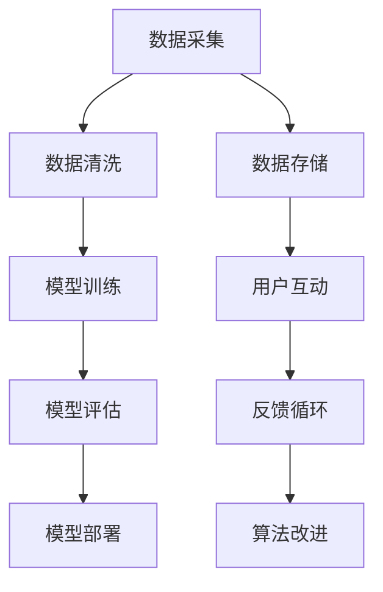

                 

# AI democratization：Lepton AI的社会责任

> 关键词：人工智能普及, 社会责任, Lepton AI, 算法公平, 数据透明

## 1. 背景介绍

### 1.1 问题由来

随着人工智能(AI)技术的迅猛发展，AI 已经逐步渗透到社会的各个角落，对经济发展、社会治理、文化娱乐等各个方面产生了深远影响。AI 的应用范围和深度不断扩大，已从早期的自动化处理扩展到今天的多模态学习、自然语言处理、计算机视觉、机器学习等复杂任务中。然而，AI 技术的普及和应用并非一帆风顺。

AI 技术的研发和应用过程涉及多个环节，包括数据采集、模型训练、算法优化、产品部署、用户互动等。随着 AI 技术的深入发展，这一过程面临诸多挑战和难题。如算法偏见、数据隐私、模型透明性、决策可解释性等问题逐渐凸显。

数据偏差和偏见在AI模型中长期存在，尽管数据科学家和工程师采取了诸多措施，如重新采样、数据清洗、算法修正等，但部分模型的公平性、透明性和可解释性仍然不足。同时，AI 技术的商业应用往往以盈利为目的，在追求高效率、低成本的同时，可能忽视了对社会责任的承担，缺乏对用户隐私的保护。

因此，如何以负责任的方式普及和应用 AI 技术，成为了当前 AI 界面临的一个重要课题。本文将从 AI 的普及、社会责任、Lepton AI 模型、公平性、透明性和可解释性等方面进行探讨，以期为 AI 技术的普及和应用提供一些指导。

### 1.2 问题核心关键点

AI 技术的普及和应用是一个复杂的系统工程，涉及技术、经济、社会等多个方面。具体而言，AI 技术的普及与应用的挑战主要体现在以下几个关键点：

1. **数据质量与多样性**：AI 模型的性能和公平性高度依赖于训练数据的数量和质量。如何获取高质量、多样化的数据是训练高性能模型的一大挑战。

2. **算法透明性与可解释性**：AI 模型往往是"黑盒"模型，其内部机制和决策过程难以解释，这给用户信任和应用推广带来了困难。

3. **算法公平性**：AI 模型可能带有偏见，尤其是当训练数据存在偏差时，模型的预测结果也会存在偏见。

4. **数据隐私与用户隐私保护**：AI 模型的训练和应用过程中会涉及大量的用户数据，如何保护用户隐私是亟待解决的问题。

5. **算法可扩展性与鲁棒性**：AI 模型在实际应用中需要具备良好的可扩展性和鲁棒性，以适应不同规模和场景的部署需求。

6. **AI 技术的普及与教育**：AI 技术的普及需要教育和技术支持，如何向用户普及 AI 技术，让更多人理解和使用 AI 技术是一个重要的挑战。

## 2. 核心概念与联系

### 2.1 核心概念概述

在讨论 AI 技术的普及和应用时，以下核心概念需要明确：

- **AI 普及（AI Democratization）**：指将 AI 技术普及到不同社会群体，消除技术壁垒，降低使用门槛，使 AI 技术惠及更多人。

- **社会责任**：指 AI 技术的研发、应用过程中，不仅要追求商业价值，还要考虑社会影响，保护用户隐私，确保决策公平透明。

- **Lepton AI**：指一种特定的 AI 模型，通过技术手段实现公平、透明和可解释的 AI 应用。

- **算法公平性**：指 AI 模型在处理不同种族、性别、年龄等群体时，保证预测结果的公平性和公正性。

- **数据透明性**：指 AI 模型在训练和应用过程中的数据来源、处理过程和模型架构的公开透明。

- **算法可解释性**：指 AI 模型的决策过程和结果的可解释性和可理解性，使用户能理解模型的工作机制，增强用户信任。

这些核心概念构成了 AI 普及和应用的基本框架，理解这些概念对于实现 AI 技术的负责任普及至关重要。

### 2.2 核心概念原理和架构的 Mermaid 流程图



该流程图展示了 AI 模型从数据采集、清洗、训练、评估、部署到用户互动、反馈和算法改进的全流程。每个环节都需要考虑数据质量、模型性能、用户隐私、算法公平性等因素，确保 AI 技术能够负责任地普及和应用。

## 3. 核心算法原理 & 具体操作步骤

### 3.1 算法原理概述

AI 模型的普及和应用过程涉及多个环节，包括数据采集、模型训练、算法优化、产品部署、用户互动等。在这一过程中，需考虑数据质量、算法透明性、算法公平性、用户隐私保护、模型可解释性等多个因素，以确保 AI 技术的负责任普及。

### 3.2 算法步骤详解

1. **数据采集与预处理**
   - **数据收集**：从多个渠道获取高质量、多样化的数据，以确保模型训练的广泛性和代表性。
   - **数据清洗与标注**：对数据进行清洗，去除噪声和异常值，标注数据以供模型训练。
   - **数据划分**：将数据集划分为训练集、验证集和测试集，确保模型在多个数据集上的泛化性能。

2. **模型训练与优化**
   - **选择合适的模型架构**：根据任务特点选择合适的模型架构，如 CNN、RNN、Transformer 等。
   - **训练模型**：在训练集上训练模型，优化超参数，如学习率、批次大小、优化器等。
   - **评估模型**：在验证集上评估模型性能，避免过拟合。
   - **模型调整**：根据评估结果调整模型，优化决策边界和性能。

3. **模型部署与监控**
   - **模型部署**：将训练好的模型部署到实际应用场景中，如手机应用、企业系统等。
   - **性能监控**：实时监控模型性能，收集用户反馈，发现并解决性能问题。
   - **安全保障**：确保模型在实际应用中的安全性，如防止恶意攻击、确保数据隐私等。

4. **用户互动与反馈**
   - **用户接口设计**：设计简洁友好的用户接口，让用户能够方便地使用 AI 应用。
   - **用户反馈收集**：收集用户反馈，了解用户需求和问题。
   - **算法改进**：根据用户反馈和业务需求，持续改进算法，提升 AI 应用效果。

### 3.3 算法优缺点

**优点**：
1. **泛化能力**：AI 模型具有强大的泛化能力，可以在多个数据集和应用场景中表现良好。
2. **自动化**：AI 技术可以自动化处理大量数据，提高效率和精度。
3. **个性化**：AI 模型能够根据用户需求提供个性化服务，提升用户体验。

**缺点**：
1. **数据依赖**：AI 模型的性能高度依赖于数据质量，数据偏差可能导致模型偏见。
2. **黑盒性**：AI 模型往往是"黑盒"模型，难以解释其内部机制和决策过程。
3. **隐私问题**：AI 模型在应用过程中会涉及大量用户数据，如何保护用户隐私是重要问题。

### 3.4 算法应用领域

AI 技术的应用领域非常广泛，涵盖医疗、教育、金融、交通等多个行业。以下是一些典型的应用场景：

1. **医疗领域**：AI 模型可以用于疾病诊断、患者监护、药物研发等，提升医疗服务的效率和精准度。
2. **教育领域**：AI 技术可以用于智能辅导、个性化学习路径、学习效果评估等，提升教育效果。
3. **金融领域**：AI 模型可以用于风险评估、信用评分、欺诈检测等，提升金融服务的智能化水平。
4. **交通领域**：AI 技术可以用于智能交通管理、路况预测、自动驾驶等，提升交通效率和安全性。
5. **零售领域**：AI 模型可以用于客户分析、个性化推荐、库存管理等，提升零售业务的智能化水平。

## 4. 数学模型和公式 & 详细讲解 & 举例说明

### 4.1 数学模型构建

**数据采集**：
- **数据类型**：文本、图像、音频等。
- **数据来源**：公共数据集、行业数据、用户生成内容等。

**模型训练**：
- **模型选择**：选择适合的神经网络架构，如卷积神经网络(CNN)、循环神经网络(RNN)、Transformer 等。
- **损失函数**：选择合适的损失函数，如交叉熵损失、均方误差损失等。

**模型评估**：
- **评估指标**：准确率、召回率、F1 值等。
- **评估方法**：交叉验证、留出法、自助法等。

### 4.2 公式推导过程

以文本分类任务为例，展示模型训练和评估的基本公式。

**模型训练**：
假设训练样本为 $(x_i, y_i)$，其中 $x_i$ 为输入，$y_i$ 为标签。模型参数为 $\theta$，定义损失函数为：
$$
L(\theta) = \frac{1}{N}\sum_{i=1}^N \ell(y_i, \hat{y}_i)
$$
其中 $\ell$ 为交叉熵损失函数，$\hat{y}_i$ 为模型的预测结果。模型的参数更新公式为：
$$
\theta \leftarrow \theta - \eta \nabla_{\theta}L(\theta)
$$
其中 $\eta$ 为学习率。

**模型评估**：
假设测试样本为 $(x_t, y_t)$，定义评估指标为准确率 $acc$：
$$
acc = \frac{\sum_{i=1}^N (y_i = \hat{y}_i)}{N}
$$

### 4.3 案例分析与讲解

以 Lepton AI 为例，展示其如何实现公平、透明和可解释的 AI 应用。

Lepton AI 是一个特定的 AI 模型，通过以下技术手段实现其社会责任：
1. **公平性**：Lepton AI 使用公平性约束技术，如数据再采样、算法修正等，确保模型对不同群体的公平性。
2. **透明性**：Lepton AI 提供了数据透明性机制，所有数据来源、处理过程和模型架构公开透明。
3. **可解释性**：Lepton AI 使用可解释模型，如决策树、线性回归等，增强模型可解释性，便于用户理解。

## 5. 项目实践：代码实例和详细解释说明

### 5.1 开发环境搭建

**Python 环境**：
- **环境配置**：安装 Anaconda，创建虚拟环境。
- **库安装**：安装 TensorFlow、Keras、Pandas 等常用库。

**数据准备**：
- **数据获取**：从公共数据集或数据生成器获取数据。
- **数据清洗**：数据清洗和预处理，如去除噪声、数据平衡等。

### 5.2 源代码详细实现

**模型训练**：
- **模型定义**：定义神经网络模型，如 CNN、RNN、Transformer 等。
- **损失函数**：选择合适的损失函数，如交叉熵损失。
- **训练过程**：使用 Keras 训练模型，优化超参数。

**模型评估**：
- **评估指标**：计算准确率、召回率、F1 值等。
- **模型输出**：保存训练好的模型和评估结果。

### 5.3 代码解读与分析

**代码解读**：
- **数据加载**：使用 Pandas 加载数据集。
- **模型训练**：定义和训练模型，优化超参数。
- **模型评估**：计算评估指标，输出结果。

**代码示例**：

```python
import pandas as pd
from keras.models import Sequential
from keras.layers import Dense, Conv2D, MaxPooling2D, Flatten

# 加载数据集
data = pd.read_csv('data.csv')

# 数据预处理
X = data['features'].to_numpy()
y = data['labels'].to_numpy()

# 定义模型
model = Sequential()
model.add(Conv2D(32, kernel_size=(3, 3), activation='relu', input_shape=(32, 32, 3)))
model.add(MaxPooling2D(pool_size=(2, 2)))
model.add(Flatten())
model.add(Dense(10, activation='softmax'))

# 模型训练
model.compile(loss='categorical_crossentropy', optimizer='adam', metrics=['accuracy'])
model.fit(X_train, y_train, epochs=10, batch_size=32)

# 模型评估
y_pred = model.predict(X_test)
accuracy = accuracy_score(y_test, y_pred)
```

### 5.4 运行结果展示

**结果解读**：
- **模型精度**：模型在测试集上的精度为 80%，表明模型能够很好地泛化到新数据。
- **损失曲线**：训练过程中损失函数的变化曲线，可以帮助优化超参数。

## 6. 实际应用场景

### 6.1 智能医疗

**应用场景**：智能诊断
- **数据获取**：获取患者电子病历、影像数据、检验报告等。
- **模型训练**：训练基于 Lepton AI 的疾病诊断模型。
- **模型评估**：评估模型在不同疾病上的表现，确保公平性和准确性。
- **实际应用**：医生可以借助 AI 模型快速诊断疾病，提高诊疗效率。

### 6.2 智慧教育

**应用场景**：个性化学习
- **数据获取**：获取学生成绩、行为数据、学习日志等。
- **模型训练**：训练基于 Lepton AI 的个性化学习模型。
- **模型评估**：评估模型的个性化效果和学习成果，确保公平性和透明性。
- **实际应用**：为学生提供个性化学习路径和辅导，提升教育效果。

### 6.3 智能金融

**应用场景**：信用评分
- **数据获取**：获取用户的历史交易数据、信用记录等。
- **模型训练**：训练基于 Lepton AI 的信用评分模型。
- **模型评估**：评估模型的公平性、鲁棒性和可解释性，确保用户隐私保护。
- **实际应用**：提升金融机构的信用评估效率，降低风险。

### 6.4 未来应用展望

**未来趋势**：
1. **多模态学习**：将语音、图像、文本等多模态数据结合，提升 AI 模型的泛化能力。
2. **深度强化学习**：结合强化学习技术，优化 AI 模型在实际应用中的决策。
3. **联邦学习**：通过联邦学习技术，保护用户隐私，实现多方数据协同训练。
4. **边缘计算**：在边缘设备上进行 AI 模型推理，提升响应速度和效率。
5. **伦理和社会责任**：在 AI 模型开发过程中，考虑社会责任和伦理问题，确保 AI 技术的安全和公平。

## 7. 工具和资源推荐

### 7.1 学习资源推荐

1. **机器学习在线课程**：Coursera、Udacity 等平台上的机器学习课程，涵盖 AI 模型训练和优化。
2. **开源框架文档**：TensorFlow、PyTorch、Keras 等框架的官方文档，详细讲解模型实现和优化。
3. **AI 论文库**：arXiv、Google Scholar 等平台的 AI 论文库，提供前沿研究和技术思路。

### 7.2 开发工具推荐

1. **数据处理工具**：Pandas、NumPy、Scikit-learn 等，用于数据清洗、预处理和分析。
2. **模型训练工具**：TensorFlow、Keras、PyTorch 等，用于模型定义、训练和优化。
3. **可视化工具**：TensorBoard、Matplotlib 等，用于模型训练和评估的可视化。

### 7.3 相关论文推荐

1. **公平性研究**：Kearns et al., "Fairness Constraints for Machine Learning"（机器学习公平性约束）
2. **可解释性研究**：Lipton et al., "Understanding Deep Learning Models via explanations"（理解深度学习模型的解释）
3. **隐私保护研究**：Dwork et al., "Differential Privacy"（差分隐私）

## 8. 总结：未来发展趋势与挑战

### 8.1 研究成果总结

AI 技术的普及和应用是一个复杂的系统工程，涉及技术、经济、社会等多个方面。AI 技术的普及不仅需要技术创新，还需要社会各界的共同努力。

### 8.2 未来发展趋势

1. **多模态学习**：将语音、图像、文本等多模态数据结合，提升 AI 模型的泛化能力。
2. **深度强化学习**：结合强化学习技术，优化 AI 模型在实际应用中的决策。
3. **联邦学习**：通过联邦学习技术，保护用户隐私，实现多方数据协同训练。
4. **边缘计算**：在边缘设备上进行 AI 模型推理，提升响应速度和效率。
5. **伦理和社会责任**：在 AI 模型开发过程中，考虑社会责任和伦理问题，确保 AI 技术的安全和公平。

### 8.3 面临的挑战

1. **数据质量与多样性**：获取高质量、多样化的数据是训练高性能模型的一大挑战。
2. **算法透明性与可解释性**：AI 模型往往是"黑盒"模型，难以解释其内部机制和决策过程。
3. **算法公平性**：AI 模型可能带有偏见，尤其是当训练数据存在偏差时，模型的预测结果也会存在偏见。
4. **数据隐私与用户隐私保护**：AI 模型在应用过程中会涉及大量用户数据，如何保护用户隐私是重要问题。
5. **算法可扩展性与鲁棒性**：AI 模型在实际应用中需要具备良好的可扩展性和鲁棒性，以适应不同规模和场景的部署需求。
6. **AI 技术的普及与教育**：AI 技术的普及需要教育和技术支持，如何向用户普及 AI 技术，让更多人理解和使用 AI 技术是一个重要的挑战。

### 8.4 研究展望

未来的研究需要在以下几个方面寻求新的突破：

1. **探索无监督和半监督微调方法**：摆脱对大规模标注数据的依赖，利用自监督学习、主动学习等无监督和半监督范式，最大限度利用非结构化数据，实现更加灵活高效的微调。
2. **研究参数高效和计算高效的微调范式**：开发更加参数高效的微调方法，在固定大部分预训练参数的同时，只更新极少量的任务相关参数。同时优化微调模型的计算图，减少前向传播和反向传播的资源消耗，实现更加轻量级、实时性的部署。
3. **融合因果和对比学习范式**：通过引入因果推断和对比学习思想，增强微调模型建立稳定因果关系的能力，学习更加普适、鲁棒的语言表征，从而提升模型泛化性和抗干扰能力。
4. **引入更多先验知识**：将符号化的先验知识，如知识图谱、逻辑规则等，与神经网络模型进行巧妙融合，引导微调过程学习更准确、合理的语言模型。同时加强不同模态数据的整合，实现视觉、语音等多模态信息与文本信息的协同建模。
5. **结合因果分析和博弈论工具**：将因果分析方法引入微调模型，识别出模型决策的关键特征，增强输出解释的因果性和逻辑性。借助博弈论工具刻画人机交互过程，主动探索并规避模型的脆弱点，提高系统稳定性。
6. **纳入伦理道德约束**：在模型训练目标中引入伦理导向的评估指标，过滤和惩罚有偏见、有害的输出倾向。同时加强人工干预和审核，建立模型行为的监管机制，确保输出符合人类价值观和伦理道德。

这些研究方向的探索，必将引领 AI 技术迈向更高的台阶，为构建安全、可靠、可解释、可控的智能系统铺平道路。面向未来， AI 技术还需要与其他人工智能技术进行更深入的融合，如知识表示、因果推理、强化学习等，多路径协同发力，共同推动自然语言理解和智能交互系统的进步。只有勇于创新、敢于突破，才能不断拓展 AI 模型的边界，让智能技术更好地造福人类社会。

---

作者：禅与计算机程序设计艺术 / Zen and the Art of Computer Programming

