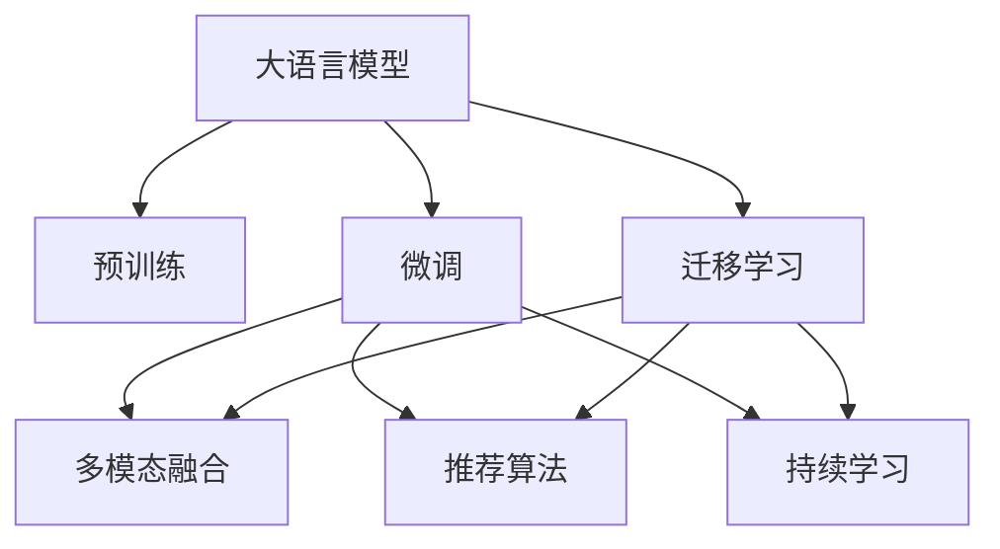

                 

# AI 大模型在搜索推荐系统中的应用策略：电商平台的转型指南

## 1. 背景介绍

### 1.1 问题由来

电商平台作为人们日常生活中不可或缺的一部分，近年来在技术和用户体验上取得了显著进步。在数据驱动和人工智能（AI）技术支撑下，电商平台的搜索推荐系统（Recommendation System）已经发展成为驱动用户行为和提升用户体验的核心引擎。然而，随着用户需求的日益多样化、个性化，传统的搜索推荐算法已经难以满足用户的高期待。

具体而言，传统的搜索推荐算法主要依赖于用户的历史行为数据（如浏览、购买历史），对用户当前的即时需求和未来趋势预测不足，且无法处理冷启动用户（即无历史行为数据的用户）的推荐问题。而电商平台的业务场景非常复杂，涉及海量的用户数据、商品数据、交易数据等，单一的数据源和算法模型往往难以全面覆盖各种用户需求和业务场景。

在此背景下，大语言模型（Large Language Models, LLMs）应运而生，以其丰富的语言理解和生成能力，成为构建电商搜索推荐系统的有力工具。大语言模型不仅能处理大规模无标签文本数据，还能在复杂的语义理解、情感分析、自然语言推理等任务中发挥出色表现，赋予搜索推荐系统更强大的语义理解和推荐能力。

### 1.2 问题核心关键点

大语言模型在电商搜索推荐系统中的应用策略，核心在于如何利用其强大的语言理解和生成能力，结合用户行为数据，构建高效、智能、个性化的推荐引擎。关键点包括：

- **数据融合与特征提取**：如何有效地将大语言模型与电商平台的数据融合，提取和理解用户语义、商品属性等特征。
- **跨模态融合**：如何将大语言模型与图像、视频等多模态数据融合，提升推荐结果的准确性和多样性。
- **个性推荐与实时调整**：如何基于用户即时需求和行为，动态调整推荐策略，提供个性化的搜索结果。
- **鲁棒性与泛化能力**：如何保证推荐系统在不同用户群体和场景下都能稳定运行，避免过拟合和偏见。

## 2. 核心概念与联系

### 2.1 核心概念概述

为更好地理解大语言模型在电商搜索推荐系统中的应用，本节将介绍几个密切相关的核心概念：

- **大语言模型（LLMs）**：以自回归（如GPT）或自编码（如BERT）模型为代表的大规模预训练语言模型。通过在大规模无标签文本数据上进行预训练，学习到丰富的语言知识和常识，具备强大的语言理解和生成能力。

- **预训练（Pre-training）**：指在大规模无标签文本数据上，通过自监督学习任务（如掩码语言模型、预测下一段等）训练通用语言模型的过程。预训练使得模型学习到语言的通用表示。

- **微调（Fine-tuning）**：指在预训练模型的基础上，使用特定任务的标注数据，通过有监督学习优化模型在该任务上的性能。在搜索推荐系统中，微调可以用于优化模型对用户即时需求的理解，提升推荐结果的准确性和个性化。

- **迁移学习（Transfer Learning）**：指将一个领域学习到的知识，迁移到另一个不同但相关的领域的学习范式。在搜索推荐系统中，大语言模型可以通过迁移学习，从电商平台的文本数据中提取有用的知识，应用于不同模态数据的融合和推荐策略优化。

- **多模态融合（Multimodal Fusion）**：指将不同类型的数据（如文本、图像、视频等）融合到推荐系统中，提升推荐的丰富性和准确性。大语言模型在处理文本数据方面具有优势，与图像、视频等多模态数据的融合，可以进一步提升推荐的全面性。

- **推荐算法（Recommendation Algorithms）**：如协同过滤、基于内容的推荐、基于知识的推荐等，是构建推荐系统的核心算法。大语言模型可以通过微调和迁移学习，增强这些算法在处理自然语言数据时的能力，提升推荐效果。

- **持续学习（Continual Learning）**：指模型能够不断从新数据中学习，同时保持已学习的知识，而不会出现灾难性遗忘。对于电商平台的搜索推荐系统，持续学习可以保证模型在用户行为和市场趋势变化时，仍能保持高效和稳定。

这些核心概念之间的逻辑关系可以通过以下Mermaid流程图来展示：



这个流程图展示了大语言模型在电商搜索推荐系统中的应用框架：

1. 大语言模型通过预训练获得基础能力。
2. 微调用于优化模型对用户即时需求的理解，提升推荐结果的准确性和个性化。
3. 迁移学习使得大语言模型从电商平台的文本数据中提取有用的知识，应用于不同模态数据的融合和推荐策略优化。
4. 多模态融合提升推荐的全面性和丰富性。
5. 推荐算法实现具体的推荐策略，如协同过滤、内容推荐等。
6. 持续学习保证模型在用户行为和市场趋势变化时，仍能保持高效和稳定。

## 3. 核心算法原理 & 具体操作步骤

### 3.1 算法原理概述

大语言模型在电商搜索推荐系统中的应用，本质上是一个多任务学习和迁移学习的过程。其核心思想是：将大语言模型视作一个强大的特征提取器，通过在电商平台的文本数据上进行预训练和微调，学习到对用户需求和商品属性的理解，并将其应用于推荐算法中，实现个性化的推荐。

具体而言，假设电商平台的数据集为 $D=\{(x_i, y_i)\}_{i=1}^N$，其中 $x_i$ 为商品描述和用户评论的文本数据，$y_i$ 为用户的购买行为标签。大语言模型 $M_{\theta}$ 通过预训练学习到了通用语言表示，通过微调优化模型在电商推荐任务上的性能，即：

$$
\hat{\theta}=\mathop{\arg\min}_{\theta} \mathcal{L}(M_{\theta},D)
$$

其中 $\mathcal{L}$ 为针对电商推荐任务设计的损失函数，用于衡量模型预测行为与真实标签之间的差异。常见的损失函数包括交叉熵损失、均方误差损失等。

### 3.2 算法步骤详解

基于大语言模型在电商搜索推荐系统中的应用策略，本节将详细讲解其操作步骤：

**Step 1: 准备预训练模型和数据集**
- 选择合适的预训练语言模型 $M_{\theta}$ 作为初始化参数，如 BERT、GPT 等。
- 准备电商平台的标注数据集 $D$，包括商品描述、用户评论、购买行为等，划分为训练集、验证集和测试集。一般要求标注数据与预训练数据的分布不要差异过大。

**Step 2: 添加任务适配层**
- 根据电商推荐任务，在预训练模型顶层设计合适的输出层和损失函数。
- 对于推荐任务，通常在顶层添加线性分类器和交叉熵损失函数。
- 对于多模态融合任务，可以通过额外的网络层将文本特征与其他模态特征融合。

**Step 3: 设置微调超参数**
- 选择合适的优化算法及其参数，如 AdamW、SGD 等，设置学习率、批大小、迭代轮数等。
- 设置正则化技术及强度，包括权重衰减、Dropout、Early Stopping 等。
- 确定冻结预训练参数的策略，如仅微调顶层，或全部参数都参与微调。

**Step 4: 执行梯度训练**
- 将训练集数据分批次输入模型，前向传播计算损失函数。
- 反向传播计算参数梯度，根据设定的优化算法和学习率更新模型参数。
- 周期性在验证集上评估模型性能，根据性能指标决定是否触发 Early Stopping。
- 重复上述步骤直到满足预设的迭代轮数或 Early Stopping 条件。

**Step 5: 测试和部署**
- 在测试集上评估微调后模型 $M_{\hat{\theta}}$ 的性能，对比微调前后的精度提升。
- 使用微调后的模型对新商品和新用户进行推荐，集成到实际的应用系统中。
- 持续收集新的用户行为数据和商品数据，定期重新微调模型，以适应数据分布的变化。

以上是基于大语言模型在电商搜索推荐系统中的应用策略的一般流程。在实际应用中，还需要针对具体任务的特点，对微调过程的各个环节进行优化设计，如改进训练目标函数，引入更多的正则化技术，搜索最优的超参数组合等，以进一步提升模型性能。

### 3.3 算法优缺点

大语言模型在电商搜索推荐系统中的应用具有以下优点：
1. 强大的语言理解和生成能力：大语言模型能够理解和生成复杂的自然语言，提升推荐系统的语义理解和推荐效果。
2. 多模态融合能力：通过大语言模型，可以更全面地处理电商平台的文本、图像、视频等多模态数据，提升推荐的丰富性和准确性。
3. 动态调整推荐策略：大语言模型能够根据用户即时需求和行为，动态调整推荐策略，提供个性化的搜索结果。
4. 泛化能力强：大语言模型经过大规模预训练，能够从电商平台的文本数据中提取有用的知识，应用于不同模态数据的融合和推荐策略优化，提升推荐系统的泛化能力。

同时，该方法也存在一定的局限性：
1. 依赖标注数据：微调的效果很大程度上取决于标注数据的质量和数量，获取高质量标注数据的成本较高。
2. 迁移能力有限：当目标任务与预训练数据的分布差异较大时，微调的性能提升有限。
3. 负面效果传递：预训练模型的固有偏见、有害信息等，可能通过微调传递到下游任务，造成负面影响。
4. 可解释性不足：微调模型的决策过程通常缺乏可解释性，难以对其推理逻辑进行分析和调试。

尽管存在这些局限性，但就目前而言，大语言模型在电商搜索推荐系统中的应用策略仍然是主流范式。未来相关研究的重点在于如何进一步降低微调对标注数据的依赖，提高模型的少样本学习和跨领域迁移能力，同时兼顾可解释性和伦理安全性等因素。

### 3.4 算法应用领域

大语言模型在电商搜索推荐系统中的应用，已经涵盖了商品推荐、用户画像、广告推荐等多个领域。具体而言：

1. **商品推荐**：根据用户的历史行为、浏览记录、评论等文本数据，预测用户可能感兴趣的商品，进行个性化推荐。
2. **用户画像**：通过分析用户评论、购买行为等文本数据，构建用户画像，提升用户行为预测的准确性。
3. **广告推荐**：根据用户文本数据和广告内容，进行广告投放优化，提升广告点击率和转化率。
4. **异常检测**：利用大语言模型对用户行为和商品数据进行分析，检测异常交易和行为，保障电商平台安全。
5. **自然语言查询**：利用大语言模型处理用户输入的自然语言查询，进行精准搜索结果排序和推荐。

除了上述这些经典应用外，大语言模型还在电商平台的个性化推荐、内容生成、客户服务等多个场景中得到了创新应用，为电商平台带来了新的业务价值。

## 4. 数学模型和公式 & 详细讲解  
### 4.1 数学模型构建

本节将使用数学语言对基于大语言模型在电商搜索推荐系统中的应用策略进行更加严格的刻画。

记电商平台的数据集为 $D=\{(x_i, y_i)\}_{i=1}^N$，其中 $x_i$ 为商品描述和用户评论的文本数据，$y_i$ 为用户的购买行为标签。假设大语言模型 $M_{\theta}$ 通过预训练学习到了通用语言表示，通过微调优化模型在电商推荐任务上的性能，即：

$$
\hat{\theta}=\mathop{\arg\min}_{\theta} \mathcal{L}(M_{\theta},D)
$$

其中 $\mathcal{L}$ 为针对电商推荐任务设计的损失函数，用于衡量模型预测行为与真实标签之间的差异。常见的损失函数包括交叉熵损失、均方误差损失等。

在微调过程中，模型 $M_{\theta}$ 在输入 $x_i$ 上的输出为 $\hat{y}=M_{\theta}(x_i) \in [0,1]$，表示用户购买商品的概率。真实标签 $y_i \in \{0,1\}$。则电商推荐任务的交叉熵损失函数定义为：

$$
\ell(M_{\theta}(x_i),y_i) = -[y_i\log \hat{y}_i + (1-y_i)\log (1-\hat{y}_i)]
$$

将其代入经验风险公式，得：

$$
\mathcal{L}(\theta) = -\frac{1}{N}\sum_{i=1}^N [y_i\log M_{\theta}(x_i)+(1-y_i)\log(1-M_{\theta}(x_i))]
$$

根据链式法则，损失函数对参数 $\theta_k$ 的梯度为：

$$
\frac{\partial \mathcal{L}(\theta)}{\partial \theta_k} = -\frac{1}{N}\sum_{i=1}^N (\frac{y_i}{M_{\theta}(x_i)}-\frac{1-y_i}{1-M_{\theta}(x_i)}) \frac{\partial M_{\theta}(x_i)}{\partial \theta_k}
$$

其中 $\frac{\partial M_{\theta}(x_i)}{\partial \theta_k}$ 可进一步递归展开，利用自动微分技术完成计算。

在得到损失函数的梯度后，即可带入参数更新公式，完成模型的迭代优化。重复上述过程直至收敛，最终得到适应电商推荐任务的最优模型参数 $\theta^*$。

## 5. 项目实践：代码实例和详细解释说明
### 5.1 开发环境搭建

在进行大语言模型在电商搜索推荐系统中的应用策略实践前，我们需要准备好开发环境。以下是使用Python进行PyTorch开发的环境配置流程：

1. 安装Anaconda：从官网下载并安装Anaconda，用于创建独立的Python环境。

2. 创建并激活虚拟环境：
```bash
conda create -n pytorch-env python=3.8 
conda activate pytorch-env
```

3. 安装PyTorch：根据CUDA版本，从官网获取对应的安装命令。例如：
```bash
conda install pytorch torchvision torchaudio cudatoolkit=11.1 -c pytorch -c conda-forge
```

4. 安装Transformers库：
```bash
pip install transformers
```

5. 安装各类工具包：
```bash
pip install numpy pandas scikit-learn matplotlib tqdm jupyter notebook ipython
```

完成上述步骤后，即可在`pytorch-env`环境中开始大语言模型在电商搜索推荐系统中的应用策略实践。

### 5.2 源代码详细实现

这里我们以电商平台商品推荐任务为例，给出使用Transformers库对BERT模型进行微调的PyTorch代码实现。

首先，定义商品推荐任务的数据处理函数：

```python
from transformers import BertTokenizer
from torch.utils.data import Dataset
import torch

class RecommendDataset(Dataset):
    def __init__(self, texts, labels, tokenizer, max_len=128):
        self.texts = texts
        self.labels = labels
        self.tokenizer = tokenizer
        self.max_len = max_len
        
    def __len__(self):
        return len(self.texts)
    
    def __getitem__(self, item):
        text = self.texts[item]
        label = self.labels[item]
        
        encoding = self.tokenizer(text, return_tensors='pt', max_length=self.max_len, padding='max_length', truncation=True)
        input_ids = encoding['input_ids'][0]
        attention_mask = encoding['attention_mask'][0]
        
        # 对label进行one-hot编码
        encoded_labels = [1] if label == '购买' else [0]
        encoded_labels.extend([0] * (self.max_len - len(encoded_labels)))
        labels = torch.tensor(encoded_labels, dtype=torch.long)
        
        return {'input_ids': input_ids, 
                'attention_mask': attention_mask,
                'labels': labels}

# 商品标签与id的映射
label2id = {'购买': 1, '未购买': 0}
id2label = {v: k for k, v in label2id.items()}

# 创建dataset
tokenizer = BertTokenizer.from_pretrained('bert-base-cased')

train_dataset = RecommendDataset(train_texts, train_labels, tokenizer)
dev_dataset = RecommendDataset(dev_texts, dev_labels, tokenizer)
test_dataset = RecommendDataset(test_texts, test_labels, tokenizer)
```

然后，定义模型和优化器：

```python
from transformers import BertForTokenClassification, AdamW

model = BertForTokenClassification.from_pretrained('bert-base-cased', num_labels=len(label2id))

optimizer = AdamW(model.parameters(), lr=2e-5)
```

接着，定义训练和评估函数：

```python
from torch.utils.data import DataLoader
from tqdm import tqdm
from sklearn.metrics import accuracy_score

device = torch.device('cuda') if torch.cuda.is_available() else torch.device('cpu')
model.to(device)

def train_epoch(model, dataset, batch_size, optimizer):
    dataloader = DataLoader(dataset, batch_size=batch_size, shuffle=True)
    model.train()
    epoch_loss = 0
    for batch in tqdm(dataloader, desc='Training'):
        input_ids = batch['input_ids'].to(device)
        attention_mask = batch['attention_mask'].to(device)
        labels = batch['labels'].to(device)
        model.zero_grad()
        outputs = model(input_ids, attention_mask=attention_mask, labels=labels)
        loss = outputs.loss
        epoch_loss += loss.item()
        loss.backward()
        optimizer.step()
    return epoch_loss / len(dataloader)

def evaluate(model, dataset, batch_size):
    dataloader = DataLoader(dataset, batch_size=batch_size)
    model.eval()
    preds, labels = [], []
    with torch.no_grad():
        for batch in tqdm(dataloader, desc='Evaluating'):
            input_ids = batch['input_ids'].to(device)
            attention_mask = batch['attention_mask'].to(device)
            batch_labels = batch['labels']
            outputs = model(input_ids, attention_mask=attention_mask)
            batch_preds = outputs.logits.argmax(dim=2).to('cpu').tolist()
            batch_labels = batch_labels.to('cpu').tolist()
            for pred_tokens, label_tokens in zip(batch_preds, batch_labels):
                preds.append(pred_tokens[:len(label_tokens)])
                labels.append(label_tokens)
                
    print(f"Accuracy: {accuracy_score(labels, preds)}")
```

最后，启动训练流程并在测试集上评估：

```python
epochs = 5
batch_size = 16

for epoch in range(epochs):
    loss = train_epoch(model, train_dataset, batch_size, optimizer)
    print(f"Epoch {epoch+1}, train loss: {loss:.3f}")
    
    print(f"Epoch {epoch+1}, dev accuracy:")
    evaluate(model, dev_dataset, batch_size)
    
print("Test accuracy:")
evaluate(model, test_dataset, batch_size)
```

以上就是使用PyTorch对BERT进行电商平台商品推荐任务微调的完整代码实现。可以看到，得益于Transformers库的强大封装，我们可以用相对简洁的代码完成BERT模型的加载和微调。

### 5.3 代码解读与分析

让我们再详细解读一下关键代码的实现细节：

**RecommendDataset类**：
- `__init__`方法：初始化文本、标签、分词器等关键组件。
- `__len__`方法：返回数据集的样本数量。
- `__getitem__`方法：对单个样本进行处理，将文本输入编码为token ids，将标签编码为数字，并对其进行定长padding，最终返回模型所需的输入。

**label2id和id2label字典**：
- 定义了商品标签与数字id之间的映射关系，用于将token-wise的预测结果解码回真实的标签。

**训练和评估函数**：
- 使用PyTorch的DataLoader对数据集进行批次化加载，供模型训练和推理使用。
- 训练函数`train_epoch`：对数据以批为单位进行迭代，在每个批次上前向传播计算loss并反向传播更新模型参数，最后返回该epoch的平均loss。
- 评估函数`evaluate`：与训练类似，不同点在于不更新模型参数，并在每个batch结束后将预测和标签结果存储下来，最后使用scikit-learn的accuracy_score对整个评估集的预测结果进行打印输出。

**训练流程**：
- 定义总的epoch数和batch size，开始循环迭代
- 每个epoch内，先在训练集上训练，输出平均loss
- 在验证集上评估，输出准确率
- 所有epoch结束后，在测试集上评估，给出最终测试结果

可以看到，PyTorch配合Transformers库使得BERT微调的代码实现变得简洁高效。开发者可以将更多精力放在数据处理、模型改进等高层逻辑上，而不必过多关注底层的实现细节。

当然，工业级的系统实现还需考虑更多因素，如模型的保存和部署、超参数的自动搜索、更灵活的任务适配层等。但核心的微调范式基本与此类似。

## 6. 实际应用场景
### 6.1 智能客服系统

基于大语言模型在电商搜索推荐系统中的应用策略，智能客服系统可以更好地理解和应对用户的多样化需求，提升用户体验。智能客服系统通过收集用户的历史对话记录，构建用户的意图和情感模型，利用大语言模型进行实时对话理解和响应生成。

在技术实现上，智能客服系统可以整合电商平台的用户行为数据，结合用户的即时聊天内容，进行意图分类和情感分析，从而生成更个性化的回复。微调后的对话模型能够理解用户的即时需求，匹配最合适的回答，减少人工客服的干预，提高服务效率。

### 6.2 金融舆情监测

金融行业对市场舆情的实时监测和风险管理至关重要。基于大语言模型在电商搜索推荐系统中的应用策略，可以构建金融舆情监测系统，实时分析金融领域的文本数据，预测市场趋势和舆情变化。

具体而言，金融舆情监测系统可以收集金融领域的各种新闻、评论、报告等文本数据，利用大语言模型进行情感分析和主题分类，及时发现市场异动和舆情波动。微调后的模型能够根据实时抓取的网络文本数据，自动监测不同主题下的情感变化趋势，一旦发现负面信息激增等异常情况，系统便会自动预警，帮助金融机构快速应对潜在风险。

### 6.3 个性化推荐系统

大语言模型在电商平台的商品推荐系统中具有重要应用价值。基于大语言模型在电商搜索推荐系统中的应用策略，可以利用用户的文本数据，进行个性化推荐。

在实践中，电商平台的推荐系统可以收集用户浏览、点击、评论、分享等行为数据，提取和用户交互的物品标题、描述、标签等文本内容。将文本内容作为模型输入，用户的后续行为（如是否点击、购买等）作为监督信号，在此基础上微调预训练语言模型。微调后的模型能够从文本内容中准确把握用户的兴趣点，生成更加精准和多样化的推荐结果。

### 6.4 未来应用展望

随着大语言模型和推荐系统技术的不断发展，基于大语言模型在电商搜索推荐系统中的应用策略将在更多领域得到应用，为各行业带来变革性影响。

在智慧医疗领域，基于大语言模型在电商搜索推荐系统中的应用策略，可以构建智能诊疗系统，通过分析患者的历史诊疗记录和当前症状，提供个性化的诊疗方案。在智慧医疗的推荐系统中，大语言模型可以通过微调学习患者的病史和症状，提升诊疗建议的准确性和个性化。

在智能教育领域，基于大语言模型在电商搜索推荐系统中的应用策略，可以构建智能教育平台，通过分析学生的学习行为和反馈，提供个性化的学习建议和资源推荐。在智能教育的推荐系统中，大语言模型可以通过微调学习学生的兴趣和难点，提升个性化推荐的精准度和学习效果。

在智慧城市治理中，基于大语言模型在电商搜索推荐系统中的应用策略，可以构建智能城市管理平台，通过分析城市事件和舆情数据，提供智能化的城市管理决策支持。在智能城市管理的推荐系统中，大语言模型可以通过微调学习城市事件的多维特征，提升决策建议的准确性和实时性。

此外，在企业生产、社会治理、文娱传媒等众多领域，基于大语言模型在电商搜索推荐系统中的应用策略，也将不断涌现新的应用场景，为各行业带来新的价值。相信随着技术的日益成熟，大语言模型在电商搜索推荐系统中的应用策略必将在构建智能系统方面发挥更大的作用。

## 7. 工具和资源推荐
### 7.1 学习资源推荐

为了帮助开发者系统掌握大语言模型在电商搜索推荐系统中的应用策略，这里推荐一些优质的学习资源：

1. 《Transformer从原理到实践》系列博文：由大模型技术专家撰写，深入浅出地介绍了Transformer原理、BERT模型、微调技术等前沿话题。

2. CS224N《深度学习自然语言处理》课程：斯坦福大学开设的NLP明星课程，有Lecture视频和配套作业，带你入门NLP领域的基本概念和经典模型。

3. 《Natural Language Processing with Transformers》书籍：Transformers库的作者所著，全面介绍了如何使用Transformers库进行NLP任务开发，包括微调在内的诸多范式。

4. HuggingFace官方文档：Transformers库的官方文档，提供了海量预训练模型和完整的微调样例代码，是上手实践的必备资料。

5. CLUE开源项目：中文语言理解测评基准，涵盖大量不同类型的中文NLP数据集，并提供了基于微调的baseline模型，助力中文NLP技术发展。

通过对这些资源的学习实践，相信你一定能够快速掌握大语言模型在电商搜索推荐系统中的应用策略，并用于解决实际的NLP问题。
###  7.2 开发工具推荐

高效的开发离不开优秀的工具支持。以下是几款用于大语言模型在电商搜索推荐系统中的应用策略开发的常用工具：

1. PyTorch：基于Python的开源深度学习框架，灵活动态的计算图，适合快速迭代研究。大部分预训练语言模型都有PyTorch版本的实现。

2. TensorFlow：由Google主导开发的开源深度学习框架，生产部署方便，适合大规模工程应用。同样有丰富的预训练语言模型资源。

3. Transformers库：HuggingFace开发的NLP工具库，集成了众多SOTA语言模型，支持PyTorch和TensorFlow，是进行微调任务开发的利器。

4. Weights & Biases：模型训练的实验跟踪工具，可以记录和可视化模型训练过程中的各项指标，方便对比和调优。与主流深度学习框架无缝集成。

5. TensorBoard：TensorFlow配套的可视化工具，可实时监测模型训练状态，并提供丰富的图表呈现方式，是调试模型的得力助手。

6. Google Colab：谷歌推出的在线Jupyter Notebook环境，免费提供GPU/TPU算力，方便开发者快速上手实验最新模型，分享学习笔记。

合理利用这些工具，可以显著提升大语言模型在电商搜索推荐系统中的应用策略的开发效率，加快创新迭代的步伐。

### 7.3 相关论文推荐

大语言模型和推荐系统的发展源于学界的持续研究。以下是几篇奠基性的相关论文，推荐阅读：

1. Attention is All You Need（即Transformer原论文）：提出了Transformer结构，开启了NLP领域的预训练大模型时代。

2. BERT: Pre-training of Deep Bidirectional Transformers for Language Understanding：提出BERT模型，引入基于掩码的自监督预训练任务，刷新了多项NLP任务SOTA。

3. Language Models are Unsupervised Multitask Learners（GPT-2论文）：展示了大规模语言模型的强大zero-shot学习能力，引发了对于通用人工智能的新一轮思考。

4. Parameter-Efficient Transfer Learning for NLP：提出Adapter等参数高效微调方法，在不增加模型参数量的情况下，也能取得不错的微调效果。

5. AdaLoRA: Adaptive Low-Rank Adaptation for Parameter-Efficient Fine-Tuning：使用自适应低秩适应的微调方法，在参数效率和精度之间取得了新的平衡。

这些论文代表了大语言模型和推荐系统的发展脉络。通过学习这些前沿成果，可以帮助研究者把握学科前进方向，激发更多的创新灵感。

## 8. 总结：未来发展趋势与挑战

### 8.1 总结

本文对基于大语言模型在电商搜索推荐系统中的应用策略进行了全面系统的介绍。首先阐述了电商平台的业务场景和现有推荐系统的局限性，明确了大语言模型在电商搜索推荐系统中的应用策略的重要性和必要性。其次，从原理到实践，详细讲解了大语言模型在电商搜索推荐系统中的应用策略的数学原理和关键步骤，给出了电商推荐任务微调的完整代码实例。同时，本文还广泛探讨了大语言模型在电商平台的智能客服、金融舆情、个性化推荐等多个行业领域的应用前景，展示了其巨大的潜力。此外，本文精选了大语言模型在电商搜索推荐系统中的应用策略的学习资源，力求为读者提供全方位的技术指引。

通过本文的系统梳理，可以看到，基于大语言模型在电商搜索推荐系统中的应用策略正在成为电商推荐技术的重要范式，极大地拓展了电商平台的推荐能力，提升了用户体验。未来，伴随大语言模型和推荐系统技术的持续演进，基于大语言模型在电商搜索推荐系统中的应用策略必将在构建智能系统方面发挥更大的作用。

### 8.2 未来发展趋势

展望未来，大语言模型在电商搜索推荐系统中的应用策略将呈现以下几个发展趋势：

1. 模型规模持续增大。随着算力成本的下降和数据规模的扩张，预训练语言模型的参数量还将持续增长。超大规模语言模型蕴含的丰富语言知识，有望支撑更加复杂多变的电商推荐任务。

2. 多模态融合能力增强。未来的大语言模型将不仅能够处理文本数据，还能融合图像、视频等多模态数据，提升推荐的全面性和准确性。

3. 动态推荐策略优化。随着电商平台的个性化需求不断提升，未来的大语言模型将更加注重动态调整推荐策略，根据用户的即时需求和行为，提供个性化的推荐结果。

4. 持续学习成为常态。大语言模型能够不断从新数据中学习，同时保持已学习的知识，而不会出现灾难性遗忘。这对于电商平台的实时推荐系统，保证推荐效果的一致性和稳定性至关重要。

5. 数据和知识融合优化。大语言模型能够更好地融合电商平台的各类数据和知识库，提升推荐系统的性能和泛化能力。未来的大语言模型将不仅仅是文本处理工具，而是能够多模态融合、知识驱动的智能推荐引擎。

6. 算法与模型协同优化。未来的大语言模型推荐系统将不仅仅依赖于推荐算法，而是算法与模型协同优化，通过优化模型参数和调整推荐策略，实现更精准、更高效的推荐结果。

以上趋势凸显了大语言模型在电商搜索推荐系统中的应用策略的广阔前景。这些方向的探索发展，必将进一步提升电商平台的推荐系统性能和用户体验，为电商平台的智能化转型提供新的动力。

### 8.3 面临的挑战

尽管大语言模型在电商搜索推荐系统中的应用策略已经取得了显著进展，但在迈向更加智能化、普适化应用的过程中，它仍面临诸多挑战：

1. 标注成本瓶颈。微调需要大量的标注数据，电商平台的推荐任务涉及海量的商品和用户数据，标注成本较高。如何降低标注数据的需求，是一个亟待解决的问题。

2. 模型鲁棒性不足。大语言模型在处理电商平台的复杂数据时，容易受到噪声数据的影响，泛化能力有限。如何在复杂数据环境下保证模型的鲁棒性，是一个重要的研究课题。

3. 资源消耗高。超大规模语言模型在计算和存储上的消耗较大，电商平台需要投入大量的硬件资源。如何在保证性能的前提下，优化模型的资源使用，也是一个重要的研究方向。

4. 可解释性不足。大语言模型在推荐过程中缺乏可解释性，难以解释推荐结果的依据。这对于电商平台的用户信任和透明度要求较高，是一个亟待解决的问题。

5. 安全性有待保障。大语言模型可能学习到电商平台中的偏见和有害信息，传递到推荐结果中，带来潜在风险。如何保证模型输出的安全性和伦理性，是一个重要的研究方向。

6. 跨领域迁移能力不足。大语言模型在电商平台的推荐任务中表现出色，但在其他领域的应用效果可能会有所差异。如何提升大语言模型的跨领域迁移能力，是一个重要的研究方向。

正视大语言模型在电商搜索推荐系统中的应用策略面临的这些挑战，积极应对并寻求突破，将是大语言模型在电商平台成功应用的关键。相信随着学界和产业界的共同努力，这些挑战终将一一被克服，大语言模型在电商平台的搜索推荐系统中的应用策略必将在构建智能系统方面发挥更大的作用。

### 8.4 研究展望

面对大语言模型在电商搜索推荐系统中的应用策略所面临的种种挑战，未来的研究需要在以下几个方面寻求新的突破：

1. 探索无监督和半监督微调方法。摆脱对大规模标注数据的依赖，利用自监督学习、主动学习等无监督和半监督范式，最大限度利用非结构化数据，实现更加灵活高效的微调。

2. 研究参数高效和计算高效的微调范式。开发更加参数高效的微调方法，在固定大部分预训练参数的同时，只更新极少量的任务相关参数。同时优化微调模型的计算图，减少前向传播和反向传播的资源消耗，实现更加轻量级、实时性的部署。

3. 融合因果和对比学习范式。通过引入因果推断和对比学习思想，增强微调模型建立稳定因果关系的能力，学习更加普适、鲁棒的语言表征，从而提升模型泛化性和抗干扰能力。

4. 引入更多先验知识。将符号化的先验知识，如知识图谱、逻辑规则等，与神经网络模型进行巧妙融合，引导微调过程学习更准确、合理的语言模型。同时加强不同模态数据的整合，实现视觉、语音等多模态信息与文本信息的协同建模。

5. 结合因果分析和博弈论工具。将因果分析方法引入微调模型，识别出模型决策的关键特征，增强输出解释的因果性和逻辑性。借助博弈论工具刻画人机交互过程，主动探索并规避模型的脆弱点，提高系统稳定性。

6. 纳入伦理道德约束。在模型训练目标中引入伦理导向的评估指标，过滤和惩罚有偏见、有害的输出倾向。同时加强人工干预和审核，建立模型行为的监管机制，确保输出符合人类价值观和伦理道德。

这些研究方向的探索，必将引领大语言模型在电商搜索推荐系统中的应用策略迈向更高的台阶，为构建安全、可靠、可解释、可控的智能推荐系统铺平道路。面向未来，大语言模型在电商平台的搜索推荐系统中的应用策略还需要与其他人工智能技术进行更深入的融合，如知识表示、因果推理、强化学习等，多路径协同发力，共同推动智能推荐系统的进步。只有勇于创新、敢于突破，才能不断拓展语言模型的边界，让智能技术更好地造福人类社会。

## 9. 附录：常见问题与解答

**Q1：大语言模型在电商搜索推荐系统中的应用策略是否适用于所有电商业务场景？**

A: 大语言模型在电商搜索推荐系统中的应用策略适用于大多数电商业务场景，特别是涉及海量的商品和用户数据，且需要精细化推荐的场景。但对于一些对实时性要求极高、数据量较小的电商场景，可能还需结合传统的推荐算法和技术。

**Q2：大语言模型在电商推荐系统的微调过程中，如何避免过拟合？**

A: 避免过拟合是大语言模型在电商推荐系统微调过程中需要特别注意的问题。以下是一些常见的缓解策略：

1. 数据增强：通过回译、近义替换等方式扩充训练集。
2. 正则化技术：使用L2正则、Dropout、Early Stopping等防止模型过度适应小规模训练集。
3. 对抗训练：加入对抗样本，提高模型鲁棒性。
4. 参数高效微调：只调整少量参数(如Adapter、Prefix等)，减小过拟合风险。
5. 多模型集成：训练多个微调模型，取平均输出，抑制过拟合。

这些策略往往需要根据具体任务和数据特点进行灵活组合。只有在数据、模型、训练、推理等各环节进行全面优化，才能最大限度地发挥大语言模型的优势。

**Q3：电商推荐系统中的商品推荐是否需要考虑用户的即时需求和行为？**

A: 是的，电商推荐系统中的商品推荐需要考虑用户的即时需求和行为。即时需求和行为能够反映用户当前的状态和偏好，实时推荐能够更好地满足用户的需求，提升用户的购物体验。

**Q4：电商平台如何利用大语言模型进行个性化推荐？**

A: 电商平台可以利用大语言模型进行个性化推荐，主要通过以下步骤：

1. 收集用户的历史浏览、点击、评论、分享等行为数据，提取和用户交互的物品标题、描述、标签等文本内容。
2. 将文本内容作为模型输入，用户的后续行为（如是否点击、购买等）作为监督信号，在此基础上微调预训练语言模型。
3. 利用微调后的模型，根据用户的即时需求和行为，动态调整推荐策略，生成个性化的推荐结果。

通过以上步骤，电商平台能够更好地理解和响应用户的即时需求，提供更精准、更个性化的商品推荐。

**Q5：电商平台的智能客服系统如何利用大语言模型进行智能推荐？**

A: 电商平台的智能客服系统可以利用大语言模型进行智能推荐，主要通过以下步骤：

1. 收集用户的历史对话记录，构建用户的意图和情感模型。
2. 将用户的即时聊天内容作为输入，利用微调后的对话模型进行意图分类和情感分析。
3. 根据分析结果，匹配最合适的回答，并推荐相关商品。

通过以上步骤，电商平台的智能客服系统能够更好地理解和响应用户的即时需求，提升用户满意度和购物体验。

---

作者：禅与计算机程序设计艺术 / Zen and the Art of Computer Programming

