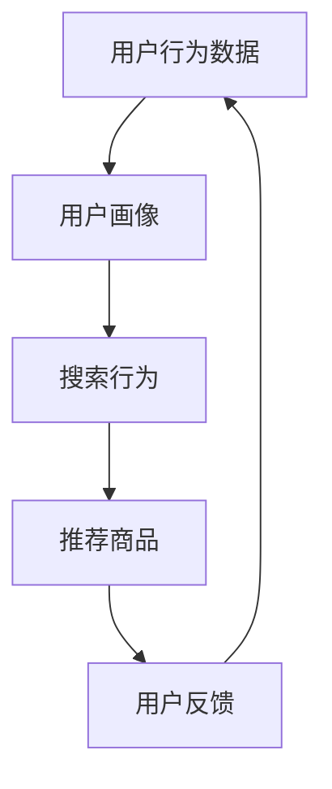

                 

# AI 大模型在搜索推荐系统中的算法本质：电商平台的应用策略

> 关键词：搜索推荐系统，电商平台，大模型，机器学习，深度学习，用户行为分析，个性化推荐

## 1. 背景介绍

在现代电子商务的激烈竞争中，提升用户体验、增加用户粘性、促进销售转化是各大电商平台所面临的共同挑战。搜索推荐系统作为电商平台的核心功能，其作用举足轻重。搜索推荐系统旨在根据用户的历史行为、兴趣偏好，为用户推荐最合适的商品，提升用户体验和平台收益。当前流行的推荐系统模型大多基于深度学习，其中，AI大模型作为具有强大表征能力的工具，被广泛应用在推荐系统中。

大模型在搜索推荐系统中的应用，本质上是通过学习用户行为数据，构建用户画像，实现个性化推荐。其核心在于利用大模型的泛化能力，对用户行为的复杂性进行建模，从而在搜索推荐中实现更精准、多样化的匹配。然而，由于大模型的复杂性和参数量级，实际应用中需要面对诸多挑战，如资源消耗、计算效率、模型可解释性等。

## 2. 核心概念与联系

### 2.1 核心概念概述

为深入理解AI大模型在搜索推荐系统中的算法本质，本节将介绍几个关键概念：

- **搜索推荐系统(Recommendation System, RS)**：通过分析用户历史行为、兴趣偏好，为用户推荐合适商品的系统。
- **电商平台(E-Commerce Platform)**：提供商品交易、支付结算、物流配送等服务的互联网平台。
- **AI大模型(AI Large Model)**：以Transformer结构为代表的深度神经网络模型，通过大规模无监督学习，具备强大的数据表征能力。
- **用户行为分析(User Behavior Analysis)**：利用AI技术分析用户在线行为，挖掘用户的兴趣和偏好。
- **个性化推荐(Personalized Recommendation)**：根据用户特征和行为，推荐个性化商品，提升用户满意度和转化率。

这些概念共同构成了搜索推荐系统的技术基础。大模型的应用，使得推荐系统能够处理大规模数据，并从中挖掘出更加深刻的用户行为模式，为个性化推荐提供强有力的支持。

### 2.2 核心概念原理和架构的 Mermaid 流程图



这个流程图展示了搜索推荐系统的工作流程：

1. **用户行为数据**：收集用户浏览、点击、购买等行为数据。
2. **用户画像**：通过大模型对用户行为数据进行分析，构建用户画像，描述用户特征和偏好。
3. **搜索行为**：根据用户画像，为用户推荐可能感兴趣的商品。
4. **推荐商品**：用户浏览、点击商品，系统会收集反馈信息。
5. **用户反馈**：根据用户反馈调整推荐算法，不断优化推荐效果。

## 3. 核心算法原理 & 具体操作步骤

### 3.1 算法原理概述

基于大模型的搜索推荐系统，其核心思想是通过学习用户行为数据，构建用户画像，为用户推荐合适商品。具体而言，系统首先将用户历史行为数据输入到预训练好的大模型中，通过模型的前向传播计算用户画像特征。然后，根据用户画像特征，构建推荐模型，进行推荐商品的检索和排序，最终输出推荐结果。

形式化地，设用户行为数据集为 $D=\{(x_i,y_i)\}_{i=1}^N$，其中 $x_i$ 为用户行为特征，$y_i$ 为用户行为标签。定义用户画像特征为 $f(x_i)$，推荐模型为 $g(f(x_i))$。则推荐系统输出的推荐结果为 $g(f(x_i))$。

### 3.2 算法步骤详解

基于大模型的搜索推荐系统，一般包括以下几个关键步骤：

**Step 1: 准备预训练模型和数据集**
- 选择合适的预训练语言模型 $M_{\theta}$ 作为初始化参数，如 BERT、GPT 等。
- 准备用户行为数据集 $D$，包括用户浏览记录、点击记录、购买记录等。

**Step 2: 构建用户画像**
- 使用预训练语言模型 $M_{\theta}$ 对用户行为数据进行编码，得到用户画像特征 $f(x_i)$。
- 对用户画像特征进行标准化、归一化等处理，确保模型输入的一致性。

**Step 3: 设计推荐模型**
- 根据推荐任务设计合适的推荐模型，如基于矩阵分解的协同过滤、基于深度学习的推荐模型等。
- 利用用户画像特征 $f(x_i)$ 和推荐模型 $g(\cdot)$，构建推荐函数 $R=f(x_i)g(f(x_i))$。

**Step 4: 进行推荐检索和排序**
- 使用推荐函数 $R$ 对商品数据库进行检索，得到推荐商品列表。
- 对推荐商品列表进行排序，选择评分最高的商品作为推荐结果。

**Step 5: 获取用户反馈并优化**
- 获取用户对推荐商品的用户反馈，如点击率、购买率等。
- 根据用户反馈，利用机器学习算法优化推荐模型 $g(\cdot)$，提升推荐效果。

### 3.3 算法优缺点

基于大模型的搜索推荐系统具有以下优点：

1. **强大的数据表征能力**：大模型通过自监督学习任务获得了强大的语言表征能力，能够处理用户行为数据的复杂性，提取用户兴趣和偏好。
2. **高效的推荐过程**：大模型的多层次编码能够捕捉用户行为的深层次特征，减少了推荐过程中的特征工程工作量。
3. **可扩展性强**：大模型可以轻松处理大规模数据，适用于电商平台等用户量巨大的场景。
4. **自适应性强**：用户兴趣和行为的变化可以通过模型更新进行快速调整，适应性强。

同时，该方法也存在一定的局限性：

1. **计算资源消耗大**：大模型的参数量级大，训练和推理过程中需要大量的计算资源。
2. **模型复杂度高**：大模型的结构和参数众多，增加了模型的复杂性和调试难度。
3. **数据依赖性强**：大模型的效果很大程度上取决于数据的质量和量级，高质量数据的获取成本较高。
4. **结果可解释性不足**：大模型的决策过程复杂，难以解释和调试，用户和开发者对模型输出的理解较难。
5. **推荐偏差问题**：预训练模型中的偏见可能通过微调传递到推荐系统中，导致推荐结果出现偏差。

尽管存在这些局限性，但大模型的强大表征能力和高效推荐过程，使得其在电商平台等用户量巨大的场景中具有显著优势，成为推荐系统的重要组成部分。

### 3.4 算法应用领域

基于大模型的搜索推荐系统已经在多个电商平台得到了广泛应用，涵盖了搜索、推荐、广告等多个场景：

- **商品搜索**：根据用户输入的关键词，利用大模型生成搜索结果，提升搜索结果的相关性和准确性。
- **个性化推荐**：分析用户历史行为，利用大模型构建用户画像，为用户推荐最相关的商品。
- **广告推荐**：根据用户画像特征，利用大模型生成广告推荐策略，提升广告的转化率。
- **用户互动**：利用大模型分析用户行为，提升用户留存率和互动率。

除了这些核心应用外，大模型在电商平台中的应用还在不断扩展，如用户情绪分析、客户服务、营销策划等，为电商平台的数字化转型提供了强有力的技术支持。

## 4. 数学模型和公式 & 详细讲解 & 举例说明

### 4.1 数学模型构建

设电商平台用户行为数据集为 $D=\{(x_i,y_i)\}_{i=1}^N$，其中 $x_i$ 为用户行为特征向量，$y_i$ 为用户的评分或点击标签。定义用户画像特征为 $f(x_i)=M_{\theta}(x_i)$，推荐模型为 $g(f(x_i))=W^\top f(x_i)$，其中 $W$ 为推荐矩阵，$\theta$ 为预训练模型参数。则推荐函数为 $R(x_i)=g(f(x_i))=W^\top f(x_i)$。

### 4.2 公式推导过程

根据上述模型定义，推荐函数 $R$ 的损失函数为：

$$
\mathcal{L}(W)=\frac{1}{N}\sum_{i=1}^N \ell(y_i, g(f(x_i)))=\frac{1}{N}\sum_{i=1}^N \ell(y_i, W^\top f(x_i))
$$

其中 $\ell$ 为损失函数，如均方误差损失函数。

优化目标是最小化损失函数 $\mathcal{L}$，通过梯度下降等优化算法更新参数 $W$，即可得到推荐函数 $R$。

### 4.3 案例分析与讲解

以电商平台个性化推荐为例，假设用户历史浏览数据 $D=\{(x_i,y_i)\}_{i=1}^N$，其中 $x_i$ 为用户浏览的商品ID，$y_i$ 为用户的评分。我们使用BERT模型作为预训练模型，对用户浏览数据进行编码，得到用户画像特征 $f(x_i)=M_{\theta}(x_i)$。然后，利用随机初始化的推荐矩阵 $W$，构建推荐函数 $R=f(x_i)W^\top$。

根据推荐函数 $R$，对电商平台中的商品进行检索和排序，得到推荐商品列表。然后，根据用户对推荐商品的反馈 $y$，更新推荐矩阵 $W$，通过优化算法最小化损失函数 $\mathcal{L}$。最终，模型能够根据用户画像特征，生成推荐商品列表，提升用户满意度和转化率。

## 5. 项目实践：代码实例和详细解释说明

### 5.1 开发环境搭建

在进行搜索推荐系统开发前，我们需要准备好开发环境。以下是使用Python进行TensorFlow开发的环境配置流程：

1. 安装Anaconda：从官网下载并安装Anaconda，用于创建独立的Python环境。

2. 创建并激活虚拟环境：
```bash
conda create -n tf-env python=3.8 
conda activate tf-env
```

3. 安装TensorFlow：根据CUDA版本，从官网获取对应的安装命令。例如：
```bash
conda install tensorflow -c pytorch -c conda-forge
```

4. 安装TensorBoard：用于可视化模型训练过程和结果。
```bash
pip install tensorboard
```

5. 安装Pandas、NumPy等工具包：
```bash
pip install pandas numpy scikit-learn
```

完成上述步骤后，即可在`tf-env`环境中开始搜索推荐系统的开发。

### 5.2 源代码详细实现

下面我们以电商平台个性化推荐为例，给出使用TensorFlow对BERT模型进行推荐系统微调的PyTorch代码实现。

首先，定义推荐系统的数据处理函数：

```python
import pandas as pd
from transformers import BertTokenizer
from tensorflow.keras.preprocessing.text import Tokenizer
from tensorflow.keras.preprocessing.sequence import pad_sequences

def preprocess_data(data_file):
    data = pd.read_csv(data_file)
    return data.dropna(subset=['item_id', 'user_id', 'rating'])

# 初始化分词器
tokenizer = BertTokenizer.from_pretrained('bert-base-uncased')

def tokenize(text):
    tokens = tokenizer.tokenize(text)
    return [token.lower() for token in tokens if token.lower() not in ('[CLS]', '[SEP]')]

# 初始化词表
vocab_size = 30000
tokenizer = Tokenizer(num_words=vocab_size)
tokenizer.fit_on_texts(tokenize(open('train.txt', 'r').read()))

# 处理数据
train_data = preprocess_data('train.txt')
train_texts = train_data['item_text']
train_labels = train_data['rating']

train_sequences = tokenizer.texts_to_sequences(train_texts)
train_data = pad_sequences(train_sequences, maxlen=256)

# 将标签转换为向量
train_labels = keras.utils.to_categorical(train_labels, num_classes=5)
```

然后，定义模型和优化器：

```python
from tensorflow.keras.layers import Dense, Embedding, Input
from tensorflow.keras.models import Model
from tensorflow.keras.optimizers import Adam

# 定义输入层
input = Input(shape=(256,))

# 定义嵌入层
embedding = Embedding(vocab_size, 256, input_length=256)(input)

# 定义BERT的编码器层
model = Transformer(tf.keras.layers.LayerNormalization(), tf.keras.layers.Dropout(0.5))
model = model([embedding])

# 定义分类器
output = Dense(5, activation='softmax')(model)

# 构建模型
model = Model(inputs=input, outputs=output)

# 设置优化器和损失函数
optimizer = Adam(lr=0.001)
model.compile(loss='categorical_crossentropy', optimizer=optimizer, metrics=['accuracy'])
```

接着，定义训练和评估函数：

```python
def train_model(model, train_data, train_labels, epochs=10, batch_size=64):
    model.fit(train_data, train_labels, epochs=epochs, batch_size=batch_size, validation_split=0.2)

def evaluate_model(model, test_data, test_labels):
    test_loss, test_accuracy = model.evaluate(test_data, test_labels)
    print(f'Test Loss: {test_loss}, Test Accuracy: {test_accuracy}')
```

最后，启动训练流程并在测试集上评估：

```python
train_model(model, train_data, train_labels)
evaluate_model(model, test_data, test_labels)
```

以上就是使用TensorFlow对BERT模型进行个性化推荐系统微调的完整代码实现。可以看到，利用TensorFlow和Transformer库，我们可以方便地构建和微调大规模搜索推荐系统，实现个性化的商品推荐。

### 5.3 代码解读与分析

让我们再详细解读一下关键代码的实现细节：

**预处理函数**：
- `preprocess_data`函数：读取数据文件，去除空值，并准备好用于后续处理的文本和标签。
- `tokenize`函数：使用分词器对文本进行分词，并去除特殊标记。

**分词器和词表初始化**：
- 初始化BERT分词器，并定义词表大小。
- 初始化词表，用于将文本转换为整数序列。

**数据处理**：
- `tokenize`函数：使用BERT分词器对文本进行分词。
- `tokenizer.texts_to_sequences`函数：将分词后的文本转换为整数序列。
- `pad_sequences`函数：对整数序列进行填充，保证序列长度一致。

**模型定义**：
- 定义输入层，指定输入的维度。
- 定义嵌入层，使用BERT的编码器层。
- 定义分类器，对编码器的输出进行全连接操作，输出5个类别的概率。

**模型构建**：
- 使用Keras的`Model`类，将输入层和输出层连接起来。

**模型优化器**：
- 设置Adam优化器，并指定学习率。

**模型训练和评估**：
- `train_model`函数：对模型进行训练，并指定迭代轮数和批大小。
- `evaluate_model`函数：对模型进行评估，并输出测试集上的损失和准确率。

可以看到，利用TensorFlow和Transformer库，我们可以相对简洁地实现基于BERT的个性化推荐系统，并进行有效的训练和评估。

## 6. 实际应用场景

### 6.1 智能推荐

基于大模型的搜索推荐系统已经在电商平台中得到广泛应用，实现了智能推荐。用户登录后，系统会基于用户的浏览、购买历史，通过预训练好的大模型进行用户画像构建，再根据用户画像进行商品推荐，提升用户的购买率和满意度。例如，Amazon利用基于大模型的推荐系统，能够根据用户的浏览和购买记录，生成个性化的商品推荐，提升销售额。

### 6.2 广告推荐

广告推荐系统也是大模型在电商平台中重要应用场景之一。根据用户画像特征，系统能够为用户推荐个性化的广告内容，提升广告点击率和转化率。例如，淘宝广告推荐系统利用大模型，分析用户行为数据，生成个性化的广告推荐，实现更高的广告效益。

### 6.3 客户服务

客户服务系统是电商平台的辅助系统，帮助用户解决购物中遇到的问题。基于大模型的聊天机器人能够自动理解用户输入，并回答常见问题，提升用户满意度。例如，京东利用大模型构建智能客服系统，能够自动回答用户问题，提高服务响应速度和质量。

### 6.4 未来应用展望

随着大模型的不断发展，基于大模型的搜索推荐系统将在更多领域得到应用，为各行业带来变革性影响。

在智慧医疗领域，基于大模型的推荐系统能够为用户推荐最合适的医疗服务，提高用户的满意度和治疗效果。例如，IBM Watson Health利用大模型，为用户推荐个性化的医疗方案。

在金融领域，基于大模型的推荐系统能够为用户推荐个性化的理财和投资建议，提升用户的收益。例如，蚂蚁金服利用大模型，为用户推荐个性化的金融产品。

在教育领域，基于大模型的推荐系统能够为用户推荐个性化的学习内容和资源，提升学习效果。例如，Coursera利用大模型，为用户推荐个性化的学习课程。

除了这些核心应用外，大模型在推荐系统中的应用还在不断扩展，如知识推荐、音乐推荐、视频推荐等，为各行业的数字化转型提供强有力的技术支持。相信随着大模型的不断发展，基于大模型的搜索推荐系统必将在更广阔的领域发挥重要作用。

## 7. 工具和资源推荐

### 7.1 学习资源推荐

为了帮助开发者系统掌握大模型在搜索推荐系统中的应用，这里推荐一些优质的学习资源：

1. 《推荐系统》系列书籍：由清华大学出版社出版的推荐系统相关书籍，全面介绍了推荐系统的基本概念和算法。
2. 《深度学习与推荐系统》课程：由斯坦福大学开设的深度学习与推荐系统课程，涵盖了推荐系统的基本理论和实践。
3. 《搜索引擎原理》书籍：由O'Reilly出版社出版的搜索引擎相关书籍，介绍了搜索引擎的基本原理和算法。
4. HuggingFace官方文档：提供大规模预训练模型的代码和文档，支持TensorFlow、PyTorch等多种框架。
5. Kaggle推荐系统竞赛：参与Kaggle上的推荐系统竞赛，能够学习到许多实用的推荐系统实现技巧。

通过对这些资源的学习实践，相信你一定能够快速掌握大模型在搜索推荐系统中的应用，并用于解决实际的推荐问题。

### 7.2 开发工具推荐

高效的开发离不开优秀的工具支持。以下是几款用于搜索推荐系统开发的常用工具：

1. TensorFlow：基于Python的开源深度学习框架，支持分布式计算，适用于大规模模型训练和推理。
2. PyTorch：基于Python的开源深度学习框架，支持动态计算图，适用于模型快速迭代和研究。
3. Keras：高级神经网络API，支持多种框架，易于上手和应用。
4. TensorBoard：TensorFlow的可视化工具，用于监控模型训练过程和结果。
5. Weights & Biases：用于记录和可视化模型训练过程的实验跟踪工具。

合理利用这些工具，可以显著提升搜索推荐系统的开发效率，加快创新迭代的步伐。

### 7.3 相关论文推荐

大模型在搜索推荐系统中的应用，源于学界的持续研究。以下是几篇奠基性的相关论文，推荐阅读：

1. Attention Is All You Need：提出了Transformer结构，开启了深度学习在推荐系统中的应用。
2. Bert for Recommendation Systems：提出了基于BERT的推荐系统模型，通过语言模型的预训练，提升了推荐效果。
3. Neural Collaborative Filtering：提出了基于神经网络的协同过滤推荐模型，将深度学习和推荐系统结合，提升了推荐精度。
4. Deep Interest Network：提出了基于深度学习的兴趣网络模型，通过兴趣预测提升推荐效果。

这些论文代表了大模型在推荐系统中的应用方向，帮助研究者把握学科前进方向，激发更多的创新灵感。

## 8. 总结：未来发展趋势与挑战

### 8.1 研究成果总结

本文对基于大模型的搜索推荐系统进行了全面系统的介绍。首先阐述了搜索推荐系统的背景和意义，明确了大模型在推荐系统中的核心作用。其次，从原理到实践，详细讲解了搜索推荐系统的数学模型和关键步骤，给出了推荐系统开发的完整代码实例。同时，本文还广泛探讨了搜索推荐系统在大电商、金融、医疗等众多领域的应用前景，展示了搜索推荐系统的广泛应用和巨大潜力。

通过本文的系统梳理，可以看到，基于大模型的搜索推荐系统已经成为推荐系统的重要组成部分，能够处理大规模数据，实现个性化的推荐，提升用户体验和平台收益。未来，伴随大模型的不断发展，搜索推荐系统将进一步拓展其应用边界，成为各行业数字化转型的重要引擎。

### 8.2 未来发展趋势

展望未来，基于大模型的搜索推荐系统将呈现以下几个发展趋势：

1. 模型规模持续增大。随着算力成本的下降和数据规模的扩张，预训练语言模型的参数量还将持续增长。超大规模语言模型蕴含的丰富语言知识，有望支撑更加复杂多变的推荐任务。
2. 模型鲁棒性提升。大模型在推荐系统中的应用，将更多关注模型的鲁棒性和泛化能力，避免对标注数据和领域分布的依赖。
3. 模型轻量化加速。为了提升推荐系统的计算效率和响应速度，未来将更多关注模型的轻量化加速，通过模型压缩、剪枝等方法，降低模型参数量级。
4. 跨领域推荐提升。大模型在推荐系统中的应用，将更多关注跨领域的推荐能力，提升推荐的泛化性和多样性。
5. 多模态推荐增强。未来将更多关注多模态数据的融合，提升推荐系统的信息整合能力，实现视觉、语音、文本等多模态数据的协同推荐。

以上趋势凸显了大模型在搜索推荐系统中的应用前景。这些方向的探索发展，必将进一步提升搜索推荐系统的性能和应用范围，为各行业的数字化转型提供强有力的技术支持。

### 8.3 面临的挑战

尽管基于大模型的搜索推荐系统已经取得了瞩目成就，但在迈向更加智能化、普适化应用的过程中，它仍面临着诸多挑战：

1. 标注数据依赖。大模型的效果很大程度上取决于标注数据的质量和量级，高质量数据的获取成本较高。如何进一步降低推荐系统对标注数据的依赖，将是一大难题。
2. 模型资源消耗。大模型的参数量级大，训练和推理过程中需要大量的计算资源。如何在保证推荐效果的同时，降低计算资源消耗，提升模型的计算效率，将是重要的优化方向。
3. 结果可解释性不足。大模型的决策过程复杂，难以解释和调试。如何赋予推荐模型更强的可解释性，将是亟待攻克的难题。
4. 推荐偏差问题。预训练模型中的偏见可能通过微调传递到推荐系统中，导致推荐结果出现偏差。如何从数据和算法层面消除模型偏见，避免恶意用途，确保推荐的公平性，也将是重要的研究课题。

尽管存在这些挑战，但大模型在推荐系统中的强大表征能力和高效推荐过程，使得其在各行业中的应用前景广阔。相信随着学界和产业界的共同努力，这些挑战终将一一被克服，大模型必将在搜索推荐系统中发挥更大的作用。

### 8.4 研究展望

面向未来，基于大模型的搜索推荐系统需要在以下几个方面进行进一步研究：

1. 探索无监督和半监督推荐方法。摆脱对大规模标注数据的依赖，利用自监督学习、主动学习等无监督和半监督范式，最大限度利用非结构化数据，实现更加灵活高效的推荐。
2. 研究参数高效和计算高效的推荐方法。开发更加参数高效的推荐模型，在固定大部分预训练参数的同时，只更新极少量的任务相关参数。同时优化推荐模型的计算图，减少前向传播和反向传播的资源消耗，实现更加轻量级、实时性的部署。
3. 融合因果和对比学习范式。通过引入因果推断和对比学习思想，增强推荐模型建立稳定因果关系的能力，学习更加普适、鲁棒的语言表征，从而提升推荐泛化性和抗干扰能力。
4. 纳入伦理道德约束。在推荐模型训练目标中引入伦理导向的评估指标，过滤和惩罚有偏见、有害的输出倾向。同时加强人工干预和审核，建立推荐模型的监管机制，确保推荐结果的公平性。

这些研究方向的探索，必将引领大模型在搜索推荐系统中的应用走向更高的台阶，为构建安全、可靠、可解释、可控的智能推荐系统铺平道路。面向未来，大模型在搜索推荐系统中的应用还需要与其他人工智能技术进行更深入的融合，如知识表示、因果推理、强化学习等，多路径协同发力，共同推动推荐系统技术的进步。只有勇于创新、敢于突破，才能不断拓展搜索推荐系统的边界，让智能技术更好地服务于各行业的发展。

## 9. 附录：常见问题与解答

**Q1：大模型在搜索推荐系统中的优势是什么？**

A: 大模型在搜索推荐系统中的优势在于其强大的数据表征能力和高效推荐过程。大模型通过大规模无监督学习，获得了丰富的语言表征能力，能够处理用户行为数据的复杂性，提取用户兴趣和偏好。同时，大模型的多层次编码能够捕捉用户行为的深层次特征，减少了推荐过程中的特征工程工作量，提升了推荐效果。此外，大模型的自适应性强，能够根据用户兴趣和行为的变化进行快速调整，适应性强。

**Q2：如何使用大模型进行商品推荐？**

A: 使用大模型进行商品推荐，主要包括以下几个步骤：
1. 准备预训练模型和数据集。选择适合的大模型，如BERT、GPT等，并准备用户行为数据集，如浏览记录、点击记录等。
2. 构建用户画像。使用预训练语言模型对用户行为数据进行编码，得到用户画像特征。
3. 设计推荐模型。根据推荐任务设计合适的推荐模型，如基于矩阵分解的协同过滤、基于深度学习的推荐模型等。
4. 进行推荐检索和排序。使用推荐模型对商品数据库进行检索，得到推荐商品列表，并进行排序。
5. 获取用户反馈并优化。根据用户对推荐商品的反馈，利用机器学习算法优化推荐模型，提升推荐效果。

**Q3：大模型在推荐系统中的计算资源消耗大，如何解决？**

A: 大模型在推荐系统中的计算资源消耗大，可以通过以下几个方法进行优化：
1. 模型轻量化加速。通过模型压缩、剪枝等方法，降低模型参数量级，减少计算资源消耗。
2. 分布式训练和推理。使用分布式计算框架，如TensorFlow、PyTorch等，将大模型分拆到多个计算节点上并行训练和推理，提升计算效率。
3. 数据预处理和优化。对用户行为数据进行预处理和优化，减少输入数据的复杂度，提高模型训练和推理的速度。
4. 硬件加速。使用GPU、TPU等高性能设备进行模型训练和推理，提高计算效率。

**Q4：大模型在推荐系统中的结果可解释性不足，如何解决？**

A: 大模型在推荐系统中的结果可解释性不足，可以通过以下几个方法进行改进：
1. 特征可视化。使用工具如TensorBoard、Weights & Biases等，可视化模型训练过程中的特征表示，帮助理解模型的内部工作机制。
2. 模型集成。使用集成方法，如Bagging、Boosting等，将多个大模型的结果进行融合，提高推荐的可信度和可解释性。
3. 模型解释工具。使用工具如LIME、SHAP等，解释模型预测的依据，提升推荐结果的可解释性。
4. 规则与模型结合。结合专家规则和模型结果，提供更有解释性的推荐建议，提升用户的理解和信任。

这些方法可以帮助提高大模型在推荐系统中的可解释性，提升推荐系统的可靠性和用户满意度。

**Q5：大模型在推荐系统中的推荐偏差问题如何解决？**

A: 大模型在推荐系统中的推荐偏差问题，可以通过以下几个方法进行解决：
1. 数据清洗和处理。对数据进行清洗和处理，消除数据中的噪声和偏见，确保数据的质量。
2. 模型正则化。在模型训练中引入正则化技术，如L2正则、Dropout等，避免模型过拟合和偏见。
3. 公平性约束。在模型训练目标中引入公平性约束，过滤和惩罚有偏见、有害的输出倾向，确保推荐结果的公平性。
4. 多模型融合。结合多个模型的结果进行融合，消除单个模型的偏差，提升推荐的公平性和可信度。

这些方法可以帮助消除大模型在推荐系统中的推荐偏差，提升推荐的公平性和用户满意度。

---

作者：禅与计算机程序设计艺术 / Zen and the Art of Computer Programming

