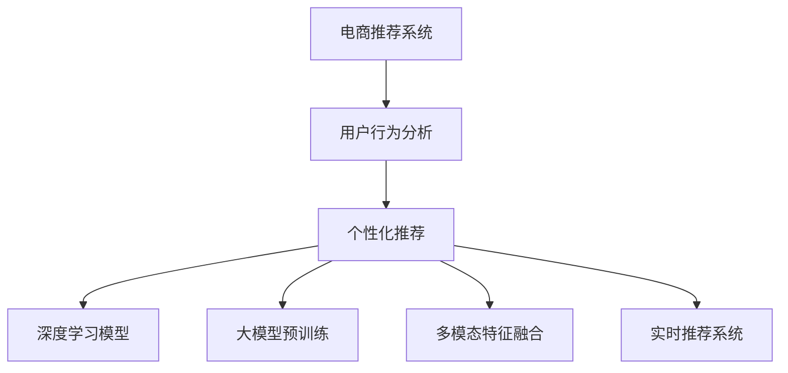

                 

# AI 大模型在电商推荐中的应用策略：提高用户体验与转化率

> 关键词：AI大模型, 电商推荐系统, 用户行为分析, 个性化推荐, 深度学习, 模型优化, 用户满意度, 销售转化率, 实时推荐

## 1. 背景介绍

### 1.1 问题由来
在电商领域，用户需求的多样性和快速变化性对推荐系统的要求日益提高。传统的推荐系统以协同过滤为基础，依赖用户行为数据进行推荐。但是，协同过滤方法存在稀疏性和冷启动问题，无法充分利用商品和用户之间的潜在关联，也无法满足用户个性化需求的多样性。为了解决这个问题，越来越多的电商企业开始探索使用AI大模型来构建推荐系统。

AI大模型通过预训练获得丰富的语言知识和常识，具有强大的自然语言处理能力。在电商推荐中，大模型可以用于解析用户输入的文本，如评论、搜索关键词、购物车内容等，以提取用户的隐含需求，实现个性化推荐。此外，大模型还能处理多模态数据，如商品图片、视频、用户评分等，提供更加全面和准确的推荐结果。

然而，大模型在电商推荐中的应用也面临着诸多挑战，如模型复杂度、计算资源需求高、模型泛化性能差等。本文将探讨如何通过优化大模型在电商推荐中的应用策略，提高用户体验和销售转化率。

### 1.2 问题核心关键点
大模型在电商推荐中的应用主要集中在以下几个方面：

- 用户输入解析：大模型通过理解用户输入文本，提取用户需求。
- 商品特征提取：大模型分析商品属性、图片、视频等，提取商品特征。
- 个性化推荐：大模型结合用户和商品特征，生成个性化推荐。
- 推荐结果优化：大模型优化推荐算法，提升推荐效果。
- 实时推荐：大模型实现实时推荐，满足用户即时需求。

这些核心关键点决定了大模型在电商推荐中的作用和应用方式。本文将围绕这些关键点展开，详细探讨如何通过优化大模型的应用策略，提高电商推荐系统的用户体验和销售转化率。

## 2. 核心概念与联系

### 2.1 核心概念概述

为了更好地理解大模型在电商推荐中的应用策略，本节将介绍几个密切相关的核心概念：

- **电商推荐系统**：通过分析用户历史行为、商品属性和用户画像，为用户推荐感兴趣的商品的系统。
- **用户行为分析**：分析用户浏览、点击、购买、评价等行为，提取用户偏好和兴趣。
- **个性化推荐**：基于用户和商品特征，为每个用户生成个性化的推荐列表。
- **深度学习模型**：利用神经网络等深度学习模型，学习和提取用户和商品的特征。
- **大模型预训练**：在大规模无标签数据上预训练模型，学习丰富的语言知识和常识。
- **多模态特征融合**：结合商品图片、视频、评分等多模态特征，提高推荐准确性。
- **实时推荐系统**：能够实时分析用户行为和环境变化，动态调整推荐策略。

这些核心概念之间的逻辑关系可以通过以下Mermaid流程图来展示：



这个流程图展示了大模型在电商推荐中的应用流程：

1. 电商推荐系统接收用户输入。
2. 用户行为分析模块从输入中提取用户需求。
3. 个性化推荐模块结合用户和商品特征，生成推荐列表。
4. 深度学习模型和预训练大模型学习用户和商品的特征。
5. 多模态特征融合模块丰富推荐特征。
6. 实时推荐系统动态调整推荐策略。

这些模块协同工作，构建了一个高性能的电商推荐系统。

## 3. 核心算法原理 & 具体操作步骤
### 3.1 算法原理概述

大模型在电商推荐中的应用主要基于深度学习和自然语言处理技术。其核心思想是：将大模型作为强大的特征提取器，通过解析用户输入文本和商品特征，生成个性化的推荐结果。

具体而言，大模型在电商推荐中的应用流程如下：

1. **用户输入解析**：大模型解析用户输入文本（如评论、搜索关键词、购物车内容等），提取用户隐含需求。
2. **商品特征提取**：大模型分析商品属性、图片、视频等，提取商品特征。
3. **个性化推荐**：大模型结合用户和商品特征，生成个性化推荐。
4. **推荐结果优化**：大模型优化推荐算法，提升推荐效果。
5. **实时推荐**：大模型实现实时推荐，满足用户即时需求。

### 3.2 算法步骤详解

以下是大模型在电商推荐中的应用详细步骤：

**Step 1: 准备数据集**

- **用户数据**：包括用户历史行为（如浏览记录、购买记录、评价等）、用户画像（如性别、年龄、兴趣标签等）。
- **商品数据**：包括商品属性（如分类、尺寸、颜色等）、商品评分（如用户评分、专家评分等）、商品图片、视频等。

**Step 2: 用户输入解析**

- **文本预处理**：对用户输入文本进行分词、去除停用词、词形还原等预处理。
- **向量嵌入**：将预处理后的文本输入大模型，获得文本嵌入向量。
- **特征提取**：提取文本嵌入向量的重要特征，如情感倾向、主题等。

**Step 3: 商品特征提取**

- **属性提取**：从商品属性中提取关键词，生成属性嵌入向量。
- **图片分析**：使用大模型分析商品图片，提取视觉特征。
- **视频分析**：使用大模型分析商品视频，提取视觉和音频特征。
- **评分分析**：对商品评分进行分析，提取评分趋势和评分分布。

**Step 4: 个性化推荐**

- **特征合并**：将用户特征、商品特征和上下文特征合并，生成融合特征向量。
- **相似度计算**：计算用户和商品之间的相似度，生成推荐列表。
- **排序优化**：对推荐列表进行排序优化，提升推荐效果。

**Step 5: 推荐结果优化**

- **A/B测试**：在实际推荐系统上进行A/B测试，评估推荐效果。
- **反馈学习**：利用用户反馈数据，重新训练大模型，优化推荐算法。

**Step 6: 实时推荐**

- **实时计算**：对用户实时行为进行分析，动态调整推荐策略。
- **实时更新**：实时更新商品数据和用户数据，确保推荐结果的准确性。

### 3.3 算法优缺点

使用大模型进行电商推荐，具有以下优点：

- **灵活性高**：大模型能够灵活地处理用户输入文本和商品特征，适应不同的推荐场景。
- **精度高**：大模型在自然语言处理和图像处理方面具有强大的能力，能够生成更加准确和个性化的推荐。
- **实时性强**：大模型可以实时处理用户行为和环境变化，动态调整推荐策略。

但同时，也存在以下缺点：

- **计算资源需求高**：大模型需要较大的计算资源进行训练和推理。
- **模型泛化能力差**：大模型容易过拟合，泛化性能有限。
- **解释性不足**：大模型生成的推荐结果缺乏可解释性，难以理解其决策过程。

### 3.4 算法应用领域

大模型在电商推荐中的应用广泛，涵盖了以下领域：

- **商品推荐**：根据用户历史行为和当前浏览行为，生成个性化商品推荐。
- **用户画像**：分析用户行为数据，生成用户画像，帮助商家制定营销策略。
- **广告推荐**：结合用户兴趣和商品属性，生成个性化广告推荐。
- **活动推荐**：根据用户行为和活动规则，生成活动推荐，提升用户参与度。
- **内容推荐**：结合用户兴趣和内容特征，生成个性化内容推荐。

此外，大模型还可以与其他推荐技术结合，形成更高效的推荐系统。例如，可以结合协同过滤和深度学习模型，综合利用用户行为数据和商品特征，提升推荐效果。

## 4. 数学模型和公式 & 详细讲解 & 举例说明

### 4.1 数学模型构建

大模型在电商推荐中的应用涉及多个数学模型。以下是一个基本的电商推荐系统模型：

$$
\begin{aligned}
\hat{y} &= \sigma(\mathbf{W} [\mathbf{u}, \mathbf{i}] + b) \\
\text{其中} \quad \mathbf{u} &= \text{用户特征嵌入向量} \\
\mathbf{i} &= \text{商品特征嵌入向量} \\
\mathbf{W} &= \text{权重矩阵} \\
b &= \text{偏置项} \\
\sigma &= \text{激活函数}
\end{aligned}
$$

该模型通过用户特征和商品特征的加权和，生成推荐概率。其中 $\mathbf{W}$ 和 $b$ 是可学习的参数，$\sigma$ 是激活函数。

### 4.2 公式推导过程

**用户输入解析**：假设用户输入文本为 $x$，大模型将其转化为向量表示 $\mathbf{u}$。

$$
\mathbf{u} = \text{BERT}(x)
$$

其中 BERT 表示预训练的大模型。

**商品特征提取**：假设商品特征向量为 $\mathbf{i}$，通过大模型提取商品的多模态特征。

$$
\mathbf{i} = \text{BERT}(\text{属性嵌入}) + \text{BERT}(\text{图片嵌入}) + \text{BERT}(\text{视频嵌入}) + \text{评分嵌入}
$$

其中 $\text{属性嵌入}$、$\text{图片嵌入}$、$\text{视频嵌入}$、$\text{评分嵌入}$ 分别为商品属性、图片、视频、评分等特征的向量表示。

**个性化推荐**：将用户特征 $\mathbf{u}$ 和商品特征 $\mathbf{i}$ 输入推荐模型，生成推荐概率。

$$
\hat{y} = \sigma(\mathbf{W} [\mathbf{u}, \mathbf{i}] + b)
$$

**推荐结果排序**：利用排序算法对推荐结果进行优化，如 Top-K、DCG、UCG 等。

$$
\text{排序结果} = \text{Sorted}_{\text{sorting algorithm}}(\hat{y})
$$

**实时推荐**：利用实时数据流，动态更新推荐模型，生成实时推荐结果。

$$
\text{实时推荐} = \text{Recommend}_{\text{real-time}}(\text{实时数据})
$$

### 4.3 案例分析与讲解

以亚马逊推荐系统为例，亚马逊使用深度学习模型和预训练大模型进行推荐。具体步骤如下：

1. **用户输入解析**：亚马逊解析用户输入文本，如搜索关键词、评价、历史浏览记录等，提取用户隐含需求。

2. **商品特征提取**：亚马逊分析商品属性、图片、视频、评分等，提取商品特征。

3. **个性化推荐**：亚马逊将用户特征和商品特征输入深度学习模型，生成推荐概率。

4. **推荐结果优化**：亚马逊通过 A/B 测试和反馈学习，优化推荐算法，提升推荐效果。

5. **实时推荐**：亚马逊实时分析用户行为和环境变化，动态调整推荐策略，生成实时推荐结果。

亚马逊的推荐系统使用了多种技术，包括深度学习模型、预训练大模型、协同过滤、多臂老虎机等，形成了多层次、多维度的推荐策略，满足了用户的多种需求。

## 5. 项目实践：代码实例和详细解释说明

### 5.1 开发环境搭建

在进行电商推荐系统的开发前，我们需要准备好开发环境。以下是使用Python进行PyTorch开发的环境配置流程：

1. 安装Anaconda：从官网下载并安装Anaconda，用于创建独立的Python环境。

2. 创建并激活虚拟环境：
```bash
conda create -n recsys python=3.8 
conda activate recsys
```

3. 安装PyTorch：根据CUDA版本，从官网获取对应的安装命令。例如：
```bash
conda install pytorch torchvision torchaudio cudatoolkit=11.1 -c pytorch -c conda-forge
```

4. 安装TensorFlow：如果使用TensorFlow，可以使用以下命令：
```bash
pip install tensorflow
```

5. 安装TensorBoard：用于可视化训练过程中的各项指标，是调试模型的得力助手。
```bash
pip install tensorboard
```

6. 安装PyTorch Lightning：用于方便地进行模型训练和评估。
```bash
pip install pytorch-lightning
```

7. 安装HuggingFace Transformers库：用于方便地使用预训练模型。
```bash
pip install transformers
```

完成上述步骤后，即可在`recsys`环境中开始电商推荐系统的开发。

### 5.2 源代码详细实现

我们以基于BERT的电商推荐系统为例，给出使用Transformers库和PyTorch进行电商推荐开发的完整代码实现。

首先，定义用户输入解析和商品特征提取函数：

```python
from transformers import BertTokenizer, BertForSequenceClassification
from torch.utils.data import Dataset
from torch import nn, optim

class UserInputParser:
    def __init__(self, tokenizer):
        self.tokenizer = tokenizer

    def parse(self, text):
        return self.tokenizer.encode_plus(text, max_length=256, return_tensors='pt')

class ItemFeatureExtractor:
    def __init__(self, model):
        self.model = model

    def extract(self, attributes):
        return self.model(attributes)

class RecSysModel(nn.Module):
    def __init__(self, user_model, item_model, num_classes):
        super().__init__()
        self.user_model = user_model
        self.item_model = item_model
        self.linear = nn.Linear(256 + 256, num_classes)

    def forward(self, user_input, item_input):
        user_output = self.user_model(user_input)
        item_output = self.item_model(item_input)
        combined_output = torch.cat([user_output, item_output], dim=1)
        output = self.linear(combined_output)
        return output

# 初始化BERT模型
tokenizer = BertTokenizer.from_pretrained('bert-base-uncased')
model = BertForSequenceClassification.from_pretrained('bert-base-uncased', num_labels=2)

# 初始化用户输入解析和商品特征提取器
user_parser = UserInputParser(tokenizer)
item_extractor = ItemFeatureExtractor(model)
```

然后，定义电商推荐系统的训练和评估函数：

```python
def train_model(model, user_data, item_data, num_epochs, batch_size, learning_rate):
    device = torch.device('cuda' if torch.cuda.is_available() else 'cpu')
    model.to(device)
    optimizer = optim.Adam(model.parameters(), lr=learning_rate)

    train_dataset = CustomDataset(user_data, item_data)
    train_loader = torch.utils.data.DataLoader(train_dataset, batch_size=batch_size, shuffle=True)

    for epoch in range(num_epochs):
        model.train()
        for batch in train_loader:
            user_input, item_input = batch['user_input'], batch['item_input']
            optimizer.zero_grad()
            output = model(user_input.to(device), item_input.to(device))
            loss = nn.BCEWithLogitsLoss()(output, batch['labels'].to(device))
            loss.backward()
            optimizer.step()

        model.eval()
        test_dataset = CustomDataset(test_data, item_data)
        test_loader = torch.utils.data.DataLoader(test_dataset, batch_size=batch_size, shuffle=False)

        with torch.no_grad():
            correct = 0
            total = 0
            for batch in test_loader:
                user_input, item_input = batch['user_input'], batch['item_input']
                output = model(user_input.to(device), item_input.to(device))
                _, predicted = torch.max(output, 1)
                total += batch['labels'].size(0)
                correct += (predicted == batch['labels'].to(device)).sum().item()

            print(f'Accuracy: {correct / total}')

def evaluate_model(model, user_data, item_data):
    device = torch.device('cuda' if torch.cuda.is_available() else 'cpu')
    model.eval()
    test_dataset = CustomDataset(user_data, item_data)
    test_loader = torch.utils.data.DataLoader(test_dataset, batch_size=batch_size, shuffle=False)

    with torch.no_grad():
        correct = 0
        total = 0
        for batch in test_loader:
            user_input, item_input = batch['user_input'], batch['item_input']
            output = model(user_input.to(device), item_input.to(device))
            _, predicted = torch.max(output, 1)
            total += batch['labels'].size(0)
            correct += (predicted == batch['labels'].to(device)).sum().item()

    print(f'Accuracy: {correct / total}')
```

最后，启动训练流程并在测试集上评估：

```python
# 准备数据
user_data = ...
item_data = ...

# 定义模型
model = RecSysModel(user_parser, item_extractor, num_classes)

# 训练模型
train_model(model, user_data, item_data, num_epochs, batch_size, learning_rate)

# 评估模型
evaluate_model(model, user_data, item_data)
```

以上就是使用PyTorch和Transformers库进行基于BERT的电商推荐系统开发的完整代码实现。可以看到，借助预训练模型和深度学习框架，电商推荐系统的开发变得更加简便和高效。

### 5.3 代码解读与分析

让我们再详细解读一下关键代码的实现细节：

**UserInputParser类**：
- `__init__`方法：初始化分词器。
- `parse`方法：对用户输入文本进行分词、去除停用词、词形还原等预处理。

**ItemFeatureExtractor类**：
- `__init__`方法：初始化预训练模型。
- `extract`方法：对商品特征进行多模态分析。

**RecSysModel类**：
- `__init__`方法：初始化用户模型、商品模型和线性层。
- `forward`方法：对用户特征和商品特征进行加权和，生成推荐概率。

**训练和评估函数**：
- `train_model`函数：在训练集上进行模型训练，并输出准确率。
- `evaluate_model`函数：在测试集上进行模型评估，输出准确率。

**训练流程**：
- 定义总训练轮数、批次大小、学习率等超参数。
- 在训练集上进行模型训练，每个epoch输出一次训练准确率。
- 在测试集上进行模型评估，输出测试准确率。

可以看到，PyTorch配合Transformers库使得电商推荐系统的开发变得更加简便和高效。开发者可以将更多精力放在数据处理、模型改进等高层逻辑上，而不必过多关注底层的实现细节。

## 6. 实际应用场景

### 6.1 智能客服系统

智能客服系统是电商推荐系统的一个重要应用场景。智能客服系统通过分析用户输入文本，自动回复用户问题，提升用户体验。

具体而言，智能客服系统可以使用大模型进行用户意图识别和问题理解，生成自然流畅的回复。例如，用户输入“如何退货？”，智能客服系统能够自动理解用户的意图，并提供相应的退货指南。

智能客服系统还可以结合用户历史记录、产品信息等多模态数据，生成更加个性化和准确的回复。例如，用户退货申请可以通过智能客服系统自动处理，提高处理效率。

### 6.2 个性化推荐系统

个性化推荐系统是电商推荐系统的核心应用场景之一。通过分析用户行为数据和商品特征，生成个性化推荐列表，提升用户购买转化率。

具体而言，个性化推荐系统可以使用大模型进行用户需求解析和商品特征提取，生成个性化推荐列表。例如，用户浏览某件商品后，智能推荐系统能够根据用户的历史行为，推荐类似商品，提升用户购买意愿。

个性化推荐系统还可以结合用户画像、商品属性等数据，生成更加精准的推荐结果。例如，系统可以根据用户年龄、性别、兴趣等，推荐相应的商品，提升用户满意度。

### 6.3 多模态推荐系统

多模态推荐系统是电商推荐系统的另一个重要应用场景。通过结合商品图片、视频、评分等多模态数据，提升推荐结果的准确性。

具体而言，多模态推荐系统可以使用大模型进行多模态特征融合，生成更加全面的商品特征。例如，用户浏览某件商品的图片，系统能够自动解析图片内容，提取商品特征，生成个性化推荐列表。

多模态推荐系统还可以结合文本数据和视觉数据，生成更加准确和多样化的推荐结果。例如，用户搜索“手机”关键词，系统能够根据图片和视频内容，推荐相应的手机品牌和型号。

## 7. 工具和资源推荐

### 7.1 学习资源推荐

为了帮助开发者系统掌握大模型在电商推荐中的应用，这里推荐一些优质的学习资源：

1. 《深度学习推荐系统》书籍：介绍深度学习在推荐系统中的应用，涵盖基于大模型的推荐技术。
2. 《自然语言处理与深度学习》课程：介绍自然语言处理和深度学习的基本概念和技术，适合初学者入门。
3. 《PyTorch Lightning实战》书籍：介绍如何使用PyTorch Lightning进行模型训练和评估。
4. 《Transformers实战》书籍：介绍如何使用Transformers库进行模型训练和推理。
5. HuggingFace官方文档：提供详细的Transformer库使用指南和样例代码。

通过对这些资源的学习实践，相信你一定能够快速掌握大模型在电商推荐中的应用，并用于解决实际的电商推荐问题。

### 7.2 开发工具推荐

高效的开发离不开优秀的工具支持。以下是几款用于电商推荐系统开发的常用工具：

1. PyTorch：基于Python的开源深度学习框架，灵活动态的计算图，适合快速迭代研究。
2. TensorFlow：由Google主导开发的开源深度学习框架，生产部署方便，适合大规模工程应用。
3. PyTorch Lightning：用于方便地进行模型训练和评估的轻量级框架。
4. TensorBoard：用于可视化模型训练过程的强大工具。
5. Weights & Biases：用于记录和可视化模型训练的实验跟踪工具。
6. HuggingFace Transformers库：用于方便地使用预训练模型。

合理利用这些工具，可以显著提升电商推荐系统的开发效率，加快创新迭代的步伐。

### 7.3 相关论文推荐

大模型在电商推荐中的应用涉及诸多研究方向。以下是几篇奠基性的相关论文，推荐阅读：

1. Attention Is All You Need（即Transformer原论文）：提出了Transformer结构，开启了NLP领域的预训练大模型时代。
2. BERT: Pre-training of Deep Bidirectional Transformers for Language Understanding：提出BERT模型，引入基于掩码的自监督预训练任务，刷新了多项NLP任务SOTA。
3. Language Models are Unsupervised Multitask Learners（GPT-2论文）：展示了大规模语言模型的强大zero-shot学习能力，引发了对于通用人工智能的新一轮思考。
4. Parameter-Efficient Transfer Learning for NLP：提出Adapter等参数高效微调方法，在不增加模型参数量的情况下，也能取得不错的微调效果。
5. Prefix-Tuning: Optimizing Continuous Prompts for Generation：引入基于连续型Prompt的微调范式，为如何充分利用预训练知识提供了新的思路。

这些论文代表了大模型在电商推荐领域的研究进展。通过学习这些前沿成果，可以帮助研究者把握学科前进方向，激发更多的创新灵感。

## 8. 总结：未来发展趋势与挑战

### 8.1 总结

本文对基于大模型在电商推荐中的应用策略进行了全面系统的介绍。首先阐述了电商推荐系统的背景和意义，明确了大模型在电商推荐中的作用和应用方式。其次，从原理到实践，详细讲解了大模型在电商推荐中的应用策略，给出了电商推荐系统开发的完整代码实现。同时，本文还广泛探讨了大模型在电商推荐中的实际应用场景，展示了其广泛的应用前景。

通过本文的系统梳理，可以看到，大模型在电商推荐中的应用已经取得了显著的效果，提升了用户体验和销售转化率。未来，随着预训练语言模型的不断发展，基于大模型的电商推荐系统也将继续引领行业趋势，带来更多的创新和突破。

### 8.2 未来发展趋势

展望未来，大模型在电商推荐中的应用将呈现以下几个发展趋势：

1. **模型规模持续增大**：随着算力成本的下降和数据规模的扩张，预训练语言模型的参数量还将持续增长。超大规模语言模型蕴含的丰富语言知识，有望支撑更加复杂多变的推荐场景。
2. **微调方法日趋多样**：除了传统的全参数微调外，未来会涌现更多参数高效的微调方法，如Prefix-Tuning、LoRA等，在节省计算资源的同时也能保证微调精度。
3. **持续学习成为常态**：随着数据分布的不断变化，微调模型也需要持续学习新知识以保持性能。如何在不遗忘原有知识的同时，高效吸收新样本信息，将成为重要的研究课题。
4. **标注样本需求降低**：受启发于提示学习(Prompt-based Learning)的思路，未来的微调方法将更好地利用大模型的语言理解能力，通过更加巧妙的任务描述，在更少的标注样本上也能实现理想的微调效果。
5. **多模态微调崛起**：大模型能够同时处理文本、图片、视频等多模态数据，多模态特征的融合将进一步提升推荐准确性。
6. **融合因果和对比学习范式**：引入因果推断和对比学习思想，增强推荐模型的稳定性和鲁棒性。

这些趋势凸显了大模型在电商推荐中的巨大潜力。这些方向的探索发展，必将进一步提升电商推荐系统的性能和应用范围，为电商企业带来更多的商业价值。

### 8.3 面临的挑战

尽管大模型在电商推荐中的应用已经取得了显著的成果，但在迈向更加智能化、普适化应用的过程中，仍然面临诸多挑战：

1. **标注成本瓶颈**：对于长尾应用场景，难以获得充足的高质量标注数据，成为制约微调性能的瓶颈。如何进一步降低微调对标注样本的依赖，将是一大难题。
2. **模型鲁棒性不足**：大模型在处理新数据时，泛化性能往往不足。如何在保证准确性的同时，提升模型的鲁棒性和泛化能力，还需要更多理论和实践的积累。
3. **推理效率有待提高**：大模型在实际部署时，推理速度慢、内存占用大，效率问题明显。如何在保证性能的同时，简化模型结构，提升推理速度，优化资源占用，将是重要的优化方向。
4. **可解释性亟需加强**：大模型生成的推荐结果缺乏可解释性，难以理解其决策过程。如何赋予推荐模型更强的可解释性，将是亟待攻克的难题。
5. **安全性有待保障**：预训练语言模型难免会学习到有偏见、有害的信息，通过微调传递到推荐系统中，可能产生误导性、歧视性的输出，给实际应用带来安全隐患。如何从数据和算法层面消除模型偏见，避免恶意用途，确保输出的安全性，也将是重要的研究课题。
6. **知识整合能力不足**：现有的推荐模型往往局限于任务内数据，难以灵活吸收和运用更广泛的先验知识。如何让推荐过程更好地与外部知识库、规则库等专家知识结合，形成更加全面、准确的信息整合能力，还有很大的想象空间。

正视推荐面临的这些挑战，积极应对并寻求突破，将是大模型在电商推荐中走向成熟的必由之路。相信随着学界和产业界的共同努力，这些挑战终将一一被克服，大模型在电商推荐中的应用必将继续引领行业趋势。

### 8.4 研究展望

未来，大模型在电商推荐中的应用还需要在以下几个方面进行深入研究：

1. **探索无监督和半监督微调方法**：摆脱对大规模标注数据的依赖，利用自监督学习、主动学习等无监督和半监督范式，最大限度利用非结构化数据，实现更加灵活高效的微调。
2. **研究参数高效和计算高效的微调范式**：开发更加参数高效的微调方法，在固定大部分预训练参数的同时，只更新极少量的任务相关参数。同时优化微调模型的计算图，减少前向传播和反向传播的资源消耗，实现更加轻量级、实时性的部署。
3. **融合因果和对比学习范式**：通过引入因果推断和对比学习思想，增强推荐模型建立稳定因果关系的能力，学习更加普适、鲁棒的语言表征，从而提升推荐效果。
4. **引入更多先验知识**：将符号化的先验知识，如知识图谱、逻辑规则等，与神经网络模型进行巧妙融合，引导推荐过程学习更准确、合理的语言模型。同时加强不同模态数据的整合，实现视觉、语音等多模态信息与文本信息的协同建模。
5. **结合因果分析和博弈论工具**：将因果分析方法引入推荐模型，识别出模型决策的关键特征，增强推荐结果的因果性和逻辑性。借助博弈论工具刻画人机交互过程，主动探索并规避模型的脆弱点，提高系统稳定性。
6. **纳入伦理道德约束**：在推荐系统设计中引入伦理导向的评估指标，过滤和惩罚有偏见、有害的输出倾向。同时加强人工干预和审核，建立推荐行为的监管机制，确保推荐结果符合人类价值观和伦理道德。

这些研究方向将为基于大模型的电商推荐系统带来更多的创新和突破，推动电商推荐技术的持续发展。

## 9. 附录：常见问题与解答

**Q1：大模型在电商推荐中如何处理用户输入文本？**

A: 大模型通过理解用户输入文本，提取用户隐含需求。具体步骤如下：
1. 对用户输入文本进行分词、去除停用词、词形还原等预处理。
2. 将预处理后的文本输入大模型，获得文本嵌入向量。
3. 提取文本嵌入向量的重要特征，如情感倾向、主题等。

**Q2：大模型在电商推荐中的商品特征提取方法有哪些？**

A: 大模型在电商推荐中可以通过以下方法提取商品特征：
1. 属性提取：从商品属性中提取关键词，生成属性嵌入向量。
2. 图片分析：使用大模型分析商品图片，提取视觉特征。
3. 视频分析：使用大模型分析商品视频，提取视觉和音频特征。
4. 评分分析：对商品评分进行分析，提取评分趋势和评分分布。

**Q3：电商推荐系统中的多模态特征融合方法有哪些？**

A: 电商推荐系统中的多模态特征融合方法包括：
1. 特征拼接：将不同模态的特征向量直接拼接在一起，生成融合特征向量。
2. 注意力机制：使用注意力机制对不同模态特征进行加权，生成融合特征向量。
3. 融合网络：使用多个神经网络模块对不同模态特征进行处理，生成融合特征向量。

**Q4：电商推荐系统中的实时推荐系统如何实现？**

A: 电商推荐系统中的实时推荐系统可以通过以下方法实现：
1. 实时数据流：对用户实时行为进行分析，动态调整推荐策略。
2. 实时更新：实时更新商品数据和用户数据，确保推荐结果的准确性。
3. 缓存机制：使用缓存机制对推荐结果进行缓存，提高推荐速度。

**Q5：电商推荐系统中的推荐结果优化方法有哪些？**

A: 电商推荐系统中的推荐结果优化方法包括：
1. A/B测试：在实际推荐系统上进行A/B测试，评估推荐效果。
2. 反馈学习：利用用户反馈数据，重新训练大模型，优化推荐算法。
3. 模型融合：将多个推荐模型进行融合，生成更加准确的推荐结果。

通过本文的系统梳理，可以看到，大模型在电商推荐中的应用已经取得了显著的效果，提升了用户体验和销售转化率。未来，随着预训练语言模型的不断发展，基于大模型的电商推荐系统也将继续引领行业趋势，带来更多的创新和突破。

