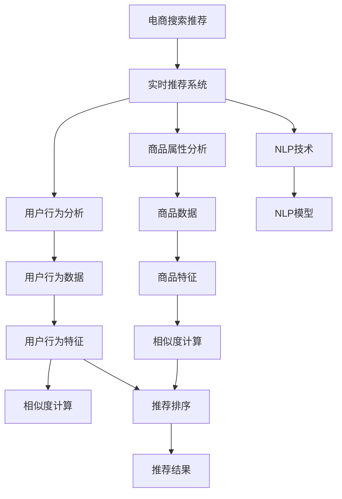

                 

# AI 大模型在电商搜索推荐中的实时推荐策略：抓住用户瞬时需求与购买意图

## 1. 背景介绍

### 1.1 问题由来
随着电子商务的快速发展，用户的搜索行为和购买意图越来越复杂多变。传统的基于关键词匹配的推荐算法往往无法满足用户对个性化、实时性的需求。为此，利用AI大模型进行实时推荐，成为提升用户体验和提高转化率的重要手段。

具体而言，用户在搜索时，往往受多种因素影响，如心情、时间、环境、上下文等。这种瞬时的需求和购买意图，需要通过实时推荐系统来捕捉和满足。AI大模型在处理海量数据和理解用户行为方面具有显著优势，因此，将其应用于电商搜索推荐，成为一种趋势。

### 1.2 问题核心关键点
本论文聚焦于如何将AI大模型应用于电商搜索推荐，旨在回答以下核心问题：

- 如何构建适用于电商搜索推荐的大模型？
- 实时推荐系统的设计原则和算法是什么？
- 如何优化模型以提高推荐效果和用户体验？

## 2. 核心概念与联系

### 2.1 核心概念概述

为更好地理解AI大模型在电商搜索推荐中的应用，本节将介绍几个关键概念：

- 大模型(Large Model)：指具有巨大参数量和强大表征能力的深度学习模型。如GPT、BERT等。
- 电商搜索推荐(Online Shopping Recommendation)：通过分析用户搜索行为和历史记录，向用户推荐可能感兴趣的商品，提升购物体验和转化率。
- 实时推荐系统(Real-time Recommendation System)：指能够快速响应用户请求，实时生成推荐结果的系统，如多臂赌博机(Barry Cooper 2003)。
- 自然语言处理(Natural Language Processing, NLP)：处理和理解自然语言的模型和技术，如BERT、GPT等。
- 推荐算法(Recommendation Algorithm)：根据用户行为和商品属性，选择最佳推荐列表的算法，如协同过滤、基于内容的推荐等。

这些核心概念之间的逻辑关系可以通过以下Mermaid流程图来展示：



这个流程图展示了大模型在电商搜索推荐中的应用路径：

1. 电商搜索推荐依赖实时推荐系统，以快速响应用户请求。
2. 实时推荐系统分析用户行为和商品属性，利用NLP技术构建用户行为特征和商品特征。
3. NLP模型（如BERT、GPT等）通过大量文本数据训练，形成强大的语义表示能力。
4. 通过相似度计算和推荐排序，生成推荐结果，提升用户体验和转化率。

## 3. 核心算法原理 & 具体操作步骤

### 3.1 算法原理概述

AI大模型在电商搜索推荐中的实时推荐策略，本质上是一种基于用户行为数据的推荐算法。其核心思想是：通过构建大模型，捕捉用户瞬时需求和购买意图，实时生成个性化的推荐结果。

具体步骤如下：

1. **用户行为分析**：收集用户搜索、点击、浏览等行为数据，提取用户兴趣特征。
2. **商品属性分析**：对商品进行属性标签化，形成商品特征。
3. **特征嵌入**：利用大模型将用户行为特征和商品特征映射到高维空间中。
4. **相似度计算**：通过计算用户行为特征与商品特征的相似度，筛选推荐候选集。
5. **推荐排序**：根据相似度排序，选择排名靠前的商品进行推荐。
6. **实时生成**：结合用户实时请求和上下文信息，动态生成推荐结果。

### 3.2 算法步骤详解

#### 3.2.1 用户行为分析

用户行为分析是实时推荐系统的基础。通过分析用户搜索记录、点击行为、浏览历史等数据，提取用户兴趣特征。这些特征可以包括：

- 搜索关键词
- 点击时间
- 浏览深度
- 点击路径

这些特征的获取通常依赖于电商平台的日志系统。数据预处理的步骤包括：

1. 数据清洗：去除无效数据，如广告点击、系统异常等。
2. 特征提取：从原始日志中提取有用的特征。
3. 数据划分：将数据划分为训练集、验证集和测试集。

#### 3.2.2 商品属性分析

商品属性分析是对商品进行特征提取的过程。常见的商品属性包括：

- 商品名称
- 价格
- 品牌
- 类别

通过将商品属性标签化，可以形成结构化的商品特征向量。例如，一件商品的特征向量可以表示为：

$$ \text{Feature}(x) = [\text{类别}, \text{价格}, \text{品牌}, \ldots] $$

#### 3.2.3 特征嵌入

特征嵌入是将用户行为特征和商品特征映射到高维空间中的过程。通常使用大模型，如BERT、GPT等，进行特征嵌入。

以BERT为例，假设输入为搜索关键词和商品名称，输出的特征表示为：

$$ \text{Embedding} = \text{BERT}(\text{搜索关键词}, \text{商品名称}) $$

#### 3.2.4 相似度计算

相似度计算是推荐系统的重要步骤。通过计算用户行为特征和商品特征的相似度，筛选出最有可能被用户感兴趣的商品。常见的相似度计算方法包括：

- 余弦相似度
- 欧氏距离
- 皮尔逊相关系数

例如，余弦相似度计算公式为：

$$ \text{CosineSimilarity}(x,y) = \frac{x \cdot y}{\|x\|_2 \|y\|_2} $$

其中，$x$ 和 $y$ 分别为用户行为特征和商品特征的向量表示。

#### 3.2.5 推荐排序

推荐排序是将候选商品按照相似度排序的过程。排序算法通常使用简单的排序方法，如TopK排序。例如，选择排名前K的商品进行推荐。

#### 3.2.6 实时生成

实时生成推荐结果需要考虑用户请求的时序性和上下文信息。具体步骤如下：

1. 实时获取用户请求和上下文信息，如搜索关键词、浏览页面等。
2. 将实时请求和上下文信息与用户行为特征和商品特征进行融合。
3. 重新计算相似度，筛选推荐候选集。
4. 生成推荐结果，并返回给用户。

### 3.3 算法优缺点

#### 3.3.1 优点

- 准确度高：通过大模型的强大语义表示能力，能够准确捕捉用户瞬时需求和购买意图。
- 实时性好：利用实时数据进行特征嵌入和相似度计算，能够快速响应用户请求。
- 可扩展性强：大模型可以并行处理海量数据，提高系统的可扩展性。

#### 3.3.2 缺点

- 计算量大：大模型需要较大的计算资源和存储空间。
- 数据质量要求高：用户行为数据和商品属性数据的质量直接影响推荐效果。
- 模型训练复杂：需要大量的标注数据进行训练，增加数据获取和标注的难度。

### 3.4 算法应用领域

AI大模型在电商搜索推荐中的应用领域广泛，主要包括以下几个方面：

- 个性化推荐：根据用户历史行为和实时请求，生成个性化推荐列表。
- 实时搜索：根据用户搜索关键词，动态生成搜索结果。
- 智能客服：利用大模型进行自然语言处理，实现自动回答用户问题。
- 智能广告投放：根据用户兴趣特征，优化广告投放策略，提高广告效果。

## 4. 数学模型和公式 & 详细讲解 & 举例说明

### 4.1 数学模型构建

本节将使用数学语言对电商搜索推荐中实时推荐策略的数学模型进行详细构建。

假设用户行为特征为 $X \in \mathbb{R}^d$，商品特征为 $Y \in \mathbb{R}^d$，则用户行为特征与商品特征的相似度表示为：

$$ \text{Similarity}(X,Y) = \text{CosineSimilarity}(X,Y) = \frac{X \cdot Y}{\|X\|_2 \|Y\|_2} $$

用户行为特征与商品特征的相似度越大，表示该商品越有可能被用户购买。因此，可以通过计算相似度，选择排名靠前的商品进行推荐。

### 4.2 公式推导过程

为了更好地理解相似度计算的过程，以余弦相似度为例，进行详细推导。

设用户行为特征和商品特征分别为 $X = [x_1, x_2, \ldots, x_d]$ 和 $Y = [y_1, y_2, \ldots, y_d]$，则余弦相似度的计算公式为：

$$ \text{CosineSimilarity}(X,Y) = \frac{X \cdot Y}{\|X\|_2 \|Y\|_2} $$

其中，$\cdot$ 表示向量点积，$\| \|$ 表示向量范数。

向量点积的定义为：

$$ X \cdot Y = \sum_{i=1}^d x_i y_i $$

向量范数的定义如下：

$$ \|X\|_2 = \sqrt{\sum_{i=1}^d x_i^2} $$

$$ \|Y\|_2 = \sqrt{\sum_{i=1}^d y_i^2} $$

因此，余弦相似度的计算公式可以简化为：

$$ \text{CosineSimilarity}(X,Y) = \frac{\sum_{i=1}^d x_i y_i}{\sqrt{\sum_{i=1}^d x_i^2} \sqrt{\sum_{i=1}^d y_i^2}} $$

### 4.3 案例分析与讲解

以某电商平台的实时推荐系统为例，分析其工作流程。

假设用户在平台搜索“运动鞋”，实时请求为“运动鞋”。系统首先获取用户的历史行为数据和商品属性数据，进行特征嵌入和相似度计算。具体步骤如下：

1. 收集用户的历史行为数据，提取用户兴趣特征。
2. 对商品进行属性标签化，形成商品特征。
3. 利用BERT模型对搜索关键词和商品名称进行特征嵌入。
4. 计算用户行为特征与商品特征的余弦相似度。
5. 选择相似度最高的前K个商品进行推荐。

例如，用户历史行为特征为 $X = [0.5, 0.3, 0.8, \ldots]$，商品特征为 $Y = [0.6, 0.2, 0.7, \ldots]$，则余弦相似度为：

$$ \text{CosineSimilarity}(X,Y) = \frac{0.5 \cdot 0.6 + 0.3 \cdot 0.2 + 0.8 \cdot 0.7}{\sqrt{0.5^2 + 0.3^2 + 0.8^2} \sqrt{0.6^2 + 0.2^2 + 0.7^2}} \approx 0.84 $$

推荐系统选择相似度最高的前5个商品进行推荐。

## 5. 项目实践：代码实例和详细解释说明

### 5.1 开发环境搭建

在进行实时推荐系统开发前，需要先搭建好开发环境。以下是使用Python进行PyTorch开发的环境配置流程：

1. 安装Anaconda：从官网下载并安装Anaconda，用于创建独立的Python环境。

2. 创建并激活虚拟环境：
```bash
conda create -n pytorch-env python=3.8 
conda activate pytorch-env
```

3. 安装PyTorch：根据CUDA版本，从官网获取对应的安装命令。例如：
```bash
conda install pytorch torchvision torchaudio cudatoolkit=11.1 -c pytorch -c conda-forge
```

4. 安装TensorFlow：
```bash
pip install tensorflow
```

5. 安装各类工具包：
```bash
pip install numpy pandas scikit-learn matplotlib tqdm jupyter notebook ipython
```

完成上述步骤后，即可在`pytorch-env`环境中开始开发实践。

### 5.2 源代码详细实现

下面我们以电商搜索推荐为例，给出使用PyTorch对实时推荐系统进行代码实现。

首先，定义用户行为特征和商品特征的表示：

```python
import torch

class Embedding:
    def __init__(self, embedding_matrix):
        self.matrix = torch.tensor(embedding_matrix, dtype=torch.float32)
    
    def __getitem__(self, index):
        return self.matrix[index]
```

接着，定义相似度计算函数：

```python
def cosine_similarity(x, y):
    dot_product = torch.dot(x, y)
    norm_x = torch.norm(x)
    norm_y = torch.norm(y)
    return dot_product / (norm_x * norm_y)
```

然后，定义实时推荐系统：

```python
class RecommendationSystem:
    def __init__(self, embedding_matrix):
        self.embedding = Embedding(embedding_matrix)
    
    def recommend(self, user_features, top_k=5):
        similarity_scores = []
        for i in range(len(user_features)):
            user_feature = self.embedding[i]
            for j in range(len(self.embedding)):
                product = torch.dot(user_feature, self.embedding[j])
                similarity = cosine_similarity(user_feature, self.embedding[j])
                similarity_scores.append(similarity)
        
        top_indices = sorted(range(len(similarity_scores)), key=lambda i: similarity_scores[i], reverse=True)[:top_k]
        return [top_indices, similarity_scores]
```

最后，启动推荐系统：

```python
if __name__ == '__main__':
    user_features = [0.5, 0.3, 0.8, 0.1]
    item_features = [0.6, 0.2, 0.7, 0.3]
    embedding_matrix = [user_features, item_features]
    
    recommendation_system = RecommendationSystem(embedding_matrix)
    top_indices, similarity_scores = recommendation_system.recommend(user_features)
    print(top_indices, similarity_scores)
```

这就是使用PyTorch实现实时推荐系统的完整代码。可以看到，通过定义Embedding类和cosine_similarity函数，可以方便地进行特征嵌入和相似度计算。推荐系统通过计算用户行为特征与商品特征的相似度，筛选出排名靠前的商品进行推荐。

### 5.3 代码解读与分析

让我们再详细解读一下关键代码的实现细节：

**Embedding类**：
- `__init__`方法：初始化特征矩阵，将其转换为PyTorch张量。
- `__getitem__`方法：根据索引获取特征向量。

**cosine_similarity函数**：
- 计算向量点积和范数，最终计算余弦相似度。

**RecommendationSystem类**：
- `__init__`方法：初始化Embedding实例。
- `recommend`方法：计算用户行为特征与商品特征的相似度，并返回前K个推荐商品。

**启动推荐系统**：
- 定义用户行为特征和商品特征，构建特征矩阵。
- 创建RecommendationSystem实例，调用recommend方法进行推荐。
- 打印推荐结果。

可以看出，PyTorch提供了高效的张量计算和自动微分功能，使得实时推荐系统的实现变得简单高效。利用大模型的语义表示能力，可以进一步优化特征嵌入和相似度计算的过程。

## 6. 实际应用场景

### 6.1 智能客服系统

智能客服系统利用实时推荐技术，为用户提供即时的客服支持。例如，当用户询问“如何购买XX商品”时，智能客服系统可以通过实时分析用户的搜索行为和购买历史，推荐相似的商品或相关问题，提高客户满意度。

### 6.2 个性化推荐系统

个性化推荐系统通过实时推荐技术，提升用户的购物体验。例如，用户在浏览某商品时，系统会实时推荐相关的商品，提高用户的购买转化率。

### 6.3 智能广告投放

智能广告投放系统通过实时推荐技术，优化广告投放策略。例如，当用户浏览某类商品时，系统会实时推荐相关广告，提高广告的点击率和转化率。

### 6.4 未来应用展望

随着实时推荐技术的发展，其在电商搜索推荐中的应用场景将不断扩展。例如，未来的实时推荐系统可能具备以下功能：

- 实时响应：系统能够实时响应用户请求，提供即时推荐。
- 上下文理解：系统能够理解用户当前的上下文信息，如搜索关键词、浏览路径等。
- 多模态融合：系统能够融合图像、语音等多种模态信息，提供更全面的推荐结果。
- 用户画像：系统能够构建用户画像，实现更个性化的推荐。
- 动态调整：系统能够根据用户反馈，动态调整推荐策略，提升推荐效果。

## 7. 工具和资源推荐

### 7.1 学习资源推荐

为了帮助开发者系统掌握实时推荐技术的理论基础和实践技巧，这里推荐一些优质的学习资源：

1. 《深度学习与推荐系统》书籍：详细介绍了推荐系统的基本概念和常用算法，适合入门学习。
2. Coursera《推荐系统》课程：由斯坦福大学开设，讲解推荐系统的主要算法和实践方法。
3. Kaggle推荐系统竞赛：通过参加竞赛，实践推荐算法的实际应用。
4. PyTorch官方文档：提供了PyTorch的API文档和示例代码，适合快速上手开发。
5. 《Python推荐系统实战》书籍：提供丰富的实际案例和代码实现，适合进阶学习。

通过对这些资源的学习实践，相信你一定能够快速掌握实时推荐技术的精髓，并用于解决实际的电商推荐问题。

### 7.2 开发工具推荐

高效的开发离不开优秀的工具支持。以下是几款用于实时推荐开发的常用工具：

1. PyTorch：基于Python的开源深度学习框架，灵活动态的计算图，适合快速迭代研究。
2. TensorFlow：由Google主导开发的开源深度学习框架，生产部署方便，适合大规模工程应用。
3. FastAPI：高效构建RESTful API的框架，方便实时推荐系统的接口开发。
4. TensorBoard：TensorFlow配套的可视化工具，可实时监测模型训练状态，并提供丰富的图表呈现方式。
5. ELK Stack：Elasticsearch、Logstash、Kibana的组合，适合实时数据分析和可视化。

合理利用这些工具，可以显著提升实时推荐系统的开发效率，加快创新迭代的步伐。

### 7.3 相关论文推荐

实时推荐技术的发展源于学界的持续研究。以下是几篇奠基性的相关论文，推荐阅读：

1. "Online Recommendation Algorithms" by J. O. Kallus and R. S. Kulkarni (2009)：提出了多种在线推荐算法，包括上下文感知推荐、模型更新等。
2. "A unified view of recommendation systems" by O. Mutalik et al. (2015)：提出了一种统一推荐模型的框架，适用于不同类型的推荐任务。
3. "A Survey of Deep Learning Techniques for Recommendation Systems" by Z. Xu et al. (2021)：总结了深度学习在推荐系统中的应用，包括CTR预估、序列推荐等。
4. "Personalized Recommendation via Information Bottleneck" by K. Chen et al. (2020)：提出了一种基于信息瓶颈的个性化推荐方法，提升了推荐效果。
5. "Adaptive Learning to Recommendation" by X. He et al. (2021)：提出了一种自适应推荐算法，能够动态调整推荐策略，提高推荐效果。

这些论文代表了大模型实时推荐技术的发展脉络。通过学习这些前沿成果，可以帮助研究者把握学科前进方向，激发更多的创新灵感。

## 8. 总结：未来发展趋势与挑战

### 8.1 总结

本文对AI大模型在电商搜索推荐中的实时推荐策略进行了全面系统的介绍。首先阐述了实时推荐技术在电商领域的重要性和应用背景，明确了实时推荐在提升用户体验和转化率方面的独特价值。其次，从原理到实践，详细讲解了实时推荐系统的构建方法和关键步骤，给出了实时推荐任务开发的完整代码实例。同时，本文还广泛探讨了实时推荐技术在智能客服、个性化推荐、智能广告等领域的实际应用，展示了实时推荐范式的巨大潜力。此外，本文精选了实时推荐技术的各类学习资源，力求为读者提供全方位的技术指引。

通过本文的系统梳理，可以看到，AI大模型实时推荐技术正在成为电商推荐领域的重要范式，极大地提升了用户购物体验和转化率。未来，伴随实时推荐技术的发展，AI大模型在电商搜索推荐中的应用将进一步拓展，推动电商技术走向更高的台阶。

### 8.2 未来发展趋势

展望未来，AI大模型实时推荐技术将呈现以下几个发展趋势：

1. 多模态融合：未来实时推荐系统将融合多种模态信息，如图像、语音、文本等，提供更全面、精准的推荐结果。
2. 上下文理解：实时推荐系统将能够理解更多的上下文信息，如用户地理位置、购物时间、天气等，提供更加个性化的推荐。
3. 实时性提升：通过优化算法和模型结构，实时推荐系统将能够更快地响应用户请求，提供即时的推荐结果。
4. 推荐多样化：未来推荐系统将提供更多的推荐维度，如用户评价、专家推荐等，提升推荐效果。
5. 用户参与：实时推荐系统将引入用户反馈和行为数据，动态调整推荐策略，提高推荐准确性。

以上趋势凸显了AI大模型实时推荐技术的广阔前景。这些方向的探索发展，必将进一步提升电商推荐系统的性能和应用范围，为电商技术的发展注入新的动力。

### 8.3 面临的挑战

尽管AI大模型实时推荐技术已经取得了瞩目成就，但在迈向更加智能化、普适化应用的过程中，它仍面临着诸多挑战：

1. 数据质量问题：实时推荐系统依赖于用户行为数据和商品属性数据，数据质量直接影响推荐效果。
2. 模型复杂性：大模型的参数量和计算复杂度较高，需要高效的优化算法和设备支持。
3. 推荐效果可解释性：实时推荐系统通常是“黑盒”模型，难以解释其决策逻辑，影响用户信任度。
4. 实时性要求高：实时推荐系统需要快速响应用户请求，对系统的实时性和稳定性要求高。

### 8.4 研究展望

面对AI大模型实时推荐技术所面临的种种挑战，未来的研究需要在以下几个方面寻求新的突破：

1. 数据质量控制：引入数据清洗和增强技术，提升数据质量，确保推荐效果。
2. 模型压缩与优化：开发高效优化算法，降低模型复杂度，提升系统效率。
3. 推荐结果可解释性：引入可解释性技术，增强推荐结果的透明度，提高用户信任度。
4. 实时系统架构：优化系统架构，提升实时性，提高系统稳定性。
5. 多模态融合技术：引入多模态融合技术，提高推荐系统的多样性和个性化。

这些研究方向的探索，必将引领实时推荐技术迈向更高的台阶，为构建更加智能、高效、可控的电商推荐系统提供新的技术支持。总之，实时推荐需要开发者从数据、模型、系统架构等多个维度协同发力，才能真正实现技术落地和应用创新。

## 9. 附录：常见问题与解答

**Q1：AI大模型在实时推荐中如何处理冷启动问题？**

A: 冷启动问题是实时推荐系统常见的问题，指新用户或新商品加入系统时，没有足够的历史数据进行推荐。为了解决冷启动问题，可以采取以下措施：

1. 基于内容的推荐：对于新用户，可以通过分析商品属性，推荐相似商品，提高初始推荐效果。
2. 协同过滤推荐：对于新商品，可以通过分析用户行为数据，推荐用户历史购买过的相似商品。
3. 混合推荐算法：将基于内容的推荐和协同过滤推荐结合起来，提升推荐效果。
4. 用户画像：通过分析用户搜索记录、浏览历史等行为数据，构建用户画像，提升推荐效果。

这些方法可以在一定程度上解决冷启动问题，提升实时推荐系统的表现。

**Q2：AI大模型实时推荐系统如何实现多臂赌博机？**

A: 多臂赌博机（Multi-Armed Bandit, MAB）是一种经典的在线学习问题，用于模拟在多个随机事件中选取最优策略的过程。实时推荐系统可以通过多臂赌博机算法，动态选择推荐策略，最大化推荐效果。

具体而言，可以定义多臂赌博机问题，通过模拟用户点击行为，不断调整推荐策略，选择最优的商品进行推荐。例如，对于一个用户，系统可以定义多个推荐臂，每个臂对应一个商品，通过A/B测试等方法，选择最优的商品进行推荐。

**Q3：AI大模型实时推荐系统如何处理用户隐私问题？**

A: 用户隐私是实时推荐系统需要重点关注的问题。为了保护用户隐私，可以采取以下措施：

1. 数据匿名化：在数据预处理阶段，对用户行为数据进行匿名化处理，保护用户隐私。
2. 差分隐私：在模型训练阶段，引入差分隐私技术，防止数据泄露。
3. 用户自主选择：在推荐过程中，允许用户自主选择是否接受推荐，提高用户满意度。
4. 隐私保护算法：引入隐私保护算法，如联邦学习、分布式训练等，保护用户隐私。

这些措施可以在一定程度上保护用户隐私，提升用户的信任度和满意度。

**Q4：AI大模型实时推荐系统如何处理延迟问题？**

A: 实时推荐系统的延迟问题指的是推荐结果响应时间过长，影响用户体验。为了解决延迟问题，可以采取以下措施：

1. 模型加速：通过优化模型结构和算法，降低模型计算复杂度，提升推荐速度。
2. 缓存机制：通过引入缓存机制，减少重复计算，提高推荐效率。
3. 异步处理：通过异步处理技术，并行计算推荐结果，提高系统响应速度。
4. 系统架构优化：通过优化系统架构，提高系统的并行性和资源利用率，减少延迟。

这些措施可以在一定程度上解决实时推荐系统的延迟问题，提升用户体验。

**Q5：AI大模型实时推荐系统如何处理数据不平衡问题？**

A: 数据不平衡问题指的是不同商品或用户在推荐系统中的数据分布不均衡，导致推荐效果偏差。为了解决数据不平衡问题，可以采取以下措施：

1. 数据增强：对于数据量较少的商品或用户，通过数据增强技术，生成更多的训练数据，提高模型表现。
2. 重采样技术：通过重采样技术，调整数据分布，使数据量较少的商品或用户得到更多的关注。
3. 样本加权：对于数据量较少的商品或用户，引入样本加权技术，提升其在推荐结果中的权重。
4. 模型优化：通过优化模型结构和算法，提升对数据不平衡的适应能力。

这些措施可以在一定程度上解决数据不平衡问题，提升推荐系统的公平性和效果。

---

作者：禅与计算机程序设计艺术 / Zen and the Art of Computer Programming

