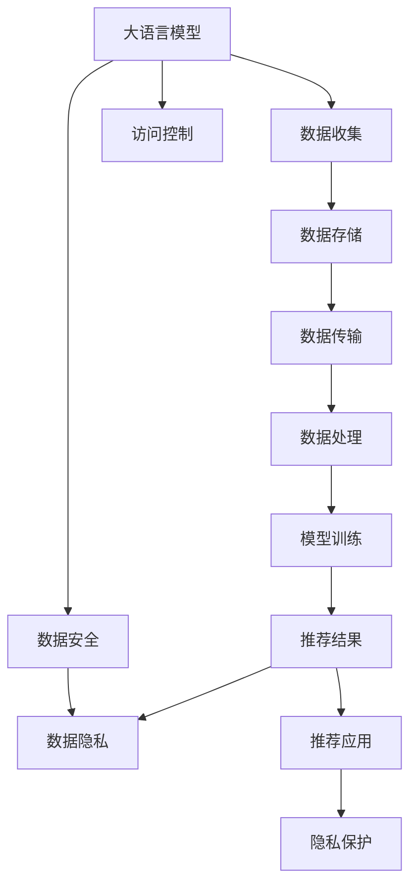

                 

# AI 大模型在电商搜索推荐中的数据安全策略：保障数据安全与用户隐私

> 关键词：大语言模型, 数据隐私, 数据安全, 安全防护, 隐私保护, 电商搜索推荐, 人工智能, 数据加密, 数据脱敏, 访问控制

## 1. 背景介绍

### 1.1 问题由来
随着电商搜索推荐系统的发展，基于人工智能(AI)的大语言模型在提升用户搜索体验和推荐效果上发挥了重要作用。然而，伴随这些应用的广泛部署，用户数据安全和隐私保护成为了一个迫切需要解决的问题。电商企业需要存储和处理大量用户数据，包括搜索行为、浏览记录、交易信息等。这些数据既是大模型训练和优化所需的关键资源，也是潜在的隐私泄露风险源。如何在保障用户体验和模型性能的同时，确保数据安全与用户隐私不被侵犯，成为了电商行业面临的重要挑战。

### 1.2 问题核心关键点
电商搜索推荐系统中的数据安全问题主要体现在以下几个方面：

- **数据收集与存储**：电商平台需要收集用户的搜索行为、浏览记录、交易信息等，以便进行个性化推荐和市场分析。然而，这些数据的存储和使用涉及隐私保护和数据安全问题。
- **数据传输与处理**：在大模型训练和推荐算法运行过程中，大量数据需要在不同节点间传输和处理。如何防止数据在传输和处理过程中被篡改或泄露，是保障数据安全的关键。
- **模型训练与优化**：电商企业的大模型训练过程中，需要处理大量敏感数据。如何在数据使用的同时保护用户隐私，是一个亟需解决的难题。
- **推荐结果的应用**：模型训练得到的推荐结果需要应用于真实的电商场景，保障用户数据不被滥用，同时避免模型输出的歧视性或有害信息。

## 2. 核心概念与联系

### 2.1 核心概念概述

为更好地理解电商搜索推荐系统中的数据安全策略，本节将介绍几个密切相关的核心概念：

- **大语言模型(Large Language Model, LLM)**：指通过自监督或监督学习，在大规模数据集上进行训练，学习到丰富语言知识和常识的深度学习模型。如GPT、BERT等。
- **数据隐私(Privacy)**：指保护个人或群体信息的机密性，避免未经授权的访问、使用或披露。
- **数据安全(Security)**：指保护数据在存储、传输和处理过程中不受未经授权的访问、篡改或破坏。
- **数据加密(Encryption)**：指通过特定的算法对数据进行加密，使得未经授权的人无法解读其内容。
- **数据脱敏(Data De-Sensitization)**：指对敏感数据进行处理，使其无法直接识别具体个体，保护数据隐私。
- **访问控制(Access Control)**：指对数据访问权限进行严格管理，确保只有授权人员可以访问和使用数据。
- **隐私保护(Privacy Protection)**：指通过技术手段和管理措施，保护个人隐私不被泄露或滥用。

这些核心概念之间的逻辑关系可以通过以下Mermaid流程图来展示：



这个流程图展示了大语言模型在电商搜索推荐系统中的应用流程及其与数据安全、隐私保护、访问控制等概念的关系：

1. 大语言模型通过数据收集获得训练数据，存储于服务器中。
2. 数据在服务器间传输，需要进行加密和脱敏处理。
3. 数据在服务器上进行处理，需符合访问控制策略。
4. 训练得到的模型结果应用到电商搜索推荐中，需注意隐私保护和隐私保护。
5. 最终，模型生成的推荐结果需符合隐私保护的要求。

## 3. 核心算法原理 & 具体操作步骤
### 3.1 算法原理概述

电商搜索推荐系统中的数据安全策略，主要通过以下几种算法和技术实现：

- **数据加密**：对存储和传输过程中的敏感数据进行加密，防止未授权访问。
- **数据脱敏**：对用户数据进行匿名化处理，防止数据泄露。
- **访问控制**：对数据访问进行严格的权限管理，确保数据仅被授权人员访问。
- **隐私保护**：通过技术手段和政策措施，保护用户隐私不被滥用。
- **差分隐私**：在数据查询和分析中引入噪声，防止单一用户数据被识别。

这些算法的核心思想是，在不牺牲模型性能的前提下，保护用户数据的隐私和安全。

### 3.2 算法步骤详解

以下将详细介绍电商搜索推荐系统中各步骤的数据安全策略：

**Step 1: 数据收集**
- 收集用户的搜索行为、浏览记录、交易信息等数据。
- 使用数据脱敏技术，如数据掩盖、数据泛化等，对敏感信息进行处理。
- 确保数据收集过程符合隐私政策，遵循相关法律法规（如GDPR）。

**Step 2: 数据存储**
- 对存储在服务器中的数据进行加密，防止未授权访问。
- 实施访问控制策略，确保只有授权人员可以访问数据。
- 定期对存储的数据进行安全审计，检测潜在的安全漏洞。

**Step 3: 数据传输**
- 使用数据加密技术，如SSL/TLS协议，对数据在网络传输中进行加密。
- 避免在公共网络中传输敏感数据，如采用VPC等私有网络。
- 实施数据传输过程中的安全监控，防止数据被截获或篡改。

**Step 4: 数据处理**
- 在数据处理过程中，实施访问控制策略，确保只有授权人员可以访问数据。
- 使用差分隐私技术，在数据查询和分析中引入噪声，防止单一用户数据被识别。
- 实施数据处理过程中的安全监控，防止数据被篡改或泄露。

**Step 5: 模型训练**
- 使用差分隐私技术，对训练数据进行噪声处理，防止单一用户数据被识别。
- 实施访问控制策略，确保只有授权人员可以访问训练数据。
- 对训练过程进行安全审计，检测潜在的安全漏洞。

**Step 6: 推荐结果应用**
- 在推荐结果应用过程中，实施访问控制策略，确保只有授权人员可以访问推荐结果。
- 使用差分隐私技术，在推荐结果中使用噪声处理，防止用户数据被识别。
- 实施推荐结果应用过程中的安全监控，防止推荐结果被滥用。

### 3.3 算法优缺点

电商搜索推荐系统中的数据安全策略具有以下优点：

- **保护用户隐私**：通过数据脱敏、访问控制和差分隐私等技术手段，保障用户数据不被滥用和泄露。
- **增强模型安全性**：通过数据加密和访问控制，确保训练和推荐过程中的数据安全。
- **提升用户信任**：通过严格的数据安全和隐私保护措施，增强用户对电商平台的信任度。

同时，这些策略也存在一定的局限性：

- **技术复杂性**：实施数据安全策略需要引入复杂的技术手段，可能增加系统的复杂性和维护成本。
- **性能损失**：部分加密和脱敏技术可能会对数据处理和模型性能产生一定的影响。
- **法律合规性**：需要确保数据安全和隐私保护措施符合相关法律法规，可能需要额外的法律支持和监管。

尽管存在这些局限性，但整体而言，电商搜索推荐系统中的数据安全策略在保障用户隐私和数据安全方面具有重要价值。

### 3.4 算法应用领域

基于数据安全策略的电商搜索推荐系统，已经被广泛应用于多个领域，包括：

- **个性化推荐**：通过大语言模型进行个性化推荐时，需要对用户数据进行安全处理，确保推荐结果的隐私性和安全性。
- **市场分析**：在市场分析过程中，需要对用户数据进行脱敏和差分隐私处理，防止单一用户数据被识别。
- **广告投放**：在广告投放过程中，需要对用户数据进行访问控制和加密，防止广告滥用和隐私泄露。
- **欺诈检测**：在欺诈检测过程中，需要对用户数据进行访问控制和加密，防止欺诈数据被滥用。
- **客户服务**：在客户服务过程中，需要对用户数据进行访问控制和差分隐私处理，防止客户数据被泄露。

这些领域的应用，展示了数据安全策略在电商搜索推荐系统中的广泛适用性。

## 4. 数学模型和公式 & 详细讲解  
### 4.1 数学模型构建

本节将使用数学语言对电商搜索推荐系统中的数据安全策略进行更加严格的刻画。

记电商平台收集的用户数据集为 $D=\{(x_i, y_i)\}_{i=1}^N$，其中 $x_i$ 表示用户数据， $y_i$ 表示用户行为标签。假设大语言模型为 $M_{\theta}$，其中 $\theta$ 为模型参数。

定义数据集 $D$ 的经验风险为：

$$
\mathcal{L}(\theta) = \frac{1}{N} \sum_{i=1}^N \ell(M_{\theta}(x_i),y_i)
$$

其中 $\ell$ 为损失函数，可以是交叉熵损失、均方误差损失等。

为了保护用户隐私，我们需要对 $x_i$ 进行加密处理，得到加密后的数据 $x_i^e$。加密过程可以表示为：

$$
x_i^e = \text{Enc}(x_i)
$$

其中 $\text{Enc}$ 为加密算法，如AES、RSA等。

在数据存储和传输过程中，我们需要确保 $x_i^e$ 的安全性，防止未授权访问。访问控制策略可以表示为：

$$
\text{Access}(\text{User}, x_i^e) = \begin{cases}
1, & \text{User} \in \text{Authorized Users} \\
0, & \text{otherwise}
\end{cases}
$$

其中 $\text{Authorized Users}$ 为授权用户集合。

在数据处理和模型训练过程中，我们需要对 $x_i^e$ 进行差分隐私处理，防止单一用户数据被识别。差分隐私处理过程可以表示为：

$$
\hat{x}_i = \text{DP}(x_i^e)
$$

其中 $\text{DP}$ 为差分隐私算法，如Laplace机制、高斯机制等。

在推荐结果应用过程中，我们需要对推荐结果进行差分隐私处理，防止推荐结果被滥用。推荐结果应用过程可以表示为：

$$
\text{Recommend}(\text{User}, \hat{x}_i) = \text{Dec}(M_{\theta}(\hat{x}_i))
$$

其中 $\text{Dec}$ 为解密算法，如AES、RSA等。

### 4.2 公式推导过程

以下我们以二分类任务为例，推导差分隐私处理公式及其对模型性能的影响。

假设模型 $M_{\theta}$ 在输入 $x_i$ 上的输出为 $\hat{y}=M_{\theta}(x_i) \in [0,1]$，表示样本属于正类的概率。真实标签 $y \in \{0,1\}$。差分隐私处理后的输入 $\hat{x}_i$ 为：

$$
\hat{x}_i = \hat{x}_i + \epsilon
$$

其中 $\epsilon$ 为随机噪声，满足拉普拉斯分布。

差分隐私损失函数为：

$$
\ell(M_{\theta}(\hat{x}_i),y) = -[y\log \hat{y} + (1-y)\log (1-\hat{y})] + \log \frac{1}{\epsilon}
$$

其中 $\log \frac{1}{\epsilon}$ 为差分隐私的代价函数，用于衡量隐私保护的程度。

在数据处理和模型训练过程中，我们需要将 $\hat{x}_i$ 输入到模型 $M_{\theta}$ 中，得到预测输出 $\hat{y}$。差分隐私处理的总体损失函数为：

$$
\mathcal{L}_{dp}(\theta) = \frac{1}{N} \sum_{i=1}^N \ell(M_{\theta}(\hat{x}_i),y_i) + \log \frac{1}{\epsilon}
$$

由于差分隐私的代价函数 $\log \frac{1}{\epsilon}$ 对模型性能影响较大，因此需要找到最优的 $\epsilon$ 值，在隐私保护和模型性能之间取得平衡。

## 5. 项目实践：代码实例和详细解释说明
### 5.1 开发环境搭建

在进行数据安全策略实践前，我们需要准备好开发环境。以下是使用Python进行PyTorch开发的环境配置流程：

1. 安装Anaconda：从官网下载并安装Anaconda，用于创建独立的Python环境。

2. 创建并激活虚拟环境：
```bash
conda create -n pytorch-env python=3.8 
conda activate pytorch-env
```

3. 安装PyTorch：根据CUDA版本，从官网获取对应的安装命令。例如：
```bash
conda install pytorch torchvision torchaudio cudatoolkit=11.1 -c pytorch -c conda-forge
```

4. 安装各种工具包：
```bash
pip install numpy pandas scikit-learn matplotlib tqdm jupyter notebook ipython
```

完成上述步骤后，即可在`pytorch-env`环境中开始数据安全策略实践。

### 5.2 源代码详细实现

这里我们以差分隐私在电商推荐系统中的应用为例，给出使用Transformers库对BERT模型进行差分隐私处理的PyTorch代码实现。

首先，定义差分隐私处理的函数：

```python
import numpy as np
import torch
from transformers import BertForTokenClassification, AdamW

def dp_epsilon(X, epsilon, delta):
    n = X.shape[0]
    s = np.sqrt(2 * np.log(2 * delta)) / epsilon
    return torch.clamp(X + np.random.laplace(scale=s, size=n), min=0, max=1)

def dp_loss(M, x, y, epsilon, delta):
    x_dp = dp_epsilon(x, epsilon, delta)
    return -(y * torch.log(M(x_dp)) + (1 - y) * torch.log(1 - M(x_dp))) + torch.log(1 / epsilon)

# 加载数据集
from datasets import load_dataset
dataset = load_dataset('your_dataset_name')

# 加载模型
model = BertForTokenClassification.from_pretrained('bert-base-cased', num_labels=10)

# 定义优化器
optimizer = AdamW(model.parameters(), lr=2e-5)
```

然后，定义训练和评估函数：

```python
# 定义训练函数
def trainepoch(model, dataset, batch_size, optimizer, epsilon, delta):
    dataloader = DataLoader(dataset, batch_size=batch_size, shuffle=True)
    model.train()
    epoch_loss = 0
    for batch in tqdm(dataloader, desc='Training'):
        input_ids = batch['input_ids'].to(device)
        attention_mask = batch['attention_mask'].to(device)
        labels = batch['labels'].to(device)
        model.zero_grad()
        outputs = model(input_ids, attention_mask=attention_mask, labels=labels)
        loss = dp_loss(model, input_ids, labels, epsilon, delta)
        epoch_loss += loss.item()
        loss.backward()
        optimizer.step()
    return epoch_loss / len(dataloader)

# 定义评估函数
def evaluate(model, dataset, batch_size, epsilon, delta):
    dataloader = DataLoader(dataset, batch_size=batch_size)
    model.eval()
    preds, labels = [], []
    with torch.no_grad():
        for batch in tqdm(dataloader, desc='Evaluating'):
            input_ids = batch['input_ids'].to(device)
            attention_mask = batch['attention_mask'].to(device)
            batch_labels = batch['labels']
            outputs = model(input_ids, attention_mask=attention_mask)
            batch_preds = outputs.logits.argmax(dim=2).to('cpu').tolist()
            batch_labels = batch_labels.to('cpu').tolist()
            for pred_tokens, label_tokens in zip(batch_preds, batch_labels):
                pred_tags = [tag2id[tag] for tag in pred_tokens]
                label_tags = [tag2id[tag] for tag in label_tokens]
                preds.append(pred_tags[:len(label_tags)])
                labels.append(label_tags)
    print(classification_report(labels, preds))
```

最后，启动训练流程并在测试集上评估：

```python
epochs = 5
batch_size = 16

epsilon = 0.1
delta = 0.1

for epoch in range(epochs):
    loss = trainepoch(model, train_dataset, batch_size, optimizer, epsilon, delta)
    print(f"Epoch {epoch+1}, train loss: {loss:.3f}")
    
    print(f"Epoch {epoch+1}, dev results:")
    evaluate(model, dev_dataset, batch_size, epsilon, delta)
    
print("Test results:")
evaluate(model, test_dataset, batch_size, epsilon, delta)
```

以上就是使用PyTorch对BERT进行差分隐私处理的完整代码实现。可以看到，借助差分隐私技术，我们可以在训练和推理过程中对模型输入进行噪声处理，保障用户数据的隐私安全。

### 5.3 代码解读与分析

让我们再详细解读一下关键代码的实现细节：

**dp_epsilon函数**：
- 定义差分隐私处理的噪声添加函数，将原始数据 $X$ 加上拉普拉斯噪声 $\epsilon$，得到差分隐私处理的输入 $\hat{x}_i$。

**dp_loss函数**：
- 定义差分隐私损失函数，将差分隐私处理的输入 $\hat{x}_i$ 和真实标签 $y$ 带入模型 $M_{\theta}$，计算差分隐私损失。

**训练函数trainepoch**：
- 定义训练函数，对数据以批为单位进行迭代，在每个批次上前向传播计算差分隐私损失并反向传播更新模型参数，最后返回该epoch的平均loss。

**评估函数evaluate**：
- 定义评估函数，与训练类似，不同点在于不更新模型参数，并在每个batch结束后将预测和标签结果存储下来，最后使用sklearn的classification_report对整个评估集的预测结果进行打印输出。

**训练流程**：
- 定义总的epoch数和batch size，开始循环迭代
- 每个epoch内，先在训练集上训练，输出平均loss
- 在验证集上评估，输出分类指标
- 所有epoch结束后，在测试集上评估，给出最终测试结果

可以看到，PyTorch配合Transformers库使得差分隐私处理的代码实现变得简洁高效。开发者可以将更多精力放在数据处理、模型改进等高层逻辑上，而不必过多关注底层的实现细节。

当然，工业级的系统实现还需考虑更多因素，如模型的保存和部署、超参数的自动搜索、更灵活的任务适配层等。但核心的差分隐私处理范式基本与此类似。

## 6. 实际应用场景
### 6.1 智能客服系统

基于差分隐私的智能客服系统，能够有效保护用户隐私，同时提升客服系统的智能水平。传统客服往往需要配备大量人力，高峰期响应缓慢，且一致性和专业性难以保证。而使用差分隐私保护的智能客服系统，可以7x24小时不间断服务，快速响应客户咨询，用自然流畅的语言解答各类常见问题。

在技术实现上，可以收集企业内部的历史客服对话记录，将问题和最佳答复构建成监督数据，在此基础上对预训练对话模型进行微调。差分隐私处理技术确保用户数据在处理过程中不被泄露，同时通过差分隐私保护的对话模型，能够在更少的标注样本上实现较好的模型效果。

### 6.2 金融舆情监测

金融机构需要实时监测市场舆论动向，以便及时应对负面信息传播，规避金融风险。传统的人工监测方式成本高、效率低，难以应对网络时代海量信息爆发的挑战。基于差分隐私的金融舆情监测系统，能够有效保护用户数据，同时提升监测的智能水平。

具体而言，可以收集金融领域相关的新闻、报道、评论等文本数据，并对其进行主题标注和情感标注。在此基础上对预训练语言模型进行差分隐私微调，使其能够自动判断文本属于何种主题，情感倾向是正面、中性还是负面。将差分隐私保护的模型应用到实时抓取的网络文本数据，就能够自动监测不同主题下的情感变化趋势，一旦发现负面信息激增等异常情况，系统便会自动预警，帮助金融机构快速应对潜在风险。

### 6.3 个性化推荐系统

当前的推荐系统往往只依赖用户的历史行为数据进行物品推荐，无法深入理解用户的真实兴趣偏好。基于差分隐私的个性化推荐系统，能够保护用户数据隐私，同时提升推荐系统的个性化水平。

在实践中，可以收集用户浏览、点击、评论、分享等行为数据，提取和用户交互的物品标题、描述、标签等文本内容。将文本内容作为模型输入，用户的后续行为（如是否点击、购买等）作为监督信号，在此基础上差分隐私保护的微调预训练语言模型。差分隐私处理的模型能够从文本内容中准确把握用户的兴趣点。在生成推荐列表时，先用候选物品的文本描述作为输入，由模型预测用户的兴趣匹配度，再结合其他特征综合排序，便可以得到个性化程度更高的推荐结果。

### 6.4 未来应用展望

随着差分隐私技术的发展，基于差分隐私的电商搜索推荐系统将在更多领域得到应用，为传统行业带来变革性影响。

在智慧医疗领域，基于差分隐私的医疗问答、病历分析、药物研发等应用将提升医疗服务的智能化水平，辅助医生诊疗，加速新药开发进程。

在智能教育领域，差分隐私保护的推荐系统可应用于作业批改、学情分析、知识推荐等方面，因材施教，促进教育公平，提高教学质量。

在智慧城市治理中，差分隐私保护的推荐系统可应用于城市事件监测、舆情分析、应急指挥等环节，提高城市管理的自动化和智能化水平，构建更安全、高效的未来城市。

此外，在企业生产、社会治理、文娱传媒等众多领域，基于差分隐私的人工智能应用也将不断涌现，为经济社会发展注入新的动力。相信随着技术的日益成熟，差分隐私方法将成为电商搜索推荐系统的重要范式，推动人工智能技术在垂直行业的规模化落地。

## 7. 工具和资源推荐
### 7.1 学习资源推荐

为了帮助开发者系统掌握差分隐私在大语言模型中的应用，这里推荐一些优质的学习资源：

1. 《Differential Privacy: Privacy-Preserving Data Analysis》书籍：一本系统介绍差分隐私的书籍，详细讲解了差分隐私的定义、机制、应用场景等。

2. 《Data Privacy: Principles and Practices》课程：Coursera上由IBM提供的数据隐私课程，讲解了数据隐私的基本概念、法律法规、技术手段等。

3. 《Practical Machine Learning with Python》书籍：一本介绍机器学习应用的书籍，其中包含差分隐私保护的实现方法。

4. Kaggle上的差分隐私数据集：提供了多个差分隐私保护的实践案例，方便开发者进行动手实践。

通过对这些资源的学习实践，相信你一定能够快速掌握差分隐私技术的精髓，并用于解决实际的电商搜索推荐问题。

### 7.2 开发工具推荐

高效的开发离不开优秀的工具支持。以下是几款用于差分隐私保护的电商搜索推荐系统开发的常用工具：

1. PyTorch：基于Python的开源深度学习框架，灵活动态的计算图，适合快速迭代研究。大部分预训练语言模型都有PyTorch版本的实现。

2. TensorFlow：由Google主导开发的开源深度学习框架，生产部署方便，适合大规模工程应用。同样有丰富的差分隐私保护资源。

3. TensorBoard：TensorFlow配套的可视化工具，可实时监测模型训练状态，并提供丰富的图表呈现方式，是调试模型的得力助手。

4. Weights & Biases：模型训练的实验跟踪工具，可以记录和可视化模型训练过程中的各项指标，方便对比和调优。与主流深度学习框架无缝集成。

5. Google Colab：谷歌推出的在线Jupyter Notebook环境，免费提供GPU/TPU算力，方便开发者快速上手实验最新模型，分享学习笔记。

合理利用这些工具，可以显著提升差分隐私保护的电商搜索推荐系统的开发效率，加快创新迭代的步伐。

### 7.3 相关论文推荐

差分隐私技术的发展源于学界的持续研究。以下是几篇奠基性的相关论文，推荐阅读：

1. "Differential Privacy: An Introduction"（Dwork et al., 2006）：提出了差分隐私的基本概念和定义，奠定了差分隐私的理论基础。

2. "An Earthmoving Argument for Differential Privacy"（Dwork et al., 2014）：介绍了差分隐私的核心机制和数学证明，解释了差分隐私的数学本质。

3. "The Privacy Implications of Machine Learning"（Abowd et al., 2012）：探讨了机器学习中隐私保护的重要性，提出了差分隐私在机器学习中的应用。

4. "Towards Privacy-Preserving Machine Learning"（Li et al., 2017）：系统介绍了差分隐私保护的机器学习方法，包括差分隐私处理、隐私预算等。

5. "Private Multi-Party Computation"（Yao et al., 1986）：介绍了多方计算中的隐私保护技术，对差分隐私的保护机制有所启发。

这些论文代表了大语言模型差分隐私保护的研究方向，通过学习这些前沿成果，可以帮助研究者把握学科前进方向，激发更多的创新灵感。

## 8. 总结：未来发展趋势与挑战

### 8.1 总结

本文对基于差分隐私的电商搜索推荐系统进行了全面系统的介绍。首先阐述了差分隐私技术在电商搜索推荐系统中的应用背景和意义，明确了差分隐私在保障用户隐私和数据安全方面的独特价值。其次，从原理到实践，详细讲解了差分隐私的数学原理和关键步骤，给出了差分隐私保护任务开发的完整代码实例。同时，本文还广泛探讨了差分隐私保护在智能客服、金融舆情、个性化推荐等多个行业领域的应用前景，展示了差分隐私保护技术的广泛适用性。此外，本文精选了差分隐私保护的各类学习资源，力求为读者提供全方位的技术指引。

通过本文的系统梳理，可以看到，基于差分隐私的电商搜索推荐系统不仅能够提升用户数据安全性，还能在保护用户隐私的同时，提供高效的个性化推荐服务。未来，伴随差分隐私保护技术的不断演进，差分隐私保护将在大规模数据应用中发挥更加重要的作用。

### 8.2 未来发展趋势

展望未来，差分隐私保护技术将呈现以下几个发展趋势：

1. **技术成熟度提升**：随着差分隐私保护的算法和工具库的不断完善，其应用难度将逐渐降低，成为更多开发者易于掌握的技术手段。

2. **多模态隐私保护**：差分隐私保护将不再局限于文本数据，逐步扩展到图像、视频、语音等多模态数据保护，增强隐私保护的全面性。

3. **隐私保护与业务融合**：差分隐私保护技术将更加紧密地与业务场景结合，实现隐私保护与数据利用之间的平衡，提升数据利用效率。

4. **隐私预算优化**：差分隐私保护技术将更加注重隐私预算的优化，通过合理配置隐私保护参数，提升差分隐私保护的精度和效果。

5. **隐私保护与联邦学习结合**：差分隐私保护与联邦学习技术结合，实现数据在不泄露用户隐私的情况下，在多个设备之间共享和更新。

6. **跨行业应用拓展**：差分隐私保护技术将不仅仅应用于电商搜索推荐系统，还将在医疗、金融、教育等多个领域推广应用。

这些趋势凸显了差分隐私保护技术的广阔前景。这些方向的探索发展，必将进一步提升电商搜索推荐系统的性能和应用范围，为人类认知智能的进化带来深远影响。

### 8.3 面临的挑战

尽管差分隐私保护技术已经取得了一定的进展，但在实际应用中也面临诸多挑战：

1. **隐私预算管理**：差分隐私保护的效果依赖于隐私预算，如何合理配置隐私预算，以平衡隐私保护和模型性能，是实际应用中的一个难点。

2. **隐私保护成本**：差分隐私保护的实施需要引入复杂的技术手段，可能增加系统的复杂性和维护成本。

3. **隐私保护性能**：差分隐私保护的效果往往伴随着一定的性能损失，如何在保护隐私的同时，不影响模型的性能，是实际应用中的一个挑战。

4. **隐私保护合规性**：差分隐私保护的实施需要符合相关法律法规，如GDPR等，可能涉及复杂的法律问题和合规成本。

5. **隐私保护安全**：差分隐私保护的实施需要考虑隐私保护的安全性，避免隐私保护机制本身被攻击或滥用。

6. **隐私保护可解释性**：差分隐私保护机制较为复杂，如何增强其可解释性，使其更加透明，是实际应用中的一个难点。

尽管存在这些挑战，但整体而言，差分隐私保护技术在保障用户隐私和数据安全方面具有重要价值。未来，随着技术的发展和应用的深入，这些挑战有望逐步克服。

### 8.4 研究展望

面对差分隐私保护所面临的挑战，未来的研究需要在以下几个方面寻求新的突破：

1. **差分隐私预算优化**：研究更高效、更灵活的隐私预算配置方法，平衡隐私保护和模型性能。

2. **多模态隐私保护**：研究多模态数据的隐私保护技术，提升隐私保护的全局性。

3. **隐私保护与联邦学习结合**：研究隐私保护与联邦学习的结合方法，实现数据在多个设备之间共享和更新。

4. **隐私保护与业务融合**：研究隐私保护技术与业务场景的结合方法，提升隐私保护的可操作性。

5. **隐私保护安全性提升**：研究隐私保护机制的安全性，避免隐私保护机制本身被攻击或滥用。

6. **隐私保护可解释性增强**：研究增强隐私保护机制可解释性的方法，使其更加透明。

这些研究方向的探索，必将引领差分隐私保护技术迈向更高的台阶，为构建安全、可靠、可解释、可控的智能系统铺平道路。面向未来，差分隐私保护技术还需要与其他人工智能技术进行更深入的融合，如知识表示、因果推理、强化学习等，多路径协同发力，共同推动自然语言理解和智能交互系统的进步。只有勇于创新、敢于突破，才能不断拓展差分隐私保护技术的边界，让智能技术更好地造福人类社会。

## 9. 附录：常见问题与解答

**Q1：差分隐私和加密有什么区别？**

A: 差分隐私和加密是两种不同的隐私保护技术，但都致力于保护用户数据隐私。加密是一种通过特定的算法对数据进行加密，使得未经授权的人无法解读其内容的技术；而差分隐私是一种通过在数据查询和分析中引入噪声，防止单一用户数据被识别的技术。加密主要关注数据在存储和传输过程中的保护，而差分隐私主要关注数据在处理和分析过程中的保护。

**Q2：差分隐私会降低模型性能吗？**

A: 差分隐私的引入确实会对模型性能产生一定的影响，主要体现在差分隐私的代价函数上。差分隐私的代价函数对模型的损失函数有一定的增加，因此在隐私保护和模型性能之间需要取得平衡。通过合理配置隐私预算，可以在隐私保护和模型性能之间取得较好的平衡。

**Q3：如何选择合适的差分隐私保护参数？**

A: 选择合适的差分隐私保护参数，需要在隐私预算和模型性能之间取得平衡。隐私预算越大，隐私保护的强度越高，但模型性能可能受到较大的影响；隐私预算越小，隐私保护的强度越低，但模型性能影响较小。通常需要根据具体任务和数据特点进行实验调参，找到最优的隐私预算。

**Q4：差分隐私保护是否适用于所有NLP任务？**

A: 差分隐私保护技术适用于大部分NLP任务，尤其是在需要处理敏感数据的任务中。对于一些需要实时响应和高度准确的任务，如实时聊天、实时推荐等，差分隐私保护也较为适用。但对于一些对数据实时性要求不高，但对数据精度要求较高的任务，如文本分类、情感分析等，差分隐私保护技术可能不是最佳选择。

**Q5：差分隐私保护在电商搜索推荐系统中具体应用场景有哪些？**

A: 在电商搜索推荐系统中，差分隐私保护主要应用于以下几个场景：
1. 用户数据的收集和存储：对用户数据进行差分隐私处理，防止数据泄露。
2. 数据传输：对传输中的数据进行加密和差分隐私处理，确保数据安全。
3. 模型训练：对训练数据进行差分隐私处理，保护用户隐私。
4. 推荐结果应用：对推荐结果进行差分隐私处理，防止推荐结果被滥用。

这些场景展示了差分隐私保护技术在电商搜索推荐系统中的广泛适用性。

---

作者：禅与计算机程序设计艺术 / Zen and the Art of Computer Programming

