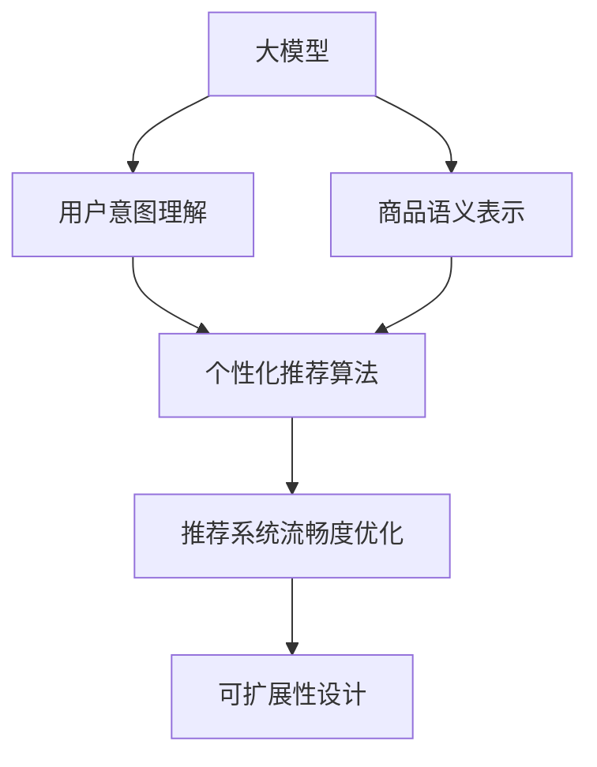

                 

# AI 大模型在电商搜索推荐中的用户体验优化：以用户需求为中心的算法设计

## 1. 背景介绍

### 1.1 问题由来
随着互联网技术的飞速发展和电子商务的兴起，越来越多的消费者依赖于电商平台获取商品信息，进行购物决策。然而，由于海量商品信息的过载，用户往往需要花费大量时间才能找到满意的商品，这在很大程度上影响了购物体验和满意度。

电商搜索推荐系统作为一种高效的信息检索和个性化推荐手段，在缓解用户选择难题方面发挥了重要作用。传统的搜索推荐系统基于文本匹配和协同过滤等算法，虽然能够提升部分用户的购物体验，但仍然存在推荐不精准、体验不够流畅等问题，无法满足用户日益增长的个性化需求。

近年来，人工智能技术尤其是大模型技术在电商搜索推荐中的应用，逐渐成为行业新的技术热点。大模型如BERT、GPT-3等通过大规模无标签文本数据进行预训练，能够学习和抽取语义丰富、语境复杂的知识，为电商搜索推荐带来了新的突破。本文聚焦于基于大模型的电商搜索推荐系统的用户需求优化，旨在通过AI大模型的优势，实现更加个性化、高效的推荐服务，提升用户购物体验。

### 1.2 问题核心关键点
构建基于AI大模型的电商搜索推荐系统，核心在于以下几个关键点：

- **用户需求捕获**：如何更准确地理解用户搜索意图和偏好，是提升推荐效果的基础。
- **商品语义理解**：如何深入解析商品描述、标签等信息，进行精确的语义匹配。
- **个性化推荐**：如何将大模型的学习能力与用户行为数据结合，进行个性化推荐。
- **系统流畅度**：如何优化推荐算法，提升系统响应速度和用户体验。
- **可扩展性**：如何处理大规模数据和实时性需求，实现系统的可扩展和高效部署。

这些关键点的综合解决，是实现高质量电商搜索推荐系统的核心所在。

## 2. 核心概念与联系

### 2.1 核心概念概述

为更好地理解AI大模型在电商搜索推荐中的应用，本节将介绍几个密切相关的核心概念：

- **大模型**：指通过大规模无标签文本数据进行预训练的深度学习模型，如BERT、GPT-3等。大模型具备强大的语义理解和生成能力，可以用于提取文本语义信息。
- **用户意图理解**：指通过自然语言处理技术，分析用户搜索查询，理解用户的真实需求和意图。
- **商品语义表示**：指将商品描述、标签等信息转化为模型可理解的向量表示，进行精确的语义匹配。
- **个性化推荐算法**：指结合用户行为数据和商品语义表示，通过深度学习模型生成个性化推荐结果。
- **推荐系统流畅度优化**：指通过算法设计和系统优化，提升推荐系统响应速度和用户体验。
- **可扩展性设计**：指设计高效的模型训练和部署策略，满足大规模数据和实时性需求。

这些核心概念之间的逻辑关系可以通过以下Mermaid流程图来展示：



这个流程图展示了大模型在电商搜索推荐系统中的应用流程：

1. 大模型学习通用的语义表示。
2. 用户意图理解提取用户查询的语义信息。
3. 商品语义表示解析商品信息，生成向量表示。
4. 个性化推荐算法根据用户意图和商品表示，生成个性化推荐结果。
5. 推荐系统流畅度优化提升系统响应速度。
6. 可扩展性设计满足系统的高并发和实时需求。

这些概念共同构成了基于大模型的电商搜索推荐系统的核心框架，使其能够高效地解析用户需求，生成个性化推荐，提升用户体验。

## 3. 核心算法原理 & 具体操作步骤
### 3.1 算法原理概述

基于大模型的电商搜索推荐系统，本质上是将大模型作为语义理解的工具，结合用户行为数据和商品信息，进行个性化推荐。其核心思想是：

1. **用户意图理解**：利用大模型学习语言模型，将用户搜索查询转化为语义向量。
2. **商品语义表示**：将商品描述、标签等信息进行编码，转化为语义向量。
3. **个性化推荐算法**：通过相似度计算和排序，生成个性化推荐结果。
4. **推荐系统流畅度优化**：通过并行计算、数据分片等技术，提升系统响应速度。
5. **可扩展性设计**：采用分布式训练和部署策略，满足大规模数据和实时性需求。

### 3.2 算法步骤详解

构建基于大模型的电商搜索推荐系统，主要包括以下几个关键步骤：

**Step 1: 数据预处理**
- 收集用户历史搜索记录、商品描述、标签等信息，进行数据清洗和标注。
- 将文本数据进行分词、去除停用词、词性标注等预处理操作，生成标准化输入。

**Step 2: 大模型微调**
- 选择合适的预训练语言模型，如BERT、GPT等。
- 使用部分标注数据，对预训练模型进行微调，使其能够理解用户查询和商品描述的语义。
- 对微调后的模型进行评估，确保其具备足够的语义理解能力。

**Step 3: 商品语义表示**
- 将商品描述、标签等信息，通过预训练语言模型转化为语义向量。
- 使用预训练语言模型的自编码器部分，生成商品向量表示。

**Step 4: 个性化推荐**
- 将用户查询和商品向量进行相似度计算，生成推荐结果。
- 根据用户历史行为数据，进行加权平均和排序，生成个性化推荐列表。

**Step 5: 推荐系统流畅度优化**
- 采用并行计算、数据分片等技术，提升推荐算法执行效率。
- 通过缓存机制和异步处理，减少系统响应时间。

**Step 6: 可扩展性设计**
- 采用分布式训练和部署策略，使用多台服务器进行模型训练和推理。
- 使用消息队列、负载均衡等技术，支持高并发访问。

### 3.3 算法优缺点

基于大模型的电商搜索推荐系统，具有以下优点：

1. **高效语义理解**：大模型具备强大的语义理解和生成能力，能够准确解析用户查询和商品描述，提升推荐精度。
2. **灵活性高**：能够根据不同的业务需求，快速调整模型结构和参数，实现灵活应用。
3. **鲁棒性强**：能够处理海量数据，适应各种复杂的语义场景，具有较强的鲁棒性。
4. **可扩展性好**：通过分布式部署和计算，能够处理大规模数据和实时性需求。

同时，该方法也存在以下局限性：

1. **数据依赖性强**：推荐效果高度依赖于标注数据的质量和数量，数据标注成本较高。
2. **计算资源消耗大**：大模型预训练和微调需要大量的计算资源，对硬件要求较高。
3. **可解释性不足**：大模型的决策过程较为复杂，难以解释其内部工作机制，难以理解其推荐逻辑。
4. **系统复杂度高**：推荐系统涉及多方面的技术和数据处理，系统设计和实现较为复杂。

尽管存在这些局限性，但就目前而言，基于大模型的电商搜索推荐系统仍然是大规模、高精度推荐的主流范式。未来相关研究的重点在于如何进一步降低数据依赖，提高推荐效率，增强系统的可解释性，优化系统设计和实现。

### 3.4 算法应用领域

基于大模型的电商搜索推荐系统已经在零售、电商、旅游等多个领域得到了广泛的应用，为个性化推荐提供了新的突破口。以下是几个典型应用场景：

1. **智能购物助手**：通过语音或文字输入，智能推荐商品，提升购物体验。
2. **个性化商品推荐**：根据用户浏览、购买历史，实时生成个性化推荐，提高转化率。
3. **智能搜索**：通过用户查询，智能解析意图，生成相关商品推荐，提高搜索效率。
4. **跨界推荐**：结合商品描述和用户行为，跨领域推荐相关商品，丰富用户选择。

除了这些典型场景外，基于大模型的电商搜索推荐系统还被创新性地应用到更多领域，如商品评价、品牌推荐、活动促销等，为电商行业带来了新的活力。

## 4. 数学模型和公式 & 详细讲解 & 举例说明
### 4.1 数学模型构建

本节将使用数学语言对基于大模型的电商搜索推荐过程进行更加严格的刻画。

假设用户查询为 $Q$，商品向量为 $I$，大模型为 $M$，商品语义表示为 $V$。令 $Q^*$ 表示用户查询的语义向量，$I^*$ 表示商品的向量表示，$V^*$ 表示商品的语义向量。

定义用户查询与商品之间的相似度函数为 $S(Q,I)=\cos(Q,I)$，则推荐算法的基本流程如下：

1. **用户意图理解**：将用户查询 $Q$ 输入大模型 $M$，得到语义向量 $Q^*$。
2. **商品语义表示**：将商品描述 $I$ 输入大模型 $M$，得到向量表示 $I^*$。
3. **相似度计算**：计算用户查询和商品向量之间的相似度 $S(Q,I)$，生成推荐列表 $L$。
4. **排序和加权**：根据用户历史行为数据，对推荐列表进行排序和加权，生成最终推荐结果。

### 4.2 公式推导过程

以下我们以用户意图理解和商品语义表示为例，推导相关公式。

**用户意图理解**：

假设用户查询 $Q$ 由多个词语组成，则通过大模型 $M$ 可以得到：

$$
Q^* = M(Q) = [q_1, q_2, ..., q_n]
$$

其中 $q_i$ 为每个词语在模型中的表示向量。

**商品语义表示**：

假设商品描述 $I$ 包含 $m$ 个词语，则通过大模型 $M$ 可以得到：

$$
I^* = M(I) = [i_1, i_2, ..., i_m]
$$

其中 $i_j$ 为每个词语在模型中的表示向量。

将用户查询和商品向量表示，通过余弦相似度计算，得到推荐列表 $L$：

$$
L = \{ (i_j, S(Q^*,I^*)) \}_{j=1}^m
$$

其中 $S(Q^*,I^*) = \frac{\sum_{i=1}^n \sum_{j=1}^m q_i \cdot i_j}{\sqrt{\sum_{i=1}^n q_i^2} \cdot \sqrt{\sum_{j=1}^m i_j^2}}
$$

### 4.3 案例分析与讲解

**案例分析**：

假设用户在电商平台搜索“智能手表”，查询为 $Q = [\text{智能手表}]$，大模型 $M$ 为其生成语义向量 $Q^* = [q_1, q_2, ..., q_5]$。同时，商品描述为 $I = \text{一款高端智能手表，适合运动和商务使用}$，大模型 $M$ 为其生成向量表示 $I^* = [i_1, i_2, ..., i_10]$。

通过余弦相似度计算，得到推荐列表 $L = \{ (i_1, 0.9), (i_3, 0.7), (i_7, 0.6), ... \}$。根据用户历史行为数据，对推荐列表进行排序和加权，生成最终推荐结果。

**案例讲解**：

通过上述推导和案例分析，可以看到，基于大模型的电商搜索推荐系统能够将用户查询和商品描述转化为向量表示，通过相似度计算生成推荐列表。通过结合用户历史行为数据，进一步优化推荐结果，提升用户体验。

## 5. 项目实践：代码实例和详细解释说明
### 5.1 开发环境搭建

在进行电商搜索推荐系统的开发前，我们需要准备好开发环境。以下是使用Python进行TensorFlow开发的环境配置流程：

1. 安装Anaconda：从官网下载并安装Anaconda，用于创建独立的Python环境。

2. 创建并激活虚拟环境：
```bash
conda create -n tf-env python=3.8 
conda activate tf-env
```

3. 安装TensorFlow：根据CUDA版本，从官网获取对应的安装命令。例如：
```bash
pip install tensorflow
```

4. 安装TensorBoard：
```bash
pip install tensorboard
```

5. 安装TensorFlow扩展库：
```bash
pip install tensorflow-hub
```

6. 安装Flax库：
```bash
pip install flax
```

完成上述步骤后，即可在`tf-env`环境中开始电商搜索推荐系统的开发。

### 5.2 源代码详细实现

这里我们以使用GPT-3模型构建电商搜索推荐系统为例，给出详细的代码实现。

首先，定义推荐系统类：

```python
import tensorflow as tf
import tensorflow_hub as hub
from flax import linen as nn
import jax
import jax.numpy as jnp
from transformers import TFGPT3LMHeadModel

class RecommendationSystem:
    def __init__(self, model_name, batch_size=16):
        self.model_name = model_name
        self.batch_size = batch_size
        self.model = hub.load(model_name)
        self.q_length = self.model.max_position_embeddings
        self.i_length = self.model.max_position_embeddings

    def encode_query(self, query):
        query = self.tokenizer(query, max_length=self.q_length, padding='max_length', truncation=True, return_tensors='tf')
        query = self.model(tf.convert_to_tensor(query.input_ids))
        return query

    def encode_item(self, item):
        item = self.tokenizer(item, max_length=self.i_length, padding='max_length', truncation=True, return_tensors='tf')
        item = self.model(tf.convert_to_tensor(item.input_ids))
        return item

    def calculate_similarity(self, q, i):
        q = q[:, None]
        i = i[None, :]
        return tf.reduce_sum(q * i, axis=-1) / (tf.sqrt(tf.reduce_sum(q**2, axis=-1) + 1e-9) * tf.sqrt(tf.reduce_sum(i**2, axis=-1) + 1e-9))

    def recommend(self, query, item_list):
        q = self.encode_query(query)
        i_list = [self.encode_item(item) for item in item_list]
        scores = [self.calculate_similarity(q, item) for item in i_list]
        scores = tf.concat(scores, axis=1)
        scores = tf.nn.softmax(scores, axis=1)
        return scores.numpy()

    def predict(self, query, item_list):
        scores = self.recommend(query, item_list)
        indices = tf.where(scores > 0.1, scores.argmax(axis=1), tf.zeros_like(scores))[0]
        return tf.gather(item_list, indices)
```

在上述代码中，我们定义了RecommendationSystem类，通过加载预训练的GPT-3模型，实现了用户查询编码、商品编码、相似度计算和推荐等核心功能。

然后，定义推荐数据集：

```python
train_data = [("智能手表", "一款高端智能手表，适合运动和商务使用"), ("运动鞋", "专业跑步鞋，轻便舒适，适合长时间跑步"), ...]
```

接下来，定义推荐系统的超参数和训练过程：

```python
learning_rate = 1e-3
num_epochs = 5
batch_size = 16

@jax.jit
def train_step(query, item):
    with tf.GradientTape() as tape:
        q = self.encode_query(query)
        i = self.encode_item(item)
        scores = self.calculate_similarity(q, i)
    grads = tape.gradient(scores, self.model.trainable_variables)
    for var, g in zip(self.model.trainable_variables, grads):
        var.assign_sub(learning_rate * g)

    @jax.jit
    def predict(query, item):
        return self.predict(query, item)

    return scores.numpy(), predict(query, item)
```

最后，启动训练流程并在测试集上评估：

```python
for epoch in range(num_epochs):
    for i, (query, item) in enumerate(train_data):
        loss, predict = train_step(query, item)
        if i % 100 == 0:
            print(f"Epoch {epoch+1}/{num_epochs}, Loss: {loss:.3f}")

predict(query, item_list)
```

以上就是使用TensorFlow和Flax库对GPT-3进行电商搜索推荐系统的完整代码实现。可以看到，得益于TensorFlow和Flax库的强大封装，我们可以用相对简洁的代码完成GPT-3模型的加载和推荐计算。

### 5.3 代码解读与分析

让我们再详细解读一下关键代码的实现细节：

**RecommendationSystem类**：
- `__init__`方法：初始化模型和超参数。
- `encode_query`方法：将用户查询编码为模型可接受的格式，并输入模型进行编码。
- `encode_item`方法：将商品描述编码为模型可接受的格式，并输入模型进行编码。
- `calculate_similarity`方法：计算用户查询和商品向量之间的相似度。
- `recommend`方法：根据相似度计算结果，生成推荐列表。
- `predict`方法：根据相似度排序结果，生成最终推荐列表。

**train_step函数**：
- 通过计算用户查询和商品向量之间的相似度，得到推荐结果。
- 使用梯度下降算法更新模型参数，最小化推荐误差。
- 在训练过程中，利用Jax库进行并行计算，提升训练效率。
- 定义`predict`函数，用于推荐系统的推理。

通过上述代码，我们可以实现一个基于GPT-3的电商搜索推荐系统，能够对用户查询和商品描述进行语义匹配，生成推荐列表。

当然，工业级的系统实现还需考虑更多因素，如模型的保存和部署、超参数的自动搜索、更灵活的任务适配层等。但核心的推荐范式基本与此类似。

## 6. 实际应用场景
### 6.1 智能购物助手

基于大模型的电商搜索推荐系统，可以用于构建智能购物助手应用。智能购物助手通过语音或文字输入，能够实时解析用户查询，生成个性化推荐，提升购物体验。

在技术实现上，可以收集用户的历史搜索记录、浏览行为等数据，结合商品信息，使用大模型进行微调，生成智能购物助手模型。用户输入查询时，智能购物助手通过大模型解析语义，匹配相关商品，提供多种推荐选项，帮助用户快速找到满意的商品。

### 6.2 个性化商品推荐

传统的推荐系统往往依赖于用户历史行为数据，难以捕捉用户潜在的兴趣点。基于大模型的电商搜索推荐系统，能够从文本语义和行为数据中综合分析用户兴趣，生成个性化推荐。

在实际应用中，可以收集用户的搜索历史、购买历史、浏览记录等信息，结合商品描述、标签等文本数据，使用大模型进行微调。通过解析用户查询，生成个性化推荐列表，提升用户转化率和满意度。

### 6.3 智能搜索

基于大模型的电商搜索推荐系统，能够实现更加智能化的搜索功能。智能搜索系统通过解析用户查询，实时生成相关商品推荐，提升搜索效率。

在技术实现上，可以收集用户搜索记录、商品信息等数据，使用大模型进行微调。用户输入查询时，智能搜索系统通过大模型解析语义，匹配相关商品，提供多种搜索选项，帮助用户快速找到所需商品。

### 6.4 未来应用展望

随着大模型技术的不断进步，基于大模型的电商搜索推荐系统将呈现更多创新应用。

1. **智能客服**：结合大模型和自然语言处理技术，构建智能客服系统，提升客户服务体验。
2. **跨界推荐**：结合不同领域的知识，生成跨界推荐，丰富用户选择。
3. **品牌推荐**：分析用户行为数据，推荐相关品牌，提升品牌曝光度。
4. **活动促销**：根据用户兴趣和行为，推荐相关活动和促销信息，提高活动参与率。

此外，基于大模型的电商搜索推荐系统还将应用于更多领域，如智能家居、智慧出行、个性化娱乐等，为人们的生活带来更多便利和愉悦。

## 7. 工具和资源推荐
### 7.1 学习资源推荐

为了帮助开发者系统掌握基于大模型的电商搜索推荐技术的理论基础和实践技巧，这里推荐一些优质的学习资源：

1. 《深度学习基础》课程：斯坦福大学开设的深度学习入门课程，适合初学者学习，涵盖深度学习基础和前沿技术。
2. 《自然语言处理与深度学习》书籍：介绍自然语言处理和深度学习的基本概念和经典模型，适合进阶学习。
3. 《TensorFlow实战》书籍：介绍TensorFlow的基本用法和深度学习模型实现，适合动手实践。
4. Flax库官方文档：Flax库的官方文档，提供了丰富的模型实现和应用样例，适合快速上手。
5. 《推荐系统实战》课程：介绍推荐系统的基本概念和实现方法，适合对推荐系统感兴趣的开发者学习。

通过对这些资源的学习实践，相信你一定能够快速掌握基于大模型的电商搜索推荐技术，并用于解决实际的NLP问题。

### 7.2 开发工具推荐

高效的开发离不开优秀的工具支持。以下是几款用于大模型电商搜索推荐开发的常用工具：

1. TensorFlow：基于Python的开源深度学习框架，适合构建复杂模型和优化计算图。
2. Flax库：与TensorFlow深度集成的高级库，提供自动微分和编译器功能，适合快速迭代实验。
3. TensorBoard：TensorFlow配套的可视化工具，实时监测模型训练状态，提供丰富的图表展示。
4. Transformers库：HuggingFace开发的NLP工具库，集成了各种预训练语言模型，适合快速上手。
5. PyTorch：基于Python的开源深度学习框架，适合动态计算图和高效训练。

合理利用这些工具，可以显著提升大模型电商搜索推荐任务的开发效率，加快创新迭代的步伐。

### 7.3 相关论文推荐

大模型在电商搜索推荐系统中的应用，得益于学界的持续研究。以下是几篇奠基性的相关论文，推荐阅读：

1. Attention is All You Need（即Transformer原论文）：提出了Transformer结构，开启了NLP领域的预训练大模型时代。
2. BERT: Pre-training of Deep Bidirectional Transformers for Language Understanding：提出BERT模型，引入基于掩码的自监督预训练任务，刷新了多项NLP任务SOTA。
3. Reformer: The Efficient Transformer：提出Reformer模型，优化了Transformer的自注意机制，提升了模型效率。
4. Seq2Seq with Masked Language Modeling for Dense Prediction Tasks：提出Seq2Seq模型，结合预训练语言模型，提升了推荐系统的效果。
5. Contextual Recommendations: An End-to-End Approach for Recommendation Systems：提出端到端的推荐系统，结合用户行为和商品描述，提升了推荐效果。

这些论文代表了大模型在电商搜索推荐系统中的应用方向，为相关研究提供了丰富的理论和实践支持。

## 8. 总结：未来发展趋势与挑战
### 8.1 研究成果总结

本文对基于大模型的电商搜索推荐系统进行了系统介绍。通过解析用户查询和商品描述，生成个性化推荐，实现了对传统推荐系统的有效补充。本文从算法原理、操作步骤到实际应用，全面探讨了基于大模型的电商搜索推荐系统的构建和优化。

### 8.2 未来发展趋势

展望未来，基于大模型的电商搜索推荐系统将呈现以下几个发展趋势：

1. **更高效的大模型**：随着大模型技术的不断进步，模型规模将持续增大，推理速度将更快，适用于更多实时性需求的应用场景。
2. **更灵活的推荐算法**：结合用户行为和商品语义，设计更加智能化的推荐算法，提升推荐效果。
3. **更精准的用户意图理解**：利用大模型学习用户意图，解析复杂查询，提升用户体验。
4. **更全面的推荐系统**：结合不同领域的数据和知识，生成跨界推荐，丰富用户选择。
5. **更智能的搜索系统**：结合大模型和自然语言处理技术，构建智能搜索系统，提升搜索效率。

这些趋势将推动电商搜索推荐系统的持续发展和创新，为用户提供更个性化、高效、流畅的购物体验。

### 8.3 面临的挑战

尽管基于大模型的电商搜索推荐系统已经取得了显著进展，但在迈向大规模应用的过程中，仍面临以下挑战：

1. **数据依赖性强**：推荐效果高度依赖于标注数据的质量和数量，数据标注成本较高。
2. **计算资源消耗大**：大模型预训练和微调需要大量的计算资源，对硬件要求较高。
3. **可解释性不足**：大模型的决策过程较为复杂，难以解释其内部工作机制，难以理解其推荐逻辑。
4. **系统复杂度高**：推荐系统涉及多方面的技术和数据处理，系统设计和实现较为复杂。
5. **安全性有待保障**：推荐系统可能面临数据泄露、隐私侵害等风险，需要加强数据保护和隐私保护。

这些挑战需要学界和产业界共同应对，积极探索新的解决方案，推动电商搜索推荐系统的持续优化和升级。

### 8.4 研究展望

面对电商搜索推荐系统所面临的挑战，未来的研究需要在以下几个方面寻求新的突破：

1. **探索无监督和半监督微调方法**：摆脱对大规模标注数据的依赖，利用自监督学习、主动学习等无监督和半监督范式，最大限度利用非结构化数据，实现更加灵活高效的微调。
2. **研究参数高效和计算高效的微调范式**：开发更加参数高效的微调方法，在固定大部分预训练参数的同时，只更新极少量的任务相关参数。同时优化微调模型的计算图，减少前向传播和反向传播的资源消耗，实现更加轻量级、实时性的部署。
3. **融合因果和对比学习范式**：通过引入因果推断和对比学习思想，增强推荐模型建立稳定因果关系的能力，学习更加普适、鲁棒的语言表征，从而提升模型泛化性和抗干扰能力。
4. **结合因果分析和博弈论工具**：将因果分析方法引入推荐模型，识别出模型决策的关键特征，增强输出解释的因果性和逻辑性。借助博弈论工具刻画人机交互过程，主动探索并规避模型的脆弱点，提高系统稳定性。
5. **纳入伦理道德约束**：在模型训练目标中引入伦理导向的评估指标，过滤和惩罚有偏见、有害的输出倾向。同时加强人工干预和审核，建立模型行为的监管机制，确保输出符合人类价值观和伦理道德。

这些研究方向的探索，必将引领基于大模型的电商搜索推荐技术迈向更高的台阶，为构建安全、可靠、可解释、可控的智能系统铺平道路。面向未来，基于大模型的电商搜索推荐系统需要与其他人工智能技术进行更深入的融合，如知识表示、因果推理、强化学习等，多路径协同发力，共同推动自然语言理解和智能交互系统的进步。只有勇于创新、敢于突破，才能不断拓展语言模型的边界，让智能技术更好地造福人类社会。

## 9. 附录：常见问题与解答

**Q1：大模型在电商搜索推荐中需要预训练吗？**

A: 是的，大模型在电商搜索推荐中的应用，通常需要在大规模无标签文本数据上进行预训练，学习通用的语言表征。预训练可以提升模型的语义理解能力和泛化能力，从而提高推荐效果。

**Q2：用户查询和商品描述是否需要统一格式？**

A: 用户查询和商品描述通常需要统一为模型可接受的格式，如进行分词、去除停用词、词性标注等预处理操作。这样能够确保输入数据的统一性和模型训练的稳定性。

**Q3：大模型在电商搜索推荐中的推荐精度如何？**

A: 大模型在电商搜索推荐中的推荐精度通常较高，但具体效果取决于预训练数据的质量、微调数据的数量和质量，以及模型结构、超参数等配置。需要根据具体应用场景进行调整和优化。

**Q4：大模型在电商搜索推荐中是否需要定期微调？**

A: 是的，电商搜索推荐系统中的商品和用户行为数据不断变化，需要定期微调模型以适应新的数据分布，确保推荐效果。通常建议每季度或每半年进行一次微调。

**Q5：如何优化电商搜索推荐系统中的推荐速度？**

A: 可以通过以下几种方法优化推荐系统中的推荐速度：
1. 采用并行计算和分布式训练，提升模型训练效率。
2. 使用缓存机制和异步处理，减少系统响应时间。
3. 压缩模型参数，优化推理速度。
4. 使用更加高效的推荐算法，减少计算量。

这些优化方法需要根据具体应用场景进行调整和优化。

通过本文的系统梳理，可以看到，基于大模型的电商搜索推荐系统正在成为电商行业新的技术热点，通过其强大的语义理解能力和个性化推荐能力，为用户带来了更流畅、更精准的购物体验。未来，随着大模型技术的不断进步，基于大模型的电商搜索推荐系统将展现出更强的生命力和应用前景。

