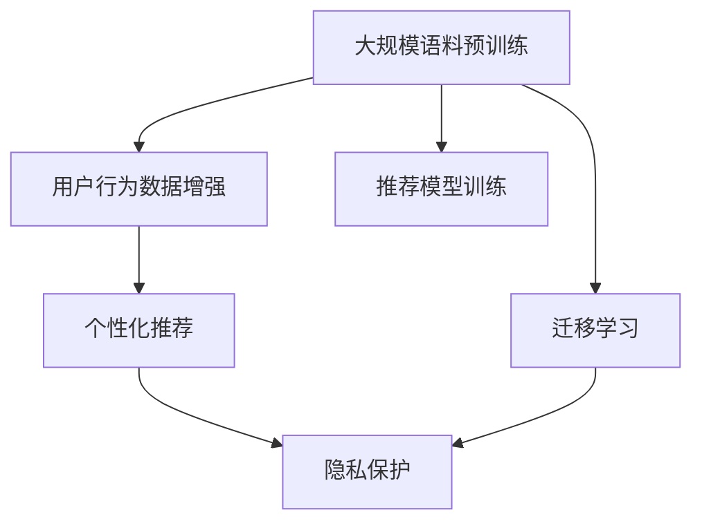

                 

# AI 大模型在电商搜索推荐中的用户行为分析：理解用户需求与购买意图

## 1. 背景介绍

### 1.1 问题由来

随着电子商务的蓬勃发展，电商平台已成为人们日常购物的重要渠道之一。然而，尽管信息量巨大，用户往往仍然难以快速找到心仪的商品。如何提升电商平台的搜索和推荐系统（Search & Recommendation, S&R）的效率和精准度，成为了各大电商巨头亟需解决的问题。

近年来，随着深度学习和大模型技术的迅速发展，基于大模型的推荐系统在电商领域逐渐崭露头角。其中，AI大模型通过大规模预训练，学习到丰富的语义表示和模式，能够有效提升用户搜索与推荐的准确性和体验。

以自然语言处理（Natural Language Processing, NLP）技术为代表的大模型，已经在电商搜索推荐中展现出巨大的潜力。通过分析用户的搜索、浏览、点击、购买等行为数据，大模型能够精准捕捉用户需求，提供个性化的推荐服务。

但与此同时，用户行为数据的获取和使用也面临着隐私保护、数据安全等挑战。如何在充分利用用户行为数据的同时，确保用户隐私和数据安全，成为电商平台亟需解决的问题。

### 1.2 问题核心关键点

AI大模型在电商搜索推荐中的应用，本质上是一个基于大规模语料库的迁移学习过程。其核心在于：

1. **大规模语料预训练**：利用大规模无标签数据进行预训练，学习通用的语言表示和知识。
2. **用户行为数据增强**：在预训练的基础上，通过收集和分析用户的搜索、浏览等行为数据，优化模型，提升推荐精准度。
3. **个性化推荐**：基于用户的行为数据，调整模型的输出，提供个性化的商品推荐。
4. **隐私保护**：在利用用户行为数据进行推荐时，保护用户隐私和数据安全。

以下本文将系统阐述AI大模型在电商搜索推荐中的应用，包括其原理、具体操作步骤、实际应用场景及面临的挑战。

## 2. 核心概念与联系

### 2.1 核心概念概述

为了深入理解AI大模型在电商搜索推荐中的应用，本节将介绍几个核心概念：

1. **大模型（Large Model）**：如BERT、GPT-3等，通过大规模语料预训练获得的预训练模型，具备强大的语言理解和生成能力。
2. **迁移学习（Transfer Learning）**：利用预训练模型在大规模数据上学习到的通用知识，通过微调（Fine-Tuning）优化，适应特定任务。
3. **用户行为数据（User Behavior Data）**：用户在电商平台上的搜索、浏览、点击、购买等行为数据，用于训练和优化推荐模型。
4. **个性化推荐（Personalized Recommendation）**：根据用户行为数据，调整模型输出，提供个性化的商品推荐。
5. **隐私保护（Privacy Preservation）**：在利用用户数据进行推荐时，保护用户隐私和数据安全。

### 2.2 核心概念原理和架构的 Mermaid 流程图



该流程图展示了AI大模型在电商搜索推荐中的核心流程：

1. **大规模语料预训练**：利用大规模无标签语料进行预训练，学习通用的语言表示。
2. **迁移学习**：将预训练模型应用到电商搜索推荐任务中，通过微调优化，适应特定任务。
3. **用户行为数据增强**：收集和分析用户行为数据，训练推荐模型。
4. **个性化推荐**：根据用户行为数据，调整推荐模型输出，提供个性化推荐。
5. **隐私保护**：在推荐过程中，确保用户数据的安全和隐私。

## 3. 核心算法原理 & 具体操作步骤

### 3.1 算法原理概述

AI大模型在电商搜索推荐中的应用，主要基于迁移学习和个性化推荐两大核心技术。其基本流程如下：

1. **大规模语料预训练**：利用大规模无标签数据进行预训练，学习通用的语言表示和知识。
2. **迁移学习**：将预训练模型应用到电商搜索推荐任务中，通过微调优化，适应特定任务。
3. **用户行为数据增强**：收集和分析用户搜索、浏览、点击、购买等行为数据，训练推荐模型。
4. **个性化推荐**：根据用户行为数据，调整模型输出，提供个性化推荐。
5. **隐私保护**：在推荐过程中，确保用户数据的安全和隐私。

### 3.2 算法步骤详解

以下详细介绍AI大模型在电商搜索推荐中的具体操作步骤：

**Step 1: 准备数据集**

1. **构建语料库**：收集电商网站的用户评论、产品描述、搜索查询等文本数据，构建大规模语料库。
2. **标注数据集**：利用用户的历史搜索、浏览、点击、购买等行为数据，构建标注数据集。

**Step 2: 预训练模型**

1. **选择合适的预训练模型**：如BERT、GPT-3等。
2. **进行预训练**：利用大规模语料库进行预训练，学习通用的语言表示和知识。

**Step 3: 微调模型**

1. **添加推荐层**：在预训练模型的顶层添加推荐层，如全连接层、注意力机制等。
2. **设定损失函数**：如交叉熵、均方误差等。
3. **进行微调**：利用标注数据集进行微调，优化推荐层的参数，适应电商搜索推荐任务。

**Step 4: 用户行为数据增强**

1. **收集用户数据**：收集用户的搜索、浏览、点击、购买等行为数据。
2. **数据预处理**：清洗、归一化、分词等预处理操作。
3. **特征工程**：提取和构造用户行为特征，如点击率、停留时间、购买历史等。

**Step 5: 个性化推荐**

1. **推荐模型训练**：利用用户行为数据训练个性化推荐模型。
2. **调整输出**：根据用户行为数据，调整模型的输出，提供个性化的商品推荐。

**Step 6: 隐私保护**

1. **数据脱敏**：对用户数据进行匿名化处理，确保用户隐私。
2. **安全存储**：采用加密存储技术，保护用户数据安全。

### 3.3 算法优缺点

AI大模型在电商搜索推荐中的应用，具有以下优点：

1. **精度高**：利用大规模语料预训练和用户行为数据增强，可以显著提升推荐精准度。
2. **泛化能力强**：大模型可以适应多种推荐场景，具备较强的泛化能力。
3. **可扩展性强**：大模型结构灵活，可以通过微调适应不同任务和数据分布。

但同时，也存在以下缺点：

1. **计算成本高**：大规模语料预训练和用户行为数据增强，需要大量的计算资源。
2. **隐私风险**：收集和分析用户行为数据可能带来隐私风险。
3. **模型复杂度高**：大模型结构复杂，需要精细调参和优化。

### 3.4 算法应用领域

AI大模型在电商搜索推荐中的应用，已经广泛应用于以下领域：

1. **个性化搜索**：根据用户的历史搜索行为，提供个性化的搜索结果。
2. **个性化推荐**：根据用户的行为数据，提供个性化的商品推荐。
3. **广告推荐**：根据用户行为数据，优化广告投放策略。
4. **客户服务**：利用大模型构建智能客服系统，提升用户体验。

## 4. 数学模型和公式 & 详细讲解 & 举例说明

### 4.1 数学模型构建

在电商搜索推荐中，可以利用AI大模型进行用户行为分析和推荐。假设用户历史行为数据为 $D=\{(x_i, y_i)\}_{i=1}^N$，其中 $x_i$ 为用户行为向量，$y_i$ 为商品标签。目标是通过微调优化模型参数 $\theta$，使得模型在预测用户购买行为时的误差最小化。

设推荐模型的损失函数为 $\ell(\theta)$，则最小化目标为：

$$
\hat{\theta} = \mathop{\arg\min}_{\theta} \frac{1}{N}\sum_{i=1}^N \ell(M_{\theta}(x_i), y_i)
$$

其中 $M_{\theta}$ 为预训练模型的输出，$\ell(\cdot)$ 为推荐模型的损失函数。

### 4.2 公式推导过程

假设推荐模型为线性模型，输出为：

$$
M_{\theta}(x_i) = \sum_{j=1}^d w_j x_{ij} + b
$$

其中 $w_j$ 为模型参数，$x_{ij}$ 为用户行为数据的第 $j$ 个特征，$b$ 为偏置项。

利用平方误差作为损失函数：

$$
\ell(M_{\theta}(x_i), y_i) = (M_{\theta}(x_i) - y_i)^2
$$

则模型整体损失函数为：

$$
\mathcal{L}(\theta) = \frac{1}{N}\sum_{i=1}^N (M_{\theta}(x_i) - y_i)^2
$$

利用梯度下降等优化算法更新参数：

$$
\theta \leftarrow \theta - \eta \nabla_{\theta}\mathcal{L}(\theta)
$$

其中 $\eta$ 为学习率。

### 4.3 案例分析与讲解

以某电商平台的用户行为数据为例，分析其基于AI大模型的推荐系统。

假设用户历史搜索记录为 $D=\{(x_1, y_1), (x_2, y_2), \ldots, (x_N, y_N)\}$，其中 $x_i = [b_i, c_i, d_i]$ 为用户第 $i$ 次搜索的查询词、停留时间和点击次数。预训练模型输出 $M_{\theta}(x_i)$ 为商品推荐概率，$y_i$ 为商品是否被购买。

根据上述模型和公式，计算推荐模型的损失函数：

$$
\mathcal{L}(\theta) = \frac{1}{N}\sum_{i=1}^N (M_{\theta}(x_i) - y_i)^2
$$

利用梯度下降等优化算法更新参数：

$$
\theta \leftarrow \theta - \eta \frac{1}{N}\sum_{i=1}^N (M_{\theta}(x_i) - y_i) \nabla_{\theta} M_{\theta}(x_i)
$$

其中 $\nabla_{\theta} M_{\theta}(x_i) = [w_1 \nabla_{\theta} b_i + w_2 \nabla_{\theta} c_i + w_3 \nabla_{\theta} d_i]$。

通过不断迭代优化，模型将学习到如何将用户搜索行为映射到商品推荐概率，实现精准推荐。

## 5. 项目实践：代码实例和详细解释说明

### 5.1 开发环境搭建

在进行电商搜索推荐系统的开发前，需要搭建好开发环境。以下是使用Python进行TensorFlow开发的环境配置流程：

1. 安装Anaconda：从官网下载并安装Anaconda，用于创建独立的Python环境。

2. 创建并激活虚拟环境：
```bash
conda create -n tf-env python=3.8 
conda activate tf-env
```

3. 安装TensorFlow：根据CUDA版本，从官网获取对应的安装命令。例如：
```bash
conda install tensorflow -c conda-forge -c pytorch -c pypi
```

4. 安装TensorBoard：
```bash
pip install tensorboard
```

5. 安装Flask：
```bash
pip install flask
```

6. 安装其他依赖包：
```bash
pip install pandas numpy scikit-learn joblib jupyter notebook
```

完成上述步骤后，即可在`tf-env`环境中开始电商搜索推荐系统的开发。

### 5.2 源代码详细实现

下面我们以电商推荐系统为例，给出使用TensorFlow对大模型进行微调的代码实现。

首先，定义推荐模型：

```python
import tensorflow as tf
from tensorflow.keras import layers

# 定义推荐模型
class RecommendationModel(tf.keras.Model):
    def __init__(self, vocab_size, embedding_dim, num_heads, num_layers, num_classes):
        super(RecommendationModel, self).__init__()
        self.embedding = layers.Embedding(vocab_size, embedding_dim)
        self.encoder = layers.Transformer(encoder_layers=num_layers, num_heads=num_heads)
        self.dropout = layers.Dropout(0.1)
        self.dense = layers.Dense(num_classes, activation='sigmoid')

    def call(self, x):
        x = self.embedding(x)
        x = self.encoder(x, mask=True)
        x = self.dropout(x)
        x = self.dense(x)
        return x
```

然后，定义推荐数据集：

```python
import pandas as pd

# 定义推荐数据集
train_data = pd.read_csv('train.csv', index_col='id')
test_data = pd.read_csv('test.csv', index_col='id')

# 构建特征
def build_features(data):
    features = {}
    features['b'] = data['query'].apply(lambda x: x.split().count())  # 查询词数量
    features['c'] = data['duration']  # 停留时间
    features['d'] = data['click']  # 点击次数
    return features

# 特征工程
train_features = train_data.apply(build_features, axis=1)
test_features = test_data.apply(build_features, axis=1)

# 编码数据
tokenizer = tf.keras.preprocessing.text.Tokenizer()
tokenizer.fit_on_texts(train_data['query'])
train_sequences = tokenizer.texts_to_sequences(train_features['b'])
test_sequences = tokenizer.texts_to_sequences(test_features['b'])

# 构建数据集
train_dataset = tf.data.Dataset.from_tensor_slices((train_sequences, train_features['c'].values, train_features['d'].values))
train_dataset = train_dataset.shuffle(buffer_size=1000).batch(batch_size=32)
```

接着，定义训练和评估函数：

```python
# 定义训练函数
def train_step(optimizer, train_dataset):
    @tf.function
    def train_step_fn(inputs, labels):
        with tf.GradientTape() as tape:
            predictions = model(inputs, training=True)
            loss = tf.losses.mean_squared_error(labels, predictions)
        gradients = tape.gradient(loss, model.trainable_variables)
        optimizer.apply_gradients(zip(gradients, model.trainable_variables))
        return loss

    total_loss = 0.0
    for step, (inputs, labels) in enumerate(train_dataset):
        loss = train_step_fn(inputs, labels)
        total_loss += loss
    return total_loss / len(train_dataset)

# 定义评估函数
def evaluate_model(model, test_dataset):
    predictions = []
    labels = []
    for inputs, labels in test_dataset:
        predictions.append(model(inputs).numpy())
        labels.append(labels.numpy())
    return predictions, labels
```

最后，启动训练流程并在测试集上评估：

```python
# 加载预训练模型
model = RecommendationModel(vocab_size, embedding_dim, num_heads, num_layers, num_classes)
model.load_weights('pretrained_weights.h5')

# 定义优化器
optimizer = tf.keras.optimizers.Adam(learning_rate=learning_rate)

# 训练模型
epochs = 10
batch_size = 32
for epoch in range(epochs):
    train_loss = train_step(optimizer, train_dataset)
    print(f'Epoch {epoch+1}/{epochs}, Train Loss: {train_loss:.4f}')
    
    # 评估模型
    predictions, labels = evaluate_model(model, test_dataset)
    mse = tf.reduce_mean(tf.square(predictions - labels))
    print(f'Epoch {epoch+1}/{epochs}, Test MSE: {mse:.4f}')
    
# 保存模型
model.save('recommendation_model.h5')
```

以上就是使用TensorFlow对大模型进行电商推荐系统微调的完整代码实现。可以看到，TensorFlow提供了强大的模型构建和训练工具，使得模型开发和微调变得更加高效。

### 5.3 代码解读与分析

让我们再详细解读一下关键代码的实现细节：

**RecommendationModel类**：
- `__init__`方法：初始化模型的各个组件，如嵌入层、Transformer层、Dropout层、全连接层等。
- `call`方法：定义模型前向传播的计算过程。

**特征工程**：
- `build_features`方法：提取用户搜索行为的关键特征，如查询词数量、停留时间、点击次数等。
- `train_features`和`test_features`：利用`build_features`方法对训练集和测试集进行特征工程。

**编码数据**：
- 使用`Tokenizer`将查询词序列转换为数字序列，以便模型处理。

**训练和评估函数**：
- `train_step`函数：定义单批次训练过程，计算损失函数并更新模型参数。
- `evaluate_model`函数：定义模型在测试集上的评估过程，计算均方误差。

**训练流程**：
- 循环迭代多次，每次在训练集上进行一次完整训练，并计算平均损失。
- 在每次迭代结束后，在测试集上评估模型性能。
- 保存最终训练好的模型。

可以看到，TensorFlow提供了丰富的API和工具，使得模型构建、训练和评估变得高效便捷。开发者只需关注核心逻辑，而无需过多关注底层的细节。

## 6. 实际应用场景

### 6.1 智能客服系统

基于AI大模型的智能客服系统，可以为用户提供7x24小时不间断的咨询服务，解决用户在购物过程中遇到的各种问题。

在技术实现上，可以收集用户与客服的对话记录，将问题-答案对作为监督数据，训练大模型进行问答。微调后的模型能够自动理解用户意图，匹配最合适的答案，提供即时响应。对于复杂问题，可以接入检索系统实时搜索相关内容，动态生成回答。如此构建的智能客服系统，能够显著提升客户咨询体验，减少客服人员的工作量。

### 6.2 商品推荐系统

电商平台的商品推荐系统，通过分析用户的历史搜索、浏览、点击、购买等行为数据，可以精准推荐用户可能感兴趣的商品，提升用户体验和销售转化率。

在推荐模型中，利用AI大模型进行用户行为分析，提取和构造用户行为特征，训练推荐模型。微调后的模型能够根据用户行为数据，调整推荐输出，提供个性化的商品推荐。如此构建的商品推荐系统，能够有效提升用户的购物体验，增加平台的销售收入。

### 6.3 个性化广告投放

在电商平台上，广告推荐系统可以通过分析用户的浏览和购买行为，精准投放个性化广告，提升广告的点击率和转化率。

在广告推荐模型中，利用AI大模型进行用户行为分析，提取和构造用户行为特征，训练推荐模型。微调后的模型能够根据用户行为数据，调整推荐输出，提供个性化的广告推荐。如此构建的广告推荐系统，能够显著提升广告投放的精准度和效果，增加平台的广告收入。

### 6.4 未来应用展望

随着AI大模型的不断发展，其在电商搜索推荐中的应用也将不断拓展和深化。未来，大模型将能够更好地理解和预测用户需求，提升推荐系统的精准度和用户体验。

1. **多模态融合**：结合图像、视频等多模态数据，进一步提升推荐系统的精度和丰富度。
2. **实时学习**：利用在线学习技术，实时更新模型参数，适应数据分布的变化。
3. **隐私保护**：在推荐过程中，采用差分隐私等技术，确保用户数据的隐私和安全。
4. **跨领域迁移**：在大模型上进行跨领域迁移学习，提升推荐系统在不同领域中的应用效果。
5. **知识图谱结合**：结合知识图谱，增强推荐系统的推理能力，提供更全面的商品信息。

## 7. 工具和资源推荐

### 7.1 学习资源推荐

为了帮助开发者系统掌握AI大模型在电商搜索推荐中的应用，这里推荐一些优质的学习资源：

1. TensorFlow官方文档：提供了丰富的API和教程，帮助你快速上手使用TensorFlow进行模型构建和训练。
2. TensorFlow实战深度学习：一本实战性的TensorFlow书籍，涵盖了从模型构建到调参优化的全过程。
3. HuggingFace官方文档：提供了丰富的预训练模型和工具，帮助你高效开发和部署推荐系统。
4. NLP实战项目：提供了一系列NLP项目的案例和代码，帮助你掌握实际应用中的技巧。
5. Kaggle竞赛平台：提供了众多电商推荐领域的竞赛项目，可以让你在实际应用中提升自己的能力。

通过对这些资源的学习实践，相信你一定能够快速掌握AI大模型在电商搜索推荐中的应用，并用于解决实际的电商推荐问题。

### 7.2 开发工具推荐

高效的工具是模型开发不可或缺的助力。以下是几款用于电商推荐系统开发的常用工具：

1. TensorFlow：提供了强大的深度学习框架，支持模型构建、训练和部署。
2. Keras：一个高层API，简化了模型的构建和训练过程，适合快速原型开发。
3. Flask：一个轻量级的Web框架，方便搭建API接口，实现模型服务化。
4. TensorBoard：一个可视化工具，实时监测模型训练过程，提供丰富的图表和指标。
5. Google Colab：一个免费的在线Jupyter Notebook环境，方便快速搭建和测试模型。

合理利用这些工具，可以显著提升电商推荐系统的开发效率，加快创新迭代的步伐。

### 7.3 相关论文推荐

AI大模型在电商搜索推荐中的应用，得益于学界的持续研究。以下是几篇奠基性的相关论文，推荐阅读：

1. Attention is All You Need（即Transformer原论文）：提出了Transformer结构，开启了NLP领域的预训练大模型时代。
2. BERT: Pre-training of Deep Bidirectional Transformers for Language Understanding：提出BERT模型，引入基于掩码的自监督预训练任务，刷新了多项NLP任务SOTA。
3. Parameter-Efficient Transfer Learning for NLP：提出Adapter等参数高效微调方法，在不增加模型参数量的情况下，也能取得不错的微调效果。
4. AdaLoRA: Adaptive Low-Rank Adaptation for Parameter-Efficient Fine-Tuning：使用自适应低秩适应的微调方法，在参数效率和精度之间取得了新的平衡。
5. Next steps towards 1k language models: achieving 1.6 billion parameters with Transformer-XL：提出Transformer-XL模型，探索大模型的参数扩展性，为电商推荐系统提供了新的思路。

这些论文代表了大模型在电商搜索推荐中的应用方向，通过学习这些前沿成果，可以帮助研究者把握学科前进方向，激发更多的创新灵感。

## 8. 总结：未来发展趋势与挑战

### 8.1 研究成果总结

本文对AI大模型在电商搜索推荐中的应用进行了全面系统的介绍。首先阐述了电商搜索推荐问题的背景和挑战，明确了AI大模型在其中的关键作用。其次，从原理到实践，详细讲解了AI大模型在电商搜索推荐中的具体操作方法和实施步骤。同时，本文还广泛探讨了AI大模型在电商搜索推荐中的应用场景，展示了其巨大的潜力。最后，本文讨论了AI大模型在电商搜索推荐中面临的挑战和未来的发展方向，为相关研究提供了有力的参考。

通过本文的系统梳理，可以看到，AI大模型在电商搜索推荐中的应用，已经展现出巨大的潜力和发展前景。利用大模型进行用户行为分析，提供个性化的推荐服务，能够显著提升电商平台的用户体验和业务价值。

### 8.2 未来发展趋势

展望未来，AI大模型在电商搜索推荐中的应用将呈现以下几个发展趋势：

1. **多模态融合**：结合图像、视频等多模态数据，进一步提升推荐系统的精度和丰富度。
2. **实时学习**：利用在线学习技术，实时更新模型参数，适应数据分布的变化。
3. **隐私保护**：在推荐过程中，采用差分隐私等技术，确保用户数据的隐私和安全。
4. **跨领域迁移**：在大模型上进行跨领域迁移学习，提升推荐系统在不同领域中的应用效果。
5. **知识图谱结合**：结合知识图谱，增强推荐系统的推理能力，提供更全面的商品信息。

这些趋势凸显了AI大模型在电商搜索推荐中的巨大潜力，未来将带来更加智能化、个性化、安全的购物体验。

### 8.3 面临的挑战

尽管AI大模型在电商搜索推荐中的应用已经取得了显著成效，但在迈向更加智能化、普适化应用的过程中，仍面临诸多挑战：

1. **计算成本高**：大规模语料预训练和用户行为数据增强，需要大量的计算资源。
2. **隐私风险**：收集和分析用户行为数据可能带来隐私风险。
3. **模型复杂度高**：大模型结构复杂，需要精细调参和优化。
4. **数据质量差**：电商平台上用户行为数据存在噪音和不一致性，需要有效的数据清洗和处理。
5. **跨领域泛化差**：电商领域与其他领域数据分布差异较大，模型跨领域泛化能力有待提高。

### 8.4 研究展望

面向未来，针对这些挑战，研究者需要在以下几个方面寻求新的突破：

1. **参数高效微调**：开发更加参数高效的微调方法，在固定大部分预训练参数的情况下，只更新极少量的任务相关参数。
2. **实时学习技术**：研究在线学习算法，实时更新模型参数，适应数据分布的变化。
3. **隐私保护技术**：采用差分隐私等技术，确保用户数据的隐私和安全。
4. **数据清洗和预处理**：研究和开发有效的数据清洗和预处理技术，提升数据质量。
5. **跨领域迁移学习**：在大模型上进行跨领域迁移学习，提升模型泛化能力。

这些研究方向将推动AI大模型在电商搜索推荐中的应用向更加智能化、普适化和安全化的方向发展。相信随着技术的不断进步，AI大模型将带来更加出色的推荐效果，为用户带来更加美好的购物体验。

## 9. 附录：常见问题与解答

**Q1：AI大模型在电商搜索推荐中的应用，需要多少计算资源？**

A: AI大模型在电商搜索推荐中的应用，需要大量的计算资源进行预训练和微调。具体来说，所需的计算资源取决于模型的规模和任务的复杂度。对于大规模的Transformer模型，通常需要多个GPU或TPU进行分布式训练。在实际应用中，可以通过参数高效的微调方法（如Adapter），在减少计算资源消耗的同时，仍然能够取得不错的微调效果。

**Q2：AI大模型在电商搜索推荐中的应用，是否需要大量标注数据？**

A: AI大模型在电商搜索推荐中的应用，通常需要大量标注数据进行微调。但在实际应用中，可以通过数据增强技术，利用少量标注数据和大量无标注数据进行微调。数据增强技术如回译、近义替换等，可以有效提升模型的泛化能力。此外，利用无监督学习技术，如预训练和自监督学习，也可以在一定程度上缓解对标注数据的需求。

**Q3：AI大模型在电商搜索推荐中的应用，是否存在数据隐私风险？**

A: 在电商搜索推荐中的应用，AI大模型需要收集和分析大量的用户行为数据。由于涉及用户的隐私，数据隐私风险是一个重要问题。为了保护用户隐私，可以采用数据脱敏、差分隐私等技术，确保用户数据的安全和隐私。此外，在数据收集和分析过程中，需要遵循相关法律法规，确保数据使用的合法性和合规性。

**Q4：AI大模型在电商搜索推荐中的应用，是否需要持续更新和维护？**

A: 由于电商领域的用户行为数据分布和市场环境不断变化，AI大模型在电商搜索推荐中的应用，需要持续更新和维护。可以通过在线学习、增量学习等技术，实时更新模型参数，适应数据分布的变化。此外，需要定期评估模型的性能，并根据评估结果进行模型更新和优化，确保推荐系统的准确性和可靠性。

**Q5：AI大模型在电商搜索推荐中的应用，是否需要大量标注数据？**

A: 在电商搜索推荐中的应用，AI大模型通常需要大量标注数据进行微调。但在实际应用中，可以通过数据增强技术，利用少量标注数据和大量无标注数据进行微调。数据增强技术如回译、近义替换等，可以有效提升模型的泛化能力。此外，利用无监督学习技术，如预训练和自监督学习，也可以在一定程度上缓解对标注数据的需求。

---

作者：禅与计算机程序设计艺术 / Zen and the Art of Computer Programming

